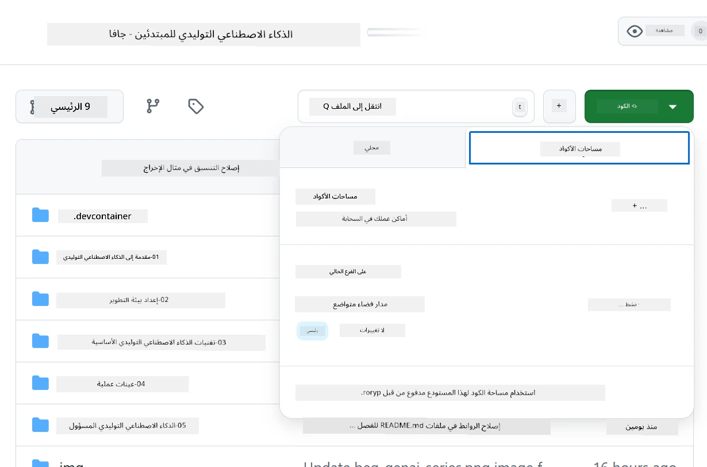
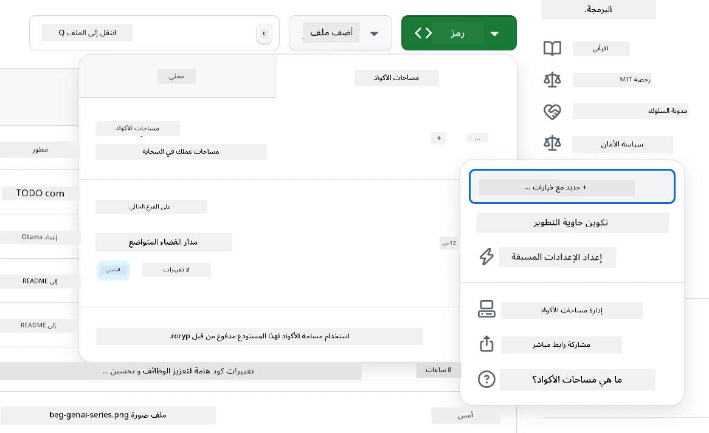
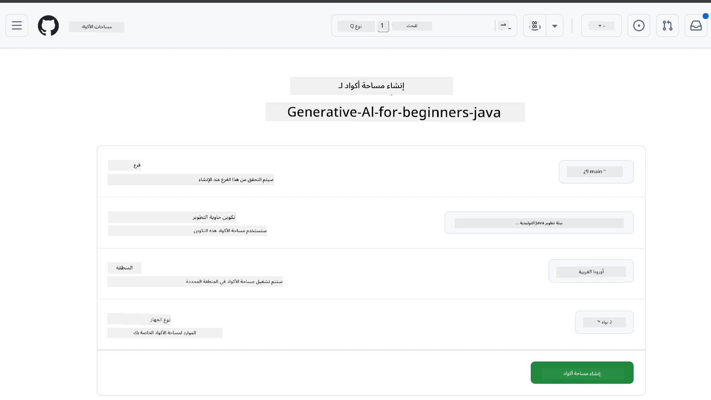
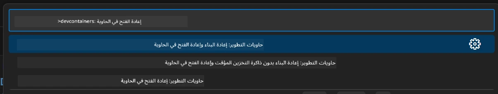
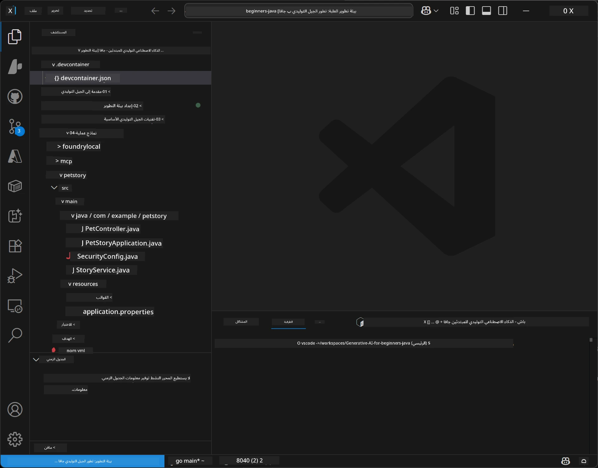
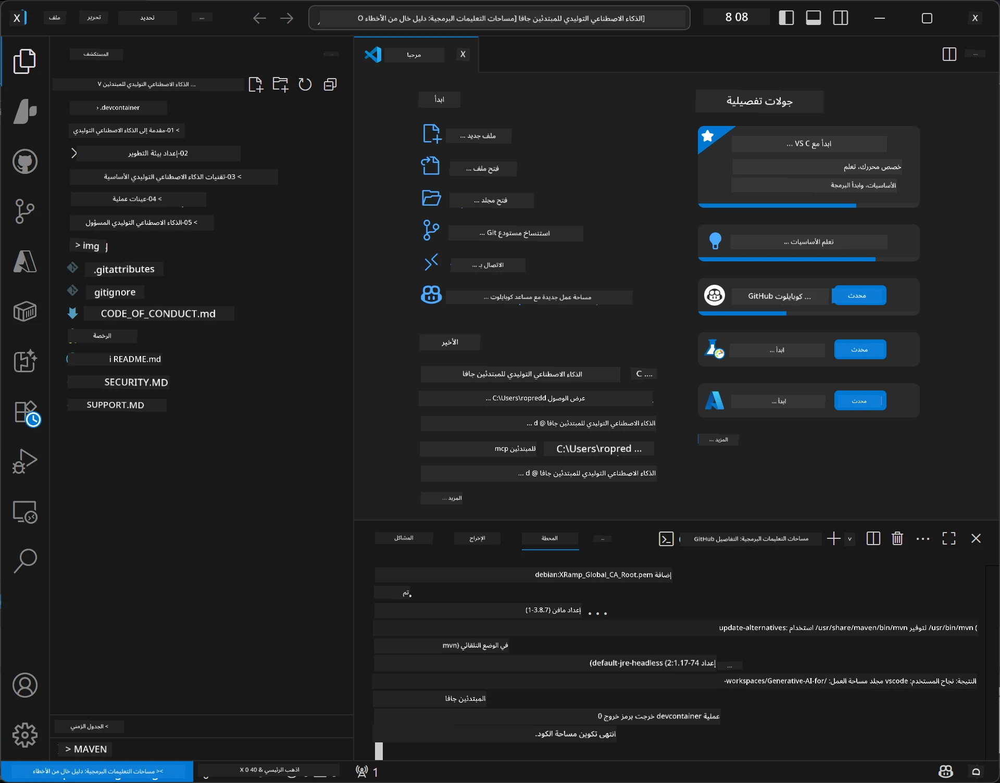

# إعداد بيئة التطوير للذكاء الاصطناعي التوليدي للجافا

> **بدء سريع:** قم بتوفير نماذج الذكاء الاصطناعي الخاصة بك على **Azure AI Foundry** ككود باستخدام Bicep + `azd` في بضع دقائق — راجع [دليل إعداد Azure AI Foundry](getting-started-azure-openai.md). المصادقة **بدون مفتاح** (Microsoft Entra ID)، لذا لا توجد مفاتيح API لإدارتها.

## ما ستتعلمه

- إعداد بيئة تطوير جافا لتطبيقات الذكاء الاصطناعي
- اختيار وتكوين بيئة التطوير المفضلة لديك (السحابة أولاً مع Codespaces، حاوية تطوير محلية، أو إعداد محلي كامل)
- اختبار إعدادك بالاتصال بنموذج Azure AI Foundry

## جدول المحتويات

- [ما ستتعلمه](#ما-ستتعلمه)
- [مقدمة](#مقدمة)
- [الخطوة 1: إعداد بيئة التطوير الخاصة بك](#الخطوة-1-إعداد-بيئة-التطوير-الخاصة-بك)
  - [الخيار أ: GitHub Codespaces (موصى به)](#الخيار-أ-github-codespaces-موصى-به)
  - [الخيار ب: حاوية التطوير المحلية](#الخيار-ب-حاوية-التطوير-المحلية)
  - [الخيار ج: استخدام التثبيت المحلي الموجود لديك](#الخيار-ج-استخدام-التثبيت-المحلي-الموجود-لديك)
- [الخطوة 2: توفير Azure AI Foundry](#الخطوة-2-توفير-azure-ai-foundry)
- [الخطوة 3: اختبار الإعداد](#الخطوة-3-اختبار-إعدادك)
- [استكشاف الأخطاء وإصلاحها](#استكشاف-الأخطاء-وإصلاحها)
- [الملخص](#ملخص)
- [الخطوات التالية](#الخطوات-التالية)

## مقدمة

سيرشدك هذا الفصل خلال إعداد بيئة تطوير. سنستخدم **Azure AI Foundry** للنماذج طوال هذه الدورة. تقوم بتوفير النماذج ككود باستخدام Bicep وAzure Developer CLI (`azd`)، ثم تتصل باستخدام **مصادقة بدون مفتاح** (Microsoft Entra ID) — لا مفاتيح API للنسخ أو التسريب.

**لا يتطلب إعداد محلي!** يمكنك استخدام GitHub Codespaces، الذي يوفر بيئة تطوير كاملة في متصفحك، وتوفير Foundry من هناك.

نستخدم **Azure AI Foundry** لهذه الدورة لأنه:
- **يتم توفيره ككود** — يقوم أمر واحد `azd up` بنشر الحساب ونشر النماذج
- **بدون مفتاح** — المصادقة باستخدام تسجيل الدخول إلى Azure الخاص بك أو هوية مُدارة
- **جاهز للإنتاج** — يعمل نفس الكود محليًا وفي Azure
- **مرن** — يمكن تبديل النماذج بتغيير اسم النشر، وليس الكود الخاص بك

> **ملاحظة**: يتم تحصيل تكلفة نشرات Azure AI Foundry بناءً على كل رمز مميز (ادفع حسب الاستخدام). انظر [دليل إعداد Azure AI Foundry](getting-started-azure-openai.md) للحصول على تفاصيل التوفير والمنطقة والتكلفة.


## الخطوة 1: إعداد بيئة التطوير الخاصة بك

<a name="quick-start-cloud"></a>

لقد أنشأنا حاوية تطوير مُعدة مسبقًا لتقليل وقت الإعداد وضمان حصولك على كل الأدوات اللازمة لهذه الدورة حول الذكاء الاصطناعي التوليدي للجافا. اختر طريقة التطوير المفضلة لديك:

### خيارات إعداد البيئة:

#### الخيار أ: GitHub Codespaces (موصى به)

**ابدأ البرمجة خلال دقيقتين - لا يتطلب إعدادًا محليًا!**

1. قم بعمل فورك لهذا المستودع إلى حساب GitHub الخاص بك
   > **ملاحظة**: إذا أردت تعديل التكوين الأساسي يرجى الاطلاع على [تكوين حاوية التطوير](../../../.devcontainer/devcontainer.json)
2. انقر **Code** → تبويب **Codespaces** → **...** → **New with options...**
3. استخدم الإعدادات الافتراضية – سيختار هذا **تكوين حاوية التطوير**: **بيئة تطوير جافا للذكاء الاصطناعي التوليدي** التي تم إنشاؤها خصيصًا لهذه الدورة
4. انقر **Create codespace**
5. انتظر حوالي دقيقتين حتى تكون البيئة جاهزة
6. تابع إلى [الخطوة 2: توفير Azure AI Foundry](#الخطوة-2-توفير-azure-ai-foundry)








> **مزايا Codespaces**:
> - لا يتطلب تثبيتًا محليًا
> - يعمل على أي جهاز مع متصفح
> - مهيأ مسبقًا بكل الأدوات والاعتمادات
> - 60 ساعة مجانية شهريًا للحسابات الشخصية
> - بيئة متسقة لجميع المتعلمين

#### الخيار ب: حاوية التطوير المحلية

**للمطورين الذين يفضلون التطوير المحلي باستخدام Docker**

1. قم بعمل فورك واستنساخ لهذا المستودع إلى جهازك المحلي
   > **ملاحظة**: إذا أردت تعديل التكوين الأساسي يرجى الاطلاع على [تكوين حاوية التطوير](../../../.devcontainer/devcontainer.json)
2. قم بتثبيت [Docker Desktop](https://www.docker.com/products/docker-desktop/) و[VS Code](https://code.visualstudio.com/)
3. قم بتثبيت امتداد [Dev Containers](https://marketplace.visualstudio.com/items?itemName=ms-vscode-remote.remote-containers) في VS Code
4. افتح مجلد المستودع في VS Code
5. عندما يُطلب منك، انقر **Reopen in Container** (أو استخدم `Ctrl+Shift+P` → "Dev Containers: Reopen in Container")
6. انتظر حتى يتم بناء وبدء الحاوية
7. تابع إلى [الخطوة 2: توفير Azure AI Foundry](#الخطوة-2-توفير-azure-ai-foundry)





#### الخيار ج: استخدام التثبيت المحلي الموجود لديك

**للمطورين الذين لديهم بيئات جافا موجودة**

المتطلبات الأساسية:
- [Java 21+](https://www.oracle.com/java/technologies/javase/jdk21-archive-downloads.html) 
- [Maven 3.9+](https://maven.apache.org/download.cgi)
- [VS Code](https://code.visualstudio.com) أو بيئة التطوير المفضلة لديك

الخطوات:
1. استنسخ هذا المستودع على جهازك المحلي
2. افتح المشروع في بيئة التطوير الخاصة بك
3. تابع إلى [الخطوة 2: توفير Azure AI Foundry](#الخطوة-2-توفير-azure-ai-foundry)

> **نصيحة احترافية**: إذا كان لديك جهاز منخفض المواصفات ولكنك تريد VS Code محليًا، استخدم GitHub Codespaces! يمكنك ربط VS Code المحلي الخاص بك بحيز سحابي مستضاف للاستفادة من أفضل الميزات.




## الخطوة 2: توفير Azure AI Foundry

نشر نماذج الذكاء الاصطناعي الخاصة بالدورة إلى Azure AI Foundry ككود. من جذر المستودع:

```bash
cd 02-SetupDevEnvironment
azd auth login
az login
azd up
```

يطلب `azd` اسم بيئة، اشتراك، ومنطقة، ويوفر حساب Azure AI Foundry مع نشرات `gpt-5.6-luna` و`text-embedding-3-small`، ويكتب نقطة النهاية في ملف `.env` الخاص بالمثال - كل ذلك مع مصادقة **بدون مفتاح** (لا مفاتيح API).

> **شرح كامل:** راجع [دليل إعداد Azure AI Foundry](getting-started-azure-openai.md) للمتطلبات المسبقة، البديل اليدوي (البوابة)، إرشادات المنطقة، وملاحظات التكلفة/التنظيف.

## الخطوة 3: اختبار إعدادك

بمجرد توفير نماذج Foundry، اختبر الاتصال باستخدام تطبيق المثال في [`02-SetupDevEnvironment/examples/basic-chat-azure`](../../../02-SetupDevEnvironment/examples/basic-chat-azure).

1. افتح الطرفية في بيئة التطوير الخاصة بك.
2. انتقل إلى المثال:
   ```bash
   cd 02-SetupDevEnvironment/examples/basic-chat-azure
   ```
3. تأكد من تسجيل دخولك (المصادقة بدون مفتاح تحتاج إلى رمز مميز):
   ```bash
   az login
   ```
   > إذا قمت بتشغيل `azd up`، فسيكون ملف `.env` يحتوي على نقطة النهاية قد تم إنشاؤه بالفعل لك.
4. شغّل التطبيق:
   ```bash
   mvn clean spring-boot:run
   ```

يجب أن ترى ردًا من نموذج `gpt-5.6-luna`.

### فهم كود المثال

يستخدم [مثال الدردشة الأساسية](./examples/basic-chat-azure/README.md) **Spring Boot 4.1.1** و**Spring AI 2.0.1**. يعتمد `ChatClient` في Spring AI على SDK الجافا الرسمي لـ OpenAI، متصلًا بـ Azure OpenAI **v1** مع مصادقة بدون مفتاح.

**ما يفعله هذا الكود:**
- **يتصل** بـ Azure AI Foundry باستخدام تسجيل الدخول إلى Azure الخاص بك (Microsoft Entra ID) — بدون مفتاح API
- **يرسل** مطالبة إلى نموذج `gpt-5.6-luna`
- **يتلقى** ويعرض رد الذكاء الاصطناعي
- **يتحقق** من أن إعدادك يعمل بشكل صحيح

**الاعتمادات الرئيسية** (مقتطف من [pom.xml](../../../02-SetupDevEnvironment/examples/basic-chat-azure/pom.xml)):
```xml
<dependency>
    <groupId>org.springframework.ai</groupId>
    <artifactId>spring-ai-starter-model-openai</artifactId>
</dependency>
<dependency>
    <groupId>com.openai</groupId>
    <artifactId>openai-java</artifactId>
</dependency>
<dependency>
    <groupId>com.azure</groupId>
    <artifactId>azure-identity</artifactId>
    <version>${azure-identity.version}</version>
</dependency>
```

يدير POM نسخة OpenAI Java **4.63.1** ويحدد Azure Identity **1.18.6** صراحةً. أزال Spring AI 2 المبدئ الخاص بـ Azure؛ لا تزال Azure Identity مطلوبة لحبة الاعتماد.

**التكوين** ([application.yml](../../../02-SetupDevEnvironment/examples/basic-chat-azure/src/main/resources/application.yml)):
```yaml
spring:
  ai:
    openai:
      base-url: ${AZURE_OPENAI_ENDPOINT}
      microsoft-foundry: true
      chat:
        model: ${AZURE_OPENAI_DEPLOYMENT:gpt-5.6-luna}
        reasoning-effort: none
        max-completion-tokens: 500
```

تم تكوين المصادقة بدون مفتاح صراحةً في [BasicChatApplication.java](../../../02-SetupDevEnvironment/examples/basic-chat-azure/src/main/java/com/example/BasicChatApplication.java)، وليس عن طريق استنباط من غياب مفتاح API. تستخدم بيانات اعتماد الحامل `DefaultAzureCredential` بنطاق `https://ai.azure.com/.default`، ويستهدف `OpenAIClient` المسار `/openai/v1`. يزود التطبيق هذا العميل لنموذج الدردشة في Spring AI، لذا لا يمكن لمتغير البيئة `OPENAI_API_KEY` العالمي تجاوز مصادقة Azure.

إعدادات الدردشة موجودة مباشرة تحت `spring.ai.openai.chat`، بدون كتلة `options`. تحتفظ الدرس بإكمالات الدردشة مع `reasoning-effort: none` وحد إكمال بحد أقصى 500 رمز مميز؛ لا يتم تعيين `temperature` أو `max-tokens`. انظر [مرجع تكوين المثال](./examples/basic-chat-azure/README.md#spring-configuration) لاختيار API والإرشادات الخاصة باستدعاء الأدوات.

## ملخص

بعد إكمال الخطوات أعلاه، سيكون لديك:

- نماذج Azure AI Foundry التي تم توفيرها ككود باستخدام Bicep + `azd`
- بيئة تطوير جافا عاملة لديك (سواء كانت Codespaces، حاويات التطوير، أو محليًا)
- اتصال بـ Azure AI Foundry بمصادقة بدون مفتاح (Microsoft Entra ID) — بدون مفاتيح API
- اختبار أن كل شيء يعمل بمثال بسيط يتحدث إلى نموذجك

## الخطوات التالية

[الفصل 3: تقنيات الذكاء الاصطناعي التوليدي الأساسية](../03-CoreGenerativeAITechniques/README.md)

## استكشاف الأخطاء وإصلاحها

تواجه مشكلات؟ إليك المشاكل الشائعة والحلول:

- **فشل المصادقة (401/403)؟** 
  - شغل `az login` — المصادقة بدون مفتاح، لذا يجب أن تكون مسجلاً للدخول
  - تحقق من أن حسابك لديه دور **مستخدم خدمات الإدراك OpenAI** على المورد
  - إذا قمت بالتوفير للتو، انتظر دقيقة لنشر تعيين الدور

- **لم يتم العثور على Maven؟** 
  - إذا كنت تستخدم حاويات التطوير/Codespaces، يجب أن يكون Maven مثبتًا مسبقًا
  - للإعداد المحلي، تأكد من تثبيت Java 21+ وMaven 3.9+
  - جرب `mvn --version` للتحقق من التثبيت

- **لم يتم العثور على `azd` أو فشل التوفير؟** 
  - ثبت [Azure Developer CLI](https://aka.ms/azure-dev/install) وشغل `azd auth login`
  - اختر منطقة حيث يكون `gpt-5.6-luna` و `text-embedding-3-small` متاحين (مثلاً `eastus2`)، مع توفير كافٍ في اشتراكك المختار
  - راجع [دليل إعداد Azure AI Foundry](getting-started-azure-openai.md) للتفاصيل

- **حاوية التطوير لا تبدأ؟** 
  - تأكد من أن Docker Desktop يعمل (للتطوير المحلي)
  - جرب إعادة بناء الحاوية: `Ctrl+Shift+P` → "Dev Containers: Rebuild Container"

- **أخطاء تجميع التطبيق؟**
  - تأكد من أنك في الدليل الصحيح: `02-SetupDevEnvironment/examples/basic-chat-azure`
  - حاول التنظيف وإعادة البناء: `mvn clean compile`

> **تحتاج مساعدة؟**: ما زلت تواجه مشكلات؟ افتح قضية في المستودع وسنساعدك.

---

<!-- CO-OP TRANSLATOR DISCLAIMER START -->
**تنويه**:
تمت ترجمة هذا المستند باستخدام خدمة الترجمة بالذكاء الاصطناعي [Co-op Translator](https://github.com/Azure/co-op-translator). بينما نسعى للدقة، يرجى العلم أن الترجمات الآلية قد تحتوي على أخطاء أو عدم دقة. يجب اعتبار المستند الأصلي بلغته الأصلية المصدر الرسمي والمعتمد. للمعلومات الهامة، يُنصح بالاستعانة بترجمة بشرية محترفة. نحن غير مسؤولين عن أي سوء فهم أو تفسير ناتج عن استخدام هذه الترجمة.
<!-- CO-OP TRANSLATOR DISCLAIMER END -->