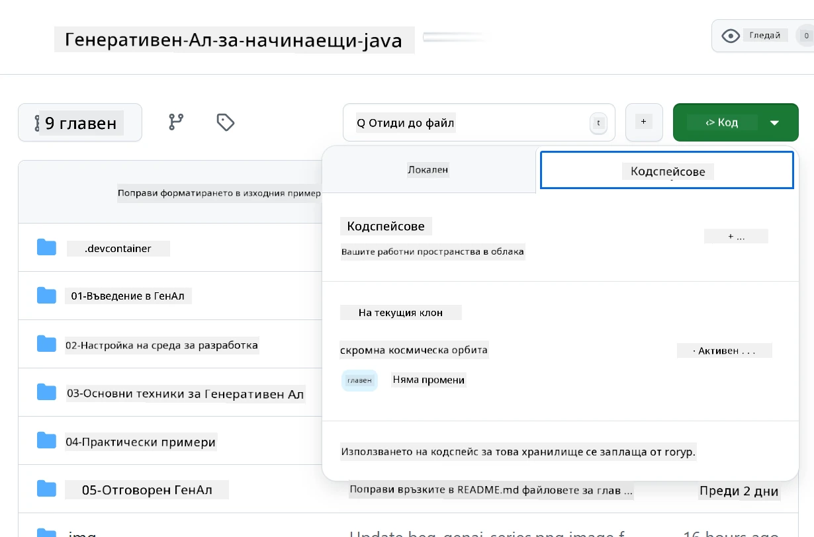
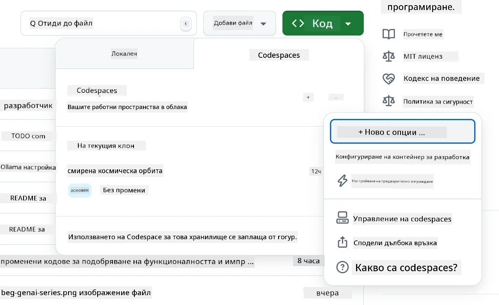
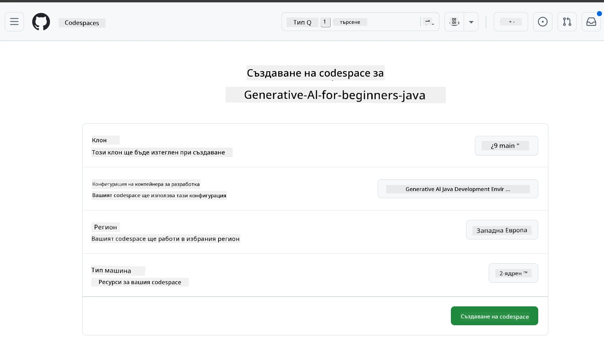
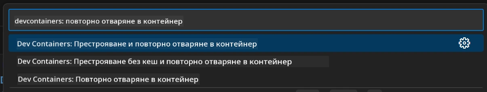
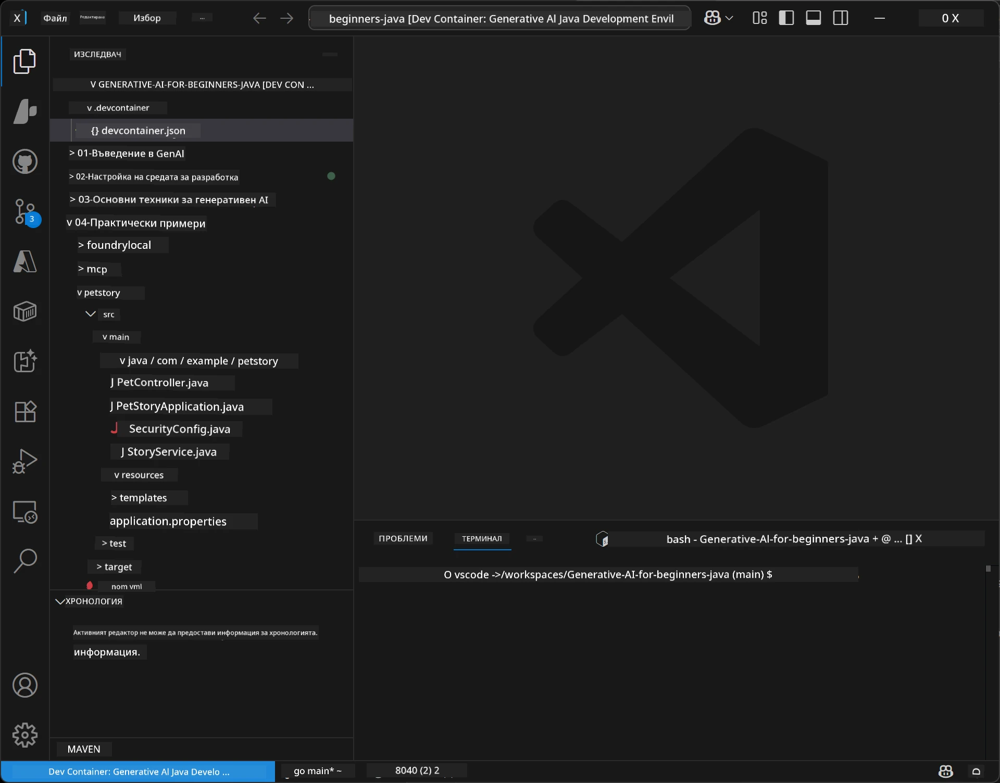
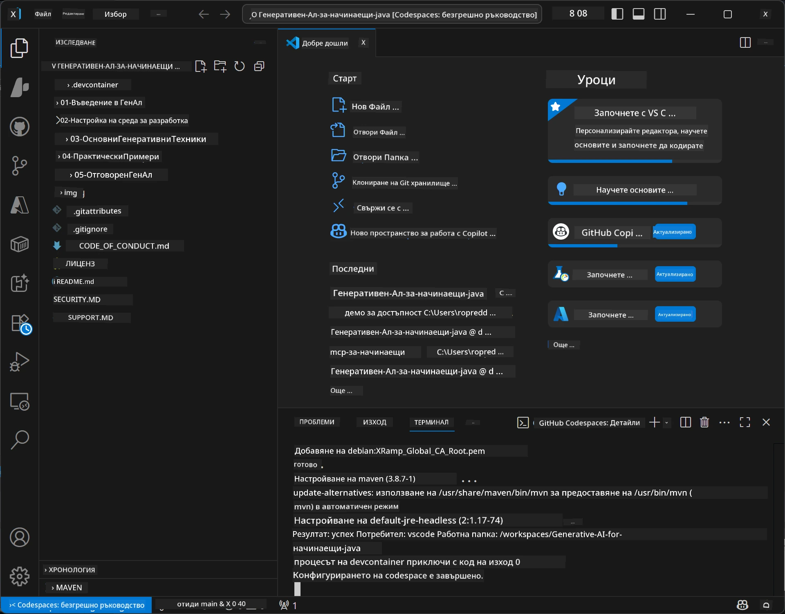

# Настройване на средата за разработка за Generative AI за Java

> **Бърз старт:** Осигурете AI моделите си в **Azure AI Foundry** като код с Bicep + `azd` за няколко минути — вижте [Ръководството за настройка на Azure AI Foundry](getting-started-azure-openai.md). Удостоверяването е **без ключ** (Microsoft Entra ID), така че няма API ключове за управление.

## Какво ще научите

- Настройване на среда за разработка на Java за AI приложения
- Избиране и конфигуриране на предпочитаната среда за разработка (cloud-first с Codespaces, локален dev контейнер или пълна локална инсталация)
- Тест на настройката чрез свързване с модел от Azure AI Foundry

## Съдържание

- [Какво ще научите](#какво-ще-научите)
- [Въведение](#въведение)
- [Стъпка 1: Настройване на средата за разработка](#стъпка-1-настройване-на-средата-за-разработка)
  - [Опция A: GitHub Codespaces (Препоръчано)](#опция-a-github-codespaces-препоръчано)
  - [Опция B: Локален Dev контейнер](#опция-b-локален-dev-контейнер)
  - [Опция C: Използване на вече съществуваща локална инсталация](#опция-c-използване-на-вече-съществуваща-локална-инсталация)
- [Стъпка 2: Осигуряване на Azure AI Foundry](#стъпка-2-осигуряване-на-azure-ai-foundry)
- [Стъпка 3: Тест на настройката](#стъпка-3-тест-на-настройката)
- [Отстраняване на неизправности](#отстраняване-на-неизправности)
- [Резюме](#резюме)
- [Следващи стъпки](#следващи-стъпки)

## Въведение

Тази глава ще ви преведе през настройването на средата за разработка. Ще използваме **Azure AI Foundry** за моделите през целия курс. Осигурявате моделите като код с Bicep и Azure Developer CLI (`azd`), след което се свързвате с **удостоверяване без ключ** (Microsoft Entra ID) — без API ключове за копиране или изтичане.

**Не се изисква локална настройка!** Можете да използвате GitHub Codespaces, което предоставя пълна среда за разработка в браузъра ви и да осигурите Foundry оттам.

Използваме **Azure AI Foundry** за този курс, защото е:
- **Осигурен като код** — една команда `azd up` разгръща акаунта и разгръщанията на моделите
- **Без ключ** — удостоверявате се с вашия Azure вход или управлявана самоличност
- **Готов за продукция** — същият код работи локално и в Azure
- **Гъвкав** — сменяте модели чрез промяна на името на разгръщането, а не на кода

> **Забележка**: Разгръщанията в Azure AI Foundry се таксуват на токен (pay-as-you-go). Вижте [Ръководството за настройка на Azure AI Foundry](getting-started-azure-openai.md) за детайли относно осигуряване, регион и цени.


## Стъпка 1: Настройване на средата за разработка

<a name="quick-start-cloud"></a>

Създадохме предварително конфигуриран контейнер за разработка, за да минимизираме времето за настройка и да осигурим всички необходими инструменти за този курс Generative AI за Java. Изберете предпочитания си подход за разработка:

### Опции за настройка на средата:

#### Опция A: GitHub Codespaces (Препоръчано)

**Започнете да кодирате за 2 минути - не се изисква локална настройка!**

1. Форкнете това хранилище във вашия GitHub акаунт
   > **Забележка**: Ако искате да редактирате основната конфигурация, моля, разгледайте [Dev Container Configuration](../../../.devcontainer/devcontainer.json)
2. Кликнете **Code** → раздел **Codespaces** → **...** → **New with options...**
3. Използвайте настройките по подразбиране – това ще избере **Dev container configuration**: **Generative AI Java Development Environment** персонализиран devcontainer, създаден за този курс
4. Кликнете **Create codespace**
5. Изчакайте ~2 минути, докато средата се подготви
6. Продължете към [Стъпка 2: Осигуряване на Azure AI Foundry](#стъпка-2-осигуряване-на-azure-ai-foundry)








> **Предимства на Codespaces**:
> - Не се налага локална инсталация
> - Работи на всяко устройство с браузър
> - Предварително конфигуриран с всички инструменти и зависимости
> - Безплатни 60 часа на месец за лични акаунти
> - Еднаква среда за всички обучаващи се

#### Опция B: Локален Dev контейнер

**За разработчици, които предпочитат локална разработка с Docker**

1. Форкнете и клонирайте това хранилище на локалната си машина
   > **Забележка**: Ако искате да редактирате основната конфигурация, разгледайте [Dev Container Configuration](../../../.devcontainer/devcontainer.json)
2. Инсталирайте [Docker Desktop](https://www.docker.com/products/docker-desktop/) и [VS Code](https://code.visualstudio.com/)
3. Инсталирайте [Dev Containers разширението](https://marketplace.visualstudio.com/items?itemName=ms-vscode-remote.remote-containers) във VS Code
4. Отворете папката на хранилището във VS Code
5. При подкана кликнете **Reopen in Container** (или използвайте `Ctrl+Shift+P` → "Dev Containers: Reopen in Container")
6. Изчакайте контейнерът да се изгради и стартира
7. Продължете към [Стъпка 2: Осигуряване на Azure AI Foundry](#стъпка-2-осигуряване-на-azure-ai-foundry)





#### Опция C: Използване на вече съществуваща локална инсталация

**За разработчици с вече съществуващи Java среди**

Предварителни изисквания:
- [Java 21+](https://www.oracle.com/java/technologies/javase/jdk21-archive-downloads.html) 
- [Maven 3.9+](https://maven.apache.org/download.cgi)
- [VS Code](https://code.visualstudio.com) или предпочитаната ви IDE

Стъпки:
1. Клонирайте това хранилище на локалната си машина
2. Отворете проекта в IDE-то си
3. Продължете към [Стъпка 2: Осигуряване на Azure AI Foundry](#стъпка-2-осигуряване-на-azure-ai-foundry)

> **Професионален съвет**: Ако имате машина със слаби характеристики, но искате VS Code локално, използвайте GitHub Codespaces! Можете да свържете локалното си VS Code към cloud-hosted Codespace за най-доброто от двата свята.




## Стъпка 2: Осигуряване на Azure AI Foundry

Разгърнете AI моделите на курса в Azure AI Foundry като код. От корена на хранилището:

```bash
cd 02-SetupDevEnvironment
azd auth login
az login
azd up
```

Командата `azd` ще поиска име на среда, абонамент и регион, ще осигури Azure AI Foundry акаунт с разгръщания `gpt-5.6-luna` и `text-embedding-3-small`, и ще запише крайния адрес в `.env` на примера – всичко с **удостоверяване без ключ** (без API ключове).

> **Пълно ръководство:** Вижте [Ръководството за настройка на Azure AI Foundry](getting-started-azure-openai.md) за предпоставки, ръчен (портален) вариант, информация за региони и бележки относно разходи и почистване.

## Стъпка 3: Тест на настройката

След като моделите във Foundry са осигурени, тествайте връзката с примерното приложение в [`02-SetupDevEnvironment/examples/basic-chat-azure`](../../../02-SetupDevEnvironment/examples/basic-chat-azure).

1. Отворете терминала в средата си за разработка.
2. Навигирайте до примера:
   ```bash
   cd 02-SetupDevEnvironment/examples/basic-chat-azure
   ```
3. Уверете се, че сте влезли (удостоверяването без ключ изисква токен):
   ```bash
   az login
   ```
   > Ако сте изпълнили `azd up`, файлът `.env` с крайния адрес вече е записан за вас.
4. Стартирайте приложението:
   ```bash
   mvn clean spring-boot:run
   ```

Трябва да видите отговор от модела `gpt-5.6-luna`.

### Разбиране на примерния код

Примерът [basic-chat](./examples/basic-chat-azure/README.md) използва **Spring Boot 4.1.1** и **Spring AI 2.0.1**. `ChatClient` от Spring AI е базиран на официалния OpenAI Java SDK, свързващ се с Azure OpenAI **v1** крайна точка с удостоверяване без ключ.

**Какво прави този код:**
- **Свързва се** с Azure AI Foundry чрез вашето Azure влизане (Microsoft Entra ID) — без API ключ
- **Изпраща** съобщение към модела `gpt-5.6-luna`
- **Получава** и показва отговора на AI
- **Потвърждава** че настройката работи правилно

**Ключови зависимости** (откъс от [pom.xml](../../../02-SetupDevEnvironment/examples/basic-chat-azure/pom.xml)):
```xml
<dependency>
    <groupId>org.springframework.ai</groupId>
    <artifactId>spring-ai-starter-model-openai</artifactId>
</dependency>
<dependency>
    <groupId>com.openai</groupId>
    <artifactId>openai-java</artifactId>
</dependency>
<dependency>
    <groupId>com.azure</groupId>
    <artifactId>azure-identity</artifactId>
    <version>${azure-identity.version}</version>
</dependency>
```

POM управлява OpenAI Java **4.63.1** и задава Azure Identity **1.18.6** експлицитно. Spring AI 2 премахна специфичния Azure стартер; Azure Identity все още е нужна за bean-а с креденциалите.

**Конфигурация** ([application.yml](../../../02-SetupDevEnvironment/examples/basic-chat-azure/src/main/resources/application.yml)):
```yaml
spring:
  ai:
    openai:
      base-url: ${AZURE_OPENAI_ENDPOINT}
      microsoft-foundry: true
      chat:
        model: ${AZURE_OPENAI_DEPLOYMENT:gpt-5.6-luna}
        reasoning-effort: none
        max-completion-tokens: 500
```

Удостоверяването без ключ е конфигурирано експлицитно в [BasicChatApplication.java](../../../02-SetupDevEnvironment/examples/basic-chat-azure/src/main/java/com/example/BasicChatApplication.java), не се извлича от липсата на API ключ. Той използва `DefaultAzureCredential` с обхват `https://ai.azure.com/.default`, а `OpenAIClient` насочва към `/openai/v1`. Приложението подава този клиент на чат модела на Spring AI, така че глобалният `OPENAI_API_KEY` не може да замести Azure удостоверяването.

Настройките на чата са директно под `spring.ai.openai.chat`, без блок `options`. Урокът запазва Chat Completions с `reasoning-effort: none` и лимит на 500 токена; не задава `temperature` или `max-tokens`. Вижте [референцията на конфигурацията на примера](./examples/basic-chat-azure/README.md#spring-configuration) за избор на API и насоки за извикване на инструменти.

## Резюме

След изпълнение на горните стъпки ще имате:

- Осигурени модели Azure AI Foundry като код с Bicep + `azd`
- Настроена Java среда за разработка (било то Codespaces, dev контейнери или локална)
- Свързана към Azure AI Foundry с удостоверяване без ключ (Microsoft Entra ID) — без API ключове
- Тествана с прост пример, който комуникира с вашия модел

## Следващи стъпки

[Глава 3: Основни техники за Generative AI](../03-CoreGenerativeAITechniques/README.md)

## Отстраняване на неизправности

Имате проблеми? Ето общи проблеми и решения:

- **Удостоверяване неуспешно (401/403)?** 
  - Изпълнете `az login` — удостоверяването е без ключ, затова трябва да сте влезли
  - Проверете дали акаунтът ви има роля **Cognitive Services OpenAI User** върху ресурса
  - Ако току-що сте осигурили, изчакайте минута за разпространение на ролевото присвояване

- **Maven не е намерен?** 
  - Ако използвате dev контейнери/Codespaces, Maven трябва да е предварително инсталиран
  - За локална настройка, уверете се, че Java 21+ и Maven 3.9+ са инсталирани
  - Изпълнете `mvn --version`, за да проверите инсталацията

- **`azd` не е намерен или осигуряването неуспешно?** 
  - Инсталирайте [Azure Developer CLI](https://aka.ms/azure-dev/install) и изпълнете `azd auth login`
  - Изберете регион, където има `gpt-5.6-luna` и `text-embedding-3-small` (напр. `eastus2`), с достатъчна квота в избрания абонамент
  - Вижте [Ръководството за настройка на Azure AI Foundry](getting-started-azure-openai.md) за подробности

- **Dev контейнерът не стартира?** 
  - Уверете се, че Docker Desktop работи (за локална разработка)
  - Опитайте да преизградите контейнера: `Ctrl+Shift+P` → "Dev Containers: Rebuild Container"

- **Грешки при компилиране на приложението?**
  - Уверете се, че сте в правилната директория: `02-SetupDevEnvironment/examples/basic-chat-azure`
  - Опитайте чистене и повторно компилиране: `mvn clean compile`

> **Имате нужда от помощ?**: Все още имате проблеми? Отворете проблем в хранилището и ще ви помогнем.

---

<!-- CO-OP TRANSLATOR DISCLAIMER START -->
**Отказ от отговорност**:
Този документ е преведен с помощта на AI преводачески услуга [Co-op Translator](https://github.com/Azure/co-op-translator). Въпреки че се стремим към точност, моля имайте предвид, че автоматизираните преводи могат да съдържат грешки или неточности. Оригиналният документ на неговия роден език трябва да се счита за авторитетен източник. За критична информация се препоръчва професионален човешки превод. Ние не носим отговорност за каквито и да е недоразумения или неправилни тълкувания, произтичащи от използването на този превод.
<!-- CO-OP TRANSLATOR DISCLAIMER END -->