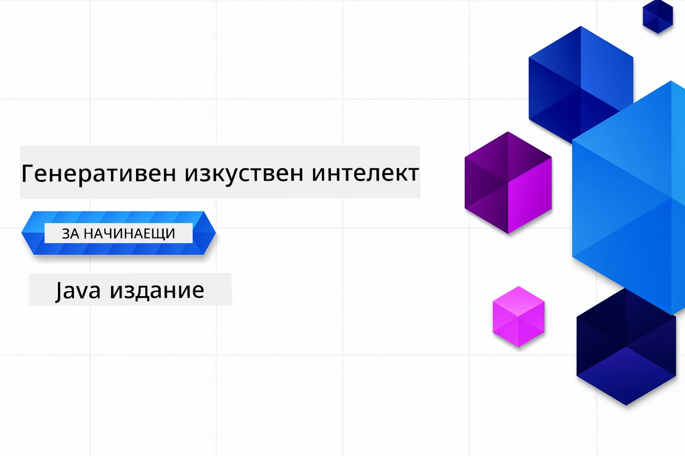

# Генеративен AI за начинаещи - издание на Java
[](https://discord.gg/nTYy5BXMWG)



**Времеви ангажимент**: Целият уъркшоп може да бъде завършен онлайн без локална настройка. Настройването на средата отнема 2 минути, а разглеждането на примерите изисква 1-3 часа в зависимост от дълбочината на изследване.

> **Бърз старт** 

1. Форкнете това хранилище в своя GitHub акаунт
2. Кликнете **Code** → **Codespaces** таб → **...** → **New with options...**
3. Използвайте настройките по подразбиране – те ще изберат контейнера за разработка, създаден за този курс
4. Кликнете **Create codespace**
5. Изчакайте ~2 минути за готовността на средата
6. Преминете директно към [Глава 2: Осигуряване на Azure AI Foundry](./02-SetupDevEnvironment/README.md#step-2-provision-azure-ai-foundry)

## Поддръжка на множество езици

### Поддържано чрез GitHub Action (Автоматизирано и винаги актуално)

<!-- CO-OP TRANSLATOR LANGUAGES TABLE START -->
[Арабски](../ar/README.md) | [Бенгалски](../bn/README.md) | [Български](./README.md) | [Бирмански (Мианмар)](../my/README.md) | [Китайски (опростен)](../zh-CN/README.md) | [Китайски (традиционен, Хонконг)](../zh-HK/README.md) | [Китайски (традиционен, Макао)](../zh-MO/README.md) | [Китайски (традиционен, Тайван)](../zh-TW/README.md) | [Хърватски](../hr/README.md) | [Чешки](../cs/README.md) | [Датски](../da/README.md) | [Нидерландски](../nl/README.md) | [Естонски](../et/README.md) | [Финландски](../fi/README.md) | [Френски](../fr/README.md) | [Немски](../de/README.md) | [Гръцки](../el/README.md) | [Иврит](../he/README.md) | [Хинди](../hi/README.md) | [Унгарски](../hu/README.md) | [Индонезийски](../id/README.md) | [Италиански](../it/README.md) | [Японски](../ja/README.md) | [Каннада](../kn/README.md) | [Кхмерски](../km/README.md) | [Корейски](../ko/README.md) | [Литовски](../lt/README.md) | [Малайски](../ms/README.md) | [Малалайски](../ml/README.md) | [Маратхи](../mr/README.md) | [Непалски](../ne/README.md) | [Нигерийски пиджин](../pcm/README.md) | [Норвежки](../no/README.md) | [Персийски (фарси)](../fa/README.md) | [Полски](../pl/README.md) | [Португалски (Бразилия)](../pt-BR/README.md) | [Португалски (Португалия)](../pt-PT/README.md) | [Пенджабски (Гурумки)](../pa/README.md) | [Румънски](../ro/README.md) | [Руски](../ru/README.md) | [Сръбски (кирилица)](../sr/README.md) | [Словашки](../sk/README.md) | [Словенски](../sl/README.md) | [Испански](../es/README.md) | [Суахили](../sw/README.md) | [Шведски](../sv/README.md) | [Тагалог (филипински)](../tl/README.md) | [Тамилски](../ta/README.md) | [Телугу](../te/README.md) | [Тайски](../th/README.md) | [Турски](../tr/README.md) | [Украински](../uk/README.md) | [Урду](../ur/README.md) | [Виетнамски](../vi/README.md)

> **Предпочитате да клонирате локално?**
>
> Това хранилище включва над 50 езикови превода, което значително увеличава размера на изтегляне. За да клонирате без преводи, използвайте sparse checkout:
>
> **Bash / macOS / Linux:**
> ```bash
> git clone --filter=blob:none --sparse https://github.com/microsoft/Generative-AI-for-beginners-java.git
> cd Generative-AI-for-beginners-java
> git sparse-checkout set --no-cone '/*' '!translations' '!translated_images'
> ```
>
> **CMD (Windows):**
> ```cmd
> git clone --filter=blob:none --sparse https://github.com/microsoft/Generative-AI-for-beginners-java.git
> cd Generative-AI-for-beginners-java
> git sparse-checkout set --no-cone "/*" "!translations" "!translated_images"
> ```
>
> Това ви дава всичко необходимо за завършване на курса с много по-бързо изтегляне.
<!-- CO-OP TRANSLATOR LANGUAGES TABLE END -->

## Структура на курса и учебен път

### **Глава 1: Въведение в генеративния AI**
- **Основни концепции**: Разбиране на големи езикови модели, токени, вграждания и възможности на AI
- **Java AI екосистема**: Преглед на Spring AI и OpenAI SDK-та
- **Протокол за контекст на модела**: Въведение в MCP и ролята му в комуникацията между AI агенти
- **Практически приложения**: Реални сценарии, включително чатботове и генериране на съдържание
- **[→ Започнете Глава 1](./01-IntroToGenAI/README.md)**

### **Глава 2: Настройка на средата за разработка**
- **Azure AI Foundry**: Осигуряване на GPT-5.6 Luna чат и text-embedding-3-small вграждания с Bicep и Azure Developer CLI (azd)
- **Spring Boot 4.1.1 + Spring AI 2.0.1**: Работа с `ChatClient`, базиран на официалния OpenAI Java SDK и Azure OpenAI v1
- **Безключова автентикация**: Свързване сигурно с Microsoft Entra ID — без управление на API ключове
- **Инструменти за разработка**: Docker контейнери, VS Code и конфигурация на GitHub Codespaces
- **[→ Започнете Глава 2](./02-SetupDevEnvironment/README.md)**

### **Глава 3: Основни техники в генеративния AI**
- **Официален OpenAI Java SDK**: Извикване на Azure OpenAI v1 директно с безключова автентикация
- **Проектиране на заявки**: Техники за оптимални отговори от AI модела
- **Вграждания и векторни операции**: Имплементиране на семантично търсене и откриване на сходство
- **Генерация с допълнително извличане (RAG)**: Комбиниране на AI със собствените ви данни
- **Извикване на функции**: Разширяване на възможностите на AI с персонализирани инструменти и плъгини
- **[→ Започнете Глава 3](./03-CoreGenerativeAITechniques/README.md)**

### **Глава 4: Практически приложения и проекти**
- **Генератор на истории за домашни любимци** (`petstory/`): Креативно генериране на съдържание с Azure AI Foundry
- **Демо с Foundry локално** (`foundrylocal/`): Локална интеграция на AI модел с OpenAI Java SDK
- **Услуга калкулатор MCP** (`calculator/`): Основна имплементация на Протокола за контекст на модела с Spring AI
- **[→ Започнете Глава 4](./04-PracticalSamples/README.md)**

### **Глава 5: Отговорно разработване на AI**
- **Филтриране на съдържание в Azure AI Foundry**: Тествайте вградени филтри и защитни механизми (твърди блокировки и меки отхвърляния)
- **Демо на отговорен AI**: Практически пример за работа на съвременни AI защитни системи
- **Най-добри практики**: Основни насоки за етично разработване и внедряване на AI
- **[→ Започнете Глава 5](./05-ResponsibleGenAI/README.md)**

## Допълнителни ресурси

<!-- CO-OP TRANSLATOR OTHER COURSES START -->
### LangChain
[](https://aka.ms/langchain4j-for-beginners)
[](https://aka.ms/langchainjs-for-beginners?WT.mc_id=m365-94501-dwahlin)
[](https://github.com/microsoft/langchain-for-beginners?WT.mc_id=m365-94501-dwahlin)
---

### Azure / Edge / MCP / Агенти
[](https://github.com/microsoft/AZD-for-beginners?WT.mc_id=academic-105485-koreyst)
[](https://github.com/microsoft/edgeai-for-beginners?WT.mc_id=academic-105485-koreyst)
[](https://github.com/microsoft/mcp-for-beginners?WT.mc_id=academic-105485-koreyst)
[](https://github.com/microsoft/ai-agents-for-beginners?WT.mc_id=academic-105485-koreyst)

---
 
### Серия Генеративен AI
[](https://github.com/microsoft/generative-ai-for-beginners?WT.mc_id=academic-105485-koreyst)
[-9333EA?style=for-the-badge&labelColor=E5E7EB&color=9333EA)](https://github.com/microsoft/Generative-AI-for-beginners-dotnet?WT.mc_id=academic-105485-koreyst)
[-C084FC?style=for-the-badge&labelColor=E5E7EB&color=C084FC)](https://github.com/microsoft/generative-ai-for-beginners-java?WT.mc_id=academic-105485-koreyst)
[-E879F9?style=for-the-badge&labelColor=E5E7EB&color=E879F9)](https://github.com/microsoft/generative-ai-with-javascript?WT.mc_id=academic-105485-koreyst)

---
 
### Основно обучение
[](https://aka.ms/ml-beginners?WT.mc_id=academic-105485-koreyst)
[](https://aka.ms/datascience-beginners?WT.mc_id=academic-105485-koreyst)
[](https://aka.ms/ai-beginners?WT.mc_id=academic-105485-koreyst)
[](https://github.com/microsoft/Security-101?WT.mc_id=academic-96948-sayoung)
[](https://aka.ms/webdev-beginners?WT.mc_id=academic-105485-koreyst)
[](https://aka.ms/iot-beginners?WT.mc_id=academic-105485-koreyst)
[](https://github.com/microsoft/xr-development-for-beginners?WT.mc_id=academic-105485-koreyst)

---
 
### Серия Copilot
[](https://aka.ms/GitHubCopilotAI?WT.mc_id=academic-105485-koreyst)
[](https://github.com/microsoft/mastering-github-copilot-for-dotnet-csharp-developers?WT.mc_id=academic-105485-koreyst)
[](https://github.com/microsoft/CopilotAdventures?WT.mc_id=academic-105485-koreyst)
<!-- CO-OP TRANSLATOR OTHER COURSES END -->

## Получаване на помощ

Ако срещнете затруднения или имате въпроси относно изграждането на AI приложения, присъединете се към други учащи и опитни разработчици за дискусии относно MCP. Това е подкрепяща общност, където въпросите са добре дошли и знанията се споделят свободно.

[](https://discord.gg/nTYy5BXMWG)

Ако имате обратна връзка за продукта или откриете грешки по време на разработката, посетете:

[](https://aka.ms/foundry/forum)

---

<!-- CO-OP TRANSLATOR DISCLAIMER START -->
**Отказ от отговорност**:
Този документ е преведен с помощта на AI преводачески услуга [Co-op Translator](https://github.com/Azure/co-op-translator). Въпреки че се стремим към точност, моля имайте предвид, че автоматизираните преводи могат да съдържат грешки или неточности. Оригиналният документ на неговия роден език трябва да се счита за авторитетен източник. За критична информация се препоръчва професионален човешки превод. Ние не носим отговорност за каквито и да е недоразумения или неправилни тълкувания, произтичащи от използването на този превод.
<!-- CO-OP TRANSLATOR DISCLAIMER END -->