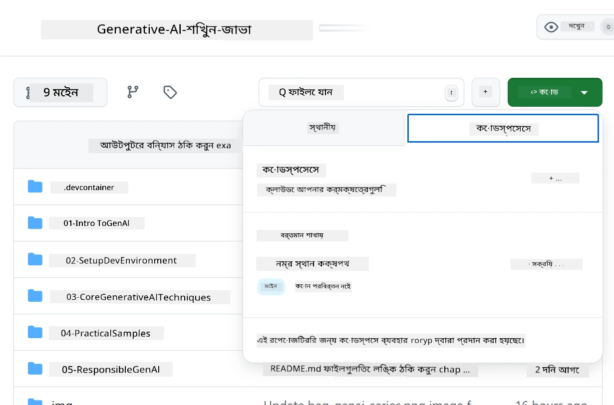
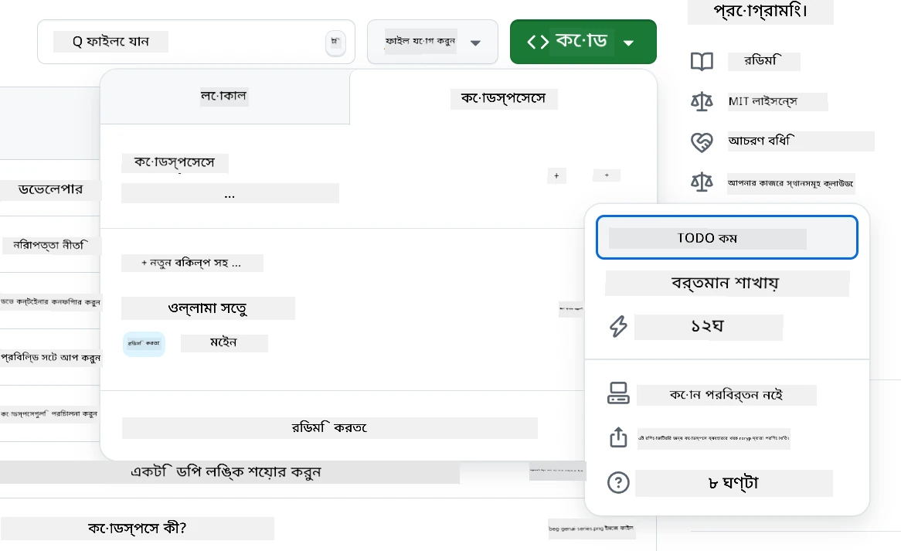
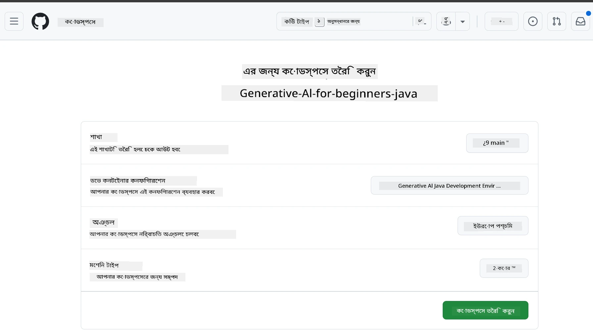
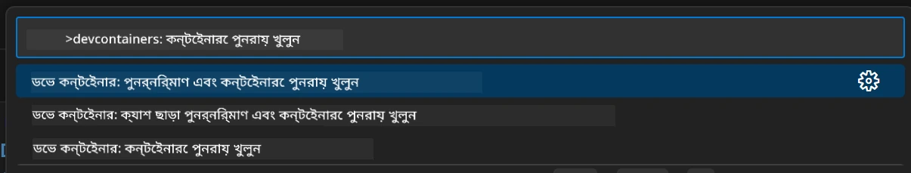
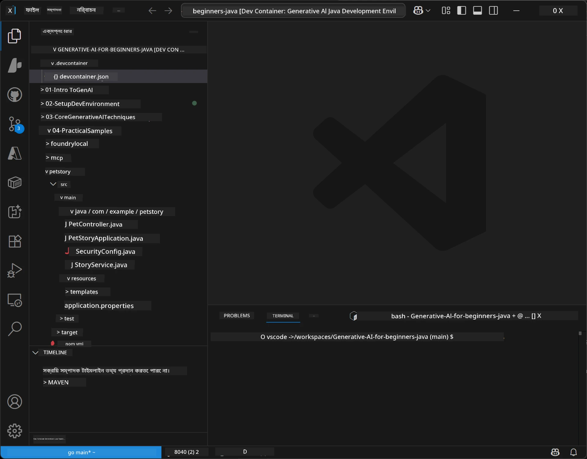
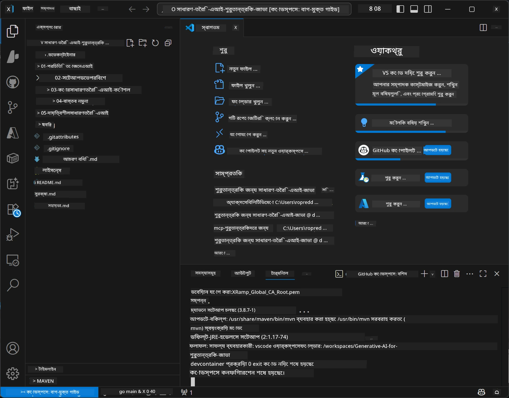

# জেনারেটিভ AI ফর জাভার জন্য ডেভেলপমেন্ট পরিবেশ সেট আপ করা

> **দ্রুত শুরু:** কয়েক মিনিটের মধ্যে Bicep + `azd` ব্যবহার করে কোড হিসেবে আপনার AI মডেলগুলি **Azure AI Foundry**-তে প্রভিশন করুন — দেখুন [Azure AI Foundry সেটআপ গাইড](getting-started-azure-openai.md)। প্রমাণীকরণ **কীলেস** (মাইক্রোসফট Entra ID), তাই কোনো API কী পরিচালনার দরকার নেই।

## আপনি যা শিখবেন

- AI অ্যাপ্লিকেশনগুলোর জন্য একটি জাভা ডেভেলপমেন্ট পরিবেশ সেট আপ করা
- আপনার পছন্দের ডেভেলপমেন্ট পরিবেশ নির্বাচন এবং কনফিগার করা (প্রথমে ক্লাউড সহ Codespaces, স্থানীয় ডেভ কন্টেইনার, অথবা সম্পূর্ণ স্থানীয় সেটআপ)
- Azure AI Foundry মডেলের সাথে সংযোগ করে আপনার সেটআপ পরীক্ষা করা

## বিষয়বস্তু সারণি

- [আপনি যা শিখবেন](#আপনি-যা-শিখবেন)
- [পরিচিতি](#পরিচিতি)
- [ধাপ ১: আপনার ডেভেলপমেন্ট পরিবেশ সেট আপ করুন](#ধাপ-১-আপনার-ডেভেলপমেন্ট-পরিবেশ-সেট-আপ-করুন)
  - [অপশন এ: GitHub Codespaces (প্রস্তাবিত)](#অপশন-এ-github-codespaces-প্রস্তাবিত)
  - [অপশন বি: লোকাল ডেভ কন্টেইনার](#অপশন-বি-লোকাল-ডেভ-কন্টেইনার)
  - [অপশন সি: আপনার বিদ্যমান লোকাল ইনস্টলেশন ব্যবহার করুন](#অপশন-সি-আপনার-বিদ্যমান-লোকাল-ইনস্টলেশন-ব্যবহার-করুন)
- [ধাপ ২: Azure AI Foundry প্রভিশন](#ধাপ-২-azure-ai-foundry-প্রভিশন-করুন)
- [ধাপ ৩: আপনার সেটআপ পরীক্ষা করুন](#ধাপ-৩-আপনার-সেটআপ-পরীক্ষা-করুন)
- [সমস্যা সমাধান](#সমস্যার-সমাধান)
- [সারাংশ](#সারাংশ)
- [পরবর্তী ধাপ](#পরবর্তী-ধাপ)

## পরিচিতি

এই অধ্যায়টি আপনাকে একটি ডেভেলপমেন্ট পরিবেশ সেট আপ করার মাধ্যমে পথ দেখাবে। আমরা এই কোর্স জুড়ে মডেল হিসাবে **Azure AI Foundry** ব্যবহার করব। আপনি Bicep এবং Azure Developer CLI (`azd`) দিয়ে কোড হিসেবে মডেল প্রভিশন করবেন, তারপর **কীলেস প্রমাণীকরণ** (মাইক্রোসফট Entra ID) দিয়ে সংযোগ করবেন — কোনো API কী কপি বা ফাঁস করতে হবে না।

**স্থানীয় সেটআপের দরকার নেই!** আপনি GitHub Codespaces ব্যবহার করতে পারেন, যা ব্রাউজারে একটি পূর্ণ ডেভেলপমেন্ট পরিবেশ প্রদান করে, এবং সেখান থেকে Foundry প্রভিশন করতে পারেন।

আমরা এই কোর্সের জন্য **Azure AI Foundry** ব্যবহার করি কারণ এটি:
- **কোড হিসেবে প্রভিশন করা হয়** — একটি `azd up` কমান্ড দিয়ে অ্যাকাউন্ট এবং মডেল ডিপ্লয়মেন্টগুলি স্থাপিত হয়
- **কীলেস** — আপনার Azure সাইন-ইন অথবা ম্যানেজড আইডেন্টিটির মাধ্যমে প্রমাণীকরণ
- **প্রোডাকশন-রেডি** — একই কোড লোকালি এবং Azure-তে চলে
- **ফ্লেক্সিবল** — কেবল একটি ডিপ্লয়মেন্ট নাম পরিবর্তন করে মডেল বদলানো যায়, কোড পরিবর্তন ছাড়াই

> **বিঃদ্রঃ**: Azure AI Foundry ডিপ্লয়মেন্টগুলি টোকেন প্রতি বিল করা হয় (ব্যবহার অনুযায়ী পে)। প্রভিশনিং, অঞ্চল এবং খরচ সংক্রান্ত তথ্যের জন্য দেখুন [Azure AI Foundry সেটআপ গাইড](getting-started-azure-openai.md)।


## ধাপ ১: আপনার ডেভেলপমেন্ট পরিবেশ সেট আপ করুন

<a name="quick-start-cloud"></a>

আমরা একটি প্রাক-কনফিগার্ড ডেভেলপমেন্ট কন্টেইনার তৈরি করেছি যাতে সেটআপ সময় কম হয় এবং এই জেনারেটিভ AI ফর জাভা কোর্সের জন্য প্রয়োজনীয় সমস্ত সরঞ্জাম থাকে। আপনার পছন্দসই ডেভেলপমেন্ট পন্থা বেছে নিন:

### পরিবেশ সেটআপের অপশনগুলি:

#### অপশন এ: GitHub Codespaces (প্রস্তাবিত)

**২ মিনিটে কোড লেখা শুরু করুন - কোনো স্থানীয় সেটআপের দরকার নেই!**

১। এই রিপোজিটরিটি আপনার GitHub অ্যাকাউন্টে ফর্ক করুন
   > **বিঃদ্রঃ**: যদি আপনি বেসিক কনফিগ পরিবর্তন করতে চান তাহলে দেখে নিন [Dev Container Configuration](../../../.devcontainer/devcontainer.json)
২। ক্লিক করুন **Code** → **Codespaces** ট্যাব → **...** → **New with options...**
৩। ডিফল্ট ব্যবহার করুন – এটি নির্বাচন করবে **Dev container configuration**: কোর্সের জন্য তৈরি করা **Generative AI Java Development Environment** কাস্টম ডেভকন্টেইনার
৪। ক্লিক করুন **Create codespace**
৫। প্রায় ২ মিনিট অপেক্ষা করুন পরিবেশ প্রস্তুত হওয়ার জন্য
৬। এগিয়ে যান [ধাপ ২: Azure AI Foundry প্রভিশন করুন](#ধাপ-২-azure-ai-foundry-প্রভিশন-করুন) এ








> **Codespaces-এর সুবিধাসমূহ**:
> - কোনো স্থানীয় ইনস্টলেশন প্রয়োজন নেই
> - যেকোনো ব্রাউজার সক্ষম ডিভাইসে কাজ করে
> - সমস্ত সরঞ্জাম এবং নির্ভরতা প্রাক-কনফিগার্ড
> - ব্যক্তিগত অ্যাকাউন্টের জন্য প্রতি মাসে ৬০ ঘন্টা বিনামূল্যে
> - সবার জন্য ধারাবাহিক পরিবেশ

#### অপশন বি: লোকাল ডেভ কন্টেইনার

**ডকার সহ স্থানীয় ডেভেলপমেন্ট পছন্দকারী ডেভেলপারদের জন্য**

১। এই রিপোজিটরিটি ফর্ক এবং ক্লোন করুন আপনার লোকাল মেশিনে
   > **বিঃদ্রঃ**: যদি আপনি বেসিক কনফিগ পরিবর্তন করতে চান তাহলে দেখে নিন [Dev Container Configuration](../../../.devcontainer/devcontainer.json)
২। [Docker Desktop](https://www.docker.com/products/docker-desktop/) এবং [VS Code](https://code.visualstudio.com/) ইন্সটল করুন
৩। VS Code-এ [Dev Containers এক্সটেনশন](https://marketplace.visualstudio.com/items?itemName=ms-vscode-remote.remote-containers) ইন্সটল করুন
৪। VS Code-এ রিপোজিটরি ফোল্ডারটি খুলুন
৫। যখন প্রম্পট দেখাবে, ক্লিক করুন **Reopen in Container** (বা ব্যবহার করুন `Ctrl+Shift+P` → "Dev Containers: Reopen in Container")
৬। কন্টেইনার তৈরি এবং শুরু হওয়ার জন্য অপেক্ষা করুন
৭। এগিয়ে যান [ধাপ ২: Azure AI Foundry প্রভিশন করুন](#ধাপ-২-azure-ai-foundry-প্রভিশন-করুন) এ





#### অপশন সি: আপনার বিদ্যমান লোকাল ইনস্টলেশন ব্যবহার করুন

**বিদ্যমান জাভা পরিবেশ সহ ডেভেলপারদের জন্য**

পূর্বশর্তসমূহ:
- [Java 21+](https://www.oracle.com/java/technologies/javase/jdk21-archive-downloads.html) 
- [Maven 3.9+](https://maven.apache.org/download.cgi)
- [VS Code](https://code.visualstudio.com) অথবা আপনার পছন্দের IDE

ধাপসমূহ:
১। এই রিপোজিটরিটি আপনার লোকাল মেশিনে ক্লোন করুন
২। আপনার IDE-তে প্রজেক্টটি খুলুন
৩। এগিয়ে যান [ধাপ ২: Azure AI Foundry প্রভিশন করুন](#ধাপ-২-azure-ai-foundry-প্রভিশন-করুন) এ

> **প্রি টিপ**: আপনার মেশিন কম ক্ষমতাসম্পন্ন হলেও যদি আপনি স্থানীয় VS Code ব্যবহার করতে চান, তাহলে GitHub Codespaces ব্যবহার করুন! আপনি আপনার লোকাল VS Code কে ক্লাউড-হোস্টেড Codespace-এর সাথে সংযুক্ত করতে পারেন, যা দুই দুনিয়ার সেরা।




## ধাপ ২: Azure AI Foundry প্রভিশন করুন

কোর্সের AI মডেলগুলি Azure AI Foundry-তে কোড হিসেবে ডিপ্লয় করুন। রিপোজিটরির রুট থেকে:

```bash
cd 02-SetupDevEnvironment
azd auth login
az login
azd up
```

`azd` একটি পরিবেশের নাম, সাবস্ক্রিপশন এবং অঞ্চল জানতে চায়, `gpt-5.6-luna` এবং `text-embedding-3-small` ডিপ্লয়মেন্ট সহ একটি Azure AI Foundry অ্যাকাউন্ট প্রভিশন করে, এবং উদাহরণ `.env`-এ এন্ডপয়েন্ট লিখে - সব কীলেস প্রমাণীকরণে (কোনো API কী নয়)।

> **সম্পূর্ণ ওয়াকমাধ্যমে:** প্রয়োজনীয়তা, ম্যানুয়াল (পোর্টাল) বিকল্প, অঞ্চল নির্দেশনা, এবং খরচ/পরিষ্কারের নোটের জন্য দেখুন [Azure AI Foundry সেটআপ গাইড](getting-started-azure-openai.md)।

## ধাপ ৩: আপনার সেটআপ পরীক্ষা করুন

আপনার Foundry মডেলগুলি প্রভিশন হয়ে গেলে, উদাহরণ অ্যাপে সংযোগ পরীক্ষা করুন [`02-SetupDevEnvironment/examples/basic-chat-azure`](../../../02-SetupDevEnvironment/examples/basic-chat-azure) থেকে।

১। আপনার ডেভেলপমেন্ট পরিবেশে টার্মিনাল খুলুন।
২। উদাহরণ ফোল্ডারে যান:
   ```bash
   cd 02-SetupDevEnvironment/examples/basic-chat-azure
   ```
৩। নিশ্চিত করুন আপনি সাইন ইন করেছেন (কীবিহীন প্রমাণীকরণ টোকেন প্রয়োজন):
   ```bash
   az login
   ```
   > আপনি যদি `azd up` চালিয়ে থাকেন, `.env` ফাইলটি আপনার এন্ডপয়েন্ট সহ ইতিমধ্যে লেখা হয়েছে আপনার জন্য।
৪। অ্যাপ্লিকেশন চালান:
   ```bash
   mvn clean spring-boot:run
   ```

আপনি `gpt-5.6-luna` মডেলের প্রতিক্রিয়া দেখতে পাবেন।

### উদাহরণ কোড বোঝা

[basic-chat উদাহরণটি](./examples/basic-chat-azure/README.md) **Spring Boot 4.1.1** এবং **Spring AI 2.0.1** ব্যবহার করে। Spring AI-এর `ChatClient` অফিসিয়াল OpenAI Java SDK দ্বারা ব্যাকড, Azure OpenAI **v1** এন্ডপয়েন্টের সাথে কীলেস প্রমাণীকরণ করে সংযোগ সৃষ্টি করে।

**এই কোডটি যা করে:**
- আপনার Azure সাইন-ইন (মাইক্রোসফট Entra ID) ব্যবহার করে Azure AI Foundry-র সাথে **সংযোগ স্থাপন করে** — কোনো API কী নয়
- `gpt-5.6-luna` মডেলে একটি প্রম্পট **পাঠায়**
- AI-এর প্রতিক্রিয়া **প্রাপ্ত** এবং প্রদর্শন করে
- আপনার সেটআপ সঠিকভাবে কাজ করছে কিনা **যাচাই করে**

**প্রধান নির্ভরশীলতাসমূহ** ([pom.xml](../../../02-SetupDevEnvironment/examples/basic-chat-azure/pom.xml) থেকে অংশ):
```xml
<dependency>
    <groupId>org.springframework.ai</groupId>
    <artifactId>spring-ai-starter-model-openai</artifactId>
</dependency>
<dependency>
    <groupId>com.openai</groupId>
    <artifactId>openai-java</artifactId>
</dependency>
<dependency>
    <groupId>com.azure</groupId>
    <artifactId>azure-identity</artifactId>
    <version>${azure-identity.version}</version>
</dependency>
```

POM OpenAI Java **4.63.1** পরিচালনা করে এবং Azure Identity **1.18.6** স্পষ্টভাবে সেট করে। Spring AI 2 Azure-নির্দিষ্ট স্টার্টার সরিয়ে ফেলেছে; Azure Identity এখনও ক্রেডেনশিয়াল বীন-এর জন্য প্রয়োজন।

**কনফিগারেশন** ([application.yml](../../../02-SetupDevEnvironment/examples/basic-chat-azure/src/main/resources/application.yml)):
```yaml
spring:
  ai:
    openai:
      base-url: ${AZURE_OPENAI_ENDPOINT}
      microsoft-foundry: true
      chat:
        model: ${AZURE_OPENAI_DEPLOYMENT:gpt-5.6-luna}
        reasoning-effort: none
        max-completion-tokens: 500
```

কীলেস প্রমাণীকরণ স্পষ্টভাবে [BasicChatApplication.java](../../../02-SetupDevEnvironment/examples/basic-chat-azure/src/main/java/com/example/BasicChatApplication.java)-এ কনফিগার করা হয়েছে, অনুপস্থিত API কী থেকে অনুমান নয়। এর বেয়ার ক্রেডেনশিয়াল `DefaultAzureCredential` ব্যবহার করে `https://ai.azure.com/.default` স্কোপে, এবং এর `OpenAIClient` `/openai/v1` লক্ষ্য করে। অ্যাপ্লিকেশনটি ওই ক্লায়েন্টকে Spring AI-এর চ্যাট মডেলের কাছে সরবরাহ করে, তাই গ্লোবাল `OPENAI_API_KEY` Azure প্রমাণীকরণ ওভাররাইড করতে পারে না।

চ্যাট সেটিংস সরাসরি `spring.ai.openai.chat` এর অধীনে, কোনো `options` ব্লক নেই। পাঠে চ্যাট কমপ্লিশনস `reasoning-effort: none` এবং ৫০০-টোকেন কমপ্লিশন ক্যাপ বজায় রাখা হয়েছে; `temperature` বা `max-tokens` সেট করা হয়নি। API পছন্দ এবং টুল-ক্লালিং নির্দেশনার জন্য [উদাহরণের কনফিগারেশন রেফারেন্স](./examples/basic-chat-azure/README.md#spring-configuration) দেখুন।

## সারাংশ

উপরোক্ত ধাপগুলি সম্পন্ন করার পর, আপনি পাবেন:

- Bicep + `azd` দিয়ে কোড হিসেবে Azure AI Foundry মডেল প্রভিশন করা
- আপনার জাভা ডেভেলপমেন্ট পরিবেশ চলমান (যা হোক Codespaces, ডেভ কন্টেইনার অথবা লোকাল)
- কীলেস প্রমাণীকরণ (মাইক্রোসফট Entra ID) দিয়ে Azure AI Foundry-র সাথে সংযোগ স্থাপন — কোন API কী নয়
- একটি সহজ উদাহরণের মাধ্যমে পরীক্ষা করা যা আপনার মডেলের সাথে কথা বলে

## পরবর্তী ধাপ

[অধ্যায় ৩: কোর জেনারেটিভ AI কৌশলসমূহ](../03-CoreGenerativeAITechniques/README.md)

## সমস্যার সমাধান

সমস্যা হচ্ছে? এখানে সাধারণ সমস্যা এবং সমাধান:

- **প্রমাণীকরণ ব্যর্থ হচ্ছে (৪০১/৪০৩)?** 
  - `az login` চালান — প্রমাণীকরণ কীলেস, তাই আপনাকে সাইন ইন থাকতে হবে
  - নিশ্চিত করুন আপনার অ্যাকাউন্টে রিসোর্সের উপর **Cognitive Services OpenAI User** ভূমিকা আছে
  - আপনি যদি সদ্য প্রভিশন করে থাকেন, ভূমিকা বরাদ্দ ছড়ানোর জন্য এক মিনিট অপেক্ষা করুন

- **Maven খুঁজে পাচ্ছেন না?** 
  - যদি dev containers/Codespaces ব্যবহার করেন, Maven প্রাক-ইন্সটলড থাকা উচিত
  - স্থানীয় সেটআপের জন্য Java 21+ এবং Maven 3.9+ ইনস্টল রয়েছে কিনা নিশ্চিত করুন
  - ইনস্টলেশন যাচাই করতে চেষ্টা করুন `mvn --version`

- **`azd` খুঁজে পাচ্ছেন না অথবা প্রভিশনিং ব্যর্থ?** 
  - [Azure Developer CLI](https://aka.ms/azure-dev/install) ইন্সটল করুন এবং `azd auth login` চালান
  - এমন একটি অঞ্চল নির্বাচন করুন যেখানে `gpt-5.6-luna` এবং `text-embedding-3-small` উপলব্ধ (যেমন `eastus2`), এবং আপনার নির্বাচিত সাবস্ক্রিপশনে যথেষ্ট কোটা আছে
  - বিস্তারিত জন্য দেখুন [Azure AI Foundry সেটআপ গাইড](getting-started-azure-openai.md)

- **ডেভ কন্টেইনার শুরু হয় না?** 
  - নিশ্চিত করুন Docker Desktop চলছে (স্থানীয় ডেভেলপমেন্টের জন্য)
  - কন্টেইনার পুনর্নির্মাণ চেষ্টা করুন: `Ctrl+Shift+P` → "Dev Containers: Rebuild Container"

- **অ্যাপ্লিকেশন কম্পাইলেশন ত্রুটি?**
  - নিশ্চিত করুন আপনি সঠিক ডিরেক্টরিতে আছেন: `02-SetupDevEnvironment/examples/basic-chat-azure`
  - ক্লিন এবং পুনর্নির্মাণ চেষ্টা করুন: `mvn clean compile`

> **সাহায্য প্রয়োজন?**: এখনও সমস্যা হচ্ছে? রিপোজিটরিতে একটি ইস্যু খুলুন, আমরা সাহায্য করব।

---

<!-- CO-OP TRANSLATOR DISCLAIMER START -->
**অস্বীকৃতি**:
এই নথিটি AI অনুবাদ পরিষেবা [Co-op Translator](https://github.com/Azure/co-op-translator) ব্যবহার করে অনূদিত হয়েছে। যদিও আমরা শুদ্ধতার জন্য চেষ্টা করি, অনুগ্রহ করে মনে রাখবেন যে স্বয়ংক্রিয় অনুবাদে ত্রুটি বা অসঙ্গতি থাকতে পারে। মূল নথিটি তার স্বভাষায় কর্তৃত্বপূর্ণ উৎস হিসেবে বিবেচিত হওয়া উচিত। গুরুত্বপূর্ণ তথ্যের জন্য পেশাদার মানব অনুবাদ সুপারিশ করা হয়। এই অনুবাদের ব্যবহারে প্রয়োজনীয় ভুল বোঝাবুঝি বা ভুল ব্যাখ্যার জন্য আমরা দায়বদ্ধ নই।
<!-- CO-OP TRANSLATOR DISCLAIMER END -->