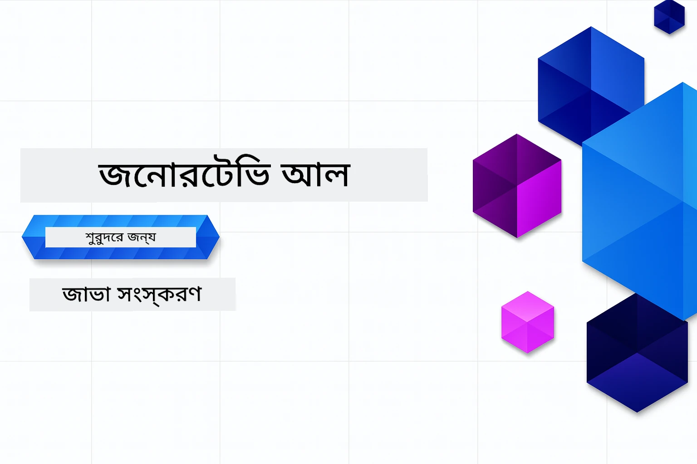

# নবাগতদের জন্য জেনারেটিভ AI - জাভা সংস্করণ
[](https://discord.gg/nTYy5BXMWG)



**সময় ব্যয়**: পুরো কর্মশালাটি অনলাইনে সম্পন্ন করা যেতে পারে স্থানীয় সেটআপ ছাড়াই। পরিবেশ সেটআপ ২ মিনিট সময় নেয়, নমুনাগুলি অন্বেষণ করতে ১-৩ ঘণ্টা সময় লাগে অন্বেষণের গভীরতার উপর নির্ভর করে।

> **দ্রুত শুরু**

১. এই রিপোজিটরিটি আপনার GitHub অ্যাকাউন্টে ফর্ক করুন
২. ক্লিক করুন **Code** → **Codespaces** ট্যাব → **...** → **New with options...**
৩. ডিফল্ট সেটিংস ব্যবহার করুন – এটি এই কোর্সের জন্য তৈরি ডেভেলপমেন্ট কন্টেইনারটি নির্বাচন করবে
৪. ক্লিক করুন **Create codespace**
৫. পরিবেশ প্রস্তুত হতে প্রায় ২ মিনিট অপেক্ষা করুন
৬. সরাসরি [অধ্যায় ২: Azure AI Foundry প্রভিশন করুন](./02-SetupDevEnvironment/README.md#step-2-provision-azure-ai-foundry) এ যান

## বহুভাষিক সমর্থন

### GitHub Action এর মাধ্যমে সমর্থিত (স্বয়ংক্রিয় ও সর্বদা আপ-টু-ডেট)

<!-- CO-OP TRANSLATOR LANGUAGES TABLE START -->
[আরবি](../ar/README.md) | [বাংলা](./README.md) | [বুলগেরিয়ান](../bg/README.md) | [বরমিজ (মায়ানমার)](../my/README.md) | [চীনা (সরলীকৃত)](../zh-CN/README.md) | [চীনা (প্রথাগত, হংকং)](../zh-HK/README.md) | [চীনা (প্রথাগত, मकاؤ)](../zh-MO/README.md) | [চীনা (প্রথাগত, তাইওয়ান)](../zh-TW/README.md) | [ক্রোয়েশিয়ান](../hr/README.md) | [চেক](../cs/README.md) | [ড্যানিশ](../da/README.md) | [ডাচ](../nl/README.md) | [এস্তোনিয়ান](../et/README.md) | [ফিনিশ](../fi/README.md) | [ফরাসি](../fr/README.md) | [জার্মান](../de/README.md) | [গ্রিক](../el/README.md) | [হিব্রু](../he/README.md) | [হিন্দি](../hi/README.md) | [হাঙ্গেরিয়ান](../hu/README.md) | [ইন্দোনেশিয়ান](../id/README.md) | [ইতালিয়ান](../it/README.md) | [জাপানি](../ja/README.md) | [কন্নড়](../kn/README.md) | [খমের](../km/README.md) | [কোরিয়ান](../ko/README.md) | [লিথুয়ানিয়ান](../lt/README.md) | [মালয়](../ms/README.md) | [মালায়ালম](../ml/README.md) | [মারাঠি](../mr/README.md) | [নেপালি](../ne/README.md) | [নাইজেরিয়ান পিজিন](../pcm/README.md) | [নরওয়েজিয়ান](../no/README.md) | [ফার্সি (পারস্য)](../fa/README.md) | [পোলিশ](../pl/README.md) | [পর্তুগিজ (ব্রাজিল)](../pt-BR/README.md) | [পর্তুগিজ (পর্তুগাল)](../pt-PT/README.md) | [পাঞ্জাবী (গুরুমুখী)](../pa/README.md) | [রোমানিয়ান](../ro/README.md) | [রাশিয়ান](../ru/README.md) | [সার্বিয়ান (সিরিলিক)](../sr/README.md) | [স্লোভাক](../sk/README.md) | [স্লোভেনিয়ান](../sl/README.md) | [স্প্যানিশ](../es/README.md) | [সোয়াহিলি](../sw/README.md) | [সুইডিশ](../sv/README.md) | [টাগালো (ফিলিপাইনি)](../tl/README.md) | [তামিল](../ta/README.md) | [তেলুগু](../te/README.md) | [থাই](../th/README.md) | [তুর্কি](../tr/README.md) | [উক্রেনিয়ান](../uk/README.md) | [উর্দু](../ur/README.md) | [ভিয়েতনামী](../vi/README.md)

> **স্থানীয়ভাবে ক্লোন করতে চান?**
>
> এই রিপোজিটরিতে ৫০+ ভাষার অনুবাদ রয়েছে যা ডাউনলোড সাইজ উল্লেখযোগ্যভাবে বাড়ায়। অনুবাদ ছাড়া ক্লোন করতে, sparse checkout ব্যবহার করুন:
>
> **Bash / macOS / Linux:**
> ```bash
> git clone --filter=blob:none --sparse https://github.com/microsoft/Generative-AI-for-beginners-java.git
> cd Generative-AI-for-beginners-java
> git sparse-checkout set --no-cone '/*' '!translations' '!translated_images'
> ```
>
> **CMD (Windows):**
> ```cmd
> git clone --filter=blob:none --sparse https://github.com/microsoft/Generative-AI-for-beginners-java.git
> cd Generative-AI-for-beginners-java
> git sparse-checkout set --no-cone "/*" "!translations" "!translated_images"
> ```
>
> এটি আপনাকে দ্রুত ডাউনলোডের মাধ্যমে কোর্স শেষ করতে প্রয়োজনীয় সবকিছু সরবরাহ করবে।
<!-- CO-OP TRANSLATOR LANGUAGES TABLE END -->

## কোর্সের কাঠামো এবং শিক্ষণ পথ

### **অধ্যায় ১: জেনারেটিভ AI এর পরিচয়**
- **মূল ধারণা**: বড় ভাষার মডেল, টোকেন, এমবেডিংস এবং AI এর ক্ষমতাগুলি বোঝা
- **জাভা AI ইকোসিস্টেম**: Spring AI এবং OpenAI SDK এর ওভারভিউ
- **মডেল কনটেক্সট প্রোটোকল**: MCP এবং AI এজেন্ট যোগাযোগে এর ভূমিকা পরিচিতি
- **প্রায়োগিক অ্যাপ্লিকেশন**: চ্যাটবট এবং বিষয়বস্তু তৈরি সহ বাস্তব জীবনের পরিস্থিতি
- **[→ অধ্যায় ১ শুরু করুন](./01-IntroToGenAI/README.md)**

### **অধ্যায় ২: ডেভেলপমেন্ট পরিবেশ সেটআপ**
- **Azure AI Foundry**: Bicep এবং Azure Developer CLI (azd) দিয়ে GPT-5.6 Luna চ্যাট এবং text-embedding-3-small এমবেডিংস প্রভিশন করুন
- **Spring Boot 4.1.1 + Spring AI 2.0.1**: `ChatClient` ব্যবহার করে শিখুন, যা অফিসিয়াল OpenAI Java SDK এবং Azure OpenAI v1 দ্বারা সমর্থিত
- **কী ছাড়া প্রমাণীকরণ**: Microsoft Entra ID এর মাধ্যমে সুরক্ষিত সংযোগ — কোনো API কী ব্যবস্থাপনা নেই
- **ডেভেলপমেন্ট সরঞ্জাম**: Docker কন্টেইনার, VS Code এবং GitHub Codespaces কনফিগারেশন
- **[→ অধ্যায় ২ শুরু করুন](./02-SetupDevEnvironment/README.md)**

### **অধ্যায় ৩: মূল জেনারেটিভ AI পদ্ধতি**
- **অফিশিয়াল OpenAI Java SDK**: কী-বিহীন প্রমাণীকরণের মাধ্যমে সরাসরি Azure OpenAI v1 কল করুন
- **প্রম্পট ইঞ্জিনিয়ারিং**: AI মডেলের সর্বোত্তম প্রতিক্রিয়ার জন্য কৌশল
- **এম্বেডিংস এবং ভেক্টর অপারেশন**: সেমান্টিক সার্চ এবং সাদৃশ্য ম্যাচিং বাস্তবায়ন
- **রিট্রিভাল-অগমেন্টেড জেনারেশন (RAG)**: AI কে আপনার নিজস্ব ডেটা সূত্রের সাথে সংযুক্ত করুন
- **ফাংশন কলিং**: কাস্টম টুল এবং প্লাগইনের মাধ্যমে AI ক্ষমতা বৃদ্ধি করুন
- **[→ অধ্যায় ৩ শুরু করুন](./03-CoreGenerativeAITechniques/README.md)**

### **অধ্যায় ৪: প্রাযুক্তিক অ্যাপ্লিকেশন ও প্রকল্প**
- **পেট স্টোরি জেনারেটর** (`petstory/`): Azure AI Foundry দিয়ে সৃজনশীল বিষয়বস্তু তৈরি
- **Foundry Local ডেমো** (`foundrylocal/`): OpenAI Java SDK সহ স্থানীয় AI মডেল ইন্টিগ্রেশন
- **MCP ক্যালকুলেটর সার্ভিস** (`calculator/`): Spring AI দিয়ে মৌলিক Model Context Protocol বাস্তবায়ন
- **[→ অধ্যায় ৪ শুরু করুন](./04-PracticalSamples/README.md)**

### **অধ্যায় ৫: দায়িত্বশীল AI ডেভেলপমেন্ট**
- **Azure AI Foundry কন্টেন্ট সেফটি**: ইন-বিল্ট কন্টেন্ট ফিল্টারিং এবং সুরক্ষা ব্যবস্থাগুলি পরীক্ষা করুন (হার্ড ব্লক এবং সফট প্রত্যাখ্যান)
- **দায়িত্বশীল AI ডেমো**: আধুনিক AI সেফটি সিস্টেম কীভাবে কাজ করে তার ব্যবহারিক উদাহরণ
- **সর্বোত্তম অনুশীলন**: নীতিগত AI ডেভেলপমেন্ট ও মোতায়েনের জন্য প্রয়োজনীয় নির্দেশিকা
- **[→ অধ্যায় ৫ শুরু করুন](./05-ResponsibleGenAI/README.md)**

## অতিরিক্ত সম্পদ

<!-- CO-OP TRANSLATOR OTHER COURSES START -->
### LangChain
[](https://aka.ms/langchain4j-for-beginners)
[](https://aka.ms/langchainjs-for-beginners?WT.mc_id=m365-94501-dwahlin)
[](https://github.com/microsoft/langchain-for-beginners?WT.mc_id=m365-94501-dwahlin)
---

### Azure / Edge / MCP / এজেন্ট
[](https://github.com/microsoft/AZD-for-beginners?WT.mc_id=academic-105485-koreyst)
[](https://github.com/microsoft/edgeai-for-beginners?WT.mc_id=academic-105485-koreyst)
[](https://github.com/microsoft/mcp-for-beginners?WT.mc_id=academic-105485-koreyst)
[](https://github.com/microsoft/ai-agents-for-beginners?WT.mc_id=academic-105485-koreyst)

---
 
### জেনারেটিভ AI সিরিজ
[](https://github.com/microsoft/generative-ai-for-beginners?WT.mc_id=academic-105485-koreyst)
[-9333EA?style=for-the-badge&labelColor=E5E7EB&color=9333EA)](https://github.com/microsoft/Generative-AI-for-beginners-dotnet?WT.mc_id=academic-105485-koreyst)
[-C084FC?style=for-the-badge&labelColor=E5E7EB&color=C084FC)](https://github.com/microsoft/generative-ai-for-beginners-java?WT.mc_id=academic-105485-koreyst)
[-E879F9?style=for-the-badge&labelColor=E5E7EB&color=E879F9)](https://github.com/microsoft/generative-ai-with-javascript?WT.mc_id=academic-105485-koreyst)

---
 
### মূল শিক্ষণ
[](https://aka.ms/ml-beginners?WT.mc_id=academic-105485-koreyst)
[](https://aka.ms/datascience-beginners?WT.mc_id=academic-105485-koreyst)
[](https://aka.ms/ai-beginners?WT.mc_id=academic-105485-koreyst)
[](https://github.com/microsoft/Security-101?WT.mc_id=academic-96948-sayoung)
[](https://aka.ms/webdev-beginners?WT.mc_id=academic-105485-koreyst)
[](https://aka.ms/iot-beginners?WT.mc_id=academic-105485-koreyst)
[](https://github.com/microsoft/xr-development-for-beginners?WT.mc_id=academic-105485-koreyst)

---
 
### কোপিলট সিরিজ
[](https://aka.ms/GitHubCopilotAI?WT.mc_id=academic-105485-koreyst)
[](https://github.com/microsoft/mastering-github-copilot-for-dotnet-csharp-developers?WT.mc_id=academic-105485-koreyst)
[](https://github.com/microsoft/CopilotAdventures?WT.mc_id=academic-105485-koreyst)
<!-- CO-OP TRANSLATOR OTHER COURSES END -->

## সাহায্য নেওয়ার উপায়

যদি আপনি আটকে যান বা AI অ্যাপ তৈরি সংক্রান্ত কোনো প্রশ্ন থাকে। MCP সম্পর্কে আলোচনা করতে সহপাঠী ও অভিজ্ঞ ডেভেলপারদের সাথে যোগ দিন। এটি একটি সহায়ক সম্প্রদায় যেখানে প্রশ্ন স্বাগত এবং জ্ঞান মুক্তভাবে শেয়ার করা হয়।

[](https://discord.gg/nTYy5BXMWG)

যদি আপনার কোন প্রোডাক্ট ফিডব্যাক বা ত্রুটি থাকে তৈরির সময়, দেখুন:

[](https://aka.ms/foundry/forum)

---

<!-- CO-OP TRANSLATOR DISCLAIMER START -->
**অস্বীকৃতি**:
এই নথিটি AI অনুবাদ পরিষেবা [Co-op Translator](https://github.com/Azure/co-op-translator) ব্যবহার করে অনূদিত হয়েছে। যদিও আমরা শুদ্ধতার জন্য চেষ্টা করি, অনুগ্রহ করে মনে রাখবেন যে স্বয়ংক্রিয় অনুবাদে ত্রুটি বা অসঙ্গতি থাকতে পারে। মূল নথিটি তার স্বভাষায় কর্তৃত্বপূর্ণ উৎস হিসেবে বিবেচিত হওয়া উচিত। গুরুত্বপূর্ণ তথ্যের জন্য পেশাদার মানব অনুবাদ সুপারিশ করা হয়। এই অনুবাদের ব্যবহারে প্রয়োজনীয় ভুল বোঝাবুঝি বা ভুল ব্যাখ্যার জন্য আমরা দায়বদ্ধ নই।
<!-- CO-OP TRANSLATOR DISCLAIMER END -->