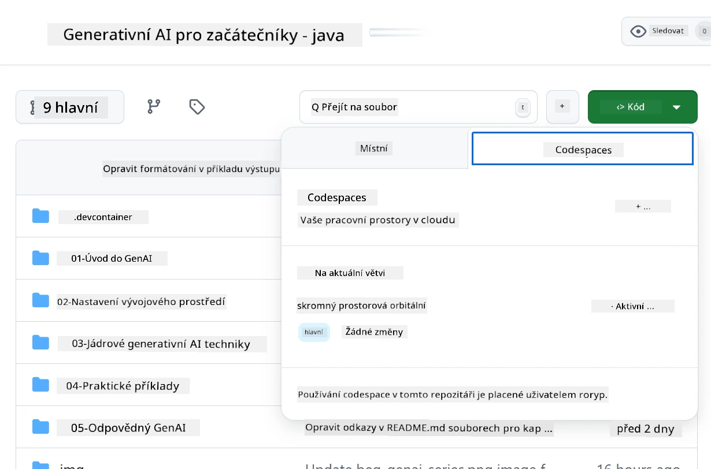
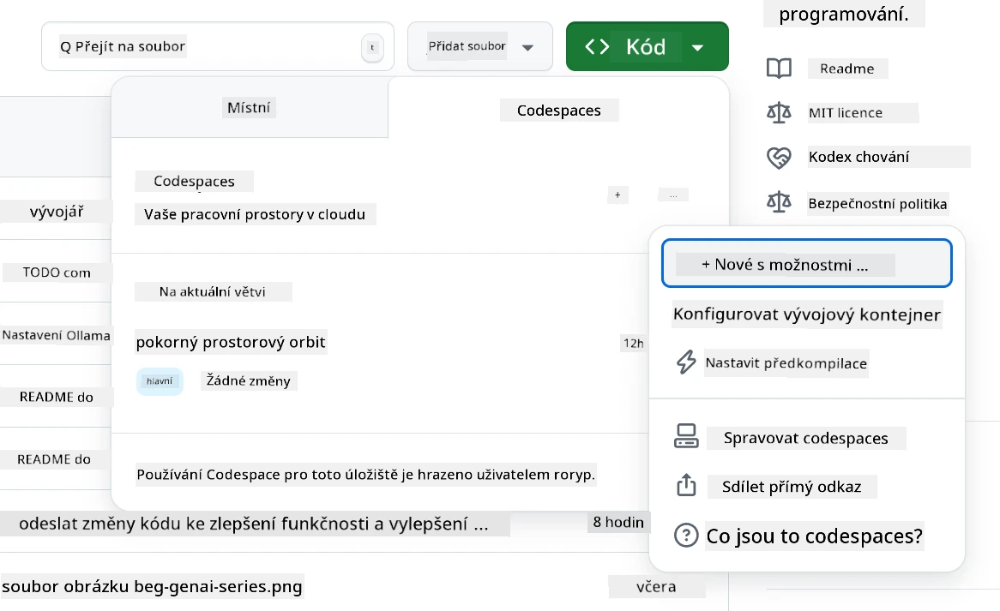
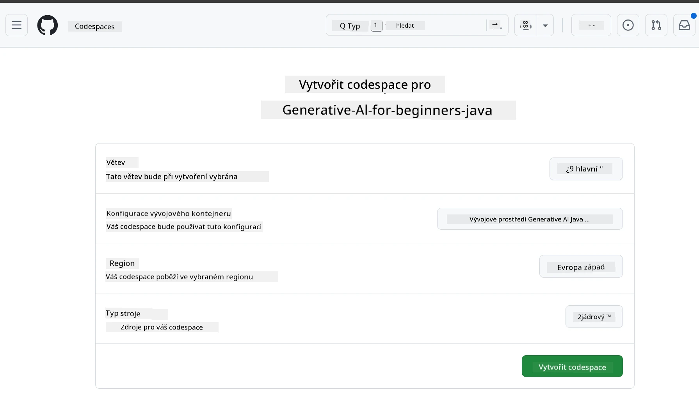
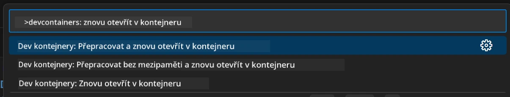
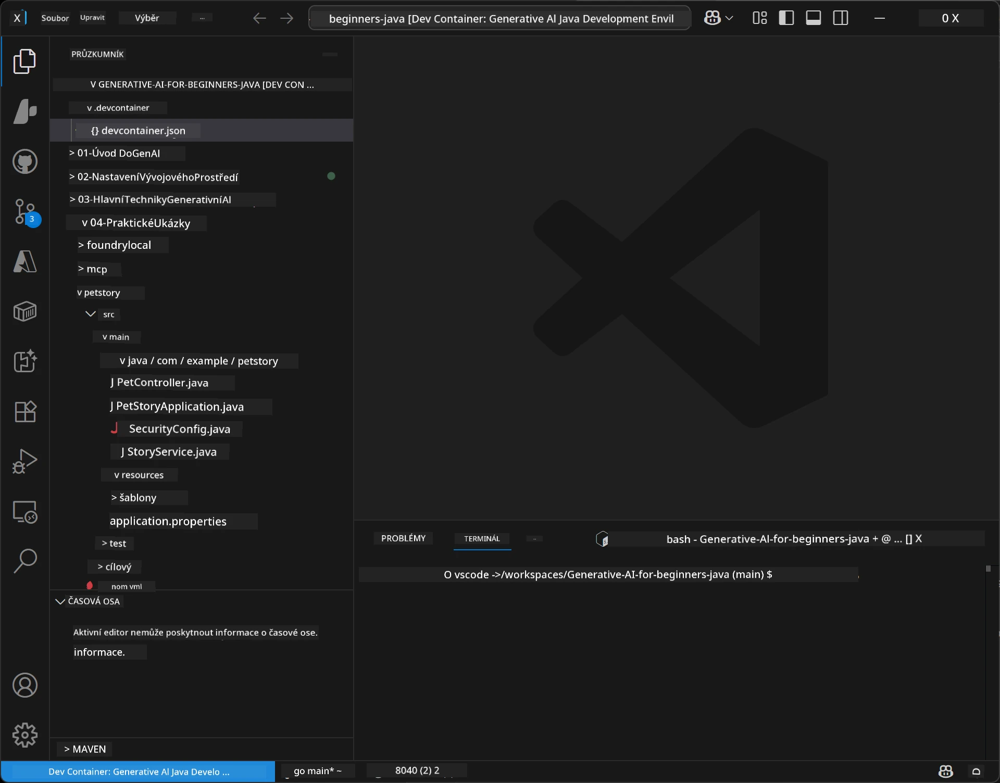
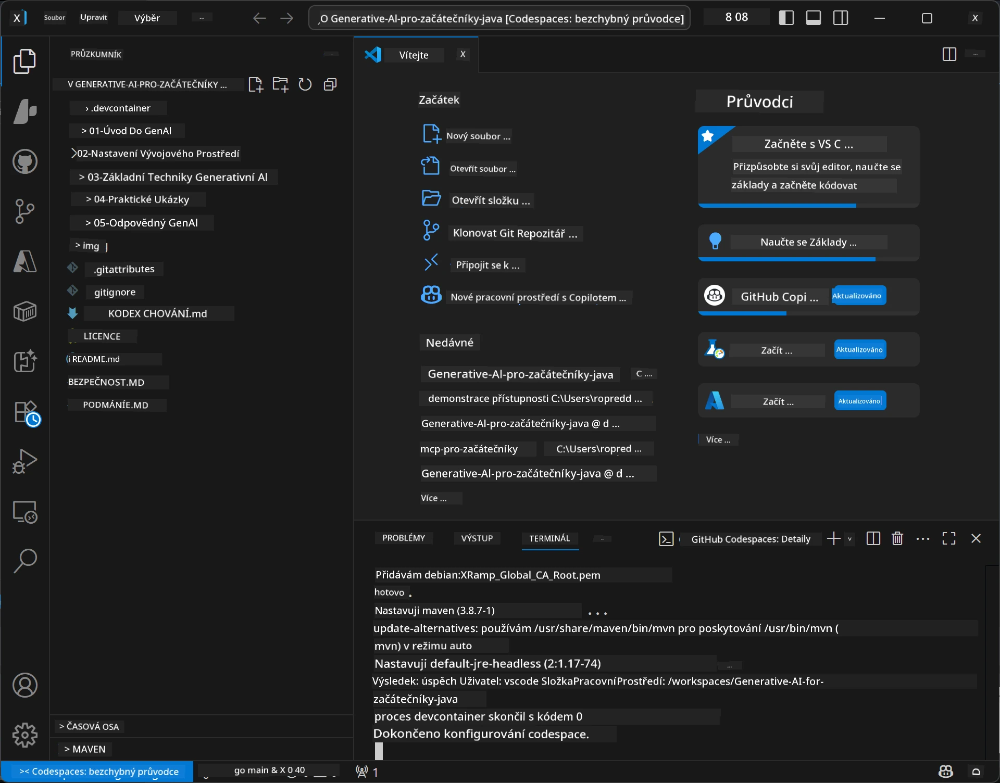

# Nastavení vývojového prostředí pro Generativní AI pro Javu

> **Rychlý start:** Nasazujte své AI modely na **Azure AI Foundry** jako kód s Bicep + `azd` během několika minut — viz [Průvodce nastavením Azure AI Foundry](getting-started-azure-openai.md). Autentizace je **bezklíčová** (Microsoft Entra ID), takže není třeba spravovat žádné API klíče.

## Co se naučíte

- Nastavit vývojové prostředí pro AI aplikace v Javě
- Vybrat a nakonfigurovat preferované vývojové prostředí (cloud-first s Codespaces, lokální dev kontejner nebo plná lokální instalace)
- Otestovat nastavení připojením k modelu Azure AI Foundry

## Obsah

- [Co se naučíte](#co-se-naučíte)
- [Úvod](#úvod)
- [Krok 1: Nastavení vývojového prostředí](#krok-1-nastavení-vývojového-prostředí)
  - [Možnost A: GitHub Codespaces (doporučeno)](#možnost-a-github-codespaces-doporučeno)
  - [Možnost B: Lokální dev kontejner](#možnost-b-lokální-dev-kontejner)
  - [Možnost C: Použití stávající lokální instalace](#možnost-c-použijte-svou-stávající-lokální-instalaci)
- [Krok 2: Nasazení Azure AI Foundry](#krok-2-nasazení-azure-ai-foundry)
- [Krok 3: Otestujte své nastavení](#krok-3-otestujte-své-nastavení)
- [Řešení problémů](#řešení-problémů)
- [Shrnutí](#shrnutí)
- [Další kroky](#další-kroky)

## Úvod

Tento kapitola vás provede nastavením vývojového prostředí. Po celou dobu kurzu použijeme **Azure AI Foundry** pro modely. Modely nasadíte jako kód pomocí Bicep a Azure Developer CLI (`azd`), poté se připojíte pomocí **bezklíčové autentizace** (Microsoft Entra ID) — žádné API klíče nemusíte kopírovat nebo riskovat únik.

**Není potřeba žádná lokální instalace!** Můžete použít GitHub Codespaces, který poskytuje plné vývojové prostředí v prohlížeči, a odtud nasadit Foundry.

Pro tento kurz používáme **Azure AI Foundry**, protože je:
- **Nasazeno jako kód** — jeden příkaz `azd up` nasadí účet a modely
- **Bezklíčové** — autentizace probíhá pomocí Azure přihlášení nebo spravované identity
- **Připravené do produkce** — stejný kód funguje lokálně i v Azure
- **Flexibilní** — vyměníte model změnou názvu nasazení, nikoli kódu

> **Poznámka**: Nasazení Azure AI Foundry se účtuje podle počtu tokenů (platební podle užití). Viz [Průvodce nastavením Azure AI Foundry](getting-started-azure-openai.md) pro podrobnosti o nasazení, lokalitě a cenách.


## Krok 1: Nastavení vývojového prostředí

<a name="quick-start-cloud"></a>

Vytvořili jsme přednastavený vývojový kontejner, abychom minimalizovali dobu instalace a zajistili, že máte všechny potřebné nástroje pro tento kurz Generativní AI pro Javu. Vyberte si svůj preferovaný způsob vývoje:

### Možnosti nastavení prostředí:

#### Možnost A: GitHub Codespaces (doporučeno)

**Začněte kódovat za 2 minuty - bez potřeby lokální instalace!**

1. Zforkujte tento repozitář do svého GitHub účtu
   > **Poznámka**: Pokud chcete upravit základní konfiguraci, podívejte se na [Konfiguraci Dev kontejneru](../../../.devcontainer/devcontainer.json)
2. Klikněte na **Code** → záložka **Codespaces** → **...** → **New with options...**
3. Použijte výchozí nastavení – vybere se **Dev container konfigurace**: **Generative AI Java Development Environment** vlastní devcontainer vytvořený pro tento kurz
4. Klikněte na **Create codespace**
5. Počkejte asi 2 minuty, než bude prostředí připravené
6. Pokračujte do [Kroku 2: Nasazení Azure AI Foundry](#krok-2-nasazení-azure-ai-foundry)








> **Výhody Codespaces**:
> - Není potřeba lokální instalace
> - Funguje na jakémkoli zařízení s prohlížečem
> - Přednastavené se všemi nástroji a závislostmi
> - Zdarma 60 hodin měsíčně pro osobní účty
> - Konzistentní prostředí pro všechny studenty

#### Možnost B: Lokální Dev kontejner

**Pro vývojáře, kteří preferují lokální vývoj s Dockerem**

1. Zforkujte a klonujte tento repozitář na svůj počítač
   > **Poznámka**: Pokud chcete upravit základní konfiguraci, podívejte se na [Konfiguraci Dev kontejneru](../../../.devcontainer/devcontainer.json)
2. Nainstalujte [Docker Desktop](https://www.docker.com/products/docker-desktop/) a [VS Code](https://code.visualstudio.com/)
3. Nainstalujte v VS Code rozšíření [Dev Containers](https://marketplace.visualstudio.com/items?itemName=ms-vscode-remote.remote-containers)
4. Otevřete složku repozitáře ve VS Code
5. Když budete vyzváni, klikněte na **Reopen in Container** (nebo použijte `Ctrl+Shift+P` → "Dev Containers: Reopen in Container")
6. Počkejte na sestavení a spuštění kontejneru
7. Pokračujte do [Kroku 2: Nasazení Azure AI Foundry](#krok-2-nasazení-azure-ai-foundry)





#### Možnost C: Použijte svou stávající lokální instalaci

**Pro vývojáře se stávajícími Java prostředími**

Požadavky:
- [Java 21+](https://www.oracle.com/java/technologies/javase/jdk21-archive-downloads.html) 
- [Maven 3.9+](https://maven.apache.org/download.cgi)
- [VS Code](https://code.visualstudio.com) nebo preferované IDE

Kroky:
1. Naklonujte tento repozitář na svůj počítač
2. Otevřete projekt ve svém IDE
3. Pokračujte do [Kroku 2: Nasazení Azure AI Foundry](#krok-2-nasazení-azure-ai-foundry)

> **Profesionální tip**: Máte-li stroj s nízkým výkonem, ale chcete VS Code lokálně, použijte GitHub Codespaces! Můžete připojit svůj lokální VS Code k cloud-hostovanému Codespace pro to nejlepší z obou světů.




## Krok 2: Nasazení Azure AI Foundry

Nasazení AI modelů kurzu do Azure AI Foundry jako kód. Z kořenové složky repozitáře:

```bash
cd 02-SetupDevEnvironment
azd auth login
az login
azd up
```

`azd` se zeptá na název prostředí, předplatné a lokaci, nasadí Azure AI Foundry účet s nasazeními `gpt-5.6-luna` a `text-embedding-3-small` a zapíše endpoint do `.env` příkladu - vše s **bezklíčovou** autentizací (žádné API klíče).

> **Kompletní průvodce:** Viz [Průvodce nastavením Azure AI Foundry](getting-started-azure-openai.md) pro požadavky, manuální (portalovou) alternativu, doporučení lokality a poznámky k nákladům/ukončení.

## Krok 3: Otestujte své nastavení

Jakmile máte nasazené modely Foundry, otestujte připojení pomocí ukázkové aplikace v [`02-SetupDevEnvironment/examples/basic-chat-azure`](../../../02-SetupDevEnvironment/examples/basic-chat-azure).

1. Otevřete terminál ve svém vývojovém prostředí.
2. Přejděte do příkladu:
   ```bash
   cd 02-SetupDevEnvironment/examples/basic-chat-azure
   ```
3. Ujistěte se, že jste přihlášeni (bezklíčová autentizace vyžaduje token):
   ```bash
   az login
   ```
   > Pokud jste spustili `azd up`, `.env` soubor s vaším endpointem byl již zapsán.
4. Spusťte aplikaci:
   ```bash
   mvn clean spring-boot:run
   ```

Měli byste vidět odpověď od modelu `gpt-5.6-luna`.

### Porozumění příkladovému kódu

[basic-chat příklad](./examples/basic-chat-azure/README.md) používá **Spring Boot 4.1.1** a **Spring AI 2.0.1**. Spring AI `ChatClient` je postaven na oficiálním OpenAI Java SDK, které se připojuje k Azure OpenAI **v1** endpointu s bezklíčovou autentizací.

**Co tento kód dělá:**
- **Připojuje** se k Azure AI Foundry pomocí vašeho Azure přihlášení (Microsoft Entra ID) — bez API klíče
- **Odesílá** dotaz modelu `gpt-5.6-luna`
- **Přijímá** a zobrazuje odpověď AI
- **Ověřuje**, že je nastavení správné

**Klíčové závislosti** (výpis z [pom.xml](../../../02-SetupDevEnvironment/examples/basic-chat-azure/pom.xml)):
```xml
<dependency>
    <groupId>org.springframework.ai</groupId>
    <artifactId>spring-ai-starter-model-openai</artifactId>
</dependency>
<dependency>
    <groupId>com.openai</groupId>
    <artifactId>openai-java</artifactId>
</dependency>
<dependency>
    <groupId>com.azure</groupId>
    <artifactId>azure-identity</artifactId>
    <version>${azure-identity.version}</version>
</dependency>
```

POM spravuje OpenAI Java **4.63.1** a explicitně nastavuje Azure Identity **1.18.6**. Spring AI 2 odstranil Azure-specifický starter; Azure Identity je stále potřeba pro credential bean.

**Konfigurace** ([application.yml](../../../02-SetupDevEnvironment/examples/basic-chat-azure/src/main/resources/application.yml)):
```yaml
spring:
  ai:
    openai:
      base-url: ${AZURE_OPENAI_ENDPOINT}
      microsoft-foundry: true
      chat:
        model: ${AZURE_OPENAI_DEPLOYMENT:gpt-5.6-luna}
        reasoning-effort: none
        max-completion-tokens: 500
```

Bezklíčová autentizace je explicitně nastavena v [BasicChatApplication.java](../../../02-SetupDevEnvironment/examples/basic-chat-azure/src/main/java/com/example/BasicChatApplication.java), není odvozena z nepřítomnosti API klíče. Její bearer credential používá `DefaultAzureCredential` s přístupem `https://ai.azure.com/.default`, a `OpenAIClient` cílí na `/openai/v1`. Aplikace poskytuje tohoto klienta chat modelu Spring AI, takže globální `OPENAI_API_KEY` nemůže přepsat Azure autentizaci.

Nastavení chatu je přímo pod `spring.ai.openai.chat`, bez bloku `options`. Lekce zachovává chatové dokončování s `reasoning-effort: none` a maximem 500 tokenů; nenastavuje `temperature` ani `max-tokens`. Viz [referenci konfigurace příkladu](./examples/basic-chat-azure/README.md#spring-configuration) pro volbu API a doporučení ohledně volání nástrojů.

## Shrnutí

Po dokončení výše uvedených kroků budete mít:

- Nasazené Azure AI Foundry modely jako kód s Bicep + `azd`
- Nastavené vývojové prostředí pro Javu (ať už Codespaces, dev kontejnery nebo lokální)
- Připojení k Azure AI Foundry pomocí bezklíčové autentizace (Microsoft Entra ID) — žádné API klíče
- Otestováno, že vše funguje jednoduchým příkladem, který komunikuje s vaším modelem

## Další kroky

[Kapitola 3: Základní techniky generativní AI](../03-CoreGenerativeAITechniques/README.md)

## Řešení problémů

Máte problémy? Zde jsou běžné potíže a řešení:

- **Selhává autentizace (401/403)?** 
  - Spusťte `az login` — autentizace je bezklíčová, musíte být přihlášeni
  - Ověřte, že váš účet má roli **Cognitive Services OpenAI User** k danému zdroji
  - Pokud jste právě nasadili, počkejte minutu, než se role projeví

- **Maven nenalezen?** 
  - Pokud používáte dev kontejnery/Codespaces, Maven by měl být předinstalovaný
  - Pro lokální nastavení zajistěte instalaci Java 21+ a Maven 3.9+
  - Zkuste `mvn --version` pro ověření instalace

- **`azd` nenalezen nebo selhává nasazení?** 
  - Nainstalujte [Azure Developer CLI](https://aka.ms/azure-dev/install) a spusťte `azd auth login`
  - Vyberte lokaci, kde jsou dostupné `gpt-5.6-luna` a `text-embedding-3-small` (např. `eastus2`) s dostatečnou kvótou ve vašem předplatném
  - Viz [Průvodce nastavením Azure AI Foundry](getting-started-azure-openai.md) pro podrobnosti

- **Dev kontejner se nespouští?** 
  - Ujistěte se, že Docker Desktop běží (pro lokální vývoj)
  - Zkuste přestavět kontejner: `Ctrl+Shift+P` → "Dev Containers: Rebuild Container"

- **Chyby kompilace aplikace?**
  - Ujistěte se, že jste ve správném adresáři: `02-SetupDevEnvironment/examples/basic-chat-azure`
  - Zkuste čistit a kompilovat znovu: `mvn clean compile`

> **Potřebujete pomoc?**: Máte-li stále problémy, otevřete issue v repozitáři a rádi pomůžeme.

---

<!-- CO-OP TRANSLATOR DISCLAIMER START -->
**Prohlášení o omezení odpovědnosti**:
Tento dokument byl přeložen pomocí AI překladatelské služby [Co-op Translator](https://github.com/Azure/co-op-translator). Přestože usilujeme o co největší přesnost, mějte prosím na paměti, že automatizované překlady mohou obsahovat chyby nebo nepřesnosti. Originální dokument v jeho mateřském jazyce by měl být považován za autoritativní zdroj. Pro kritické informace se doporučuje profesionální lidský překlad. Nejsme odpovědní za jakékoli nedorozumění nebo nesprávné interpretace vzniklé použitím tohoto překladu.
<!-- CO-OP TRANSLATOR DISCLAIMER END -->