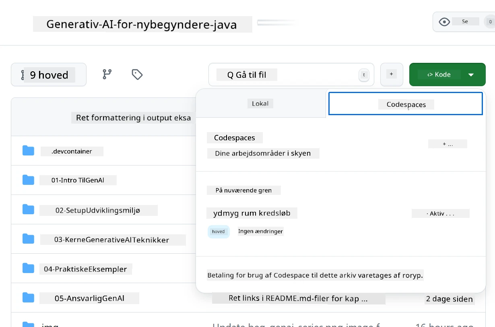
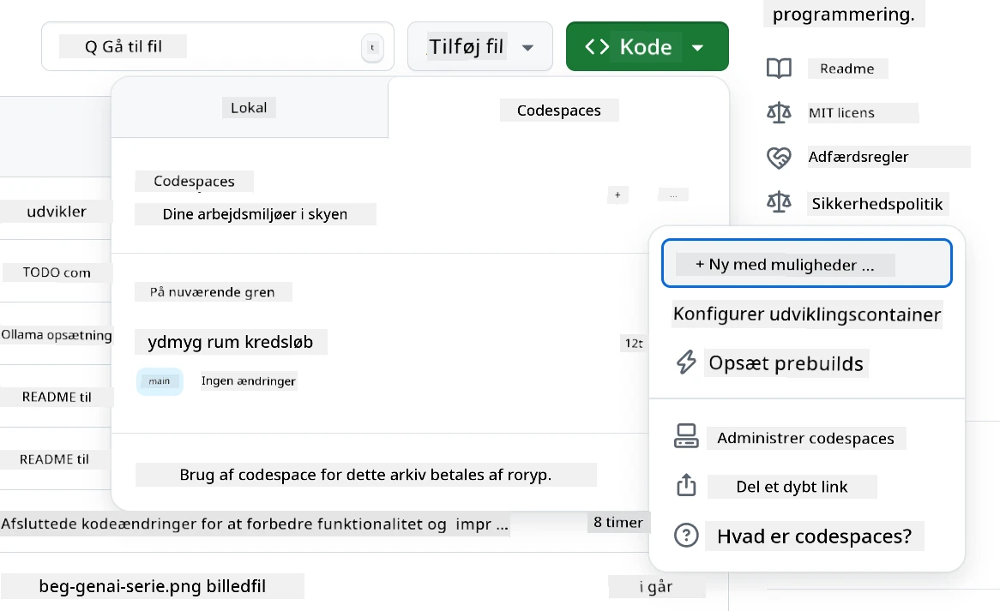
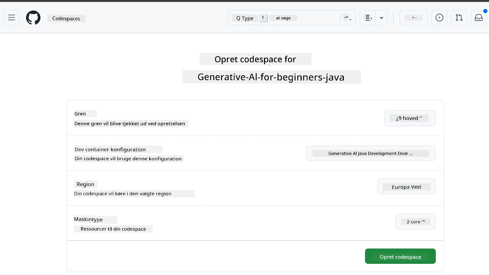
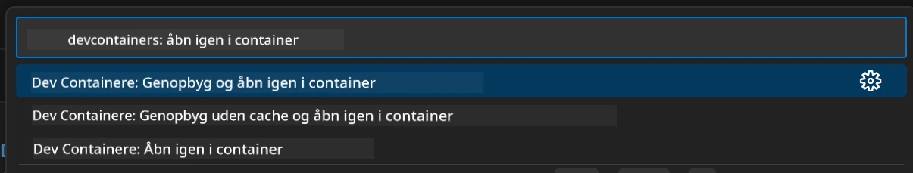
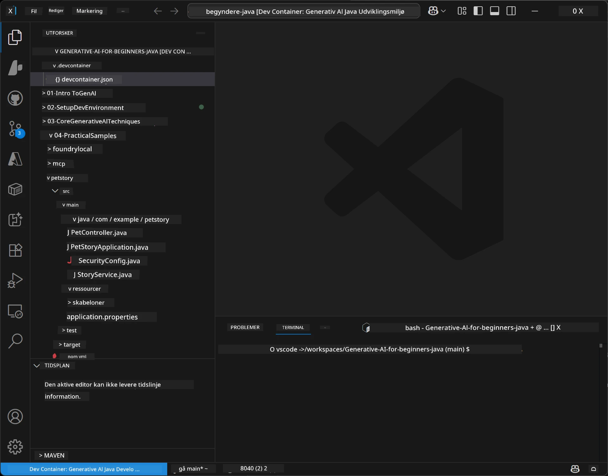
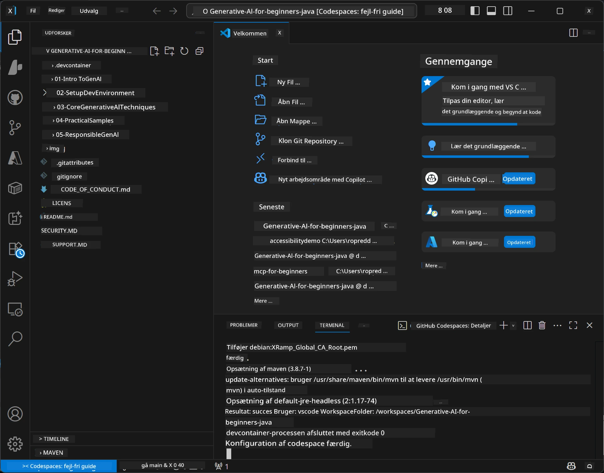

# Opsætning af Udviklingsmiljøet til Generativ AI for Java

> **Hurtig start:** Opret dine AI-modeller på **Azure AI Foundry** som kode med Bicep + `azd` på få minutter — se [Azure AI Foundry Opsætningsvejledning](getting-started-azure-openai.md). Godkendelse er **nøglefri** (Microsoft Entra ID), så der er ingen API-nøgler at administrere.

## Det, du vil lære

- Opsæt et Java-udviklingsmiljø til AI-applikationer
- Vælg og konfigurer dit foretrukne udviklingsmiljø (cloud-først med Codespaces, lokal dev container eller fuld lokal opsætning)
- Test din opsætning ved at forbinde til en Azure AI Foundry-model

## Indholdsfortegnelse

- [Det, du vil lære](#det-du-vil-lære)
- [Introduktion](#introduktion)
- [Trin 1: Opsæt dit Udviklingsmiljø](#trin-1-opsæt-dit-udviklingsmiljø)
  - [Mulighed A: GitHub Codespaces (Anbefalet)](#mulighed-a-github-codespaces-anbefalet)
  - [Mulighed B: Lokal Dev Container](#mulighed-b-lokal-dev-container)
  - [Mulighed C: Brug din Eksisterende Lokale Installation](#mulighed-c-brug-din-eksisterende-lokale-installation)
- [Trin 2: Provision Azure AI Foundry](#trin-2-provision-azure-ai-foundry)
- [Trin 3: Test din Opsætning](#trin-3-test-din-opsætning)
- [Fejlfinding](#fejlfinding)
- [Opsummering](#opsummering)
- [Næste Skridt](#næste-skridt)

## Introduktion

Dette kapitel guider dig gennem opsætningen af et udviklingsmiljø. Vi bruger **Azure AI Foundry** til modellerne gennem hele kurset. Du provisionerer modellerne som kode med Bicep og Azure Developer CLI (`azd`), og forbinder så med **nøglefri godkendelse** (Microsoft Entra ID) — ingen API-nøgler at kopiere eller lække.

**Ingen lokal opsætning nødvendig!** Du kan bruge GitHub Codespaces, som leverer et fuldt udviklingsmiljø i din browser, og provisionere Foundry derfra.

Vi bruger **Azure AI Foundry** til dette kursus, fordi det er:
- **Provisioneret som kode** — én `azd up` udruller kontoen og modeludrulningerne
- **Nøglefri** — autentificer med din Azure-login eller en administreret identitet
- **Produktionsklart** — den samme kode kører lokalt og i Azure
- **Fleksibelt** — skift modeller ved at ændre et udrulningsnavn, ikke koden

> **Bemærk**: Azure AI Foundry udrulninger faktureres per token (betal efter forbrug). Se [Azure AI Foundry opsætningsvejledningen](getting-started-azure-openai.md) for provisioning, region og prisdetaljer.


## Trin 1: Opsæt dit Udviklingsmiljø

<a name="quick-start-cloud"></a>

Vi har lavet en forudkonfigureret udviklingscontainer for at minimere opsætningstid og sikre, at du har alle nødvendige værktøjer til dette Generative AI for Java kursus. Vælg din foretrukne udviklingstilgang:

### Muligheder for Miljøopsætning:

#### Mulighed A: GitHub Codespaces (Anbefalet)

**Begynd at kode på 2 minutter - ingen lokal opsætning nødvendig!**

1. Fork denne repository til din GitHub-konto
   > **Bemærk**: Hvis du vil redigere den grundlæggende konfiguration, se venligst [Dev Container Konfigurationen](../../../.devcontainer/devcontainer.json)
2. Klik **Code** → fanen **Codespaces** → **...** → **Ny med muligheder...**
3. Brug standardindstillingerne – dette vælger **Dev container konfigurationen**: **Generative AI Java Udviklingsmiljø** speciallavet devcontainer til dette kursus
4. Klik på **Opret codespace**
5. Vent ca. 2 minutter på, at miljøet er klar
6. Fortsæt til [Trin 2: Provision Azure AI Foundry](#trin-2-provision-azure-ai-foundry)








> **Fordele ved Codespaces**:
> - Ingen lokal installation nødvendig
> - Fungerer på enhver enhed med en browser
> - Forudkonfigureret med alle værktøjer og afhængigheder
> - Gratis 60 timer om måneden for personlige konti
> - Konsistent miljø for alle elever

#### Mulighed B: Lokal Dev Container

**For udviklere, der foretrækker lokal udvikling med Docker**

1. Fork og klon denne repository til din lokale maskine
   > **Bemærk**: Hvis du vil redigere den grundlæggende konfiguration, se venligst [Dev Container Konfigurationen](../../../.devcontainer/devcontainer.json)
2. Installer [Docker Desktop](https://www.docker.com/products/docker-desktop/) og [VS Code](https://code.visualstudio.com/)
3. Installer [Dev Containers udvidelsen](https://marketplace.visualstudio.com/items?itemName=ms-vscode-remote.remote-containers) i VS Code
4. Åbn repository-mappen i VS Code
5. Når du bliver spurgt, klik på **Åbn i container igen** (eller brug `Ctrl+Shift+P` → "Dev Containers: Reopen in Container")
6. Vent på, at containeren bygges og starter
7. Fortsæt til [Trin 2: Provision Azure AI Foundry](#trin-2-provision-azure-ai-foundry)





#### Mulighed C: Brug din Eksisterende Lokale Installation

**For udviklere med eksisterende Java-miljøer**

Forudsætninger:
- [Java 21+](https://www.oracle.com/java/technologies/javase/jdk21-archive-downloads.html) 
- [Maven 3.9+](https://maven.apache.org/download.cgi)
- [VS Code](https://code.visualstudio.com) eller dit foretrukne IDE

Trin:
1. Klon denne repository til din lokale maskine
2. Åbn projektet i dit IDE
3. Fortsæt til [Trin 2: Provision Azure AI Foundry](#trin-2-provision-azure-ai-foundry)

> **Pro Tip**: Hvis du har en maskine med lav ydeevne, men gerne vil bruge VS Code lokalt, så brug GitHub Codespaces! Du kan forbinde din lokale VS Code til en cloud-hosted Codespace for det bedste fra begge verdener.




## Trin 2: Provision Azure AI Foundry

Udrul kursussets AI-modeller til Azure AI Foundry som kode. Fra repository-roden:

```bash
cd 02-SetupDevEnvironment
azd auth login
az login
azd up
```

`azd` spørger efter et miljønavn, abonnement og region, provisionerer en Azure AI Foundry-konto med `gpt-5.6-luna` og `text-embedding-3-small` udrulninger, og skriver endpoint i eksemplets `.env` - alt sammen med **nøglefri** autentificering (ingen API-nøgler).

> **Fuld gennemgang:** Se [Azure AI Foundry Opsætningsvejledning](getting-started-azure-openai.md) for forudsætninger, et manuelt (portal) alternativ, regionsvejledning og pris-/ryddeop-noter.

## Trin 3: Test din Opsætning

Når dine Foundry-modeller er provisioneret, test forbindelsen med eksempelappen i [`02-SetupDevEnvironment/examples/basic-chat-azure`](../../../02-SetupDevEnvironment/examples/basic-chat-azure).

1. Åbn terminalen i dit udviklingsmiljø.
2. Gå til eksemplet:
   ```bash
   cd 02-SetupDevEnvironment/examples/basic-chat-azure
   ```
3. Sørg for, at du er logget ind (nøglefri autentificering kræver en token):
   ```bash
   az login
   ```
   > Hvis du kørte `azd up`, blev `.env`-filen med dit endpoint allerede skrevet for dig.
4. Kør applikationen:
   ```bash
   mvn clean spring-boot:run
   ```

Du skulle gerne se et svar fra `gpt-5.6-luna` modellen.

### Forståelse af Eksempelkoden

[basic-chat eksemplet](./examples/basic-chat-azure/README.md) bruger **Spring Boot 4.1.1** og **Spring AI 2.0.1**. Spring AI's `ChatClient` bygger på den officielle OpenAI Java SDK, som forbinder til Azure OpenAI **v1** endpointet med nøglefri autentificering.

**Dette kode gør:**
- **Forbinder** til Azure AI Foundry med din Azure-login (Microsoft Entra ID) — ingen API-nøgle
- **Sender** et prompt til `gpt-5.6-luna` modellen
- **Modtager** og viser AI'ens svar
- **Validerer**, at din opsætning fungerer korrekt

**Nøgleafhængigheder** (uddrag fra [pom.xml](../../../02-SetupDevEnvironment/examples/basic-chat-azure/pom.xml)):
```xml
<dependency>
    <groupId>org.springframework.ai</groupId>
    <artifactId>spring-ai-starter-model-openai</artifactId>
</dependency>
<dependency>
    <groupId>com.openai</groupId>
    <artifactId>openai-java</artifactId>
</dependency>
<dependency>
    <groupId>com.azure</groupId>
    <artifactId>azure-identity</artifactId>
    <version>${azure-identity.version}</version>
</dependency>
```

POM'en styrer OpenAI Java **4.63.1** og sætter Azure Identity **1.18.6** eksplicit. Spring AI 2 fjernede den Azure-specifikke starter; Azure Identity er stadig nødvendig for credential bean.

**Konfiguration** ([application.yml](../../../02-SetupDevEnvironment/examples/basic-chat-azure/src/main/resources/application.yml)):
```yaml
spring:
  ai:
    openai:
      base-url: ${AZURE_OPENAI_ENDPOINT}
      microsoft-foundry: true
      chat:
        model: ${AZURE_OPENAI_DEPLOYMENT:gpt-5.6-luna}
        reasoning-effort: none
        max-completion-tokens: 500
```

Nøglefri autentificering er eksplicit konfigureret i [BasicChatApplication.java](../../../02-SetupDevEnvironment/examples/basic-chat-azure/src/main/java/com/example/BasicChatApplication.java), ikke udledt af en fraværende API-nøgle. Dens bearer credential bruger `DefaultAzureCredential` med `https://ai.azure.com/.default` scope, og dens `OpenAIClient` retter mod `/openai/v1`. App'en leverer denne klient til Spring AI's chat-model, så en global `OPENAI_API_KEY` kan ikke overskrive Azure-godkendelsen.

Chatindstillinger er direkte under `spring.ai.openai.chat`, uden en `options` blok. Lektionen bevarer Chat Completions med `reasoning-effort: none` og et 500-token afslutningsloft; den sætter ikke `temperature` eller `max-tokens`. Se [eksempellets konfigurationsreference](./examples/basic-chat-azure/README.md#spring-configuration) for API-valg og tool-calling vejledning.

## Opsummering

Efter at have gennemført ovenstående trin har du:

- Provisioneret Azure AI Foundry-modeller som kode med Bicep + `azd`
- Fået dit Java-udviklingsmiljø op at køre (om det så er Codespaces, dev containers eller lokalt)
- Forbundet til Azure AI Foundry med nøglefri godkendelse (Microsoft Entra ID) — ingen API-nøgler
- Testet at det hele virker med et simpelt eksempel, der taler med din model

## Næste Skridt

[Kapitel 3: Kerneteknikker i Generativ AI](../03-CoreGenerativeAITechniques/README.md)

## Fejlfinding

Har du problemer? Her er almindelige problemer og løsninger:

- **Godkendelse fejler (401/403)?** 
  - Kør `az login` — godkendelsen er nøglefri, så du skal være logget ind
  - Bekræft, at din konto har rollen **Cognitive Services OpenAI User** på ressourcen
  - Hvis du lige har provisioneret, vent et minut, så rolle-tildelingen kan slå igennem

- **Maven ikke fundet?** 
  - Hvis du bruger dev containers/Codespaces, bør Maven være forudinstalleret
  - For lokal opsætning, sørg for at Java 21+ og Maven 3.9+ er installeret
  - Prøv `mvn --version` for at bekræfte installationen

- **`azd` ikke fundet eller provisioning fejler?** 
  - Installer [Azure Developer CLI](https://aka.ms/azure-dev/install) og kør `azd auth login`
  - Vælg en region, hvor `gpt-5.6-luna` og `text-embedding-3-small` er tilgængelige (f.eks. `eastus2`), med tilstrækkelig kvote i dit valgte abonnement
  - Se [Azure AI Foundry opsætningsvejledningen](getting-started-azure-openai.md) for detaljer

- **Dev container starter ikke?** 
  - Sørg for at Docker Desktop kører (for lokal udvikling)
  - Prøv at genopbygge containeren: `Ctrl+Shift+P` → "Dev Containers: Rebuild Container"

- **Kompileringsfejl i applikationen?**
  - Sørg for, at du er i den korrekte mappe: `02-SetupDevEnvironment/examples/basic-chat-azure`
  - Prøv at rense og genkompilere: `mvn clean compile`

> **Brug for hjælp?**: Stadig problemer? Opret en issue i repository'et, så hjælper vi dig.

---

<!-- CO-OP TRANSLATOR DISCLAIMER START -->
**Ansvarsfraskrivelse**:
Dette dokument er blevet oversat ved hjælp af AI-oversættelsestjenesten [Co-op Translator](https://github.com/Azure/co-op-translator). Selvom vi bestræber os på nøjagtighed, skal du være opmærksom på, at automatiserede oversættelser kan indeholde fejl eller unøjagtigheder. Det originale dokument på dets oprindelige sprog bør betragtes som den autoritative kilde. For kritisk information anbefales professionel menneskelig oversættelse. Vi påtager os intet ansvar for misforståelser eller fejltolkninger, der opstår som følge af brugen af denne oversættelse.
<!-- CO-OP TRANSLATOR DISCLAIMER END -->