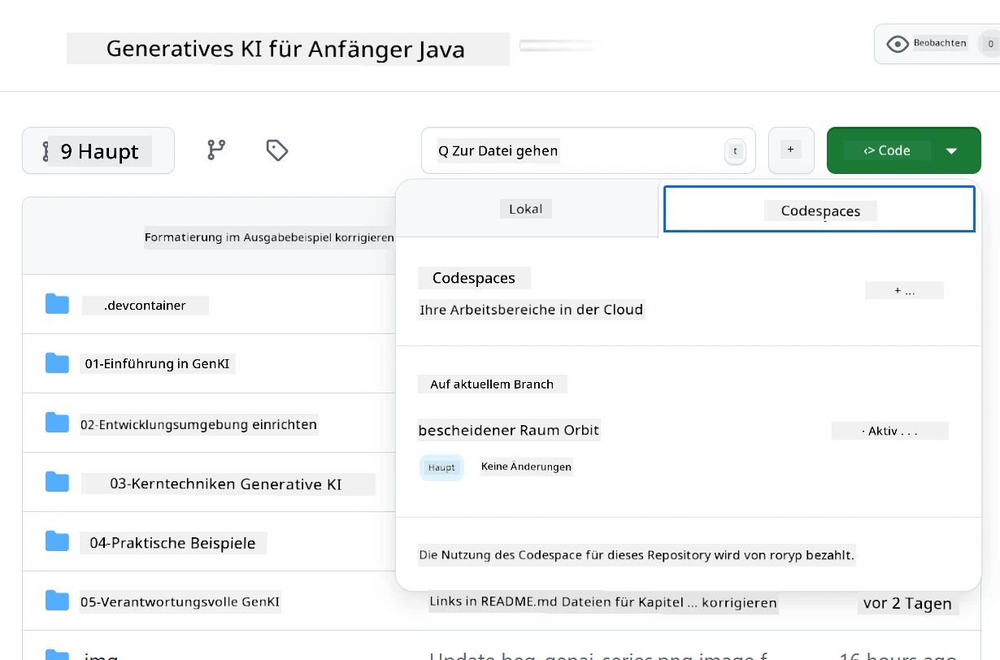
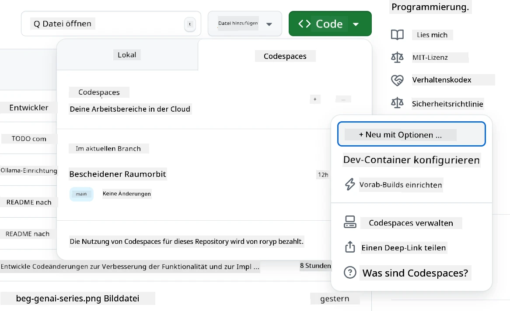
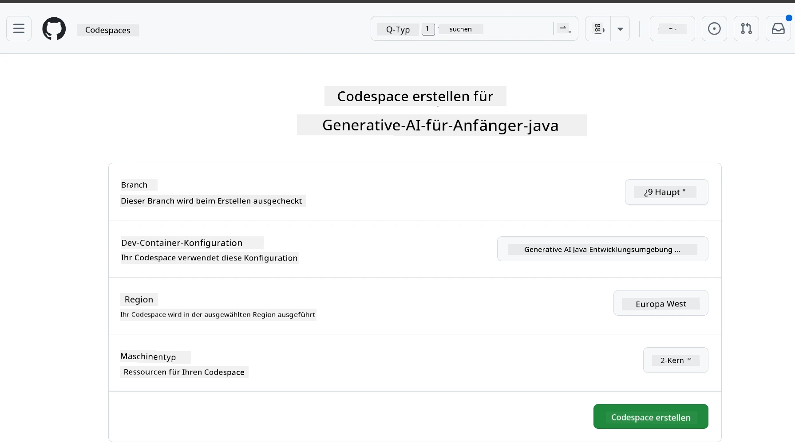
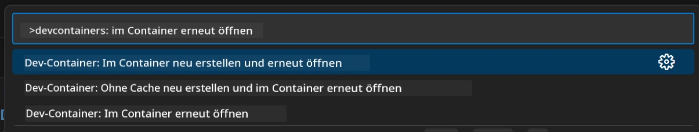
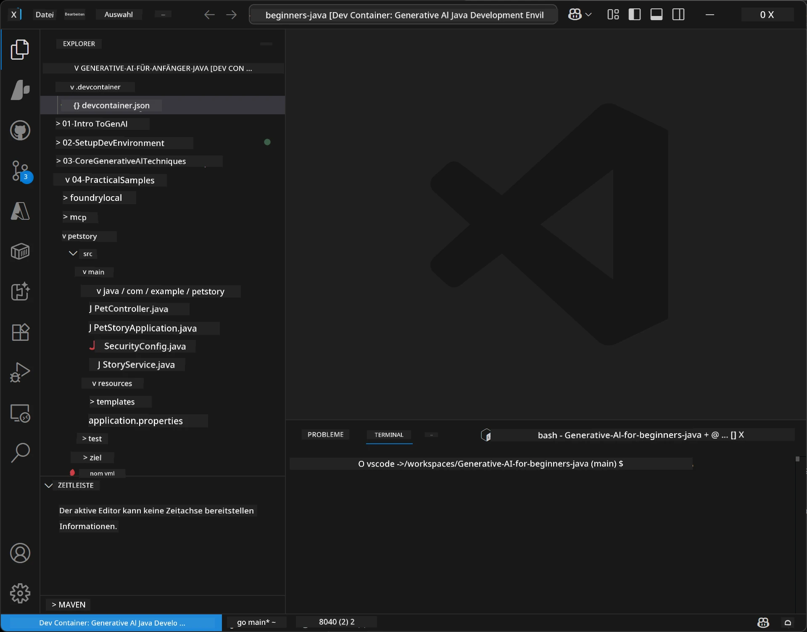
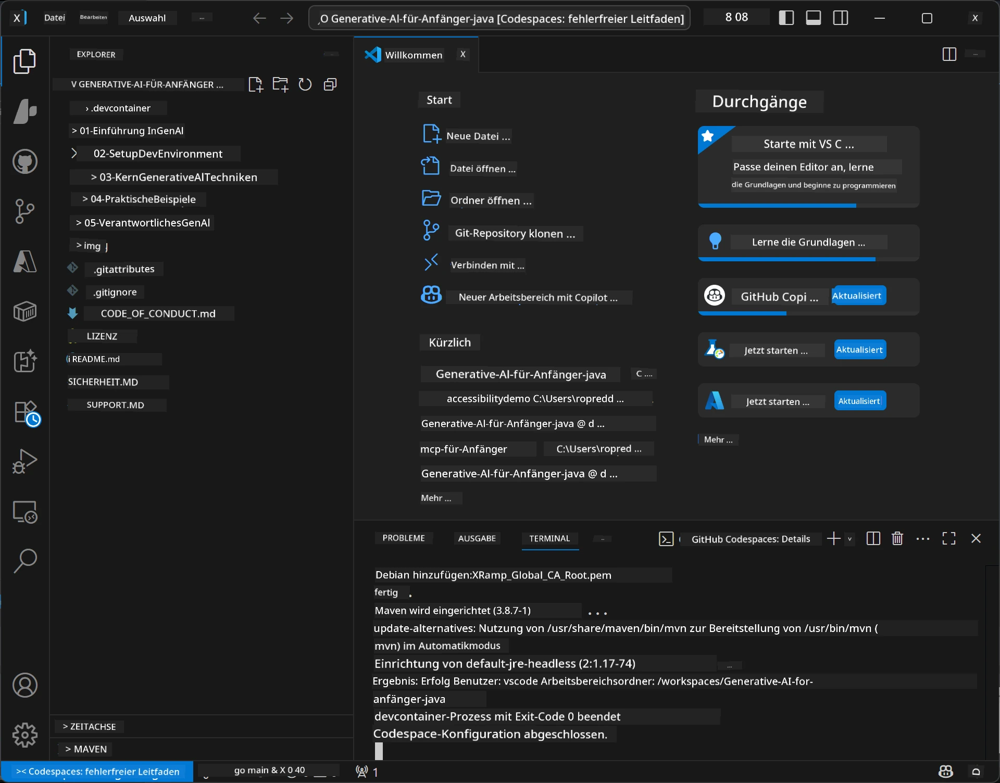

# Einrichten der Entwicklungsumgebung für Generative KI für Java

> **Schnellstart:** Stellen Sie Ihre KI-Modelle in wenigen Minuten als Code mit Bicep + `azd` auf **Azure AI Foundry** bereit — siehe die [Azure AI Foundry Einrichtungshilfe](getting-started-azure-openai.md). Die Authentifizierung ist **schlüssellos** (Microsoft Entra ID), daher gibt es keine zu verwaltenden API-Schlüssel.

## Was Sie lernen werden

- Richten Sie eine Java-Entwicklungsumgebung für KI-Anwendungen ein
- Wählen und konfigurieren Sie Ihre bevorzugte Entwicklungsumgebung (Cloud-first mit Codespaces, lokaler Dev-Container oder vollständige lokale Installation)
- Testen Sie Ihre Einrichtung mit einer Verbindung zu einem Azure AI Foundry Modell

## Inhaltsverzeichnis

- [Was Sie lernen werden](#was-sie-lernen-werden)
- [Einführung](#einführung)
- [Schritt 1: Richten Sie Ihre Entwicklungsumgebung ein](#schritt-1-richten-sie-ihre-entwicklungsumgebung-ein)
  - [Option A: GitHub Codespaces (empfohlen)](#option-a-github-codespaces-empfohlen)
  - [Option B: Lokaler Dev-Container](#option-b-lokaler-dev-container)
  - [Option C: Verwenden Sie Ihre bestehende lokale Installation](#option-c-verwenden-sie-ihre-bestehende-lokale-installation)
- [Schritt 2: Azure AI Foundry bereitstellen](#schritt-2-azure-ai-foundry-bereitstellen)
- [Schritt 3: Testen Sie Ihre Einrichtung](#schritt-3-testen-sie-ihre-einrichtung)
- [Fehlerbehebung](#fehlerbehebung)
- [Zusammenfassung](#zusammenfassung)
- [Nächste Schritte](#nächste-schritte)

## Einführung

Dieses Kapitel führt Sie durch das Einrichten einer Entwicklungsumgebung. Wir verwenden im gesamten Kurs **Azure AI Foundry** für die Modelle. Sie stellen die Modelle als Code mit Bicep und der Azure Developer CLI (`azd`) bereit und verbinden sich dann mit **schlüsselloser Authentifizierung** (Microsoft Entra ID) — keine API-Schlüssel zum Kopieren oder Risiko eines Lecks.

**Keine lokale Einrichtung erforderlich!** Sie können GitHub Codespaces verwenden, das eine vollständige Entwicklungsumgebung im Browser bereitstellt und Foundry von dort aus bereitstellt.

Wir verwenden **Azure AI Foundry** für diesen Kurs, weil es:
- **Als Code bereitgestellt** ist — mit einem `azd up` werden Konto und Modelldeployments bereitgestellt
- **Schlüssellos** ist — Authentifizierung mit Ihrem Azure-Anmeldename oder einer verwalteten Identität
- **Produktionsreif** ist — derselbe Code läuft lokal und in Azure
- **Flexibel** ist — Modelle durch Ändern des Bereitstellungsnamens tauschen, nicht den Code

> **Hinweis**: Die Azure AI Foundry Bereitstellungen werden pro Token abgerechnet (Pay-as-you-go). Details zur Bereitstellung, Region und Kosten finden Sie im [Azure AI Foundry Einrichtungshandbuch](getting-started-azure-openai.md).


## Schritt 1: Richten Sie Ihre Entwicklungsumgebung ein

<a name="quick-start-cloud"></a>

Wir haben einen vorkonfigurierten Entwicklungscontainer erstellt, um die Einrichtungszeit zu minimieren und sicherzustellen, dass Sie alle notwendigen Werkzeuge für diesen Generative AI für Java Kurs haben. Wählen Sie Ihre bevorzugte Entwicklungsoption:

### Optionen zur Einrichtung der Umgebung:

#### Option A: GitHub Codespaces (empfohlen)

**Starten Sie in 2 Minuten mit dem Coden – keine lokale Einrichtung erforderlich!**

1. Forken Sie dieses Repository in Ihrem GitHub-Konto
   > **Hinweis**: Wenn Sie die Basiskonfiguration bearbeiten möchten, schauen Sie bitte in die [Dev Container Konfiguration](../../../.devcontainer/devcontainer.json)
2. Klicken Sie auf **Code** → Reiter **Codespaces** → **...** → **Neu mit Optionen...**
3. Verwenden Sie die Standardwerte – damit wird die **Dev Container Konfiguration** ausgewählt: **Generative AI Java Development Environment**, ein benutzerdefinierter Devcontainer, der für diesen Kurs erstellt wurde
4. Klicken Sie auf **Codespace erstellen**
5. Warten Sie ca. 2 Minuten, bis die Umgebung bereit ist
6. Fahren Sie mit [Schritt 2: Azure AI Foundry bereitstellen](#schritt-2-azure-ai-foundry-bereitstellen) fort








> **Vorteile von Codespaces**:
> - Keine lokale Installation erforderlich
> - Funktioniert auf jedem Gerät mit Browser
> - Vorgekonfiguriert mit allen Tools und Abhängigkeiten
> - Kostenlos 60 Stunden pro Monat für persönliche Konten
> - Einheitliche Umgebung für alle Lernenden

#### Option B: Lokaler Dev-Container

**Für Entwickler, die lokale Entwicklung mit Docker bevorzugen**

1. Forken und klonen Sie dieses Repository auf Ihre lokale Maschine
   > **Hinweis**: Wenn Sie die Basiskonfiguration bearbeiten möchten, schauen Sie bitte in die [Dev Container Konfiguration](../../../.devcontainer/devcontainer.json)
2. Installieren Sie [Docker Desktop](https://www.docker.com/products/docker-desktop/) und [VS Code](https://code.visualstudio.com/)
3. Installieren Sie die [Dev Containers Erweiterung](https://marketplace.visualstudio.com/items?itemName=ms-vscode-remote.remote-containers) in VS Code
4. Öffnen Sie den Repository-Ordner in VS Code
5. Klicken Sie beim Prompt auf **Im Container neu öffnen** (oder verwenden Sie `Ctrl+Shift+P` → "Dev Containers: Im Container neu öffnen")
6. Warten Sie, bis der Container gebaut und gestartet wurde
7. Fahren Sie mit [Schritt 2: Azure AI Foundry bereitstellen](#schritt-2-azure-ai-foundry-bereitstellen) fort





#### Option C: Verwenden Sie Ihre bestehende lokale Installation

**Für Entwickler mit bestehenden Java-Umgebungen**

Voraussetzungen:
- [Java 21+](https://www.oracle.com/java/technologies/javase/jdk21-archive-downloads.html) 
- [Maven 3.9+](https://maven.apache.org/download.cgi)
- [VS Code](https://code.visualstudio.com) oder Ihre bevorzugte IDE

Schritte:
1. Klonen Sie dieses Repository auf Ihre lokale Maschine
2. Öffnen Sie das Projekt in Ihrer IDE
3. Fahren Sie mit [Schritt 2: Azure AI Foundry bereitstellen](#schritt-2-azure-ai-foundry-bereitstellen) fort

> **Profi-Tipp**: Wenn Sie eine leistungsschwache Maschine haben, aber VS Code lokal nutzen möchten, verwenden Sie GitHub Codespaces! Sie können Ihren lokalen VS Code an einen cloud-gehosteten Codespace anbinden und das Beste aus beiden Welten nutzen.




## Schritt 2: Azure AI Foundry bereitstellen

Stellen Sie die KI-Modelle des Kurses als Code in Azure AI Foundry bereit. Vom Repository-Stamm:

```bash
cd 02-SetupDevEnvironment
azd auth login
az login
azd up
```

`azd` fordert Sie zur Eingabe eines Umgebungsnamens, Abonnements und einer Region auf, stellt ein Azure AI Foundry-Konto mit den Bereitstellungen `gpt-5.6-luna` und `text-embedding-3-small` bereit und schreibt den Endpunkt in die `.env` des Beispiels — alles mit **schlüsselloser** Authentifizierung (keine API-Schlüssel).

> **Vollständige Anleitung:** Siehe die [Azure AI Foundry Einrichtungshilfe](getting-started-azure-openai.md) für Voraussetzungen, eine manuelle (Portal) Alternative, Regionsrichtlinien sowie Kosten- und Bereinigungsnotizen.

## Schritt 3: Testen Sie Ihre Einrichtung

Sobald Ihre Foundry-Modelle bereitgestellt sind, testen Sie die Verbindung mit der Beispielanwendung in [`02-SetupDevEnvironment/examples/basic-chat-azure`](../../../02-SetupDevEnvironment/examples/basic-chat-azure).

1. Öffnen Sie das Terminal in Ihrer Entwicklungsumgebung.
2. Navigieren Sie zum Beispiel:
   ```bash
   cd 02-SetupDevEnvironment/examples/basic-chat-azure
   ```
3. Stellen Sie sicher, dass Sie angemeldet sind (Schlüssellose Authentifizierung benötigt ein Token):
   ```bash
   az login
   ```
   > Wenn Sie `azd up` ausgeführt haben, wurde die `.env`-Datei mit Ihrem Endpunkt bereits für Sie geschrieben.
4. Starten Sie die Anwendung:
   ```bash
   mvn clean spring-boot:run
   ```

Sie sollten eine Antwort vom `gpt-5.6-luna` Modell erhalten.

### Das Beispiel verstehen

Das [basic-chat Beispiel](./examples/basic-chat-azure/README.md) verwendet **Spring Boot 4.1.1** und **Spring AI 2.0.1**. Spring AIs `ChatClient` basiert auf dem offiziellen OpenAI Java SDK und verbindet sich mit dem Azure OpenAI **v1** Endpunkt über schlüssellose Authentifizierung.

**Was dieser Code macht:**
- Stellt eine **Verbindung** zu Azure AI Foundry mit Ihrem Azure-Anmeldeinformationen (Microsoft Entra ID) her — ohne API-Key
- **Sendet** einen Prompt an das `gpt-5.6-luna` Modell
- **Empfängt** und zeigt die Antwort der KI an
- **Validiert**, dass Ihre Einrichtung korrekt funktioniert

**Wichtige Abhängigkeiten** (Auszug aus [pom.xml](../../../02-SetupDevEnvironment/examples/basic-chat-azure/pom.xml)):
```xml
<dependency>
    <groupId>org.springframework.ai</groupId>
    <artifactId>spring-ai-starter-model-openai</artifactId>
</dependency>
<dependency>
    <groupId>com.openai</groupId>
    <artifactId>openai-java</artifactId>
</dependency>
<dependency>
    <groupId>com.azure</groupId>
    <artifactId>azure-identity</artifactId>
    <version>${azure-identity.version}</version>
</dependency>
```

Die POM verwaltet OpenAI Java **4.63.1** und setzt Azure Identity **1.18.6** explizit. Spring AI 2 entfernte den Azure-spezifischen Starter; Azure Identity wird weiterhin für die Credential Bean benötigt.

**Konfiguration** ([application.yml](../../../02-SetupDevEnvironment/examples/basic-chat-azure/src/main/resources/application.yml)):
```yaml
spring:
  ai:
    openai:
      base-url: ${AZURE_OPENAI_ENDPOINT}
      microsoft-foundry: true
      chat:
        model: ${AZURE_OPENAI_DEPLOYMENT:gpt-5.6-luna}
        reasoning-effort: none
        max-completion-tokens: 500
```

Schlüssellose Authentifizierung ist explizit in [BasicChatApplication.java](../../../02-SetupDevEnvironment/examples/basic-chat-azure/src/main/java/com/example/BasicChatApplication.java) konfiguriert, wird also nicht durch einen fehlenden API-Key angenommen. Die verwendeten Bearer-Credentials nutzen `DefaultAzureCredential` mit dem Scope `https://ai.azure.com/.default`, und der `OpenAIClient` zielt auf `/openai/v1`. Die App übergibt diesen Client an das Spring AI Chatmodell, sodass ein globaler `OPENAI_API_KEY` die Azure-Authentifizierung nicht überschreiben kann.

Die Chat-Einstellungen befinden sich direkt unter `spring.ai.openai.chat`, ohne einen `options` Block. Die Lektion behält Chat Completions mit `reasoning-effort: none` und einem Limit von 500 Token; `temperature` oder `max-tokens` werden nicht gesetzt. Siehe die [Konfigurationsreferenz des Beispiels](./examples/basic-chat-azure/README.md#spring-configuration) für API-Auswahl und Tool-Aufruf-Anleitungen.

## Zusammenfassung

Nach Abschluss der obigen Schritte haben Sie:

- Azure AI Foundry-Modelle als Code mit Bicep + `azd` bereitgestellt
- Ihre Java-Entwicklungsumgebung laufen (ob Codespaces, Dev Container oder lokal)
- Eine Verbindung zu Azure AI Foundry mit schlüsselloser Authentifizierung (Microsoft Entra ID) hergestellt — keine API-Schlüssel
- Alles mit einem einfachen Beispiel getestet, das mit Ihrem Modell kommuniziert

## Nächste Schritte

[Kapitel 3: Wichtige Techniken der generativen KI](../03-CoreGenerativeAITechniques/README.md)

## Fehlerbehebung

Probleme? Hier sind häufige Probleme und Lösungen:

- **Authentifizierung schlägt fehl (401/403)?** 
  - Führen Sie `az login` aus — die Authentifizierung ist schlüssellos, Sie müssen angemeldet sein
  - Vergewissern Sie sich, dass Ihr Konto die Rolle **Cognitive Services OpenAI User** für die Ressource hat
  - Wenn Sie gerade erst bereitgestellt haben, warten Sie eine Minute, bis die Rollenzuweisung wirksam wird

- **Maven nicht gefunden?** 
  - Wenn Sie Dev Container/Codespaces verwenden, sollte Maven vorinstalliert sein
  - Bei lokaler Einrichtung stellen Sie sicher, dass Java 21+ und Maven 3.9+ installiert sind
  - Versuchen Sie `mvn --version` zur Überprüfung der Installation

- **`azd` nicht gefunden oder Bereitstellung schlägt fehl?** 
  - Installieren Sie die [Azure Developer CLI](https://aka.ms/azure-dev/install) und führen Sie `azd auth login` aus
  - Wählen Sie eine Region, in der `gpt-5.6-luna` und `text-embedding-3-small` verfügbar sind (z.B. `eastus2`), mit ausreichendem Kontingent im ausgewählten Abonnement
  - Details siehe die [Azure AI Foundry Einrichtungshilfe](getting-started-azure-openai.md)

- **Dev Container startet nicht?** 
  - Stellen Sie sicher, dass Docker Desktop läuft (für lokale Entwicklung)
  - Versuchen Sie, den Container neu zu bauen: `Ctrl+Shift+P` → "Dev Containers: Container neu bauen"

- **Kompilierfehler der Anwendung?**
  - Stellen Sie sicher, dass Sie im richtigen Verzeichnis sind: `02-SetupDevEnvironment/examples/basic-chat-azure`
  - Versuchen Sie eine Reinigung und Neuerstellung: `mvn clean compile`

> **Brauchen Sie Hilfe?**: Noch Probleme? Eröffnen Sie ein Issue im Repository, wir helfen Ihnen gern weiter.

---

<!-- CO-OP TRANSLATOR DISCLAIMER START -->
**Haftungsausschluss**:
Dieses Dokument wurde mit dem KI-Übersetzungsdienst [Co-op Translator](https://github.com/Azure/co-op-translator) übersetzt. Obwohl wir uns um Genauigkeit bemühen, beachten Sie bitte, dass automatisierte Übersetzungen Fehler oder Ungenauigkeiten enthalten können. Das Originaldokument in seiner Ursprungssprache gilt als maßgebliche Quelle. Bei kritischen Informationen wird eine professionelle menschliche Übersetzung empfohlen. Wir übernehmen keine Haftung für Missverständnisse oder Fehlinterpretationen, die aus der Verwendung dieser Übersetzung entstehen.
<!-- CO-OP TRANSLATOR DISCLAIMER END -->