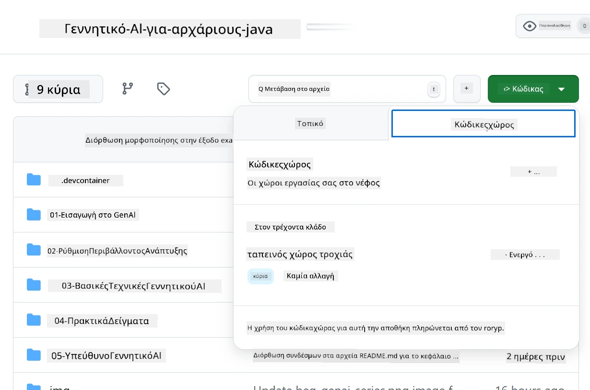
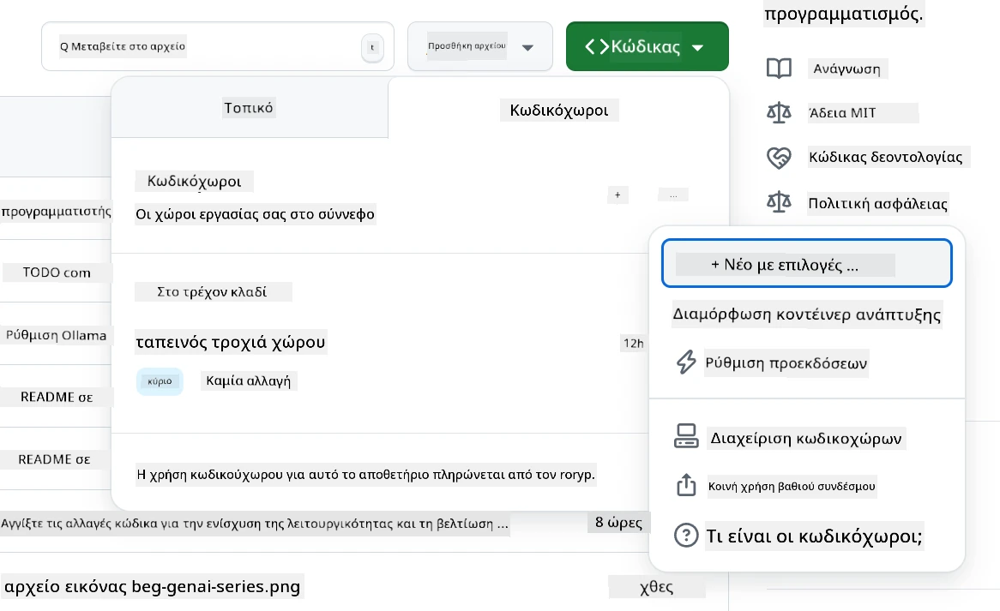
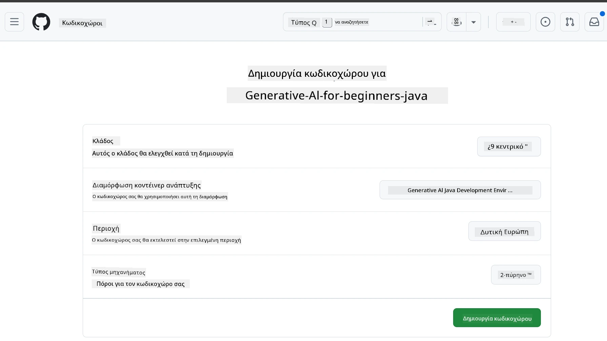
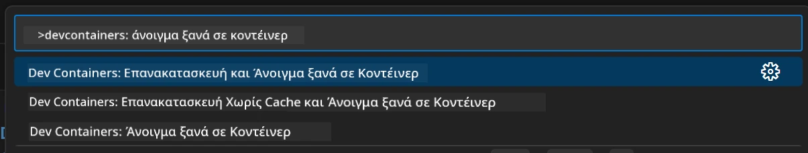
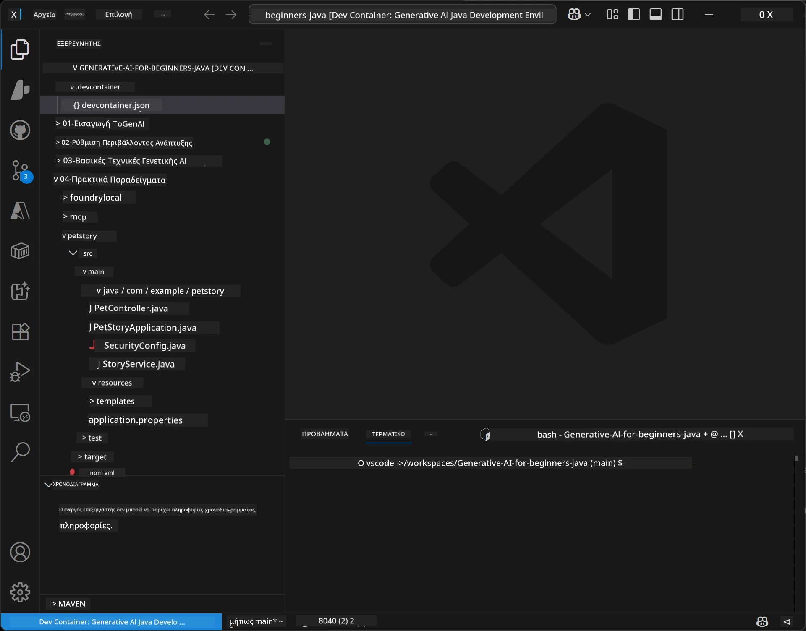
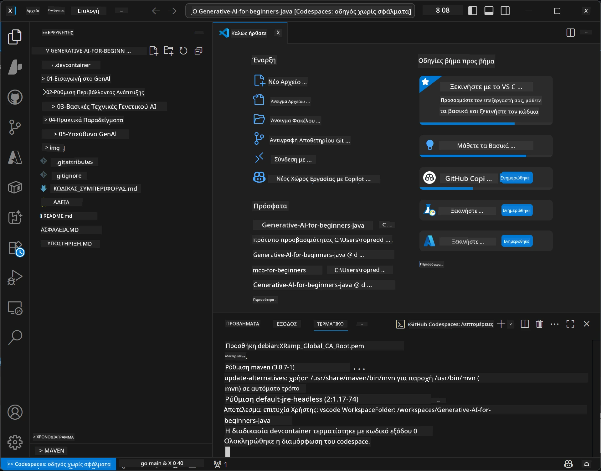

# Ρύθμιση Περιβάλλοντος Ανάπτυξης για Generative AI για Java

> **Γρήγορη Εκκίνηση:** Παρέχετε τα μοντέλα AI σας στο **Azure AI Foundry** ως κώδικα με Bicep + `azd` μέσα σε λίγα λεπτά — δείτε τον [Οδηγό Ρύθμισης Azure AI Foundry](getting-started-azure-openai.md). Η πιστοποίηση είναι **χωρίς κλειδί** (Microsoft Entra ID), επομένως δεν υπάρχουν API κλειδιά να διαχειριστείτε.

## Τι Θα Μάθετε

- Ρύθμιση περιβάλλοντος ανάπτυξης Java για εφαρμογές AI
- Επιλογή και διαμόρφωση του προτιμώμενου περιβάλλοντος ανάπτυξης (πρώτα στο cloud με Codespaces, τοπικό δοχείο ανάπτυξης ή πλήρης τοπική ρύθμιση)
- Δοκιμή της ρύθμισής σας με σύνδεση σε μοντέλο Azure AI Foundry

## Περιεχόμενα

- [Τι Θα Μάθετε](#τι-θα-μάθετε)
- [Εισαγωγή](#εισαγωγή)
- [Βήμα 1: Ρύθμιση Περιβάλλοντος Ανάπτυξης](#βήμα-1-ρύθμιση-περιβάλλοντος-ανάπτυξης)
  - [Επιλογή Α: GitHub Codespaces (Προτεινόμενο)](#επιλογή-α-github-codespaces-προτεινόμενο)
  - [Επιλογή Β: Τοπικό Δοχείο Ανάπτυξης](#επιλογή-β-τοπικό-δοχείο-ανάπτυξης)
  - [Επιλογή Γ: Χρήση Υφιστάμενης Τοπικής Εγκατάστασης](#επιλογή-γ-χρήση-υφιστάμενης-τοπικής-εγκατάστασης)
- [Βήμα 2: Παροχή Azure AI Foundry](#βήμα-2-παροχή-azure-ai-foundry)
- [Βήμα 3: Δοκιμή της Ρύθμισής Σας](#βήμα-3-δοκιμή-της-ρύθμισής-σας)
- [Επίλυση Προβλημάτων](#επίλυση-προβλημάτων)
- [Περίληψη](#περίληψη)
- [Επόμενα Βήματα](#επόμενα-βήματα)

## Εισαγωγή

Αυτό το κεφάλαιο θα σας καθοδηγήσει στη ρύθμιση περιβάλλοντος ανάπτυξης. Θα χρησιμοποιήσουμε το **Azure AI Foundry** για τα μοντέλα σε όλο το μάθημα. Παρέχετε τα μοντέλα ως κώδικα με Bicep και το Azure Developer CLI (`azd`), και στη συνέχεια συνδέεστε με **πιστοποίηση χωρίς κλειδί** (Microsoft Entra ID) — χωρίς αντιγραφή ή διαρροή κλειδιών API.

**Δεν απαιτείται τοπική ρύθμιση!** Μπορείτε να χρησιμοποιήσετε το GitHub Codespaces, που παρέχει πλήρες περιβάλλον ανάπτυξης στο πρόγραμμα περιήγησής σας, και να παρέχετε το Foundry από εκεί.

Χρησιμοποιούμε το **Azure AI Foundry** για αυτό το μάθημα επειδή είναι:
- **Παρέχεται ως κώδικας** — ένα `azd up` αναπτύσσει τον λογαριασμό και τις αναπτύξεις μοντέλων
- **Χωρίς κλειδί** — πιστοποιηθείτε με την είσοδο Azure ή μια διαχειριζόμενη ταυτότητα
- **Έτοιμο για παραγωγή** — ο ίδιος κώδικας εκτελείται τοπικά και στο Azure
- **Ευέλικτο** — αλλάζετε μοντέλα με αλλαγή ονόματος ανάπτυξης, όχι του κώδικά σας

> **Σημείωση**: Οι αναπτύξεις Azure AI Foundry χρεώνονται ανά token (pay-as-you-go). Δείτε τον [οδηγό ρύθμισης Azure AI Foundry](getting-started-azure-openai.md) για λεπτομέρειες παροχής, περιοχής και κόστους.


## Βήμα 1: Ρύθμιση Περιβάλλοντος Ανάπτυξης

<a name="quick-start-cloud"></a>

Δημιουργήσαμε ένα προδιαμορφωμένο δοχείο ανάπτυξης για να ελαχιστοποιήσουμε τον χρόνο ρύθμισης και να βεβαιωθούμε ότι έχετε όλα τα απαραίτητα εργαλεία για αυτό το μάθημα Generative AI για Java. Επιλέξτε την προτιμώμενη μέθοδο ανάπτυξης:

### Επιλογές Ρύθμισης Περιβάλλοντος:

#### Επιλογή Α: GitHub Codespaces (Προτεινόμενο)

**Ξεκινήστε να κωδικοποιείτε σε 2 λεπτά - χωρίς τοπική ρύθμιση!**

1. Κάντε fork αυτό το αποθετήριο στον λογαριασμό GitHub σας
   > **Σημείωση**: Αν θέλετε να επεξεργαστείτε τη βασική διαμόρφωση, δείτε το [Dev Container Configuration](../../../.devcontainer/devcontainer.json)
2. Κάντε κλικ στο **Code** → καρτέλα **Codespaces** → **...** → **Νέο με επιλογές...**
3. Χρησιμοποιήστε τις προεπιλογές – αυτό θα επιλέξει τη **Διαμόρφωση δοχείου ανάπτυξης**: **Περιβάλλον Ανάπτυξης Generative AI Java** ειδικά διαμορφωμένο για αυτό το μάθημα
4. Κάντε κλικ στο **Create codespace**
5. Περιμένετε περίπου 2 λεπτά για να είναι έτοιμο το περιβάλλον
6. Συνεχίστε στο [Βήμα 2: Παροχή Azure AI Foundry](#βήμα-2-παροχή-azure-ai-foundry)








> **Οφέλη των Codespaces**:
> - Δεν απαιτείται τοπική εγκατάσταση
> - Λειτουργεί σε οποιαδήποτε συσκευή με πρόγραμμα περιήγησης
> - Προρυθμισμένο με όλα τα εργαλεία και εξαρτήσεις
> - Δωρεάν 60 ώρες το μήνα για προσωπικούς λογαριασμούς
> - Συνεπές περιβάλλον για όλους τους μαθητές

#### Επιλογή Β: Τοπικό Δοχείο Ανάπτυξης

**Για προγραμματιστές που προτιμούν τοπική ανάπτυξη με Docker**

1. Κάντε fork και κλωνοποιήστε αυτό το αποθετήριο στη τοπική σας μηχανή
   > **Σημείωση**: Αν θέλετε να επεξεργαστείτε τη βασική διαμόρφωση, δείτε το [Dev Container Configuration](../../../.devcontainer/devcontainer.json)
2. Εγκαταστήστε [Docker Desktop](https://www.docker.com/products/docker-desktop/) και [VS Code](https://code.visualstudio.com/)
3. Εγκαταστήστε την επέκταση [Dev Containers extension](https://marketplace.visualstudio.com/items?itemName=ms-vscode-remote.remote-containers) στο VS Code
4. Ανοίξτε τον φάκελο του αποθετηρίου στο VS Code
5. Όταν ερωτηθείτε, κάντε κλικ στο **Reopen in Container** (ή χρησιμοποιήστε `Ctrl+Shift+P` → "Dev Containers: Reopen in Container")
6. Περιμένετε να χτιστεί και να ξεκινήσει το δοχείο
7. Συνεχίστε στο [Βήμα 2: Παροχή Azure AI Foundry](#βήμα-2-παροχή-azure-ai-foundry)





#### Επιλογή Γ: Χρήση Υφιστάμενης Τοπικής Εγκατάστασης

**Για προγραμματιστές με υπάρχοντα περιβάλλοντα Java**

Προαπαιτούμενα:
- [Java 21+](https://www.oracle.com/java/technologies/javase/jdk21-archive-downloads.html) 
- [Maven 3.9+](https://maven.apache.org/download.cgi)
- [VS Code](https://code.visualstudio.com) ή το προτιμώμενο IDE σας

Βήματα:
1. Κλωνοποιήστε αυτό το αποθετήριο στη τοπική σας μηχανή
2. Ανοίξτε το έργο στο IDE σας
3. Συνεχίστε στο [Βήμα 2: Παροχή Azure AI Foundry](#βήμα-2-παροχή-azure-ai-foundry)

> **Συμβουλή:** Αν έχετε μηχανή με χαμηλές προδιαγραφές αλλά θέλετε το VS Code τοπικά, χρησιμοποιήστε τα GitHub Codespaces! Μπορείτε να συνδέσετε το τοπικό VS Code σε έναν cloud-hosted Codespace για το καλύτερο και από τους δύο κόσμους.




## Βήμα 2: Παροχή Azure AI Foundry

Αναπτύξτε τα μοντέλα AI του μαθήματος στο Azure AI Foundry ως κώδικα. Από τη ρίζα του αποθετηρίου:

```bash
cd 02-SetupDevEnvironment
azd auth login
az login
azd up
```

Το `azd` ζητάει όνομα περιβάλλοντος, συνδρομή και περιοχή, παρέχει λογαριασμό Azure AI Foundry με αναπτύξεις `gpt-5.6-luna` και `text-embedding-3-small`, και γράφει το endpoint στο `.env` του παραδείγματος - όλα με **πιστοποίηση χωρίς κλειδί** (χωρίς API κλειδιά).

> **Οδηγός βήμα-βήμα:** Δείτε τον [Οδηγό Ρύθμισης Azure AI Foundry](getting-started-azure-openai.md) για προαπαιτούμενα, εναλλακτική χειροκίνητη (portal) μέθοδο, οδηγίες περιοχής και σημειώσεις κόστους/καθαρισμού.

## Βήμα 3: Δοκιμή της Ρύθμισής Σας

Μόλις δοθούν τα μοντέλα Foundry, δοκιμάστε τη σύνδεση με την εφαρμογή παραδείγματος στο [`02-SetupDevEnvironment/examples/basic-chat-azure`](../../../02-SetupDevEnvironment/examples/basic-chat-azure).

1. Ανοίξτε το τερματικό στο περιβάλλον ανάπτυξής σας.
2. Μεταβείτε στο παράδειγμα:
   ```bash
   cd 02-SetupDevEnvironment/examples/basic-chat-azure
   ```
3. Βεβαιωθείτε ότι έχετε κάνει είσοδο (η πιστοποίηση χωρίς κλειδί χρειάζεται token):
   ```bash
   az login
   ```
   > Αν εκτελέσατε `azd up`, το αρχείο `.env` με το endpoint έχει ήδη γραφτεί για εσάς.
4. Εκτελέστε την εφαρμογή:
   ```bash
   mvn clean spring-boot:run
   ```

Θα δείτε μια απάντηση από το μοντέλο `gpt-5.6-luna`.

### Κατανόηση του Κώδικα Παραδείγματος

Το [παράδειγμα basic-chat](./examples/basic-chat-azure/README.md) χρησιμοποιεί **Spring Boot 4.1.1** και **Spring AI 2.0.1**. Ο `ChatClient` του Spring AI βασίζεται στο επίσημο OpenAI Java SDK, συνδέεται με το Azure OpenAI **v1** endpoint με πιστοποίηση χωρίς κλειδί.

**Τι κάνει αυτός ο κώδικας:**
- **Συνδέεται** με το Azure AI Foundry χρησιμοποιώντας την είσοδο Azure σας (Microsoft Entra ID) — χωρίς κλειδί API
- **Στέλνει** ένα prompt στο μοντέλο `gpt-5.6-luna`
- **Λαμβάνει** και εμφανίζει την απάντηση της AI
- **Επαληθεύει** ότι η ρύθμιση δουλεύει σωστά

**Κύριες εξαρτήσεις** (απόσπασμα από [pom.xml](../../../02-SetupDevEnvironment/examples/basic-chat-azure/pom.xml)):
```xml
<dependency>
    <groupId>org.springframework.ai</groupId>
    <artifactId>spring-ai-starter-model-openai</artifactId>
</dependency>
<dependency>
    <groupId>com.openai</groupId>
    <artifactId>openai-java</artifactId>
</dependency>
<dependency>
    <groupId>com.azure</groupId>
    <artifactId>azure-identity</artifactId>
    <version>${azure-identity.version}</version>
</dependency>
```

Το POM διαχειρίζεται το OpenAI Java **4.63.1** και θέτει ρητά το Azure Identity **1.18.6**. Το Spring AI 2 αφαίρεσε τον Azure-specific starter, αλλά το Azure Identity χρειάζεται για το credential bean.

**Διαμόρφωση** ([application.yml](../../../02-SetupDevEnvironment/examples/basic-chat-azure/src/main/resources/application.yml)):
```yaml
spring:
  ai:
    openai:
      base-url: ${AZURE_OPENAI_ENDPOINT}
      microsoft-foundry: true
      chat:
        model: ${AZURE_OPENAI_DEPLOYMENT:gpt-5.6-luna}
        reasoning-effort: none
        max-completion-tokens: 500
```

Η πιστοποίηση χωρίς κλειδί διαμορφώνεται ρητά στο [BasicChatApplication.java](../../../02-SetupDevEnvironment/examples/basic-chat-azure/src/main/java/com/example/BasicChatApplication.java), δεν υπονοείται από την απουσία κλειδιού API. Η ταυτότητά του χρησιμοποιεί `DefaultAzureCredential` με το εύρος `https://ai.azure.com/.default`, και ο `OpenAIClient` απευθύνεται στο `/openai/v1`. Η εφαρμογή παρέχει αυτόν τον client στο chat model του Spring AI, ώστε ένα παγκόσμιο `OPENAI_API_KEY` να μην υπερισχύει της πιστοποίησης Azure.

Οι ρυθμίσεις chat είναι απευθείας κάτω από `spring.ai.openai.chat`, χωρίς μπλοκ `options`. Το μάθημα διατηρεί τις Συμπληρώσεις Chat με `reasoning-effort: none` και όριο 500 tokens, δεν ρυθμίζει `temperature` ή `max-tokens`. Δείτε την [αναφορά διαμόρφωσης του παραδείγματος](./examples/basic-chat-azure/README.md#spring-configuration) για επιλογή API και οδηγίες κλήσης εργαλείων.

## Περίληψη

Μετά την ολοκλήρωση των παραπάνω βημάτων, θα έχετε:

- Παρέχει Azure AI Foundry μοντέλα ως κώδικα με Bicep + `azd`
- Έχετε το περιβάλλον ανάπτυξης Java σε λειτουργία (είτε Codespaces, δοχεία ανάπτυξης, είτε τοπικό)
- Συνδεθεί με Azure AI Foundry με πιστοποίηση χωρίς κλειδί (Microsoft Entra ID) — χωρίς API κλειδιά
- Δοκιμαστεί ότι όλα λειτουργούν με ένα απλό παράδειγμα που μιλάει με το μοντέλο σας

## Επόμενα Βήματα

[Κεφάλαιο 3: Βασικές Τεχνικές Generative AI](../03-CoreGenerativeAITechniques/README.md)

## Επίλυση Προβλημάτων

Έχετε προβλήματα; Εδώ είναι κοινά προβλήματα και λύσεις:

- **Αδυναμία πιστοποίησης (401/403)?** 
  - Εκτελέστε `az login` — η πιστοποίηση είναι χωρίς κλειδί, πρέπει να είστε συνδεδεμένοι
  - Βεβαιωθείτε ότι ο λογαριασμός σας έχει ρόλο **Cognitive Services OpenAI User** στην πηγή
  - Αν μόλις παρείχατε, περιμένετε ένα λεπτό για να διαδοθεί η ανάθεση ρόλου

- **Δεν βρέθηκε Maven?** 
  - Αν χρησιμοποιείτε δοχεία ανάπτυξης/ Codespaces, το Maven πρέπει να είναι προεγκατεστημένο
  - Για τοπική ρύθμιση, βεβαιωθείτε ότι είναι εγκατεστημένο Java 21+ και Maven 3.9+
  - Δοκιμάστε `mvn --version` για επιβεβαίωση εγκατάστασης

- **Δεν βρέθηκε `azd` ή αποτυχία παροχής;** 
  - Εγκαταστήστε το [Azure Developer CLI](https://aka.ms/azure-dev/install) και εκτελέστε `azd auth login`
  - Επιλέξτε μια περιοχή όπου τα `gpt-5.6-luna` και `text-embedding-3-small` είναι διαθέσιμα (π.χ. `eastus2`), με επαρκή όριο στην επιλεγμένη συνδρομή
  - Δείτε τον [οδηγό ρύθμισης Azure AI Foundry](getting-started-azure-openai.md) για λεπτομέρειες

- **Το δοχείο ανάπτυξης δεν ξεκινάει;** 
  - Βεβαιωθείτε ότι ο Docker Desktop τρέχει (για τοπική ανάπτυξη)
  - Δοκιμάστε να ξαναχτίσετε το δοχείο: `Ctrl+Shift+P` → "Dev Containers: Rebuild Container"

- **Σφάλματα σύνταξης εφαρμογής;**
  - Βεβαιωθείτε ότι βρίσκεστε στον σωστό κατάλογο: `02-SetupDevEnvironment/examples/basic-chat-azure`
  - Δοκιμάστε καθαρισμό και επανέλεγχο: `mvn clean compile`

> **Χρειάζεστε βοήθεια;**: Ακόμα έχετε προβλήματα; Ανοίξτε ένα θέμα στο αποθετήριο και θα βοηθήσουμε.

---

<!-- CO-OP TRANSLATOR DISCLAIMER START -->
**Αποποίηση ευθυνών**:
Αυτό το έγγραφο έχει μεταφραστεί χρησιμοποιώντας την υπηρεσία μετάφρασης με τεχνητή νοημοσύνη [Co-op Translator](https://github.com/Azure/co-op-translator). Ενώ επιδιώκουμε την ακρίβεια, παρακαλούμε να έχετε υπόψη ότι οι αυτοματοποιημένες μεταφράσεις ενδέχεται να περιέχουν λάθη ή ανακρίβειες. Το πρωτότυπο έγγραφο στη μητρική του γλώσσα πρέπει να θεωρείται η αυθεντική πηγή. Για κρίσιμες πληροφορίες, συνιστάται επαγγελματική ανθρώπινη μετάφραση. Δεν φέρουμε ευθύνη για τυχόν παρεξηγήσεις ή λανθασμένες ερμηνείες που προκύπτουν από τη χρήση αυτής της μετάφρασης.
<!-- CO-OP TRANSLATOR DISCLAIMER END -->