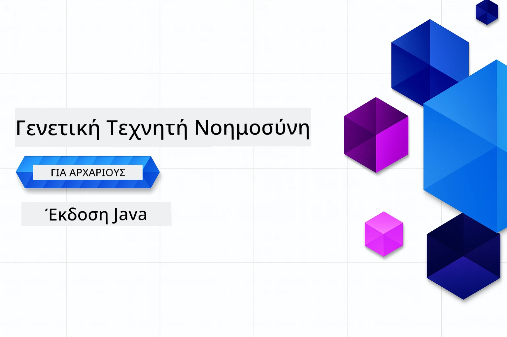

# Γενετική Τεχνητή Νοημοσύνη για Αρχάριους - Έκδοση Java
[](https://discord.gg/nTYy5BXMWG)



**Διάρκεια**: Το σεμινάριο μπορεί να ολοκληρωθεί εξ ολοκλήρου online χωρίς τοπική εγκατάσταση. Η ρύθμιση του περιβάλλοντος διαρκεί 2 λεπτά, ενώ η εξερεύνηση των δειγμάτων απαιτεί 1-3 ώρες ανάλογα με το βάθος της εξερεύνησης.

> **Γρήγορη Έναρξη**

1. Κάντε fork αυτό το αποθετήριο στον λογαριασμό σας στο GitHub
2. Κάντε κλικ στο **Code** → καρτέλα **Codespaces** → **...** → **Νέο με επιλογές...**
3. Χρησιμοποιήστε τις προεπιλογές – αυτό θα επιλέξει το κοντέινερ Ανάπτυξης που έχει δημιουργηθεί για αυτό το μάθημα
4. Κάντε κλικ στο **Create codespace**
5. Περιμένετε ~2 λεπτά για να είναι έτοιμο το περιβάλλον
6. Μεταβείτε απευθείας στο [Κεφάλαιο 2: Παροχή Azure AI Foundry](./02-SetupDevEnvironment/README.md#step-2-provision-azure-ai-foundry)

## Υποστήριξη Πολλών Γλωσσών

### Υποστηρίζεται μέσω GitHub Action (Αυτοματοποιημένο & Πάντα Ενημερωμένο)

<!-- CO-OP TRANSLATOR LANGUAGES TABLE START -->
[Αραβικά](../ar/README.md) | [Βεγγαλικά](../bn/README.md) | [Βουλγαρικά](../bg/README.md) | [Βιρμανικά (Μυανμάρ)](../my/README.md) | [Κινέζικα (Απλοποιημένα)](../zh-CN/README.md) | [Κινέζικα (Παραδοσιακά, Χονγκ Κονγκ)](../zh-HK/README.md) | [Κινέζικα (Παραδοσιακά, Μακάο)](../zh-MO/README.md) | [Κινέζικα (Παραδοσιακά, Ταϊβάν)](../zh-TW/README.md) | [Κροατικά](../hr/README.md) | [Τσεχικά](../cs/README.md) | [Δανικά](../da/README.md) | [Ολλανδικά](../nl/README.md) | [Εσθονικά](../et/README.md) | [Φινλανδικά](../fi/README.md) | [Γαλλικά](../fr/README.md) | [Γερμανικά](../de/README.md) | [Ελληνικά](./README.md) | [Εβραϊκά](../he/README.md) | [Χίντι](../hi/README.md) | [Ουγγρικά](../hu/README.md) | [Ινδονησιακά](../id/README.md) | [Ιταλικά](../it/README.md) | [Ιαπωνικά](../ja/README.md) | [Κανάντα](../kn/README.md) | [Χμερ](../km/README.md) | [Κορεατικά](../ko/README.md) | [Λιθουανικά](../lt/README.md) | [Μαλαισιανά](../ms/README.md) | [Μαλαγιαλάμ](../ml/README.md) | [Μαράθι](../mr/README.md) | [Νεπάλι](../ne/README.md) | [Νιγηριανό Πίνγκιν](../pcm/README.md) | [Νορβηγικά](../no/README.md) | [Περσικά (Φαρσί)](../fa/README.md) | [Πολωνικά](../pl/README.md) | [Πορτογαλικά (Βραζιλία)](../pt-BR/README.md) | [Πορτογαλικά (Πορτογαλία)](../pt-PT/README.md) | [Πουντζάμπι (Γκουρμούκι)](../pa/README.md) | [Ρουμανικά](../ro/README.md) | [Ρωσικά](../ru/README.md) | [Σερβικά (Κυριλλικά)](../sr/README.md) | [Σλοβακικά](../sk/README.md) | [Σλοβενικά](../sl/README.md) | [Ισπανικά](../es/README.md) | [Σουαχίλι](../sw/README.md) | [Σουηδικά](../sv/README.md) | [Ταγκαλόγκ (Φιλιππινέζικα)](../tl/README.md) | [Ταμίλ](../ta/README.md) | [Τελούγκου](../te/README.md) | [Ταϊλανδικά](../th/README.md) | [Τουρκικά](../tr/README.md) | [Ουκρανικά](../uk/README.md) | [Ουρντού](../ur/README.md) | [Βιετναμέζικα](../vi/README.md)

> **Προτιμάτε να κάνετε κλωνοποίηση τοπικά;**
>
> Αυτό το αποθετήριο περιλαμβάνει πάνω από 50 μεταφράσεις, που αυξάνουν σημαντικά το μέγεθος λήψης. Για κλωνοποίηση χωρίς μεταφράσεις, χρησιμοποιήστε sparse checkout:
>
> **Bash / macOS / Linux:**
> ```bash
> git clone --filter=blob:none --sparse https://github.com/microsoft/Generative-AI-for-beginners-java.git
> cd Generative-AI-for-beginners-java
> git sparse-checkout set --no-cone '/*' '!translations' '!translated_images'
> ```
>
> **CMD (Windows):**
> ```cmd
> git clone --filter=blob:none --sparse https://github.com/microsoft/Generative-AI-for-beginners-java.git
> cd Generative-AI-for-beginners-java
> git sparse-checkout set --no-cone "/*" "!translations" "!translated_images"
> ```
>
> Αυτό σας δίνει όλα όσα χρειάζεστε για να ολοκληρώσετε το μάθημα με πολύ ταχύτερη λήψη.
<!-- CO-OP TRANSLATOR LANGUAGES TABLE END -->

## Δομή Μαθήματος & Μονοπάτι Μάθησης

### **Κεφάλαιο 1: Εισαγωγή στη Γενετική Τεχνητή Νοημοσύνη**
- **Βασικές Έννοιες**: Κατανόηση των Μεγάλων Γλωσσικών Μοντέλων, των tokens, embeddings, και ικανοτήτων της AI
- **Οικοσύστημα AI Java**: Επισκόπηση των SDKs Spring AI και OpenAI
- **Πρωτόκολλο Context Μοντέλου**: Εισαγωγή στο MCP και ο ρόλος του στην επικοινωνία AI agents
- **Πρακτικές Εφαρμογές**: Σενάρια πραγματικής χρήσης, συμπεριλαμβανομένων chatbots και παραγωγής περιεχομένου
- **[→ Ξεκινήστε Κεφάλαιο 1](./01-IntroToGenAI/README.md)**

### **Κεφάλαιο 2: Ρύθμιση Περιβάλλοντος Ανάπτυξης**
- **Azure AI Foundry**: Παροχή GPT-5.6 Luna chat και text-embedding-3-small embeddings με Bicep και Azure Developer CLI (azd)
- **Spring Boot 4.1.1 + Spring AI 2.0.1**: Μάθετε με `ChatClient`, υποστηριζόμενο από το επίσημο OpenAI Java SDK και Azure OpenAI v1
- **Αυθεντικοποίηση Χωρίς Κλειδιά**: Συνδεθείτε με ασφάλεια με το Microsoft Entra ID — χωρίς κλειδιά API για διαχείριση
- **Εργαλεία Ανάπτυξης**: Docker containers, VS Code, και ρύθμιση GitHub Codespaces
- **[→ Ξεκινήστε Κεφάλαιο 2](./02-SetupDevEnvironment/README.md)**

### **Κεφάλαιο 3: Βασικές Τεχνικές Γενετικής Τεχνητής Νοημοσύνης**
- **Επίσημο OpenAI Java SDK**: Κλήση του Azure OpenAI v1 απευθείας με αυθεντικοποίηση χωρίς κλειδί
- **Μηχανική Προτροπής (Prompt Engineering)**: Τεχνικές για βέλτιστες απαντήσεις μοντέλου AI
- **Embeddings & Λειτουργίες Διανυσμάτων**: Υλοποίηση σημασιολογικής αναζήτησης και αντιστοίχισης ομοιότητας
- **Retrieval-Augmented Generation (RAG)**: Συνδυάστε την AI με τις δικές σας πηγές δεδομένων
- **Κλήση Συναρτήσεων (Function Calling)**: Επεκτείνετε τις δυνατότητες AI με προσαρμοσμένα εργαλεία και plugins
- **[→ Ξεκινήστε Κεφάλαιο 3](./03-CoreGenerativeAITechniques/README.md)**

### **Κεφάλαιο 4: Πρακτικές Εφαρμογές & Έργα**
- **Γεννήτρια Ιστοριών Ζώων** (`petstory/`): Δημιουργική παραγωγή περιεχομένου με Azure AI Foundry
- **Foundry Local Demo** (`foundrylocal/`): Τοπική ενσωμάτωση μοντέλου AI με OpenAI Java SDK
- **MCP Calculator Service** (`calculator/`): Βασική υλοποίηση Πρωτοκόλλου Context Μοντέλου με Spring AI
- **[→ Ξεκινήστε Κεφάλαιο 4](./04-PracticalSamples/README.md)**

### **Κεφάλαιο 5: Υπεύθυνη Ανάπτυξη Τεχνητής Νοημοσύνης**
- **Azure AI Foundry Ασφάλεια Περιεχομένου**: Δοκιμάστε ενσωματωμένη φιλτράρισμα περιεχομένου και μηχανισμούς ασφάλειας (αυστηρούς αποκλεισμούς και μαλακές απορρίψεις)
- **Επίδειξη Υπεύθυνης AI**: Παραδειγματική επίδειξη λειτουργίας σύγχρονων συστημάτων ασφαλείας AI
- **Βέλτιστες Πρακτικές**: Οδηγίες για ηθική ανάπτυξη και υλοποίηση AI
- **[→ Ξεκινήστε Κεφάλαιο 5](./05-ResponsibleGenAI/README.md)**

## Πρόσθετοι Πόροι

<!-- CO-OP TRANSLATOR OTHER COURSES START -->
### LangChain
[](https://aka.ms/langchain4j-for-beginners)
[](https://aka.ms/langchainjs-for-beginners?WT.mc_id=m365-94501-dwahlin)
[](https://github.com/microsoft/langchain-for-beginners?WT.mc_id=m365-94501-dwahlin)
---

### Azure / Edge / MCP / Agents
[](https://github.com/microsoft/AZD-for-beginners?WT.mc_id=academic-105485-koreyst)
[](https://github.com/microsoft/edgeai-for-beginners?WT.mc_id=academic-105485-koreyst)
[](https://github.com/microsoft/mcp-for-beginners?WT.mc_id=academic-105485-koreyst)
[](https://github.com/microsoft/ai-agents-for-beginners?WT.mc_id=academic-105485-koreyst)

---
 
### Σειρά γενετικής AI
[](https://github.com/microsoft/generative-ai-for-beginners?WT.mc_id=academic-105485-koreyst)
[-9333EA?style=for-the-badge&labelColor=E5E7EB&color=9333EA)](https://github.com/microsoft/Generative-AI-for-beginners-dotnet?WT.mc_id=academic-105485-koreyst)
[-C084FC?style=for-the-badge&labelColor=E5E7EB&color=C084FC)](https://github.com/microsoft/generative-ai-for-beginners-java?WT.mc_id=academic-105485-koreyst)
[-E879F9?style=for-the-badge&labelColor=E5E7EB&color=E879F9)](https://github.com/microsoft/generative-ai-with-javascript?WT.mc_id=academic-105485-koreyst)

---
 
### Βασική Μάθηση
[](https://aka.ms/ml-beginners?WT.mc_id=academic-105485-koreyst)
[](https://aka.ms/datascience-beginners?WT.mc_id=academic-105485-koreyst)
[](https://aka.ms/ai-beginners?WT.mc_id=academic-105485-koreyst)
[](https://github.com/microsoft/Security-101?WT.mc_id=academic-96948-sayoung)
[](https://aka.ms/webdev-beginners?WT.mc_id=academic-105485-koreyst)
[](https://aka.ms/iot-beginners?WT.mc_id=academic-105485-koreyst)
[](https://github.com/microsoft/xr-development-for-beginners?WT.mc_id=academic-105485-koreyst)

---
 
### Σειρά Copilot
[](https://aka.ms/GitHubCopilotAI?WT.mc_id=academic-105485-koreyst)
[](https://github.com/microsoft/mastering-github-copilot-for-dotnet-csharp-developers?WT.mc_id=academic-105485-koreyst)
[](https://github.com/microsoft/CopilotAdventures?WT.mc_id=academic-105485-koreyst)
<!-- CO-OP TRANSLATOR OTHER COURSES END -->

## Λήψη Βοήθειας

Εάν κολλήσετε ή έχετε οποιεσδήποτε ερωτήσεις σχετικά με την ανάπτυξη εφαρμογών AI. Ενώστε τους συναδέλφους μαθητές και έμπειρους προγραμματιστές σε συζητήσεις σχετικά με το MCP. Είναι μια υποστηρικτική κοινότητα όπου οι ερωτήσεις είναι ευπρόσδεκτες και η γνώση μοιράζεται ελεύθερα.

[](https://discord.gg/nTYy5BXMWG)

Εάν έχετε σχόλια για το προϊόν ή σφάλματα κατά την ανάπτυξη, επισκεφθείτε:

[](https://aka.ms/foundry/forum)

---

<!-- CO-OP TRANSLATOR DISCLAIMER START -->
**Αποποίηση ευθυνών**:
Αυτό το έγγραφο έχει μεταφραστεί χρησιμοποιώντας την υπηρεσία μετάφρασης με τεχνητή νοημοσύνη [Co-op Translator](https://github.com/Azure/co-op-translator). Ενώ επιδιώκουμε την ακρίβεια, παρακαλούμε να έχετε υπόψη ότι οι αυτοματοποιημένες μεταφράσεις ενδέχεται να περιέχουν λάθη ή ανακρίβειες. Το πρωτότυπο έγγραφο στη μητρική του γλώσσα πρέπει να θεωρείται η αυθεντική πηγή. Για κρίσιμες πληροφορίες, συνιστάται επαγγελματική ανθρώπινη μετάφραση. Δεν φέρουμε ευθύνη για τυχόν παρεξηγήσεις ή λανθασμένες ερμηνείες που προκύπτουν από τη χρήση αυτής της μετάφρασης.
<!-- CO-OP TRANSLATOR DISCLAIMER END -->