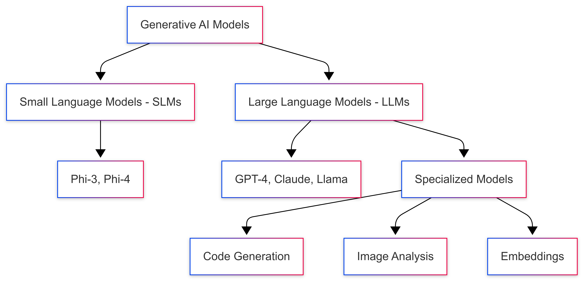

<!--
CO_OP_TRANSLATOR_METADATA:
{
  "original_hash": "75bfb080ca725e8a9aa9c80cae25fba1",
  "translation_date": "2025-07-29T14:11:07+00:00",
  "source_file": "01-IntroToGenAI/README.md",
  "language_code": "en"
}
-->
# Introduction to Generative AI - Java Edition

## What You'll Learn

- **Fundamentals of Generative AI**, including LLMs, prompt engineering, tokens, embeddings, and vector databases
- **Comparison of Java AI development tools**, such as Azure OpenAI SDK, Spring AI, and OpenAI Java SDK
- **Understanding the Model Context Protocol** and its importance in AI agent communication

## Table of Contents

- [Introduction](../../../01-IntroToGenAI)
- [A quick refresh on Generative AI concepts](../../../01-IntroToGenAI)
- [Prompt engineering review](../../../01-IntroToGenAI)
- [Tokens, embeddings, and agents](../../../01-IntroToGenAI)
- [AI Development Tools and Libraries for Java](../../../01-IntroToGenAI)
  - [OpenAI Java SDK](../../../01-IntroToGenAI)
  - [Spring AI](../../../01-IntroToGenAI)
  - [Azure OpenAI Java SDK](../../../01-IntroToGenAI)
- [Summary](../../../01-IntroToGenAI)
- [Next Steps](../../../01-IntroToGenAI)

## Introduction

Welcome to the first chapter of Generative AI for Beginners - Java Edition! This introductory lesson will familiarize you with the key concepts of generative AI and how to apply them using Java. You'll explore the essential components of AI applications, such as Large Language Models (LLMs), tokens, embeddings, and AI agents. Additionally, we'll introduce the primary Java tools you'll use throughout this course.

### A quick refresh on Generative AI concepts

Generative AI refers to artificial intelligence that creates new content, such as text, images, or code, by learning patterns and relationships from data. These models can produce human-like responses, understand context, and even generate content that mimics human creativity.

When building Java AI applications, you'll work with **generative AI models** to create content. Some of their capabilities include:

- **Text Generation**: Producing human-like text for chatbots, content creation, and text completion.
- **Image Generation and Analysis**: Creating realistic images, enhancing visuals, and identifying objects.
- **Code Generation**: Writing code snippets or scripts.

Different models are optimized for specific tasks. For instance, **Small Language Models (SLMs)** and **Large Language Models (LLMs)** are suited for text generation, with LLMs generally excelling at complex tasks. For image-related tasks, specialized vision models or multi-modal models are used.

It's important to note that these models aren't always perfect. You may have heard of instances where models "hallucinate" or confidently produce incorrect information. However, you can improve their responses by providing clear instructions and context, which is where **prompt engineering** comes into play.

#### Prompt engineering review

Prompt engineering involves crafting effective inputs to guide AI models toward desired outputs. It focuses on:

- **Clarity**: Ensuring instructions are straightforward and unambiguous.
- **Context**: Providing relevant background information.
- **Constraints**: Defining any limitations or formats.

Best practices for prompt engineering include designing prompts, giving clear instructions, breaking tasks into smaller steps, using one-shot and few-shot learning, and tuning prompts. Testing various prompts is crucial to identify the most effective approach for your specific use case.

When developing applications, you'll encounter different types of prompts:
- **System prompts**: Establish the foundational rules and context for the model's behavior.
- **User prompts**: Input data provided by application users.
- **Assistant prompts**: Responses generated by the model based on system and user prompts.

> **Learn more**: Explore prompt engineering further in [Prompt Engineering chapter of GenAI for Beginners course](https://github.com/microsoft/generative-ai-for-beginners/tree/main/04-prompt-engineering-fundamentals)

#### Tokens, embeddings, and agents

As you work with generative AI models, you'll come across terms like **tokens**, **embeddings**, **agents**, and **Model Context Protocol (MCP)**. Here's a closer look at these concepts:

- **Tokens**: Tokens are the smallest units of text processed by a model, such as words, characters, or subwords. They represent text data in a format the model can understand. For example, the sentence "The quick brown fox jumped over the lazy dog" might be tokenized as ["The", " quick", " brown", " fox", " jumped", " over", " the", " lazy", " dog"] or ["The", " qu", "ick", " br", "own", " fox", " jump", "ed", " over", " the", " la", "zy", " dog"], depending on the tokenization method.

Tokenization breaks text into these smaller units, which is essential because models operate on tokens rather than raw text. The number of tokens in a prompt impacts the model's response length and quality, as models have token limits for their context window (e.g., 128K tokens for GPT-4o's total context, including input and output).

  In Java, libraries like the OpenAI SDK can handle tokenization automatically when sending requests to AI models.

- **Embeddings**: Embeddings are vector representations of tokens that capture semantic meaning. These numerical representations (typically arrays of floating-point numbers) help models understand relationships between words and generate contextually relevant responses. Words with similar meanings have similar embeddings, enabling the model to grasp concepts like synonyms and semantic relationships.

  In Java, embeddings can be generated using the OpenAI SDK or other libraries that support embedding creation. They are crucial for tasks like semantic search, where you aim to find similar content based on meaning rather than exact text matches.

- **Vector databases**: Vector databases are specialized storage systems optimized for embeddings. They enable efficient similarity searches and are essential for Retrieval-Augmented Generation (RAG) patterns, where relevant information is retrieved from large datasets based on semantic similarity rather than exact matches.

> **Note**: While this course doesn't cover vector databases in detail, they are worth mentioning as they are commonly used in real-world applications.

- **Agents & MCP**: Agents are AI components that autonomously interact with models, tools, and external systems. The Model Context Protocol (MCP) provides a standardized way for agents to securely access external data sources and tools. Learn more in our [MCP for Beginners](https://github.com/microsoft/mcp-for-beginners) course.

In Java AI applications, you'll use tokens for text processing, embeddings for semantic search and RAG, vector databases for data retrieval, and agents with MCP to build intelligent systems that utilize external tools.

### AI Development Tools and Libraries for Java

Java provides excellent tools for AI development. This course will focus on three main libraries: OpenAI Java SDK, Azure OpenAI SDK, and Spring AI.

Here's a reference table showing which SDK is used in each chapter's examples:

| Chapter | Sample | SDK |
|---------|--------|-----|
| 02-SetupDevEnvironment | github-models | OpenAI Java SDK |
| 02-SetupDevEnvironment | basic-chat-azure | Spring AI Azure OpenAI |
| 03-CoreGenerativeAITechniques | examples | Azure OpenAI SDK |
| 04-PracticalSamples | petstory | OpenAI Java SDK |
| 04-PracticalSamples | foundrylocal | OpenAI Java SDK |
| 04-PracticalSamples | calculator | Spring AI MCP SDK + LangChain4j |

**SDK Documentation Links:**
- [Azure OpenAI Java SDK](https://github.com/Azure/azure-sdk-for-java/tree/azure-ai-openai_1.0.0-beta.16/sdk/openai/azure-ai-openai)
- [Spring AI](https://docs.spring.io/spring-ai/reference/)
- [OpenAI Java SDK](https://github.com/openai/openai-java)
- [LangChain4j](https://docs.langchain4j.dev/)

#### OpenAI Java SDK

The OpenAI SDK is the official Java library for the OpenAI API. It offers a straightforward and consistent interface for interacting with OpenAI's models, making it easy to integrate AI capabilities into Java applications. Examples in Chapter 2 (GitHub Models) and Chapter 4 (Pet Story and Foundry Local applications) demonstrate the use of the OpenAI SDK.

#### Spring AI

Spring AI is a comprehensive framework that integrates AI capabilities into Spring applications, providing a consistent abstraction layer across various AI providers. It works seamlessly with the Spring ecosystem, making it ideal for enterprise Java applications requiring AI functionality.

Spring AI excels in its integration with Spring patterns like dependency injection, configuration management, and testing frameworks. You'll use Spring AI in Chapters 2 and 4 to build applications leveraging OpenAI and the Model Context Protocol (MCP) Spring AI libraries.

##### Model Context Protocol (MCP)

The [Model Context Protocol (MCP)](https://modelcontextprotocol.io/) is a new standard that allows AI applications to securely interact with external data sources and tools. MCP provides a standardized way for AI models to access contextual information and perform actions within your applications.

In Chapter 4, you'll create a simple MCP calculator service to demonstrate the basics of Model Context Protocol with Spring AI, showcasing how to build tool integrations and service architectures.

#### Azure OpenAI Java SDK

The Azure OpenAI client library for Java adapts OpenAI's REST APIs, offering an idiomatic interface and integration with the Azure SDK ecosystem. In Chapter 3, you'll use the Azure OpenAI SDK to build applications like chat systems, function calling, and RAG (Retrieval-Augmented Generation) patterns.

> Note: The Azure OpenAI SDK currently has fewer features compared to the OpenAI Java SDK, so for future projects, consider using the OpenAI Java SDK.

## Summary

To summarize, you've learned:

- The foundational concepts of generative AI, including LLMs, prompt engineering, tokens, embeddings, and vector databases
- The available Java AI development tools: Azure OpenAI SDK, Spring AI, and OpenAI Java SDK
- The role of the Model Context Protocol in enabling AI agents to interact with external tools

## Next Steps

[Chapter 2: Setting Up the Development Environment](../02-SetupDevEnvironment/README.md)

**Disclaimer**:  
This document has been translated using the AI translation service [Co-op Translator](https://github.com/Azure/co-op-translator). While we aim for accuracy, please note that automated translations may include errors or inaccuracies. The original document in its native language should be regarded as the authoritative source. For critical information, professional human translation is advised. We are not responsible for any misunderstandings or misinterpretations resulting from the use of this translation.