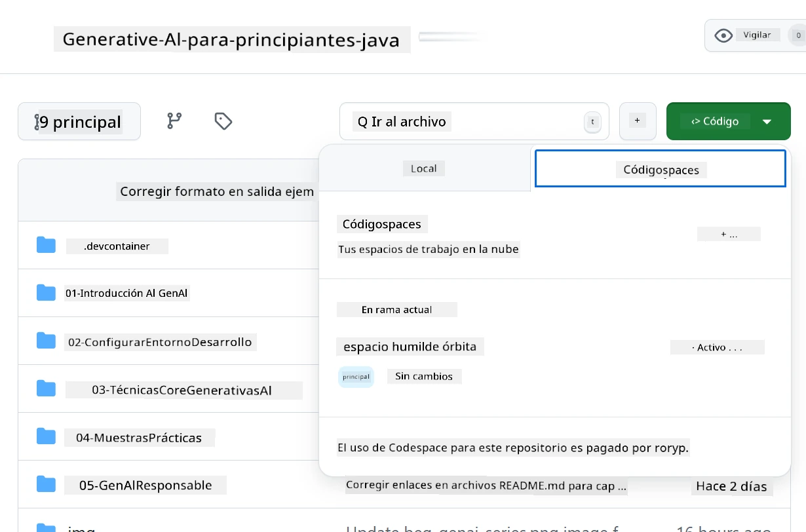
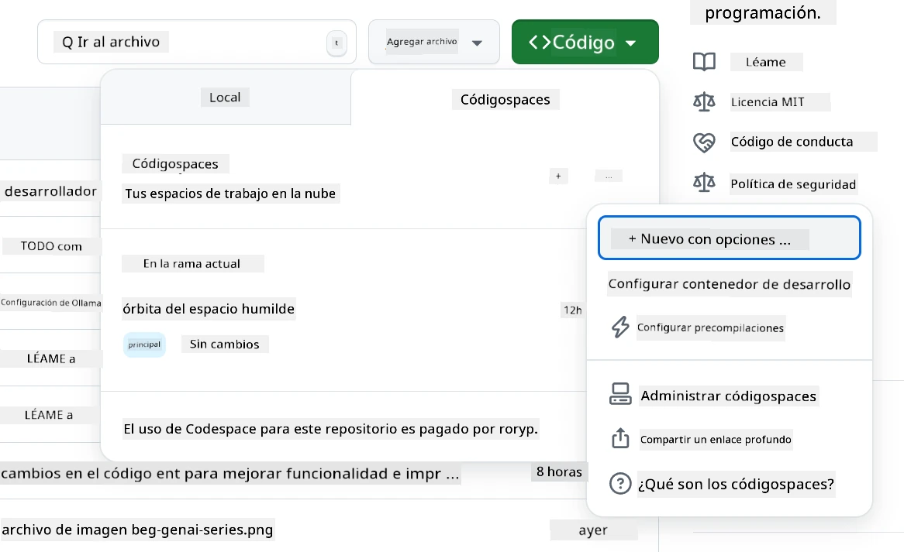
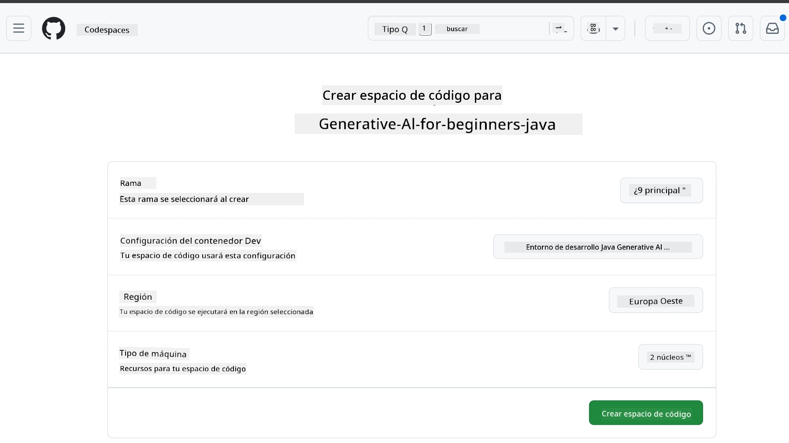
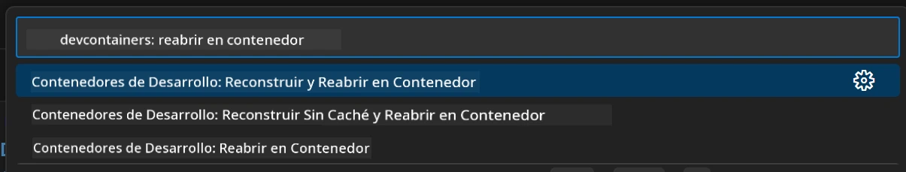
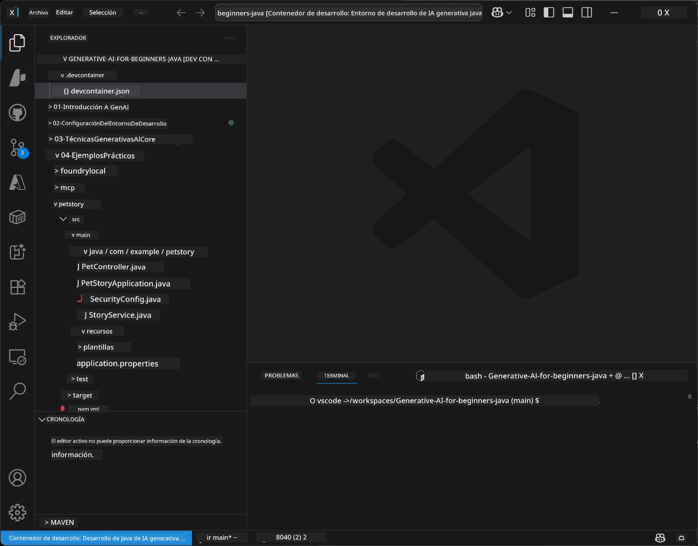
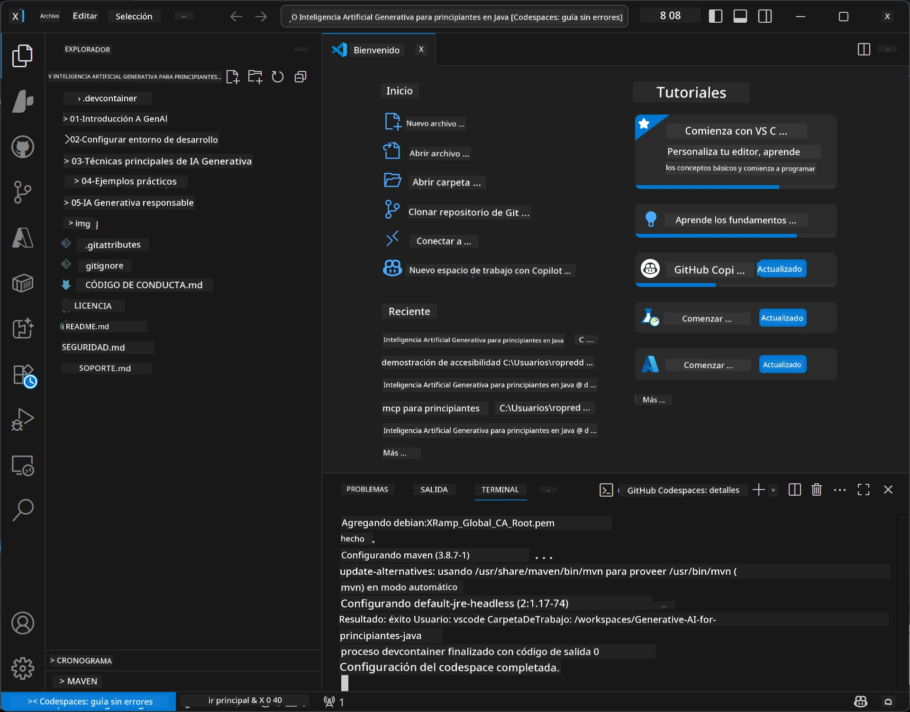

# Configuración del Entorno de Desarrollo para IA Generativa para Java

> **Inicio rápido:** Provisione sus modelos de IA en **Azure AI Foundry** como código con Bicep + `azd` en pocos minutos — consulte la [Guía de Configuración de Azure AI Foundry](getting-started-azure-openai.md). La autenticación es **sin claves** (Microsoft Entra ID), por lo que no hay claves API que gestionar.

## Lo Que Aprenderás

- Configurar un entorno de desarrollo Java para aplicaciones de IA
- Elegir y configurar su entorno de desarrollo preferido (cloud-first con Codespaces, contenedor de desarrollo local o configuración local completa)
- Probar su configuración conectándose a un modelo de Azure AI Foundry

## Tabla de Contenidos

- [Lo Que Aprenderás](#lo-que-aprenderás)
- [Introducción](#introducción)
- [Paso 1: Configura Tu Entorno de Desarrollo](#paso-1-configura-tu-entorno-de-desarrollo)
  - [Opción A: GitHub Codespaces (Recomendado)](#opción-a-github-codespaces-recomendado)
  - [Opción B: Contenedor de Desarrollo Local](#opción-b-contenedor-de-desarrollo-local)
  - [Opción C: Usa Tu Instalación Local Existente](#opción-c-usa-tu-instalación-local-existente)
- [Paso 2: Provisiona Azure AI Foundry](#paso-2-provisiona-azure-ai-foundry)
- [Paso 3: Prueba Tu Configuración](#paso-3-prueba-tu-configuración)
- [Solución de Problemas](#solución-de-problemas)
- [Resumen](#resumen)
- [Próximos Pasos](#próximos-pasos)

## Introducción

Este capítulo te guiará para configurar un entorno de desarrollo. Usaremos **Azure AI Foundry** para los modelos a lo largo de este curso. Provisonas los modelos como código con Bicep y la CLI de Desarrolladores de Azure (`azd`), luego te conectas con **autenticación sin claves** (Microsoft Entra ID) — sin claves API que copiar o filtrar.

**¡No se requiere configuración local!** Puedes usar GitHub Codespaces, que provee un entorno de desarrollo completo en tu navegador, y provisionar Foundry desde allí.

Usamos **Azure AI Foundry** para este curso porque es:
- **Provisionado como código** — un solo `azd up` despliega la cuenta y los despliegues de modelo
- **Sin claves** — autentícate con tu inicio de sesión de Azure o una identidad administrada
- **Listo para producción** — el mismo código funciona localmente y en Azure
- **Flexible** — cambia modelos modificando un nombre de despliegue, no tu código

> **Nota**: Los despliegues de Azure AI Foundry se facturan por token (pago por uso). Consulta la [guía de configuración de Azure AI Foundry](getting-started-azure-openai.md) para detalles sobre provisión, región y costos.


## Paso 1: Configura Tu Entorno de Desarrollo

<a name="quick-start-cloud"></a>

Hemos creado un contenedor de desarrollo preconfigurado para minimizar el tiempo de configuración y asegurar que tengas todas las herramientas necesarias para este curso de IA Generativa para Java. Elige tu enfoque de desarrollo preferido:

### Opciones para Configurar el Entorno:

#### Opción A: GitHub Codespaces (Recomendado)

**Comienza a programar en 2 minutos - ¡sin necesidad de configuración local!**

1. Haz fork de este repositorio a tu cuenta GitHub
   > **Nota**: Si quieres editar la configuración básica, echa un vistazo a la [Configuración del Contenedor de Desarrollo](../../../.devcontainer/devcontainer.json)
2. Haz clic en **Code** → pestaña **Codespaces** → **...** → **New with options...**
3. Usa los valores predeterminados – esto seleccionará la **Configuración del contenedor de desarrollo**: contenedor dev personalizado **Entorno de Desarrollo IA Generativa Java** creado para este curso
4. Haz clic en **Create codespace**
5. Espera ~2 minutos para que el entorno esté listo
6. Continúa a [Paso 2: Provisiona Azure AI Foundry](#paso-2-provisiona-azure-ai-foundry)








> **Beneficios de Codespaces**:
> - No requiere instalación local
> - Funciona en cualquier dispositivo con un navegador
> - Preconfigurado con todas las herramientas y dependencias
> - 60 horas gratuitas al mes para cuentas personales
> - Entorno consistente para todos los estudiantes

#### Opción B: Contenedor de Desarrollo Local

**Para desarrolladores que prefieren desarrollo local con Docker**

1. Haz fork y clona este repositorio en tu máquina local
   > **Nota**: Si quieres editar la configuración básica, echa un vistazo a la [Configuración del Contenedor de Desarrollo](../../../.devcontainer/devcontainer.json)
2. Instala [Docker Desktop](https://www.docker.com/products/docker-desktop/) y [VS Code](https://code.visualstudio.com/)
3. Instala la [extensión Dev Containers](https://marketplace.visualstudio.com/items?itemName=ms-vscode-remote.remote-containers) en VS Code
4. Abre la carpeta del repositorio en VS Code
5. Cuando se te solicite, haz clic en **Reopen in Container** (o usa `Ctrl+Shift+P` → "Dev Containers: Reopen in Container")
6. Espera a que el contenedor se construya e inicie
7. Continúa a [Paso 2: Provisiona Azure AI Foundry](#paso-2-provisiona-azure-ai-foundry)





#### Opción C: Usa Tu Instalación Local Existente

**Para desarrolladores con entornos Java existentes**

Requisitos previos:
- [Java 21+](https://www.oracle.com/java/technologies/javase/jdk21-archive-downloads.html) 
- [Maven 3.9+](https://maven.apache.org/download.cgi)
- [VS Code](https://code.visualstudio.com) o tu IDE preferido

Pasos:
1. Clona este repositorio en tu máquina local
2. Abre el proyecto en tu IDE
3. Continúa a [Paso 2: Provisiona Azure AI Foundry](#paso-2-provisiona-azure-ai-foundry)

> **Consejo profesional**: Si tienes una máquina con poca potencia, pero quieres VS Code localmente, ¡usa GitHub Codespaces! Puedes conectar tu VS Code local a un Codespace alojado en la nube para lo mejor de ambos mundos.




## Paso 2: Provisiona Azure AI Foundry

Despliega los modelos de IA del curso en Azure AI Foundry como código. Desde la raíz del repositorio:

```bash
cd 02-SetupDevEnvironment
azd auth login
az login
azd up
```

`azd` solicita un nombre de entorno, suscripción y región, provisiona una cuenta Azure AI Foundry con despliegues de `gpt-5.6-luna` y `text-embedding-3-small`, y escribe el punto de conexión en el `.env` del ejemplo - todo con autenticación **sin claves** (sin claves API).

> **Guía completa:** Consulta la [Guía de Configuración de Azure AI Foundry](getting-started-azure-openai.md) para prerequisitos, alternativas manuales (portal), guía de regiones y notas de costos/limpieza.

## Paso 3: Prueba Tu Configuración

Una vez que tus modelos Foundry estén provisionados, prueba la conexión con la aplicación de ejemplo en [`02-SetupDevEnvironment/examples/basic-chat-azure`](../../../02-SetupDevEnvironment/examples/basic-chat-azure).

1. Abre la terminal en tu entorno de desarrollo.
2. Navega al ejemplo:
   ```bash
   cd 02-SetupDevEnvironment/examples/basic-chat-azure
   ```
3. Asegúrate de estar autenticado (la autenticación sin claves necesita un token):
   ```bash
   az login
   ```
   > Si ejecutaste `azd up`, el archivo `.env` con tu punto de conexión ya fue creado para ti.
4. Ejecuta la aplicación:
   ```bash
   mvn clean spring-boot:run
   ```

Deberías ver una respuesta del modelo `gpt-5.6-luna`.

### Entendiendo el Código de Ejemplo

El [ejemplo basic-chat](./examples/basic-chat-azure/README.md) utiliza **Spring Boot 4.1.1** y **Spring AI 2.0.1**. El `ChatClient` de Spring AI está respaldado por el SDK oficial OpenAI Java, conectado al endpoint Azure OpenAI **v1** con autenticación sin claves.

**Qué hace este código:**
- **Se conecta** a Azure AI Foundry usando tu inicio de sesión Azure (Microsoft Entra ID) — sin clave API
- **Envía** un prompt al modelo `gpt-5.6-luna`
- **Recibe** y muestra la respuesta de la IA
- **Valida** que tu configuración funciona correctamente

**Dependencias clave** (extracto de [pom.xml](../../../02-SetupDevEnvironment/examples/basic-chat-azure/pom.xml)):
```xml
<dependency>
    <groupId>org.springframework.ai</groupId>
    <artifactId>spring-ai-starter-model-openai</artifactId>
</dependency>
<dependency>
    <groupId>com.openai</groupId>
    <artifactId>openai-java</artifactId>
</dependency>
<dependency>
    <groupId>com.azure</groupId>
    <artifactId>azure-identity</artifactId>
    <version>${azure-identity.version}</version>
</dependency>
```

El POM gestiona OpenAI Java **4.63.1** y establece Azure Identity **1.18.6** explícitamente. Spring AI 2 eliminó el starter específico de Azure; Azure Identity sigue siendo necesario para el bean de credenciales.

**Configuración** ([application.yml](../../../02-SetupDevEnvironment/examples/basic-chat-azure/src/main/resources/application.yml)):
```yaml
spring:
  ai:
    openai:
      base-url: ${AZURE_OPENAI_ENDPOINT}
      microsoft-foundry: true
      chat:
        model: ${AZURE_OPENAI_DEPLOYMENT:gpt-5.6-luna}
        reasoning-effort: none
        max-completion-tokens: 500
```

La autenticación sin claves está configurada explícitamente en [BasicChatApplication.java](../../../02-SetupDevEnvironment/examples/basic-chat-azure/src/main/java/com/example/BasicChatApplication.java), no se infiere de la ausencia de una clave API. Su credencial bearer usa `DefaultAzureCredential` con el ámbito `https://ai.azure.com/.default`, y su `OpenAIClient` apunta a `/openai/v1`. La aplicación provee ese cliente al modelo chat de Spring AI, por lo que una variable global `OPENAI_API_KEY` no puede sobreescribir la autenticación Azure.

La configuración de chat está directamente bajo `spring.ai.openai.chat`, sin un bloque `options`. La lección conserva Chat Completions con `reasoning-effort: none` y un límite de 500 tokens; no establece `temperature` ni `max-tokens`. Consulta la [referencia de configuración del ejemplo](./examples/basic-chat-azure/README.md#spring-configuration) para la elección de API y guía para llamadas a herramientas.

## Resumen

Después de completar los pasos anteriores, tendrás:

- Modelos de Azure AI Foundry provisionados como código con Bicep + `azd`
- Tu entorno de desarrollo Java funcionando (ya sea Codespaces, contenedores dev o local)
- Conexión a Azure AI Foundry con autenticación sin claves (Microsoft Entra ID) — sin claves API
- Probado que todo funciona con un ejemplo simple que se comunica con tu modelo

## Próximos Pasos

[Capítulo 3: Técnicas centrales de IA generativa](../03-CoreGenerativeAITechniques/README.md)

## Solución de Problemas

¿Tienes problemas? Aquí algunos problemas comunes y soluciones:

- **¿Falla la autenticación (401/403)?** 
  - Ejecuta `az login` — la autenticación es sin claves, debes estar logueado
  - Verifica que tu cuenta tenga el rol **Usuario de Cognitive Services OpenAI** en el recurso
  - Si acabas de provisionar, espera un minuto para que la asignación del rol se propague

- **¿No se encuentra Maven?** 
  - Si usas contenedores dev/Codespaces, Maven debería venir preinstalado
  - Para configuración local, asegúrate de tener Java 21+ y Maven 3.9+ instalados
  - Prueba `mvn --version` para verificar instalación

- **¿No se encuentra `azd` o falla la provisión?** 
  - Instala la [Azure Developer CLI](https://aka.ms/azure-dev/install) y ejecuta `azd auth login`
  - Elige una región donde `gpt-5.6-luna` y `text-embedding-3-small` estén disponibles (ej. `eastus2`), con cuota suficiente en la suscripción seleccionada
  - Consulta la [guía de configuración de Azure AI Foundry](getting-started-azure-openai.md) para más detalles

- **¿No inicia el contenedor dev?** 
  - Asegúrate de que Docker Desktop esté corriendo (para desarrollo local)
  - Prueba reconstruir el contenedor: `Ctrl+Shift+P` → "Dev Containers: Rebuild Container"

- **¿Errores de compilación en la aplicación?**
  - Asegúrate de estar en el directorio correcto: `02-SetupDevEnvironment/examples/basic-chat-azure`
  - Prueba limpiar y recompilar: `mvn clean compile`

> **¿Necesitas ayuda?**: ¿Sigues con problemas? Abre un issue en el repositorio y te ayudaremos.

---

<!-- CO-OP TRANSLATOR DISCLAIMER START -->
**Descargo de responsabilidad**:
Este documento ha sido traducido utilizando el servicio de traducción automática [Co-op Translator](https://github.com/Azure/co-op-translator). Aunque nos esforzamos por la precisión, tenga en cuenta que las traducciones automatizadas pueden contener errores o inexactitudes. El documento original en su idioma nativo debe considerarse la fuente autorizada. Para información crítica, se recomienda una traducción profesional humana. No somos responsables de cualquier malentendido o interpretación errónea que surja del uso de esta traducción.
<!-- CO-OP TRANSLATOR DISCLAIMER END -->