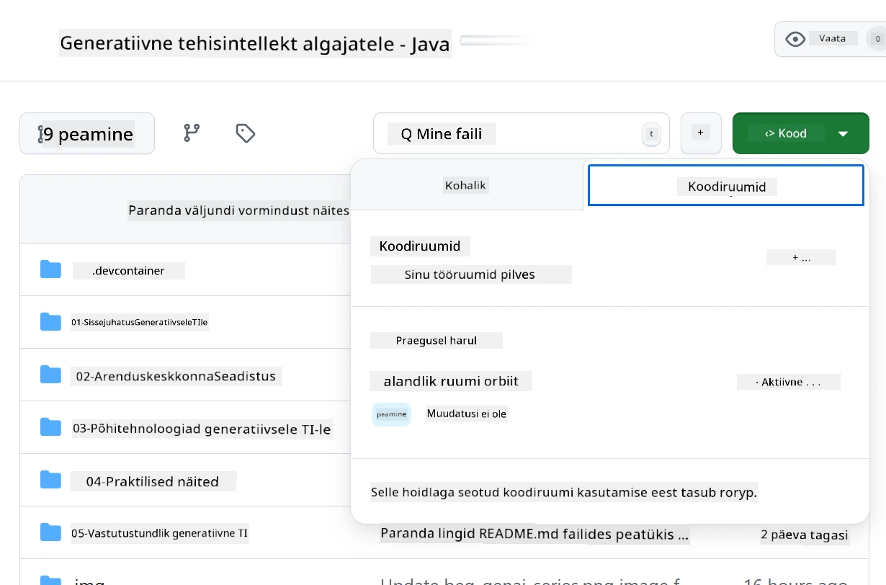
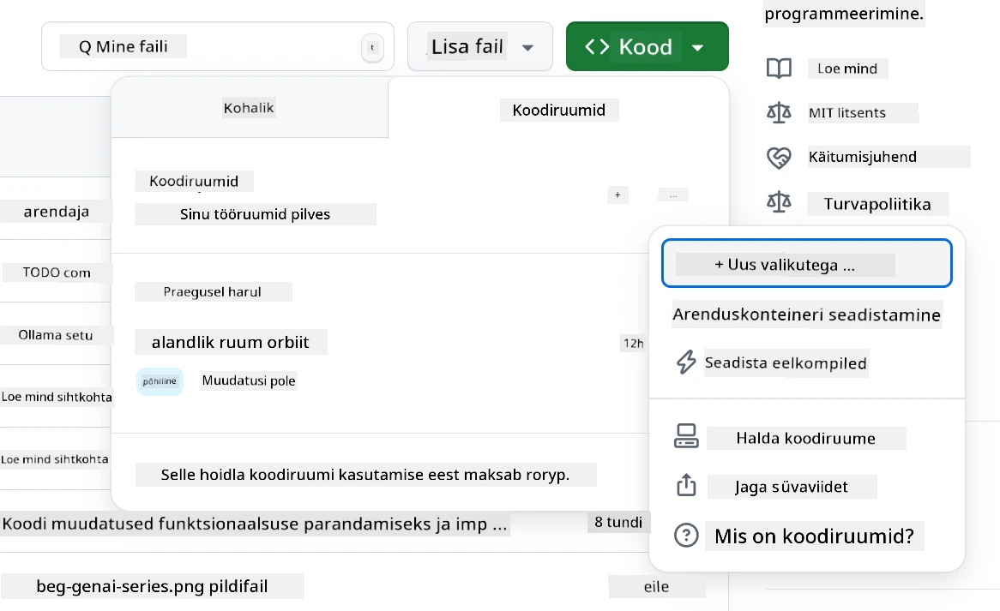
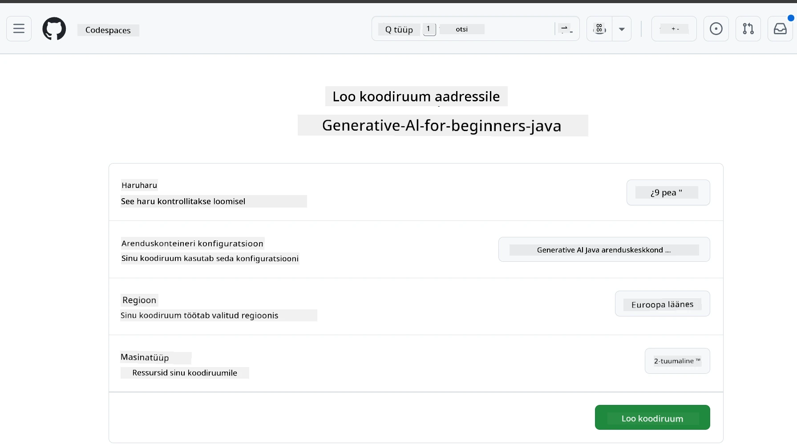
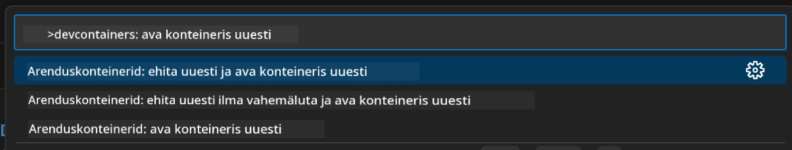
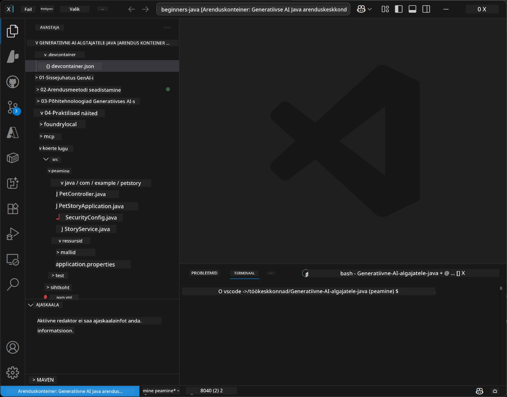
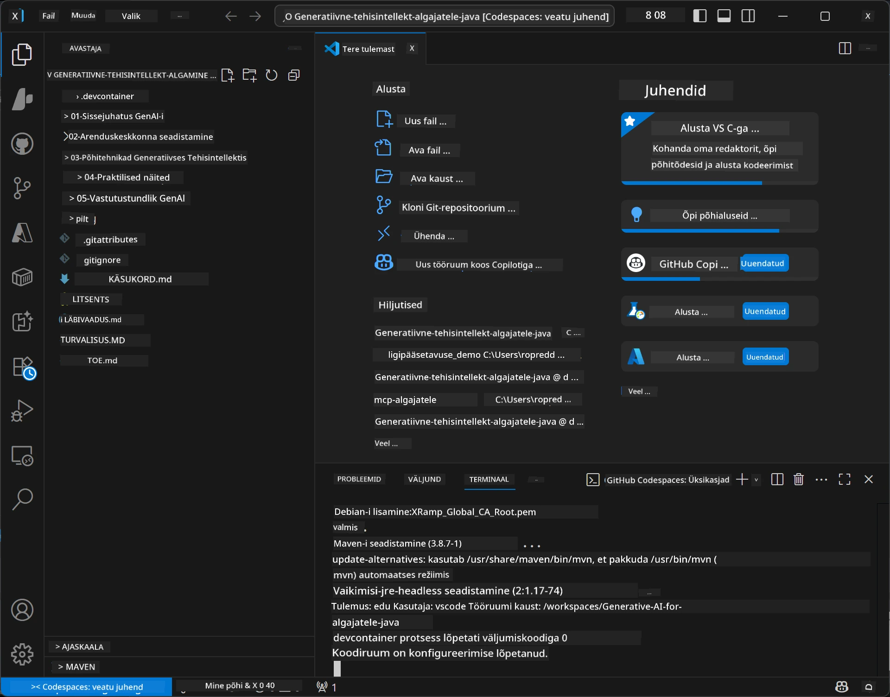

# Arenduskeskkonna seadistamine Generative AI jaoks Java-s

> **Kiire algus:** Paiguta oma AI mudelid **Azure AI Foundry** peale koodina Bicepi + `azd` abil mõne minutiga – vaata [Azure AI Foundry häälestusjuhendit](getting-started-azure-openai.md). Autentimine on **võtmevaba** (Microsoft Entra ID), seega pole vaja hallata API võtmeid.

## Mida Sa Õpid

- Seadistama Java arenduskeskkonna AI rakenduste jaoks
- Valima ja konfigureerima eelistatud arenduskeskkonna (pilve-eelistusega Codespaces, kohalik arenduskonteiner või täismahus kohalik seadistus)
- Testima oma seadistust, ühendudes Azure AI Foundry mudeliga

## Sisukord

- [Mida Sa Õpid](#mida-sa-õpid)
- [Sissejuhatus](#sissejuhatus)
- [1. samm: Seadista oma arenduskeskkond](#1-samm-seadista-oma-arenduskeskkond)
  - [Valik A: GitHub Codespaces (Soovitatav)](#valik-a-github-codespaces-soovitatav)
  - [Valik B: Kohalik arenduskonteiner](#valik-b-kohalik-arenduskonteiner)
  - [Valik C: Kasuta oma olemasolevat kohalikku paigaldust](#valik-c-kasuta-oma-olemasolevat-kohalikku-paigaldust)
- [2. samm: Paiguta Azure AI Foundry](#2-samm-paiguta-azure-ai-foundry)
- [3. samm: Testi oma seadistust](#3-samm-testi-oma-seadistust)
- [Veaotsing](#veaotsing)
- [Kokkuvõte](#kokkuvõte)
- [Järgmised sammud](#järgmised-sammud)

## Sissejuhatus

See peatükk juhendab sind arenduskeskkonna seadistamisel. Selles kursuses kasutame kogu aeg **Azure AI Foundry** mudeleid. Sa paigutad mudelid koodina Bicepi ja Azure Developer CLI (`azd`) abil ning seejärel ühendud **võtmevaba autentimisega** (Microsoft Entra ID) — ei mingit API võtmete kopeerimist ega lekkimist.

**Kohalikku seadistust pole vaja!** Võid kasutada GitHub Codespaces’i, mis pakub täielikku arenduskeskkonda sinu brauseris, ja paiguta Foundry sealt.

Me kasutame selle kursuse jaoks **Azure AI Foundry** sest see on:
- **Paigutatud koodina** — üks `azd up` käsk paigaldab konto ja mudeli paigutused
- **Võtmevaba** — autentimine toimub sinu Azure sisselogimise või haldatud identiteedi kaudu
- **Tootmiskõlbulik** — sama kood töötab nii kohalikult kui Azure’is
- **Paindlik** — mudelite vahetamiseks muuda lihtsalt paigutuse nime, mitte oma koodi

> **Märkus:** Azure AI Foundry paigutused arveldatakse märgipõhiselt (tasud vastavalt kasutusele). Vaata [Azure AI Foundry häälestusjuhendit](getting-started-azure-openai.md) paigutamise, regiooni ja kulude kohta.


## 1. samm: Seadista oma arenduskeskkond

<a name="quick-start-cloud"></a>

Oleme loonud eelkonfigureeritud arenduskonteineri, et vähendada seadistusaega ja tagada, et sul on olemas kõik vajalikud tööriistad selle Generative AI Java kursuse jaoks. Vali oma eelistatud arendusiivne:

### Keskkonna seadistamise valikud:

#### Valik A: GitHub Codespaces (Soovitatav)

**Alusta kodeerimist 2 minutiga – kohalikku seadistust pole vaja!**

1. Tee selle repositooriumi fork oma GitHub kontole
   > **Märkus:** Kui soovid muuta baaskonfiguratsiooni, vaata palun [Dev Container Configuration](../../../.devcontainer/devcontainer.json)
2. Klõpsa **Code** → **Codespaces** vaheleht → **...** → **New with options...**
3. Kasuta vaikeväärtusi – see valib **Dev container configuration**: selle kursuse jaoks loodud kohandatud arenduskonteineri “Generative AI Java Development Environment”
4. Klõpsa **Create codespace**
5. Oota ~2 minutit, kuni keskkond on valmis
6. Jätka [2. samm: Paiguta Azure AI Foundry](#2-samm-paiguta-azure-ai-foundry)








> **Codespaces’i eelised**:
> - Kohalikku paigaldust pole vaja
> - Töötab mis tahes seadmel, millel on brauser
> - Eelkonfigureeritud kõigi tööriistade ja sõltuvustega
> - Tasuta 60 tundi kuus isiklike kontode jaoks
> - Kõigile õppijatele ühtlane keskkond

#### Valik B: Kohalik arenduskonteiner

**Arendajatele, kes eelistavad kohalikku arendust Dockeriga**

1. Tee selle repositooriumi fork ja klooni see oma kohalikku masinasse
   > **Märkus:** Kui soovid muuta baaskonfiguratsiooni, vaata palun [Dev Container Configuration](../../../.devcontainer/devcontainer.json)
2. Paigalda [Docker Desktop](https://www.docker.com/products/docker-desktop/) ja [VS Code](https://code.visualstudio.com/)
3. Paigalda VS Code’i [Dev Containers laiendus](https://marketplace.visualstudio.com/items?itemName=ms-vscode-remote.remote-containers)
4. Ava repositooriumi kaust VS Code’is
5. Kui küsitakse, klõpsa **Reopen in Container** (või kasuta `Ctrl+Shift+P` → "Dev Containers: Reopen in Container")
6. Oota, kuni konteiner ehitatakse ja käima läheb
7. Jätka [2. samm: Paiguta Azure AI Foundry](#2-samm-paiguta-azure-ai-foundry)





#### Valik C: Kasuta oma olemasolevat kohalikku paigaldust

**Arendajatele, kellel juba on Java keskkond**

Eeltingimused:
- [Java 21+](https://www.oracle.com/java/technologies/javase/jdk21-archive-downloads.html) 
- [Maven 3.9+](https://maven.apache.org/download.cgi)
- [VS Code](https://code.visualstudio.com) või sinu eelistatud IDE

Sammud:
1. Klooni see repositoorium oma kohalikku masinasse
2. Ava projekt oma IDE-s
3. Jätka [2. samm: Paiguta Azure AI Foundry](#2-samm-paiguta-azure-ai-foundry)

> **Nipp:** Kui sul on nõrgem masin, kuid soovid VS Code’i kohalikult kasutada, kasuta GitHub Codespaces’i! Saad oma kohaliku VS Code’i ühendada pilves hostitud Codespace’iga ja saada kahe maailma parim.




## 2. samm: Paiguta Azure AI Foundry

Paiguta kursuse AI mudelid Azure AI Foundry'sse koodina. Repositooriumi juurkataloogist:

```bash
cd 02-SetupDevEnvironment
azd auth login
az login
azd up
```

`azd` küsib keskkonna nime, tellimuse ja regiooni, paigutab Azure AI Foundry konto koos `gpt-5.6-luna` ja `text-embedding-3-small` paigutustega ning kirjutab lõpp-punkti näite `.env` faili — kõik **võtmevaba** autentimisega (ilma API võtmeteta).

> **Täpne juhend:** Vaata [Azure AI Foundry häälestusjuhendit](getting-started-azure-openai.md) eeltingimuste, käsitsi (portaal) alternatiivi, regiooni juhiste ja kulu/koristuse märkmete kohta.

## 3. samm: Testi oma seadistust

Kui su Foundry mudelid on paigutatud, testi ühendust näiterakendusega kaustas [`02-SetupDevEnvironment/examples/basic-chat-azure`](../../../02-SetupDevEnvironment/examples/basic-chat-azure).

1. Ava terminal oma arenduskeskkonnas.
2. Liigu näitekataloogi:
   ```bash
   cd 02-SetupDevEnvironment/examples/basic-chat-azure
   ```
3. Veendu, et oled sisse logitud (võtmevaba autentimine vajab tokenit):
   ```bash
   az login
   ```
   > Kui jooksutasid `azd up`, kirjutati sinu lõpp-punktiga `.env` fail juba ise.
4. Käivita rakendus:
   ```bash
   mvn clean spring-boot:run
   ```

Peaksid nägema vastust `gpt-5.6-luna` mudelilt.

### Näitekoodi mõistmine

[basic-chat näide](./examples/basic-chat-azure/README.md) kasutab **Spring Boot 4.1.1** ja **Spring AI 2.0.1**. Spring AI `ChatClient` tugineb ametlikule OpenAI Java SDK-le, ühendudes Azure OpenAI **v1** lõpp-punktiga võtmeka autentimisega.

**Mida see kood teeb:**
- **Ühendub** Azure AI Foundryga kasutades sinu Azure sisselogimist (Microsoft Entra ID) — ilma API võtmeta
- **Saadab** sisendi `gpt-5.6-luna` mudelile
- **Vastuvõtab** ja kuvab tehisintellekti vastuse
- **Kontrollib**, et sinu seadistus töötab korrektselt

**Olulised sõltuvused** (väljavõte [pom.xml](../../../02-SetupDevEnvironment/examples/basic-chat-azure/pom.xml)):
```xml
<dependency>
    <groupId>org.springframework.ai</groupId>
    <artifactId>spring-ai-starter-model-openai</artifactId>
</dependency>
<dependency>
    <groupId>com.openai</groupId>
    <artifactId>openai-java</artifactId>
</dependency>
<dependency>
    <groupId>com.azure</groupId>
    <artifactId>azure-identity</artifactId>
    <version>${azure-identity.version}</version>
</dependency>
```

POM haldab OpenAI Java **4.63.1** ja määrab Azure Identity **1.18.6** selgesõnaliselt. Spring AI 2 eemaldab Azure-spetsiifilise starteri; Azure Identity on endiselt vajalik kasutajatunnuse bean-ina.

**Konfiguratsioon** ([application.yml](../../../02-SetupDevEnvironment/examples/basic-chat-azure/src/main/resources/application.yml)):
```yaml
spring:
  ai:
    openai:
      base-url: ${AZURE_OPENAI_ENDPOINT}
      microsoft-foundry: true
      chat:
        model: ${AZURE_OPENAI_DEPLOYMENT:gpt-5.6-luna}
        reasoning-effort: none
        max-completion-tokens: 500
```

Võtmevaba autentimine konfigureeritakse otse [BasicChatApplication.java](../../../02-SetupDevEnvironment/examples/basic-chat-azure/src/main/java/com/example/BasicChatApplication.java), mitte ei järeldata puuduva API võtme puudumise põhjal. Selle bearer-teenus kasutab `DefaultAzureCredential` koos `https://ai.azure.com/.default` skoopiga ning selle `OpenAIClient` sihib `/openai/v1`. Rakendus annab selle kliendi Spring AI jutumudeli kasutamiseks, nii et globaalset `OPENAI_API_KEY` ei saa Azure autentimist üle kirjutada.

Jutuse seaded on otse all `spring.ai.openai.chat`, ilma `options` plokita. Õppetükk säilitab jutuse täitmised `reasoning-effort: none` ja 500 märgi täitmiskatuga; ei seadista `temperature` ega `max-tokens`. Vaata [näite konfiguratsiooni viidet](./examples/basic-chat-azure/README.md#spring-configuration) API valiku ja tööriistakõnede juhiste jaoks.

## Kokkuvõte

Pärast ülalkirjeldatud sammude läbimist oled:

- Paigutanud Azure AI Foundry mudelid koodina Bicepi + `azd` abil
- Käivitanud oma Java arenduskeskkonna (olgu see siis Codespaces, arenduskonteinerid või kohalik)
- Ühendunud Azure AI Foundry-ga võtmevaba autentimisega (Microsoft Entra ID) — ilma API võtmeteta
- Testinud, et kõik töötab lihtsa näitega, mis suhtleb sinu mudeliga

## Järgmised sammud

[3. peatükk: Põhilised Generative AI tehnikad](../03-CoreGenerativeAITechniques/README.md)

## Veaotsing

Kas probleeme? Siin on levinumad probleemid ja lahendused:

- **Autentimine ebaõnnestub (401/403)?** 
  - Käivita `az login` — autentimine on võtmevaba, seega pead olema sisse logitud
  - Kinnita, et sinu kontol on ressursside peal **Cognitive Services OpenAI User** roll
  - Kui paigutasid alles, oota minut, kuni rolli määramine levib

- **Mavenit ei leita?** 
  - Kui kasutad arenduskonteinereid/Codespaces’i, peaks Maven juba olema eelinstallitud
  - Kohaliku seadistuse puhul veendu, et Java 21+ ja Maven 3.9+ on paigaldatud
  - Proovi `mvn --version` paigalduse kontrollimiseks

- **`azd` puudub või paigaldus ebaõnnestub?** 
  - Paigalda [Azure Developer CLI](https://aka.ms/azure-dev/install) ja käivita `azd auth login`
  - Vali regiooni, kus on `gpt-5.6-luna` ja `text-embedding-3-small` saadaval (nt `eastus2`), ning sinu valitud tellimuse piires piisava kvoodiga
  - Vaata [Azure AI Foundry häälestusjuhendit](getting-started-azure-openai.md) täpsemalt

- **Arenduskonteiner ei käivitu?** 
  - Veendu, et Docker Desktop jookseb (kohalikuks arenduseks)
  - Proovi konteinerit uuesti ehitada: `Ctrl+Shift+P` → "Dev Containers: Rebuild Container"

- **Rakenduse kompileerimisvead?**
  - Veendu, et oled õiges kataloogis: `02-SetupDevEnvironment/examples/basic-chat-azure`
  - Proovi puhastada ja uuesti ehitada: `mvn clean compile`

> **Abi vaja?**: Kui probleemid jätkuvad, ava selle repos probleem ja aitame sind.

---

<!-- CO-OP TRANSLATOR DISCLAIMER START -->
**Lahtiütlus**:
See dokument on tõlgitud kasutades AI tõlketeenust [Co-op Translator](https://github.com/Azure/co-op-translator). Kuigi me püüdleme täpsuse poole, palun pange tähele, et automatiseeritud tõlgetes võib esineda vigu või ebatäpsusi. Originaaldokument selle emakeeles tuleks pidada autoriteetseks allikaks. Olulise teabe puhul soovitatakse kasutada professionaalset inimtõlget. Me ei vastuta selle tõlkega seotud eksimustest või valesti mõistmistest.
<!-- CO-OP TRANSLATOR DISCLAIMER END -->