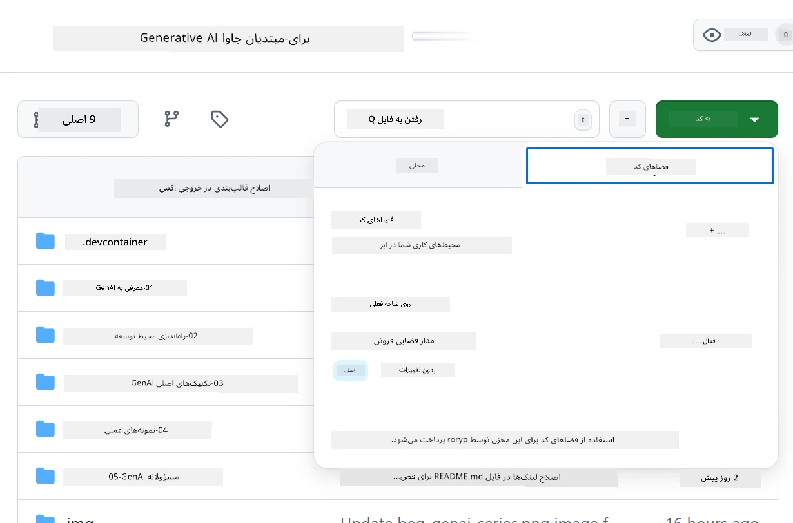
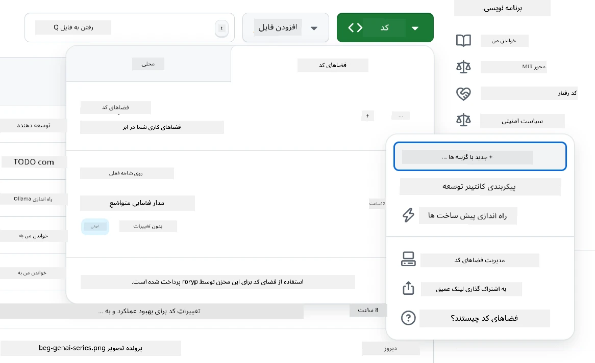
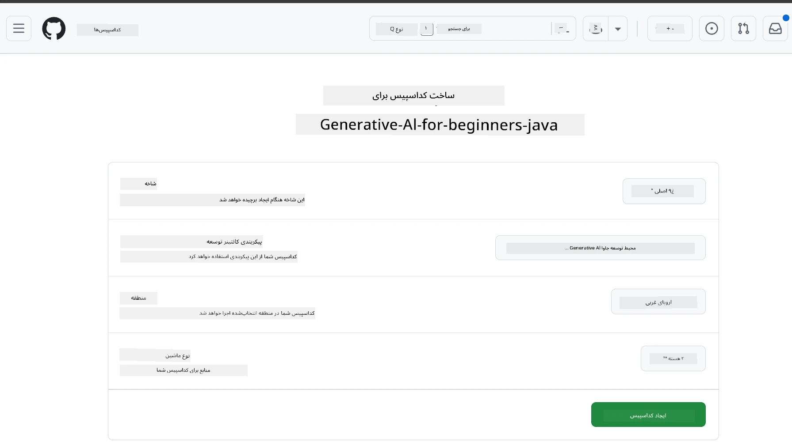
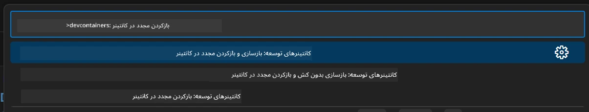
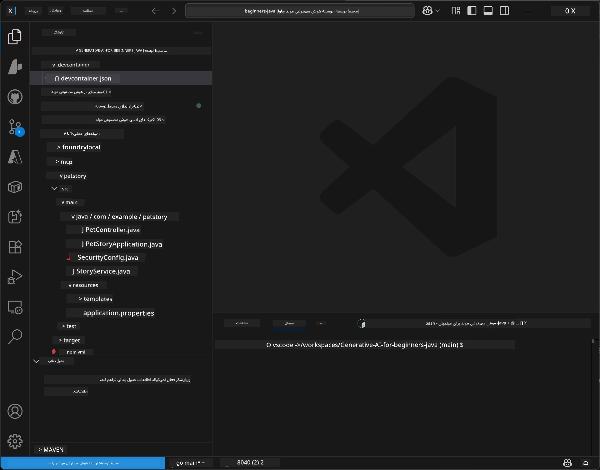
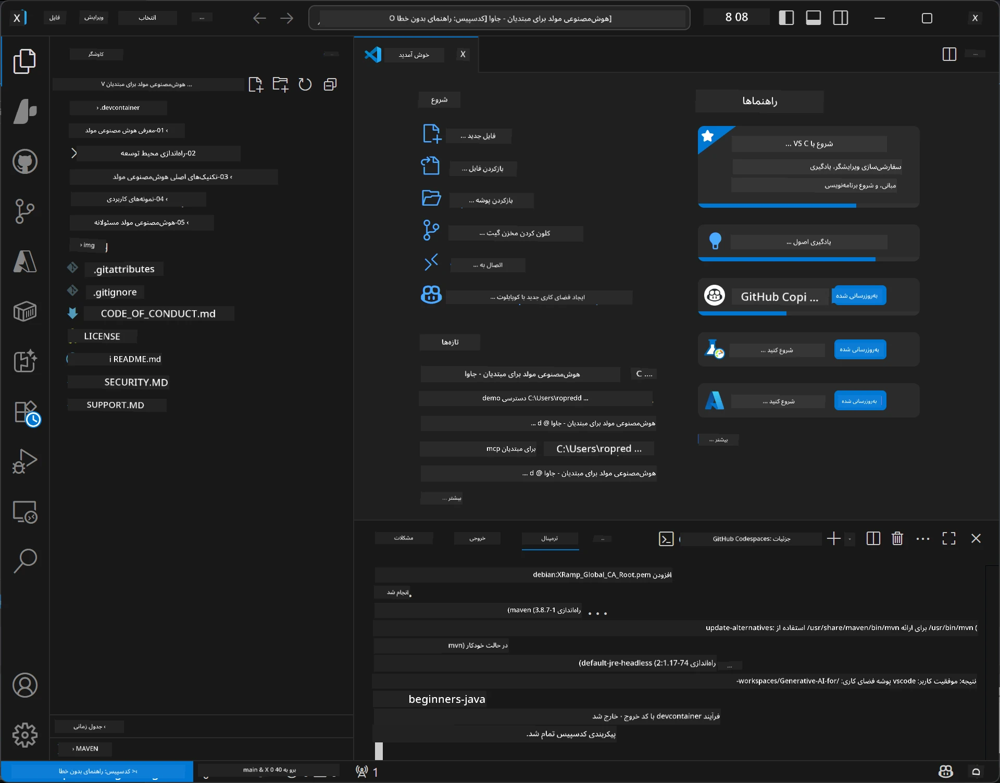

# راه‌اندازی محیط توسعه برای هوش مصنوعی مولد برای جاوا

> **شروع سریع:** مدل‌های هوش مصنوعی خود را روی **Azure AI Foundry** به صورت کد با Bicep + `azd` در چند دقیقه فراهم کنید — راهنمای [راه‌اندازی Azure AI Foundry](getting-started-azure-openai.md) را ببینید. احراز هویت به صورت **بدون کلید** (Microsoft Entra ID) است، بنابراین نیازی به مدیریت کلیدهای API نیست.

## آنچه خواهید آموخت

- راه‌اندازی محیط توسعه جاوا برای برنامه‌های هوش مصنوعی
- انتخاب و پیکربندی محیط توسعه دلخواه خود (اولویت ابری با Codespaces، محفظه توسعه محلی، یا راه‌اندازی کامل محلی)
- آزمایش راه‌اندازی خود با اتصال به مدل Azure AI Foundry

## فهرست مطالب

- [آنچه خواهید آموخت](#آنچه-خواهید-آموخت)
- [مقدمه](#مقدمه)
- [مرحله ۱: راه‌اندازی محیط توسعه](#مرحله-۱-راه‌اندازی-محیط-توسعه-خود)
  - [گزینه الف: GitHub Codespaces (توصیه‌شده)](#گزینه-الف-github-codespaces-توصیه‌شده)
  - [گزینه ب: محفظه توسعه محلی](#گزینه-ب-محفظه-توسعه-محلی)
  - [گزینه ج: استفاده از نصب محلی موجود](#گزینه-ج-استفاده-از-نصب-محلی-موجود)
- [مرحله ۲: فراهم‌سازی Azure AI Foundry](#مرحله-۲-فراهم‌سازی-azure-ai-foundry)
- [مرحله ۳: آزمایش راه‌اندازی](#مرحله-۳-آزمایش-راه‌اندازی-شما)
- [عیب‌یابی](#عیب‌یابی)
- [خلاصه](#خلاصه)
- [گام‌های بعدی](#گام‌های-بعدی)

## مقدمه

این فصل شما را در راه‌اندازی محیط توسعه راهنمایی می‌کند. در طول این دوره از **Azure AI Foundry** برای مدل‌ها استفاده خواهیم کرد. شما مدل‌ها را به عنوان کد با Bicep و ابزار خط فرمان توسعه‌دهنده آزور (`azd`) فراهم می‌کنید، سپس با احراز هویت **بدون کلید** (Microsoft Entra ID) متصل می‌شوید — نیازی به کپی یا لو دادن کلیدهای API نیست.

**نیازی به راه‌اندازی محلی نیست!** می‌توانید از GitHub Codespaces استفاده کنید که یک محیط توسعه کامل را در مرورگر شما فراهم می‌کند و از آنجا Foundry را فراهم کنید.

ما از **Azure AI Foundry** برای این دوره استفاده می‌کنیم زیرا:
- **به شکل کد فراهم می‌شود** — با یک `azd up` حساب کاربری و استقرار مدل‌ها را انجام می‌دهد
- **بدون کلید** — با ورود به Azure یا هویت مدیریت شده احراز هویت می‌کند
- **آماده تولید** — همان کد هم بصورت محلی و هم در آزور اجرا می‌شود
- **قابل انعطاف** — مدل‌ها را با تغییر نام استقرار به جای کد تعویض کنید

> **توجه**: استقرارهای Azure AI Foundry بر اساس توکن هزینه‌گذاری می‌شوند (پرداخت به ازای استفاده). برای جزئیات فراهم‌سازی، منطقه و هزینه‌ها راهنمای [راه‌اندازی Azure AI Foundry](getting-started-azure-openai.md) را ببینید.


## مرحله ۱: راه‌اندازی محیط توسعه خود

<a name="quick-start-cloud"></a>

ما یک محفظه توسعه از پیش پیکربندی شده ایجاد کرده‌ایم تا زمان راه‌اندازی را به حداقل برسانیم و اطمینان حاصل کنیم که همه ابزارهای لازم برای این دوره هوش مصنوعی مولد برای جاوا را دارید. روش توسعه دلخواه خود را انتخاب کنید:

### گزینه‌های راه‌اندازی محیط:

#### گزینه الف: GitHub Codespaces (توصیه‌شده)

**شروع برنامه‌نویسی در ۲ دقیقه - نیازی به راه‌اندازی محلی نیست!**

۱. این مخزن را به حساب GitHub خود فورک کنید
   > **توجه**: اگر می‌خواهید پیکربندی پایه را ویرایش کنید، به [پیکربندی محفظه توسعه](../../../.devcontainer/devcontainer.json) مراجعه کنید
۲. روی تب **Code** → **Codespaces** کلیک کنید → **...** → **New with options...**
۳. تنظیمات پیش‌فرض را استفاده کنید – این باعث انتخاب **پیکربندی محفظه توسعه** می‌شود: **محیط توسعه هوش مصنوعی مولد برای جاوا** که برای این دوره ساخته شده است
۴. روی **Create codespace** کلیک کنید
۵. حدود ۲ دقیقه صبر کنید تا محیط آماده شود
۶. به [مرحله ۲: فراهم‌سازی Azure AI Foundry](#مرحله-۲-فراهم‌سازی-azure-ai-foundry) بروید








> **مزایای Codespaces**:
> - نیازی به نصب محلی نیست
> - روی هر دستگاهی با مرورگر کار می‌کند
> - از پیش پیکربندی شده با تمام ابزارها و وابستگی‌ها
> - ۶۰ ساعت رایگان در ماه برای حساب‌های شخصی
> - محیط ثابت برای همه یادگیرندگان

#### گزینه ب: محفظه توسعه محلی

**برای توسعه‌دهندگانی که ترجیح می‌دهند محلی با داکر توسعه دهند**

۱. این مخزن را فورک و کلون کنید به دستگاه محلی خود
   > **توجه**: اگر می‌خواهید پیکربندی پایه را ویرایش کنید، به [پیکربندی محفظه توسعه](../../../.devcontainer/devcontainer.json) مراجعه کنید
۲. [Docker Desktop](https://www.docker.com/products/docker-desktop/) و [VS Code](https://code.visualstudio.com/) را نصب کنید
۳. افزونه [Dev Containers](https://marketplace.visualstudio.com/items?itemName=ms-vscode-remote.remote-containers) را در VS Code نصب کنید
۴. پوشه مخزن را در VS Code باز کنید
۵. وقتی خواسته شد، روی **Reopen in Container** کلیک کنید (یا از `Ctrl+Shift+P` → "Dev Containers: Reopen in Container" استفاده کنید)
۶. منتظر بمانید تا کانتینر ساخته و اجرا شود
۷. به [مرحله ۲: فراهم‌سازی Azure AI Foundry](#مرحله-۲-فراهم‌سازی-azure-ai-foundry) بروید





#### گزینه ج: استفاده از نصب محلی موجود

**برای توسعه‌دهندگانی که محیط‌های جاوای موجود دارند**

پیش‌نیازها:
- [Java 21+](https://www.oracle.com/java/technologies/javase/jdk21-archive-downloads.html) 
- [Maven 3.9+](https://maven.apache.org/download.cgi)
- [VS Code](https://code.visualstudio.com) یا IDE مورد علاقه شما

مراحل:
۱. این مخزن را به دستگاه محلی خود کلون کنید
۲. پروژه را در IDE خود باز کنید
۳. به [مرحله ۲: فراهم‌سازی Azure AI Foundry](#مرحله-۲-فراهم‌سازی-azure-ai-foundry) بروید

> **نکته حرفه‌ای**: اگر دستگاه با مشخصات پایین دارید اما می‌خواهید VS Code را محلی اجرا کنید، از GitHub Codespaces استفاده کنید! می‌توانید VS Code محلی خود را به یک Codespace میزبانی ابری متصل کنید تا بهترین‌های هر دو را داشته باشید.




## مرحله ۲: فراهم‌سازی Azure AI Foundry

مدل‌های هوش مصنوعی دوره را به صورت کد در Azure AI Foundry مستقر کنید. از ریشه مخزن:

```bash
cd 02-SetupDevEnvironment
azd auth login
az login
azd up
```

`azd` برای نام محیط، اشتراک و منطقه از شما سوال می‌کند، حساب Azure AI Foundry به همراه استقرارهای `gpt-5.6-luna` و `text-embedding-3-small` را فراهم می‌کند، و نقطه پایان را در فایل `.env` مثال می‌نویسد — همه این‌ها با احراز هویت **بدون کلید** (بدون کلید API).

> **راهنمای کامل:** برای پیش‌نیازها، جایگزین دستی (پرتال)، راهنمای منطقه، و نکات هزینه/پاک‌سازی راهنمای [راه‌اندازی Azure AI Foundry](getting-started-azure-openai.md) را ببینید.

## مرحله ۳: آزمایش راه‌اندازی شما

پس از فراهم‌سازی مدل‌های Foundry، اتصال را با برنامه نمونه در [`02-SetupDevEnvironment/examples/basic-chat-azure`](../../../02-SetupDevEnvironment/examples/basic-chat-azure) آزمایش کنید.

۱. ترمینال را در محیط توسعه خود باز کنید.
۲. به محل مثال بروید:
   ```bash
   cd 02-SetupDevEnvironment/examples/basic-chat-azure
   ```
۳. اطمینان حاصل کنید که وارد شده‌اید (احراز هویت بدون کلید به توکن نیاز دارد):
   ```bash
   az login
   ```
   > اگر `azd up` را اجرا کرده‌اید، فایل `.env` با نقطه پایان برای شما نوشته شده است.
۴. برنامه را اجرا کنید:
   ```bash
   mvn clean spring-boot:run
   ```

باید پاسخی از مدل `gpt-5.6-luna` ببینید.

### درک کد نمونه

نمونه [basic-chat](./examples/basic-chat-azure/README.md) از **Spring Boot 4.1.1** و **Spring AI 2.0.1** استفاده می‌کند. `ChatClient` در Spring AI توسط SDK رسمی OpenAI جاوا پشتیبانی می‌شود و به نقطه پایان Azure OpenAI **v1** با احراز هویت بدون کلید متصل می‌شود.

**این کد چه کاری انجام می‌دهد:**
- با استفاده از ورود Azure شما (Microsoft Entra ID) به Azure AI Foundry **اتصال** می‌یابد — بدون کلید API
- یک درخواست به مدل `gpt-5.6-luna` **ارسال** می‌کند
- پاسخ هوش مصنوعی را **دریافت** و نمایش می‌دهد
- صحت عملکرد راه‌اندازی شما را **اعتبارسنجی** می‌کند

**وابستگی‌های کلیدی** (گزیده از [pom.xml](../../../02-SetupDevEnvironment/examples/basic-chat-azure/pom.xml)):
```xml
<dependency>
    <groupId>org.springframework.ai</groupId>
    <artifactId>spring-ai-starter-model-openai</artifactId>
</dependency>
<dependency>
    <groupId>com.openai</groupId>
    <artifactId>openai-java</artifactId>
</dependency>
<dependency>
    <groupId>com.azure</groupId>
    <artifactId>azure-identity</artifactId>
    <version>${azure-identity.version}</version>
</dependency>
```

POM نسخه OpenAI Java **4.63.1** را مدیریت می‌کند و Azure Identity **1.18.6** را به‌طور خاص تنظیم می‌کند. Spring AI 2 استارت Azure-specific را حذف کرده است؛ Azure Identity برای bean اعتبار هنوز لازم است.

**پیکربندی** ([application.yml](../../../02-SetupDevEnvironment/examples/basic-chat-azure/src/main/resources/application.yml)):
```yaml
spring:
  ai:
    openai:
      base-url: ${AZURE_OPENAI_ENDPOINT}
      microsoft-foundry: true
      chat:
        model: ${AZURE_OPENAI_DEPLOYMENT:gpt-5.6-luna}
        reasoning-effort: none
        max-completion-tokens: 500
```

احراز هویت بدون کلید به‌طور صریح در [BasicChatApplication.java](../../../02-SetupDevEnvironment/examples/basic-chat-azure/src/main/java/com/example/BasicChatApplication.java) پیکربندی شده است و از نبود کلید API استنتاج نمی‌شود. اعتبارنامه آن از `DefaultAzureCredential` با دامنه `https://ai.azure.com/.default` استفاده می‌کند و `OpenAIClient` هدفش `/openai/v1` است. برنامه این کلاینت را به مدل چت Spring AI می‌دهد، بنابراین متغیر سراسری `OPENAI_API_KEY` نمی‌تواند جایگزین احراز هویت Azure شود.

تنظیمات چت مستقیما زیر `spring.ai.openai.chat` هستند، بدون بلوک `options`. درس چت کامل‌ها را با `reasoning-effort: none` و حد ۵۰۰ توکن نگه می‌دارد؛ دمای مدل یا حداکثر توکن‌ها تنظیم نشده‌اند. مرجع پیکربندی [مثال](./examples/basic-chat-azure/README.md#spring-configuration) را برای انتخاب API و راهنمایی فراخوانی ابزار ببینید.

## خلاصه

پس از انجام مراحل بالا، شما:

- مدل‌های Azure AI Foundry را به عنوان کد با Bicep + `azd` فراهم کرده‌اید
- محیط توسعه جاوای خود را راه‌اندازی کرده‌اید (چه Codespaces، محفظه توسعه یا محلی)
- با احراز هویت بدون کلید (Microsoft Entra ID) به Azure AI Foundry متصل شده‌اید — بدون کلید API
- با یک مثال ساده که با مدل شما صحبت می‌کند، همه چیز را آزمایش کرده‌اید

## گام‌های بعدی

[فصل ۳: تکنیک‌های اصلی هوش مصنوعی مولد](../03-CoreGenerativeAITechniques/README.md)

## عیب‌یابی

مشکل دارید؟ در اینجا مشکلات و راه‌حل‌های رایج آمده است:

- **احراز هویت انجام نمی‌شود (۴۰۱/۴۰۳)؟** 
  - دستور `az login` را اجرا کنید — احراز هویت بدون کلید است، بنابراین باید وارد شده باشید
  - اطمینان حاصل کنید که حساب شما نقش **Cognitive Services OpenAI User** روی منابع دارد
  - اگر تازه فراهم‌سازی کردید، یک دقیقه صبر کنید تا انتساب نقش اعمال شود

- **Maven پیدا نمی‌شود؟** 
  - اگر از محفظه‌های توسعه یا Codespaces استفاده می‌کنید، Maven باید از قبل نصب شده باشد
  - برای راه‌اندازی محلی، اطمینان حاصل کنید Java 21+ و Maven 3.9+ نصب شده‌اند
  - با اجرای `mvn --version` نصب را بررسی کنید

- **`azd` پیدا نمی‌شود یا فراهم‌سازی شکست می‌خورد؟** 
  - [Azure Developer CLI](https://aka.ms/azure-dev/install) را نصب کنید و `azd auth login` را اجرا کنید
  - منطقه‌ای انتخاب کنید که `gpt-5.6-luna` و `text-embedding-3-small` در آن در دسترس باشند (مثلا `eastus2`) و سهمیه کافی در اشتراک انتخابی داشته باشید
  - جزئیات را در [راهنمای راه‌اندازی Azure AI Foundry](getting-started-azure-openai.md) ببینید

- **محفظه توسعه شروع نمی‌شود؟** 
  - اطمینان حاصل کنید Docker Desktop در حال اجراست (برای توسعه محلی)
  - سعی کنید محفظه را دوباره بسازید: `Ctrl+Shift+P` → "Dev Containers: Rebuild Container"

- **خطاهای کامپایل برنامه؟**
  - اطمینان حاصل کنید در دایرکتوری درست هستید: `02-SetupDevEnvironment/examples/basic-chat-azure`
  - سعی کنید پاک‌سازی و دوباره‌سازی کنید: `mvn clean compile`

> **کمک می‌خواهید؟**: هنوز مشکل دارید؟ یک Issue در مخزن باز کنید تا به شما کمک کنیم.

---

<!-- CO-OP TRANSLATOR DISCLAIMER START -->
**سلب مسئولیت**:
این سند با استفاده از سرویس ترجمه هوش مصنوعی [Co-op Translator](https://github.com/Azure/co-op-translator) ترجمه شده است. در حالی که ما در تلاش برای دقت هستیم، لطفاً توجه داشته باشید که ترجمه‌های خودکار ممکن است شامل خطاها یا نادرستی‌هایی باشند. سند اصلی به زبان مادری خود باید به عنوان منبع معتبر در نظر گرفته شود. برای اطلاعات حیاتی، ترجمه حرفه‌ای انسانی توصیه می‌شود. ما در قبال هرگونه سوء تفاهم یا برداشت نادرست ناشی از استفاده از این ترجمه مسئولیتی نداریم.
<!-- CO-OP TRANSLATOR DISCLAIMER END -->