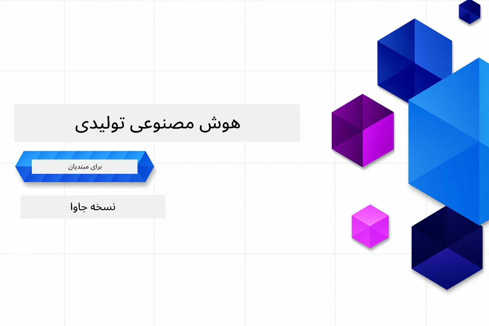

# هوش مصنوعی مولد برای مبتدیان - نسخه جاوا
[](https://discord.gg/nTYy5BXMWG)



**مدت زمان مورد نیاز**: کل کارگاه را می‌توان به صورت آنلاین و بدون راه‌اندازی محلی انجام داد. راه‌اندازی محیط ۲ دقیقه طول می‌کشد و بررسی نمونه‌ها بسته به عمق اکتشاف بین ۱ تا ۳ ساعت زمان می‌برد.

> **شروع سریع**

۱. این مخزن را به حساب GitHub خود فورک کنید
۲. روی **Code** کلیک کنید → تب **Codespaces** → **...** → **New with options...**
۳. از پیش‌فرض‌ها استفاده کنید – این گزینه کانتینر توسعه ساخته شده برای این دوره را انتخاب می‌کند
۴. روی **Create codespace** کلیک کنید
۵. تقریبا ۲ دقیقه منتظر بمانید تا محیط آماده شود
۶. مستقیما به [فصل ۲: آماده‌سازی Azure AI Foundry](./02-SetupDevEnvironment/README.md#step-2-provision-azure-ai-foundry) بروید

## پشتیبانی چندزبانه

### پشتیبانی شده از طریق GitHub Action (خودکار و همیشه به‌روز)

<!-- CO-OP TRANSLATOR LANGUAGES TABLE START -->
[Arabic](../ar/README.md) | [Bengali](../bn/README.md) | [Bulgarian](../bg/README.md) | [Burmese (Myanmar)](../my/README.md) | [Chinese (Simplified)](../zh-CN/README.md) | [Chinese (Traditional, Hong Kong)](../zh-HK/README.md) | [Chinese (Traditional, Macau)](../zh-MO/README.md) | [Chinese (Traditional, Taiwan)](../zh-TW/README.md) | [Croatian](../hr/README.md) | [Czech](../cs/README.md) | [Danish](../da/README.md) | [Dutch](../nl/README.md) | [Estonian](../et/README.md) | [Finnish](../fi/README.md) | [French](../fr/README.md) | [German](../de/README.md) | [Greek](../el/README.md) | [Hebrew](../he/README.md) | [Hindi](../hi/README.md) | [Hungarian](../hu/README.md) | [Indonesian](../id/README.md) | [Italian](../it/README.md) | [Japanese](../ja/README.md) | [Kannada](../kn/README.md) | [Khmer](../km/README.md) | [Korean](../ko/README.md) | [Lithuanian](../lt/README.md) | [Malay](../ms/README.md) | [Malayalam](../ml/README.md) | [Marathi](../mr/README.md) | [Nepali](../ne/README.md) | [Nigerian Pidgin](../pcm/README.md) | [Norwegian](../no/README.md) | [Persian (Farsi)](./README.md) | [Polish](../pl/README.md) | [Portuguese (Brazil)](../pt-BR/README.md) | [Portuguese (Portugal)](../pt-PT/README.md) | [Punjabi (Gurmukhi)](../pa/README.md) | [Romanian](../ro/README.md) | [Russian](../ru/README.md) | [Serbian (Cyrillic)](../sr/README.md) | [Slovak](../sk/README.md) | [Slovenian](../sl/README.md) | [Spanish](../es/README.md) | [Swahili](../sw/README.md) | [Swedish](../sv/README.md) | [Tagalog (Filipino)](../tl/README.md) | [Tamil](../ta/README.md) | [Telugu](../te/README.md) | [Thai](../th/README.md) | [Turkish](../tr/README.md) | [Ukrainian](../uk/README.md) | [Urdu](../ur/README.md) | [Vietnamese](../vi/README.md)

> **ترجیح می‌دهید محلی کلون کنید؟**
>
> این مخزن شامل بیش از ۵۰ ترجمه زبان است که به طور قابل توجهی اندازه دانلود را افزایش می‌دهد. برای کلون کردن بدون ترجمه‌ها از sparse checkout استفاده کنید:
>
> **Bash / macOS / Linux:**
> ```bash
> git clone --filter=blob:none --sparse https://github.com/microsoft/Generative-AI-for-beginners-java.git
> cd Generative-AI-for-beginners-java
> git sparse-checkout set --no-cone '/*' '!translations' '!translated_images'
> ```
>
> **CMD (ویندوز):**
> ```cmd
> git clone --filter=blob:none --sparse https://github.com/microsoft/Generative-AI-for-beginners-java.git
> cd Generative-AI-for-beginners-java
> git sparse-checkout set --no-cone "/*" "!translations" "!translated_images"
> ```
>
> این همه چیز لازم برای تکمیل دوره را با سرعت دانلود بسیار بالاتر به شما می‌دهد.
<!-- CO-OP TRANSLATOR LANGUAGES TABLE END -->

## ساختار دوره و مسیر یادگیری

### **فصل ۱: مقدمه‌ای بر هوش مصنوعی مولد**
- **مفاهیم اصلی**: درک مدل‌های زبان بزرگ، توکن‌ها، جاسازی‌ها و قابلیت‌های هوش مصنوعی
- **اکوسیستم هوش مصنوعی جاوا**: مروری بر Spring AI و SDKهای OpenAI
- **پروتکل زمینه مدل**: معرفی MCP و نقش آن در ارتباط عامل‌های هوش مصنوعی
- **کاربردهای عملی**: سناریوهای واقعی از جمله چت‌بات‌ها و تولید محتوا
- **[→ شروع فصل ۱](./01-IntroToGenAI/README.md)**

### **فصل ۲: راه‌اندازی محیط توسعه**
- **Azure AI Foundry**: آماده‌سازی چت GPT-5.6 Luna و جاسازی‌های text-embedding-3-small با Bicep و خط فرمان توسعه دهنده Azure (azd)
- **Spring Boot 4.1.1 + Spring AI 2.0.1**: یادگیری با `ChatClient`، پشتیبانی شده توسط SDK رسمی OpenAI جاوا و Azure OpenAI v1
- **احراز هویت بدون کلید**: اتصال امن با Microsoft Entra ID — بدون نیاز به مدیریت کلید API
- **ابزارهای توسعه**: کانتینرهای داکر، VS Code، و پیکربندی GitHub Codespaces
- **[→ شروع فصل ۲](./02-SetupDevEnvironment/README.md)**

### **فصل ۳: تکنیک‌های اصلی هوش مصنوعی مولد**
- **SDK رسمی OpenAI جاوا**: فراخوانی مستقیم Azure OpenAI v1 با احراز هویت بدون کلید
- **مهندسی پرامپت**: تکنیک‌هایی برای پاسخ‌های بهینه مدل‌های هوش مصنوعی
- **جاسازی‌ها و عملیات برداری**: اجرای جستجوی معنایی و تطبیق شباهت
- **تولید تقویت‌شده با بازیابی (RAG)**: ترکیب هوش مصنوعی با منابع داده شخصی شما
- **فراخوانی توابع**: افزودن قابلیت‌های بیشتر با ابزارها و افزونه‌های سفارشی
- **[→ شروع فصل ۳](./03-CoreGenerativeAITechniques/README.md)**

### **فصل ۴: کاربردهای عملی و پروژه‌ها**
- **تولید کننده داستان حیوانات خانگی** (`petstory/`): تولید محتوای خلاقانه با Azure AI Foundry
- **دموی محلی Foundry** (`foundrylocal/`): ادغام مدل هوش مصنوعی محلی با SDK رسمی OpenAI جاوا
- **سرویس محاسبه پروتکل زمینه مدل (MCP)** (`calculator/`): پیاده‌سازی پایه MCP با Spring AI
- **[→ شروع فصل ۴](./04-PracticalSamples/README.md)**

### **فصل ۵: توسعه مسئولانه هوش مصنوعی**
- **ایمنی محتوای Azure AI Foundry**: آزمایش فیلترینگ و مکانیزم‌های ایمنی (مسدود کردن سخت و ردهای نرم)
- **دموی مسئولیت هوش مصنوعی**: مثال عملی نحوه عملکرد سیستم‌های ایمنی مدرن هوش مصنوعی
- **بهترین شیوه‌ها**: راهنمایی‌های ضروری برای توسعه و استقرار اخلاقی هوش مصنوعی
- **[→ شروع فصل ۵](./05-ResponsibleGenAI/README.md)**

## منابع اضافی

<!-- CO-OP TRANSLATOR OTHER COURSES START -->
### LangChain
[](https://aka.ms/langchain4j-for-beginners)
[](https://aka.ms/langchainjs-for-beginners?WT.mc_id=m365-94501-dwahlin)
[](https://github.com/microsoft/langchain-for-beginners?WT.mc_id=m365-94501-dwahlin)
---

### Azure / Edge / MCP / Agents
[](https://github.com/microsoft/AZD-for-beginners?WT.mc_id=academic-105485-koreyst)
[](https://github.com/microsoft/edgeai-for-beginners?WT.mc_id=academic-105485-koreyst)
[](https://github.com/microsoft/mcp-for-beginners?WT.mc_id=academic-105485-koreyst)
[](https://github.com/microsoft/ai-agents-for-beginners?WT.mc_id=academic-105485-koreyst)

---
 
### مجموعه هوش مصنوعی مولد
[](https://github.com/microsoft/generative-ai-for-beginners?WT.mc_id=academic-105485-koreyst)
[-9333EA?style=for-the-badge&labelColor=E5E7EB&color=9333EA)](https://github.com/microsoft/Generative-AI-for-beginners-dotnet?WT.mc_id=academic-105485-koreyst)
[-C084FC?style=for-the-badge&labelColor=E5E7EB&color=C084FC)](https://github.com/microsoft/generative-ai-for-beginners-java?WT.mc_id=academic-105485-koreyst)
[-E879F9?style=for-the-badge&labelColor=E5E7EB&color=E879F9)](https://github.com/microsoft/generative-ai-with-javascript?WT.mc_id=academic-105485-koreyst)

---
 
### یادگیری اصلی
[](https://aka.ms/ml-beginners?WT.mc_id=academic-105485-koreyst)
[](https://aka.ms/datascience-beginners?WT.mc_id=academic-105485-koreyst)
[](https://aka.ms/ai-beginners?WT.mc_id=academic-105485-koreyst)
[](https://github.com/microsoft/Security-101?WT.mc_id=academic-96948-sayoung)
[](https://aka.ms/webdev-beginners?WT.mc_id=academic-105485-koreyst)
[](https://aka.ms/iot-beginners?WT.mc_id=academic-105485-koreyst)
[](https://github.com/microsoft/xr-development-for-beginners?WT.mc_id=academic-105485-koreyst)

---
 
### مجموعه Copilot
[](https://aka.ms/GitHubCopilotAI?WT.mc_id=academic-105485-koreyst)
[](https://github.com/microsoft/mastering-github-copilot-for-dotnet-csharp-developers?WT.mc_id=academic-105485-koreyst)
[](https://github.com/microsoft/CopilotAdventures?WT.mc_id=academic-105485-koreyst)
<!-- CO-OP TRANSLATOR OTHER COURSES END -->

## دریافت کمک

اگر گیر کنید یا سوالی درباره ساخت اپلیکیشن‌های هوش مصنوعی داشته باشید، به جمع یادگیرندگان و توسعه‌دهندگان باتجربه برای بحث در مورد MCP بپیوندید. این یک جامعه حمایت‌کننده است که سوالات مورد استقبال قرار می‌گیرد و دانش به صورت آزاد به اشتراک گذاشته می‌شود.

[](https://discord.gg/nTYy5BXMWG)

اگر بازخورد محصول یا خطا هنگام ساخت دارید به اینجا مراجعه کنید:

[](https://aka.ms/foundry/forum)

---

<!-- CO-OP TRANSLATOR DISCLAIMER START -->
**سلب مسئولیت**:
این سند با استفاده از سرویس ترجمه هوش مصنوعی [Co-op Translator](https://github.com/Azure/co-op-translator) ترجمه شده است. در حالی که ما در تلاش برای دقت هستیم، لطفاً توجه داشته باشید که ترجمه‌های خودکار ممکن است شامل خطاها یا نادرستی‌هایی باشند. سند اصلی به زبان مادری خود باید به عنوان منبع معتبر در نظر گرفته شود. برای اطلاعات حیاتی، ترجمه حرفه‌ای انسانی توصیه می‌شود. ما در قبال هرگونه سوء تفاهم یا برداشت نادرست ناشی از استفاده از این ترجمه مسئولیتی نداریم.
<!-- CO-OP TRANSLATOR DISCLAIMER END -->