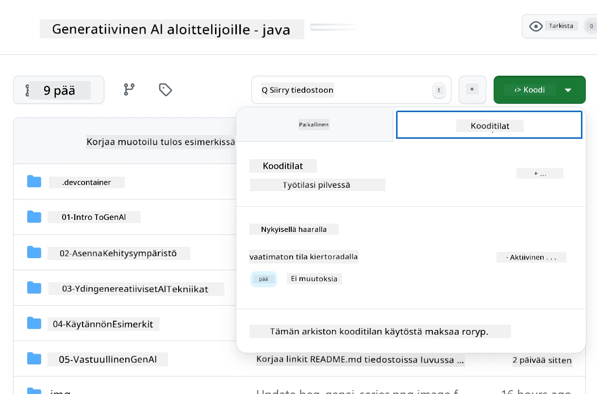
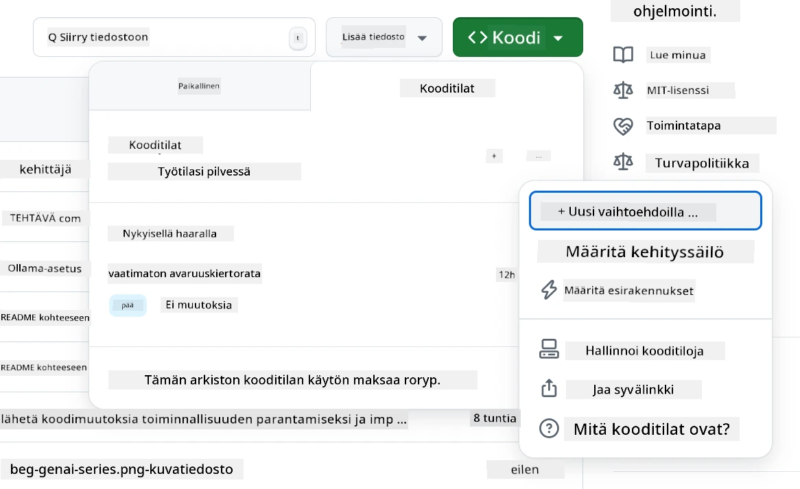
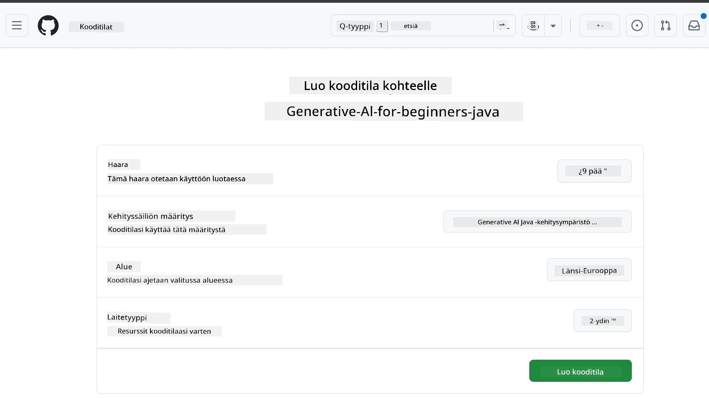
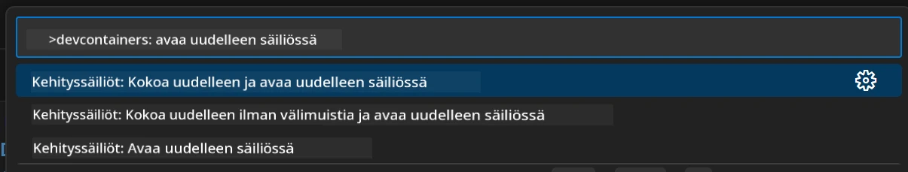
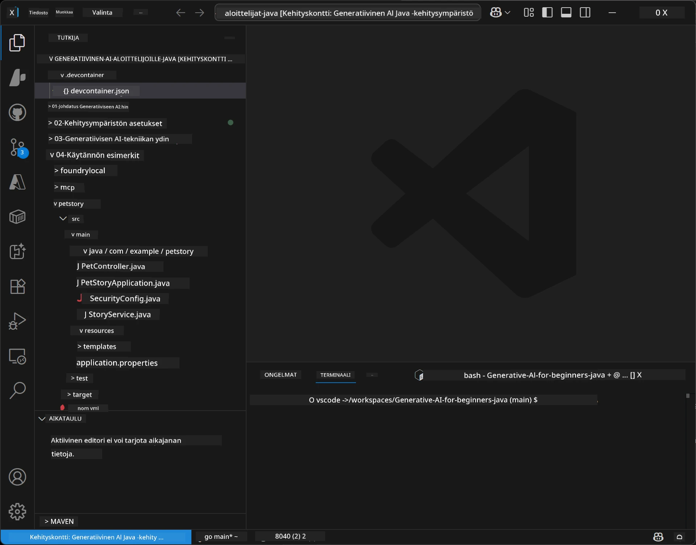
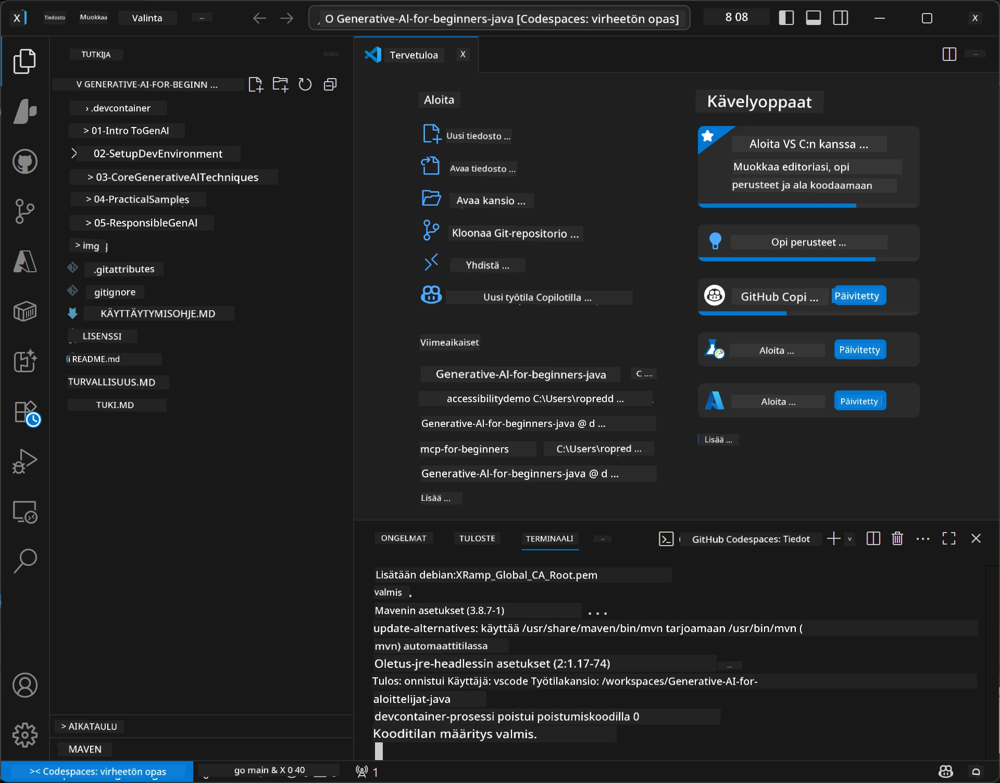

# Kehitysympäristön perustaminen Generatiivista tekoälyä varten Javaa varten

> **Pikakäynnistys:** Ota AI-mallisi käyttöön **Azure AI Foundryssa** koodina Bicepillä + `azd`:llä muutamassa minuutissa — katso [Azure AI Foundryn asennusopas](getting-started-azure-openai.md). Todennus on **avaimetonta** (Microsoft Entra ID), joten API-avaimia ei tarvitse hallita.

## Mitä opit

- Perustamaan Java-kehitysympäristön AI-sovelluksia varten
- Valitsemaan ja konfiguroimaan oma suosikkikehitysympäristösi (pilvipohjainen Codespacesilla, paikallinen kehityssäiliö tai täydellinen paikallinen asennus)
- Testaamaan asennus yhdistämällä Azure AI Foundry -malliin

## Sisällysluettelo

- [Mitä opit](#mitä-opit)
- [Johdanto](#johdanto)
- [Vaihe 1: Kehitysympäristön perustaminen](#vaihe-1-kehitysympäristön-perustaminen)
  - [Vaihtoehto A: GitHub Codespaces (suositus)](#vaihtoehto-a-github-codespaces-suositus)
  - [Vaihtoehto B: Paikallinen kehityssäiliö](#vaihtoehto-b-paikallinen-kehityssäiliö)
  - [Vaihtoehto C: Käytä olemassa olevaa paikallista asennustasi](#vaihtoehto-c-käytä-olemassa-olevaa-paikallista-asennustasi)
- [Vaihe 2: Azure AI Foundryn varaaminen](#vaihe-2-azure-ai-foundryn-varaaminen)
- [Vaihe 3: Asennuksen testaaminen](#vaihe-3-asennuksen-testaaminen)
- [Vianetsintä](#vianetsintä)
- [Yhteenveto](#yhteenveto)
- [Seuraavat askeleet](#seuraavat-askeleet)

## Johdanto

Tämä luku opastaa sinua kehitysympäristön perustamisessa. Käytämme koko kurssilla **Azure AI Foundrya** malleihin. Varaat mallit koodina Bicepillä ja Azure Developer CLI:llä (`azd`), ja yhdistät käyttämällä **avaimetonta todennusta** (Microsoft Entra ID) — ei API-avainten kopiointia tai vuotoja.

**Ei paikallista asennusta vaadita!** Voit käyttää GitHub Codespacesia, joka tarjoaa täydellisen kehitysympäristön selaimeesi ja josta voit myös varata Foundryn.

Käytämme **Azure AI Foundrya** tässä kurssissa, koska se on:
- **Koodina varattavissa** — yksi `azd up` ottaa tilin ja mallien käyttöön
- **Avaimeton** — todenna Azure-kirjautumisellasi tai hallitulla identiteetillä
- **Tuotantovalmiina** — sama koodi toimii paikallisesti ja Azuren pilvessä
- **Joustava** — vaihda malleja muuttamalla vain käyttöönoton nimeä, ei koodiasi

> **Huom:** Azure AI Foundryn käyttöönotot veloitetaan tokeneittain (käytön mukaan). Katso [Azure AI Foundryn asennusopas](getting-started-azure-openai.md) käyttöönotosta, alueesta ja hinnoista.


## Vaihe 1: Kehitysympäristön perustaminen

<a name="quick-start-cloud"></a>

Olemme luoneet valmiiksi konfiguroidun kehityssäiliön, jotta asennusaika olisi mahdollisimman lyhyt ja sinulla olisi kaikki tarvittavat työkalut Generatiivisen tekoälyn hankkeen Java-kurssille. Valitse haluamasi kehitystapa:

### Kehitysympäristön asennusvaihtoehdot:

#### Vaihtoehto A: GitHub Codespaces (Suositus)

**Aloita koodaaminen 2 minuutissa - ei paikallista asennusta!**

1. Tee fork tästä repositoriosta GitHub-tilillesi
   > **Huom:** Jos haluat muokata perusasetuksia, tutustu [Dev Container Configuration](../../../.devcontainer/devcontainer.json) -tiedostoon
2. Klikkaa **Code** → **Codespaces** -välilehti → **...** → **New with options...**
3. Käytä oletusasetuksia – tämä valitsee **Dev container configuration**: **Generative AI Java Development Environment**, kurssille luodun räätälöidyn kehityssäiliön
4. Klikkaa **Create codespace**
5. Odota noin 2 minuuttia ympäristön valmistumiseksi
6. Jatka kohtaan [Vaihe 2: Azure AI Foundryn varaaminen](#vaihe-2-azure-ai-foundryn-varaaminen)








> **Codespacesin hyödyt**:
> - Ei paikallista asennusta
> - Toimii millä tahansa laitteella, jossa on selain
> - Esikonfiguroitu kaikilla työkaluilla ja riippuvuuksilla
> - Ilmainen 60 tuntia kuukaudessa henkilökohtaisille tileille
> - Yhtenäinen ympäristö kaikille oppijoille

#### Vaihtoehto B: Paikallinen kehityssäiliö

**Kehittäjille, jotka suosivat paikallista kehitystä Dockerin avulla**

1. Tee fork ja kloonaa tämä repositorio paikalliselle koneellesi
   > **Huom:** Jos haluat muokata perusasetuksia, tutustu [Dev Container Configuration](../../../.devcontainer/devcontainer.json) -tiedostoon
2. Asenna [Docker Desktop](https://www.docker.com/products/docker-desktop/) ja [VS Code](https://code.visualstudio.com/)
3. Asenna [Dev Containers -laajennus](https://marketplace.visualstudio.com/items?itemName=ms-vscode-remote.remote-containers) VS Codeen
4. Avaa repositorion kansio VS Codessa
5. Kun sinua kehotetaan, klikkaa **Reopen in Container** (tai käytä `Ctrl+Shift+P` → "Dev Containers: Reopen in Container")
6. Odota, että kontti rakentuu ja käynnistyy
7. Jatka kohtaan [Vaihe 2: Azure AI Foundryn varaaminen](#vaihe-2-azure-ai-foundryn-varaaminen)





#### Vaihtoehto C: Käytä olemassa olevaa paikallista asennustasi

**Kehittäjille, joilla on olemassa Java-ympäristö**

Vaatimukset:
- [Java 21+](https://www.oracle.com/java/technologies/javase/jdk21-archive-downloads.html) 
- [Maven 3.9+](https://maven.apache.org/download.cgi)
- [VS Code](https://code.visualstudio.com) tai muu suosikkisi IDE

Vaiheet:
1. Kloonaa tämä repositorio paikallisesti
2. Avaa projekti IDE:ssäsi
3. Jatka kohtaan [Vaihe 2: Azure AI Foundryn varaaminen](#vaihe-2-azure-ai-foundryn-varaaminen)

> **Vinkki:** Jos koneesi on vähätehoinen mutta haluat paikallisen VS Coden, käytä GitHub Codespacesia! Voit yhdistää paikallisen VS Coden pilvipohjaiseen Codespaceen, niin saat molempien parhaat puolet.




## Vaihe 2: Azure AI Foundryn varaaminen

Ota kurssin tekoälymallit käyttöön Azure AI Foundryssa koodina. Repositorion juuresta:

```bash
cd 02-SetupDevEnvironment
azd auth login
az login
azd up
```

`azd` pyytää ympäristön nimeä, tilausta ja aluetta, ottaa käyttöön Azure AI Foundry -tilin `gpt-5.6-luna` ja `text-embedding-3-small` -käyttöönottojen kera ja kirjoittaa päätelaitteen esimerkin `.env`-tiedostoon — kaikki tämä **avaimettomalla** todennuksella (ei API-avaimia).

> **Täysi läpikäynti:** Katso [Azure AI Foundryn asennusopas](getting-started-azure-openai.md) esivaatimuksista, manuaalisesta (portaalin) vaihtoehdosta, aluevalinnoista ja kustannuksista/siivouksesta.

## Vaihe 3: Asennuksen testaaminen

Kun Foundryn mallit on otettu käyttöön, testaa yhteys esimerkkisovelluksella paikassa [`02-SetupDevEnvironment/examples/basic-chat-azure`](../../../02-SetupDevEnvironment/examples/basic-chat-azure).

1. Avaa terminaali kehitysympäristössäsi.
2. Siirry esimerkkikansioon:
   ```bash
   cd 02-SetupDevEnvironment/examples/basic-chat-azure
   ```
3. Varmista, että olet kirjautunut sisään (avaimeton todennus tarvitsee tokenin):
   ```bash
   az login
   ```
   > Jos olet suorittanut `azd up`, `.env`-tiedosto päätelaitteellasi on jo kirjoitettu.
4. Suorita sovellus:
   ```bash
   mvn clean spring-boot:run
   ```

Näet vastauksen `gpt-5.6-luna` -mallilta.

### Esimerkkikoodin ymmärtäminen

[basic-chat-esimerkki](./examples/basic-chat-azure/README.md) käyttää **Spring Boot 4.1.1** ja **Spring AI 2.0.1**. Spring AI:n `ChatClient` pohjautuu viralliseen OpenAI Java SDK:han, yhdistyy Azure OpenAI **v1** -päätelaitteeseen avaimettomalla todennuksella.

**Tämä koodi tekee seuraavaa:**
- **Yhdistää** Azure AI Foundryyn Azure-kirjautumisellasi (Microsoft Entra ID) — ei API-avainta
- **Lähettää** kehotteen `gpt-5.6-luna` -mallille
- **Vastaanottaa** ja näyttää tekoälyn vastauksen
- **Todentaa** asennuksen toimivuuden

**Keskeiset riippuvuudet** (ote [pom.xml]:stä) (./examples/basic-chat-azure/pom.xml):
```xml
<dependency>
    <groupId>org.springframework.ai</groupId>
    <artifactId>spring-ai-starter-model-openai</artifactId>
</dependency>
<dependency>
    <groupId>com.openai</groupId>
    <artifactId>openai-java</artifactId>
</dependency>
<dependency>
    <groupId>com.azure</groupId>
    <artifactId>azure-identity</artifactId>
    <version>${azure-identity.version}</version>
</dependency>
```

POM hallinnoi OpenAI Java **4.63.1**:tä ja asettaa Azure Identityn **1.18.6** erikseen. Spring AI 2 poisti Azure-spesifisen starterin; Azure Identity tarvitaan silti tunnistautumiseen.

**Konfiguraatio** ([application.yml](../../../02-SetupDevEnvironment/examples/basic-chat-azure/src/main/resources/application.yml)):
```yaml
spring:
  ai:
    openai:
      base-url: ${AZURE_OPENAI_ENDPOINT}
      microsoft-foundry: true
      chat:
        model: ${AZURE_OPENAI_DEPLOYMENT:gpt-5.6-luna}
        reasoning-effort: none
        max-completion-tokens: 500
```

Avaimeton todennus on määritelty suoraan [BasicChatApplication.java](../../../02-SetupDevEnvironment/examples/basic-chat-azure/src/main/java/com/example/BasicChatApplication.java), ei päätelty puuttuvasta API-avaimesta. Sen tunnistustieto käyttää `DefaultAzureCredential`-luokkaa skoopilla `https://ai.azure.com/.default`, ja sen `OpenAIClient` kohdistuu `/openai/v1`:een. Sovellus toimittaa kyseisen clientin Spring AI:n chat-mallille, joten globaali `OPENAI_API_KEY` ei voi ohittaa Azuren todennusta.

Chat-asetukset ovat suoraan `spring.ai.openai.chat`-kohdassa, ilman `options`-lohkoa. Oppitunti käyttää Chat Completionsia `reasoning-effort: none` ja 500 tokenin enimmäismäärällä; se ei aseta `temperature` tai `max-tokens`. Katso [esimerkin konfiguraatioviite](./examples/basic-chat-azure/README.md#spring-configuration) API-valinnasta ja työkalukutsujen ohjauksesta.

## Yhteenveto

Suoritettuasi yllä olevat vaiheet sinulla on:

- Varattu Azure AI Foundryn mallit koodina käyttäen Bicepiä + `azd`
- Toimiva Java-kehitysympäristö (oli se sitten Codespaces, kehityssäiliöt tai paikallinen)
- Yhdistetty Azure AI Foundryyn avaimettomalla todennuksella (Microsoft Entra ID) — ilman API-avaimia
- Testattu, että kaikki toimii yksinkertaisella esimerkillä, joka kommunikoi mallisi kanssa

## Seuraavat askeleet

[Luku 3: Generatiivisen tekoälyn keskeiset tekniikat](../03-CoreGenerativeAITechniques/README.md)

## Vianetsintä

Ongelmia? Tässä yleisiä ongelmia ja ratkaisuja:

- **Todennus epäonnistuu (401/403)?** 
  - Suorita `az login` — todennus on avaimetonta, sinun pitää olla kirjautuneena sisään
  - Tarkista, että tililläsi on **Cognitive Services OpenAI User** -rooli resurssissa
  - Jos juuri varasit, odota minuutti, että roolijako päivittyy

- **Maven ei löydy?** 
  - Jos käytät kehityssäiliöitä tai Codespacesia, Maven on esiasennettu
  - Paikallisessa asennuksessa varmista, että Java 21+ ja Maven 3.9+ ovat asennettuina
  - Kokeile `mvn --version` varmistaaksesi asennuksen

- **`azd` ei löydy tai käyttöönotto epäonnistuu?** 
  - Asenna [Azure Developer CLI](https://aka.ms/azure-dev/install) ja suorita `azd auth login`
  - Valitse alue, jossa `gpt-5.6-luna` ja `text-embedding-3-small` ovat saatavilla (esim. `eastus2`), ja jossa tilauksellasi on riittävä kiintiö
  - Katso [Azure AI Foundryn asennusopas](getting-started-azure-openai.md) lisätietoja varten

- **Dev container ei käynnisty?** 
  - Varmista, että Docker Desktop on käynnissä (paikalliseen kehitykseen)
  - Kokeile rakentaa säiliö uudelleen: `Ctrl+Shift+P` → "Dev Containers: Rebuild Container"

- **Sovelluksen käännösvirheitä?**
  - Varmista, että olet oikeassa kansiossa: `02-SetupDevEnvironment/examples/basic-chat-azure`
  - Kokeile puhdistaa ja kääntää uudelleen: `mvn clean compile`

> **Tarvitsetko apua?**: Jos ongelmat jatkuvat, avaa issue repositoriossa, niin autamme.

---

<!-- CO-OP TRANSLATOR DISCLAIMER START -->
**Vastuuvapauslauseke**:
Tämä asiakirja on käännetty käyttämällä tekoälypohjaista käännöspalvelua [Co-op Translator](https://github.com/Azure/co-op-translator). Vaikka pyrimme tarkkuuteen, otathan huomioon, että automaattiset käännökset saattavat sisältää virheitä tai epätarkkuuksia. Alkuperäinen asiakirja sen alkuperäiskielellä on virallinen lähde. Tärkeissä asioissa suositellaan ammattimaista ihmiskäännöstä. Emme ole vastuussa tämän käännöksen käytöstä aiheutuvista väärinymmärryksistä tai tulkinnoista.
<!-- CO-OP TRANSLATOR DISCLAIMER END -->