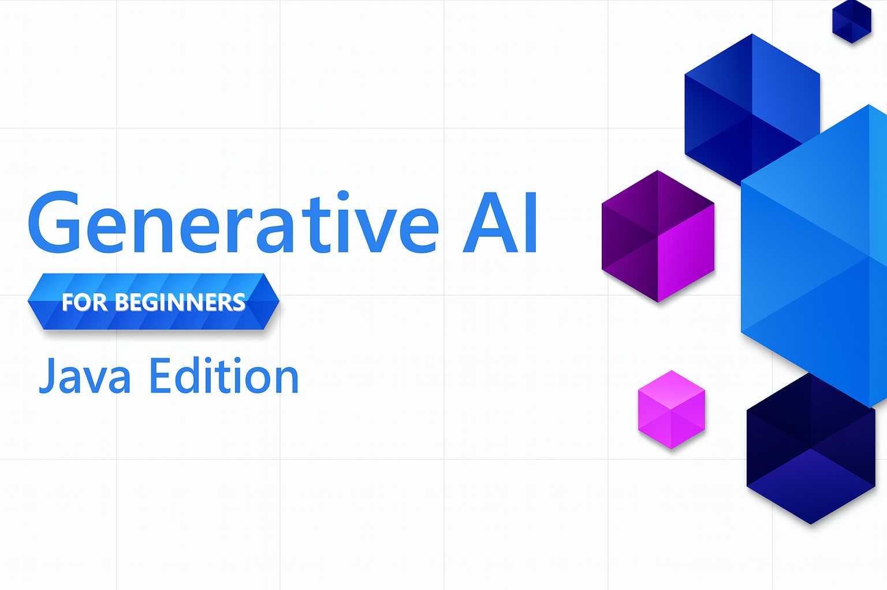

<!--
CO_OP_TRANSLATOR_METADATA:
{
  "original_hash": "a49b35508745c032a0033d914df7901b",
  "translation_date": "2025-07-25T11:44:09+00:00",
  "source_file": "README.md",
  "language_code": "fi"
}
-->
# Generatiivinen AI aloittelijoille - Java-versio

**Aikavaatimukset**: Koko työpaja voidaan suorittaa verkossa ilman paikallista asennusta. Jos haluat ajaa esimerkkejä, ympäristön asennus vie 2 minuuttia, ja esimerkkien tutkiminen kestää 1–3 tuntia riippuen tutkimuksen syvyydestä.

> **Pika-aloitus**

1. Haarauta tämä arkisto GitHub-tilillesi
2. Klikkaa **Code** → **Codespaces**-välilehti → **...** → **New with options...**
3. Käytä oletusasetuksia – tämä valitsee tämän kurssin kehityskontin
4. Klikkaa **Create codespace**
5. Odota noin 2 minuuttia, että ympäristö on valmis
6. Siirry suoraan kohtaan [Luo GitHub Models -token](./02-SetupDevEnvironment/README.md#step-2-create-a-github-personal-access-token)

## Monikielinen tuki

### Tuettu GitHub Actionin kautta (automaattinen ja aina ajan tasalla)

[Ranska](../fr/README.md) | [Espanja](../es/README.md) | [Saksa](../de/README.md) | [Venäjä](../ru/README.md) | [Arabia](../ar/README.md) | [Persia (Farsi)](../fa/README.md) | [Urdu](../ur/README.md) | [Kiina (yksinkertaistettu)](../zh/README.md) | [Kiina (perinteinen, Macao)](../mo/README.md) | [Kiina (perinteinen, Hongkong)](../hk/README.md) | [Kiina (perinteinen, Taiwan)](../tw/README.md) | [Japani](../ja/README.md) | [Korea](../ko/README.md) | [Hindi](../hi/README.md) | [Bengali](../bn/README.md) | [Marathi](../mr/README.md) | [Nepali](../ne/README.md) | [Punjabi (Gurmukhi)](../pa/README.md) | [Portugali (Portugali)](../pt/README.md) | [Portugali (Brasilia)](../br/README.md) | [Italia](../it/README.md) | [Puola](../pl/README.md) | [Turkki](../tr/README.md) | [Kreikka](../el/README.md) | [Thai](../th/README.md) | [Ruotsi](../sv/README.md) | [Tanska](../da/README.md) | [Norja](../no/README.md) | [Suomi](./README.md) | [Hollanti](../nl/README.md) | [Heprea](../he/README.md) | [Vietnam](../vi/README.md) | [Indonesia](../id/README.md) | [Malaiji](../ms/README.md) | [Tagalog (Filipino)](../tl/README.md) | [Swahili](../sw/README.md) | [Unkari](../hu/README.md) | [Tšekki](../cs/README.md) | [Slovakki](../sk/README.md) | [Romania](../ro/README.md) | [Bulgaria](../bg/README.md) | [Serbia (kyrillinen)](../sr/README.md) | [Kroatia](../hr/README.md) | [Sloveeni](../sl/README.md) | [Ukraina](../uk/README.md) | [Burma (Myanmar)](../my/README.md)

## Kurssin rakenne ja oppimispolku

### **Luku 1: Johdatus generatiiviseen tekoälyyn**
- **Peruskäsitteet**: Ymmärrä suuria kielimalleja, tokeneita, upotuksia ja tekoälyn kykyjä
- **Java AI -ekosysteemi**: Katsaus Spring AI:hin ja OpenAI SDK:ihin
- **Model Context Protocol**: Johdatus MCP:hen ja sen rooliin tekoälyagenttien viestinnässä
- **Käytännön sovellukset**: Reaaliaikaisia esimerkkejä, kuten chatbotit ja sisällöntuotanto
- **[→ Aloita luku 1](./01-IntroToGenAI/README.md)**

### **Luku 2: Kehitysympäristön asennus**
- **Monipalveluntarjoajan konfigurointi**: GitHub Models-, Azure OpenAI- ja OpenAI Java SDK -integraatioiden asennus
- **Spring Boot + Spring AI**: Parhaat käytännöt yritystason tekoälysovellusten kehittämiseen
- **GitHub Models**: Ilmainen pääsy tekoälymalleihin prototyyppien ja oppimisen tueksi (ei luottokorttia vaadita)
- **Kehitystyökalut**: Docker-kontit, VS Code ja GitHub Codespaces -konfigurointi
- **[→ Aloita luku 2](./02-SetupDevEnvironment/README.md)**

### **Luku 3: Generatiivisen tekoälyn ydintekniikat**
- **Prompt Engineering**: Tekniikoita optimaalisten tekoälyvastausten saamiseksi
- **Upotukset ja vektorilaskenta**: Semanttisen haun ja samankaltaisuuden tunnistaminen
- **Retrieval-Augmented Generation (RAG)**: Yhdistä tekoäly omiin tietolähteisiisi
- **Funktiokutsut**: Laajenna tekoälyn kykyjä mukautetuilla työkaluilla ja lisäosilla
- **[→ Aloita luku 3](./03-CoreGenerativeAITechniques/README.md)**

### **Luku 4: Käytännön sovellukset ja projektit**
- **Lemmikkitarinageneraattori** (`petstory/`): Luovaa sisällöntuotantoa GitHub Models -malleilla
- **Foundry Local Demo** (`foundrylocal/`): Paikallinen tekoälymallien integrointi OpenAI Java SDK:lla
- **MCP-laskinpalvelu** (`mcp/calculator/`): Perustason Model Context Protocol -toteutus Spring AI:lla
- **[→ Aloita luku 4](./04-PracticalSamples/README.md)**

### **Luku 5: Vastuullinen tekoälyn kehitys**
- **GitHub Models -turvallisuus**: Sisäänrakennettujen sisällönsuodatus- ja turvallisuusmekanismien testaaminen
- **Vastuullisen tekoälyn demo**: Käytännön esimerkki tekoälyn turvallisuussuodattimien toiminnasta
- **Parhaat käytännöt**: Keskeiset ohjeet eettiseen tekoälyn kehittämiseen ja käyttöönottoon
- **[→ Aloita luku 5](./05-ResponsibleGenAI/README.md)**

## Lisäresurssit 

- [AI Agents For Beginners](https://github.com/microsoft/ai-agents-for-beginners)
- [Generatiivinen AI aloittelijoille .NET:llä](https://github.com/microsoft/Generative-AI-for-beginners-dotnet)
- [Generatiivinen AI aloittelijoille JavaScriptillä](https://github.com/microsoft/generative-ai-with-javascript)
- [Generatiivinen AI aloittelijoille](https://github.com/microsoft/generative-ai-for-beginners)
- [ML aloittelijoille](https://aka.ms/ml-beginners)
- [Data Science aloittelijoille](https://aka.ms/datascience-beginners)
- [AI aloittelijoille](https://aka.ms/ai-beginners)
- [Kyberturvallisuus aloittelijoille](https://github.com/microsoft/Security-101)
- [Web-kehitys aloittelijoille](https://aka.ms/webdev-beginners)
- [IoT aloittelijoille](https://aka.ms/iot-beginners)
- [XR-kehitys aloittelijoille](https://github.com/microsoft/xr-development-for-beginners)
- [GitHub Copilotin hallinta tekoälypariohjelmointiin](https://aka.ms/GitHubCopilotAI)
- [GitHub Copilotin hallinta C#/.NET-kehittäjille](https://github.com/microsoft/mastering-github-copilot-for-dotnet-csharp-developers)
- [Valitse oma Copilot-seikkailusi](https://github.com/microsoft/CopilotAdventures)
- [RAG Chat -sovellus Azure AI -palveluilla](https://github.com/Azure-Samples/azure-search-openai-demo-java)

**Vastuuvapauslauseke**:  
Tämä asiakirja on käännetty käyttämällä tekoälypohjaista käännöspalvelua [Co-op Translator](https://github.com/Azure/co-op-translator). Vaikka pyrimme tarkkuuteen, huomioithan, että automaattiset käännökset voivat sisältää virheitä tai epätarkkuuksia. Alkuperäistä asiakirjaa sen alkuperäisellä kielellä tulisi pitää ensisijaisena lähteenä. Kriittisen tiedon osalta suositellaan ammattimaista ihmiskäännöstä. Emme ole vastuussa väärinkäsityksistä tai virhetulkinnoista, jotka johtuvat tämän käännöksen käytöstä.