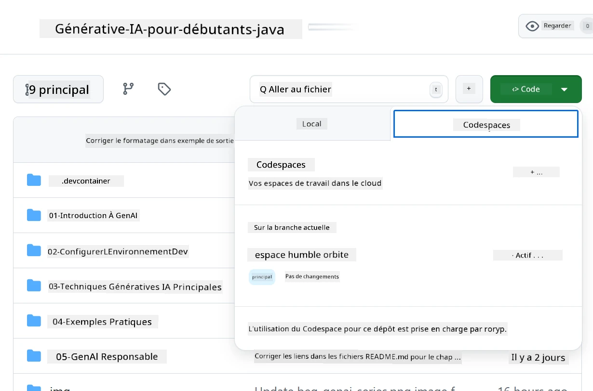
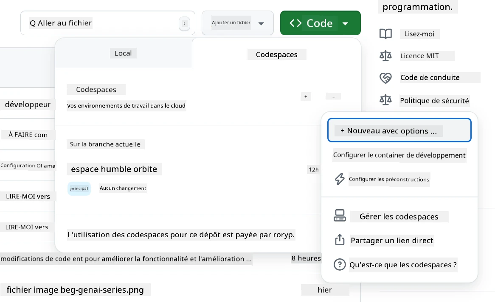
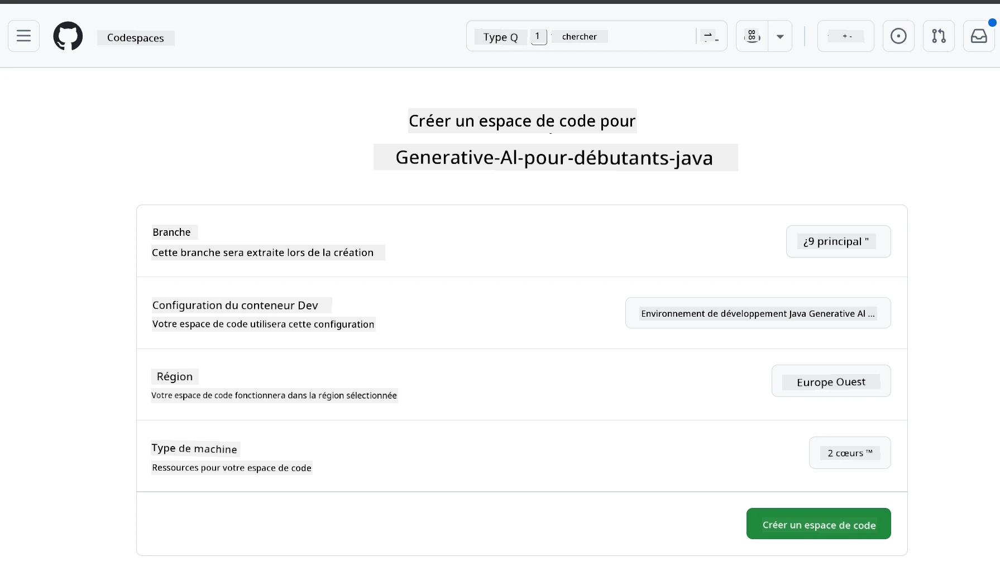
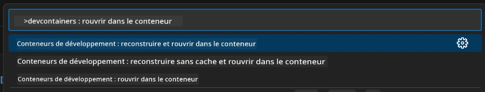
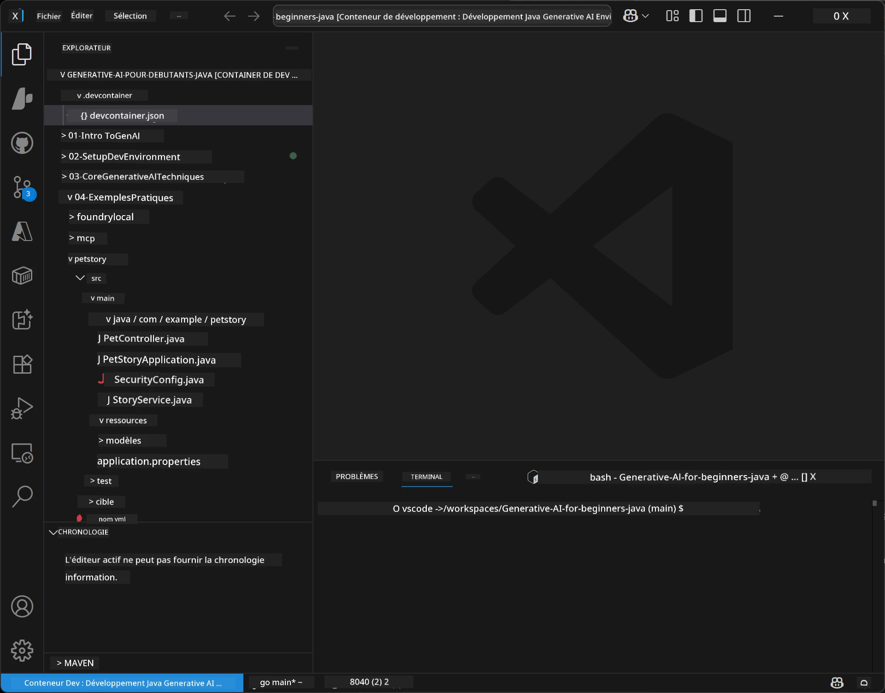
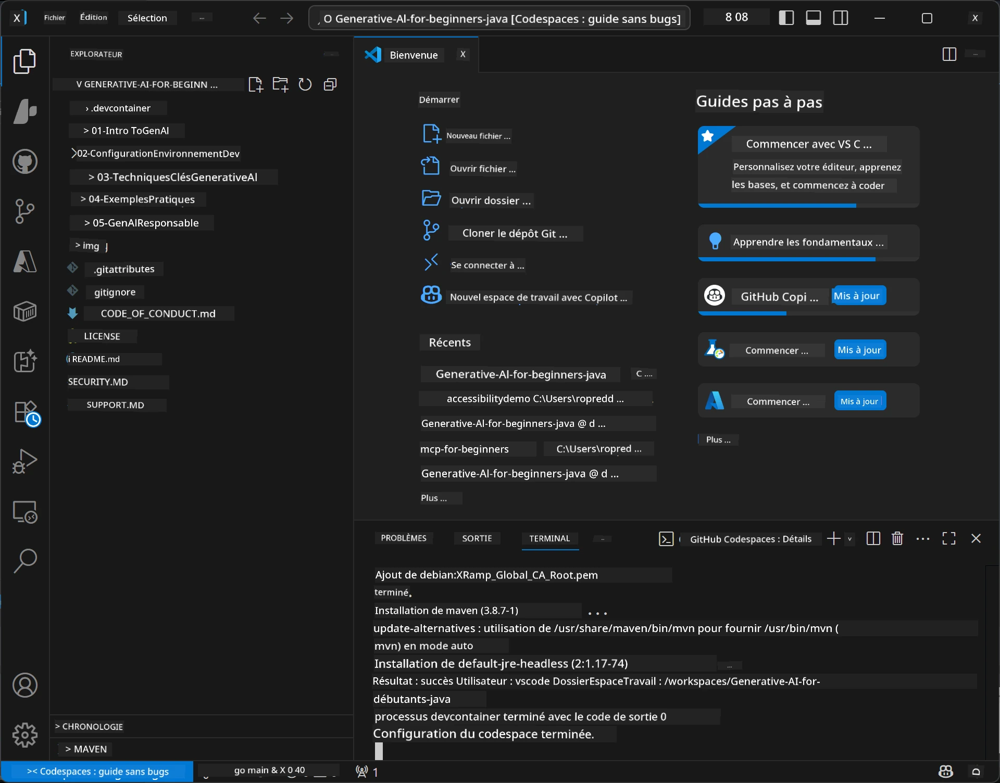

# Configuration de l'environnement de développement pour Generative AI pour Java

> **Démarrage rapide :** Provisionnez vos modèles d'IA sur **Azure AI Foundry** en tant que code avec Bicep + `azd` en quelques minutes — voir le [Guide de configuration Azure AI Foundry](getting-started-azure-openai.md). L'authentification est **sans clé** (Microsoft Entra ID), il n'y a donc pas de clés API à gérer.

## Ce que vous apprendrez

- Configurez un environnement de développement Java pour des applications d'IA
- Choisissez et configurez votre environnement de développement préféré (cloud-first avec Codespaces, conteneur de développement local, ou configuration locale complète)
- Testez votre configuration en vous connectant à un modèle Azure AI Foundry

## Table des matières

- [Ce que vous apprendrez](#ce-que-vous-apprendrez)
- [Introduction](#introduction)
- [Étape 1 : Configurez votre environnement de développement](#étape-1-configurez-votre-environnement-de-développement)
  - [Option A : GitHub Codespaces (recommandé)](#option-a-github-codespaces-recommandé)
  - [Option B : Conteneur de développement local](#option-b-conteneur-de-développement-local)
  - [Option C : Utilisez votre installation locale existante](#option-c-utilisez-votre-installation-locale-existante)
- [Étape 2 : Provisionnez Azure AI Foundry](#étape-2-provisionnez-azure-ai-foundry)
- [Étape 3 : Testez votre configuration](#étape-3-testez-votre-configuration)
- [Dépannage](#dépannage)
- [Résumé](#résumé)
- [Prochaines étapes](#prochaines-étapes)

## Introduction

Ce chapitre vous guidera dans la configuration d'un environnement de développement. Nous utiliserons **Azure AI Foundry** pour les modèles tout au long de ce cours. Vous provisionnez les modèles en tant que code avec Bicep et l'interface de ligne de commande Azure Developer (`azd`), puis vous vous connectez avec une **authentification sans clé** (Microsoft Entra ID) — aucune clé API à copier ou à divulguer.

**Aucune configuration locale requise !** Vous pouvez utiliser GitHub Codespaces, qui fournit un environnement de développement complet dans votre navigateur, et provisionner Foundry depuis là.

Nous utilisons **Azure AI Foundry** pour ce cours car il est :
- **Provisionné en tant que code** — une commande `azd up` déploie le compte et les déploiements de modèles
- **Sans clé** — authentification via votre connexion Azure ou une identité managée
- **Prêt pour la production** — le même code s’exécute localement et dans Azure
- **Flexible** — changez de modèle en modifiant un nom de déploiement, pas votre code

> **Note** : Les déploiements Azure AI Foundry sont facturés à la consommation par token (paiement à l'usage). Consultez le [guide de configuration Azure AI Foundry](getting-started-azure-openai.md) pour les détails sur le provisioning, les régions et les coûts.


## Étape 1 : Configurez votre environnement de développement

<a name="quick-start-cloud"></a>

Nous avons créé un conteneur de développement préconfiguré pour minimiser le temps de configuration et garantir que vous disposez de tous les outils nécessaires pour ce cours Generative AI pour Java. Choisissez votre approche de développement préférée :

### Options de configuration de l'environnement :

#### Option A : GitHub Codespaces (recommandé)

**Commencez à coder en 2 minutes - aucune configuration locale requise !**

1. Forkez ce dépôt dans votre compte GitHub
   > **Note** : Si vous souhaitez modifier la configuration basique, veuillez consulter la [Configuration du conteneur de développement](../../../.devcontainer/devcontainer.json)
2. Cliquez sur **Code** → onglet **Codespaces** → **...** → **Nouveau avec options...**
3. Utilisez les paramètres par défaut – cela sélectionnera la **configuration du conteneur de développement** : **Generative AI Java Development Environment** conteneur dev personnalisé créé pour ce cours
4. Cliquez sur **Créer un codespace**
5. Patientez environ 2 minutes que l'environnement soit prêt
6. Passez à [Étape 2 : Provisionnez Azure AI Foundry](#étape-2-provisionnez-azure-ai-foundry)








> **Avantages de Codespaces** :
> - Aucune installation locale requise
> - Fonctionne sur tout appareil disposant d'un navigateur
> - Pré-configuré avec tous les outils et dépendances
> - 60 heures gratuites par mois pour les comptes personnels
> - Environnement cohérent pour tous les apprenants

#### Option B : Conteneur de développement local

**Pour les développeurs qui préfèrent le développement local avec Docker**

1. Forkez et clonez ce dépôt sur votre machine locale
   > **Note** : Si vous souhaitez modifier la configuration basique, veuillez consulter la [Configuration du conteneur de développement](../../../.devcontainer/devcontainer.json)
2. Installez [Docker Desktop](https://www.docker.com/products/docker-desktop/) et [VS Code](https://code.visualstudio.com/)
3. Installez l’[extension Dev Containers](https://marketplace.visualstudio.com/items?itemName=ms-vscode-remote.remote-containers) dans VS Code
4. Ouvrez le dossier du dépôt dans VS Code
5. Quand il vous sera demandé, cliquez sur **Réouvrir dans le conteneur** (ou utilisez `Ctrl+Maj+P` → "Dev Containers : Réouvrir dans le conteneur")
6. Attendez que le conteneur se construise et démarre
7. Passez à [Étape 2 : Provisionnez Azure AI Foundry](#étape-2-provisionnez-azure-ai-foundry)





#### Option C : Utilisez votre installation locale existante

**Pour les développeurs disposant d'environnements Java existants**

Prérequis :
- [Java 21+](https://www.oracle.com/java/technologies/javase/jdk21-archive-downloads.html) 
- [Maven 3.9+](https://maven.apache.org/download.cgi)
- [VS Code](https://code.visualstudio.com) ou votre IDE préféré

Étapes :
1. Clonez ce dépôt sur votre machine locale
2. Ouvrez le projet dans votre IDE
3. Passez à [Étape 2 : Provisionnez Azure AI Foundry](#étape-2-provisionnez-azure-ai-foundry)

> **Astuce pro** : Si votre machine est peu puissante mais que vous souhaitez VS Code en local, utilisez GitHub Codespaces ! Vous pouvez connecter votre VS Code local à un Codespace hébergé dans le cloud pour profiter du meilleur des deux mondes.




## Étape 2 : Provisionnez Azure AI Foundry

Déployez les modèles d’IA du cours sur Azure AI Foundry en tant que code. Depuis la racine du dépôt :

```bash
cd 02-SetupDevEnvironment
azd auth login
az login
azd up
```

`azd` vous invite à nommer un environnement, choisir un abonnement et une région, provisionne un compte Azure AI Foundry avec les déploiements `gpt-5.6-luna` et `text-embedding-3-small`, et écrit le point de terminaison dans le `.env` de l’exemple — le tout avec une authentification **sans clé** (pas de clés API).

> **Guide complet :** Consultez le [Guide de configuration Azure AI Foundry](getting-started-azure-openai.md) pour les prérequis, une alternative manuelle (portail), les conseils sur les régions, et les notes sur les coûts/nettoyage.

## Étape 3 : Testez votre configuration

Une fois vos modèles Foundry provisionnés, testez la connexion avec l'application exemple dans [`02-SetupDevEnvironment/examples/basic-chat-azure`](../../../02-SetupDevEnvironment/examples/basic-chat-azure).

1. Ouvrez le terminal dans votre environnement de développement.
2. Naviguez vers l’exemple :
   ```bash
   cd 02-SetupDevEnvironment/examples/basic-chat-azure
   ```
3. Assurez-vous d’être connecté (l'authentification sans clé nécessite un jeton) :
   ```bash
   az login
   ```
   > Si vous avez lancé `azd up`, le fichier `.env` avec votre point de terminaison a déjà été écrit pour vous.
4. Lancez l’application :
   ```bash
   mvn clean spring-boot:run
   ```

Vous devriez voir une réponse du modèle `gpt-5.6-luna`.

### Comprendre le code exemple

L’[exemple basic-chat](./examples/basic-chat-azure/README.md) utilise **Spring Boot 4.1.1** et **Spring AI 2.0.1**. Le `ChatClient` de Spring AI repose sur le SDK Java officiel OpenAI, se connectant au point de terminaison Azure OpenAI **v1** avec une authentification sans clé.

**Ce que fait ce code :**
- **Se connecte** à Azure AI Foundry en utilisant votre connexion Azure (Microsoft Entra ID) — sans clé API
- **Envoie** une invitation au modèle `gpt-5.6-luna`
- **Reçoit** et affiche la réponse de l'IA
- **Valide** que votre configuration fonctionne correctement

**Dépendances clés** (extrait de [pom.xml](../../../02-SetupDevEnvironment/examples/basic-chat-azure/pom.xml)) :
```xml
<dependency>
    <groupId>org.springframework.ai</groupId>
    <artifactId>spring-ai-starter-model-openai</artifactId>
</dependency>
<dependency>
    <groupId>com.openai</groupId>
    <artifactId>openai-java</artifactId>
</dependency>
<dependency>
    <groupId>com.azure</groupId>
    <artifactId>azure-identity</artifactId>
    <version>${azure-identity.version}</version>
</dependency>
```

Le POM gère OpenAI Java **4.63.1** et définit explicitement Azure Identity **1.18.6**. Spring AI 2 a supprimé le starter spécifique à Azure ; Azure Identity est toujours nécessaire pour le bean de credentials.

**Configuration** ([application.yml](../../../02-SetupDevEnvironment/examples/basic-chat-azure/src/main/resources/application.yml)) :
```yaml
spring:
  ai:
    openai:
      base-url: ${AZURE_OPENAI_ENDPOINT}
      microsoft-foundry: true
      chat:
        model: ${AZURE_OPENAI_DEPLOYMENT:gpt-5.6-luna}
        reasoning-effort: none
        max-completion-tokens: 500
```

L'authentification sans clé est configurée explicitement dans [BasicChatApplication.java](../../../02-SetupDevEnvironment/examples/basic-chat-azure/src/main/java/com/example/BasicChatApplication.java), et non déduite d'une clé API absente. Son credential bearer utilise `DefaultAzureCredential` avec la portée `https://ai.azure.com/.default`, et son `OpenAIClient` cible `/openai/v1`. L'application fournit ce client au modèle de discussion de Spring AI, donc une variable globale `OPENAI_API_KEY` ne peut pas outrepasser l'authentification Azure.

Les paramètres du chat sont directement sous `spring.ai.openai.chat`, sans bloc `options`. La leçon garde les Chat Completions avec `reasoning-effort: none` et un plafond de complétion à 500 tokens ; elle ne définit pas la `temperature` ou `max-tokens`. Voir la [référence de configuration de l’exemple](./examples/basic-chat-azure/README.md#spring-configuration) pour le choix de l’API et les conseils sur l’appel des outils.

## Résumé

Après avoir complété les étapes ci-dessus, vous aurez :

- Provisionné les modèles Azure AI Foundry en tant que code avec Bicep + `azd`
- Votre environnement de développement Java opérationnel (que ce soit Codespaces, conteneurs de dev ou local)
- Connecté à Azure AI Foundry avec une authentification sans clé (Microsoft Entra ID) — pas de clés API
- Testé que tout fonctionne avec un exemple simple qui dialogue avec votre modèle

## Prochaines étapes

[Chapitre 3 : Techniques essentielles de Generative AI](../03-CoreGenerativeAITechniques/README.md)

## Dépannage

Vous rencontrez des problèmes ? Voici les problèmes courants et leurs solutions :

- **Authentification échouée (401/403) ?** 
  - Exécutez `az login` — l'authentification est sans clé, vous devez être connecté
  - Vérifiez que votre compte a le rôle **Cognitive Services OpenAI User** sur la ressource
  - Si vous venez de provisionner, attendez une minute que l'attribution du rôle se propage

- **Maven non trouvé ?** 
  - Si vous utilisez des conteneurs de dev/Codespaces, Maven devrait être préinstallé
  - Pour une configuration locale, assurez-vous que Java 21+ et Maven 3.9+ sont installés
  - Essayez `mvn --version` pour vérifier l'installation

- **`azd` non trouvé ou échec du provisioning ?** 
  - Installez l’[Azure Developer CLI](https://aka.ms/azure-dev/install) et exécutez `azd auth login`
  - Choisissez une région où `gpt-5.6-luna` et `text-embedding-3-small` sont disponibles (ex. `eastus2`), avec un quota suffisant dans l’abonnement sélectionné
  - Consultez le [guide de configuration Azure AI Foundry](getting-started-azure-openai.md) pour plus de détails

- **Le conteneur de dev ne démarre pas ?** 
  - Assurez-vous que Docker Desktop est en fonctionnement (pour le développement local)
  - Essayez de reconstruire le conteneur : `Ctrl+Maj+P` → "Dev Containers : Rebuild Container"

- **Erreurs de compilation de l’application ?**
  - Assurez-vous d’être dans le bon répertoire : `02-SetupDevEnvironment/examples/basic-chat-azure`
  - Essayez de nettoyer et reconstruire : `mvn clean compile`

> **Besoin d'aide ?** : Vous avez toujours des problèmes ? Ouvrez un ticket dans le dépôt et nous vous aiderons.

---

<!-- CO-OP TRANSLATOR DISCLAIMER START -->
**Avertissement** :
Ce document a été traduit à l'aide du service de traduction automatique [Co-op Translator](https://github.com/Azure/co-op-translator). Bien que nous nous efforçions d'assurer l'exactitude, veuillez noter que les traductions automatisées peuvent contenir des erreurs ou des inexactitudes. Le document original dans sa langue native doit être considéré comme la source faisant autorité. Pour les informations critiques, il est recommandé de recourir à une traduction professionnelle réalisée par un humain. Nous ne saurions être tenus responsables des malentendus ou erreurs d'interprétation découlant de l'utilisation de cette traduction.
<!-- CO-OP TRANSLATOR DISCLAIMER END -->