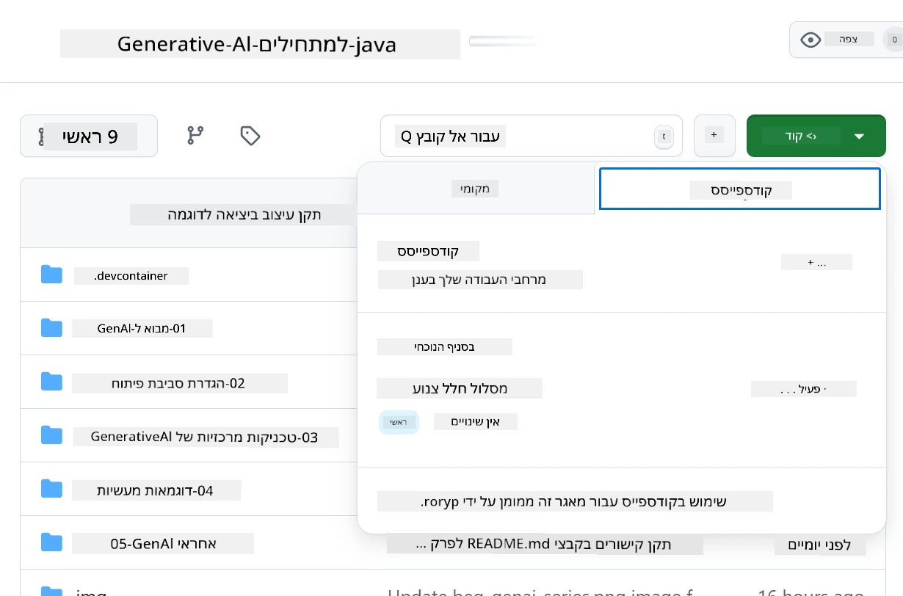
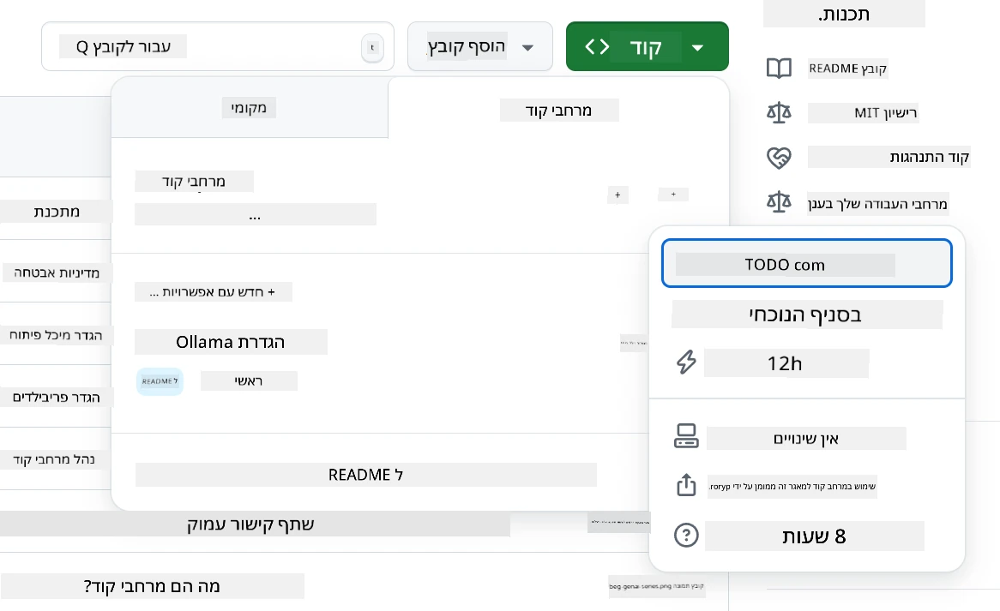
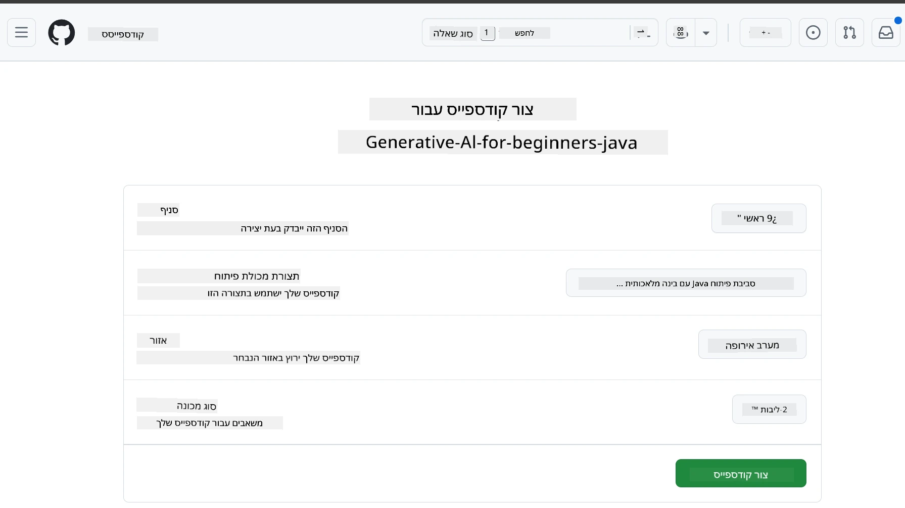
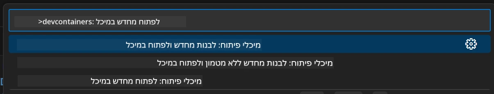
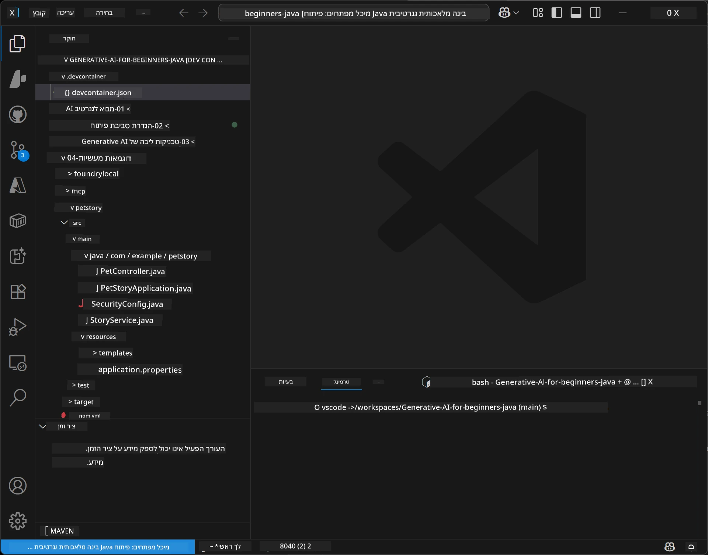
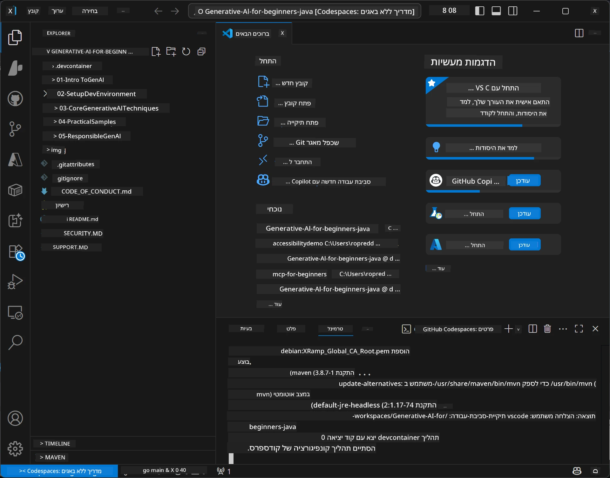

# הגדרת סביבת הפיתוח עבור AI גנרטיבי לג'אווה

> **התחלה מהירה:** פרוס את מודלי ה-AI שלך ב-**Azure AI Foundry** כקוד עם Bicep + `azd` בכמה דקות — ראה את [מדריך ההגדרה של Azure AI Foundry](getting-started-azure-openai.md). האימות הוא **ללא מפתח** (Microsoft Entra ID), כך שאין מפתחות API לטפל בהם.

## מה תלמד

- הגדרת סביבת פיתוח ג'אווה ליישומי AI
- בחירת והגדרת סביבת הפיתוח המועדפת עליך (ראשוני בענן עם Codespaces, מיכל פיתוח מקומי, או הגדרה מקומית מלאה)
- בדיקת ההגדרה על ידי חיבור למודל Azure AI Foundry

## תוכן

- [מה תלמד](#מה-תלמד)
- [הקדמה](#הקדמה)
- [שלב 1: הגדר את סביבת הפיתוח שלך](#שלב-1-הגדר-את-סביבת-הפיתוח-שלך)
  - [אפשרות א: GitHub Codespaces (מומלץ)](#אפשרות-א-github-codespaces-מומלץ)
  - [אפשרות ב: מיכל פיתוח מקומי](#אפשרות-ב-מיכל-פיתוח-מקומי)
  - [אפשרות ג: השתמש בהתקנה המקומית הקיימת שלך](#אפשרות-ג-השתמש-בהתקנה-המקומית-הקיימת-שלך)
- [שלב 2: פרוס את Azure AI Foundry](#שלב-2-פרוס-את-azure-ai-foundry)
- [שלב 3: בדוק את ההגדרה שלך](#שלב-3-בדוק-את-ההגדרה-שלך)
- [פתרון בעיות](#פתרון-בעיות)
- [סיכום](#סיכום)
- [השלבים הבאים](#השלבים-הבאים)

## הקדמה

פרק זה ינחה אותך דרך הקמת סביבת פיתוח. נשתמש ב-**Azure AI Foundry** עבור המודלים לאורך הקורס. אתה מפרוס את המודלים כקוד עם Bicep ו-Azure Developer CLI (`azd`), ואז מתחבר עם **אימות ללא מפתח** (Microsoft Entra ID) — אין מפתחות API להעתקה או דליפה.

**אין צורך בהתקנה מקומית!** אתה יכול להשתמש ב-GitHub Codespaces, המספקת סביבת פיתוח מלאה בדפדפן, ולפרוס Foundry משם.

אנו משתמשים ב-**Azure AI Foundry** לקורס זה כי הוא:
- **נפרס כקוד** — פקודת `azd up` אחת מפרסת את החשבון ופריסות המודלים
- **ללא מפתח** — אימות עם הכניסה שלך ל-Azure או זהות מנוהלת
- **מוכן לייצור** — הקוד הזהה רץ באופן מקומי וב-Azure
- **גמיש** — החלף מודלים על ידי שינוי שם פריסה, לא את הקוד שלך

> **הערה**: פריסות Azure AI Foundry מחויבות לפי אסימון (תשלום לפי שימוש). ראה את [מדריך ההגדרה של Azure AI Foundry](getting-started-azure-openai.md) לפרטים על הפריסה, האזור והעלויות.


## שלב 1: הגדר את סביבת הפיתוח שלך

<a name="quick-start-cloud"></a>

יצרנו מיכל פיתוח מוכוון מראש כדי למזער את זמן ההגדרה ולהבטיח שיש לך את כל הכלים הדרושים לקורס Generative AI עבור Java. בחר את גישת הפיתוח המועדפת עליך:

### אפשרויות הגדרת הסביבה:

#### אפשרות א: GitHub Codespaces (מומלץ)

**התחל לכתוב קוד תוך 2 דקות - אין צורך בהתקנה מקומית!**

1. בצע Fork למאגר זה לחשבון GitHub שלך
   > **הערה**: אם ברצונך לערוך את התצורה הבסיסית, עיין ב-[Dev Container Configuration](../../../.devcontainer/devcontainer.json)
2. לחץ על **Code** → כרטיסיית **Codespaces** → **...** → **New with options...**
3. השתמש כברירות מחדל – זה יבחר את **תצורת מיכל הפיתוח**: **Generative AI Java Development Environment** מיכל פיתוח מותאם שנוצר עבור קורס זה
4. לחץ על **Create codespace**
5. המתן כ-2 דקות לסיום ההכנות של הסביבה
6. המשך ל-[שלב 2: פרוס את Azure AI Foundry](#שלב-2-פרוס-את-azure-ai-foundry)








> **יתרונות Codespaces**:
> - אין צורך בהתקנה מקומית
> - עובד על כל מכשיר עם דפדפן
> - מוגדר מראש עם כל הכלים והתלויות
> - 60 שעות חינם לחודש לחשבונות אישיים
> - סביבה עקבית לכל המשתמשים

#### אפשרות ב: מיכל פיתוח מקומי

**למפתחים שמעדיפים פיתוח מקומי עם Docker**

1. בצע Fork ו-Cloning של מאגר זה למכונתך המקומית
   > **הערה**: אם ברצונך לערוך את התצורה הבסיסית, עיין ב-[Dev Container Configuration](../../../.devcontainer/devcontainer.json)
2. התקן את [Docker Desktop](https://www.docker.com/products/docker-desktop/) ואת [VS Code](https://code.visualstudio.com/)
3. התקן את [תוסף מיכלי הפיתוח](https://marketplace.visualstudio.com/items?itemName=ms-vscode-remote.remote-containers) ב-VS Code
4. פתח את תיקיית המאגר ב-VS Code
5. כשמתבקש, לחץ על **Reopen in Container** (או השתמש ב-`Ctrl+Shift+P` → "Dev Containers: Reopen in Container")
6. המתן לבניית המיכל ותחילתו
7. המשך ל-[שלב 2: פרוס את Azure AI Foundry](#שלב-2-פרוס-את-azure-ai-foundry)





#### אפשרות ג: השתמש בהתקנה המקומית הקיימת שלך

**למפתחים עם סביבות Java קיימות**

דרישות מוקדמות:
- [Java 21+](https://www.oracle.com/java/technologies/javase/jdk21-archive-downloads.html) 
- [Maven 3.9+](https://maven.apache.org/download.cgi)
- [VS Code](https://code.visualstudio.com) או ה-IDE המועדף עליך

שלבים:
1. בצע Cloning של מאגר זה למכונתך המקומית
2. פתח את הפרויקט ב-IDE שלך
3. המשך ל-[שלב 2: פרוס את Azure AI Foundry](#שלב-2-פרוס-את-azure-ai-foundry)

> **טיפ מומחה**: אם יש לך מחשב עם מפרט נמוך אך רוצה להשתמש ב-VS Code מקומי, השתמש ב-GitHub Codespaces! תוכל להתחבר ל-Codespace בענן מ-VS Code המקומי שלך ולקבל את הטוב משני העולמות.




## שלב 2: פרוס את Azure AI Foundry

פרוס את מודלי ה-AI של הקורס ב-Azure AI Foundry כקוד. משורש המאגר:

```bash
cd 02-SetupDevEnvironment
azd auth login
az login
azd up
```

`azd` יבקש שם סביבה, מנוי ואזור, יפרוס חשבון Azure AI Foundry עם פריסות `gpt-5.6-luna` ו-`text-embedding-3-small`, ויכתוב את נקודת הקצה לקובץ `.env` של הדוגמה - כל זה עם אימות **ללא מפתח** (ללא מפתחות API).

> **מדריך מלא:** ראה את [מדריך ההגדרה של Azure AI Foundry](getting-started-azure-openai.md) לפרה-רקויזיטים, אלטרנטיבה ידנית (פורטאל), הנחיות אזור, והערות על עלות וניקוי.

## שלב 3: בדוק את ההגדרה שלך

לאחר שהמודלים שלך ב-Foundry פרוסים, בדוק את החיבור עם אפליקציית הדוגמה ב-[`02-SetupDevEnvironment/examples/basic-chat-azure`](../../../02-SetupDevEnvironment/examples/basic-chat-azure).

1. פתח את הטרמינל בסביבת הפיתוח שלך.
2. נווט לדוגמה:
   ```bash
   cd 02-SetupDevEnvironment/examples/basic-chat-azure
   ```
3. ודא שאתה מחובר (אימות ללא מפתח דורש אסימון):
   ```bash
   az login
   ```
   > אם הרצת `azd up`, קובץ ה-`.env` עם נקודת הקצה שלך כבר נכתב עבורך.
4. הרץ את האפליקציה:
   ```bash
   mvn clean spring-boot:run
   ```

אמור להופיע תגובה ממודל `gpt-5.6-luna`.

### הבנת קוד הדוגמה

[דוגמת basic-chat](./examples/basic-chat-azure/README.md) משתמשת ב-**Spring Boot 4.1.1** ו-**Spring AI 2.0.1**. `ChatClient` של Spring AI מגובה ב-SDK הרשמי של OpenAI לג'אווה, ומתחבר לנקודת הקצה של Azure OpenAI **v1** עם אימות ללא מפתח.

**מה הקוד עושה:**
- **מתחבר** ל-Azure AI Foundry באמצעות הכניסה שלך ל-Azure (Microsoft Entra ID) — ללא מפתח API
- **שולח** בקשה למודל `gpt-5.6-luna`
- **מקבל** ומציג את תגובת ה-AI
- **מאמת** שההגדרה שלך עובדת כראוי

**תלויות עיקריות** (קטע מתוך [pom.xml](../../../02-SetupDevEnvironment/examples/basic-chat-azure/pom.xml)):
```xml
<dependency>
    <groupId>org.springframework.ai</groupId>
    <artifactId>spring-ai-starter-model-openai</artifactId>
</dependency>
<dependency>
    <groupId>com.openai</groupId>
    <artifactId>openai-java</artifactId>
</dependency>
<dependency>
    <groupId>com.azure</groupId>
    <artifactId>azure-identity</artifactId>
    <version>${azure-identity.version}</version>
</dependency>
```

ה-POM מנהל את OpenAI Java **4.63.1** ומגדיר במפורש את Azure Identity **1.18.6**. Spring AI 2 הסיר את ה-starter הספציפי ל-Azure; Azure Identity עדיין דרוש ל-bean של האישורים.

**תצורה** ([application.yml](../../../02-SetupDevEnvironment/examples/basic-chat-azure/src/main/resources/application.yml)):
```yaml
spring:
  ai:
    openai:
      base-url: ${AZURE_OPENAI_ENDPOINT}
      microsoft-foundry: true
      chat:
        model: ${AZURE_OPENAI_DEPLOYMENT:gpt-5.6-luna}
        reasoning-effort: none
        max-completion-tokens: 500
```

אימות ללא מפתח מוגדר במפורש ב-[BasicChatApplication.java](../../../02-SetupDevEnvironment/examples/basic-chat-azure/src/main/java/com/example/BasicChatApplication.java), ולא נשען על מפתח API חסר. אישור הנושא שלו משתמש ב-`DefaultAzureCredential` עם תחום `https://ai.azure.com/.default`, ו-`OpenAIClient` שלו מיועד ל-`/openai/v1`. האפליקציה מספקת את הלקוח הזה למודל הצ'אט של Spring AI, כך ש-`OPENAI_API_KEY` גלובלי לא יכול לעקוף את אימות Azure.

הגדרות הצ'אט ישירות תחת `spring.ai.openai.chat`, ללא בלוק `options`. השיעור שומר על Chat Completions עם `reasoning-effort: none` ומגבלת השלמה של 500 אסימונים; אינו מגדיר `temperature` או `max-tokens`. ראה את [הפניה לתצורת הדוגמה](./examples/basic-chat-azure/README.md#spring-configuration) לבחירת API והנחיות קריאת כלים.

## סיכום

לאחר השלמת השלבים שלעיל, יהיה לך:

- מודלים של Azure AI Foundry פרוסים כקוד עם Bicep + `azd`
- סביבת פיתוח Java שלך פועלת (בין אם Codespaces, מיכלי פיתוח, או מקומית)
- מחובר ל-Azure AI Foundry עם אימות ללא מפתח (Microsoft Entra ID) — ללא מפתחות API
- בדקת שכל זה עובד עם דוגמה פשוטה שמדברת עם המודל שלך

## השלבים הבאים

[פרק 3: טכניקות מרכזיות ב-AI גנרטיבי](../03-CoreGenerativeAITechniques/README.md)

## פתרון בעיות

נתקל בבעיות? הנה בעיות נפוצות ופתרונות:

- **כישלון אימות (401/403)?** 
  - הפעל `az login` — האימות הוא ללא מפתח, לכן עליך להיכנס
  - וודא שלחשבון שלך יש תפקיד **Cognitive Services OpenAI User** במשאב
  - אם פרסת זה עתה, המתן דקה שהקצאת התפקיד תתפשט

- **Maven לא נמצא?** 
  - אם משתמשים במיכלי פיתוח/Codespaces, Maven אמור להיות מותקן מראש
  - עבור הגדרה מקומית, ודא ש-Java 21+ ו-Maven 3.9+ מותקנים
  - נסה `mvn --version` לאימות ההתקנה

- **`azd` לא נמצא או הפריסה נכשלה?** 
  - התקן את [Azure Developer CLI](https://aka.ms/azure-dev/install) והרץ `azd auth login`
  - בחר אזור שבו זמינים `gpt-5.6-luna` ו-`text-embedding-3-small` (למשל `eastus2`), עם הקצאה מספקת במנוי שבחרת
  - ראה את [מדריך ההגדרה של Azure AI Foundry](getting-started-azure-openai.md) לפרטים

- **המיכל לא מתחיל?** 
  - ודא ש-Docker Desktop פועל (עבור פיתוח מקומי)
  - נסה לבנות מחדש את המיכל: `Ctrl+Shift+P` → "Dev Containers: Rebuild Container"

- **שגיאות הקומפילציה של האפליקציה?**
  - ודא שאתה בתיקייה הנכונה: `02-SetupDevEnvironment/examples/basic-chat-azure`
  - נסה לנקות ולבנות מחדש: `mvn clean compile`

> **צריך עזרה?**: עדיין יש בעיות? פתח נושא במאגר ונעזור לך.

---

<!-- CO-OP TRANSLATOR DISCLAIMER START -->
**כתב ויתור**:
מסמך זה תורגם באמצעות שירות תרגום אוטומטי [Co-op Translator](https://github.com/Azure/co-op-translator). למרות שאנו שואפים לדיוק, יש לקחת בחשבון שתרגומים אוטומטיים עלולים להכיל שגיאות או אי-דיוקים. יש להחשיב את המסמך המקורי בשפתו הטבעית כמקור הסמכות. למידע קריטי מומלץ להשתמש בתרגום מקצועי על ידי מתרגם אדם. אנו לא אחראים לכל אי-הבנה או פירוש שגוי הנובע מהשימוש בתרגום זה.
<!-- CO-OP TRANSLATOR DISCLAIMER END -->