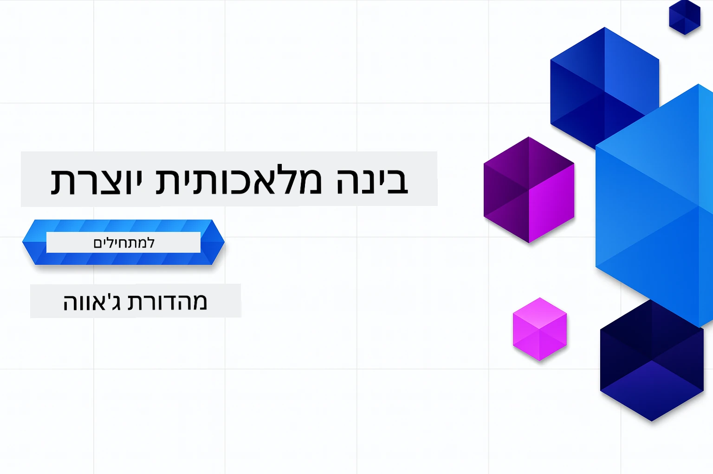

# AI גנרטיבי למתחילים - מהדורת ג'אווה
[](https://discord.gg/nTYy5BXMWG)



**התחייבות זמן**: כל הסדנה ניתנת להשלמה אונליין ללא צורך בהתקנה מקומית. הגדרת הסביבה אורכת 2 דקות, ולחקירת הדוגמאות דרושות 1-3 שעות בהתאם לעומק החקירה.

> **התחלה מהירה** 

1. בצע Fork לריפוזיטורי זה לחשבון הגיטהאב שלך
2. לחץ על **Code** → לשונית **Codespaces** → **...** → **New with options...**
3. השתמש בהגדרות ברירת המחדל – פעולה זו תבחר את מיכל הפיתוח שנוצר עבור הקורס
4. לחץ על **Create codespace**
5. המתן כ-2 דקות עד שהסביבה תהיה מוכנה
6. קפוץ ישר ל-[פרק 2: הקמת Azure AI Foundry](./02-SetupDevEnvironment/README.md#step-2-provision-azure-ai-foundry)

## תמיכה רב-שפתית

### נתמך באמצעות GitHub Action (אוטומטי ותמיד מעודכן)

<!-- CO-OP TRANSLATOR LANGUAGES TABLE START -->
[ערבית](../ar/README.md) | [בנגלית](../bn/README.md) | [בולגרית](../bg/README.md) | [בורמזית (מיאנמר)](../my/README.md) | [סינית (מפושטת)](../zh-CN/README.md) | [סינית (מסורתית, הונג קונג)](../zh-HK/README.md) | [סינית (מסורתית, מקאו)](../zh-MO/README.md) | [סינית (מסורתית, טאיוואן)](../zh-TW/README.md) | [קרואטית](../hr/README.md) | [צ'כית](../cs/README.md) | [דנית](../da/README.md) | [הולנדית](../nl/README.md) | [אסטונית](../et/README.md) | [פינית](../fi/README.md) | [צרפתית](../fr/README.md) | [גרמנית](../de/README.md) | [יוונית](../el/README.md) | [עברית](./README.md) | [הינדית](../hi/README.md) | [הונגרית](../hu/README.md) | [אינדונזית](../id/README.md) | [איטלקית](../it/README.md) | [יפנית](../ja/README.md) | [קאנדה](../kn/README.md) | [חמרית](../km/README.md) | [קוריאנית](../ko/README.md) | [ליטאית](../lt/README.md) | [מלזית](../ms/README.md) | [מאללאיאלם](../ml/README.md) | [מראטי](../mr/README.md) | [נפאלית](../ne/README.md) | [ניגריאנית פידג'ין](../pcm/README.md) | [נורווגית](../no/README.md) | [פרסית (פארסי)](../fa/README.md) | [פולנית](../pl/README.md) | [פורטוגזית (ברזיל)](../pt-BR/README.md) | [פורטוגזית (פורטוגל)](../pt-PT/README.md) | [פונג'אבית (גורמוכי)](../pa/README.md) | [רומנית](../ro/README.md) | [רוסית](../ru/README.md) | [סרבית (קירילית)](../sr/README.md) | [סלובקית](../sk/README.md) | [סלובנית](../sl/README.md) | [ספרדית](../es/README.md) | [סוואהילי](../sw/README.md) | [שוודית](../sv/README.md) | [טגאלוג (פיליפינית)](../tl/README.md) | [טמילית](../ta/README.md) | [טלוגו](../te/README.md) | [תאית](../th/README.md) | [טורקית](../tr/README.md) | [אוקראינית](../uk/README.md) | [אורדו](../ur/README.md) | [וייטנאמית](../vi/README.md)

> **מעוניין לשכפל מקומית?**
>
> ריפוזיטורי זה כולל מעל 50 תרגומים לשפות המגדילים משמעותית את גודל ההורדה. לשכפול ללא התרגומים, השתמש ב-sparse checkout:
>
> **Bash / macOS / Linux:**
> ```bash
> git clone --filter=blob:none --sparse https://github.com/microsoft/Generative-AI-for-beginners-java.git
> cd Generative-AI-for-beginners-java
> git sparse-checkout set --no-cone '/*' '!translations' '!translated_images'
> ```
>
> **CMD (Windows):**
> ```cmd
> git clone --filter=blob:none --sparse https://github.com/microsoft/Generative-AI-for-beginners-java.git
> cd Generative-AI-for-beginners-java
> git sparse-checkout set --no-cone "/*" "!translations" "!translated_images"
> ```
>
> זה נותן לך את כל מה שדרוש כדי להשלים את הקורס עם הורדה מהירה הרבה יותר.
<!-- CO-OP TRANSLATOR LANGUAGES TABLE END -->

## מבנה הקורס ודרך הלמידה

### **פרק 1: מבוא ל-AI גנרטיבי**
- **מושגים מרכזיים**: הבנת מודלים לשוניים גדולים, טוקנים, אמבדינגים, ויכולות AI
- **אקוסיסטם ג'אווה AI**: סקירה של Spring AI ו-SDKs של OpenAI
- **פרוטוקול הקשר מודל (MCP)**: מבוא ל-MCP ותפקידו בתקשורת סוכני AI
- **יישומים מעשיים**: תרחישים מהעולם האמיתי, כולל צ'אטבוטים ויצירת תוכן
- **[→ התחלת פרק 1](./01-IntroToGenAI/README.md)**

### **פרק 2: הקמת סביבת פיתוח**
- **Azure AI Foundry**: הקמת שיחות GPT-5.6 Luna ואמבדינגים טקסטואליים עם Bicep ו-Azure Developer CLI (azd)
- **Spring Boot 4.1.1 + Spring AI 2.0.1**: למידה עם `ChatClient`, מגובה ב-SDK ג'אווה הרשמי של OpenAI ו-Azure OpenAI v1
- **אימות ללא מפתח**: חיבור מאובטח באמצעות Microsoft Entra ID — ללא צורך בניהול מפתחות API
- **כלי פיתוח**: מיכלי Docker, VS Code, וקונפיגורציה של GitHub Codespaces
- **[→ התחלת פרק 2](./02-SetupDevEnvironment/README.md)**

### **פרק 3: טכניקות ליבת AI גנרטיבי**
- **SDK רשמי של OpenAI לג'אווה**: קריאה ישירה ל-Azure OpenAI v1 עם אימות ללא מפתח
- **הנדסת פרומפטים**: טכניקות לתגובות מיטביות של מודל AI
- **אמבדינגים ופעולות וקטוריות**: יישום חיפוש סמנטי והתאמת דמיון
- **הפקה מחוזקת באחזור (RAG)**: שילוב AI עם מקורות הנתונים שלך
- **קריאת פונקציות**: הרחבת יכולות AI עם כלים ותוספים מותאמים
- **[→ התחלת פרק 3](./03-CoreGenerativeAITechniques/README.md)**

### **פרק 4: יישומים מעשיים ופרויקטים**
- **מחולל סיפורי חיות מחמד** (`petstory/`): יצירת תוכן יצירתי עם Azure AI Foundry
- **הדגמת Foundry מקומית** (`foundrylocal/`): אינטגרציית מודל AI מקומי עם SDK ג'אווה של OpenAI
- **שירות מחשבון MCP** (`calculator/`): יישום בסיסי של פרוטוקול הקשר מודל עם Spring AI
- **[→ התחלת פרק 4](./04-PracticalSamples/README.md)**

### **פרק 5: פיתוח AI אחראי**
- **בטיחות תוכן Azure AI Foundry**: בדוק סינון תוכן מובנה ומנגנוני בטיחות (חסימות קשיחות וסירובים רכים)
- **הדגמת AI אחראי**: דוגמה מעשית המראה כיצד מערכות בטיחות מתקדמות פועלות בפועל
- **נהלים מומלצים**: קווים מנחים חיוניים לפיתוח ואימוץ AI אתי
- **[→ התחלת פרק 5](./05-ResponsibleGenAI/README.md)**

## משאבים נוספים

<!-- CO-OP TRANSLATOR OTHER COURSES START -->
### LangChain
[](https://aka.ms/langchain4j-for-beginners)
[](https://aka.ms/langchainjs-for-beginners?WT.mc_id=m365-94501-dwahlin)
[](https://github.com/microsoft/langchain-for-beginners?WT.mc_id=m365-94501-dwahlin)
---

### Azure / Edge / MCP / סוכנים
[](https://github.com/microsoft/AZD-for-beginners?WT.mc_id=academic-105485-koreyst)
[](https://github.com/microsoft/edgeai-for-beginners?WT.mc_id=academic-105485-koreyst)
[](https://github.com/microsoft/mcp-for-beginners?WT.mc_id=academic-105485-koreyst)
[](https://github.com/microsoft/ai-agents-for-beginners?WT.mc_id=academic-105485-koreyst)

---
 
### סדרת AI גנרטיבי
[](https://github.com/microsoft/generative-ai-for-beginners?WT.mc_id=academic-105485-koreyst)
[-9333EA?style=for-the-badge&labelColor=E5E7EB&color=9333EA)](https://github.com/microsoft/Generative-AI-for-beginners-dotnet?WT.mc_id=academic-105485-koreyst)
[-C084FC?style=for-the-badge&labelColor=E5E7EB&color=C084FC)](https://github.com/microsoft/generative-ai-for-beginners-java?WT.mc_id=academic-105485-koreyst)
[-E879F9?style=for-the-badge&labelColor=E5E7EB&color=E879F9)](https://github.com/microsoft/generative-ai-with-javascript?WT.mc_id=academic-105485-koreyst)

---
 
### למידה בסיסית
[](https://aka.ms/ml-beginners?WT.mc_id=academic-105485-koreyst)
[](https://aka.ms/datascience-beginners?WT.mc_id=academic-105485-koreyst)
[](https://aka.ms/ai-beginners?WT.mc_id=academic-105485-koreyst)
[](https://github.com/microsoft/Security-101?WT.mc_id=academic-96948-sayoung)
[](https://aka.ms/webdev-beginners?WT.mc_id=academic-105485-koreyst)
[](https://aka.ms/iot-beginners?WT.mc_id=academic-105485-koreyst)
[](https://github.com/microsoft/xr-development-for-beginners?WT.mc_id=academic-105485-koreyst)

---
 
### סדרת Copilot
[](https://aka.ms/GitHubCopilotAI?WT.mc_id=academic-105485-koreyst)
[](https://github.com/microsoft/mastering-github-copilot-for-dotnet-csharp-developers?WT.mc_id=academic-105485-koreyst)
[](https://github.com/microsoft/CopilotAdventures?WT.mc_id=academic-105485-koreyst)
<!-- CO-OP TRANSLATOR OTHER COURSES END -->

## קבלת עזרה

אם נתקעת או יש לך שאלות על בניית אפליקציות AI. הצטרף ללומדים אחרים ומפתחים מנוסים בדיונים בנושא MCP. זו קהילה תומכת שבה שאלות מתקבלות בברכה וידע משתף בחופשיות.

[](https://discord.gg/nTYy5BXMWG)

אם יש לך משוב על המוצר או תקלות בבניה, בקר בכתובת:

[](https://aka.ms/foundry/forum)

---

<!-- CO-OP TRANSLATOR DISCLAIMER START -->
**כתב ויתור**:
מסמך זה תורגם באמצעות שירות תרגום אוטומטי [Co-op Translator](https://github.com/Azure/co-op-translator). למרות שאנו שואפים לדיוק, יש לקחת בחשבון שתרגומים אוטומטיים עלולים להכיל שגיאות או אי-דיוקים. יש להחשיב את המסמך המקורי בשפתו הטבעית כמקור הסמכות. למידע קריטי מומלץ להשתמש בתרגום מקצועי על ידי מתרגם אדם. אנו לא אחראים לכל אי-הבנה או פירוש שגוי הנובע מהשימוש בתרגום זה.
<!-- CO-OP TRANSLATOR DISCLAIMER END -->