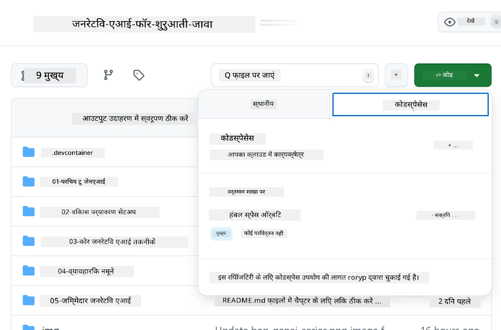
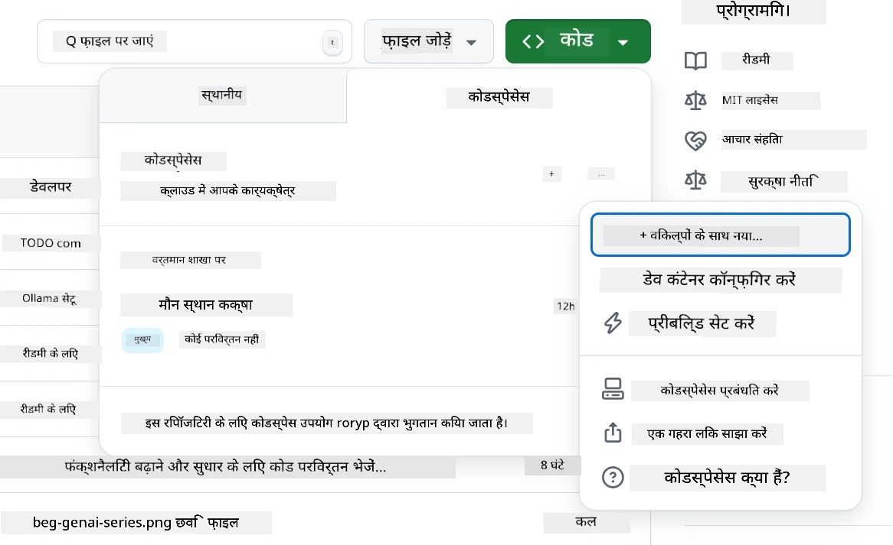
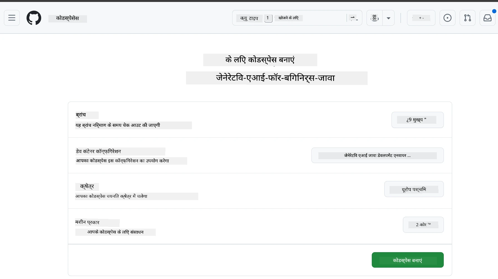
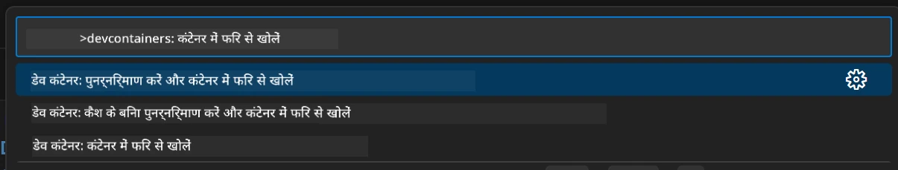
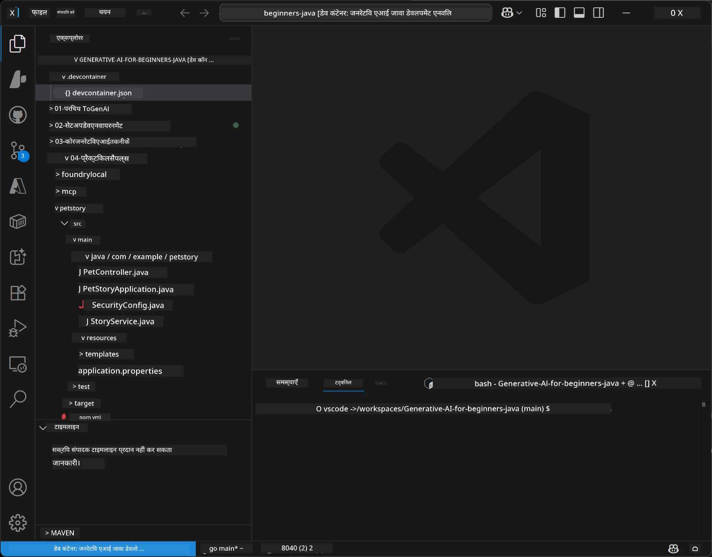
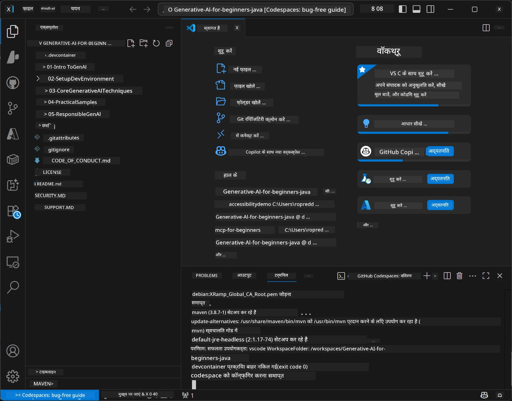

# Java के लिए जनरेटिव AI के लिए विकास वातावरण सेट अप करना

> **त्वरित शुरुआत:** कुछ ही मिनटों में Bicep + `azd` के साथ अपने AI मॉडल्स को **Azure AI Foundry** पर कोड के रूप में प्रोविजन करें — देखें [Azure AI Foundry सेटअप गाइड](getting-started-azure-openai.md)। प्रमाणीकरण **कीलेस** है (Microsoft Entra ID), इसलिए कोई API कुंजी प्रबंधित करने की आवश्यकता नहीं है।

## आप क्या सीखेंगे

- AI अनुप्रयोगों के लिए Java विकास वातावरण सेट अप करना
- अपने पसंदीदा विकास पर्यावरण (Codespaces के साथ क्लाउड-प्रथम, स्थानीय डेवलपमेंट कंटेनर, या पूर्ण स्थानीय सेटअप) का चयन और कॉन्फ़िगर करना
- Azure AI Foundry मॉडल से कनेक्ट करके अपनी सेटअप का परीक्षण करना

## सामग्री सारिणी

- [आप क्या सीखेंगे](#आप-क्या-सीखेंगे)
- [परिचय](#परिचय)
- [चरण 1: अपना विकास वातावरण सेट अप करें](#चरण-1-अपना-विकास-वातावरण-सेट-अप-करें)
  - [विकल्प A: GitHub Codespaces (सिफारिश की गई)](#विकल्प-a-github-codespaces-सिफारिश-की-गई)
  - [विकल्प B: स्थानीय डेवलपमेंट कंटेनर](#विकल्प-b-स्थानीय-dev-container)
  - [विकल्प C: अपने मौजूदा स्थानीय इंस्टॉलेशन का उपयोग करें](#विकल्प-c-अपने-मौजूदा-स्थानीय-इंस्टॉलेशन-का-उपयोग-करें)
- [चरण 2: Azure AI Foundry प्रोविजन करें](#चरण-2-azure-ai-foundry-प्रोविजन-करें)
- [चरण 3: अपने सेटअप का परीक्षण करें](#चरण-3-अपने-सेटअप-का-परीक्षण-करें)
- [समस्या निवारण](#समस्या-निवारण)
- [सारांश](#सारांश)
- [अगले चरण](#अगले-चरण)

## परिचय

यह अध्याय आपको विकास वातावरण सेट अप करने में मार्गदर्शन करेगा। हम पूरे पाठ्यक्रम में मॉडलों के लिए **Azure AI Foundry** का उपयोग करेंगे। आप मॉडलों को Bicep और Azure Developer CLI (`azd`) के साथ कोड के रूप में प्रोविजन करते हैं, फिर **कीलेस प्रमाणीकरण** (Microsoft Entra ID) के साथ कनेक्ट करते हैं — कोई API कुंजियाँ कॉपी या लीक नहीं करनी हैं।

**कोई स्थानीय सेटअप आवश्यक नहीं!** आप GitHub Codespaces का उपयोग कर सकते हैं, जो आपके ब्राउज़र में एक पूर्ण विकास वातावरण प्रदान करता है, और वहां से Foundry को प्रोविजन कर सकते हैं।

हम इस पाठ्यक्रम के लिए **Azure AI Foundry** का उपयोग करते हैं क्योंकि यह:
- **कोड के रूप में प्रोविजन किया गया** — एक `azd up` खाते और मॉडल डिप्लॉयमेंट्स को तैनात करता है
- **कीलेस** — अपने Azure साइन-इन या मैनेज्ड आइडेंटिटी से प्रमाणीकरण करें
- **प्रोडक्शन-तैयार** — एक ही कोड लोकल और Azure दोनों पर चलता है
- **लचीला** — मॉडल बदलें डिप्लॉयमेंट नाम बदलकर, न कि अपने कोड को

> **नोट**: Azure AI Foundry डिप्लॉयमेंट टोकन के आधार पर बिल किया जाता है (पे-एज़-यू-गो)। प्रोविजनिंग, क्षेत्र, और लागत विवरण के लिए [Azure AI Foundry सेटअप गाइड](getting-started-azure-openai.md) देखें।


## चरण 1: अपना विकास वातावरण सेट अप करें

<a name="quick-start-cloud"></a>

हमने इस जनरेटिव AI फॉर जावा पाठ्यक्रम के लिए सभी आवश्यक उपकरण सुनिश्चित करने के लिए एक पूर्व-निर्धारित विकास कंटेनर बनाया है ताकि सेटअप समय कम हो। अपनी पसंदीदा विकास विधि चुनें:

### वातावरण सेटअप विकल्प:

#### विकल्प A: GitHub Codespaces (सिफारिश की गई)

**2 मिनट में कोडिंग शुरू करें - कोई स्थानीय सेटअप आवश्यक नहीं!**

1. इस रिपॉजिटरी को अपने GitHub खाते में फोर्क करें
   > **नोट**: यदि आप बेसिक कॉन्फ़िग संपादित करना चाहते हैं, तो कृपया [Dev Container Configuration](../../../.devcontainer/devcontainer.json) देखें
2. क्लिक करें **Code** → **Codespaces** टैब → **...** → **New with options...**
3. डिफ़ॉल्ट का उपयोग करें – यह इस कोर्स के लिए बनाई गई कस्टम Devcontainer के साथ **Dev container configuration**: **Generative AI Java Development Environment** चयन करेगा
4. क्लिक करें **Create codespace**
5. लगभग 2 मिनट के लिए इंतजार करें जब तक वातावरण तैयार न हो जाए
6. [चरण 2: Azure AI Foundry प्रोविजन करें](#चरण-2-azure-ai-foundry-प्रोविजन-करें) पर जाएं








> **Codespaces के लाभ**:
> - कोई स्थानीय इंस्टॉलेशन आवश्यक नहीं
> - ब्राउज़र वाले किसी भी डिवाइस पर काम करता है
> - सभी उपकरणों और निर्भरताओं के साथ पूर्व-निर्धारित
> - व्यक्तिगत खातों के लिए प्रति माह 60 घंटे नि:शुल्क
> - सभी शिक्षार्थियों के लिए समान वातावरण

#### विकल्प B: स्थानीय Dev Container

**डिवेलपर्स के लिए जो Docker के साथ स्थानीय विकास पसंद करते हैं**

1. इस रिपॉजिटरी को फोर्क करें और अपनी स्थानीय मशीन पर क्लोन करें
   > **नोट**: यदि आप बेसिक कॉन्फ़िग संपादित करना चाहते हैं, तो कृपया [Dev Container Configuration](../../../.devcontainer/devcontainer.json) देखें
2. [Docker Desktop](https://www.docker.com/products/docker-desktop/) और [VS Code](https://code.visualstudio.com/) इंस्टाल करें
3. VS Code में [Dev Containers एक्सटेंशन](https://marketplace.visualstudio.com/items?itemName=ms-vscode-remote.remote-containers) इंस्टाल करें
4. VS Code में रिपॉजिटरी फ़ोल्डर खोलें
5. संकेत मिलने पर, क्लिक करें **Reopen in Container** (या `Ctrl+Shift+P` → "Dev Containers: Reopen in Container" का उपयोग करें)
6. कंटेनर के बनने और शुरू होने का इंतजार करें
7. [चरण 2: Azure AI Foundry प्रोविजन करें](#चरण-2-azure-ai-foundry-प्रोविजन-करें) पर जाएं





#### विकल्प C: अपने मौजूदा स्थानीय इंस्टॉलेशन का उपयोग करें

**उन डिवेलपर्स के लिए जिनके पास पहले से Java वातावरण हैं**

आवश्यकताएँ:
- [Java 21+](https://www.oracle.com/java/technologies/javase/jdk21-archive-downloads.html) 
- [Maven 3.9+](https://maven.apache.org/download.cgi)
- [VS Code](https://code.visualstudio.com) या अपनी पसंद का IDE

चरण:
1. इस रिपॉजिटरी को अपनी स्थानीय मशीन पर क्लोन करें
2. परियोजना को अपने IDE में खोलें
3. [चरण 2: Azure AI Foundry प्रोविजन करें](#चरण-2-azure-ai-foundry-प्रोविजन-करें) पर जाएं

> **प्रो टिप**: यदि आपका मशीन कम स्पेक का है लेकिन आप स्थानीय VS Code उपयोग करना चाहते हैं, तो GitHub Codespaces का उपयोग करें! आप अपने स्थानीय VS Code को क्लाउड-होस्टेड Codespace से जोड़ सकते हैं जिससे दोनों का सर्वश्रेष्ठ लाभ मिल सके।




## चरण 2: Azure AI Foundry प्रोविजन करें

इस कोर्स के AI मॉडल्स को Azure AI Foundry पर कोड के रूप में डिप्लॉय करें। रिपॉजिटरी रूट से:

```bash
cd 02-SetupDevEnvironment
azd auth login
az login
azd up
```

`azd` आपसे पर्यावरण नाम, सदस्यता, और क्षेत्र पूछता है, `gpt-5.6-luna` और `text-embedding-3-small` डिप्लॉयमेंट के साथ Azure AI Foundry अकाउंट प्रोविजन करता है, और उदाहरण की `.env` में एंडपॉइंट लिखता है - यह सब **कीलेस** प्रमाणीकरण (कोई API कुंजी नहीं) के साथ।

> **पूर्ण मार्गदर्शन:** आवश्यकताओं, एक मैनुअल (पोर्टल) विकल्प, क्षेत्र निर्देश, और लागत/सफाई नोट्स के लिए [Azure AI Foundry सेटअप गाइड](getting-started-azure-openai.md) देखें।

## चरण 3: अपने सेटअप का परीक्षण करें

एक बार जब आपके Foundry मॉडल प्रोविजन हो जाएं, तो उदाहरण ऐप में [`02-SetupDevEnvironment/examples/basic-chat-azure`](../../../02-SetupDevEnvironment/examples/basic-chat-azure) के साथ कनेक्शन का परीक्षण करें।

1. अपने विकास वातावरण में टर्मिनल खोलें।
2. उदाहरण फ़ोल्डर पर जाएं:
   ```bash
   cd 02-SetupDevEnvironment/examples/basic-chat-azure
   ```
3. सुनिश्चित करें कि आप साइन इन हैं (कीलेस ऑथ के लिए टोकन की आवश्यकता है):
   ```bash
   az login
   ```
   > यदि आपने `azd up` चलाया है, तो आपकी एंडपॉइंट के साथ `.env` फ़ाइल पहले से लिखी गई होगी।
4. एप्लिकेशन चलाएँ:
   ```bash
   mvn clean spring-boot:run
   ```

आपको `gpt-5.6-luna` मॉडल से प्रतिक्रिया दिखनी चाहिए।

### उदाहरण कोड को समझना

[basic-chat उदाहरण](./examples/basic-chat-azure/README.md) **Spring Boot 4.1.1** और **Spring AI 2.0.1** का उपयोग करता है। Spring AI का `ChatClient` आधिकारिक OpenAI Java SDK द्वारा समर्थित है, जो Azure OpenAI **v1** एंडपॉइंट से कीलेस प्रमाणीकरण के साथ जुड़ता है।

**यह कोड क्या करता है:**
- Azure AI Foundry से आपके Azure साइन-इन (Microsoft Entra ID) का उपयोग करके **कनेक्ट** करता है — कोई API कुंजी नहीं
- `gpt-5.6-luna` मॉडल को **प्रॉम्प्ट भेजता है**
- AI की प्रतिक्रिया **प्राप्त** करता है और दिखाता है
- यह सत्यापित करता है कि आपका सेटअप सही ढंग से काम कर रहा है

**प्रमुख निर्भरताएँ** ([pom.xml](../../../02-SetupDevEnvironment/examples/basic-chat-azure/pom.xml) से अंश):
```xml
<dependency>
    <groupId>org.springframework.ai</groupId>
    <artifactId>spring-ai-starter-model-openai</artifactId>
</dependency>
<dependency>
    <groupId>com.openai</groupId>
    <artifactId>openai-java</artifactId>
</dependency>
<dependency>
    <groupId>com.azure</groupId>
    <artifactId>azure-identity</artifactId>
    <version>${azure-identity.version}</version>
</dependency>
```

POM OpenAI Java **4.63.1** को प्रबंधित करता है और Azure Identity **1.18.6** को स्पष्ट रूप से सेट करता है। Spring AI 2 ने Azure-विशिष्ट स्टार्टर हटा दिया; Azure Identity अभी भी क्रेडेंशियल बीन के लिए आवश्यक है।

**कॉन्फ़िगरेशन** ([application.yml](../../../02-SetupDevEnvironment/examples/basic-chat-azure/src/main/resources/application.yml)):
```yaml
spring:
  ai:
    openai:
      base-url: ${AZURE_OPENAI_ENDPOINT}
      microsoft-foundry: true
      chat:
        model: ${AZURE_OPENAI_DEPLOYMENT:gpt-5.6-luna}
        reasoning-effort: none
        max-completion-tokens: 500
```

कीलेस ऑथ को स्पष्ट रूप से [BasicChatApplication.java](../../../02-SetupDevEnvironment/examples/basic-chat-azure/src/main/java/com/example/BasicChatApplication.java) में कॉन्फ़िगर किया गया है, न कि अनुपस्थित API कुंजी से अनुमानित। इसका बीयरर क्रेडेंशियल `https://ai.azure.com/.default` स्कोप के साथ `DefaultAzureCredential` का उपयोग करता है, और इसका `OpenAIClient` `/openai/v1` को लक्षित करता है। ऐप वह क्लाइंट Spring AI के चैट मॉडल को प्रदान करता है, इसलिए ग्लोबल `OPENAI_API_KEY` Azure प्रमाणीकरण को ओवरराइड नहीं कर सकता।

चैट सेटिंग्स सीधे `spring.ai.openai.chat` के अंतर्गत हैं, बिना `options` ब्लॉक के। पाठ शेष रखता है Chat Completions के साथ `reasoning-effort: none` और 500-टोकन की सीमा; यह `temperature` या `max-tokens` सेट नहीं करता। API विकल्प और टूल-कॉलिंग मार्गदर्शन के लिए [उदाहरण के कॉन्फ़िगरेशन संदर्भ](./examples/basic-chat-azure/README.md#spring-configuration) देखें।

## सारांश

ऊपर दिए गए चरणों को पूरा करने के बाद, आपके पास होगा:

- Bicep + `azd` के साथ Azure AI Foundry मॉडल्स को कोड के रूप में प्रोविजन किया गया
- आपका Java विकास वातावरण चल रहा है (चाहे वह Codespaces हो, dev containers हो, या स्थानीय हो)
- Azure AI Foundry से कीलेस प्रमाणीकरण (Microsoft Entra ID) के साथ जुड़ा हुआ — कोई API कुंजी नहीं
- एक सरल उदाहरण के साथ परीक्षण किया जो आपके मॉडल से बात करता है

## अगले चरण

[अध्याय 3: मूल जनरेटिव AI तकनीकें](../03-CoreGenerativeAITechniques/README.md)

## समस्या निवारण

समस्या हो रही है? यहाँ सामान्य समस्याएँ और समाधान हैं:

- **प्रमाणीकरण विफल (401/403)?** 
  - `az login` चलाएं — प्रमाणीकरण कीलेस है, तो आपको साइन इन होना चाहिए
  - सत्यापित करें कि आपके खाते को संसाधन पर **Cognitive Services OpenAI User** भूमिका प्राप्त है
  - यदि आपने अभी प्रोविजन किया है, तो भूमिका असाइनमेंट के फैलने में कुछ मिनट लग सकते हैं

- **Maven नहीं मिला?** 
  - यदि dev containers/Codespaces का उपयोग कर रहे हैं, तो Maven पहले से इंस्टॉल होना चाहिए
  - स्थानीय सेटअप के लिए, सुनिश्चित करें कि Java 21+ और Maven 3.9+ इंस्टॉल हैं
  - इंस्टॉलेशन सुनिश्चित करने के लिए `mvn --version` चलाएं

- **`azd` नहीं मिला या प्रोविजनिंग विफल?** 
  - [Azure Developer CLI](https://aka.ms/azure-dev/install) इंस्टॉल करें और `azd auth login` चलाएं
  - ऐसा क्षेत्र चुनें जहां `gpt-5.6-luna` और `text-embedding-3-small` उपलब्ध हों (जैसे `eastus2`), और आपकी चुनी गई सदस्यता में पर्याप्त कोटा हो
  - विवरण के लिए [Azure AI Foundry सेटअप गाइड](getting-started-azure-openai.md) देखें

- **Dev container शुरू नहीं हो रहा?** 
  - सुनिश्चित करें कि Docker Desktop चल रहा हो (स्थानीय विकास के लिए)
  - कंटेनर को पुनर्निर्मित करने का प्रयास करें: `Ctrl+Shift+P` → "Dev Containers: Rebuild Container"

- **एप्लिकेशन संकलन त्रुटियाँ?**
  - सुनिश्चित करें कि आप सही निर्देशिका में हैं: `02-SetupDevEnvironment/examples/basic-chat-azure`
  - क्लीन और पुन:निर्माण करें: `mvn clean compile`

> **मदद चाहिए?**: अभी भी समस्या है? रिपॉजिटरी में एक इश्यू खोलें और हम आपकी मदद करेंगे।

---

<!-- CO-OP TRANSLATOR DISCLAIMER START -->
**अस्वीकरण**:
इस दस्तावेज़ का अनुवाद AI अनुवाद सेवा [Co-op Translator](https://github.com/Azure/co-op-translator) का उपयोग करके किया गया है। जबकि हम सटीकता के लिए प्रयास करते हैं, कृपया ध्यान दें कि स्वचालित अनुवादों में त्रुटियाँ या अशुद्धियाँ हो सकती हैं। मूल दस्तावेज़ अपनी मूल भाषा में ही प्रामाणिक स्रोत माना जाना चाहिए। महत्वपूर्ण जानकारी के लिए, पेशेवर मानव अनुवाद की सिफारिश की जाती है। इस अनुवाद के उपयोग से उत्पन्न किसी भी गलतफहमी या गलत व्याख्या के लिए हम उत्तरदायी नहीं हैं।
<!-- CO-OP TRANSLATOR DISCLAIMER END -->