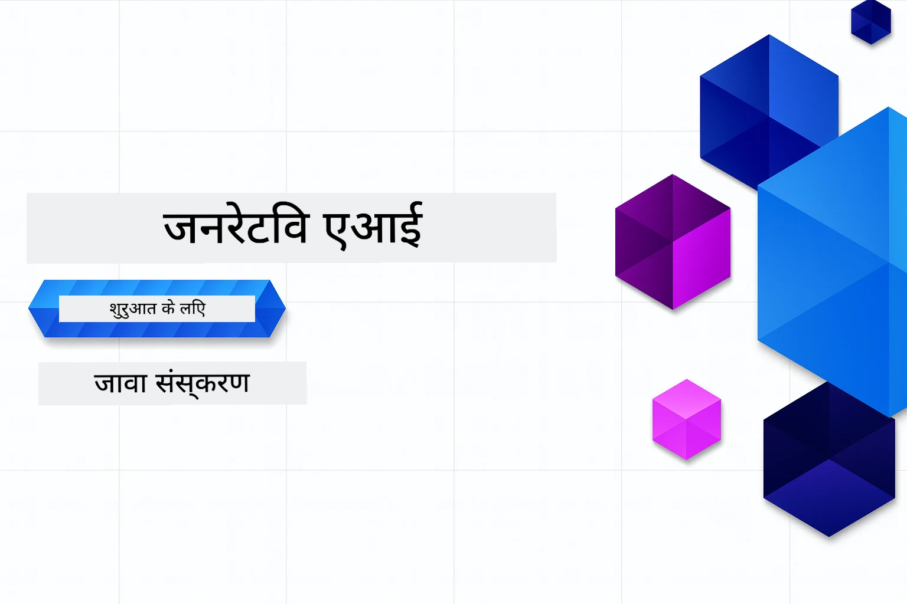

# शुरुआती लोगों के लिए जनरेटिव AI - जावा संस्करण
[](https://discord.gg/nTYy5BXMWG)



**समय प्रतिबद्धता**: पूरी कार्यशाला ऑनलाइन पूरी की जा सकती है बिना स्थानीय सेटअप के। पर्यावरण सेटअप में 2 मिनट लगते हैं, और नमूनों का अन्वेषण करने में 1-3 घंटे लग सकते हैं, अन्वेषण की गहराई पर निर्भर करता है।

> **त्वरित प्रारंभ** 

1. इस रिपॉजिटरी को अपने GitHub खाते पर फोर्क करें
2. **Code** → **Codespaces** टैब → **...** → **New with options...** पर क्लिक करें
3. डिफॉल्ट का उपयोग करें – यह इस कोर्स के लिए बनाए गए डेवलपमेंट कंटेनर का चयन करेगा
4. **Create codespace** पर क्लिक करें
5. पर्यावरण तैयार होने के लिए लगभग 2 मिनट प्रतीक्षा करें
6. सीधे [अध्याय 2: Azure AI Foundry का प्रावधान](./02-SetupDevEnvironment/README.md#step-2-provision-azure-ai-foundry) पर जाएं

## बहुभाषी समर्थन

### GitHub Action के माध्यम से समर्थित (स्वचालित और हमेशा अद्यतन)

<!-- CO-OP TRANSLATOR LANGUAGES TABLE START -->
[Arabic](../ar/README.md) | [Bengali](../bn/README.md) | [Bulgarian](../bg/README.md) | [Burmese (Myanmar)](../my/README.md) | [Chinese (Simplified)](../zh-CN/README.md) | [Chinese (Traditional, Hong Kong)](../zh-HK/README.md) | [Chinese (Traditional, Macau)](../zh-MO/README.md) | [Chinese (Traditional, Taiwan)](../zh-TW/README.md) | [Croatian](../hr/README.md) | [Czech](../cs/README.md) | [Danish](../da/README.md) | [Dutch](../nl/README.md) | [Estonian](../et/README.md) | [Finnish](../fi/README.md) | [French](../fr/README.md) | [German](../de/README.md) | [Greek](../el/README.md) | [Hebrew](../he/README.md) | [Hindi](./README.md) | [Hungarian](../hu/README.md) | [Indonesian](../id/README.md) | [Italian](../it/README.md) | [Japanese](../ja/README.md) | [Kannada](../kn/README.md) | [Khmer](../km/README.md) | [Korean](../ko/README.md) | [Lithuanian](../lt/README.md) | [Malay](../ms/README.md) | [Malayalam](../ml/README.md) | [Marathi](../mr/README.md) | [Nepali](../ne/README.md) | [Nigerian Pidgin](../pcm/README.md) | [Norwegian](../no/README.md) | [Persian (Farsi)](../fa/README.md) | [Polish](../pl/README.md) | [Portuguese (Brazil)](../pt-BR/README.md) | [Portuguese (Portugal)](../pt-PT/README.md) | [Punjabi (Gurmukhi)](../pa/README.md) | [Romanian](../ro/README.md) | [Russian](../ru/README.md) | [Serbian (Cyrillic)](../sr/README.md) | [Slovak](../sk/README.md) | [Slovenian](../sl/README.md) | [Spanish](../es/README.md) | [Swahili](../sw/README.md) | [Swedish](../sv/README.md) | [Tagalog (Filipino)](../tl/README.md) | [Tamil](../ta/README.md) | [Telugu](../te/README.md) | [Thai](../th/README.md) | [Turkish](../tr/README.md) | [Ukrainian](../uk/README.md) | [Urdu](../ur/README.md) | [Vietnamese](../vi/README.md)

> **स्थानीय रूप से क्लोन करना पसंद है?**
>
> इस रिपॉजिटरी में 50+ भाषाओं के अनुवाद शामिल हैं, जो डाउनलोड आकार को बहुत बढ़ा देते हैं। अनुवाद के बिना क्लोन करने के लिए, sparse checkout का उपयोग करें:
>
> **Bash / macOS / Linux:**
> ```bash
> git clone --filter=blob:none --sparse https://github.com/microsoft/Generative-AI-for-beginners-java.git
> cd Generative-AI-for-beginners-java
> git sparse-checkout set --no-cone '/*' '!translations' '!translated_images'
> ```
>
> **CMD (Windows):**
> ```cmd
> git clone --filter=blob:none --sparse https://github.com/microsoft/Generative-AI-for-beginners-java.git
> cd Generative-AI-for-beginners-java
> git sparse-checkout set --no-cone "/*" "!translations" "!translated_images"
> ```
>
> यह आपको बहुत तेज़ डाउनलोड के साथ कोर्स पूरा करने के लिए आवश्यक सभी कुछ प्रदान करता है।
<!-- CO-OP TRANSLATOR LANGUAGES TABLE END -->

## कोर्स संरचना और सीखने का मार्ग

### **अध्याय 1: जनरेटिव AI का परिचय**
- **मूल अवधारणाएं**: बड़े भाषा मॉडल, टोकन, एम्बेडिंग्स और AI क्षमताओं को समझना
- **जावा AI इकोसिस्टम**: Spring AI और OpenAI SDKs का अवलोकन
- **मॉडल कॉन्टेक्स्ट प्रोटोकॉल**: MCP का परिचय और AI एजेंट संचार में इसकी भूमिका
- **व्यावहारिक अनुप्रयोग**: चैटबॉट्स और सामग्री उत्पन्न करने जैसे वास्तविक दुनिया के परिदृश्य
- **[→ अध्याय 1 प्रारंभ करें](./01-IntroToGenAI/README.md)**

### **अध्याय 2: विकास पर्यावरण सेटअप**
- **Azure AI Foundry**: Bicep और Azure Developer CLI (azd) के साथ GPT-5.6 Luna चैट और text-embedding-3-small एम्बेडिंग्स का प्रावधान
- **Spring Boot 4.1.1 + Spring AI 2.0.1**: आधिकारिक OpenAI जावा SDK और Azure OpenAI v1 द्वारा समर्थित `ChatClient` के साथ सीखें
- **कीलेस प्रमाणीकरण**: Microsoft Entra ID के साथ सुरक्षित कनेक्ट करें — कोई API कुंजी प्रबंधन नहीं
- **डेवलपमेंट टूल्स**: Docker कंटेनर, VS कोड और GitHub Codespaces कॉन्फ़िगरेशन
- **[→ अध्याय 2 प्रारंभ करें](./02-SetupDevEnvironment/README.md)**

### **अध्याय 3: कोर जनरेटिव AI तकनीकें**
- **आधिकारिक OpenAI जावा SDK**: कीलेस प्रमाणीकरण के साथ सीधे Azure OpenAI v1 को कॉल करें
- **प्रॉम्प्ट इंजीनियरिंग**: AI मॉडल के लिए बेहतर प्रतिक्रियाओं की तकनीकें
- **एम्बेडिंग्स और वेक्टर संचालन**: सेमांटिक खोज और समानता मिलान लागू करें
- **रिट्रीवल-ऑगमेंटेड जनरेशन (RAG)**: AI को अपनी खुद की डेटा स्रोतों के साथ संयोजित करें
- **फ़ंक्शन कॉलिंग**: कस्टम टूल और प्लगइन्स के साथ AI क्षमताओं का विस्तार करें
- **[→ अध्याय 3 प्रारंभ करें](./03-CoreGenerativeAITechniques/README.md)**

### **अध्याय 4: व्यावहारिक अनुप्रयोग और प्रोजेक्ट्स**
- **पेट स्टोरी जनरेटर** (`petstory/`): Azure AI Foundry के साथ रचनात्मक सामग्री निर्माण
- **Foundry लोकल डेमो** (`foundrylocal/`): OpenAI जावा SDK के साथ स्थानीय AI मॉडल एकीकरण
- **MCP कैलकुलेटर सेवा** (`calculator/`): Spring AI के साथ बेसिक मॉडल कॉन्टेक्स्ट प्रोटोकॉल कार्यान्वयन
- **[→ अध्याय 4 प्रारंभ करें](./04-PracticalSamples/README.md)**

### **अध्याय 5: जिम्मेदार AI विकास**
- **Azure AI Foundry कंटेंट सुरक्षा**: बिल्ट-इन कंटेंट फ़िल्टरिंग और सुरक्षा तंत्र (हार्ड ब्लॉक्स और सॉफ्ट रिफ़्यूजल्स) का परीक्षण करें
- **जिम्मेदार AI डेमो**: हाथों-हाथ उदाहरण जो दिखाता है कि आधुनिक AI सुरक्षा सिस्टम कैसे काम करते हैं
- **सर्वोत्तम प्रथाएं**: नैतिक AI विकास और परिनियोजन के लिए आवश्यक दिशानिर्देश
- **[→ अध्याय 5 प्रारंभ करें](./05-ResponsibleGenAI/README.md)**

## अतिरिक्त संसाधन

<!-- CO-OP TRANSLATOR OTHER COURSES START -->
### LangChain
[](https://aka.ms/langchain4j-for-beginners)
[](https://aka.ms/langchainjs-for-beginners?WT.mc_id=m365-94501-dwahlin)
[](https://github.com/microsoft/langchain-for-beginners?WT.mc_id=m365-94501-dwahlin)
---

### Azure / एज / MCP / एजेंट्स
[](https://github.com/microsoft/AZD-for-beginners?WT.mc_id=academic-105485-koreyst)
[](https://github.com/microsoft/edgeai-for-beginners?WT.mc_id=academic-105485-koreyst)
[](https://github.com/microsoft/mcp-for-beginners?WT.mc_id=academic-105485-koreyst)
[](https://github.com/microsoft/ai-agents-for-beginners?WT.mc_id=academic-105485-koreyst)

---
 
### जनरेटिव AI श्रृंखला
[](https://github.com/microsoft/generative-ai-for-beginners?WT.mc_id=academic-105485-koreyst)
[-9333EA?style=for-the-badge&labelColor=E5E7EB&color=9333EA)](https://github.com/microsoft/Generative-AI-for-beginners-dotnet?WT.mc_id=academic-105485-koreyst)
[-C084FC?style=for-the-badge&labelColor=E5E7EB&color=C084FC)](https://github.com/microsoft/generative-ai-for-beginners-java?WT.mc_id=academic-105485-koreyst)
[-E879F9?style=for-the-badge&labelColor=E5E7EB&color=E879F9)](https://github.com/microsoft/generative-ai-with-javascript?WT.mc_id=academic-105485-koreyst)

---
 
### कोर सीखना
[](https://aka.ms/ml-beginners?WT.mc_id=academic-105485-koreyst)
[](https://aka.ms/datascience-beginners?WT.mc_id=academic-105485-koreyst)
[](https://aka.ms/ai-beginners?WT.mc_id=academic-105485-koreyst)
[](https://github.com/microsoft/Security-101?WT.mc_id=academic-96948-sayoung)
[](https://aka.ms/webdev-beginners?WT.mc_id=academic-105485-koreyst)
[](https://aka.ms/iot-beginners?WT.mc_id=academic-105485-koreyst)
[](https://github.com/microsoft/xr-development-for-beginners?WT.mc_id=academic-105485-koreyst)

---
 
### कोपिलट श्रृंखला
[](https://aka.ms/GitHubCopilotAI?WT.mc_id=academic-105485-koreyst)
[](https://github.com/microsoft/mastering-github-copilot-for-dotnet-csharp-developers?WT.mc_id=academic-105485-koreyst)
[](https://github.com/microsoft/CopilotAdventures?WT.mc_id=academic-105485-koreyst)
<!-- CO-OP TRANSLATOR OTHER COURSES END -->

## मदद प्राप्त करें

अगर आप फंसे हैं या AI ऐप बनाने के बारे में कोई सवाल है। MCP के बारे में चर्चा में साथ सीखने वालों और अनुभवी डेवलपर्स से जुड़ें। यह एक सहायक समुदाय है जहाँ सवालों का स्वागत है और ज्ञान स्वतंत्र रूप से साझा किया जाता है।

[](https://discord.gg/nTYy5BXMWG)

अगर आपके पास उत्पाद संबंधी प्रतिक्रिया है या निर्माण के दौरान त्रुटियाँ हो रही हैं तो जाएं:

[](https://aka.ms/foundry/forum)

---

<!-- CO-OP TRANSLATOR DISCLAIMER START -->
**अस्वीकरण**:
इस दस्तावेज़ का अनुवाद AI अनुवाद सेवा [Co-op Translator](https://github.com/Azure/co-op-translator) का उपयोग करके किया गया है। जबकि हम सटीकता के लिए प्रयास करते हैं, कृपया ध्यान दें कि स्वचालित अनुवादों में त्रुटियाँ या अशुद्धियाँ हो सकती हैं। मूल दस्तावेज़ अपनी मूल भाषा में ही प्रामाणिक स्रोत माना जाना चाहिए। महत्वपूर्ण जानकारी के लिए, पेशेवर मानव अनुवाद की सिफारिश की जाती है। इस अनुवाद के उपयोग से उत्पन्न किसी भी गलतफहमी या गलत व्याख्या के लिए हम उत्तरदायी नहीं हैं।
<!-- CO-OP TRANSLATOR DISCLAIMER END -->