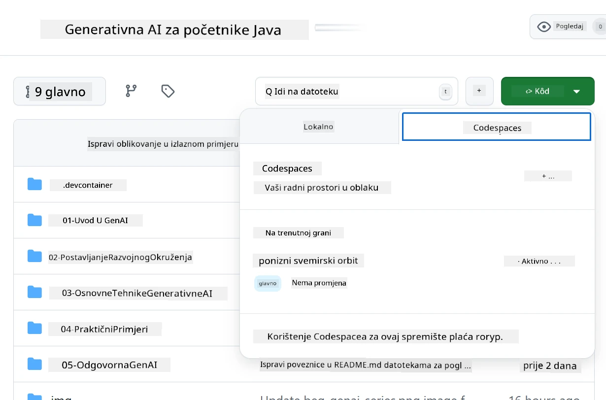
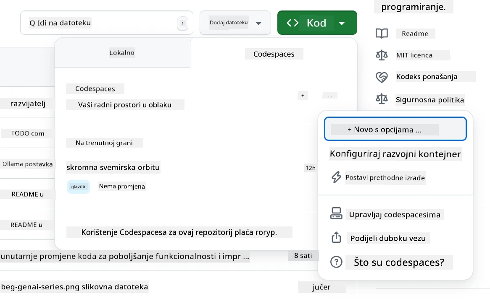
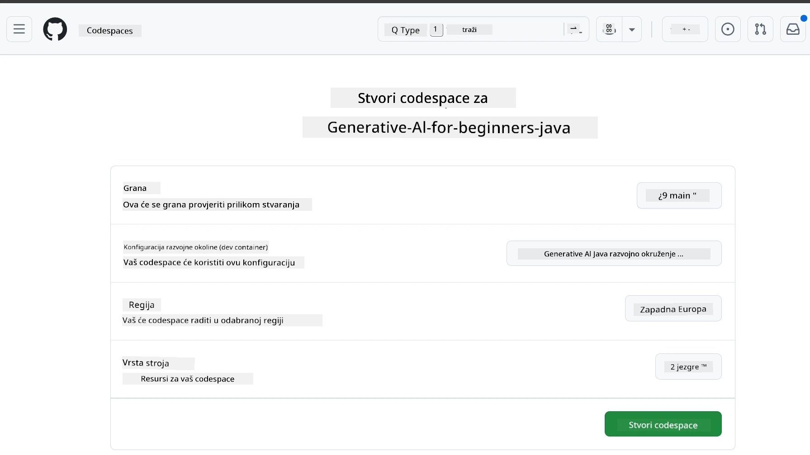
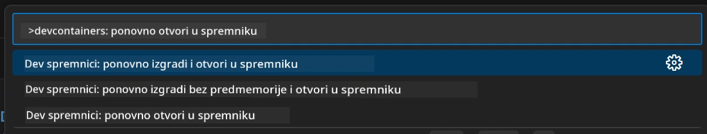
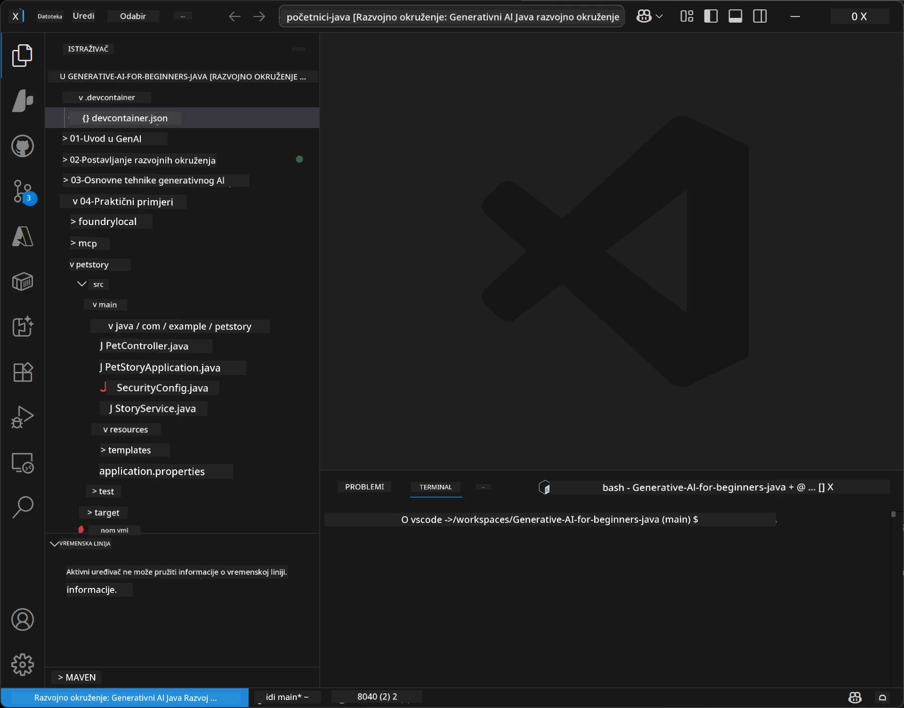
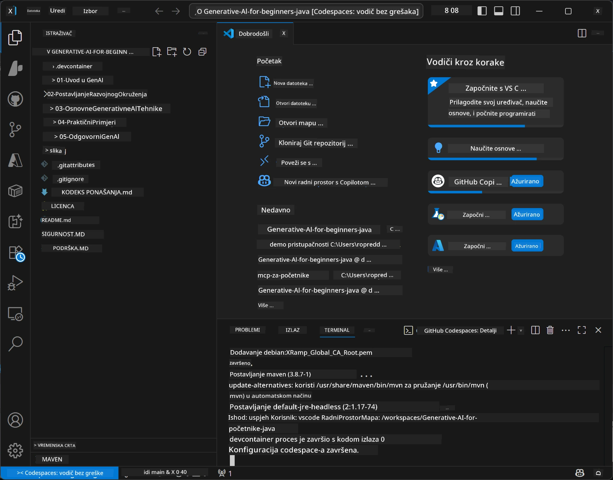

# Postavljanje razvojnog okruženja za Generativnu AI za Javu

> **Brzi početak:** Postavite svoje AI modele na **Azure AI Foundry** kao kod pomoću Bicep + `azd` za nekoliko minuta — pogledajte [Vodič za postavljanje Azure AI Foundry](getting-started-azure-openai.md). Autentikacija je **bez ključeva** (Microsoft Entra ID), tako da nema API ključeva za upravljanje.

## Što ćete naučiti

- Postavljanje Java razvojnog okruženja za AI aplikacije
- Odabir i konfiguracija željenog razvojnog okruženja (prvenstveno u oblaku s Codespaces, lokalni razvojni kontejner ili potpuni lokalni setup)
- Testiranje postavki povezivanjem s Azure AI Foundry modelom

## Sadržaj

- [Što ćete naučiti](#što-ćete-naučiti)
- [Uvod](#uvod)
- [Korak 1: Postavljanje razvojnog okruženja](#korak-1-postavite-svoje-razvojno-okruženje)
  - [Opcija A: GitHub Codespaces (Preporučeno)](#opcija-a-github-codespaces-preporučeno)
  - [Opcija B: Lokalni razvojni kontejner](#opcija-b-lokalni-razvojni-kontejner)
  - [Opcija C: Korištenje postojećih lokalnih instalacija](#opcija-c-korištenje-postojećih-lokalnih-instalacija)
- [Korak 2: Postavljanje Azure AI Foundry](#korak-2-postavljanje-azure-ai-foundry)
- [Korak 3: Testiranje postavki](#korak-3-testiranje-postavki)
- [Rješavanje problema](#rješavanje-problema)
- [Sažetak](#sažetak)
- [Sljedeći koraci](#sljedeći-koraci)

## Uvod

Ovo poglavlje će vas provesti kroz postavljanje razvojnog okruženja. Za modele tijekom ovog tečaja koristit ćemo **Azure AI Foundry**. Modele postavljate kao kod pomoću Bicep i Azure Developer CLI (`azd`), zatim se povezujete s **autentikacijom bez ključeva** (Microsoft Entra ID) — nema potrebe za kopiranjem ili dijeljenjem API ključeva.

**Nema potrebe za lokalnim postavljanjem!** Možete koristiti GitHub Codespaces, koji pruža kompletno razvojno okruženje u vašem pregledniku, te odatle postaviti Foundry.

Koristimo **Azure AI Foundry** za ovaj tečaj jer je:
- **Postavljen kao kod** — jedna komanda `azd up` implementira račun i postavke modela
- **Bez ključeva** — autentifikacija putem vašeg Azure prijavljivanja ili upravljanog identiteta
- **Spreman za produkciju** — isti kod radi lokalno i u Azure-u
- **Fleksibilan** — promijenite modele mijenjanjem imena postavke, bez izmjene koda

> **Napomena**: Implementacije u Azure AI Foundry se naplaćuju po tokenu (pay-as-you-go). Pogledajte [vodič za postavljanje Azure AI Foundry](getting-started-azure-openai.md) za detalje o postavljanju, regijama i troškovima.


## Korak 1: Postavite svoje razvojno okruženje

<a name="quick-start-cloud"></a>

Kreirali smo unaprijed konfigurirani razvojni kontejner za minimalno vrijeme postavljanja i osiguravanje svih potrebnih alata za ovaj tečaj Generativne AI za Javu. Odaberite svoj omiljeni razvojni pristup:

### Opcije postavljanja okruženja:

#### Opcija A: GitHub Codespaces (Preporučeno)

**Započnite kodiranje za 2 minute - nema potrebe za lokalnim postavljanjem!**

1. Napravite fork ovog repozitorija na svoj GitHub račun
   > **Napomena**: Ako želite urediti osnovnu konfiguraciju, pogledajte [Dev Container Configuration](../../../.devcontainer/devcontainer.json)
2. Kliknite **Code** → karticu **Codespaces** → **...** → **New with options...**
3. Koristite zadane postavke – ovo će odabrati **Dev container konfiguraciju**: **Generative AI Java Development Environment** prilagođeni devcontainer za ovaj tečaj
4. Kliknite **Create codespace**
5. Pričekajte oko 2 minute dok se okruženje ne pripremi
6. Nastavite na [Korak 2: Postavljanje Azure AI Foundry](#korak-2-postavljanje-azure-ai-foundry)








> **Prednosti Codespaces-a**:
> - Nema potrebe za lokalnom instalacijom
> - Radi na bilo kojem uređaju s preglednikom
> - Unaprijed konfiguriran sa svim alatima i ovisnostima
> - Besplatnih 60 sati mjesečno za osobne račune
> - Konstantno okruženje za sve učenike

#### Opcija B: Lokalni razvojni kontejner

**Za developere koji preferiraju lokalni razvoj s Dockerom**

1. Napravite fork i klonirajte ovaj repozitorij na svoje lokalno računalo
   > **Napomena**: Ako želite urediti osnovnu konfiguraciju, pogledajte [Dev Container Configuration](../../../.devcontainer/devcontainer.json)
2. Instalirajte [Docker Desktop](https://www.docker.com/products/docker-desktop/) i [VS Code](https://code.visualstudio.com/)
3. Instalirajte [Dev Containers ekstenziju](https://marketplace.visualstudio.com/items?itemName=ms-vscode-remote.remote-containers) u VS Code-u
4. Otvorite mapu repozitorija u VS Code-u
5. Kada se pojavi upit, kliknite **Reopen in Container** (ili koristite `Ctrl+Shift+P` → "Dev Containers: Reopen in Container")
6. Pričekajte da se kontejner sastavi i pokrene
7. Nastavite na [Korak 2: Postavljanje Azure AI Foundry](#korak-2-postavljanje-azure-ai-foundry)





#### Opcija C: Korištenje postojećih lokalnih instalacija

**Za developere s postojećim Java okruženjima**

Preduvjeti:
- [Java 21+](https://www.oracle.com/java/technologies/javase/jdk21-archive-downloads.html) 
- [Maven 3.9+](https://maven.apache.org/download.cgi)
- [VS Code](https://code.visualstudio.com) ili vaš omiljeni IDE

Koraci:
1. Klonirajte ovaj repozitorij na svoje lokalno računalo
2. Otvorite projekt u svom IDE-u
3. Nastavite na [Korak 2: Postavljanje Azure AI Foundry](#korak-2-postavljanje-azure-ai-foundry)

> **Korisni savjet**: Ako imate slabiju opremu, ali želite koristiti VS Code lokalno, iskoristite GitHub Codespaces! Možete povezati svoj lokalni VS Code s cloud-hostanim Codespace-om za najbolje iz oba svijeta.




## Korak 2: Postavljanje Azure AI Foundry

Izvršite implementaciju AI modela tečaja u Azure AI Foundry kao kod. Iz korijena repozitorija:

```bash
cd 02-SetupDevEnvironment
azd auth login
az login
azd up
```

`azd` traži ime okruženja, pretplatu i regiju, postavlja Azure AI Foundry račun s implementacijama `gpt-5.6-luna` i `text-embedding-3-small`, te zapisuje endpoint u `.env` datoteku primjera - sve s **autentikacijom bez ključeva** (bez API ključeva).

> **Cjeloviti postupak:** Pogledajte [Vodič za postavljanje Azure AI Foundry](getting-started-azure-openai.md) za preduvjete, alternativu putem portala, smjernice za regije te informacije o troškovima i čišćenju.

## Korak 3: Testiranje postavki

Kada su Foundry modeli postavljeni, testirajte vezu s primjernom aplikacijom u [`02-SetupDevEnvironment/examples/basic-chat-azure`](../../../02-SetupDevEnvironment/examples/basic-chat-azure).

1. Otvorite terminal u svom razvojnome okruženju.
2. Idite u direktorij primjera:
   ```bash
   cd 02-SetupDevEnvironment/examples/basic-chat-azure
   ```
3. Provjerite jeste li prijavljeni (autentikacija bez ključeva zahtijeva token):
   ```bash
   az login
   ```
   > Ako ste izvršili `azd up`, `.env` datoteka sa vašim endpointom već je generirana.
4. Pokrenite aplikaciju:
   ```bash
   mvn clean spring-boot:run
   ```

Trebali biste vidjeti odgovor modela `gpt-5.6-luna`.

### Razumijevanje primjernog koda

[basic-chat primjer](./examples/basic-chat-azure/README.md) koristi **Spring Boot 4.1.1** i **Spring AI 2.0.1**. Spring AI `ChatClient` koristi službeni OpenAI Java SDK, povezujući se na Azure OpenAI **v1** endpoint s autentikacijom bez ključeva.

**Što ovaj kod radi:**
- **Povezuje se** na Azure AI Foundry koristeći vaš Azure prijavu (Microsoft Entra ID) — bez API ključa
- **Šalje** prompt modelu `gpt-5.6-luna`
- **Prima** i prikazuje odgovor AI-a
- **Provjerava** radi li vaše okruženje ispravno

**Ključne ovisnosti** (izvadak iz [pom.xml](../../../02-SetupDevEnvironment/examples/basic-chat-azure/pom.xml)):
```xml
<dependency>
    <groupId>org.springframework.ai</groupId>
    <artifactId>spring-ai-starter-model-openai</artifactId>
</dependency>
<dependency>
    <groupId>com.openai</groupId>
    <artifactId>openai-java</artifactId>
</dependency>
<dependency>
    <groupId>com.azure</groupId>
    <artifactId>azure-identity</artifactId>
    <version>${azure-identity.version}</version>
</dependency>
```

POM upravlja OpenAI Java verzijom **4.63.1** i eksplicitno postavlja Azure Identity **1.18.6**. Spring AI 2 ukinuo je Azure-specifični starter; Azure Identity je i dalje potreban za credential bean.

**Konfiguracija** ([application.yml](../../../02-SetupDevEnvironment/examples/basic-chat-azure/src/main/resources/application.yml)):
```yaml
spring:
  ai:
    openai:
      base-url: ${AZURE_OPENAI_ENDPOINT}
      microsoft-foundry: true
      chat:
        model: ${AZURE_OPENAI_DEPLOYMENT:gpt-5.6-luna}
        reasoning-effort: none
        max-completion-tokens: 500
```

Autentikacija bez ključeva je eksplicitno konfigurirana u [BasicChatApplication.java](../../../02-SetupDevEnvironment/examples/basic-chat-azure/src/main/java/com/example/BasicChatApplication.java), ne zaključuje se iz odsutnog API ključa. Njegov bearer credential koristi `DefaultAzureCredential` s opsegom `https://ai.azure.com/.default`, a `OpenAIClient` cilja `/openai/v1`. Aplikacija daje klijent Spring AI-ju za chat model, tako da globalni `OPENAI_API_KEY` ne može nadjačati Azure autentikaciju.

Postavke chata su direktno ispod `spring.ai.openai.chat`, bez `options` bloka. Lekcija zadržava Chat Completions s `reasoning-effort: none` i ograničenjem od 500 tokena; ne postavlja `temperature` ili `max-tokens`. Pogledajte [referencu konfiguracije primjera](./examples/basic-chat-azure/README.md#spring-configuration) za izbor API-ja i smjernice za pozivanje alata.

## Sažetak

Nakon što dovršite gore navedene korake, imat ćete:

- Postavljene Azure AI Foundry modele kao kod pomoću Bicep + `azd`
- Pokrenuto Java razvojno okruženje (bilo da je to Codespaces, razvojni kontejner ili lokalno)
- Povezano s Azure AI Foundry bez ključeva (Microsoft Entra ID) — bez API ključeva
- Testirano da sve radi s jednostavnim primjerom koji komunicira s vašim modelom

## Sljedeći koraci

[Poglavlje 3: Temeljne tehnike generativne AI](../03-CoreGenerativeAITechniques/README.md)

## Rješavanje problema

Imate problema? Evo uobičajenih problema i rješenja:

- **Autentikacija ne uspijeva (401/403)?** 
  - Pokrenite `az login` — autentikacija je bez ključeva, pa se morate biti prijavljeni
  - Provjerite ima li vaš račun ulogu **Cognitive Services OpenAI User** na resursu
  - Ako ste upravo postavili, pričekajte minutu da se dodjela uloga propagira

- **Maven nije pronađen?** 
  - Ako koristite dev kontejnere/Codespaces, Maven je unaprijed instaliran
  - Za lokalno postavljanje, provjerite imate li Java 21+ i Maven 3.9+ instalirane
  - Pokušajte `mvn --version` kako biste provjerili instalaciju

- **`azd` nije pronađen ili postavljanje ne uspijeva?** 
  - Instalirajte [Azure Developer CLI](https://aka.ms/azure-dev/install) i pokrenite `azd auth login`
  - Odaberite regiju gdje su dostupni `gpt-5.6-luna` i `text-embedding-3-small` (npr. `eastus2`), s dovoljno kvote u odabranoj pretplati
  - Pogledajte [vodič za postavljanje Azure AI Foundry](getting-started-azure-openai.md) za detalje

- **Razvojni kontejner se ne pokreće?** 
  - Provjerite radi li Docker Desktop (za lokalni razvoj)
  - Pokušajte ponovno izgraditi kontejner: `Ctrl+Shift+P` → "Dev Containers: Rebuild Container"

- **Greške pri kompilaciji aplikacije?**
  - Provjerite jeste li u ispravnom direktoriju: `02-SetupDevEnvironment/examples/basic-chat-azure`
  - Pokušajte očistiti i ponovno izgraditi: `mvn clean compile`

> **Treba pomoć?**: Ako i dalje imate problema, otvorite problem u repozitoriju i pomoći ćemo.

---

<!-- CO-OP TRANSLATOR DISCLAIMER START -->
**Napomena**:
Ovaj dokument je preveden korištenjem AI prevoditeljskog servisa [Co-op Translator](https://github.com/Azure/co-op-translator). Iako težimo točnosti, imajte na umu da automatski prijevodi mogu sadržavati greške ili netočnosti. Izvorni dokument na izvornom jeziku treba smatrati autoritativnim izvorom. Za važne informacije preporuča se profesionalni ljudski prijevod. Nismo odgovorni za bilo kakva nesporazumevanja ili pogrešne interpretacije koje proizlaze iz korištenja ovog prijevoda.
<!-- CO-OP TRANSLATOR DISCLAIMER END -->