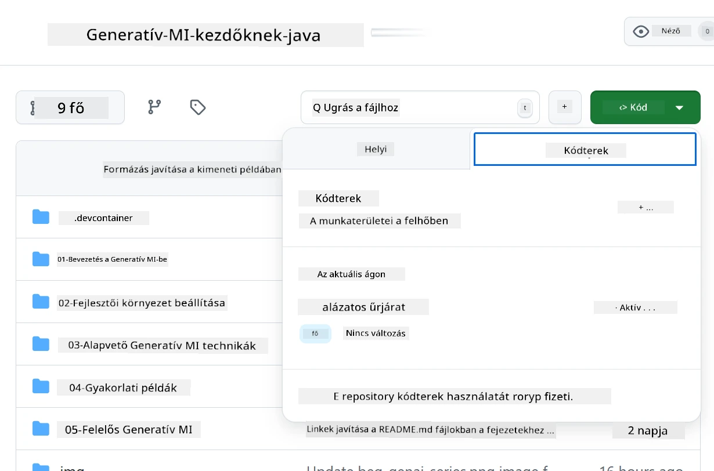
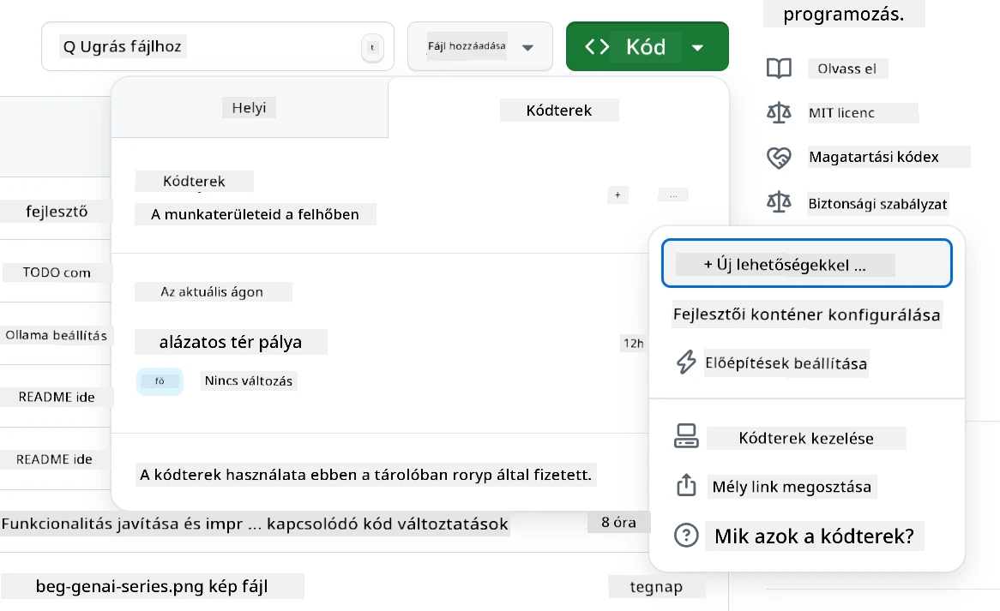
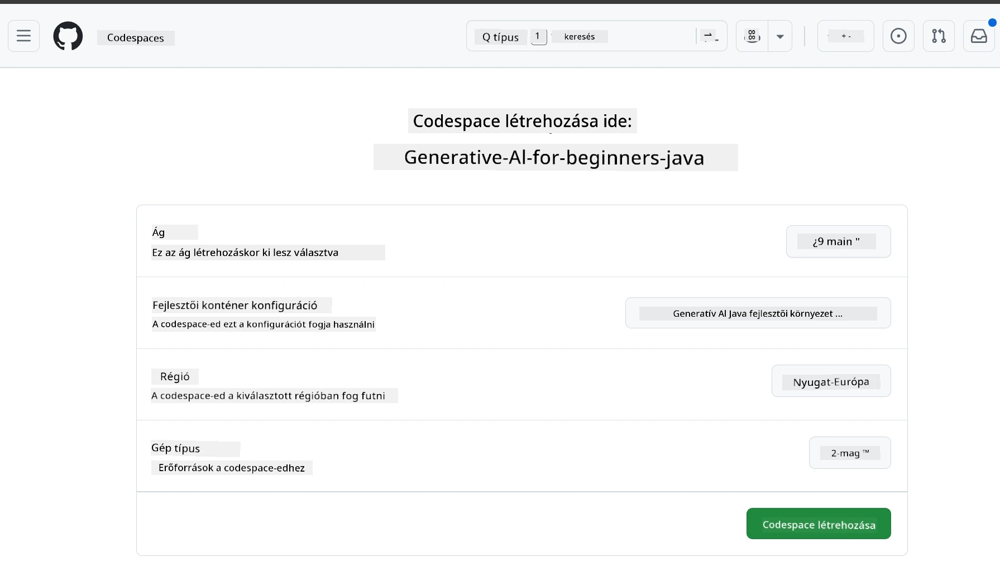
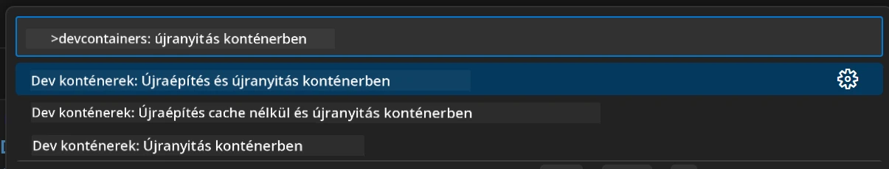
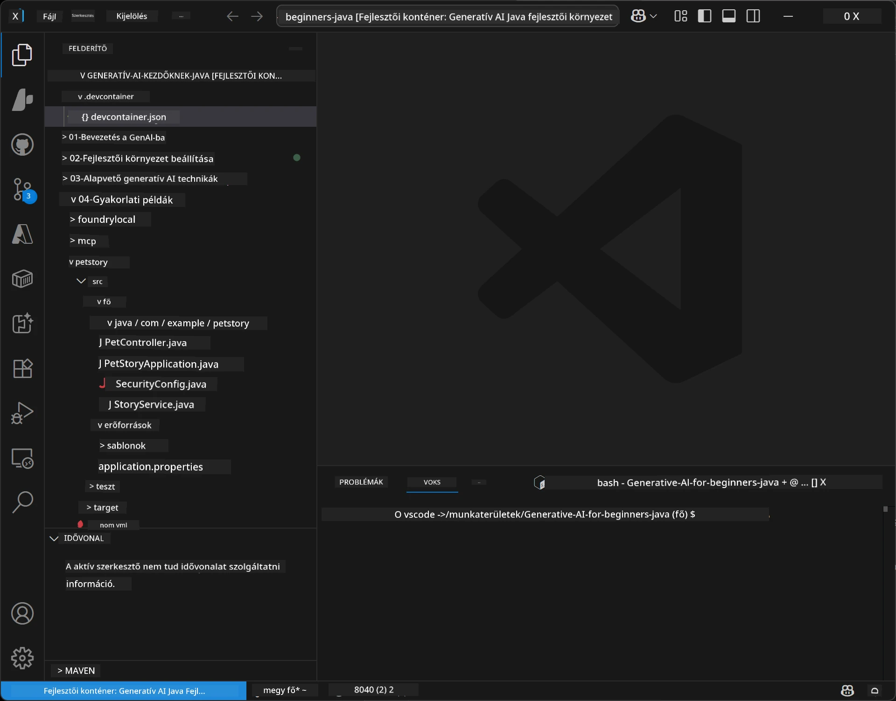
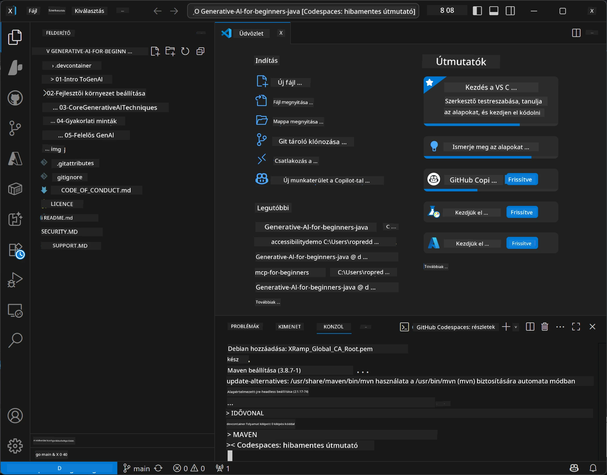

# Fejlesztői környezet beállítása Generatív AI Java-hoz

> **Gyors kezdés:** Helyezze üzembe AI modelljeit az **Azure AI Foundry**-ban kódként Bicep + `azd` segítségével néhány perc alatt — lásd az [Azure AI Foundry beállítási útmutatót](getting-started-azure-openai.md). Az autentikáció **kulcs nélküli** (Microsoft Entra ID), így nincsenek kezelendő API kulcsok.

## Amit megtanul

- Java fejlesztői környezet beállítása AI alkalmazásokhoz
- Válassza ki és konfigurálja kedvenc fejlesztői környezetét (cloud-first Codespaces-szal, helyi dev konténerrel vagy teljes helyi telepítéssel)
- Tesztelje a beállítást Azure AI Foundry modellhez való csatlakozással

## Tartalomjegyzék

- [Amit megtanul](#amit-megtanul)
- [Bevezetés](#bevezetés)
- [1. lépés: Fejlesztői környezet beállítása](#1-lépés-fejlesztői-környezet-beállítása)
  - [A opció: GitHub Codespaces (ajánlott)](#a-opció-github-codespaces-ajánlott)
  - [B opció: Helyi fejlesztői konténer](#b-opció-helyi-fejlesztői-konténer)
  - [C opció: Meglévő helyi telepítés használata](#c-opció-meglévő-helyi-telepítés-használata)
- [2. lépés: Azure AI Foundry üzembe helyezése](#2-lépés-azure-ai-foundry-üzembe-helyezése)
- [3. lépés: Beállítás tesztelése](#3-lépés-beállítás-tesztelése)
- [Hibaelhárítás](#hibaelhárítás)
- [Összefoglaló](#összefoglaló)
- [Következő lépések](#következő-lépések)

## Bevezetés

Ez a fejezet végigvezeti a fejlesztői környezet beállításán. A tanfolyam során a modellekhez a **Azure AI Foundry**-t használjuk. A modelleket Bicep és Azure Developer CLI (`azd`) segítségével kódként helyezi üzembe, majd kulcs nélküli autentikációval (Microsoft Entra ID) csatlakozhat — nem kell API kulcsot másolni vagy kitenni.

**Nincs szükség helyi telepítésre!** Használhatja a GitHub Codespaces-t, amely teljes fejlesztői környezetet biztosít a böngészőben, és onnan üzemelheti be a Foundryt.

Azért használjuk a **Azure AI Foundry**-t erre a tanfolyamra, mert:
- **Kódként helyezhető üzembe** — egy `azd up` a fiókot és a modell üzembe helyezéseket telepíti
- **Kulcs nélküli** — Azure bejelentkezéssel vagy kezelt identitással hitelesít
- **Üzemkész** — ugyanaz a kód fut helyileg és Azure-ban
- **Rugalmas** — modellcseréhez csak az üzembe helyezés nevét kell módosítani, nem a kódot

> **Megjegyzés**: Az Azure AI Foundry üzembe helyezése token alapon kerül számlázásra (pay-as-you-go). Az üzembe helyezés, régió és költség részletekért lásd az [Azure AI Foundry beállítási útmutatót](getting-started-azure-openai.md).


## 1. lépés: Fejlesztői környezet beállítása

<a name="quick-start-cloud"></a>

Elkészítettünk egy előre konfigurált fejlesztői konténert, hogy minimalizáljuk a beállítási időt és biztosítsuk az összes szükséges eszközt ehhez a Generatív AI Java tanfolyamhoz. Válassza ki kedvenc fejlesztési megközelítését:

### Környezet beállítási lehetőségek:

#### A opció: GitHub Codespaces (ajánlott)

**Kezdj el kódolni 2 perc alatt – nem kell helyi telepítés!**

1. Forkolja ezt a tárhelyet a GitHub fiókjába
   > **Megjegyzés**: Ha az alap konfigurációt szeretné szerkeszteni, tekintse meg a [Dev Container konfigurációt](../../../.devcontainer/devcontainer.json)
2. Kattintson a **Code** → **Codespaces** fülre → **...** → **Új opciókkal...**
3. Használja az alapértelmezettet – ez a tanfolyamhoz létrehozott **Generative AI Java Development Environment** egyedi devcontainer konfigurációját fogja kiválasztani
4. Kattintson a **Codespace létrehozása** gombra
5. Várjon kb. 2 percet, míg a környezet elkészül
6. Folytassa a [2. lépéssel: Azure AI Foundry üzembe helyezése](#2-lépés-azure-ai-foundry-üzembe-helyezése)








> **A Codespaces előnyei**:
> - Nincs szükség helyi telepítésre
> - Bármilyen böngészőt használó eszközön működik
> - Minden eszköz és függőség előre be van állítva
> - Személyes fiókoknak havi 60 óra ingyenes használat
> - Minden tanulónak egységes környezetet biztosít

#### B opció: Helyi fejlesztői konténer

**Fejlesztőknek, akik helyben, Dockerrel szeretnének dolgozni**

1. Forkolja és klónozza ezt a tárhelyet a helyi gépére
   > **Megjegyzés**: Ha az alap konfigurációt szeretné szerkeszteni, tekintse meg a [Dev Container konfigurációt](../../../.devcontainer/devcontainer.json)
2. Telepítse a [Docker Desktopot](https://www.docker.com/products/docker-desktop/) és a [VS Code-ot](https://code.visualstudio.com/)
3. Telepítse a [Dev Containers bővítményt](https://marketplace.visualstudio.com/items?itemName=ms-vscode-remote.remote-containers) a VS Code-ba
4. Nyissa meg a tárhely mappáját a VS Code-ban
5. Amikor felkérnek, kattintson a **Újra megnyitás konténerben** (vagy használja a `Ctrl+Shift+P` → "Dev Containers: Reopen in Container" parancsot)
6. Várja meg a konténer felépítését és indítását
7. Folytassa a [2. lépéssel: Azure AI Foundry üzembe helyezése](#2-lépés-azure-ai-foundry-üzembe-helyezése)





#### C opció: Meglévő helyi telepítés használata

**Fejlesztőknek, akiknek már van Java környezetük**

Előfeltételek:
- [Java 21+](https://www.oracle.com/java/technologies/javase/jdk21-archive-downloads.html) 
- [Maven 3.9+](https://maven.apache.org/download.cgi)
- [VS Code](https://code.visualstudio.com) vagy kedvenc IDE

Lépések:
1. Klónozza ezt a tárhelyet a helyi gépére
2. Nyissa meg a projektet az IDE-ben
3. Folytassa a [2. lépéssel: Azure AI Foundry üzembe helyezése](#2-lépés-azure-ai-foundry-üzembe-helyezése)

> **Pro tipp:** Ha gyenge gépe van, de mégis helyben szeretné használni a VS Code-ot, használja a GitHub Codespaces-t! A helyi VS Code-ot csatlakoztathatja egy felhőben hosztolt Codespace-hez, így a két világ legjobbja megvan.




## 2. lépés: Azure AI Foundry üzembe helyezése

Telepítse a tanfolyam AI modelljeit Azure AI Foundry-ba kódként. A tárhely gyökérből:

```bash
cd 02-SetupDevEnvironment
azd auth login
az login
azd up
```

A `azd` kér egy környezetnevet, előfizetést és régiót, üzembe helyez egy Azure AI Foundry fiókot `gpt-5.6-luna` és `text-embedding-3-small` üzembe helyezésekkel, majd az endpointot beírja a példa `.env` fájljába – mindezt **kulcs nélküli** autentikációval (nincs API kulcs).

> **Teljes lépésről-lépésre:** Lásd az [Azure AI Foundry beállítási útmutatót](getting-started-azure-openai.md) az előfeltételekért, manuális (portal) alternatíváért, régió iránymutatásért, és költség/takarítás megjegyzésekért.

## 3. lépés: Beállítás tesztelése

Miután a Foundry modellek üzembe helyezve, tesztelje a kapcsolatot az alábbi példával a [`02-SetupDevEnvironment/examples/basic-chat-azure`](../../../02-SetupDevEnvironment/examples/basic-chat-azure) helyen.

1. Nyissa meg a terminált a fejlesztői környezetében.
2. Navigáljon a példához:
   ```bash
   cd 02-SetupDevEnvironment/examples/basic-chat-azure
   ```
3. Győződjön meg róla, hogy be van jelentkezve (kulcs nélküli auth token szükséges):
   ```bash
   az login
   ```
   > Ha futtatta az `azd up` parancsot, az `.env` fájl az endpointtal már létrejött.
4. Futtassa az alkalmazást:
   ```bash
   mvn clean spring-boot:run
   ```

A `gpt-5.6-luna` modelltől választ kell kapnia.

### A példa kód megértése

A [basic-chat példa](./examples/basic-chat-azure/README.md) a **Spring Boot 4.1.1** és **Spring AI 2.0.1** verzióját használja. A Spring AI `ChatClient` a hivatalos OpenAI Java SDK mögé épül, amely az Azure OpenAI **v1** endpointhoz csatlakozik kulcs nélküli hitelesítéssel.

**Mit csinál ez a kód:**
- **Csatlakozik** az Azure AI Foundry-hoz Azure bejelentkezéssel (Microsoft Entra ID) – API kulcs nélkül
- **Küld** egy promptot a `gpt-5.6-luna` modellnek
- **Fogadja** és megjeleníti az AI válaszát
- **Ellenőrzi**, hogy a beállítás helyesen működik-e

**Fő függőségek** (részlet a [pom.xml]-ből) (./examples/basic-chat-azure/pom.xml):
```xml
<dependency>
    <groupId>org.springframework.ai</groupId>
    <artifactId>spring-ai-starter-model-openai</artifactId>
</dependency>
<dependency>
    <groupId>com.openai</groupId>
    <artifactId>openai-java</artifactId>
</dependency>
<dependency>
    <groupId>com.azure</groupId>
    <artifactId>azure-identity</artifactId>
    <version>${azure-identity.version}</version>
</dependency>
```

A POM kezeli az OpenAI Java **4.63.1** verzióját és explicite beállítja az Azure Identity **1.18.6** verzióját. A Spring AI 2 eltávolította az Azure-specifikus startert; az Azure Identity még mindig szükséges a hitelesítő beanhez.

**Konfiguráció** ([application.yml](../../../02-SetupDevEnvironment/examples/basic-chat-azure/src/main/resources/application.yml)):
```yaml
spring:
  ai:
    openai:
      base-url: ${AZURE_OPENAI_ENDPOINT}
      microsoft-foundry: true
      chat:
        model: ${AZURE_OPENAI_DEPLOYMENT:gpt-5.6-luna}
        reasoning-effort: none
        max-completion-tokens: 500
```

A kulcs nélküli hitelesítés explicit módon konfigurálva van a [BasicChatApplication.java](../../../02-SetupDevEnvironment/examples/basic-chat-azure/src/main/java/com/example/BasicChatApplication.java) fájlban, nem API kulcs hiányából következtetve. A hitelesítő egy `DefaultAzureCredential` az `https://ai.azure.com/.default` scope-pal, az `OpenAIClient` pedig a `/openai/v1`-re mutat. Az alkalmazás ezt az ügyfelet adja át a Spring AI chat modelljének, ezért egy globális `OPENAI_API_KEY` nem írhatja felül az Azure authentikációt.

A chat beállítások közvetlenül a `spring.ai.openai.chat` alatt vannak, nincs `options` blokk. Az oktatóanyag megtartja a Chat Completions-t `reasoning-effort: none` és 500 tokenes határral; nem állít be `temperature`-t vagy `max-tokens`-t. Lásd a [példa konfigurációs hivatkozást](./examples/basic-chat-azure/README.md#spring-configuration) az API választáshoz és eszközhívási útmutatóhoz.

## Összefoglaló

A fenti lépések elvégzése után Ön:

- Üzembe helyezte az Azure AI Foundry modelleket kódként Bicep + `azd` segítségével
- Futó Java fejlesztői környezetet állított be (akár Codespaces, dev konténerek vagy helyi)
- Kulcs nélküli autentikációval csatlakozott az Azure AI Foundry-hoz (Microsoft Entra ID) — API kulcs nélkül
- Tesztelte az egész működését egy egyszerű példával, amely a modelljével kommunikál

## Következő lépések

[3. fejezet: Alapvető generatív AI technikák](../03-CoreGenerativeAITechniques/README.md)

## Hibaelhárítás

Problémák vannak? Itt a leggyakoribb hibák és megoldások:

- **Hitelesítés sikertelen (401/403)?**
  - Futtassa az `az login` parancsot — kulcs nélküli hitelesítéshez be kell jelentkezni
  - Ellenőrizze, hogy fiókja rendelkezik a **Cognitive Services OpenAI User** szerepkörrel az erőforráson
  - Ha újonnan telepített, várjon egy percet, amíg a szerepkör hozzárendelése életbe lép

- **Maven nem található?**
  - Ha dev konténert vagy Codespaces-t használ, Maven előre telepítve van
  - Helyi telepítés esetén győződjön meg, hogy Java 21+ és Maven 3.9+ telepítve vannak
  - Próbálja meg a `mvn --version` parancsot az ellenőrzéshez

- **`azd` nem található vagy az üzembe helyezés sikertelen?**
  - Telepítse az [Azure Developer CLI-t](https://aka.ms/azure-dev/install) és futtassa az `azd auth login` parancsot
  - Válasszon olyan régiót, ahol elérhető a `gpt-5.6-luna` és `text-embedding-3-small` (pl. `eastus2`), és van elegendő kvóta az előfizetésében
  - További részletekért lásd az [Azure AI Foundry beállítási útmutatót](getting-started-azure-openai.md)

- **A dev konténer nem indul?**
  - Győződjön meg róla, hogy a Docker Desktop fut (helyi fejlesztéshez)
  - Próbálja újraépíteni a konténert: `Ctrl+Shift+P` → "Dev Containers: Rebuild Container"

- **Alkalmazás fordítási hibák?**
  - Ellenőrizze, hogy a megfelelő könyvtárban van-e: `02-SetupDevEnvironment/examples/basic-chat-azure`
  - Próbálja meg tisztítani és újrafordítani: `mvn clean compile`

> **Segítségre van szüksége?**: Ha még mindig vannak gondjai, nyisson egy issue-t a tárhelyen, és segítünk.

---

<!-- CO-OP TRANSLATOR DISCLAIMER START -->
**Jogi nyilatkozat**:
Ez a dokumentum az AI fordítási szolgáltatás, a [Co-op Translator](https://github.com/Azure/co-op-translator) segítségével készült. Bár az pontosságra törekszünk, kérjük, vegye figyelembe, hogy az automatikus fordítások hibákat vagy pontatlanságokat tartalmazhatnak. Az eredeti dokumentum az anyanyelvén tekintendő hiteles forrásnak. Fontos információk esetén professzionális emberi fordítást javasolunk. Nem vállalunk felelősséget semmilyen félreértésért vagy téves értelmezésért, amely ebből a fordításból ered.
<!-- CO-OP TRANSLATOR DISCLAIMER END -->