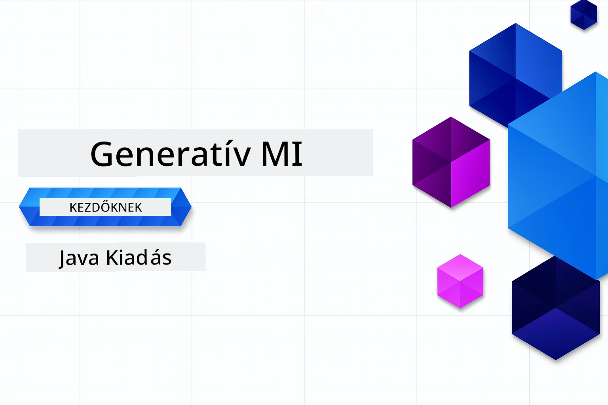

# Generatív AI kezdőknek - Java kiadás
[](https://discord.gg/nTYy5BXMWG)



**Időráfordítás**: A teljes workshop online végezhető el helyi beállítás nélkül. A környezet beállítása 2 percet vesz igénybe, a példák felfedezése pedig 1-3 órát, a felfedezés mélységétől függően.

> **Gyors kezdés** 

1. Forkold ezt a tárolót a GitHub fiókodba
2. Kattints a **Code** → **Codespaces** fülre → **...** → **Új beállításokkal...**
3. Használd az alapértelmezett beállításokat – ez kiválasztja a tanfolyamhoz készült fejlesztői konténert
4. Kattints a **Codespace létrehozása** gombra
5. Várj kb. 2 percet, amíg a környezet elkészül
6. Ugorj rögtön a [2. fejezet: Azure AI Foundry előkészítése](./02-SetupDevEnvironment/README.md#step-2-provision-azure-ai-foundry) részhez

## Többnyelvű támogatás

### GitHub Action révén támogatott (Automatikus és Mindig naprakész)

<!-- CO-OP TRANSLATOR LANGUAGES TABLE START -->
[Arab](../ar/README.md) | [Bengáli](../bn/README.md) | [Bolgár](../bg/README.md) | [Burmai (Mianmar)](../my/README.md) | [Kínai (egyszerűsített)](../zh-CN/README.md) | [Kínai (hagyományos, Hongkong)](../zh-HK/README.md) | [Kínai (hagyományos, Makaó)](../zh-MO/README.md) | [Kínai (hagyományos, Tajvan)](../zh-TW/README.md) | [Horvát](../hr/README.md) | [Cseh](../cs/README.md) | [Dán](../da/README.md) | [Holland](../nl/README.md) | [Észt](../et/README.md) | [Finn](../fi/README.md) | [Francia](../fr/README.md) | [Német](../de/README.md) | [Görög](../el/README.md) | [Héber](../he/README.md) | [Hindi](../hi/README.md) | [Magyar](./README.md) | [Indonéz](../id/README.md) | [Olasz](../it/README.md) | [Japán](../ja/README.md) | [Kannada](../kn/README.md) | [Khmer](../km/README.md) | [Koreai](../ko/README.md) | [Litván](../lt/README.md) | [Maláj](../ms/README.md) | [Malajálam](../ml/README.md) | [Maráthi](../mr/README.md) | [Nepáli](../ne/README.md) | [Nigériai pidgin](../pcm/README.md) | [Norvég](../no/README.md) | [Perzsa (Fárszi)](../fa/README.md) | [Lengyel](../pl/README.md) | [Portugál (Brazília)](../pt-BR/README.md) | [Portugál (Portugália)](../pt-PT/README.md) | [Pandzsábi (Gurmukhi)](../pa/README.md) | [Román](../ro/README.md) | [Orosz](../ru/README.md) | [Szerb (cirill)](../sr/README.md) | [Szlovák](../sk/README.md) | [Szlovén](../sl/README.md) | [Spanyol](../es/README.md) | [Szuahéli](../sw/README.md) | [Svéd](../sv/README.md) | [Tagalog (filippínó)](../tl/README.md) | [Tamil](../ta/README.md) | [Telugu](../te/README.md) | [Thai](../th/README.md) | [Török](../tr/README.md) | [Ukrán](../uk/README.md) | [Urdu](../ur/README.md) | [Vietnami](../vi/README.md)

> **Inkább helyileg klónoznád?**
>
> Ez a tároló 50+ nyelvi fordítást tartalmaz, ami jelentősen megnöveli a letöltési méretet. Ha fordítások nélkül szeretnéd klónozni, használj sparse checkout-ot:
>
> **Bash / macOS / Linux:**
> ```bash
> git clone --filter=blob:none --sparse https://github.com/microsoft/Generative-AI-for-beginners-java.git
> cd Generative-AI-for-beginners-java
> git sparse-checkout set --no-cone '/*' '!translations' '!translated_images'
> ```
>
> **CMD (Windows):**
> ```cmd
> git clone --filter=blob:none --sparse https://github.com/microsoft/Generative-AI-for-beginners-java.git
> cd Generative-AI-for-beginners-java
> git sparse-checkout set --no-cone "/*" "!translations" "!translated_images"
> ```
>
> Ez minden szükséges elemet megad a tanfolyam elvégzéséhez sokkal gyorsabb letöltéssel.
<!-- CO-OP TRANSLATOR LANGUAGES TABLE END -->

## A tanfolyam szerkezete és tanulási útvonal

### **1. fejezet: Bevezetés a generatív AI-ba**
- **Alapfogalmak**: Nagy nyelvi modellek, tokenek, beágyazások és MI képességek megértése
- **Java AI ökoszisztéma**: Áttekintés a Spring AI és az OpenAI SDK-król
- **Model Context Protocol**: Bevezetés az MCP-be és szerepe az MI ügynökök kommunikációjában
- **Gyakorlati alkalmazások**: Valós példák, köztük chatbotok és tartalomgenerálás
- **[→ 1. fejezet indítása](./01-IntroToGenAI/README.md)**

### **2. fejezet: Fejlesztőkörnyezet beállítása**
- **Azure AI Foundry**: GPT-5.6 Luna chat és text-embedding-3-small beágyazások előkészítése Bicep-pel és Azure Developer CLI-vel (azd)
- **Spring Boot 4.1.1 + Spring AI 2.0.1**: Tanulás a `ChatClient`-tel, az OpenAI hivatalos Java SDK-jára és az Azure OpenAI v1-re alapozva
- **Kulcs nélküli hitelesítés**: Biztonságos csatlakozás Microsoft Entra ID-vel — nincs API kulcs kezelés
- **Fejlesztői eszközök**: Docker konténerek, VS Code és GitHub Codespaces konfiguráció
- **[→ 2. fejezet indítása](./02-SetupDevEnvironment/README.md)**

### **3. fejezet: Alapvető generatív AI technikák**
- **Hivatalos OpenAI Java SDK**: Azure OpenAI v1 közvetlen hívása kulcs nélküli hitelesítéssel
- **Prompt engineering**: Módszerek az MI modell optimális válaszaiért
- **Beágyazások és vektor műveletek**: Szemantikus keresés és hasonlóság-illesztés megvalósítása
- **Retrieval-Augmented Generation (RAG)**: MI és saját adatok kombinálása
- **Funkcióhívás**: Az MI képességek bővítése egyedi eszközökkel és pluginokkal
- **[→ 3. fejezet indítása](./03-CoreGenerativeAITechniques/README.md)**

### **4. fejezet: Gyakorlati alkalmazások és projektek**
- **Háziállat történet generátor** (`petstory/`): Kreatív tartalomkészítés Azure AI Foundry-val
- **Foundry helyi demo** (`foundrylocal/`): Helyi MI modell integráció OpenAI Java SDK-val
- **MCP számológép szolgáltatás** (`calculator/`): Alap Model Context Protocol megvalósítás Spring AI-val
- **[→ 4. fejezet indítása](./04-PracticalSamples/README.md)**

### **5. fejezet: Felelős MI fejlesztés**
- **Azure AI Foundry tartalombiztonság**: Beépített tartalomszűrés és biztonsági mechanizmusok tesztelése (kemény tiltások és lágy elutasítások)
- **Felelős MI demó**: Gyakorlati példa arra, hogyan működnek a modern MI biztonsági rendszerek
- **Legjobb gyakorlatok**: Lényeges irányelvek az etikus MI fejlesztéshez és telepítéshez
- **[→ 5. fejezet indítása](./05-ResponsibleGenAI/README.md)**

## További források

<!-- CO-OP TRANSLATOR OTHER COURSES START -->
### LangChain
[](https://aka.ms/langchain4j-for-beginners)
[](https://aka.ms/langchainjs-for-beginners?WT.mc_id=m365-94501-dwahlin)
[](https://github.com/microsoft/langchain-for-beginners?WT.mc_id=m365-94501-dwahlin)
---

### Azure / Edge / MCP / Ügynökök
[](https://github.com/microsoft/AZD-for-beginners?WT.mc_id=academic-105485-koreyst)
[](https://github.com/microsoft/edgeai-for-beginners?WT.mc_id=academic-105485-koreyst)
[](https://github.com/microsoft/mcp-for-beginners?WT.mc_id=academic-105485-koreyst)
[](https://github.com/microsoft/ai-agents-for-beginners?WT.mc_id=academic-105485-koreyst)

---
 
### Generatív AI sorozat
[](https://github.com/microsoft/generative-ai-for-beginners?WT.mc_id=academic-105485-koreyst)
[-9333EA?style=for-the-badge&labelColor=E5E7EB&color=9333EA)](https://github.com/microsoft/Generative-AI-for-beginners-dotnet?WT.mc_id=academic-105485-koreyst)
[-C084FC?style=for-the-badge&labelColor=E5E7EB&color=C084FC)](https://github.com/microsoft/generative-ai-for-beginners-java?WT.mc_id=academic-105485-koreyst)
[-E879F9?style=for-the-badge&labelColor=E5E7EB&color=E879F9)](https://github.com/microsoft/generative-ai-with-javascript?WT.mc_id=academic-105485-koreyst)

---
 
### Alapvető tanulás
[](https://aka.ms/ml-beginners?WT.mc_id=academic-105485-koreyst)
[](https://aka.ms/datascience-beginners?WT.mc_id=academic-105485-koreyst)
[](https://aka.ms/ai-beginners?WT.mc_id=academic-105485-koreyst)
[](https://github.com/microsoft/Security-101?WT.mc_id=academic-96948-sayoung)
[](https://aka.ms/webdev-beginners?WT.mc_id=academic-105485-koreyst)
[](https://aka.ms/iot-beginners?WT.mc_id=academic-105485-koreyst)
[](https://github.com/microsoft/xr-development-for-beginners?WT.mc_id=academic-105485-koreyst)

---
 
### Copilot sorozat
[](https://aka.ms/GitHubCopilotAI?WT.mc_id=academic-105485-koreyst)
[](https://github.com/microsoft/mastering-github-copilot-for-dotnet-csharp-developers?WT.mc_id=academic-105485-koreyst)
[](https://github.com/microsoft/CopilotAdventures?WT.mc_id=academic-105485-koreyst)
<!-- CO-OP TRANSLATOR OTHER COURSES END -->

## Segítségkérés

Ha elakadsz vagy kérdésed van MI alkalmazások fejlesztésével kapcsolatban, csatlakozz a többi tanulóhoz és tapasztalt fejlesztőhöz az MCP-s beszélgetésekhez. Ez egy támogató közösség, ahol örömmel várják a kérdéseket és szabadon megosztják a tudást.

[](https://discord.gg/nTYy5BXMWG)

Ha termék visszajelzésed vagy hibák vannak a fejlesztés során, látogass el ide:

[](https://aka.ms/foundry/forum)

---

<!-- CO-OP TRANSLATOR DISCLAIMER START -->
**Jogi nyilatkozat**:
Ez a dokumentum az AI fordítási szolgáltatás, a [Co-op Translator](https://github.com/Azure/co-op-translator) segítségével készült. Bár az pontosságra törekszünk, kérjük, vegye figyelembe, hogy az automatikus fordítások hibákat vagy pontatlanságokat tartalmazhatnak. Az eredeti dokumentum az anyanyelvén tekintendő hiteles forrásnak. Fontos információk esetén professzionális emberi fordítást javasolunk. Nem vállalunk felelősséget semmilyen félreértésért vagy téves értelmezésért, amely ebből a fordításból ered.
<!-- CO-OP TRANSLATOR DISCLAIMER END -->