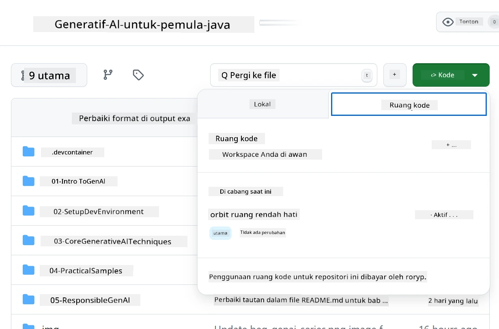
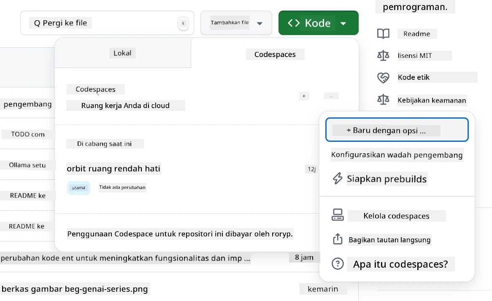
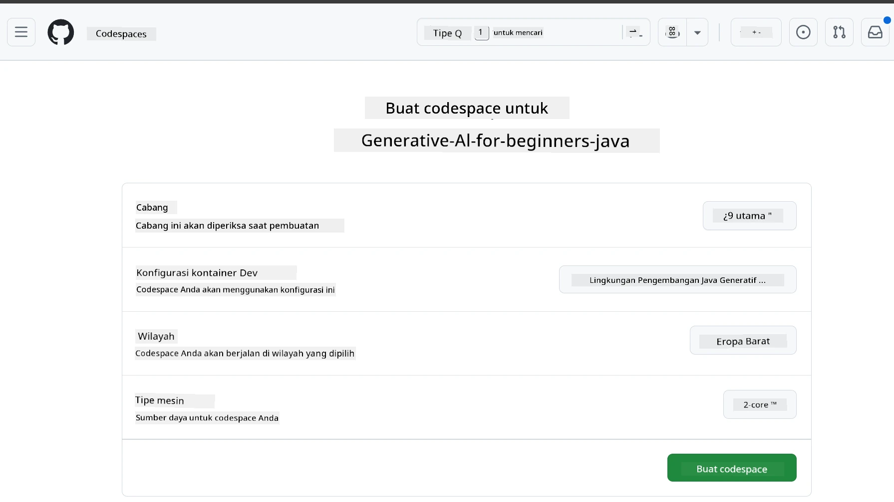
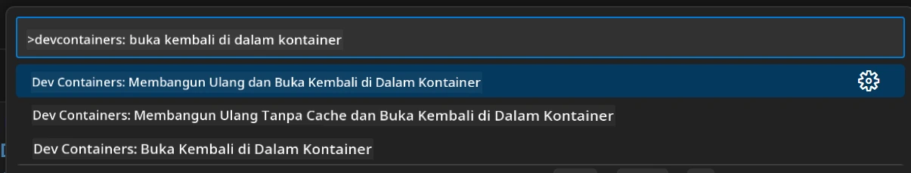
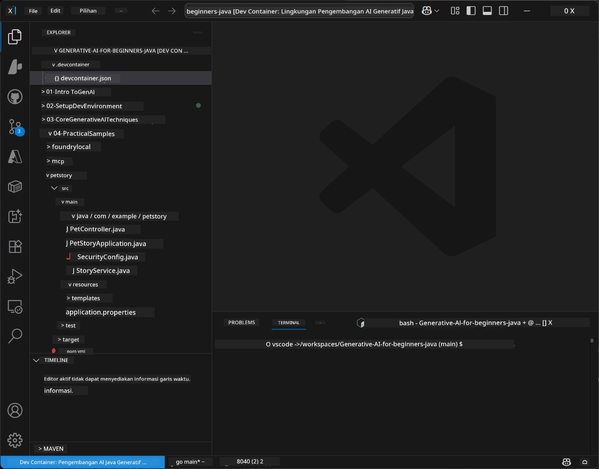
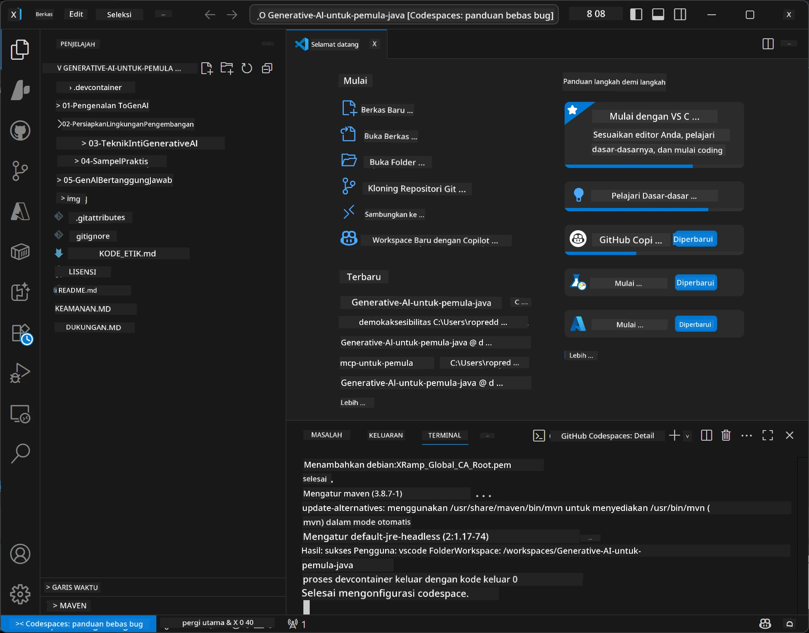

# Menyiapkan Lingkungan Pengembangan untuk Generative AI untuk Java

> **Mulai Cepat:** Sediakan model AI Anda di **Azure AI Foundry** sebagai kode dengan Bicep + `azd` dalam beberapa menit — lihat [Panduan Pengaturan Azure AI Foundry](getting-started-azure-openai.md). Autentikasi adalah **tanpa kunci** (Microsoft Entra ID), jadi tidak ada kunci API yang perlu dikelola.

## Apa yang Akan Anda Pelajari

- Menyiapkan lingkungan pengembangan Java untuk aplikasi AI
- Memilih dan mengonfigurasi lingkungan pengembangan pilihan Anda (cloud-first dengan Codespaces, kontainer dev lokal, atau pengaturan lokal penuh)
- Menguji pengaturan Anda dengan menghubungkan ke model Azure AI Foundry

## Daftar Isi

- [Apa yang Akan Anda Pelajari](#apa-yang-akan-anda-pelajari)
- [Pendahuluan](#pendahuluan)
- [Langkah 1: Menyiapkan Lingkungan Pengembangan Anda](#langkah-1-menyiapkan-lingkungan-pengembangan-anda)
  - [Opsi A: GitHub Codespaces (Direkomendasikan)](#opsi-a-github-codespaces-direkomendasikan)
  - [Opsi B: Kontainer Dev Lokal](#opsi-b-kontainer-dev-lokal)
  - [Opsi C: Gunakan Instalasi Lokal yang Ada](#opsi-c-gunakan-instalasi-lokal-yang-ada)
- [Langkah 2: Menyediakan Azure AI Foundry](#langkah-2-menyediakan-azure-ai-foundry)
- [Langkah 3: Menguji Pengaturan Anda](#langkah-3-menguji-pengaturan-anda)
- [Pemecahan Masalah](#pemecahan-masalah)
- [Ringkasan](#ringkasan)
- [Langkah Selanjutnya](#langkah-selanjutnya)

## Pendahuluan

Bab ini akan membimbing Anda dalam menyiapkan lingkungan pengembangan. Kami akan menggunakan **Azure AI Foundry** untuk model di seluruh kursus ini. Anda menyediakan model sebagai kode dengan Bicep dan Azure Developer CLI (`azd`), lalu terhubung dengan **autentikasi tanpa kunci** (Microsoft Entra ID) — tanpa perlu menyalin atau membocorkan kunci API.

**Tidak diperlukan pengaturan lokal!** Anda dapat menggunakan GitHub Codespaces, yang menyediakan lingkungan pengembangan penuh di browser Anda, dan menyediakan Foundry dari sana.

Kami menggunakan **Azure AI Foundry** untuk kursus ini karena:
- **Disediakan sebagai kode** — satu kali `azd up` menyebarkan akun dan penyebaran model
- **Tanpa kunci** — autentikasi dengan masuk Azure Anda atau identitas yang dikelola
- **Siap produksi** — kode yang sama berjalan lokal dan di Azure
- **Fleksibel** — ganti model dengan mengubah nama penyebaran, bukan kode Anda

> **Catatan**: Penyebaran Azure AI Foundry dikenakan biaya per token (bayar sesuai penggunaan). Lihat [panduan pengaturan Azure AI Foundry](getting-started-azure-openai.md) untuk penyediaan, wilayah, dan detail biaya.


## Langkah 1: Menyiapkan Lingkungan Pengembangan Anda

<a name="quick-start-cloud"></a>

Kami telah membuat kontainer pengembangan yang sudah dikonfigurasi sebelumnya untuk meminimalkan waktu penyiapan dan memastikan Anda memiliki semua alat yang diperlukan untuk kursus Generative AI untuk Java ini. Pilih pendekatan pengembangan yang Anda sukai:

### Opsi Penyiapan Lingkungan:

#### Opsi A: GitHub Codespaces (Direkomendasikan)

**Mulai coding dalam 2 menit – tidak perlu pengaturan lokal!**

1. Fork repositori ini ke akun GitHub Anda
   > **Catatan**: Jika Anda ingin mengedit konfigurasi dasar, silakan lihat [Konfigurasi Dev Container](../../../.devcontainer/devcontainer.json)
2. Klik **Code** → tab **Codespaces** → **...** → **New with options...**
3. Gunakan default – ini akan memilih **Konfigurasi kontainer Dev**: **Lingkungan Pengembangan Generative AI Java** devcontainer khusus yang dibuat untuk kursus ini
4. Klik **Create codespace**
5. Tunggu sekitar 2 menit sampai lingkungan siap
6. Lanjut ke [Langkah 2: Menyediakan Azure AI Foundry](#langkah-2-menyediakan-azure-ai-foundry)








> **Manfaat Codespaces**:
> - Tidak perlu instalasi lokal
> - Berfungsi di perangkat mana pun dengan browser
> - Sudah terkonfigurasi dengan semua alat dan ketergantungan
> - Gratis 60 jam per bulan untuk akun pribadi
> - Lingkungan yang konsisten untuk semua pelajar

#### Opsi B: Kontainer Dev Lokal

**Untuk pengembang yang lebih suka pengembangan lokal dengan Docker**

1. Fork dan clone repositori ini ke mesin lokal Anda
   > **Catatan**: Jika Anda ingin mengedit konfigurasi dasar, silakan lihat [Konfigurasi Dev Container](../../../.devcontainer/devcontainer.json)
2. Instal [Docker Desktop](https://www.docker.com/products/docker-desktop/) dan [VS Code](https://code.visualstudio.com/)
3. Instal [ekstensi Dev Containers](https://marketplace.visualstudio.com/items?itemName=ms-vscode-remote.remote-containers) di VS Code
4. Buka folder repositori di VS Code
5. Saat diminta, klik **Reopen in Container** (atau gunakan `Ctrl+Shift+P` → "Dev Containers: Reopen in Container")
6. Tunggu hingga kontainer selesai dibangun dan mulai berjalan
7. Lanjut ke [Langkah 2: Menyediakan Azure AI Foundry](#langkah-2-menyediakan-azure-ai-foundry)





#### Opsi C: Gunakan Instalasi Lokal yang Ada

**Untuk pengembang dengan lingkungan Java yang sudah ada**

Prasyarat:
- [Java 21+](https://www.oracle.com/java/technologies/javase/jdk21-archive-downloads.html) 
- [Maven 3.9+](https://maven.apache.org/download.cgi)
- [VS Code](https://code.visualstudio.com) atau IDE pilihan Anda

Langkah-langkah:
1. Clone repositori ini ke mesin lokal Anda
2. Buka proyek di IDE Anda
3. Lanjut ke [Langkah 2: Menyediakan Azure AI Foundry](#langkah-2-menyediakan-azure-ai-foundry)

> **Tips Profesional**: Jika Anda memiliki mesin dengan spesifikasi rendah tetapi ingin menggunakan VS Code secara lokal, gunakan GitHub Codespaces! Anda dapat menghubungkan VS Code lokal Anda ke Codespace yang dihosting di cloud untuk mendapatkan yang terbaik dari kedua dunia.




## Langkah 2: Menyediakan Azure AI Foundry

Sebarkan model AI kursus ke Azure AI Foundry sebagai kode. Dari root repositori:

```bash
cd 02-SetupDevEnvironment
azd auth login
az login
azd up
```

`azd` akan meminta nama lingkungan, langganan, dan wilayah, menyediakan akun Azure AI Foundry dengan penyebaran `gpt-5.6-luna` dan `text-embedding-3-small`, serta menulis endpoint ke file `.env` contoh - semua dengan autentikasi **tanpa kunci** (tanpa kunci API).

> **Panduan lengkap:** Lihat [Panduan Pengaturan Azure AI Foundry](getting-started-azure-openai.md) untuk prasyarat, alternatif manual (portal), panduan wilayah, dan catatan biaya/pembersihan.

## Langkah 3: Menguji Pengaturan Anda

Setelah model Foundry Anda siap, uji koneksi dengan aplikasi contoh di [`02-SetupDevEnvironment/examples/basic-chat-azure`](../../../02-SetupDevEnvironment/examples/basic-chat-azure).

1. Buka terminal di lingkungan pengembangan Anda.
2. Arahkan ke contoh:
   ```bash
   cd 02-SetupDevEnvironment/examples/basic-chat-azure
   ```
3. Pastikan Anda sudah masuk (autentikasi tanpa kunci membutuhkan token):
   ```bash
   az login
   ```
   > Jika Anda menjalankan `azd up`, file `.env` dengan endpoint Anda sudah ditulis untuk Anda.
4. Jalankan aplikasi:
   ```bash
   mvn clean spring-boot:run
   ```

Anda harus melihat respons dari model `gpt-5.6-luna`.

### Memahami Kode Contoh

[Contoh basic-chat](./examples/basic-chat-azure/README.md) menggunakan **Spring Boot 4.1.1** dan **Spring AI 2.0.1**. `ChatClient` Spring AI didukung oleh SDK OpenAI Java resmi, menghubungkan ke endpoint Azure OpenAI **v1** dengan autentikasi tanpa kunci.

**Apa yang dilakukan kode ini:**
- **Terhubung** ke Azure AI Foundry menggunakan masuk Azure Anda (Microsoft Entra ID) — tanpa kunci API
- **Mengirim** prompt ke model `gpt-5.6-luna`
- **Menerima** dan menampilkan respons AI
- **Memvalidasi** bahwa pengaturan Anda berfungsi dengan benar

**Ketergantungan Kunci** (kutipan dari [pom.xml](../../../02-SetupDevEnvironment/examples/basic-chat-azure/pom.xml)):
```xml
<dependency>
    <groupId>org.springframework.ai</groupId>
    <artifactId>spring-ai-starter-model-openai</artifactId>
</dependency>
<dependency>
    <groupId>com.openai</groupId>
    <artifactId>openai-java</artifactId>
</dependency>
<dependency>
    <groupId>com.azure</groupId>
    <artifactId>azure-identity</artifactId>
    <version>${azure-identity.version}</version>
</dependency>
```

POM mengelola OpenAI Java **4.63.1** dan secara eksplisit mengatur Azure Identity **1.18.6**. Spring AI 2 menghapus starter khusus Azure; Azure Identity masih diperlukan untuk bean kredensial.

**Konfigurasi** ([application.yml](../../../02-SetupDevEnvironment/examples/basic-chat-azure/src/main/resources/application.yml)):
```yaml
spring:
  ai:
    openai:
      base-url: ${AZURE_OPENAI_ENDPOINT}
      microsoft-foundry: true
      chat:
        model: ${AZURE_OPENAI_DEPLOYMENT:gpt-5.6-luna}
        reasoning-effort: none
        max-completion-tokens: 500
```

Autentikasi tanpa kunci dikonfigurasi secara eksplisit di [BasicChatApplication.java](../../../02-SetupDevEnvironment/examples/basic-chat-azure/src/main/java/com/example/BasicChatApplication.java), tidak diturunkan dari kunci API yang hilang. Kredensial bearer-nya menggunakan `DefaultAzureCredential` dengan lingkup `https://ai.azure.com/.default`, dan `OpenAIClient` menargetkan `/openai/v1`. Aplikasi memberikan klien itu ke model chat Spring AI, jadi `OPENAI_API_KEY` global tidak dapat menggantikan autentikasi Azure.

Pengaturan chat langsung di bawah `spring.ai.openai.chat`, tanpa blok `options`. Pelajaran ini mempertahankan Chat Completions dengan `reasoning-effort: none` dan batas kelengkapan 500 token; tidak mengatur `temperature` atau `max-tokens`. Lihat [referensi konfigurasi contoh](./examples/basic-chat-azure/README.md#spring-configuration) untuk pilihan API dan panduan pemanggilan alat.

## Ringkasan

Setelah menyelesaikan langkah-langkah di atas, Anda akan memiliki:

- Model Azure AI Foundry yang sudah disediakan sebagai kode dengan Bicep + `azd`
- Lingkungan pengembangan Java Anda berjalan (baik itu Codespaces, kontainer dev, atau lokal)
- Terhubung ke Azure AI Foundry dengan autentikasi tanpa kunci (Microsoft Entra ID) — tanpa kunci API
- Menguji semuanya berfungsi dengan contoh sederhana yang berbicara dengan model Anda

## Langkah Selanjutnya

[Bab 3: Teknik Core Generative AI](../03-CoreGenerativeAITechniques/README.md)

## Pemecahan Masalah

Mengalami masalah? Berikut masalah umum dan solusi:

- **Autentikasi gagal (401/403)?** 
  - Jalankan `az login` — autentikasi adalah tanpa kunci, jadi Anda harus masuk
  - Verifikasi akun Anda memiliki peran **Cognitive Services OpenAI User** pada sumber daya
  - Jika baru saja menyediakan, tunggu sebentar agar penugasan peran menyebar

- **Maven tidak ditemukan?** 
  - Jika menggunakan dev container/Codespaces, Maven harus sudah terinstal
  - Untuk pengaturan lokal, pastikan Java 21+ dan Maven 3.9+ sudah terpasang
  - Coba `mvn --version` untuk memverifikasi instalasi

- **`azd` tidak ditemukan atau penyediaan gagal?** 
  - Instal [Azure Developer CLI](https://aka.ms/azure-dev/install) dan jalankan `azd auth login`
  - Pilih wilayah dimana `gpt-5.6-luna` dan `text-embedding-3-small` tersedia (misal `eastus2`), dengan kuota cukup di langganan Anda
  - Lihat [panduan pengaturan Azure AI Foundry](getting-started-azure-openai.md) untuk detail

- **Kontainer dev tidak mulai?** 
  - Pastikan Docker Desktop berjalan (untuk pengembangan lokal)
  - Coba bangun ulang kontainer: `Ctrl+Shift+P` → "Dev Containers: Rebuild Container"

- **Kesalahan kompilasi aplikasi?**
  - Pastikan Anda berada di direktori yang benar: `02-SetupDevEnvironment/examples/basic-chat-azure`
  - Coba bersihkan dan bangun ulang: `mvn clean compile`

> **Perlu bantuan?**: Masih menghadapi masalah? Buka isu di repositori dan kami akan membantu Anda.

---

<!-- CO-OP TRANSLATOR DISCLAIMER START -->
**Penafian**:
Dokumen ini telah diterjemahkan menggunakan layanan terjemahan AI [Co-op Translator](https://github.com/Azure/co-op-translator). Meskipun kami berupaya untuk mencapai akurasi, harap diketahui bahwa terjemahan otomatis mungkin mengandung kesalahan atau ketidakakuratan. Dokumen asli dalam bahasa aslinya harus dianggap sebagai sumber yang sah. Untuk informasi penting, disarankan menggunakan terjemahan profesional oleh manusia. Kami tidak bertanggung jawab atas kesalahpahaman atau penafsiran yang keliru yang timbul dari penggunaan terjemahan ini.
<!-- CO-OP TRANSLATOR DISCLAIMER END -->