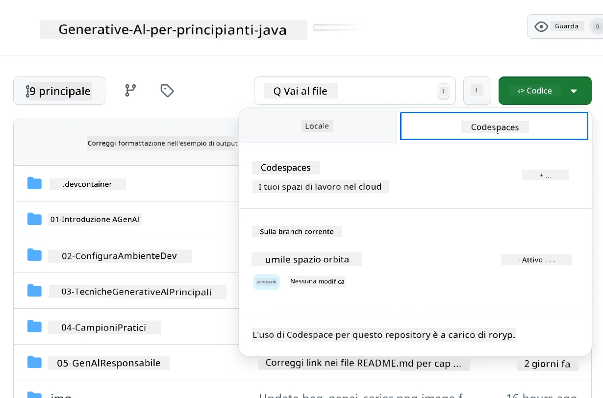
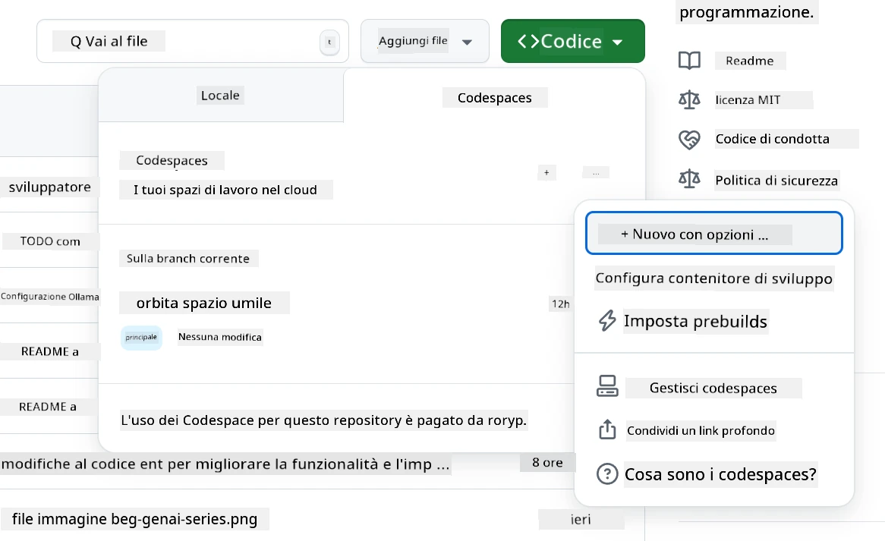
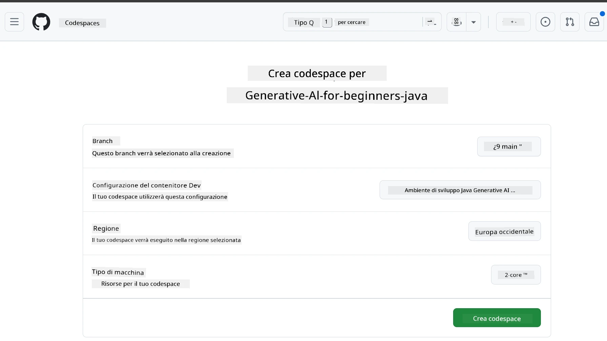
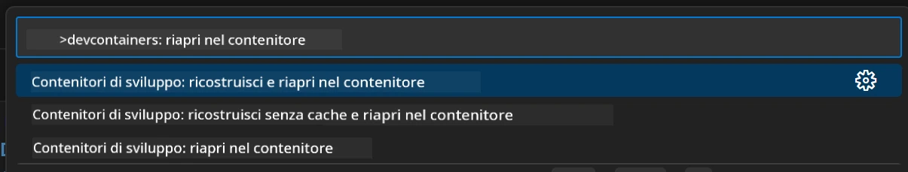
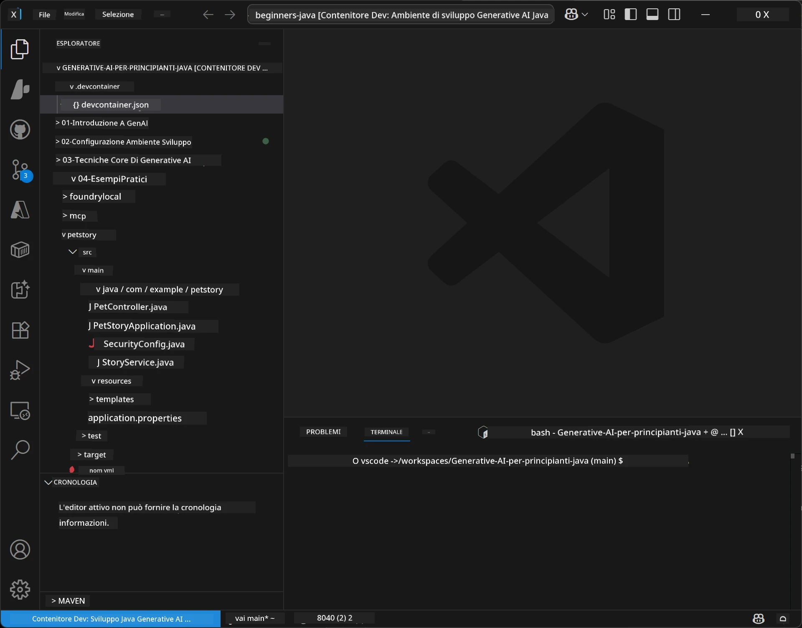
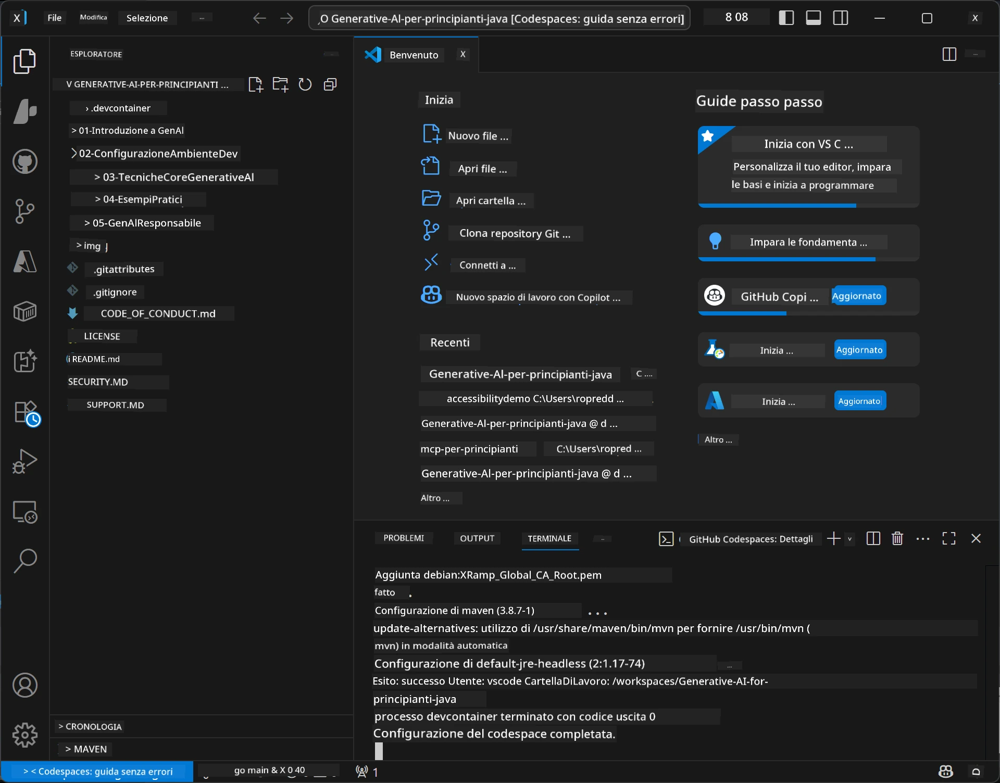

# Configurare l'ambiente di sviluppo per Generative AI per Java

> **Avvio rapido:** Provisiona i tuoi modelli AI su **Azure AI Foundry** come codice con Bicep + `azd` in pochi minuti — vedi la [Guida alla configurazione di Azure AI Foundry](getting-started-azure-openai.md). L'autenticazione è **senza chiavi** (Microsoft Entra ID), quindi non ci sono chiavi API da gestire.

## Cosa imparerai

- Configurare un ambiente di sviluppo Java per applicazioni AI
- Scegliere e configurare l'ambiente di sviluppo preferito (prima il cloud con Codespaces, contenitore di sviluppo locale o configurazione locale completa)
- Testare la configurazione connettendosi a un modello Azure AI Foundry

## Indice

- [Cosa imparerai](#cosa-imparerai)
- [Introduzione](#introduzione)
- [Passo 1: Configura il tuo ambiente di sviluppo](#passo-1-configura-il-tuo-ambiente-di-sviluppo)
  - [Opzione A: GitHub Codespaces (Consigliato)](#opzione-a-github-codespaces-consigliato)
  - [Opzione B: Contenitore di sviluppo locale](#opzione-b-contenitore-di-sviluppo-locale)
  - [Opzione C: Usa la tua installazione locale esistente](#opzione-c-usa-la-tua-installazione-locale-esistente)
- [Passo 2: Provisiona Azure AI Foundry](#passo-2-provisiona-azure-ai-foundry)
- [Passo 3: Testa la tua configurazione](#passo-3-testa-la-tua-configurazione)
- [Risoluzione dei problemi](#risoluzione-dei-problemi)
- [Riepilogo](#riepilogo)
- [Passi successivi](#passi-successivi)

## Introduzione

Questo capitolo ti guiderà nella configurazione di un ambiente di sviluppo. Useremo **Azure AI Foundry** per i modelli durante tutto il corso. Provisionerai i modelli come codice con Bicep e l'Azure Developer CLI (`azd`), quindi ti connetterai con **autenticazione senza chiavi** (Microsoft Entra ID) — niente chiavi API da copiare o perdere.

**Nessuna configurazione locale richiesta!** Puoi utilizzare GitHub Codespaces, che fornisce un ambiente di sviluppo completo nel browser, e provisionare Foundry da lì.

Utilizziamo **Azure AI Foundry** in questo corso perché è:
- **Provisionata come codice** — un solo `azd up` distribuisce l'account e i deployment del modello
- **Senza chiavi** — autenticati con il tuo accesso Azure o un'identità gestita
- **Pronta per la produzione** — lo stesso codice gira localmente e in Azure
- **Flessibile** — cambia modelli modificando il nome di un deployment, non il codice

> **Nota**: i deployment di Azure AI Foundry sono fatturati a token (pay-as-you-go). Vedi la [guida alla configurazione di Azure AI Foundry](getting-started-azure-openai.md) per dettagli su provisioning, regione e costi.


## Passo 1: Configura il tuo ambiente di sviluppo

<a name="quick-start-cloud"></a>

Abbiamo creato un contenitore di sviluppo preconfigurato per minimizzare i tempi di setup e assicurarti di avere tutti gli strumenti necessari per questo corso su Generative AI per Java. Scegli il tuo approccio di sviluppo preferito:

### Opzioni per configurare l'ambiente:

#### Opzione A: GitHub Codespaces (Consigliato)

**Inizia a programmare in 2 minuti - nessuna configurazione locale richiesta!**

1. Fai il fork di questo repository sul tuo account GitHub
   > **Nota**: se vuoi modificare la configurazione di base dai un’occhiata alla [Configurazione del Dev Container](../../../.devcontainer/devcontainer.json)
2. Clicca su **Code** → scheda **Codespaces** → **...** → **Nuovo con opzioni...**
3. Usa i valori predefiniti – questo selezionerà la **Configurazione del Dev container**: **Ambiente di sviluppo Java per Generative AI** devcontainer personalizzato creato per questo corso
4. Clicca su **Crea codespace**
5. Attendi circa 2 minuti che l'ambiente sia pronto
6. Procedi al [Passo 2: Provisiona Azure AI Foundry](#passo-2-provisiona-azure-ai-foundry)








> **Vantaggi di Codespaces**:
> - Nessuna installazione locale richiesta
> - Funziona su qualsiasi dispositivo con un browser
> - Preconfigurato con tutti gli strumenti e dipendenze
> - 60 ore gratuite al mese per account personali
> - Ambiente coerente per tutti gli studenti

#### Opzione B: Contenitore di sviluppo locale

**Per sviluppatori che preferiscono sviluppo locale con Docker**

1. Fai il fork e clona questo repository sul tuo computer locale
   > **Nota**: se vuoi modificare la configurazione di base dai un’occhiata alla [Configurazione del Dev Container](../../../.devcontainer/devcontainer.json)
2. Installa [Docker Desktop](https://www.docker.com/products/docker-desktop/) e [VS Code](https://code.visualstudio.com/)
3. Installa l'[estensione Dev Containers](https://marketplace.visualstudio.com/items?itemName=ms-vscode-remote.remote-containers) in VS Code
4. Apri la cartella del repository in VS Code
5. Quando richiesto, clicca su **Riapri in Container** (o usa `Ctrl+Shift+P` → "Dev Containers: Riapri in Container")
6. Attendi che il contenitore venga costruito e avviato
7. Procedi al [Passo 2: Provisiona Azure AI Foundry](#passo-2-provisiona-azure-ai-foundry)





#### Opzione C: Usa la tua installazione locale esistente

**Per sviluppatori con ambienti Java esistenti**

Prerequisiti:
- [Java 21+](https://www.oracle.com/java/technologies/javase/jdk21-archive-downloads.html) 
- [Maven 3.9+](https://maven.apache.org/download.cgi)
- [VS Code](https://code.visualstudio.com) o il tuo IDE preferito

Passaggi:
1. Clona questo repository sul tuo computer locale
2. Apri il progetto nel tuo IDE
3. Procedi al [Passo 2: Provisiona Azure AI Foundry](#passo-2-provisiona-azure-ai-foundry)

> **Suggerimento Professionale**: Se hai una macchina poco potente ma vuoi VS Code localmente, usa GitHub Codespaces! Puoi collegare il tuo VS Code locale a un Codespace ospitato nel cloud per avere il meglio di entrambi.




## Passo 2: Provisiona Azure AI Foundry

Distribuisci i modelli AI del corso su Azure AI Foundry come codice. Dalla radice del repository:

```bash
cd 02-SetupDevEnvironment
azd auth login
az login
azd up
```

`azd` richiede un nome per l'ambiente, la sottoscrizione e la regione, provisiona un account Azure AI Foundry con i deployment `gpt-5.6-luna` e `text-embedding-3-small`, e scrive l'endpoint nel `.env` dell'esempio - tutto con autenticazione **senza chiavi** (nessuna chiave API).

> **Guida completa:** Vedi la [Guida alla configurazione di Azure AI Foundry](getting-started-azure-openai.md) per prerequisiti, alternativa manuale (portale), linee guida sulle regioni e note su costi/pulizia.

## Passo 3: Testa la tua configurazione

Una volta che i modelli Foundry sono provisionati, testa la connessione con l'app di esempio in [`02-SetupDevEnvironment/examples/basic-chat-azure`](../../../02-SetupDevEnvironment/examples/basic-chat-azure).

1. Apri il terminale nel tuo ambiente di sviluppo.
2. Naviga all'esempio:
   ```bash
   cd 02-SetupDevEnvironment/examples/basic-chat-azure
   ```
3. Assicurati di essere autenticato (l'autenticazione senza chiavi necessita un token):
   ```bash
   az login
   ```
   > Se hai eseguito `azd up`, il file `.env` con il tuo endpoint è già stato scritto.
4. Avvia l'applicazione:
   ```bash
   mvn clean spring-boot:run
   ```

Dovresti vedere una risposta dal modello `gpt-5.6-luna`.

### Comprendere il codice di esempio

L'[esempio basic-chat](./examples/basic-chat-azure/README.md) utilizza **Spring Boot 4.1.1** e **Spring AI 2.0.1**. `ChatClient` di Spring AI si basa sull'SDK Java ufficiale OpenAI, connettendosi all'endpoint Azure OpenAI **v1** con autenticazione senza chiavi.

**Cosa fa questo codice:**
- **Si connette** a Azure AI Foundry usando il tuo login Azure (Microsoft Entra ID) — niente chiave API
- **Invia** un prompt al modello `gpt-5.6-luna`
- **Riceve** e mostra la risposta dell'AI
- **Verifica** che la configurazione funzioni correttamente

**Dipendenze chiave** (estratto da [pom.xml](../../../02-SetupDevEnvironment/examples/basic-chat-azure/pom.xml)):
```xml
<dependency>
    <groupId>org.springframework.ai</groupId>
    <artifactId>spring-ai-starter-model-openai</artifactId>
</dependency>
<dependency>
    <groupId>com.openai</groupId>
    <artifactId>openai-java</artifactId>
</dependency>
<dependency>
    <groupId>com.azure</groupId>
    <artifactId>azure-identity</artifactId>
    <version>${azure-identity.version}</version>
</dependency>
```

Il POM gestisce OpenAI Java **4.63.1** e imposta esplicitamente Azure Identity **1.18.6**. Spring AI 2 ha rimosso lo starter specifico di Azure; Azure Identity è ancora necessario per il bean delle credenziali.

**Configurazione** ([application.yml](../../../02-SetupDevEnvironment/examples/basic-chat-azure/src/main/resources/application.yml)):
```yaml
spring:
  ai:
    openai:
      base-url: ${AZURE_OPENAI_ENDPOINT}
      microsoft-foundry: true
      chat:
        model: ${AZURE_OPENAI_DEPLOYMENT:gpt-5.6-luna}
        reasoning-effort: none
        max-completion-tokens: 500
```

L'autenticazione senza chiavi è configurata esplicitamente in [BasicChatApplication.java](../../../02-SetupDevEnvironment/examples/basic-chat-azure/src/main/java/com/example/BasicChatApplication.java), non dedotta da una chiave API assente. La sua credenziale bearer usa `DefaultAzureCredential` con lo scope `https://ai.azure.com/.default`, e il suo `OpenAIClient` punta a `/openai/v1`. L'app fornisce quel client al modello chat di Spring AI, quindi una variabile globale `OPENAI_API_KEY` non può sovrascrivere l'autenticazione Azure.

Le impostazioni della chat sono direttamente sotto `spring.ai.openai.chat`, senza un blocco `options`. La lezione mantiene le Chat Completions con `reasoning-effort: none` e un limite di completamento di 500 token; non imposta `temperature` o `max-tokens`. Vedi la [documentazione di configurazione dell'esempio](./examples/basic-chat-azure/README.md#spring-configuration) per scelta API e guida sulle chiamate agli strumenti.

## Riepilogo

Dopo aver completato i passaggi sopra, avrai:

- Provisionato modelli Azure AI Foundry come codice con Bicep + `azd`
- Avviato l'ambiente di sviluppo Java (sia esso Codespaces, dev container o locale)
- Connesso a Azure AI Foundry con autenticazione senza chiavi (Microsoft Entra ID) — niente chiavi API
- Testato che tutto funzioni con un semplice esempio che parla col tuo modello

## Passi successivi

[Capitolo 3: Tecniche fondamentali di Generative AI](../03-CoreGenerativeAITechniques/README.md)

## Risoluzione dei problemi

Problemi? Ecco alcune soluzioni comuni:

- **Autenticazione fallita (401/403)?** 
  - Esegui `az login` — l'autenticazione è senza chiavi, devi essere loggato
  - Verifica che il tuo account abbia il ruolo **Cognitive Services OpenAI User** sulla risorsa
  - Se hai appena provisionato, aspetta un minuto che l'assegnazione del ruolo si propaghi

- **Maven non trovato?** 
  - Se usi dev container o Codespaces, Maven dovrebbe essere preinstallato
  - Per configurazione locale, assicurati che Java 21+ e Maven 3.9+ siano installati
  - Prova `mvn --version` per verificare l'installazione

- **`azd` non trovato o provisioning fallito?** 
  - Installa [Azure Developer CLI](https://aka.ms/azure-dev/install) e esegui `azd auth login`
  - Scegli una regione dove `gpt-5.6-luna` e `text-embedding-3-small` sono disponibili (es. `eastus2`), con quota sufficiente nella sottoscrizione selezionata
  - Consulta la [guida alla configurazione di Azure AI Foundry](getting-started-azure-openai.md) per dettagli

- **Contenitore di sviluppo non si avvia?** 
  - Assicurati che Docker Desktop sia in esecuzione (per sviluppo locale)
  - Prova a ricostruire il contenitore: `Ctrl+Shift+P` → "Dev Containers: Ricostruisci contenitore"

- **Errori di compilazione dell'applicazione?**
  - Assicurati di essere nella directory corretta: `02-SetupDevEnvironment/examples/basic-chat-azure`
  - Prova a pulire e ricostruire: `mvn clean compile`

> **Hai bisogno di aiuto?**: Ancora problemi? Apri una issue nel repository e ti aiuteremo.

---

<!-- CO-OP TRANSLATOR DISCLAIMER START -->
**Disclaimer**:
Questo documento è stato tradotto utilizzando il servizio di traduzione AI [Co-op Translator](https://github.com/Azure/co-op-translator). Sebbene ci impegniamo per garantire la precisione, si prega di notare che le traduzioni automatizzate possono contenere errori o imprecisioni. Il documento originale nella sua lingua nativa deve essere considerato la fonte autorevole. Per informazioni critiche, si raccomanda una traduzione professionale effettuata da un essere umano. Non siamo responsabili per eventuali malintesi o interpretazioni errate derivanti dall’uso di questa traduzione.
<!-- CO-OP TRANSLATOR DISCLAIMER END -->