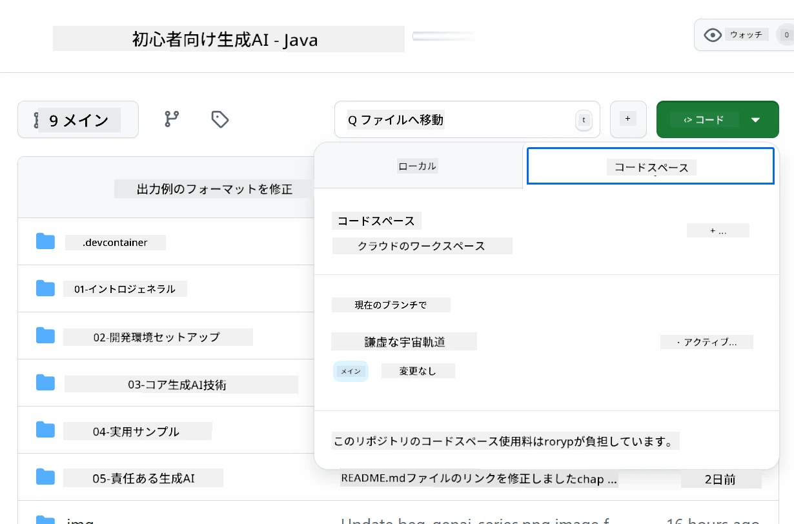
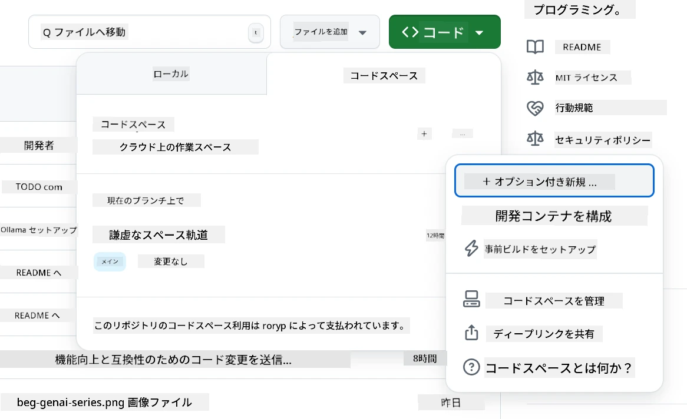
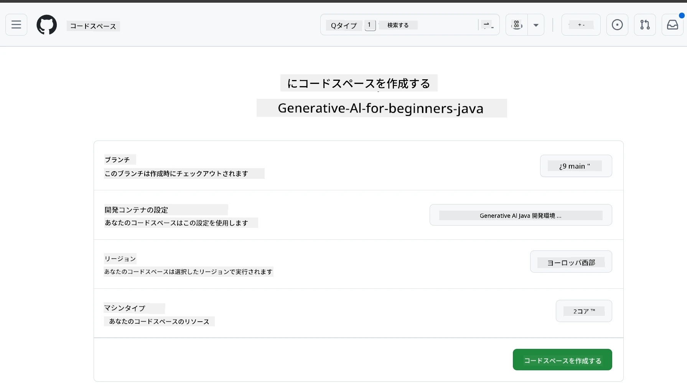
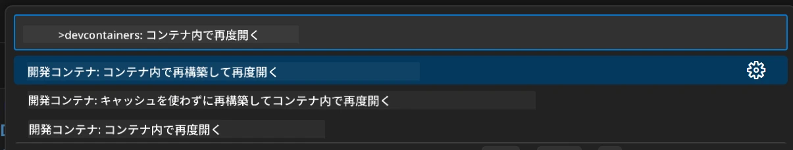
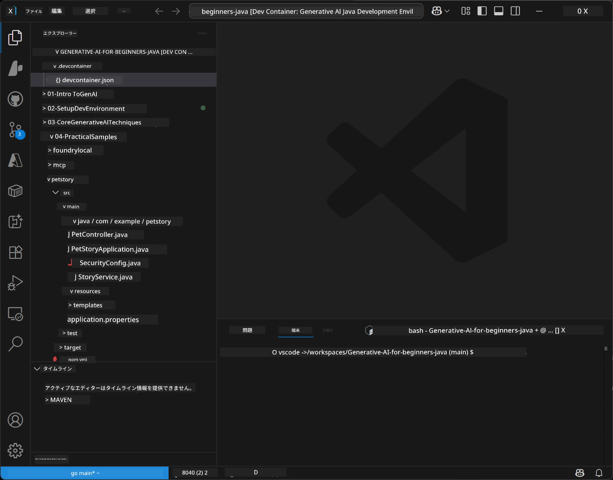
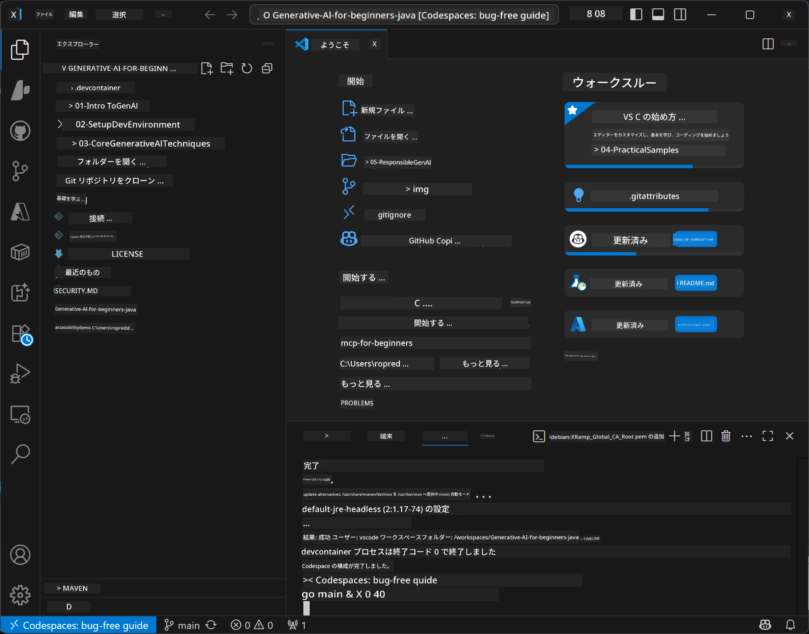

# Generative AI for Java の開発環境のセットアップ

> **クイックスタート：** Bicep + `azd` でコードとして数分で **Azure AI Foundry** に AI モデルをプロビジョニング — 詳細は [Azure AI Foundry Setup Guide](getting-started-azure-openai.md) を参照。認証は <strong>キー不要</strong>（Microsoft Entra ID）なので、API キーの管理は不要です。

## 何が学べるか

- AI アプリケーション向けの Java 開発環境をセットアップ
- 好みの開発環境（クラウド主体の Codespaces、ローカルの開発コンテナ、フルローカルセットアップ）を選択して設定
- Azure AI Foundry モデルに接続してセットアップをテスト

## 目次

- [何が学べるか](#何が学べるか)
- [はじめに](#はじめに)
- [ステップ 1: 開発環境のセットアップ](#ステップ-1-開発環境をセットアップする)
  - [オプション A: GitHub Codespaces（推奨）](#オプション-a-github-codespaces（推奨）)
  - [オプション B: ローカル開発コンテナ](#オプション-b-ローカル開発コンテナ)
  - [オプション C: 既存のローカル環境を使う](#オプション-c-既存のローカル環境を使う)
- [ステップ 2: Azure AI Foundry のプロビジョニング](#ステップ-2-azure-ai-foundry-のプロビジョニング)
- [ステップ 3: セットアップのテスト](#ステップ-3-セットアップのテスト)
- [トラブルシューティング](#トラブルシューティング)
- [まとめ](#まとめ)
- [次のステップ](#次のステップ)

## はじめに

本章では開発環境のセットアップを案内します。このコース全体でモデルには **Azure AI Foundry** を使います。モデルを Bicep と Azure Developer CLI (`azd`) でコードとしてプロビジョニングし、<strong>キー不要認証</strong>（Microsoft Entra ID）で接続します — API キーをコピーしたり漏らしたりする必要はありません。

**ローカルセットアップの必要なし！** ブラウザ内でフルの開発環境を提供する GitHub Codespaces を使い、そこで Foundry をプロビジョニングできます。

このコースで **Azure AI Foundry** を使う理由は：
- <strong>コードとしてプロビジョニング可能</strong> — たった一度の `azd up` でアカウントとモデル配置をデプロイ
- <strong>キー不要</strong> — Azure サインインまたはマネージド ID で認証
- <strong>本番対応</strong> — 同じコードがローカルでも Azure 上でも動作
- <strong>柔軟</strong> — コードを書き換えずにデプロイ名を変えるだけでモデル差し替え可能

> <strong>注意</strong>: Azure AI Foundry のデプロイはトークン単位の従量課金制です。プロビジョニング、地域、コストの詳細は [Azure AI Foundry setup guide](getting-started-azure-openai.md) を参照してください。


## ステップ 1: 開発環境をセットアップする

<a name="quick-start-cloud"></a>

Generative AI for Java コースに必要なすべてのツールが揃った事前設定済み開発コンテナを用意しました。セットアップ時間を短縮できます。好みの開発方法を選択してください：

### 環境セットアップの選択肢：

#### オプション A: GitHub Codespaces（推奨）

**2分でコーディング開始 - ローカルセットアップ不要！**

1. このリポジトリをあなたの GitHub アカウントにフォーク
   > <strong>注意</strong>: 基本設定を編集したい場合は [Dev Container Configuration](../../../.devcontainer/devcontainer.json) を参照してください
2. **Code** → **Codespaces** タブ → **...** → **New with options...** をクリック
3. デフォルトを使う — これによりこのコース用の **Generative AI Java Development Environment** カスタム devcontainer 設定が選択されます
4. **Create codespace** をクリック
5. 約2分待って環境の準備完了を待つ
6. [ステップ 2: Azure AI Foundry のプロビジョニング](#ステップ-2-azure-ai-foundry-のプロビジョニング) に進む








> **Codespacesのメリット**:
> - ローカルインストール不要
> - ブラウザ対応の任意のデバイスで動作
> - すべてのツールと依存関係が事前設定済み
> - 個人アカウントは月 60 時間無料
> - 全受講者に一貫した環境提供

#### オプション B: ローカル開発コンテナ

**Docker を使ったローカル開発を好む開発者向け**

1. このリポジトリをフォークしてローカルマシンにクローン
   > <strong>注意</strong>: 基本設定を編集したい場合は [Dev Container Configuration](../../../.devcontainer/devcontainer.json) を参照してください
2. [Docker Desktop](https://www.docker.com/products/docker-desktop/) と [VS Code](https://code.visualstudio.com/) をインストール
3. VS Code に [Dev Containers 拡張機能](https://marketplace.visualstudio.com/items?itemName=ms-vscode-remote.remote-containers) をインストール
4. VS Codeでリポジトリフォルダを開く
5. プロンプトが出たら **Reopen in Container** をクリック（または `Ctrl+Shift+P` → 「Dev Containers: Reopen in Container」）
6. コンテナのビルドと起動が完了するのを待つ
7. [ステップ 2: Azure AI Foundry のプロビジョニング](#ステップ-2-azure-ai-foundry-のプロビジョニング) に進む





#### オプション C: 既存のローカル環境を使う

**既存の Java 環境がある開発者向け**

前提条件：
- [Java 21+](https://www.oracle.com/java/technologies/javase/jdk21-archive-downloads.html) 
- [Maven 3.9+](https://maven.apache.org/download.cgi)
- [VS Code](https://code.visualstudio.com) または好みの IDE

手順：
1. このリポジトリをローカルにクローン
2. IDEでプロジェクトを開く
3. [ステップ 2: Azure AI Foundry のプロビジョニング](#ステップ-2-azure-ai-foundry-のプロビジョニング) に進む

> <strong>プロのヒント</strong>: 低スペックなマシンでもローカルで VS Code を使いたい場合は GitHub Codespaces を使用！ローカルの VS Code からクラウドホストされた Codespace に接続して両方の利点を活かせます。




## ステップ 2: Azure AI Foundry のプロビジョニング

このコースの AI モデルを Azure AI Foundry にコードとしてデプロイします。リポジトリのルートから：

```bash
cd 02-SetupDevEnvironment
azd auth login
az login
azd up
```

`azd` は環境名、サブスクリプション、リージョンを尋ね、`gpt-5.6-luna` と `text-embedding-3-small` のデプロイがある Azure AI Foundry アカウントをプロビジョニングし、エンドポイントを例の `.env` に書き込みます — すべて <strong>キー不要</strong> 認証（API キー不要）で行います。

> **詳細な手順:** 前提条件、手動（ポータル）代替、地域の推奨、費用・クリーンアップの注意点は [Azure AI Foundry Setup Guide](getting-started-azure-openai.md) を参照。

## ステップ 3: セットアップのテスト

Foundry モデルのプロビジョニング完了後、[`02-SetupDevEnvironment/examples/basic-chat-azure`](../../../02-SetupDevEnvironment/examples/basic-chat-azure) の例アプリで接続をテストします。

1. 開発環境でターミナルを開く
2. 例に移動：
   ```bash
   cd 02-SetupDevEnvironment/examples/basic-chat-azure
   ```
3. サインイン済みか確認（キー不要認証はトークンが必要）：
   ```bash
   az login
   ```
   > `azd up` を実行していれば、エンドポイント入りの `.env` は既に書き込まれています。
4. アプリケーションを起動：
   ```bash
   mvn clean spring-boot:run
   ```

`gpt-5.6-luna` モデルからの応答が表示されるはずです。

### 例コードの理解

[basic-chat の例](./examples/basic-chat-azure/README.md) は **Spring Boot 4.1.1** と **Spring AI 2.0.1** を使用。Spring AI の `ChatClient` は公式 OpenAI Java SDK に基づき、Azure OpenAI **v1** エンドポイントへキー不要認証で接続します。

**このコードの動作：**
- Azure AI Foundry に Azure サインイン（Microsoft Entra ID）で接続 — API キー不要
- `gpt-5.6-luna` モデルにプロンプトを送信
- AI の応答を受信して表示
- セットアップが正しく動作していることを検証

<strong>主な依存関係</strong>（[pom.xml](../../../02-SetupDevEnvironment/examples/basic-chat-azure/pom.xml) の抜粋）：
```xml
<dependency>
    <groupId>org.springframework.ai</groupId>
    <artifactId>spring-ai-starter-model-openai</artifactId>
</dependency>
<dependency>
    <groupId>com.openai</groupId>
    <artifactId>openai-java</artifactId>
</dependency>
<dependency>
    <groupId>com.azure</groupId>
    <artifactId>azure-identity</artifactId>
    <version>${azure-identity.version}</version>
</dependency>
```

POM は OpenAI Java **4.63.1** と Azure Identity **1.18.6** を明示的に管理。Spring AI 2 は Azure 専用スターターを削除しましたが、認証用のクレデンシャル Bean に Azure Identity は必須。

<strong>設定</strong>（[application.yml](../../../02-SetupDevEnvironment/examples/basic-chat-azure/src/main/resources/application.yml)）：
```yaml
spring:
  ai:
    openai:
      base-url: ${AZURE_OPENAI_ENDPOINT}
      microsoft-foundry: true
      chat:
        model: ${AZURE_OPENAI_DEPLOYMENT:gpt-5.6-luna}
        reasoning-effort: none
        max-completion-tokens: 500
```

キー不要認証は [BasicChatApplication.java](../../../02-SetupDevEnvironment/examples/basic-chat-azure/src/main/java/com/example/BasicChatApplication.java) で明示的に設定され、API キーなしから推測される形式ではありません。ベアラー認証は `DefaultAzureCredential` を使い、スコープは `https://ai.azure.com/.default`、`OpenAIClient` は `/openai/v1` をターゲットに。アプリはこのクライアントを Spring AI のチャットモデルに渡すため、グローバルな `OPENAI_API_KEY` は Azure 認証を上書きできません。

チャット設定は `spring.ai.openai.chat` の直下にあり、`options` ブロックはなし。講義は `reasoning-effort: none`、500 トークンまでのチャット完了制限を保持しつつ、`temperature` や `max-tokens` は明示しません。API 選択やツール呼び出しの詳細は [例の設定リファレンス](./examples/basic-chat-azure/README.md#spring-configuration) を参照。

## まとめ

上記の手順を完了すると、以下ができるようになります：

- Bicep + `azd` でコードとして Azure AI Foundry モデルをプロビジョニング
- Java 開発環境が稼働（Codespaces、開発コンテナ、ローカルいずれでも可）
- キー不要認証（Microsoft Entra ID）で Azure AI Foundry に接続 — API キー不要
- 簡単な例でモデルとの通信ができることを確認

## 次のステップ

[第3章: Core Generative AI Techniques](../03-CoreGenerativeAITechniques/README.md)

## トラブルシューティング

問題がある場合の一般的な問題と解決策：

- **認証が失敗する（401/403）？** 
  - `az login` を実行 — 認証はキー不要なのでサインインが必要
  - リソースに対してアカウントに **Cognitive Services OpenAI User** ロールがあるか確認
  - プロビジョニング直後の場合、役割割当が反映されるまで少し待つ

- **Maven が見つからない？** 
  - 開発コンテナ/Codespaces なら Maven はプリインストール済みのはず
  - ローカルセットアップの場合は Java 21+ と Maven 3.9+ がインストールされているか確認
  - `mvn --version` でインストールを確認

- **`azd` が見つからない、またはプロビジョニングに失敗？** 
  - [Azure Developer CLI](https://aka.ms/azure-dev/install) をインストールし、`azd auth login` を実行
  - `gpt-5.6-luna` と `text-embedding-3-small` が使えるリージョン（例: `eastus2`）を選び、サブスクリプションのクォータに余裕があるか確認
  - 詳細は [Azure AI Foundry setup guide](getting-started-azure-openai.md) を参照

- **開発コンテナが起動しない？** 
  - Docker Desktop が起動しているか確認（ローカル開発の場合）
  - コンテナを再ビルドしてみる：`Ctrl+Shift+P` → 「Dev Containers: Rebuild Container」

- **アプリケーションのコンパイルエラー？**
  - 正しいディレクトリにいるか確認：`02-SetupDevEnvironment/examples/basic-chat-azure`
  - クリーンと再ビルドを試す：`mvn clean compile`

> **サポートが必要ですか？**: それでも問題がある場合は、リポジトリで issue を開いてください。対応します。

---

<!-- CO-OP TRANSLATOR DISCLAIMER START -->
**免責事項**：
本書類は AI 翻訳サービス [Co-op Translator](https://github.com/Azure/co-op-translator) を使用して翻訳されています。正確性を期していますが、自動翻訳には誤りや不正確な部分が含まれる可能性があることをご承知おきください。原文の原語版が正式な情報源とみなされるべきです。重要な情報については、専門の人間による翻訳を推奨します。本翻訳の利用により生じたいかなる誤解や解釈違いについても、当方は責任を負いかねます。
<!-- CO-OP TRANSLATOR DISCLAIMER END -->