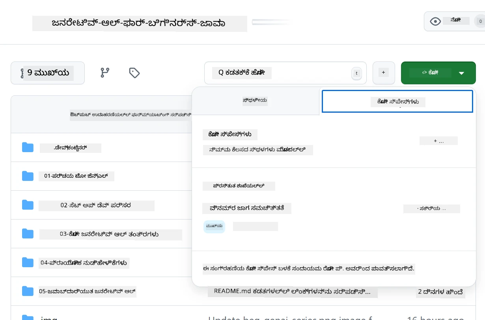
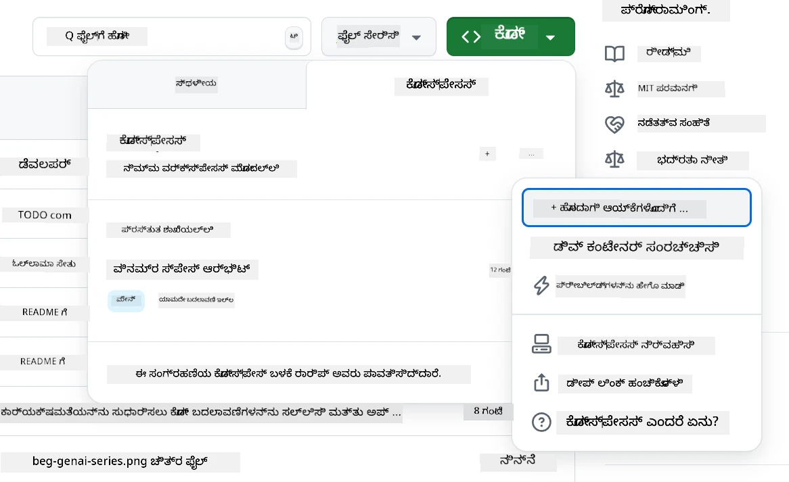
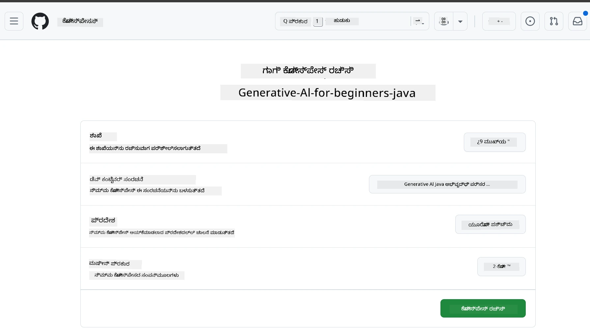
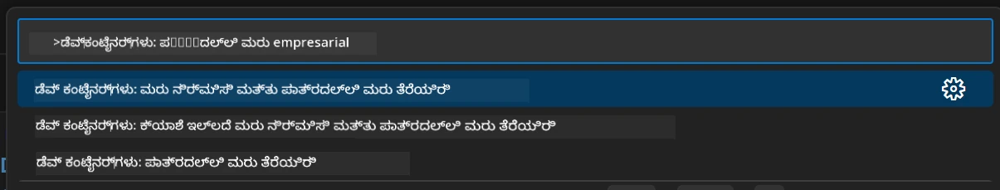
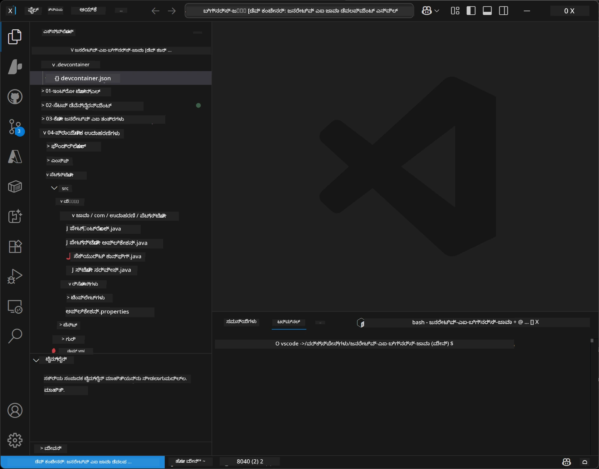
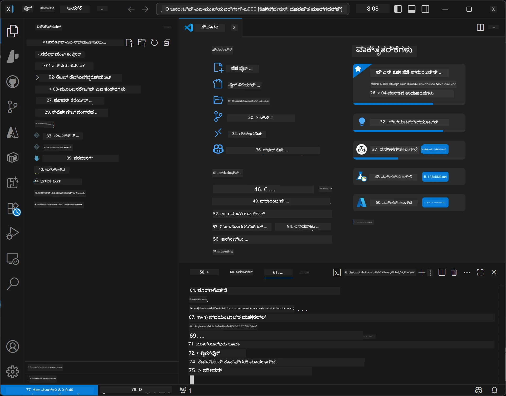

# ಜನರೇಟಿವ್ AI ಫಾರ್ ಜಾವಾ ಗೆ ಡೆವಲಪ್‌ಮೆಂಟ್ ಪರಿಸರ ವ್ಯವಸ್ಥೆ

> **ತ್ವರಿತ ಪ್ರಾರಂಭ:** ನಿಮ್ಮ AI ಮಾದರಿಗಳನ್ನು ಕೆಲವು ನಿಮಿಷಗಳಲ್ಲಿ Bicep + `azd` ಬಳಸಿ **Azure AI Foundry** ನಲ್ಲಿ ಕೋಡ್ ರೂಪದಲ್ಲಿ ಪ್ರೋವಿಷನ್ ಮಾಡಿ — [Azure AI Foundry ಸೆಟಪ್ ಗೈಡ್](getting-started-azure-openai.md) ನೋಡಿ. ಪ್ರಾಮಾಣೀಕರಣ **ಕೀಲೇಸ್** (Microsoft Entra ID) ಆಗಿದ್ದು, API ಕೀಗಳನ್ನು ನಿರ್ವಹಿಸಲು ಬೇಡ.

## ನೀವು ಕಲಿಯಬಲ್ಲದ್ದು

- AI ಅಪ್ಲಿಕೇಶನ್‌ಗಳಿಗೆ ಜಾವಾ ಡೆವಲಪ್‌ಮೆಂಟ್ ಪರಿಸರವನ್ನು ಅಳವಡಿಸಿಕೊಳ್ಳುವುದು
- ನೀವು ಇಚ್ಛಿಸುವ ಡೆವಲಪ್‌ಮೆಂಟ್ ಪರಿಸರವನ್ನು ಆಯ್ಕೆಮಾಡಿ ಕಾನ್ಫಿಗರ್ ಮಾಡಿಕೊಳ್ಳುವುದು (Codespaces ಮೂಲಕ ಕ್ಲೌಡ್-ಮೊದಲು, ಸ್ಥಳೀಯ ಡೆವ್ ಕಂಟೈನರ್, ಅಥವಾ ಸಂಪೂರ್ಣ ಸ್ಥಳೀಯ ಸೆಟಪ್)
- ನಿಮ್ಮ ಸೆಟಪ್ ಅನ್ನು Azure AI Foundry ಮಾದರಿಯೊಂದಿಗೆ ಸಂಪರ್ಕಿಸಿ ಪರೀಕ್ಷಿಸುವುದು

## ವಿಷಯ ಸೂಚಿ

- [ನೀವು ಕಲಿಯುವದ್ದು](#ನೀವು-ಕಲಿಯಬಲ್ಲದ್ದು)
- [ಪರಿಚಯ](#ಪರಿಚಯ)
- [ಹಂತ 1: ನಿಮ್ಮ ಡೆವಲಪ್‌ಮೆಂಟ್ ಪರಿಸರವನ್ನು ಅಳವಡಿಸಿಕೊಳ್ಳಿ](#ಹಂತ-1-ನಿಮ್ಮ-ಡೆವಲಪ್‌ಮೆಂಟ್-ಪರಿಸರವನ್ನು-ಅಳವಡಿಸಿಕೊಳ್ಳಿ)
  - [ಐಚ್ಛಿಕ A: GitHub Codespaces (ಶಿಫಾರಸು ಮಾಡಲಾಗಿದೆ)](#ಆಯ್ಕೆಯ-a-github-codespaces-ಶಿಫಾರಸು-ಮಾಡಲಾಗಿದೆ)
  - [ಐಚ್ಛಿಕ B: ಸ್ಥಳೀಯ ಡೆವ್ ಕಂಟೈನರ್](#ಆಯ್ಕೆಯ-b-ಸ್ಥಳೀಯ-ಡೆವ್-ಕಂಟೈನರ್)
  - [ಐಚ್ಛಿಕ C: ನಿಮ್ಮ ಇತ್ತೀಚೆಗೆ ಇರುವ ಸ್ಥಳೀಯ ಇನ್‌ಸ್ಟಾಲ್‌ನ್ನು ಬಳಸಿ](#ಆಯ್ಕೆಯ-c-ನಿಮ್ಮ-ಇತ್ತೀಚೆಗೆ-ಇರುವ-ಸ್ಥಳೀಯ-ಇನ್‌ಸ್ಟಾಲ್-ಬಳಸಿ)
- [ಹಂತ 2: Azure AI Foundry ಪ್ರೋವಿಷನ್ ಮಾಡಿ](#ಹಂತ-2-azure-ai-foundry-ಪ್ರೋವಿಷನ್-ಮಾಡಿ)
- [ಹಂತ 3: ನಿಮ್ಮ ಸೆಟಪ್ ಅನ್ನು ಪರೀಕ್ಷಿಸಿ](#ಹಂತ-3-ನಿಮ್ಮ-ಸೆಟಪ್-ಪರೀಕ್ಷಿಸಿ)
- [ಸಮಸ್ಯೆಗಳ ಪರಿಹಾರ](#ಸಮಸ್ಯೆಗಳು-ಮತ್ತು-ಪರಿಹಾರಗಳು)
- [ಸಾರಾಂಶ](#ಸಾರಾಂಶ)
- [ಮುಂದಿನ ಹಂತಗಳು](#ಮುಂದಿನ-ಹಂತಗಳು)

## ಪರಿಚಯ

ಈ ಅಧ್ಯಾಯವು ನಿಮಗೆ ಡೆವಲಪ್‌ಮೆಂಟ್ ಪರಿಸರವನ್ನು ಅಳವಡಿಸಿಕೊಳ್ಳುವುದಾಗಿ ಮಾರ್ಗದರ್ಶನ ನೀಡುತ್ತದೆ. ಈ ಕೋರ್ಸ್‌ನಲ್ಲಿ ಮಾದರಿಗಳಿಗಾಗಿ ನಾವು **Azure AI Foundry** ಅನ್ನು ಬಳಸುತ್ತೇವೆ. ನೀವು Bicep ಮತ್ತು Azure ಡೆವಲಪರ್ CLI (`azd`) ಮೂಲಕ ಮಾದರಿಗಳನ್ನು ಕೋಡ್ ರೂಪದಲ್ಲಿ ಪ್ರೋವಿಷನ್ ಮಾಡುತ್ತೀರಿ, ನಂತರ **ಕೀಲೇಸ್ ಪ್ರಾಮಾಣೀಕರಣ** (Microsoft Entra ID) ಮೂಲಕ ಸಂಪರ್ಕ ಮಾಡುತ್ತೀರಿ — API ಕೀಗಳನ್ನು ನಕಲಿಸುವ ಅಥವಾ ಹಂಚಿಕೊಳ್ಳುವ ಅಗತ್ಯವಿಲ್ಲ.

**ಯಾವುದೇ ಸ್ಥಳೀಯ ಸೆಟಪ್ ಅಗತ್ಯವಿಲ್ಲ!** ನೀವು GitHub Codespaces ಬಳಸಿ, ಅದು ನಿಮ್ಮ ಬ್ರೌಸರ್‌ನಲ್ಲಿ ಪೂರ್ಣ ಡೆವಲಪ್‌ಮೆಂಟ್ ಪರಿಸರವನ್ನು ಒದಗಿಸುತ್ತದೆ ಮತ್ತು ಅಲ್ಲಿ ಇಂದೇ Foundry ಪ್ರೋವಿಷನ್ ಮಾಡಬಹುದು.

ನಾವು ಈ ಕೋರ್ಸ್‌ಗಾಗಿ **Azure AI Foundry** ಅನ್ನು ಬಳಸುತ್ತೇವೆ ಏಕೆಂದರೆ ಅದು:
- **ಕೋಡ್ ರೂಪದಲ್ಲಿ ಪ್ರೋವಿಷನ್ ಆಗುತ್ತದೆ** — ಒಂದೇ `azd up` ಆಗ್ಯೂಂಟ್ ಮತ್ತು ಮಾದರಿ ಪ್ರೊವಿಷನ್‌ಗಳನ್ನು ಡಿಪ್ಲಾಯ್ ಮಾಡುತ್ತದೆ
- **ಕೀಲೇಸ್** — ನಿಮ್ಮ Azure ಸೈನ್-ಇನ್ ಅಥವಾ ಮ್ಯಾನೇಜ್ಡ್ ಐಡೆಂಟಿಟಿಯಿಂದ ಪ್ರಾಮಾಣೀಕರಿಸುತ್ತದೆ
- **ಪ್ರೊಡಕ್ಷನ್-ತಯಾರಾಗಿರುವುದು** — ಇದೇ ಕೋಡ್ ಸ್ಥಳೀಯ ಮತ್ತು Azure ಎರಡಕ್ಕೂ ಓದುತ್ತದೆ
- **ತೈಲಮಯತೆ** — ನಿಮ್ಮ ಕೋಡ್ ಬದಲಿಸದೆ ಕೇವಲ ಡಿಪ್ಲಾಯ್‌ಮೆಂಟ್ ಹೆಸರು ಬದಲಾವಣೆಮಾಡಿ ಮಾದರಿಗಳನ್ನು ಬದಲಾಯಿಸಬಹುದು

> **ಗಮನಿಸಿ**: Azure AI Foundry ಡಿಪ್ಲಾಯ್‌ಮೆಂಟ್‌ಗಳಿಗೆ ಟೋಕನ್ ಪ್ರತಿ ಬಿಲ್ ಬರುತ್ತದೆ (ಪೇ-ಅಸ್-ಯೂ-ಗೋ). ಪ್ರೋವಿಷನಿಂಗ್, ಪ್ರದೇಶ ಮತ್ತು ವೆಚ್ಚದ ವಿವರಗಳಿಗಾಗಿ [Azure AI Foundry ಸೆಟಪ್ ಗೈಡ್](getting-started-azure-openai.md) ನೋಡಿ.


## ಹಂತ 1: ನಿಮ್ಮ ಡೆವಲಪ್‌ಮೆಂಟ್ ಪರಿಸರವನ್ನು ಅಳವಡಿಸಿಕೊಳ್ಳಿ

<a name="quick-start-cloud"></a>

ನಾವು ಪೂರ್ವನಿರ್ಧರಿತ ಡೆವಲಪರ್ ಕಂಟೈನರ್ ಅನ್ನು ಸೃಷ್ಟಿಸಿಕೊಂಡಿದ್ದೇವೆ, ಇದರಿಂದ ಸೆಟಪ್ ವೇಳೆಯನ್ನು ಕಡಿಮೆ ಮಾಡಿ ಈ ಜನರೇಟಿವ್ AI ಫಾರ್ ಜಾವಾ ಕೋರ್ಸ್‌ಗೆ ಅಗತ್ಯವಿರುವ ಎಲ್ಲಾ ಸಾಧನಗಳನ್ನು ಹೊಂದಿರುತ್ತೀರಿ. ನಿಮ್ಮ ಇಚ್ಛಿತ ಡೆವಲಪ್‌ಮೆಂಟ್ ವಿಧಾನವನ್ನು ಆಯ್ಕೆಮಾಡಿ:

### ಪರಿಸರ ಸೆಟಪ್ ಆಯ್ಕೆಗಳು:

#### ಆಯ್ಕೆಯ A: GitHub Codespaces (ಶಿಫಾರಸು ಮಾಡಲಾಗಿದೆ)

**2 ನಿಮಿಷಗಳಲ್ಲಿ ಕೋಡ್ ಮಾಡಲು ಪ್ರಾರಂಭಿಸಿ - ಯಾವುದೇ ಸ್ಥಳೀಯ ಸೆಟಪ್ ಅಗತ್ಯವಿಲ್ಲ!**

1. ಈ ರಿಪೊಸಿಟರಿಯನ್ನು ನಿಮ್ಮ GitHub ಖಾತೆಗೆ ಫೋರ್ಕ್ ಮಾಡಿ
   > **ಗಮನಿಸಿ**: ನೀವು ಮೂಲ ಸಂರಚನೆಯನ್ನು ತಿದ್ದುಪಡಿ ಮಾಡಬೇಕಾದರೆ ದಯವಿಟ್ಟು [Dev Container Configuration](../../../.devcontainer/devcontainer.json) ನೋಡಿ
2. ಕ್ಲಿಕ್ ಮಾಡಿ **Code** → **Codespaces** ಟ್ಯಾಬ್ → **...** → **New with options...**
3. ಡೀಫಾಲ್ಟ್ ಆಯ್ಕೆಗಳು ಬಳಸಿ – ಇದರಿಂದ ಈ ಕೋರ್ಸ್‌ಗೆ ಸೃಷ್ಟಿಸಲಾದ **Dev container configuration: Generative AI Java Development Environment** ಆಯ್ಕೆಮಾಡಲ್ಪಡುತ್ತದೆ
4. ಕ್ಲಿಕ್ ಮಾಡಿ **Create codespace**
5. ~2 ನಿಮಿಷಗಳ ಕಾಲ ಪರಿಸರ ಸಿದ್ಧವಾಗಲು ಕಾಯಿರಿ
6. ಮುಂದುವರಿಯಿರಿ [ಹಂತ 2: Azure AI Foundry ಪ್ರೋವಿಷನ್ ಮಾಡಿ](#ಹಂತ-2-azure-ai-foundry-ಪ್ರೋವಿಷನ್-ಮಾಡಿ)








> **Codespaces ನ ಲಾಭಗಳು**:
> - ಯಾವುದೇ ಸ್ಥಳೀಯ ಇನ್‌ಸ್ಟಾಲ್ ಅಗತ್ಯವಿಲ್ಲ
> - ಎಲ್ಲಿ ಬರುವುದಾದರೂ ಬ್ರೌಸರ್ ಹೊಂದಿರುವ ಸಾಧನದಲ್ಲಿ ಕೆಲಸ ಮಾಡುತ್ತದೆ
> - ಎಲ್ಲಾ ಸಾಧನಗಳು ಮತ್ತು ಅವಲಂಬನೆಗಳೊಂದಿಗೆ ಪೂರ್ವ-ಕಾನ್ಫಿಗರ್ ಆಗಿದೆ
> - ವೈಯಕ್ತಿಕ ಖಾತೆಗಳಿಗೆ ತಿಂಗಳಿಗೆ ಉಚಿತ 60 ಗಂಟೆಗಳು
> - ಎಲ್ಲಾ ಕಲಿಯುವವರಿಗೆ ಸಮಾನ ಪರಿಸರ

#### ಆಯ್ಕೆಯ B: ಸ್ಥಳೀಯ ಡೆವ್ ಕಂಟೈನರ್

**ಡಾಕರ್ ಬಳಸಿ ಸ್ಥಳೀಯ ಡೆವಲಪ್‌ಮೆಂಟ್ ಬಯಸುವ ಡೆವಲಪರ್‌ಗಳಿಗೆ**

1. ಈ ರಿಪೊಸಿಟರಿಯನ್ನು ಫೋರ್ಕ್ ಮಾಡಿ ಮತ್ತು ನಿಮ್ಮ ಸ್ಥಳೀಯ ಯಂತ್ರಕ್ಕೆ ಕ್ಲೋನ್ ಮಾಡಿ
   > **ಗಮನಿಸಿ**: ನೀವು ಮೂಲ ಸಂರಚನೆಯನ್ನು ತಿದ್ದುಪಡಿ ಮಾಡಬೇಕಾದರೆ ದಯವಿಟ್ಟು [Dev Container Configuration](../../../.devcontainer/devcontainer.json) ನೋಡಿ
2. [Docker Desktop](https://www.docker.com/products/docker-desktop/) ಮತ್ತು [VS Code](https://code.visualstudio.com/) ಅನ್ನು ಇನ್‌ಸ್ಟಾಲ್ ಮಾಡಿ
3. VS Code ನಲ್ಲಿ [Dev Containers ವಿಸ್ತರಣೆ](https://marketplace.visualstudio.com/items?itemName=ms-vscode-remote.remote-containers) ಅನ್ನು ಇನ್‌ಸ್ಟಾಲ್ ಮಾಡಿ
4. ರಿಪೊಸಿಟರಿ ಫೋಲ್ಡರ್ ಅನ್ನು VS Code ನಲ್ಲಿ ತೆರೆಯಿರಿ
5. ಪ್ರಾಂಪ್ಟ್ ಬಂದಾಗ, **Reopen in Container** ಮೇಲೆ ಕ್ಲಿಕ್ ಮಾಡಿ (ಅಥವಾ `Ctrl+Shift+P` → "Dev Containers: Reopen in Container" ಬಳಸಿರಿ)
6. ಕಂಟೈನರ್ ನಿರ್ಮಾಣ ಮತ್ತು ಪ್ರಾರಂಭವಾಗಲು ಕಾಯಿರಿ
7. ಮುಂದುವರಿಯಿರಿ [ಹಂತ 2: Azure AI Foundry ಪ್ರೋವಿಷನ್ ಮಾಡಿ](#ಹಂತ-2-azure-ai-foundry-ಪ್ರೋವಿಷನ್-ಮಾಡಿ)





#### ಆಯ್ಕೆಯ C: ನಿಮ್ಮ ಇತ್ತೀಚೆಗೆ ಇರುವ ಸ್ಥಳೀಯ ಇನ್‌ಸ್ಟಾಲ್ ಬಳಸಿ

**ಇದೆಗಿನ ಜಾವಾ ಪರಿಸರಗಳೊಂದಿಗೆ ಡೆವಲಪರ್‌ಗಳಿಗೆ**

ಪೂರ್ವಾಪೇಕ್ಷಿತಗಳು:
- [Java 21+](https://www.oracle.com/java/technologies/javase/jdk21-archive-downloads.html) 
- [Maven 3.9+](https://maven.apache.org/download.cgi)
- [VS Code](https://code.visualstudio.com) ಅಥವಾ ನಿಮ್ಮ ಇಚ್ಛಿತ IDE

ಹಂತಗಳು:
1. ಈ ರಿಪೊಸಿಟರಿಯನ್ನು ನಿಮ್ಮ ಸ್ಥಳೀಯ ಯಂತ್ರಕ್ಕೆ ಕ್ಲೋನ್ ಮಾಡಿ
2. ಪ್ರಾಜೆಕ್ಟ್ ಅನ್ನು ನಿಮ್ಮ IDE ನಲ್ಲಿ ತೆರೆಯಿರಿ
3. ಮುಂದುವರಿಯಿರಿ [ಹಂತ 2: Azure AI Foundry ಪ್ರೋವಿಷನ್ ಮಾಡಿ](#ಹಂತ-2-azure-ai-foundry-ಪ್ರೋವಿಷನ್-ಮಾಡಿ)

> **ಪ್ರೋ ಟಿಪ್**: ನಿಮ್ಮ ಯಂತ್ರದ ವಿಶಿಷ್ಟ ಶಕ್ತಿ ಕಡಿಮೆ ಆದರೆ ಸ್ಥಳೀಯವಾಗಿ VS Code ಬಯಸುವಿದ್ದರೆ GitHub Codespaces ಬಳಸಿ! ನೀವು ನಿಮ್ಮ ಸ್ಥಳೀಯ VS Code ಅನ್ನು ಕ್ಲೌಡ್-ಹೋಸ್ಟ್ ಮಾಡಲಾದ Codespace ಗೆ ಸಂಪರ್ಕಿಸಬಹುದು, ಇದರ ಜೊತೆಗೆ ಇಬ್ಬರ ಉತ್ತಮ ಅನುಭವ ಪಡೆಯಬಹುದು.




## ಹಂತ 2: Azure AI Foundry ಪ್ರೋವಿಷನ್ ಮಾಡಿ

ಕೋರ್ಸ್‌ನ AI ಮಾದರಿಗಳನ್ನು ಕೋಡ್ ರೂಪದಲ್ಲಿ Azure AI Foundry ಗೆ ಡಿಪ್ಲಾಯ್ ಮಾಡಿ. ರಿಪೊಸಿಟರಿ ರೂಟ್‌ನಿಂದ:

```bash
cd 02-SetupDevEnvironment
azd auth login
az login
azd up
```

`azd` ಪರಿಸರ ಹೆಸರನ್ನು, ಸಬ್ಸ್ಕ್ರಿಪ್ಷನ್ ಮತ್ತು ಪ್ರದೇಶವನ್ನು ಕೇಳುತ್ತದೆ, `gpt-5.6-luna` ಮತ್ತು `text-embedding-3-small` ಡಿಪ್ಲಾಯ್‌ಮೆಂಟ್ಗಳೊಂದಿಗೆ Azure AI Foundry ಖಾತೆಯನ್ನು ಪ್ರೋವಿಷನ್ ಮಾಡುತ್ತದೆ, ಮತ್ತು ಉದಾಹರಣೆಯ `.env` ಗೆ ಎಂಡ್ಪಾಯಿಂಟ್ ಅನ್ನು ಬರೆಯುತ್ತದೆ - ಎಲ್ಲವೂ **ಕೀಲೇಸ್** (API ಕೀ ಇಲ್ಲದೆ) ಪ್ರಾಮಾಣೀಕರಣದಿಂದ.

> **ಸಂಪೂರ್ಣ ಕೈಪಿಡಿ:** ಪೂರ್ವಾಪೇಕ್ಷಿತಗಳು, ಕೈಯಿಂದ (ಪೋರ್ಟಲ್) ಆಯ್ಕೆ, ಪ್ರದೇಶ ಮಾರ್ಗದರ್ಶನ ಮತ್ತು ವೆಚ್ಚ/ಸಮಾಪನೆ ಟಿಪ್ಪಣಿಗಳಿಗಾಗಿ [Azure AI Foundry ಸೆಟಪ್ ಗೈಡ್](getting-started-azure-openai.md) ನೋಡಿ.

## ಹಂತ 3: ನಿಮ್ಮ ಸೆಟಪ್ ಪರೀಕ್ಷಿಸಿ

ನಿಮ್ಮ Foundry ಮಾದರಿಗಳು ಪ್ರೋವಿಷನ್ ಆಗಿದ ಮೇಲೆ, ಉಳಿದ ಎಗ్జಾಂಪಲ್ ಅಪ್ಲಿಕೇಶನ್[ `02-SetupDevEnvironment/examples/basic-chat-azure`](../../../02-SetupDevEnvironment/examples/basic-chat-azure) ನಲ್ಲಿ ಸಂಪರ್ಕವನ್ನು ಪರೀಕ್ಷಿಸಿ.

1. ನಿಮ್ಮ ಡೆವಲಪ್‌ಮೆಂಟ್ ಪರಿಸರದಲ್ಲಿ ಟರ್ಮಿನಲ್ ತೆರೆಯಿರಿ.
2. ಉದಾಹರಣೆಗೆ ನೇವಿಗೇಟ್ ಮಾಡಿ:
   ```bash
   cd 02-SetupDevEnvironment/examples/basic-chat-azure
   ```
3. ನೀವು ಸೈನ್ ಇನ್ ಆಗಿರುತ್ತೀರಾ ಎಂದು ಖಚಿತಪಡಿಸಿಕೊಳ್ಳಿ (ಕೀಲೇಸ್ ಪ್ರಾಮಾಣೀಕರಣಕ್ಕೆ ಟೋಕನ್ ಅಗತ್ಯವಿದೆ):
   ```bash
   az login
   ```
   > ನೀವು `azd up` ಚಲಾಯಿಸಿದರೆ, ನಿಮ್ಮ ಎಂಡ್ಪಾಯಿಂಟ್ ಜೊತೆಗೆ `.env` ಫೈಲ್ ಈಗಾಗಲೇ ಬರೆಯಲ್ಪಟ್ಟಿದೆ.
4. ಅಪ್ಲಿಕೇಶನ್ ಓಡಿಸಿ:
   ```bash
   mvn clean spring-boot:run
   ```

ನೀವು `gpt-5.6-luna` ಮಾದರಿಯಿಂದ ಪ್ರತಿಕ್ರಿಯೆ ಪಡೆಯಬೇಕು.

### ಉದಾಹರಣೆ ಕೋಡ್ ಅರ್ಥಮಾಡಿಕೊಳ್ಳುವುದು

[basic-chat ಉದಾಹರಣೆ](./examples/basic-chat-azure/README.md) **Spring Boot 4.1.1** ಮತ್ತು **Spring AI 2.0.1** ಅನ್ನು ಬಳಸುತ್ತದೆ. Spring AI ಯ `ChatClient` ಅಧಿಕೃತ OpenAI ಜಾವಾ SDK ನಿಂದ ಬೆಂಬಲಿತವಾಗಿದೆ, Azure OpenAI **v1** ಎಂಡ್ಪಾಯಿಂಟ್ ಜೊತೆ ಕೀಲೇಸ್ ಪ್ರಾಮಾಣಿಕತೆ ಮೂಲಕ ಸಂಪರ್ಕಿಸುತ್ತದೆ.

**ಈ ಕೋಡ್ ಮಾಡುವುದು:**
- ನಿಮ್ಮ Azure ಸೈನ್-ಇನ್ (Microsoft Entra ID) ಬಳಸಿ Azure AI Foundry ಗೆ **ಸಂಪರ್ಕಿಸುತ್ತದೆ** — ಯಾವುದೇ API ಕೀ ಇಲ್ಲ
- `gpt-5.6-luna` ಮಾದರಿಗೆ ಪ್ರಾಂಪ್ಟ್ ** ಕಳುಹಿಸುತ್ತದೆ**
- AI ಪ್ರತಿಕ್ರಿಯೆಯನ್ನು **ಸ್ವೀಕರಿಸಿ** ಪ್ರದರ್ಶಿಸುತ್ತದೆ
- ನಿಮ್ಮ ಸೆಟಪ್ ಸರಿಯಾದುದೆಂದು **ಪರಿಶೀಲಿಸುತ್ತದೆ**

**ಮುಖ್ಯ ಅವಲಂಬನೆಗಳು** ([pom.xml](../../../02-SetupDevEnvironment/examples/basic-chat-azure/pom.xml) ನಿಂದ اقتباس):
```xml
<dependency>
    <groupId>org.springframework.ai</groupId>
    <artifactId>spring-ai-starter-model-openai</artifactId>
</dependency>
<dependency>
    <groupId>com.openai</groupId>
    <artifactId>openai-java</artifactId>
</dependency>
<dependency>
    <groupId>com.azure</groupId>
    <artifactId>azure-identity</artifactId>
    <version>${azure-identity.version}</version>
</dependency>
```

POM OpenAI ಜಾವಾ **4.63.1** ನ್ನು ನಿರ್ವಹಿಸುತ್ತದೆ ಮತ್ತು Azure Identity **1.18.6** ಅನ್ನು ಸ್ಪಷ್ಟವಾಗಿ ಸೆಟ್ ಮಾಡಿದೆ. Spring AI 2 Azure-ನಿರ್ದಿಷ್ಟ ಸ್ಟಾರ್ಟರ್ ಅನ್ನು ತೆಗೆದುಹಾಕಿದೆ; ಆದಾಗ್ಯೂ ಕ್ರೀಡೆಬಲ್ ಬೀನಿಗೋಸ್ಕರ Azure Identity ಇನ್ನೂ ಅಗತ್ಯವಿದೆ.

**ವಿನ್ಯಾಸ** ([application.yml](../../../02-SetupDevEnvironment/examples/basic-chat-azure/src/main/resources/application.yml)):
```yaml
spring:
  ai:
    openai:
      base-url: ${AZURE_OPENAI_ENDPOINT}
      microsoft-foundry: true
      chat:
        model: ${AZURE_OPENAI_DEPLOYMENT:gpt-5.6-luna}
        reasoning-effort: none
        max-completion-tokens: 500
```

ಕೀಲೇಸ್ ಪ್ರಾಮಾಣಿಕತೆ ಸ್ಪಷ್ಟವಾಗಿ [BasicChatApplication.java](../../../02-SetupDevEnvironment/examples/basic-chat-azure/src/main/java/com/example/BasicChatApplication.java) ನಲ್ಲಿ ಕಾನ್ಫಿಗರ್ ಮಾಡಲಾಗಿದೆ, API ಕೀ ಇಲ್ಲದಿರುವುದರಿಂದ ಅನುಮಾನಿಸಬಾರದು. ಅದರ ಬೇರರ್ ಕ್ರೆಡೆನ್ಷಿಯಲ್ `DefaultAzureCredential` ಯನ್ನು `https://ai.azure.com/.default` ವಿಸ್ತಾರದಿಂದ ಬಳಸುತ್ತದೆ ಮತ್ತು `OpenAIClient` `/openai/v1` ಗುರಿಯಾಗಿರುತ್ತದೆ. ಅಪ್ಲಿಕೇಶನ್ ಆ ಗ್ರಾಹಕನನ್ನು Spring AI ಚಾಟ್ ಮಾದರಿಗೆ ಒದಗಿಸುತ್ತದೆ, ಆದ್ದರಿಂದ ಒಂದು ಗ್ಲೋಬಲ್ `OPENAI_API_KEY` Azure ಪ್ರಾಮಾಣಿಕತೆಯನ್ನು ಮೀರಿಸಲಾಗುವುದಿಲ್ಲ.

ಚಾಟ್ ಸೆಟ್ಟಿಂಗ್ಗಳು ನೇರವಾಗಿ `spring.ai.openai.chat` ಅಡಿಯಲ್ಲಿ ಇವೆ, ಯಾವುದೇ `options` ಬ್ಲಾಕ್ ಇಲ್ಲದೆ. ಪಾಠವು ಚಾಟ್ ಪೂರಣಗಳಿಗೆ `reasoning-effort: none` ಮತ್ತು 500-ಟೋಕನ್ ಪೂರಣ ಮಿತಿಯನ್ನು ಇಟ್ಟುಕೊಂಡಿದೆ; ಇದು `temperature` ಅಥವಾ `max-tokens` ಅನ್ನು ಹೊಂದಿಲ್ಲ. API ಆಯ್ಕೆ ಮತ್ತು ಉಪಕರಣ-ಕರೆದ ಫೈನಲ್ ಗೈಡ್‌ಗೆ [ಉದಾಹರಣೆಯ ಕಾನ್ಫಿಗರ್ ಉಲ್ಲೇಖ](./examples/basic-chat-azure/README.md#spring-configuration) ನೋಡಿ.

## ಸಾರಾಂಶ

ಮೇಲಿನ ಹಂತಗಳನ್ನು ಪೂರ್ಣಗೊಳಿಸಿದ ನಂತರ, ನಿಮಗೆ:

- Bicep + `azd` ಜೊತೆಗೆ ಕೋಡ್ ರೂಪದಲ್ಲಿ Azure AI Foundry ಮಾದರಿಗಳು ಪ್ರೋವಿಷನ್ ಆಗಿವೆ
- ನಿಮ್ಮ ಜಾವಾ ಡೆವಲಪ್‌ಮೆಂಟ್ ಪರಿಸರವು ಚಲನೆಯಲ್ಲಿ ಇದೆ (ಅದು Codespaces, ಡೆವ್ ಕಂಟೈನರ್‌ಗಳು ಅಥವಾ ಸ್ಥಳೀಯವಾಗಿರಬಹುದು)
- ಕೀಲೇಸ್ ಪ್ರಾಮಾಣೀಕರಣ (Microsoft Entra ID) ಮೂಲಕ Azure AI Foundry ಜತೆ ಸಂಪರ್ಕ ಸಾಧಿಸಲಾಗಿದೆ — ಯಾವುದೇ API ಕೀಗಳಿಲ್ಲ
- ನಿಮ್ಮ ಮಾದರಿಯನ್ನು ಸಂಪರ್ಕಿಸುವ ಸರಳ ಉದಾಹರಣೆ ಮೂಲಕ ಎಲ್ಲವೂ ಕೆಲಸ ಮಾಡುತ್ತಿದೆ ಎಂದು ಪರೀಕ್ಷಿಸಲಾಗಿದೆ

## ಮುಂದಿನ ಹಂತಗಳು

[ಅಧ್ಯಾಯ 3: ಮೂಲ ಜನರೇಟಿವ್ AI ತಂತ್ರಗಳು](../03-CoreGenerativeAITechniques/README.md)

## ಸಮಸ್ಯೆಗಳು ಮತ್ತು ಪರಿಹಾರಗಳು

ಸಮಸ್ಯೆ ಕಂಡಿದ್ದೀರಾ? ಇಲ್ಲಿವೆ ಸಾಮಾನ್ಯ ಸಮಸ್ಯೆಗಳು ಮತ್ತು ಪರಿಹಾರಗಳು:

- **ಪ್ರಾಮಾಣೀಕರಣ ವಿಫಲವಾಗಿದೆ (401/403)?** 
  - `az login` ನಡೆಸಿ — ಪ್ರಾಮಾಣೀಕರಣ ಕೀಲೇಸ್ ಆದ್ದರಿಂದ ನೀವು ಸೈನ್ ಇನ್ ಆಗಿರಬೇಕು
  - ನಿಮ್ಮ ಖಾತೆಗೆ ರಿಸೋರ್ಸ್‌ನಲ್ಲಿ **Cognitive Services OpenAI User** ಪಾತ್ರವಿರುವುದನ್ನು ಪರಿಶೀಲಿಸಿ
  - ನೀವು ಪ್ರೋವಿಷನ್ ಮಾಡಿದ್ದರೆ, ಪಾತ್ರ ನಿಯೋಜನೆ ಹರಡುವುದಕ್ಕೆ ಒಂದು ನಿಮಿಷ ಕಾಯಿರಿ

- **ಮೇವನ್ ಸಿಗುತ್ತದೆಯೇ?** 
  - ಡೆವ್ ಕಂಟೈನರ್‌ಗಳು/Codespaces ಬಳisutiddare, ಮೇವನ್ ಇನ್‌ಸ್ಟಾಲ್ ಆಗಿರಬಹುದು
  - ಸ್ಥಳೀಯ ಸೆಟಪ್‌ಗೆ, Java 21+ ಮತ್ತು Maven 3.9+ ಇನ್‌ಸ್ಟಾಲ್ ಇರಬೇಕಾಗುತ್ತದೆ
  - ಇನ್‌ಸ್ಟಾಲೇಶನ್ ಖಚಿತಪಡಿಸಲು `mvn --version` ಪ್ರಯತ್ನಿಸಿ

- **`azd` ಸಿಗುತ್ತದೆಯೇ ಅಥವಾ ಪ್ರೋವಿಷನ್ ವಿಫಲವಾಗುತ್ತದೆಯೇ?** 
  - [Azure Developer CLI](https://aka.ms/azure-dev/install) ಅನ್ನು ಇನ್‌ಸ್ಟಾಲ್ ಮಾಡಿ ಮತ್ತು `azd auth login` ರನ್ ಮಾಡಿ
  - `gpt-5.6-luna` ಮತ್ತು `text-embedding-3-small` ಲಭ್ಯವಿರುವ (ಉದಾಹರಣೆಗೆ `eastus2`) ಪ್ರದೇಶವನ್ನು ಮತ್ತು ನಿಮ್ಮ ಆಯ್ಕೆ ಮಾಡಿದ ಸಬ್ಸ್ಕ್ರಿಪ್ಷನ್‌ನಲ್ಲಿ ಸಾಕಷ್ಟು ಕೊಟಾಸು ಹೊಂದಿದ ಪ್ರದೇಶವನ್ನು ಆರಿಸಿ
  - ವಿವರಗಳಿಗೆ [Azure AI Foundry ಸೆಟಪ್ ಗೈಡ್](getting-started-azure-openai.md) ನೋಡಿ

- **ಡೆವ್ ಕಂಟೈನರ್ ಶುರುವಾಗುತ್ತದೆಯೇ?** 
  - ಡಾಕರ್ ಡೆಸ್ಕ್‌ಟಾಪ್ ಓಡುತ್ತಿರುವುದನ್ನು ಖಚಿತಪಡಿಸಿ (ಸ್ಥಳೀಯ ಡೆವಲಪ್‌ಮೆಂಟ್ కోసం)
  - ಕಂಟೈನರ್ ಮರುನಿರ್ಮಿಸಲು ಪ್ರಯತ್ನಿಸಿ: `Ctrl+Shift+P` → "Dev Containers: Rebuild Container"

- **ಅಪ್ಲಿಕೇಶನ್ ಕಂಪ್ರೈಲ್ ದೋಷಗಳಿದ್ದರೆ?**
  - ನೀವು ಸರಿಯಾದ ಡೈರೆಕ್ಟರಿಯಲ್ಲಿ ಇದ್ದೀರಾ ಎಂದು ಖಚಿತಪಡಿಸಿಕೊಳ್ಳಿ: `02-SetupDevEnvironment/examples/basic-chat-azure`
  - ಕ್ಲೀನ್ ಮಾಡಿ ಮರುನಿರ್ಮಿಸಲು ಪ್ರಯತ್ನಿಸಿ: `mvn clean compile`

> **ಸಹಾಯ ಬೇಕಾ?**: ಇನ್ನೂ ಸಮಸ್ಯೆಗಳಿದ್ದರೆ, ರಿಪೊಸಿಟರಿಯಲ್ಲಿ ಇಷ್ಯೂ ತೆರೆಯಿರಿ ಮತ್ತು ನಾವು ಸಹಾಯ ಮಾಡುತ್ತೇವೆ.

---

<!-- CO-OP TRANSLATOR DISCLAIMER START -->
**ಅಸ್ವೀಕಾರ**:
ಈ ದಸ್ತಾವೇಜು AI ಅನುವಾದ ಸೇವೆ [Co-op Translator](https://github.com/Azure/co-op-translator) ಬಳಸಿ ಅನುವಾದಿಸಲಾಗಿದೆ. ನಾವು ನಿಖರತೆಯನ್ನು ಸಾಧಿಸಲು ಪ್ರಯತ್ನಿಸುತ್ತಿದ್ದರೂ, ದಯವಿಟ್ಟು ಗಮನಿಸಿ, ಸ್ವಯಂಚಾಲಿತ ಅನುವಾದಗಳಲ್ಲಿ ದೋಷಗಳು ಅಥವಾ ಅಸಡ್ಡೆಗಳು ಇರಬಹುದು. ಮೂಲ ಭಾಷೆಯಲ್ಲಿರುವ ಮೂಲ ದಸ್ತಾವೇಜು ಪ್ರಾಮಾಣಿಕ ಮೂಲವೆಂದು ಪರಿಗಣಿಸಬೇಕು. ಪ್ರಮುಖ ಮಾಹಿತಿಗಾಗಿ, ವೃತ್ತಿಪರ ಮಾನವ ಅನುವಾದವನ್ನು ಶಿಫಾರಸು ಮಾಡಲಾಗುತ್ತದೆ. ಈ ಅನುವಾದವನ್ನು ಬಳಸುವ ಮೂಲಕ ಉಂಟಾಗುವ ಯಾವುದೇ ತಪ್ಪು ಅರ್ಥಗಳ ಅಥವಾ ತಪ್ಪು ವ್ಯಾಖ್ಯಾನಗಳ ಬಗ್ಗೆ ನಾವು ಹೊಣೆಗಾರರಲ್ಲ.
<!-- CO-OP TRANSLATOR DISCLAIMER END -->