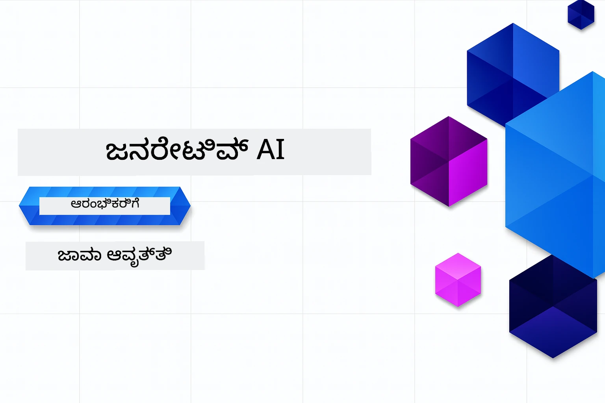

# ಆರಂಭಿಕರುಗಾಗಿ ಜನರೇಟಿವ್ AI - ಜಾವಾ ಆವೃತ್ತಿ
[](https://discord.gg/nTYy5BXMWG)



**ಸಮಯ ಬದ್ಧತೆ**: ಸಂಪೂರ್ಣ ಕಾರ್ಯಾಗಾರವನ್ನು ಸ್ಥಳೀಯ ಸೆಟ್‌ಅಪ್ ಇಲ್ಲದೆ ಆನ್‌ಲೈನ್‌ನಲ್ಲಿ ಪೂರ್ಣಗೊಳಿಸಬಹುದು. ಪರಿಸರ ಸೆಟ್‌ಅಪ್ 2 ನಿಮಿಷಗಳನ್ನು ತೆಗೆದುಕೊಳ್ಳುತ್ತದೆ, ಮತ್ತು ಮಾದರಿಗಳನ್ನು ಅನ್ವೇಷಿಸಲು ಅನ್ವೇಷಣೆಯ ಆಳದ ಪ್ರಕಾರ 1-3 ಘಂಟೆಗಳವರೆಗೆ ಬೇಕಾಗಬಹುದು.

> **ಶೀಘ್ರ ಪ್ರಾರಂಭ** 

1. ಈ ಸಂಗ್ರಹಣೆಯನ್ನು ನಿಮ್ಮ GitHub ಖಾತೆಗೆ ಫೋರ್ಕ್ ಮಾಡಿ
2. **Code** → **Codespaces** ಟ್ಯಾಬ್ → **...** → **New with options...** ಕ್ಲಿಕ್ ಮಾಡಿ
3. ಡೀಫಾಲ್ಟ್ಗಳನ್ನು ಬಳಸಿ – ಇದು ಈ ಕೋರ್ಸಿಗೆ ರಚಿಸಿದ ಅಭಿವೃದ್ಧಿ ಕಂಟೈನರ್ ಅನ್ನು ಆರಿಸುತ್ತದೆ
4. **Create codespace** ಕ್ಲಿಕ್ ಮಾಡಿ
5. ಪರಿಸರ ಸಿದ್ಧವಾಗಲು ~2 ನಿಮಿಷಗಳನ್ನು ಕಾಯಿರಿ
6. ನೇರವಾಗಿ [ಅಧ್ಯಾಯ 2: Azure AI Foundry ನ್ನು ಒದಗಿಸಿ](./02-SetupDevEnvironment/README.md#step-2-provision-azure-ai-foundry) ಗೆ ಹೋಗಿ

## ಬಹುಭಾಷಾ ಬೆಂಬಲ

### GitHub ಕ್ರಿಯೆಯಿಂದ ಬೆಂಬಲ (ಸ್ವಯಂಚಾಲಿತ ಮತ್ತು ಸದಾ ಹಾಲಿ)

<!-- CO-OP TRANSLATOR LANGUAGES TABLE START -->
[ಅರೇಬಿಕ್](../ar/README.md) | [ಬೆಂಗಾಳಿ](../bn/README.md) | [ಬಲ್ಗೇರಿಯನ್](../bg/README.md) | [ಬರ್ಮೀಸ್ (ಮ್ಯಾನ್ಮಾರ್)](../my/README.md) | [ಚೈನೀಸ್ (ಸರಳೀಕೃತ)](../zh-CN/README.md) | [ಚೈನೀಸ್ (ಸಾಂಪ್ರದಾಯಿಕ, ಹಾಂಗ್ ಕಾಂಗ್)](../zh-HK/README.md) | [ಚೈನೀಸ್ (ಸಾಂಪ್ರದಾಯಿಕ, ಮಕಾವು)](../zh-MO/README.md) | [ಚೈನೀಸ್ (ಸಾಂಪ್ರದಾಯಿಕ, ತೈವಾನ್)](../zh-TW/README.md) | [ಕ್ರೊಯೇಷಿಯನ್](../hr/README.md) | [ಚೆಕ್](../cs/README.md) | [ಡ್ಯಾನಿಷ್](../da/README.md) | [ಡಚ್](../nl/README.md) | [ಎಸ್ಟೋನಿಯನ್](../et/README.md) | [ಫಿನ್ನಿಷ್](../fi/README.md) | [ಫ್ರೆಂಚ್](../fr/README.md) | [ಜರ್ಮನ್](../de/README.md) | [ಗ್ರೀಕ್](../el/README.md) | [ಹೆಬ್ರೂ](../he/README.md) | [ಹಿಂದಿ](../hi/README.md) | [ಹಂಗೇರಿ](../hu/README.md) | [ಇಂಡೋನೇಶಿಯನ್](../id/README.md) | [ಇಟಾಲಿಯನ್](../it/README.md) | [ಜಪಾನೀಸ್](../ja/README.md) | [ಕನ್ನಡ](./README.md) | [ಖ್ಮೇರ್](../km/README.md) | [ಕೋರಿಯನ್](../ko/README.md) | [ಲಿಥುವೇನಿಯನ್](../lt/README.md) | [ಮಲೇ](../ms/README.md) | [ಮಲಯಾಳಂ](../ml/README.md) | [ಮರಾಠಿ](../mr/README.md) | [ನೆಪಾಳಿ](../ne/README.md) | [ನೈಜೀರಿಯನ್ ಪಿಡ್ಜಿನ್](../pcm/README.md) | [ನಾರ್ವೆಜಿಯನ್](../no/README.md) | [ಫಾರ್ಸೀ (ಪರ್ಶಿಯನ್)](../fa/README.md) | [ಪೋಲಿಷ್](../pl/README.md) | [ಪೋರ್ಟುಗೆಸು (ಬ್ರೆಜಿಲ್)](../pt-BR/README.md) | [ಪೋರ್ಟುಗೆಸು (ಪೋರ್ಟ್‌igal)](../pt-PT/README.md) | [ಪುಂಜಾಬಿ (ಗುರ್ಮುಖಿ)](../pa/README.md) | [ರೊಮೇನಿಯನ್](../ro/README.md) | [ರಷ್ಯನ್](../ru/README.md) | [ಸೆರ್ಬಿಯನ್ (ಸಿರಿಲಿಕ್)](../sr/README.md) | [ಸ್ಲೊವಾಕ್](../sk/README.md) | [ಸ್ಲೋವೇನಿಯನ್](../sl/README.md) | [ಸ್ಪ್ಯಾನಿಷ್](../es/README.md) | [ಸ್ವಾಹಿಲಿ](../sw/README.md) | [ಸ್ವೀಡಿಷ್](../sv/README.md) | [ಟಾಗಾಲೋಗ್ (ಫಿಲಿಪಿನೋ)](../tl/README.md) | [ತಮಿಳು](../ta/README.md) | [ತೆಲುಗು](../te/README.md) | [ಥಾಯಿ](../th/README.md) | [ತುರ್ಕಿಷ್](../tr/README.md) | [ಉಕ್ರೇನಿಯನ್](../uk/README.md) | [ಉರ್ದು](../ur/README.md) | [ವಿಯೆಟ್ನಾಮೀಸ್](../vi/README.md)

> **ಸ್ಥಳೀಯವಾಗಿ ಕ್ಲೋನ್ ಮಾಡಲು ಇಚ್ಛಿಸುವಿರಾ?**
>
> ಈ ಸಂಗ್ರಹಣೆಯು 50+ ಭಾಷಾ ಅನುವಾದಗಳನ್ನು ಒಳಗೊಂಡಿದೆ, ಇದು ಡೌನ್ಲೋಡ್ ಗಾತ್ರವನ್ನು ಬಹುತೇಕ ಹೆಚ್ಚಿಸುತ್ತದೆ. ಅನುವಾದಗಳಿಲ್ಲದೆ ಕ್ಲೋನ್ ಮಾಡಲು, ಸ್ಪಾರ್ಸ್ ಚಾಲನೆ ಬಳಸಿ:
>
> **ಬ್ಯಾಶ್ / macOS / ಲಿನಕ್ಸ್:**
> ```bash
> git clone --filter=blob:none --sparse https://github.com/microsoft/Generative-AI-for-beginners-java.git
> cd Generative-AI-for-beginners-java
> git sparse-checkout set --no-cone '/*' '!translations' '!translated_images'
> ```
>
> **CMD (ವಿಂಡೋಸ್):**
> ```cmd
> git clone --filter=blob:none --sparse https://github.com/microsoft/Generative-AI-for-beginners-java.git
> cd Generative-AI-for-beginners-java
> git sparse-checkout set --no-cone "/*" "!translations" "!translated_images"
> ```
>
> ಇದು ಕೋರ್ಸ್ ಪೂರ್ಣಗೊಳಿಸಲು ಅವಶ್ಯಕವಾದ ಎಲ್ಲವನ್ನೂ ಬಹುಮುಖ್ಯವಾಗಿ ವೇಗವಂತವಾಗಿ ಡೌನ್ಲೋಡ್ ಮಾಡುತ್ತದೆ.
<!-- CO-OP TRANSLATOR LANGUAGES TABLE END -->

## ಕೋರ್ಸ್ ರಚನೆ ಮತ್ತು ಕಲಿಕೆ ಮಾರ್ಗ

### **ಅಧ್ಯಾಯ 1:ಜನರೇಟಿವ್ AI ಗೆ ಪರಿಚಯ**
- **ಪ್ರಾಥಮಿಕ ಕಲ್ಪನೆಗಳು**: ದೊಡ್ಡ ಭಾಷಾ ಮಾದರಿಗಳನ್ನು, ಟೋಕನ್ಗಳನ್ನು, ಎಂಬೆಡ್ಡಿಂಗ್‌ಗಳನ್ನು ಮತ್ತು AI ಸಾಮರ್ಥ್ಯಗಳನ್ನು ಅರ್ಥಮಾಡಿಕೊಳ್ಳುವುದು
- **ಜಾವಾ AI ಪರಿಸರ**: ಸ್ಪ್ರಿಂಗ್ AI ಮತ್ತು OpenAI SDK ಗಳ ಅವಲೋಕನ
- **ಮಾದರಿಯ ಉಲ್ಲೇಖ ಪ್ರೋಟೋಕಾಲ್**: MCP ಗೆ ಪರಿಚಯ ಮತ್ತು AI ಏಜೆಂಟ್ ಸಂವಹನದಲ್ಲಿ ಅದರ ಪಾತ್ರ
- **ಪ್ರಾಯೋಗಿಕ ಅನ್ವಯಗಳು**: ಚಾಟ್‌ಬಾಟ್‌ಗಳು ಮತ್ತು ವಿಷಯ ರಚನೆ ಸೇರಿದಂತೆ ನೈಜ ಜಗತ್ತಿನ ದೃಶ್ಯಗಳು
- **[→ ಅಧ್ಯಾಯ 1 ಪ್ರಾರಂಭಿಸಿ](./01-IntroToGenAI/README.md)**

### **ಅಧ್ಯಾಯ 2: ಅಭಿವೃದ್ಧಿ ಪರಿಸರ ಸಜ್ಜುಗೊಳಿಸುವಿಕೆ**
- **Azure AI Foundry**: GPT-5.6 Luna ಚಾಟ್ ಮತ್ತು text-embedding-3-small ಎಂಬೆಡ್ಡಿಂಗ್‌ಗಳನ್ನು ಬೈಸಪ್ ಮತ್ತು Azure ಡೆವಲಪರ್ CLI (azd) ಜೊತೆ ಒದಗಿಸಿ
- **Spring Boot 4.1.1 + Spring AI 2.0.1**: ಅಧಿಕಾರಪತ್ರಿತ OpenAI ಜಾವಾ SDK ಮತ್ತು Azure OpenAI v1 ಬೆಂಬಲದ `ChatClient` ಬಳಸಿ ಕಲಿಕೆ
- **ಕೀಲಿಮೆಲೆ ಆ认证ದಿಲ್ಲದೆ ಲಾಗಿನ್**: ಮೈಕ್ರೋಸಾಫ್ಟ್ ಎಂಟ್ರಾ ID ನಲ್ಲಿ ಸುರಕ್ಷಿತವಾಗಿ ಸಂಪರ್ಕಿಸಿ — API ಕೀಲಿಗಳ ನಿರ್ವಹಣೆ ಇಲ್ಲ
- **ಅಭಿವೃದ್ಧಿ ಪರಿಕರಗಳು**: ಡಾಕರ್ ಕಂಟೈನರ್‌ಗಳು, VS ಕೇಡ್, ಮತ್ತು GitHub Codespaces ರಚನೆ
- **[→ ಅಧ್ಯಾಯ 2 ಪ್ರಾರಂಭಿಸಿ](./02-SetupDevEnvironment/README.md)**

### **ಅಧ್ಯಾಯ 3: ಮುಖ್ಯ ಜನರೇಟಿವ್ AI ತಂತ್ರಗಳು**
- **ಅಧಿಕೃತ OpenAI ಜಾವಾ SDK**: ಕುಂಜಿ ಇಲ್ಲದ ಲಾಗಿನ್ ಜೊತೆಗೆ ನೇರವಾಗಿ Azure OpenAI v1 ಕರೆ ಮಾಡಿ
- **ಪ್ರಾಂಪ್ಟ್ ಎಂಜಿನಿಯರಿಂಗ್**: ಅತ್ಯುತ್ತಮ AI ಮಾದರಿ ಉತ್ತರಗಳಿಗೆ ತಂತ್ರಗಳು
- **ಎಂಬೆಡ್ಡಿಂಗ್‌ಗಳು ಮತ್ತು ವೆಕ್ಟರ್ ಕಾರ್ಯಾಚರಣೆಗಳು**: ಸೆಮ್ಯಾಂಟಿಕ್ ಹುಡುಕಾಟ ಮತ್ತು ಸಾದೃಶ್ಯ ಹೋಲಿಕೆ ಅನುಷ್ಠಾನಗೊಳಿಸಿ
- **ಪುನಃ ಹಿಂಪಡೆಯುವ-ವೃದ್ಧಿಗೊಳಿಸುವ ಜನರೇಶನ್ (RAG)**: AI ಗೆ ನಿಮ್ಮ ಸ್ವಂತ ಡೇಟಾ ಮೂಲಗಳನ್ನು ಸಂಯೋಜಿಸಿ
- **ಫಂಕ್ಷನ್ ಕರೆಮಾಡುವುದು**: ಕಸ್ಟಮ್ ಉಪಕರಣಗಳು ಮತ್ತು ಪ್ಲಗಿನ್‌ಗಳೊಂದಿಗೆ AI ಸಾಮರ್ಥ್ಯಗಳನ್ನು ವಿಸ್ತರಿಸಿ
- **[→ ಅಧ್ಯಾಯ 3 ಪ್ರಾರಂಭಿಸಿ](./03-CoreGenerativeAITechniques/README.md)**

### **ಅಧ್ಯಾಯ 4: ಪ್ರಾಯೋಗಿಕ ಅನ್ವಯಗಳು ಮತ್ತು ಯೋಜನೆಗಳು**
- **ಪೇಟ್ನ ಕಥೆ ನಿರ್ಮಾಪಕ** (`petstory/`): Azure AI Foundry ಮೂಲಕ ಸೃಜನಾತ್ಮಕ ವಿಷಯ ರಚನೆ
- **Foundry ಸ್ಥಳೀಯ ಡೆಮೊ** (`foundrylocal/`): OpenAI ಜಾವಾ SDK ಸಹಿತ ಸ್ಥಳೀಯ AI ಮಾದರಿ ಏಕೀಕರಣ
- **MCP ಕ್ಯಾಲ್ಕುಲೇಟರ್ ಸೇವೆ** (`calculator/`): ಸ್ಪ್ರಿಂಗ್ AI ಜೊತೆ ಮೂಲ ಮಾದರಿ ಉಲ್ಲೇಖ ಪ್ರೋಟೋಕಾಲ್ ಅನುಷ್ಠಾನ
- **[→ ಅಧ್ಯಾಯ 4 ಪ್ರಾರಂಭಿಸಿ](./04-PracticalSamples/README.md)**

### **ಅಧ್ಯಾಯ 5: ಹೊಣೆದಾರ-ai ಅಭಿವೃದ್ಧಿ**
- **Azure AI Foundry ವಿಷಯ ಸುರಕ್ಷತೆ**: ಕಟ್ಟಕಡೆಯ ವಿಷಯ ಶುದ್ಧೀಕರಣ ಮತ್ತು ಸುರಕ್ಷತಾ ಕ್ರಮಗಳನ್ನು ಪರೀಕ್ಷಿಸಿ (ಕಠಿಣ ತಡೆಯುವಿಕೆ ಮತ್ತು ಮೃದುವಾದ ನಿರಾಕರಣೆಗಳು)
- ** ಹೊಣೆದಾರಿ AI ಪ್ರದರ್ಶನ**: ಆಧುನಿಕ AI ಸುರಕ್ಷತಾ ವ್ಯವಸ್ಥೆಗಳು ಹೇಗೆ ಕಾರ್ಯನಿರ್ವಹಿಸುತ್ತವೆ ಎಂದು ಪ್ರಾಯೋಗಿಕ ಉದಾಹರಣೆಯನ್ನು ತೋರಿಸುವುದು
- **ಉತ್ತಮ ಅಭ್ಯಾಸಗಳು**: ನೈತಿಕ AI ಅಭಿವೃದ್ಧಿ ಮತ್ತು ನಿಯೋಜನೆಗಾಗಿ ಅಗತ್ಯ ಮಾರ್ಗಸೂಚಿಗಳು
- **[→ ಅಧ್ಯಾಯ 5 ಪ್ರಾರಂಭಿಸಿ](./05-ResponsibleGenAI/README.md)**

## اضافی ಸಂಪನ್ಮೂಲಗಳು

<!-- CO-OP TRANSLATOR OTHER COURSES START -->
### LangChain
[](https://aka.ms/langchain4j-for-beginners)
[](https://aka.ms/langchainjs-for-beginners?WT.mc_id=m365-94501-dwahlin)
[](https://github.com/microsoft/langchain-for-beginners?WT.mc_id=m365-94501-dwahlin)
---

### Azure / Edge / MCP / ಏಜೆಂಟ್ಗಳು
[](https://github.com/microsoft/AZD-for-beginners?WT.mc_id=academic-105485-koreyst)
[](https://github.com/microsoft/edgeai-for-beginners?WT.mc_id=academic-105485-koreyst)
[](https://github.com/microsoft/mcp-for-beginners?WT.mc_id=academic-105485-koreyst)
[](https://github.com/microsoft/ai-agents-for-beginners?WT.mc_id=academic-105485-koreyst)

---
 
### ಜನರೇಟಿವ್ AI ಸರಣಿ
[](https://github.com/microsoft/generative-ai-for-beginners?WT.mc_id=academic-105485-koreyst)
[-9333EA?style=for-the-badge&labelColor=E5E7EB&color=9333EA)](https://github.com/microsoft/Generative-AI-for-beginners-dotnet?WT.mc_id=academic-105485-koreyst)
[-C084FC?style=for-the-badge&labelColor=E5E7EB&color=C084FC)](https://github.com/microsoft/generative-ai-for-beginners-java?WT.mc_id=academic-105485-koreyst)
[-E879F9?style=for-the-badge&labelColor=E5E7EB&color=E879F9)](https://github.com/microsoft/generative-ai-with-javascript?WT.mc_id=academic-105485-koreyst)

---
 
### ಪ್ರಮುಖ ಕಲಿಕೆ
[](https://aka.ms/ml-beginners?WT.mc_id=academic-105485-koreyst)
[](https://aka.ms/datascience-beginners?WT.mc_id=academic-105485-koreyst)
[](https://aka.ms/ai-beginners?WT.mc_id=academic-105485-koreyst)
[](https://github.com/microsoft/Security-101?WT.mc_id=academic-96948-sayoung)
[](https://aka.ms/webdev-beginners?WT.mc_id=academic-105485-koreyst)
[](https://aka.ms/iot-beginners?WT.mc_id=academic-105485-koreyst)
[](https://github.com/microsoft/xr-development-for-beginners?WT.mc_id=academic-105485-koreyst)

---
 
### ಕೋಪಿಲಾಟ್ ಸರಣಿ
[](https://aka.ms/GitHubCopilotAI?WT.mc_id=academic-105485-koreyst)
[](https://github.com/microsoft/mastering-github-copilot-for-dotnet-csharp-developers?WT.mc_id=academic-105485-koreyst)
[](https://github.com/microsoft/CopilotAdventures?WT.mc_id=academic-105485-koreyst)
<!-- CO-OP TRANSLATOR OTHER COURSES END -->

## ಸಹಾಯ ಪಡೆಯುವುದು

ನೀವು ಅಡ್ಡಿಪಡಿದರೆ ಅಥವಾ AI ಅಪ್ಲಿಕೇಶನ್‌ಗಳನ್ನು ನಿರ್ಮಿಸುವ ಬಗ್ಗೆ ಯಾವುದೇ ಪ್ರಶ್ನೆಗಳಿದ್ದರೆ. MCP ಬಗ್ಗೆ ಚರ್ಚೆ ಮಾಡುತ್ತಿರುವ ಇತರ ಕಲಿಕಾರರು ಮತ್ತು ಅನುಭವಜ್ಞ ಡೆವಲಪರ್‌ಗಳಿಗೆ ಸೇರಿ. ಇದು ಪ್ರಶ್ನೆಗಳನ್ನು ಸ್ವಾಗತಿಸುವ ಮತ್ತು ಜ್ಞಾನವನ್ನು ಉಚಿತವಾಗಿ ಹಂಚುವ ಸಹಾಯಕ ಸಮುದಾಯವಾಗಿದೆ.

[](https://discord.gg/nTYy5BXMWG)

ನಿರ್ಮಾಣದ ವೇಳೆ ಉತ್ಪನ್ನ ಪ್ರತಿಕ್ರಿಯೆ ಅಥವಾ ದೋಷಗಳು ಇದ್ದರೆ ಭೇಟಿ ನೀಡಿ:

[](https://aka.ms/foundry/forum)

---

<!-- CO-OP TRANSLATOR DISCLAIMER START -->
**ಅಸ್ವೀಕಾರ**:
ಈ ದಸ್ತಾವೇಜು AI ಅನುವಾದ ಸೇವೆ [Co-op Translator](https://github.com/Azure/co-op-translator) ಬಳಸಿ ಅನುವಾದಿಸಲಾಗಿದೆ. ನಾವು ನಿಖರತೆಯನ್ನು ಸಾಧಿಸಲು ಪ್ರಯತ್ನಿಸುತ್ತಿದ್ದರೂ, ದಯವಿಟ್ಟು ಗಮನಿಸಿ, ಸ್ವಯಂಚಾಲಿತ ಅನುವಾದಗಳಲ್ಲಿ ದೋಷಗಳು ಅಥವಾ ಅಸಡ್ಡೆಗಳು ಇರಬಹುದು. ಮೂಲ ಭಾಷೆಯಲ್ಲಿರುವ ಮೂಲ ದಸ್ತಾವೇಜು ಪ್ರಾಮಾಣಿಕ ಮೂಲವೆಂದು ಪರಿಗಣಿಸಬೇಕು. ಪ್ರಮುಖ ಮಾಹಿತಿಗಾಗಿ, ವೃತ್ತಿಪರ ಮಾನವ ಅನುವಾದವನ್ನು ಶಿಫಾರಸು ಮಾಡಲಾಗುತ್ತದೆ. ಈ ಅನುವಾದವನ್ನು ಬಳಸುವ ಮೂಲಕ ಉಂಟಾಗುವ ಯಾವುದೇ ತಪ್ಪು ಅರ್ಥಗಳ ಅಥವಾ ತಪ್ಪು ವ್ಯಾಖ್ಯಾನಗಳ ಬಗ್ಗೆ ನಾವು ಹೊಣೆಗಾರರಲ್ಲ.
<!-- CO-OP TRANSLATOR DISCLAIMER END -->