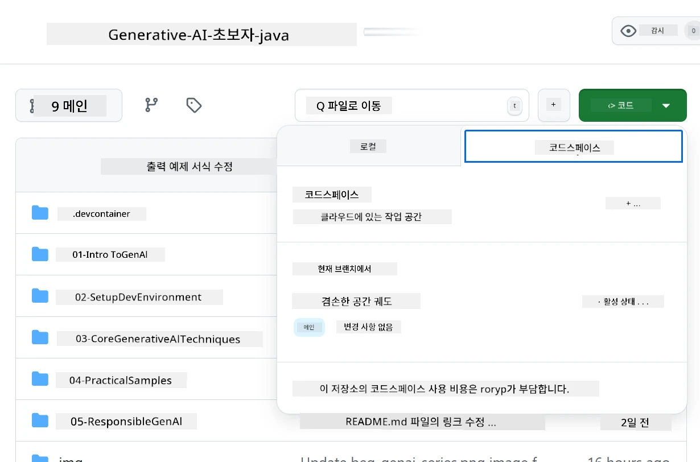
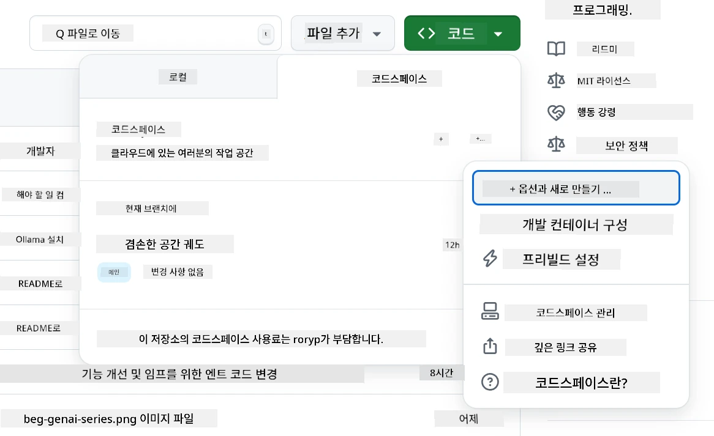
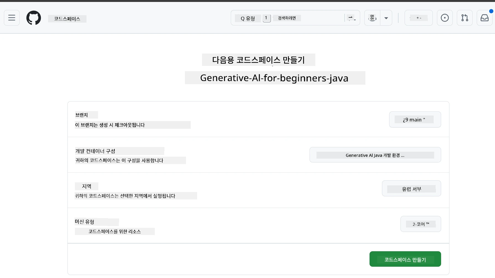
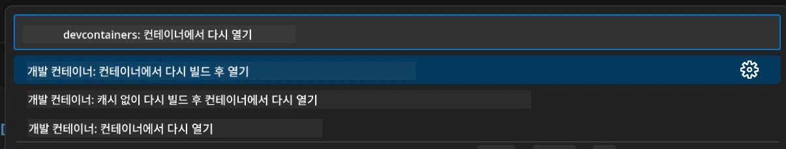
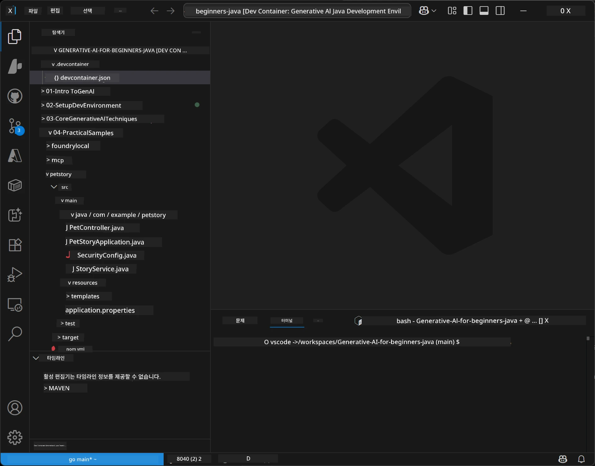
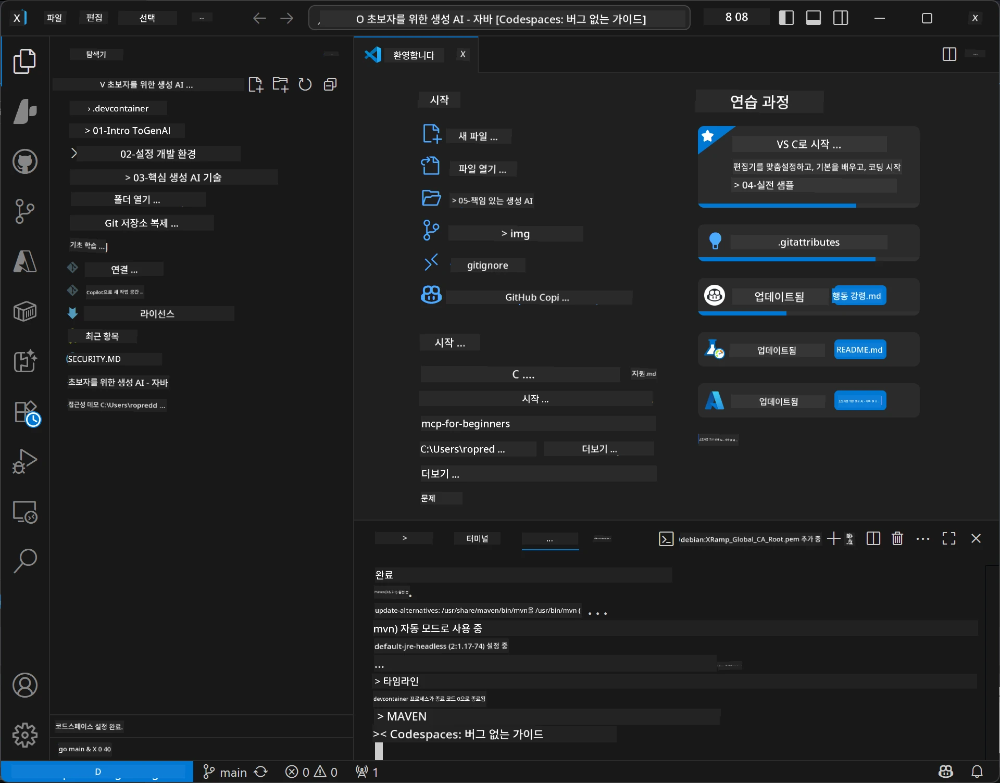

# Java용 생성 AI 개발 환경 설정

> **빠른 시작:** Bicep + `azd`로 몇 분 안에 <strong>Azure AI Foundry</strong>에 AI 모델을 코드로 프로비저닝하세요 — [Azure AI Foundry 설정 가이드](getting-started-azure-openai.md)를 참조하세요. 인증은 <strong>키리스</strong>(Microsoft Entra ID) 방식으로 API 키를 관리할 필요가 없습니다.

## 학습할 내용

- AI 애플리케이션을 위한 Java 개발 환경 설정하기
- 선호하는 개발 환경 선택 및 구성하기(클라우드 우선 Codespaces, 로컬 개발 컨테이너, 또는 완전 로컬 설정)
- Azure AI Foundry 모델에 연결하여 설정 테스트하기

## 목차

- [학습할 내용](#학습할-내용)
- [소개](#소개)
- [1단계: 개발 환경 설정하기](#1단계-개발-환경-설정하기)
  - [옵션 A: GitHub Codespaces(권장)](#옵션-a-github-codespaces권장)
  - [옵션 B: 로컬 개발 컨테이너](#옵션-b-로컬-개발-컨테이너)
  - [옵션 C: 기존 로컬 설치 사용하기](#옵션-c-기존-로컬-설치-사용하기)
- [2단계: Azure AI Foundry 프로비저닝](#2단계-azure-ai-foundry-프로비저닝)
- [3단계: 설정 테스트하기](#3단계-설정-테스트하기)
- [문제 해결](#문제-해결)
- [요약](#요약)
- [다음 단계](#다음-단계)

## 소개

이 장에서는 개발 환경을 설정하는 과정을 안내합니다. 이 과정 내내 모델은 <strong>Azure AI Foundry</strong>를 사용합니다. Bicep 및 Azure 개발자 CLI(`azd`)로 코드 형태로 모델을 프로비저닝하고, **키리스 인증**(Microsoft Entra ID)으로 연결하여 API 키를 복사하거나 유출시킬 걱정이 없습니다.

**로컬 설치 불필요!** 브라우저에서 완전한 개발 환경을 제공하는 GitHub Codespaces를 사용해 Foundry를 프로비저닝할 수 있습니다.

본 과정에서 <strong>Azure AI Foundry</strong>를 사용하는 이유는:
- **코드로 프로비저닝** — 단 한 번의 `azd up`으로 계정 및 모델 배포를 모두 수행
- <strong>키리스</strong> — Azure 로그인 또는 관리 ID 인증으로 인증
- **실제 운영급** — 동일 코드를 로컬과 Azure에서 실행 가능
- <strong>유연성</strong> — 배포명만 바꾸면 모델 교체 가능, 코드 수정 불필요

> <strong>참고</strong>: Azure AI Foundry 배포는 토큰 단위 과금(pay-as-you-go) 방식입니다. 프로비저닝, 지역, 비용 관련 자세한 내용은 [Azure AI Foundry 설정 가이드](getting-started-azure-openai.md)를 참고하세요.


## 1단계: 개발 환경 설정하기

<a name="quick-start-cloud"></a>

이 Java용 생성 AI 과정을 위해 필요한 도구가 모두 포함된 사전 구성된 개발 컨테이너를 만들었습니다. 선호하는 개발 방식을 선택하세요:

### 개발 환경 설정 옵션:

#### 옵션 A: GitHub Codespaces(권장)

**2분만에 코딩 시작 — 로컬 설치 불필요!**

1. 이 저장소를 GitHub 계정으로 포크하세요
   > **참고:** 기본 구성을 편집하려면 [개발 컨테이너 구성](../../../.devcontainer/devcontainer.json)을 확인하세요
2. **Code** → **Codespaces** 탭 → **...** → **New with options...** 클릭
3. 기본값 사용 — 이 과정용으로 생성된 **생성 AI Java 개발 환경** 맞춤형 devcontainer 구성이 선택됩니다
4. **Create codespace** 클릭
5. 환경 준비 완료까지 약 2분 대기
6. [2단계: Azure AI Foundry 프로비저닝](#2단계-azure-ai-foundry-프로비저닝)으로 진행








> **Codespaces 장점**:
> - 로컬 설치 불필요
> - 브라우저만 있으면 모든 기기에서 작동
> - 도구 및 종속성 모두 사전 구성됨
> - 개인 계정에 월 60시간 무료 제공
> - 모든 학습자에게 일관된 환경 제공

#### 옵션 B: 로컬 개발 컨테이너

**Docker를 이용해 로컬 개발을 선호하는 개발자용**

1. 이 저장소를 포크하고 로컬에 클론하기
   > **참고:** 기본 구성을 편집하려면 [개발 컨테이너 구성](../../../.devcontainer/devcontainer.json)을 확인하세요
2. [Docker Desktop](https://www.docker.com/products/docker-desktop/) 및 [VS Code](https://code.visualstudio.com/) 설치
3. VS Code에 [Dev Containers 확장](https://marketplace.visualstudio.com/items?itemName=ms-vscode-remote.remote-containers) 설치
4. 저장소 폴더를 VS Code에서 열기
5. 안내 시 **Reopen in Container** 클릭(또는 `Ctrl+Shift+P` → "Dev Containers: Reopen in Container" 명령 사용)
6. 컨테이너 빌드 및 시작 대기
7. [2단계: Azure AI Foundry 프로비저닝](#2단계-azure-ai-foundry-프로비저닝)으로 진행





#### 옵션 C: 기존 로컬 설치 사용하기

**기존 Java 환경을 가진 개발자용**

전제조건:
- [Java 21+](https://www.oracle.com/java/technologies/javase/jdk21-archive-downloads.html) 
- [Maven 3.9+](https://maven.apache.org/download.cgi)
- [VS Code](https://code.visualstudio.com) 또는 선호하는 IDE

단계:
1. 이 저장소를 로컬로 클론
2. IDE에서 프로젝트 열기
3. [2단계: Azure AI Foundry 프로비저닝](#2단계-azure-ai-foundry-프로비저닝)으로 진행

> **꿀팁:** 사양이 낮은 기기에서 로컬 VS Code를 사용하고 싶다면 GitHub Codespaces를 이용하세요! 로컬 VS Code를 클라우드에 호스팅된 Codespace에 연결하여 최상의 환경을 누릴 수 있습니다.




## 2단계: Azure AI Foundry 프로비저닝

과정 내의 AI 모델을 Azure AI Foundry에 코드 형태로 배포하세요. 저장소 루트에서:

```bash
cd 02-SetupDevEnvironment
azd auth login
az login
azd up
```

`azd`가 환경 이름, 구독, 지역을 묻고, `gpt-5.6-luna`와 `text-embedding-3-small` 배포를 포함한 Azure AI Foundry 계정을 프로비저닝하며, 예제 `.env`에 엔드포인트를 기록합니다 — 모두 <strong>키리스</strong> 인증(API 키 없음)으로 진행됩니다.

> **전체 가이드:** 사전 준비, 수동(포털) 대안, 지역 안내, 비용/정리 정보는 [Azure AI Foundry 설정 가이드](getting-started-azure-openai.md)를 참조하세요.

## 3단계: 설정 테스트하기

Foundry 모델이 프로비저닝되면 [`02-SetupDevEnvironment/examples/basic-chat-azure`](../../../02-SetupDevEnvironment/examples/basic-chat-azure)의 예제 앱으로 연결을 테스트하세요.

1. 개발 환경에서 터미널을 엽니다.
2. 예제 폴더로 이동:
   ```bash
   cd 02-SetupDevEnvironment/examples/basic-chat-azure
   ```
3. 로그인 상태인지 확인하세요 (키리스 인증에는 토큰 필요):
   ```bash
   az login
   ```
   > `azd up`을 실행했다면, 엔드포인트가 포함된 `.env` 파일이 이미 작성되어 있습니다.
4. 애플리케이션 실행:
   ```bash
   mvn clean spring-boot:run
   ```

`gpt-5.6-luna` 모델의 응답을 볼 수 있습니다.

### 예제 코드 이해하기

[basic-chat 예제](./examples/basic-chat-azure/README.md)는 <strong>Spring Boot 4.1.1</strong>과 <strong>Spring AI 2.0.1</strong>을 사용합니다. Spring AI의 `ChatClient`는 공식 OpenAI Java SDK 기반이며, 키리스 인증으로 Azure OpenAI **v1** 엔드포인트에 연결합니다.

**이 코드의 기능:**
- Azure AI Foundry에 Azure 로그인(Entra ID)로 <strong>연결</strong> — API 키 없음
- `gpt-5.6-luna` 모델에 프롬프트 <strong>전송</strong>
- AI의 응답을 <strong>수신</strong>하고 표시
- 설정이 올바른지 <strong>검증</strong>

**주요 의존성** ([pom.xml](../../../02-SetupDevEnvironment/examples/basic-chat-azure/pom.xml) 발췌):
```xml
<dependency>
    <groupId>org.springframework.ai</groupId>
    <artifactId>spring-ai-starter-model-openai</artifactId>
</dependency>
<dependency>
    <groupId>com.openai</groupId>
    <artifactId>openai-java</artifactId>
</dependency>
<dependency>
    <groupId>com.azure</groupId>
    <artifactId>azure-identity</artifactId>
    <version>${azure-identity.version}</version>
</dependency>
```

POM은 OpenAI Java <strong>4.63.1</strong>을 관리하고, Azure Identity <strong>1.18.6</strong>은 명시적으로 설정합니다. Spring AI 2는 Azure 특정 스타터를 제거했지만, 자격 증명 빈을 위해 Azure Identity가 필요합니다.

<strong>구성</strong> ([application.yml](../../../02-SetupDevEnvironment/examples/basic-chat-azure/src/main/resources/application.yml)):
```yaml
spring:
  ai:
    openai:
      base-url: ${AZURE_OPENAI_ENDPOINT}
      microsoft-foundry: true
      chat:
        model: ${AZURE_OPENAI_DEPLOYMENT:gpt-5.6-luna}
        reasoning-effort: none
        max-completion-tokens: 500
```

키리스 인증은 [BasicChatApplication.java](../../../02-SetupDevEnvironment/examples/basic-chat-azure/src/main/java/com/example/BasicChatApplication.java)에 명시적으로 설정되어 있으며, API 키가 없다고 추론되지 않습니다. 이 인증은 `https://ai.azure.com/.default` 범위를 사용하는 `DefaultAzureCredential` 베어러 자격 증명을 활용하며, `OpenAIClient`는 `/openai/v1`을 겨냥합니다. 앱은 이 클라이언트를 Spring AI 채팅 모델에 제공하므로 전역 `OPENAI_API_KEY`가 Azure 인증을 덮어쓰지 않습니다.

채팅 설정은 `spring.ai.openai.chat` 아래에 직접 있으며, `options` 블록 없이 유지됩니다. 수업은 `reasoning-effort: none`과 500 토큰 제한의 채팅 완료를 포함하며 `temperature`나 `max-tokens`는 설정하지 않습니다. API 선택 및 도구 호출 가이드는 [예제 구성 참고](./examples/basic-chat-azure/README.md#spring-configuration)에서 확인하세요.

## 요약

위 단계를 완료하면 다음을 얻을 수 있습니다:

- Bicep + `azd`로 Azure AI Foundry 모델을 코드로 프로비저닝
- Java 개발 환경 구축 완료(코드스페이스, 개발 컨테이너, 로컬 중 선택)
- 키리스 인증(Microsoft Entra ID)으로 Azure AI Foundry에 연결 — API 키 불필요
- 모델과 연동하는 간단한 예제로 작동 시험 완료

## 다음 단계

[3장: 핵심 생성 AI 기법](../03-CoreGenerativeAITechniques/README.md)

## 문제 해결

문제가 있습니까? 일반적인 문제와 해결책은 다음과 같습니다:

- **인증 실패(401/403)?**
  - `az login` 명령 실행 — 인증은 키리스이므로 로그인 필수
  - 계정에 리소스에 대한 **Cognitive Services OpenAI User** 역할이 부여되었는지 확인
  - 방금 프로비저닝했다면 권한 부여 전파까지 1분 대기

- **Maven을 찾을 수 없음?**
  - 개발 컨테이너/코드스페이스 사용 시 Maven은 미리 설치되어 있음
  - 로컬 설정 시 Java 21+와 Maven 3.9+ 설치 여부 확인
  - `mvn --version`으로 설치 확인

- **`azd`를 찾을 수 없거나 프로비저닝 실패?**
  - [Azure Developer CLI](https://aka.ms/azure-dev/install) 설치 후 `azd auth login` 실행
  - `gpt-5.6-luna`와 `text-embedding-3-small` 사용 가능한 지역(e.g. `eastus2`) 선택 및 선택한 구독에 충분한 할당량 확인
  - 자세한 내용은 [Azure AI Foundry 설정 가이드](getting-started-azure-openai.md) 참고

- **개발 컨테이너가 시작되지 않음?**
  - 로컬 개발 시 Docker Desktop 실행 상태인지 확인
  - 컨테이너 재빌드 시도: `Ctrl+Shift+P` → "Dev Containers: Rebuild Container"

- **애플리케이션 컴파일 오류?**
  - 올바른 디렉터리(`02-SetupDevEnvironment/examples/basic-chat-azure`) 안에 있는지 확인
  - `mvn clean compile`로 클린 후 다시 빌드 시도

> **도움 필요하신가요?** 여전히 문제가 있으면 저장소에 이슈를 열어 주세요. 도와드리겠습니다.

---

<!-- CO-OP TRANSLATOR DISCLAIMER START -->
**면책 조항**:
이 문서는 AI 번역 서비스 [Co-op Translator](https://github.com/Azure/co-op-translator)를 사용하여 번역되었습니다. 정확성을 기하기 위해 노력하고 있으나, 자동 번역은 오류나 부정확한 부분이 있을 수 있음을 유의하시기 바랍니다. 원본 문서의 원어본이 권위 있는 자료로 간주되어야 합니다. 중요한 정보의 경우, 전문가의 인간 번역을 권장합니다. 이 번역 사용으로 인해 발생하는 오해나 잘못된 해석에 대해 당사는 책임을 지지 않습니다.
<!-- CO-OP TRANSLATOR DISCLAIMER END -->