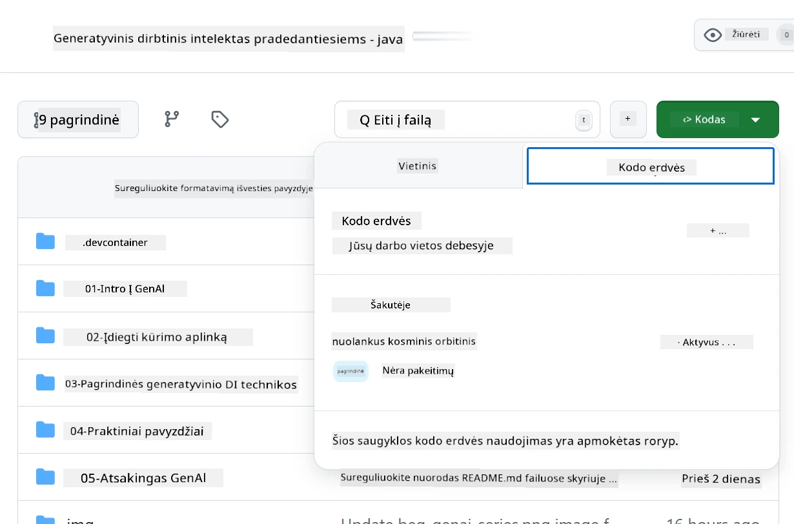
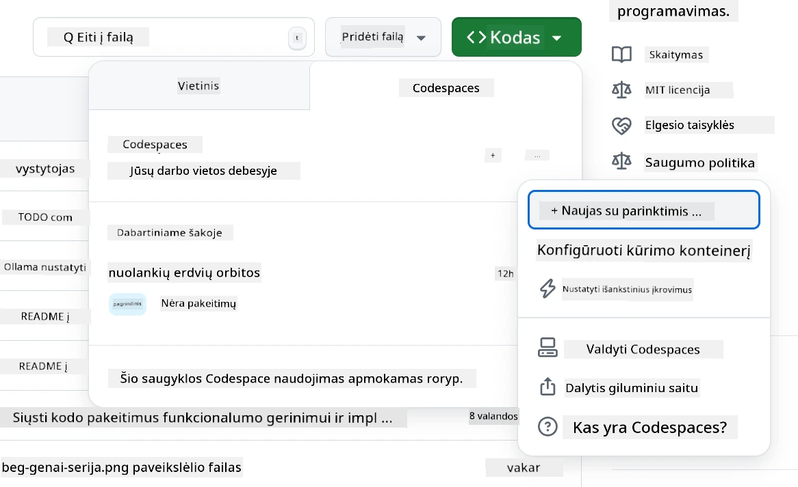
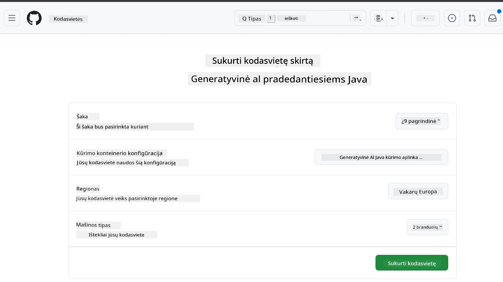
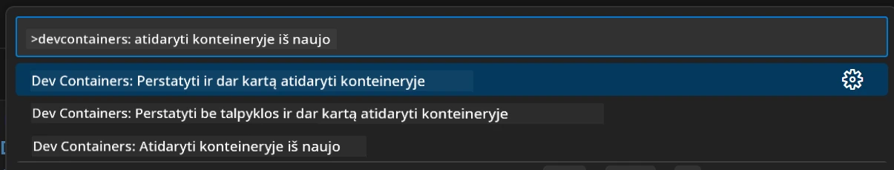
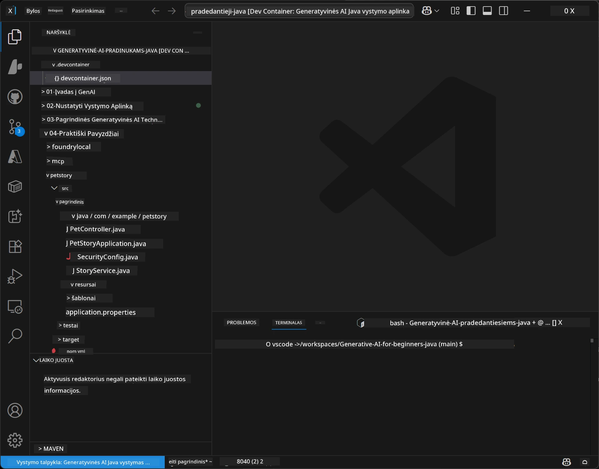
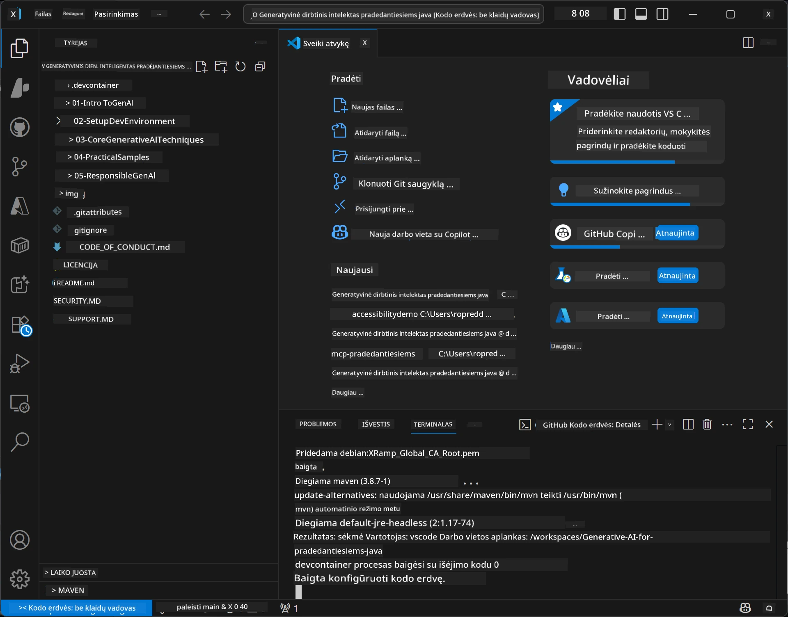

# Generatyvinio DI kūrimo aplinkos nustatymas Java

> **Greitas pradėjimas:** Per kelias minutes paruoškite savo DI modelius **Azure AI Foundry** kaip kodą su Bicep + `azd` — žr. [Azure AI Foundry sąrankos vadovą](getting-started-azure-openai.md). Autentifikacija yra **be raktų** (Microsoft Entra ID), taigi nereikia valdyti API raktų.

## Ko išmoksite

- Nustatyti Java kūrimo aplinką DI programoms
- Pasirinkti ir sukonfigūruoti pageidaujamą kūrimo aplinką (pirmenybė cloud-first su Codespaces, vietinis kūrimo konteineris arba pilnas vietinis diegimas)
- Išbandyti savo nustatymus prisijungiant prie Azure AI Foundry modelio

## Turinys

- [Ko išmoksite](#ko-išmoksite)
- [Įvadas](#įvadas)
- [1 žingsnis: Nustatyti kūrimo aplinką](#1-žingsnis-nustatyti-kūrimo-aplinką)
  - [A variantas: GitHub Codespaces (Rekomenduojama)](#a-variantas-github-codespaces-rekomenduojama)
  - [B variantas: Vietinis kūrimo konteineris](#b-variantas-vietinis-kūrimo-konteineris)
  - [C variantas: Naudoti esamą vietinę diegimą](#c-variantas-naudokite-esamą-vietinę-diegimą)
- [2 žingsnis: Paruošti Azure AI Foundry](#2-žingsnis-paruošti-azure-ai-foundry)
- [3 žingsnis: Išbandyti nustatymus](#3-žingsnis-išbandyti-nustatymus)
- [Klaidų šalinimas](#klaidų-šalinimas)
- [Santrauka](#santrauka)
- [Tolimesni žingsniai](#tolimesni-žingsniai)

## Įvadas

Šis skyrius padės jums nustatyti kūrimo aplinką. Visų kursų metu naudosime **Azure AI Foundry** modelius. Modelius paruošite kaip kodą su Bicep ir Azure Developer CLI (`azd`), tuomet jungitės su **be raktų** autentifikacija (Microsoft Entra ID) — nereikia kopijuoti ar saugoti API raktų.

**Vietinis nustatymas nebūtinas!** Galite naudoti GitHub Codespaces, kuris suteikia pilną kūrimo aplinką naršyklėje ir leidžia tiesiogiai paruošti Foundry.

Naudojame **Azure AI Foundry** šiam kursui, nes jis yra:
- **Paruoštas kaip kodas** — vienas `azd up` įdiegia paskyrą ir modelių diegimus
- **Be raktų** — autentifikuojasi Azure prisijungimu ar valdomu identitetu
- **Parengtas gamybai** — tas pats kodas veikia vietoje ir Azure aplinkoje
- **Lankstus** — modelius keiskite keisdami diegimo pavadinimą, o ne kodą

> **Pastaba**: Azure AI Foundry diegimai apmokestinami pagal tokenus (mokėkite pagal naudojimą). Daugiau apie paruošimą, regionus ir kainas žr. [Azure AI Foundry sąrankos vadove](getting-started-azure-openai.md).


## 1 žingsnis: Nustatyti kūrimo aplinką

<a name="quick-start-cloud"></a>

Paruošėme iš anksto sukonfigūruotą kūrimo konteinerį, kad sumažintume nustatymo laiką ir užtikrintume, jog turite visas reikalingas priemones Generatyvinio DI Java kursui. Pasirinkite savo pageidaujamą kūrimo būdą:

### Aplinkos nustatymo variantai:

#### A variantas: GitHub Codespaces (Rekomenduojama)

**Pradėkite programuoti per 2 minutes - vietinis nustatymas nereikalingas!**

1. Padarykite GitHub repozitorijos forką į savo GitHub paskyrą
   > **Pastaba**: Jei norite redaguoti bazinę konfigūraciją, peržiūrėkite [Dev Container Configuration](../../../.devcontainer/devcontainer.json)
2. Spauskite **Code** → **Codespaces** skirtuką → **...** → **Naujas su parinktimis...**
3. Naudokite numatytuosius nustatymus – tai pasirinkti **Dev container konfiguraciją**: **Generatyvinio DI Java kūrimo aplinka**, sukurta šiam kursui
4. Spauskite **Sukurti codespace**
5. Palaukite ~2 minutes, kol aplinka bus paruošta
6. Pereikite prie [2 žingsnis: Paruošti Azure AI Foundry](#2-žingsnis-paruošti-azure-ai-foundry)








> **Codespaces privalumai**:
> - Nereikia vietinio diegimo
> - Veikia bet kuriame įrenginyje su naršykle
> - Iš anksto sukonfigūruota su visais įrankiais ir priklausomybėmis
> - Nemokama 60 valandų per mėnesį asmeninėms paskyroms
> - Visiems mokiniams vienoda aplinka

#### B variantas: Vietinis kūrimo konteineris

**Skirta kūrėjams, kurie mieliau dirba su vietine Docker aplinka**

1. Padarykite forką ir nuklonuokite šį repozitorijų į savo mašiną
   > **Pastaba**: Jei norite redaguoti bazinę konfigūraciją, peržiūrėkite [Dev Container Configuration](../../../.devcontainer/devcontainer.json)
2. Įdiekite [Docker Desktop](https://www.docker.com/products/docker-desktop/) ir [VS Code](https://code.visualstudio.com/)
3. Įdiekite [Dev Containers plėtinį](https://marketplace.visualstudio.com/items?itemName=ms-vscode-remote.remote-containers) VS Code
4. Atverkite repozitorijos katalogą VS Code
5. Kai bus prašoma, spauskite **Atidaryti konteineryje** (arba „Ctrl+Shift+P“ → "Dev Containers: Reopen in Container")
6. Palaukite kol konteineris bus sukurtas ir paleistas
7. Pereikite prie [2 žingsnis: Paruošti Azure AI Foundry](#2-žingsnis-paruošti-azure-ai-foundry)





#### C variantas: Naudokite esamą vietinę diegimą

**Skirta kūrėjams su esama Java aplinka**

Reikalingi dalykai:
- [Java 21+](https://www.oracle.com/java/technologies/javase/jdk21-archive-downloads.html) 
- [Maven 3.9+](https://maven.apache.org/download.cgi)
- [VS Code](https://code.visualstudio.com) arba kita pageidaujama IDE

Veiksmai:
1. Nuklonuokite šį repozitorijų į savo mašiną
2. Atverkite projektą savo IDE
3. Pereikite prie [2 žingsnis: Paruošti Azure AI Foundry](#2-žingsnis-paruošti-azure-ai-foundry)

> **Patogumo patarimas**: Jei turite silpną mašiną, bet norite naudoti VS Code vietoje, naudokite GitHub Codespaces! Galite prijungti savo vietinį VS Code prie debesies talpinamo Codespace ir mėgautis geriausiais abiejų pasaulių aspektais.




## 2 žingsnis: Paruošti Azure AI Foundry

Paruoškite kursui skirtus DI modelius Azure AI Foundry kaip kodą. Repzitorijos šakniniame kataloge:

```bash
cd 02-SetupDevEnvironment
azd auth login
az login
azd up
```

`azd` paklaus aplinkos pavadinimo, prenumeratos ir regiono, paruoš Azure AI Foundry paskyrą su `gpt-5.6-luna` ir `text-embedding-3-small` diegimais, ir įrašo galinį tašką į pavyzdžio `.env` – visa tai su **be raktų** autentifikacija (nereikia API raktų).

> **Pilnas žingsnis po žingsnio:** Žr. [Azure AI Foundry sąrankos vadovą](getting-started-azure-openai.md) su išankstinėmis sąlygomis, alternatyva rankiniu būdu (portalu), regionų gairėmis ir kainų / tvarkymo pastabomis.

## 3 žingsnis: Išbandyti nustatymus

Kai jūsų Foundry modeliai paruošti, išbandykite ryšį su pavyzdine aplikacija kataloge [`02-SetupDevEnvironment/examples/basic-chat-azure`](../../../02-SetupDevEnvironment/examples/basic-chat-azure).

1. Atverkite terminalą savo kūrimo aplinkoje.
2. Eikite į pavyzdį:
   ```bash
   cd 02-SetupDevEnvironment/examples/basic-chat-azure
   ```
3. Įsitikinkite, kad esate prisijungęs (be raktų autentifikacijai reikalingas tokenas):
   ```bash
   az login
   ```
   > Jei vykdėte `azd up`, `.env` failas su jūsų galiniu tašku jau buvo įrašytas.
4. Paleiskite programą:
   ```bash
   mvn clean spring-boot:run
   ```

Turėtumėte pamatyti atsakymą iš `gpt-5.6-luna` modelio.

### Supratimas apie pavyzdinį kodą

[basic-chat pavyzdys](./examples/basic-chat-azure/README.md) naudoja **Spring Boot 4.1.1** ir **Spring AI 2.0.1**. Spring AI `ChatClient` remiasi oficialiu OpenAI Java SDK, jungiasi prie Azure OpenAI **v1** galinio taško su be raktų autentifikacija.

**Ką veikia šis kodas:**
- **Jungiasi** prie Azure AI Foundry naudodamas jūsų Azure prisijungimą (Microsoft Entra ID) — be API rakto
- **Siunčia** užklausą `gpt-5.6-luna` modeliui
- **Gauja** ir rodo DI atsakymą
- **Patikrina** ar jūsų nustatymai veikia tinkamai

**Pagrindinės priklausomybės** (ištrauka iš [pom.xml](../../../02-SetupDevEnvironment/examples/basic-chat-azure/pom.xml)):
```xml
<dependency>
    <groupId>org.springframework.ai</groupId>
    <artifactId>spring-ai-starter-model-openai</artifactId>
</dependency>
<dependency>
    <groupId>com.openai</groupId>
    <artifactId>openai-java</artifactId>
</dependency>
<dependency>
    <groupId>com.azure</groupId>
    <artifactId>azure-identity</artifactId>
    <version>${azure-identity.version}</version>
</dependency>
```

POM valdo OpenAI Java **4.63.1** ir aiškiai nurodo Azure Identity **1.18.6**. Spring AI 2 pašalino Azure-specifinį starterį; Azure Identity vis dar reikalingas kredencialų bean'ui.

**Konfigūracija** ([application.yml](../../../02-SetupDevEnvironment/examples/basic-chat-azure/src/main/resources/application.yml)):
```yaml
spring:
  ai:
    openai:
      base-url: ${AZURE_OPENAI_ENDPOINT}
      microsoft-foundry: true
      chat:
        model: ${AZURE_OPENAI_DEPLOYMENT:gpt-5.6-luna}
        reasoning-effort: none
        max-completion-tokens: 500
```

Be raktų autentifikacija aiškiai sukonfigūruota [BasicChatApplication.java](../../../02-SetupDevEnvironment/examples/basic-chat-azure/src/main/java/com/example/BasicChatApplication.java), neužkoduojama iš nepateikto API rakto. Jos nešėjo kredencialas naudoja `DefaultAzureCredential` su `https://ai.azure.com/.default` sritimi, o `OpenAIClient` kreipiasi į `/openai/v1`. Programa perduoda tą klientą Spring AI chat modeliui, tad globalus `OPENAI_API_KEY` negali perrašyti Azure autentifikacijos.

Pokalbio nustatymai yra tiesiogiai po `spring.ai.openai.chat`, be `options` bloko. Pamoka palieka Chat Completions su `reasoning-effort: none` ir 500 tokenų užbaigimo limitu; nedefiniuoja `temperature` ar `max-tokens`. Žr. [pavyzdžio konfigūracijos nuorodą](./examples/basic-chat-azure/README.md#spring-configuration) API pasirinkimui ir įrankių kvietimams.

## Santrauka

Įvykdę aukščiau nurodytus veiksmus, turėsite:

- Paruoštus Azure AI Foundry modelius kaip kodą su Bicep + `azd`
- Veikiančią Java kūrimo aplinką (nesvarbu ar tai Codespaces, kūrimo konteineriai ar vietinis)
- Prisijungimą prie Azure AI Foundry be raktų autentifikacijos (Microsoft Entra ID) — be API raktų
- Išbandymą, kuris patvirtina, kad viskas veikia su paprastu pavyzdžiu, bendraujančiu su jūsų modeliu

## Tolimesni žingsniai

[3 skyrius: Pagrindinės Generatyvinio DI technikos](../03-CoreGenerativeAITechniques/README.md)

## Klaidų šalinimas

Kyla problemų? Čia dažnos problemos ir sprendimai:

- **Nepavyksta autentifikuotis (401/403)?** 
  - Vykdykite `az login` — autentifikacija yra be raktų, todėl turite būti prisijungę
  - Patikrinkite, ar jūsų paskyra turi **Cognitive Services OpenAI User** vaidmenį išteklyje
  - Jei ką tik paruošėte, palaukite minutę, kol vaidmens priskyrimas įsigalios

- **Maven nerastas?** 
  - Jei naudojate kūrimo konteinerius/Codespaces, Maven turėtų būti iš anksto įdiegtas
  - Vietiniame nustatyme įsitikinkite, kad įdiegta Java 21+ ir Maven 3.9+
  - Pasitikrinkite su `mvn --version` ar įdiegta

- **`azd` nerastas arba nepavyksta paruošti?** 
  - Įdiekite [Azure Developer CLI](https://aka.ms/azure-dev/install) ir vykdykite `azd auth login`
  - Pasirinkite regioną, kuriame galima naudoti `gpt-5.6-luna` ir `text-embedding-3-small` (pvz. `eastus2`) su pakankamu kvotu jūsų prenumeratoje
  - Daugiau žr. [Azure AI Foundry sąrankos vadovą](getting-started-azure-openai.md)

- **Kūrimo konteineris nepasileidžia?** 
  - Įsitikinkite, kad veikia Docker Desktop (vietiniam kūrimui)
  - Bandykite iš naujo sukurti konteinerį: `Ctrl+Shift+P` → "Dev Containers: Rebuild Container"

- **Programos kompiliacijos klaidos?**
  - Įsitikinkite, kad esate teisingame kataloge: `02-SetupDevEnvironment/examples/basic-chat-azure`
  - Bandykite išvalyti ir sukompiliuoti iš naujo: `mvn clean compile`

> **Reikia pagalbos?**: Jei vis dar turite problemų, atidarykite klausimą repozitorijoje ir mes jums padėsime.

---

<!-- CO-OP TRANSLATOR DISCLAIMER START -->
**Atsakomybės apribojimas**:
Šis dokumentas buvo išverstas naudojant dirbtinio intelekto vertimo paslaugą [Co-op Translator](https://github.com/Azure/co-op-translator). Nors siekiame tikslumo, prašome atkreipti dėmesį, kad automatiniai vertimai gali turėti klaidų ar netikslumų. Originalus dokumentas jo gimtąja kalba laikomas autoritetingu šaltiniu. Svarbiai informacijai rekomenduojama naudoti profesionalų žmogiškąjį vertimą. Mes neatsakome už jokius nesusipratimus ar neteisingą interpretaciją, kilusią naudojantis šiuo vertimu.
<!-- CO-OP TRANSLATOR DISCLAIMER END -->