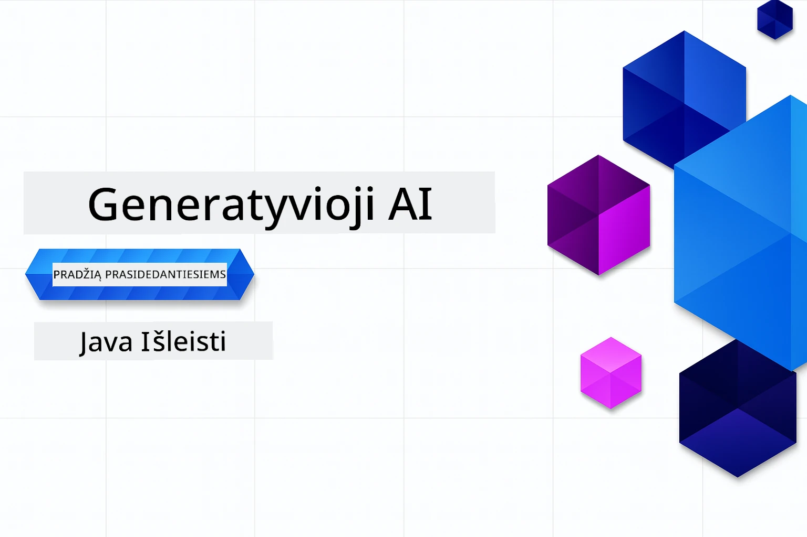

# Generatyvinis DI pradedantiesiems - Java leidimas
[](https://discord.gg/nTYy5BXMWG)



**Laiko įsipareigojimas**: Visą dirbtuvę galima atlikti internetu be vietinio nustatymo. Aplinkos nustatymas užtrunka 2 minutes, o mėginių tyrinėjimas priklauso nuo gilumo ir gali užtrukti nuo 1 iki 3 valandų.

> **Greitas pradėjimas** 

1. Padarykite šio repozitorijaus šaką savo GitHub paskyroje
2. Spauskite **Code** → skirtuką **Codespaces** → **...** → **Naujas su parinktimis...**
3. Naudokite numatytuosius nustatymus – tai parinks šiam kursui sukurtą kūrimo konteinerį
4. Spauskite **Create codespace**
5. Palaukite apie 2 minutes, kol aplinka bus paruošta
6. Iškart pereikite į [2 skyrių: Azure AI Foundry teikimas](./02-SetupDevEnvironment/README.md#step-2-provision-azure-ai-foundry)

## Daugiakalbė palaikymas

### Palaikoma per GitHub Action (automatiškai ir visada atnaujinta)

<!-- CO-OP TRANSLATOR LANGUAGES TABLE START -->
[Arabic](../ar/README.md) | [Bengali](../bn/README.md) | [Bulgarian](../bg/README.md) | [Burmese (Myanmar)](../my/README.md) | [Chinese (Simplified)](../zh-CN/README.md) | [Chinese (Traditional, Hong Kong)](../zh-HK/README.md) | [Chinese (Traditional, Macau)](../zh-MO/README.md) | [Chinese (Traditional, Taiwan)](../zh-TW/README.md) | [Croatian](../hr/README.md) | [Czech](../cs/README.md) | [Danish](../da/README.md) | [Dutch](../nl/README.md) | [Estonian](../et/README.md) | [Finnish](../fi/README.md) | [French](../fr/README.md) | [German](../de/README.md) | [Greek](../el/README.md) | [Hebrew](../he/README.md) | [Hindi](../hi/README.md) | [Hungarian](../hu/README.md) | [Indonesian](../id/README.md) | [Italian](../it/README.md) | [Japanese](../ja/README.md) | [Kannada](../kn/README.md) | [Khmer](../km/README.md) | [Korean](../ko/README.md) | [Lithuanian](./README.md) | [Malay](../ms/README.md) | [Malayalam](../ml/README.md) | [Marathi](../mr/README.md) | [Nepali](../ne/README.md) | [Nigerian Pidgin](../pcm/README.md) | [Norwegian](../no/README.md) | [Persian (Farsi)](../fa/README.md) | [Polish](../pl/README.md) | [Portuguese (Brazil)](../pt-BR/README.md) | [Portuguese (Portugal)](../pt-PT/README.md) | [Punjabi (Gurmukhi)](../pa/README.md) | [Romanian](../ro/README.md) | [Russian](../ru/README.md) | [Serbian (Cyrillic)](../sr/README.md) | [Slovak](../sk/README.md) | [Slovenian](../sl/README.md) | [Spanish](../es/README.md) | [Swahili](../sw/README.md) | [Swedish](../sv/README.md) | [Tagalog (Filipino)](../tl/README.md) | [Tamil](../ta/README.md) | [Telugu](../te/README.md) | [Thai](../th/README.md) | [Turkish](../tr/README.md) | [Ukrainian](../uk/README.md) | [Urdu](../ur/README.md) | [Vietnamese](../vi/README.md)

> **Pageidaujate klonuoti vietoje?**
>
> Šiame saugykloje yra 50+ kalbų vertimų, kurie žymiai padidina atsisiuntimo dydį. Norėdami klonuoti be vertimų, naudokite ribotą atsisiuntimą:
>
> **Bash / macOS / Linux:**
> ```bash
> git clone --filter=blob:none --sparse https://github.com/microsoft/Generative-AI-for-beginners-java.git
> cd Generative-AI-for-beginners-java
> git sparse-checkout set --no-cone '/*' '!translations' '!translated_images'
> ```
>
> **CMD (Windows):**
> ```cmd
> git clone --filter=blob:none --sparse https://github.com/microsoft/Generative-AI-for-beginners-java.git
> cd Generative-AI-for-beginners-java
> git sparse-checkout set --no-cone "/*" "!translations" "!translated_images"
> ```
>
> Tai suteikia viską, ko reikia kurso įgyvendinimui, su daug greitesniu atsisiuntimu.
<!-- CO-OP TRANSLATOR LANGUAGES TABLE END -->

## Kurso struktūra ir mokymosi kelias

### **1 skyrius: Įvadas į generatyvinį DI**
- **Pagrindinės sąvokos**: Didelių kalbinių modelių, žetonų, įdėjimų ir DI galimybių supratimas
- **Java DI ekosistema**: Spring AI ir OpenAI SDK apžvalga
- **Modelio konteksto protokolas**: MCP įvadas ir jo vaidmuo DI agentų komunikacijoje
- **Praktiniai panaudojimai**: Realūs scenarijai, įskaitant pokalbių robotus ir turinio generavimą
- **[→ Pradėti 1 skyrių](./01-IntroToGenAI/README.md)**

### **2 skyrius: Kūrimo aplinkos nustatymas**
- **Azure AI Foundry**: GPT-5.6 Luna pokalbiams ir text-embedding-3-small įdėjimų teikimas naudojant Bicep ir Azure Developer CLI (azd)
- **Spring Boot 4.1.1 + Spring AI 2.0.1**: Mokykitės su `ChatClient`, paremtu oficialiu OpenAI Java SDK ir Azure OpenAI v1
- **Autentifikavimas be raktų**: Saugus prisijungimas su Microsoft Entra ID — nereikia valdyti API raktų
- **Kūrimo įrankiai**: Docker konteineriai, VS Code ir GitHub Codespaces konfigūracija
- **[→ Pradėti 2 skyrių](./02-SetupDevEnvironment/README.md)**

### **3 skyrius: Pagrindinės generatyvinio DI technikos**
- **Oficialus OpenAI Java SDK**: Tiesioginis Azure OpenAI v1 kvietimas su autentifikavimu be raktų
- **Užklausų inžinerija**: Optimalios DI modelio reakcijos metodai
- **Įdėjimai ir vektorinės operacijos**: Semantinių paieškų ir panašumo suderinimo įgyvendinimas
- **Panaudojant paieškos papildytą generavimą (RAG)**: DI derinimas su savo duomenų šaltiniais
- **Funkcijų kvietimas**: Pratęskite DI galimybes naudodami pasirinktinius įrankius ir įskiepius
- **[→ Pradėti 3 skyrių](./03-CoreGenerativeAITechniques/README.md)**

### **4 skyrius: Praktiniai panaudojimai ir projektai**
- **Augintinių pasakojimų generatorius** (`petstory/`): Kūrybinis turinio generavimas su Azure AI Foundry
- **Foundry vietinis demonstravimas** (`foundrylocal/`): Vietinė DI modelio integracija su OpenAI Java SDK
- **MCP skaičiuoklio paslauga** (`calculator/`): Pagrindinė Modelio konteksto protokolo įgyvendinimas su Spring AI
- **[→ Pradėti 4 skyrių](./04-PracticalSamples/README.md)**

### **5 skyrius: Atsakingas DI kūrimas**
- **Azure AI Foundry turinio saugumas**: Išbandykite įmontuotas turinio filtravimo ir saugumo priemones (stiprūs blokatoriai ir minkšti atmetimai)
- **Atsakingo DI demonstracija**: Praktinis pavyzdys, kaip veikia modernios DI saugumo sistemos
- **Geriausios praktikos**: Esminės gairės etiškam DI kūrimui ir diegimui
- **[→ Pradėti 5 skyrių](./05-ResponsibleGenAI/README.md)**

## Papildomi ištekliai

<!-- CO-OP TRANSLATOR OTHER COURSES START -->
### LangChain
[](https://aka.ms/langchain4j-for-beginners)
[](https://aka.ms/langchainjs-for-beginners?WT.mc_id=m365-94501-dwahlin)
[](https://github.com/microsoft/langchain-for-beginners?WT.mc_id=m365-94501-dwahlin)
---

### Azure / Edge / MCP / Agentai
[](https://github.com/microsoft/AZD-for-beginners?WT.mc_id=academic-105485-koreyst)
[](https://github.com/microsoft/edgeai-for-beginners?WT.mc_id=academic-105485-koreyst)
[](https://github.com/microsoft/mcp-for-beginners?WT.mc_id=academic-105485-koreyst)
[](https://github.com/microsoft/ai-agents-for-beginners?WT.mc_id=academic-105485-koreyst)

---
 
### Generatyvinio DI serija
[](https://github.com/microsoft/generative-ai-for-beginners?WT.mc_id=academic-105485-koreyst)
[-9333EA?style=for-the-badge&labelColor=E5E7EB&color=9333EA)](https://github.com/microsoft/Generative-AI-for-beginners-dotnet?WT.mc_id=academic-105485-koreyst)
[-C084FC?style=for-the-badge&labelColor=E5E7EB&color=C084FC)](https://github.com/microsoft/generative-ai-for-beginners-java?WT.mc_id=academic-105485-koreyst)
[-E879F9?style=for-the-badge&labelColor=E5E7EB&color=E879F9)](https://github.com/microsoft/generative-ai-with-javascript?WT.mc_id=academic-105485-koreyst)

---
 
### Pagrindinis mokymasis
[](https://aka.ms/ml-beginners?WT.mc_id=academic-105485-koreyst)
[](https://aka.ms/datascience-beginners?WT.mc_id=academic-105485-koreyst)
[](https://aka.ms/ai-beginners?WT.mc_id=academic-105485-koreyst)
[](https://github.com/microsoft/Security-101?WT.mc_id=academic-96948-sayoung)
[](https://aka.ms/webdev-beginners?WT.mc_id=academic-105485-koreyst)
[](https://aka.ms/iot-beginners?WT.mc_id=academic-105485-koreyst)
[](https://github.com/microsoft/xr-development-for-beginners?WT.mc_id=academic-105485-koreyst)

---
 
### Copilot serija
[](https://aka.ms/GitHubCopilotAI?WT.mc_id=academic-105485-koreyst)
[](https://github.com/microsoft/mastering-github-copilot-for-dotnet-csharp-developers?WT.mc_id=academic-105485-koreyst)
[](https://github.com/microsoft/CopilotAdventures?WT.mc_id=academic-105485-koreyst)
<!-- CO-OP TRANSLATOR OTHER COURSES END -->

## Pagalbos gavimas

Jei užstringate ar turite klausimų apie DI programų kūrimą, prisijunkite prie kitų besimokančių ir patyrusių kūrėjų diskusijų apie MCP. Tai palaikanti bendruomenė, kurioje klausimai yra laukiami, o žinios dalijamasi laisvai.

[](https://discord.gg/nTYy5BXMWG)

Jei turite atsiliepimų apie produktą ar klaidų kūrimo metu, apsilankykite:

[](https://aka.ms/foundry/forum)

---

<!-- CO-OP TRANSLATOR DISCLAIMER START -->
**Atsakomybės apribojimas**:
Šis dokumentas buvo išverstas naudojant dirbtinio intelekto vertimo paslaugą [Co-op Translator](https://github.com/Azure/co-op-translator). Nors siekiame tikslumo, prašome atkreipti dėmesį, kad automatiniai vertimai gali turėti klaidų ar netikslumų. Originalus dokumentas jo gimtąja kalba laikomas autoritetingu šaltiniu. Svarbiai informacijai rekomenduojama naudoti profesionalų žmogiškąjį vertimą. Mes neatsakome už jokius nesusipratimus ar neteisingą interpretaciją, kilusią naudojantis šiuo vertimu.
<!-- CO-OP TRANSLATOR DISCLAIMER END -->