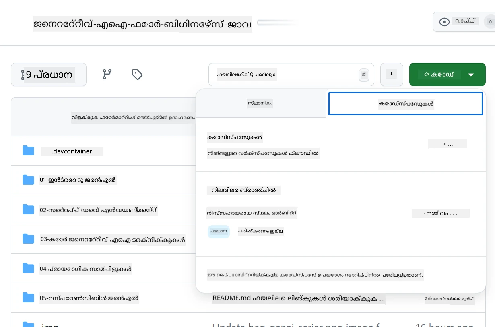
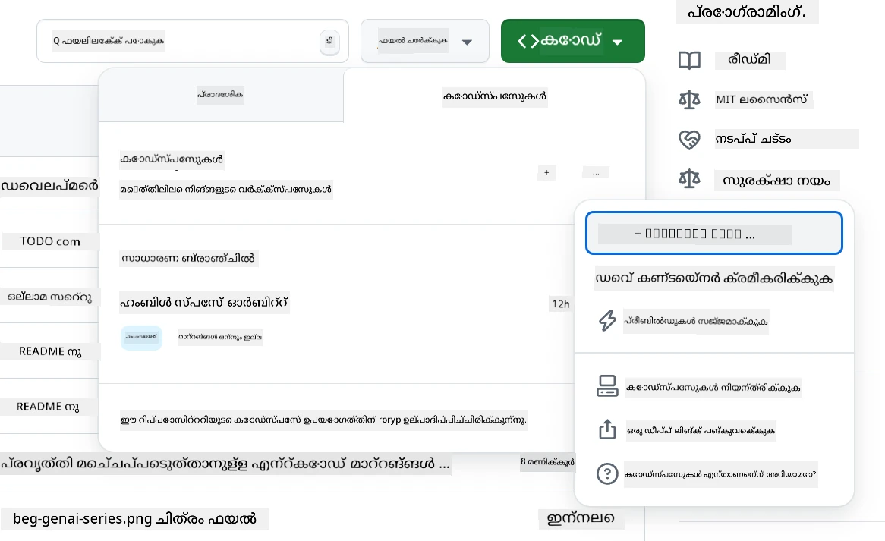
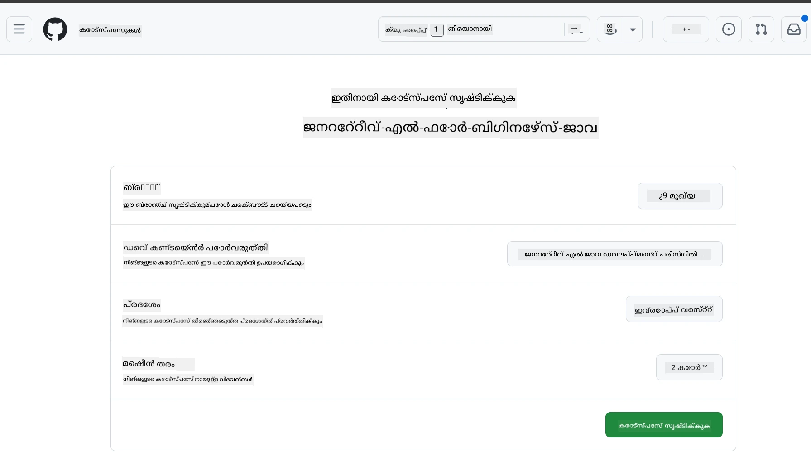
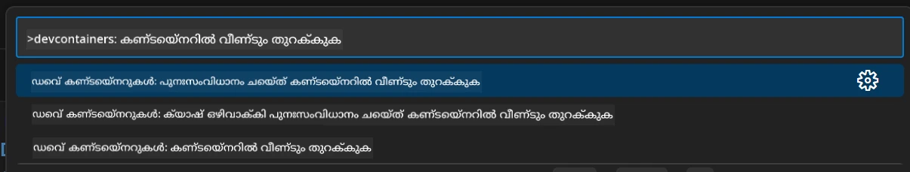
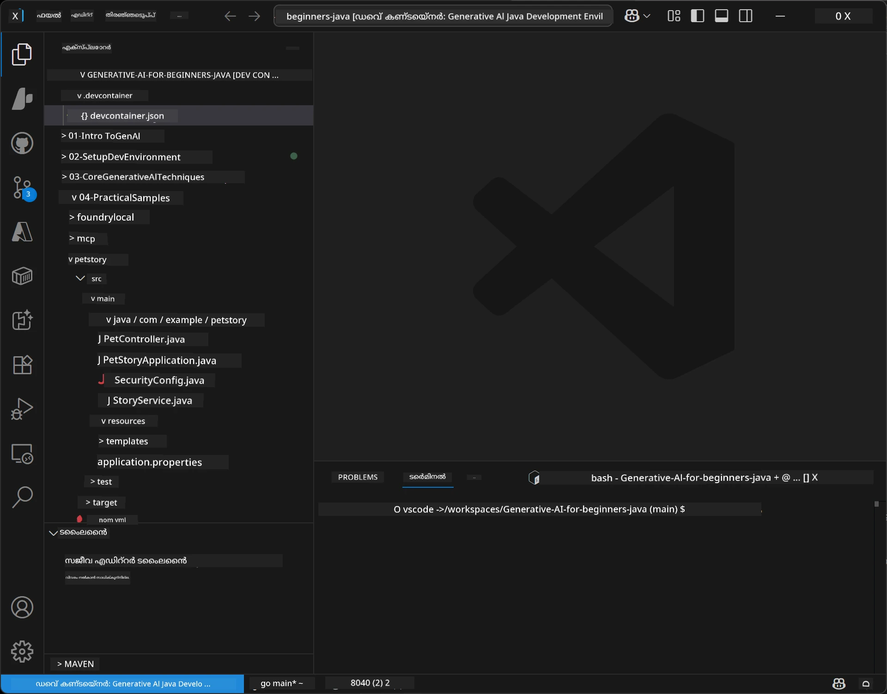
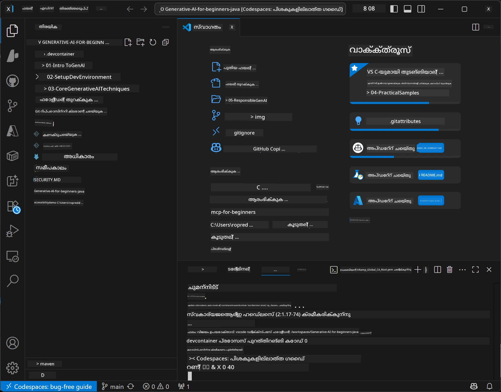

# ജാവയ്‌ക്കുള്ള ജനറേറ്റീവ് AI ഡെവലപ്പ്മെന്റ് പരിസ്ഥിതി ക്രമീകരിക്കല്‍

> **തുര്ത്തമായ ആരംഭം:** കുറച്ച് മിനിറ്റുകളിൽ Bicep + `azd` ഉപയോഗിച്ച് **Azure AI Foundry**-യില്‍ നിങ്ങളുടെ AI മോഡലുകള്‍ കോഡായി പ്രൊവിഷൻ ചെയ്യൂ — [Azure AI Foundry സെറ്റപ്പ് ഗൈഡ്](getting-started-azure-openai.md) കാണുക. അഥന്റ്‌ടിക്കേഷൻ **കീയ്ലെസ്‌** ആണ് (Microsoft Entra ID), അതിനാൽ API കീകൾ കൈകാര്യം ചെയ്യേണ്ടതില്ല.

## നിങ്ങൾ പഠിക്കുകയുള്ളത്

- AI അപ്ലിക്കേഷനുകളിൽ ജാവ ഡെവലപ്പ്മെന്റ് പരിസ്ഥിതി ക്രമീകരിക്കുക
- നിങ്ങൾ ഇഷ്ടമുളള ഡെവലപ്പ്മെന്റ് പരിസ്ഥിതി തിരഞ്ഞെടുക്കുക (Codespaces ഉപയോഗിച്ച് ക്ലൗഡ്-ഫസ്റ്റ്, ലോക്കൽ ഡെവ് കണ്ടെയ്‌നർ, അല്ലെങ്കിൽ പൂർണ്ണ ലോക്കൽ ക്രമീകരണം)
- Azure AI Foundry മോഡലുമായി ബന്ധിപ്പിച്ച് നിങ്ങളുടെ ക്രമീകരണം ടെസ്റ്റ് ചെയ്യുക

## ഉള്ളടക്ക പട്ടിക

- [നിങ്ങൾ അറിയാനുള്ളത്](#നിങ്ങൾ-പഠിക്കുകയുള്ളത്)
- [ആമുഖം](#ആമുഖം)
- [പടി 1: നിങ്ങളുടെ ഡെവലപ്പ്മെന്റ് പരിസ്ഥിതി ക്രമീകരിക്കുക](#പടി-1-നിങ്ങളുടെ-ഡെവലപ്പ്മെന്റ്-പരിസ്ഥിതി-ക്രമീകരിക്കുക)
  - [വികൽപം A: GitHub Codespaces (ശുപാർശചെയ്യപ്പെടുന്നു)](#ഓപ്ഷൻ-a-github-codespaces-ശുപാർശചെയ്യപ്പെടുന്നു)
  - [വികൽപം B: ലോക്കൽ ഡെവ് കണ്ടെയ്‌നർ](#ഓപ്ഷൻ-b-ലോക്കൽ-ഡെവ്-കണ്ടെയ്‌നർ)
  - [വികൽപം C: നിങ്ങളുടെ നിലവിലുള്ള ലോക്കൽ ഇൻസ്റ്റളേഷൻ ഉപയോഗിക്കുക](#ഓപ്ഷൻ-c-നിങ്ങളുടെ-നിലവിലുള്ള-ലോക്കൽ-ഇൻസ്റ്റാളേഷൻ-ഉപയോഗിക്കുക)
- [പടി 2: Azure AI Foundry പ്രൊവിഷൻ ചെയ്യുക](#പടി-2-azure-ai-foundry-പ്രൊവിഷൻ-ചെയ്യുക)
- [പടി 3: നിങ്ങളുടെ ക്രമീകരണം പരിശോധന](#പടി-3-നിങ്ങളുടെ-ക്രമീകരണം-ടെസ്റ്റ്-ചെയ്യുക)
- [പ്രശ്നപരിഹാരം](#പ്രശ്നപരിഹാരം)
- [സംഗൃഹം](#സംഗ്രഹം)
- [അടുത്ത നടപടികൾ](#അടുത്ത-നടപടികൾ)

## ആമുഖം

ഈ അധ്യായം നിങ്ങൾ ഒരു ഡെവലപ്പ്മെന്റ് പരിസ്ഥിതി ക്രമീകരിക്കുമ്പോൾ വഴി കാണിച്ചുതരും. ഈ കോഴ്‌സിൽ മുഴുവൻ മോഡലുകൾക്കായി **Azure AI Foundry** ഉപയോഗിക്കും. നിങ്ങൾ മോഡലുകൾ Bicep-ഉം Azure Developer CLI (`azd`)ഉം ഉപയോഗിച്ച് കോഡായി പ്രൊവിഷൻചെയ്യും, പിന്നീട് **കീയ്ലെസ് അഥന്റ്‌ടിക്കേഷൻ** (Microsoft Entra ID) ഉപയോഗിച്ച് കണക്ട് ചെയ്യും — API കീകൾ പകർക്കാനോ ചോരിക്കാനോ നേടേണ്ടതില്ല.

**ലോക്കൽ ക്രമീകരണം വേണ്ട!** GitHub Codespaces ഉപയോഗിക്കാവുന്നത് ബ്രൗസറിൽ പൂർണ്ണ ഡെവലപ്പ്മെന്റ് പരിസ്ഥിതിയോടെയാണ്, അവിടെ നിന്ന് Foundry പ്രൊവിഷൻ ചെയ്യാം.

ഈ കോഴ്‌സിനായി **Azure AI Foundry** ഉപയോഗിക്കുന്നത് കാരണം:
- **കോടായി പ്രൊവിഷൻ ചെയ്യപ്പെടുന്നു** — ഒരു `azd up` കമാൻഡ് അക്കൗണ്ട്, മോഡൽ ഡെപ്ലോയ്മെന്റുകൾ ഡിപ്ലോയ് ചെയ്യുന്നു
- **കീയ്ലെസ്** — നിങ്ങളുടെ Azure ലോഗിൻ അല്ലെങ്കിൽ മാനേജ്ഡ് ഐഡന്റിറ്റി ഉപയോഗിച്ച് അഥന്റ്‌ടിക്കേറ്റ് ചെയ്യാം
- **പ്രൊഡക്ഷൻ-സജ്ജം** — ഐറ്റേം കോഡ് ലോക്കലിലും Azure-ലും സമാനമായി പ്രവർത്തിക്കുന്നു
- **ലവനീയമാക്കാവുന്നത്** — ഡെപ്ലോയ്മെന്റ് നാമം മാറ്റി മോഡലുകൾ സ്വിച്ച് ചെയ്യാം, കോഡ് മാറ്റേണ്ടതില്ല

> **കുറിപ്പ്**: Azure AI Foundry ഡെപ്ലോയ്മെന്റുകൾ ടോക്കൺ അടിസ്ഥാനത്തിൽ (പേ-അസ്-യു-ഗോ) ബില്ല് ചെയ്യപ്പെടുന്നു. പ്രൊവിഷനിംഗ്, മേഖല, ചെലവ് വിവരങ്ങൾക്ക് [Azure AI Foundry സെറ്റപ്പ് ഗൈഡ്](getting-started-azure-openai.md) കാണുക.


## പടി 1: നിങ്ങളുടെ ഡെവലപ്പ്മെന്റ് പരിസ്ഥിതി ക്രമീകരിക്കുക

<a name="quick-start-cloud"></a>

ഈ ജനറേറ്റീവ് AI ജാവ കോഴ്‌സിനായി നിങ്ങളുടെ ക്രമീകരണ സമയം കുറയ്ക്കാനും എല്ലാ ആവശ്യമായ ടൂളുകളും ഉണ്ടാകാനും പ്രീ-കൺഫിഗർ ചെയ്ത ഡെവലപ്പ്മെന്റ് കണ്ടെയ്‌നർ ഞങ്ങൾ സൃഷ്ടിച്ചിട്ടുണ്ട്. നിങ്ങളുടെ ഇഷ്ടംപ്രകാരമായി ഡെവലപ്പ്മെന്റ് സമീപനം തിരഞ്ഞെടുക്കൂ:

### പരിസ്ഥിതി ക്രമീകരണോപ്ഷനുകൾ:

#### ഓപ്ഷൻ A: GitHub Codespaces (ശുപാർശചെയ്യപ്പെടുന്നു)

**2 മിനിറ്റ് കൊണ്ട് കോഡിങ്ങ് ആരംഭിക്കുക - ലോക്കൽ ക്രമീകരണം വേണ്ട!**

1. ഈ റിപോസിറ്ററി നിങ്ങളുടെ GitHub അക്കൗണ്ടിലേക്ക് ഫോർക്കു ചെയ്യുക
   > **കുറിപ്പ്**: അടിസ്ഥാന കോൺഫിഗ് എഡിറ്റ് ചെയിക്കാനാഗ്രഹിക്കുന്നുവെങ്കിൽ [Dev Container Configuration](../../../.devcontainer/devcontainer.json) കാണുക
2. **Code** → **Codespaces** ടാബ് → **...** → **New with options...** ക്ലിക്ക് ചെയ്യുക
3. ഡീഫോൾട്ടുകൾ ഉപയോഗിക്കുക – ഇതു കോഴ്‌സിനായി സൃഷ്ടിച്ച **Generative AI Java Development Environment** കസ്റ്റം ഡെവ് കണ്ടെയ്‌നർ കോൺഫിഗറേഷൻ തിരഞ്ഞെടുക്കും
4. **Create codespace** ക്ലിക്ക് ചെയ്യുക
5. പരിസ്ഥിതി റെഡി ആകാൻ ഏകദേശം 2 മിനിറ്റു കാത്തിരിക്കുക
6. [പടി 2: Azure AI Foundry പ്രൊവിഷൻ ചെയ്യുക](#പടി-2-azure-ai-foundry-പ്രൊവിഷൻ-ചെയ്യുക) ആയി മുന്നേറുക








> **Codespaces ന്റെ പ്രയോജനങ്ങൾ**:
> - ലോക്കൽ ഇൻസ്റ്റളേഷൻ ആവശ്യമായില്ല
> - ബ്രൗസർ ഉള്ള ഏതൊരു ഉപകരണത്തിലും പ്രവർത്തിക്കും
> - എല്ലാ ടൂളുകളും ഡിപെൻഡൻസികളും മുൻകൂർ കോൺഫിഗർ ചെയ്തിട്ടുണ്ട്
> - വ്യക്തിഗത അക്കൗണ്ടുകൾക്ക് പ്രതി മാസം 60 മണിക്കൂർ ഫ്രീ
> - എല്ലാ പഠിതാക്കളും ഒരേ പരിസ്ഥിതിയിൽ പഠിക്കാം

#### ഓപ്ഷൻ B: ലോക്കൽ ഡെവ് കണ്ടെയ്‌നർ

**ഡോക്കർ ഉപയോഗിച്ച് ലോക്കൽ ഡെവലപ്പ്മെന്റ് ഇഷ്ടപ്പെടുന്നവർക്കുള്ളത്**

1. ഈ റിപോസിറ്ററി നിങ്ങളുടെ ലോക്കൽ മെഷീനിലേക്ക് ഫോർക്കും ക്ലോൺ ചെയ്യുക
   > **കുറിപ്പ്**: അടിസ്ഥാന കോൺഫിഗ് എഡിറ്റ് ചെയ്യാനുണ്ടെങ്കില്‍ [Dev Container Configuration](../../../.devcontainer/devcontainer.json) കാണുക
2. [Docker Desktop](https://www.docker.com/products/docker-desktop/) ഉം [VS Code](https://code.visualstudio.com/) ഉം ഇൻസ്റ്റാൾ ചെയ്യുക
3. VS Code-ൽ [Dev Containers extension](https://marketplace.visualstudio.com/items?itemName=ms-vscode-remote.remote-containers) ഇൻസ്റ്റാൾ ചെയ്യുക
4. റിപോസിറ്ററി ഫോള്‍ഡർ VS Code-ൽ ഓപ്പൺ ചെയ്യുക
5. പ്രാമ്പ്റ്റ് വന്നാൽ **Reopen in Container** (അല്ലെങ്കിൽ `Ctrl+Shift+P` → "Dev Containers: Reopen in Container") ക്ലിക്ക് ചെയ്യുക
6. കണ്ടെയ്‌നർ ബിൽഡിങ്ങും സ്റ്റാർട്ടും പൂര്‍ത്തിയാകാൻ കാത്തിരിക്കുക
7. [പടി 2: Azure AI Foundry പ്രൊവിഷൻ ചെയ്യുക](#പടി-2-azure-ai-foundry-പ്രൊവിഷൻ-ചെയ്യുക) ആയി മുന്നേറുക





#### ഓപ്ഷൻ C: നിങ്ങളുടെ നിലവിലുള്ള ലോക്കൽ ഇൻസ്റ്റാളേഷൻ ഉപയോഗിക്കുക

**ഇല്ലെങ്കിൽ നിലവിലുള്ള ജാവ പരിസ്ഥിതി ഉള്ള ഡെവലപ്പർമാർക്കുള്ളത്**

മുൻനിബന്ധനകൾ:
- [Java 21+](https://www.oracle.com/java/technologies/javase/jdk21-archive-downloads.html) 
- [Maven 3.9+](https://maven.apache.org/download.cgi)
- [VS Code](https://code.visualstudio.com) അല്ലെങ്കിൽ നിങ്ങളുടെ ഇഷ്ടപ്പെട്ട IDE

ചുവടുവയ്പ്പുകൾ:
1. ഈ റിപോസിറ്ററി നിങ്ങളുടെ ലോക്കൽ മെഷീനിലേക്ക് ക്ലോൺ ചെയ്യുക
2. പ്രോജക്റ്റ് നിങ്ങളുടെ IDE-ൽ തുറക്കുക
3. [പടി 2: Azure AI Foundry പ്രൊവിഷൻ ചെയ്യുക](#പടി-2-azure-ai-foundry-പ്രൊവിഷൻ-ചെയ്യുക) ആയി മുന്നേറുക

> **പ്രൊ ടിപ്പ്**: നിങ്ങളുടെ സിസ്റ്റം ലോ സ്പെക് ആയിരുന്നാലും, നിങ്ങൾക്ക് VS Code ലോക്കലായി വേണമെങ്കില്‍ GitHub Codespaces ഉപയോഗിക്കുക! നിങ്ങളുടെ ലോക്കൽ VS Code ഒരു ക്ലൗഡ്-ഹോസ്റ്റ് ചെയ്ത Codespace-hez കണക്ട് ചെയ്യാം ഇത് മികച്ച അനുഭവം നൽകും.




## പടി 2: Azure AI Foundry പ്രൊവിഷൻ ചെയ്യുക

കോഴ്‌സിന്റെ AI മോഡലുകൾ Azure AI Foundry-ൽ കോഡായി പ്രൊവിഷൻ ചെയ്യുക. റിപോസിറ്ററി റൂട്ട് ഇൽനിന്ന്:

```bash
cd 02-SetupDevEnvironment
azd auth login
az login
azd up
```

`azd` വഴി പരിസ്ഥിതിയുടെ പേര്, സബ്സ്ക്രിപ്ഷൻ, ജില്ല (region) ചോദിക്കുന്നു, `gpt-5.6-luna` ഉം `text-embedding-3-small` ഉം ഉള്ള Azure AI Foundry അക്കൗണ്ട് പ്രൊവിഷൻ ചെയ്യുന്നു, ഉദാഹരണ `.env`-ലേക്ക് എൻഡ്പോയിന്റ് എഴുതുന്നു - എല്ലാം **കീയ്ലെസ്** അഥന്റ്‌ടിക്കേഷൻ ഉപയോഗിച്ച് (API കീകൾ ഇല്ലാതെ).

> **സंपൂർണ്ണ കൈകാര്യം:** മുൻനിബന്ധനകൾ, മാനുവൽ (പോർട്ടൽ ആപ്ഷൻ), മേഖലാ മാർഗ്ഗനിർദ്ദേശങ്ങൾ, ചെലവ്/സ്ലീൻ അപ് കുറിപ്പുകൾക്കായി [Azure AI Foundry സെറ്റപ്പ് ഗൈഡ്](getting-started-azure-openai.md) കാണൂ.

## പടി 3: നിങ്ങളുടെ ക്രമീകരണം ടെസ്റ്റ് ചെയ്യുക

നിങ്ങളുടെ Foundry മോഡലുകൾ പ്രൊവിഷൻ ചെയ്ത കഴിഞ്ഞു, ഉദാഹരണ അപ്ലിക്കേഷൻ [`02-SetupDevEnvironment/examples/basic-chat-azure`](../../../02-SetupDevEnvironment/examples/basic-chat-azure) ഉപയോഗിച്ച് ബന്ധം പരീക്ഷിക്കുക.

1. നിങ്ങളുടെ ഡെവലപ്പ്മെന്റ് പരിസ്ഥിതിയിലെ ടർമിനൽ തുറക്കുക.
2. ഉദാഹരണ ഫോൾഡറിൽ പോകുക:
   ```bash
   cd 02-SetupDevEnvironment/examples/basic-chat-azure
   ```
3. സൈൻ ഇൻ ചെയ്തിട്ടുണ്ടെന്ന് ഉറപ്പാക്കുക (കീയ്ലെസ് അഥന്റ്‌ടിക്കേഷനായി ടോക്കൺ വേണം):
   ```bash
   az login
   ```
   > നിങ്ങൾ `azd up` ഓടിച്ചിരുന്നെങ്കിൽ, എൻഡ്പോയിന്റ് അടങ്ങിയ `.env` ഫയൽ ഇതിനകം തന്നെ എഴുതി കഴിഞ്ഞിരിക്കും.
4. അപ്ലിക്കേഷൻ റൺ ചെയ്യുക:
   ```bash
   mvn clean spring-boot:run
   ```

`gpt-5.6-luna` മോഡലിൽ നിന്നുള്ള പ്രതികരണമൊന്ന് കാണും.

### ഉദാഹരണ കോഡ് മനസ്സിലാക്കുക

[basic-chat ഉദാഹരണം](./examples/basic-chat-azure/README.md) **Spring Boot 4.1.1** എന്നും **Spring AI 2.0.1** എന്നും ഉപയോഗിക്കുന്നു. Spring AIയുടെ `ChatClient` ഔദ്യോഗിക OpenAI Java SDK ഉപയോഗിച്ച് പിന്തുണക്കപ്പെടുന്നു, Azure OpenAI **v1** എൻഡ്പോയിന്റിലേക്ക് കീയ്ലെസ് അഥന്റ്‌ടിക്കേഷനോടെ കണക്ട് ചെയ്യുന്നു.

**ഈ കോഡ് ചെയ്യുന്ന കാര്യങ്ങൾ:**
- നിങ്ങളുടെ Azure സൈൻ-ഇൻ ഉപയോഗിച്ച് Azure AI Foundry-യോട് **കണക്ട് ചെയ്യുക** (Microsoft Entra ID) — API കീ ഇല്ല
- `gpt-5.6-luna` മോഡലിന് പ്രശ്നം (prompt) **അയയ്ക്കുക**
- AIയുടെ പ്രതികരണം **സ്വീകരിക്കുകയും** പ്രദർശിപ്പിക്കുകയും ചെയ്യുക
- നിങ്ങളുടെ ക്രമീകരണം ശരിയായി പ്രവർത്തിക്കുന്നുവെന്ന് **സാധൂകരിക്കുക**

**പ്രധാന ഡിപ്പെൻഡൻസികൾ** ([pom.xml](../../../02-SetupDevEnvironment/examples/basic-chat-azure/pom.xml) യിൽ നിന്നുള്ള اقتباس):
```xml
<dependency>
    <groupId>org.springframework.ai</groupId>
    <artifactId>spring-ai-starter-model-openai</artifactId>
</dependency>
<dependency>
    <groupId>com.openai</groupId>
    <artifactId>openai-java</artifactId>
</dependency>
<dependency>
    <groupId>com.azure</groupId>
    <artifactId>azure-identity</artifactId>
    <version>${azure-identity.version}</version>
</dependency>
```

POM OpenAI Java **4.63.1** നിയന്ത്രിക്കുകയും Azure Identity **1.18.6** വ്യക്തമാക്കുകയും ചെയ്യുന്നു. Spring AI 2.Azure-സ്പെസിഫിക് സ്റ്റാർട്ടറെ നീക്കം ചെയ്തു; Azure Identity ക്രെഡൻഷ്യൽ ബീൻ വേണ്ടി ഇപ്പോഴും ആവശ്യമാണ്.

**കോൺഫിഗറേഷൻ** ([application.yml](../../../02-SetupDevEnvironment/examples/basic-chat-azure/src/main/resources/application.yml)):
```yaml
spring:
  ai:
    openai:
      base-url: ${AZURE_OPENAI_ENDPOINT}
      microsoft-foundry: true
      chat:
        model: ${AZURE_OPENAI_DEPLOYMENT:gpt-5.6-luna}
        reasoning-effort: none
        max-completion-tokens: 500
```

[BasicChatApplication.java](../../../02-SetupDevEnvironment/examples/basic-chat-azure/src/main/java/com/example/BasicChatApplication.java) യിൽ കീയ്ലെസ് അഥന്റ്‌ടിക്കേഷൻ വ്യക്തമാക്കിയിട്ടുള്ളതാണ്, API കീയില്ലായ്മയിൽ നിന്നുള്ള നീക്കമല്ല. ബെയറർ ക്രെഡൻഷ്യൽ `DefaultAzureCredential` ഉപയോഗിച്ചും `https://ai.azure.com/.default` സ്‌കോപ്പ് ഉൾപ്പെടുത്തിയും, `OpenAIClient` `/openai/v1` ലക്ഷ്യമിട്ടും പ്രവർത്തിക്കുന്നു. ആപ്പ് ഈ ക്ലയന്റിനെ Spring AI ചാറ്റ് മോഡലിന് നൽകുന്നു, അതിനാൽ ആഗോള `OPENAI_API_KEY` Azure അഥന്റ്‌ടിക്കേഷൻ മറികടക്കാൻ കഴിയില്ല.

ചാറ്റ് ക്രമീകരണങ്ങൾ `spring.ai.openai.chat`-ന്റെ കീഴിലാണ്, `options` ബ്ലോക്ക് ഇല്ലാതെ. പാഠം നാലടിസ്ഥാന ചാറ്റ് കോംപ്ലീഷനുകൾ(reasoning-effort: none) 500-ടോക്കൺ പരിധിയാണ് കൈവരുന്നത്; temperature അല്ല max-tokens ക്രമീകരിച്ചിട്ടില്ല. API തിരഞ്ഞെടുപ്പിനും ടൂൾ-കോളിംഗ് ഗൈഡൻസിനും ഉദാഹരണത്തിന് [configuration reference](./examples/basic-chat-azure/README.md#spring-configuration) കാണുക.

## സംഗ്രഹം

മേൽപ്പറഞ്ഞ ചുവടുകൾ പൂർത്തിയാക്കിയതിന് ശേഷം, നിങ്ങൾക്ക്:

- Bicep + `azd` ഉപയോഗിച്ച് Azure AI Foundry മോഡലുകൾ കോഡായി പ്രൊവിഷൻ ചെയ്തിട്ടുണ്ട്
- നിങ്ങൾ ജാവ ഡെവലപ്പ്മെന്റ് പരിസ്ഥിതി പ്രവർത്തനക്ഷമമാക്കിയിട്ടുണ്ട് (Codespaces, ഡെവ് കണ്ടെയ്‌നറുകൾ, അല്ലെങ്കിൽ ലോക്കൽ)
- കീയ്ലെസ്സ് അഥന്റ്‌ടിക്കേഷൻ (Microsoft Entra ID) ഉപയോഗിച്ച് Azure AI Foundry-യുമായി കണക്റ്റ് ചെയ്തിട്ടുണ്ട് — API കീകൾ ഇല്ലാതെ
- നിങ്ങളുടെ മോഡലിനുമായി ആശയവിനിമയം ചെയ്യുന്ന ലളിതമായ ഉദാഹരണത്തോടെ എല്ലാം പ്രവർത്തിക്കുന്നുണ്ടെന്ന് പരിശോധിച്ചു

## അടുത്ത നടപടികൾ

[അധ്യായം 3: മുഖ്യ ജനറേറ്റീവ് AI സാങ്കേതികവിദ്യകൾ](../03-CoreGenerativeAITechniques/README.md)

## പ്രശ്നപരിഹാരം

പ്രശ്നങ്ങളുണ്ടാകുന്നു? ഇവ ചില സാധാരണ പ്രശ്നങ്ങളും പരിഹാരങ്ങളും:

- **അഥന്റ്‌ടിക്കേഷൻ പരാജയപ്പെടുന്നുണ്ടോ (401/403)?** 
  - `az login` ഓടിക്കുക — അഥന്റ്‌ടിക്കേഷൻ കീയ്ലെസാണ്, അതിനാൽ sign in ചെയ്തിരിക്കണം
  - നിങ്ങളുടെ അക്കൗണ്ടിന് ഈ റെസോഴ്‌സിൽ **Cognitive Services OpenAI User** റോളുണ്ട് എന്ന് ഉറപ്പുവരുത്തുക
  - നിങ്ങൾ ഇപ്പോൾ പ്രൊവിഷൻ ചെയ്തെങ്കിൽ, റോളിന്റെ അസൈൻമെന്റ് പ്രചരിക്കാൻ ഒരു മിനിറ്റ് കാത്തിരിക്കുക

- **മേവൻ കണ്ടെത്താനായില്ല?** 
  - ഡെവ് കണ്ടെയ്‌നറുകളും Codespaces-ഉം ഉപയോഗിച്ചാൽ, മേവൻ മുൻകൂർ ഇൻസ്റ്റാൾ ചെയ്തിരിക്കണം
  - ലോക്കൽ ക്രമീകരണത്തിന്, Java 21+ മേവൻ 3.9+ ഇൻസ്റ്റാൾ ചെയ്തിട്ടുണ്ടെന്ന് ഉറപ്പാക്കുക
  - ഇൻസ്റ്റലേഷൻ പരിശോദിക്കാൻ `mvn --version` പരീക്ഷിക്കുക

- **`azd` കണ്ടെത്താനായില്ല അല്ലെങ്കിൽ പ്രൊവിഷനിംഗ് പരാജയപ്പെടുന്നു?** 
  - [Azure Developer CLI](https://aka.ms/azure-dev/install) ഇൻസ്റ്റാൾ ചെയ്ത് `azd auth login` ഓടിക്കുക
  - `gpt-5.6-luna` ഉം `text-embedding-3-small` ഉം ലഭ്യമായ മേഖല (ഉദാ: `eastus2`) തിരഞ്ഞെടുക്കുക, സബ്സ്ക്രിപ്ഷനിൽ യോജിച്ച ക്വോട്ട ഉണ്ട് എന്ന് ഉറപ്പാക്കുക
  - വിശദാംശങ്ങൾക്ക് [Azure AI Foundry സെറ്റപ്പ് ഗൈഡ്](getting-started-azure-openai.md) കാണുക

- **ഡെവ് കണ്ടെയ്‌നർ സ്റ്റാർട്ട് ആവുന്നില്ല?** 
  - Docker Desktop പ്രവർത്തനത്തിൽ ഉറപ്പാക്കുക (ലോക്കൽ ഡെവലപ്പ്മെന്റിനായി)
  - കണ്ടെയ്‌നർ പുന:ബിൽഡ് ചെയ്യാൻ ശ്രമിക്കുക: `Ctrl+Shift+P` → "Dev Containers: Rebuild Container"

- **അപ്ലിക്കേഷൻ കമ്പൈലേഷൻ പിശകുകൾ?**
  - ശരിയായ ഡയറക്ടറിയിലാണ് നിലവിൽ: `02-SetupDevEnvironment/examples/basic-chat-azure`
  - ക്ലീൻ ചെയ്ത് പുനർനിർമ്മിച്ച് നോക്കുക: `mvn clean compile`

> **സഹായം വേണോ?**: പ്രശ്നങ്ങൾ തുടരുകയാണെങ്കിൽ, റിപോസിറ്ററിയിൽ ഒരു ഇഷ്യൂ തുറക്കൂ, ഞങ്ങൾ സഹായിക്കും.

---

<!-- CO-OP TRANSLATOR DISCLAIMER START -->
**അറിയിപ്പ്**:
ഈ രേഖ AI പരിഭാഷാ സേവനം [Co-op Translator](https://github.com/Azure/co-op-translator) ഉപയോഗിച്ച് പരിഭാഷപ്പെടുത്തിയതാണ്. ഞങ്ങൾ കൃത്യതയ്ക്കായി ശ്രമിക്കുന്നുവെങ്കിലും, ഓട്ടോമേറ്റഡ് പരിഭാഷകളിൽ പിഴവുകൾ അല്ലെങ്കിൽ തെറ്റായ വിവരങ്ങൾ ഉണ്ടാകാൻ സാധ്യതയുണ്ട്. അതിന്റെ സ്വാഭാവിക ഭാഷയിലുള്ള അസൽ രേഖയാണ് പ്രാമാണികമായ ഉറവിടമായി പരിഗണിക്കേണ്ടത്. നിർണായകമായ വിവരങ്ങൾക്ക്, പ്രൊഫഷണൽ മനുഷ്യ പരിഭാഷ ശുപാർശ ചെയ്യുന്നു. ഈ പരിഭാഷ ഉപയോഗിച്ച് ഉണ്ടാകുന്ന തെറ്റിദ്ധാരണകൾ അല്ലെങ്കിൽ തെറ്റായ വ്യാഖ്യാനങ്ങൾക്കായി ഞങ്ങൾ ഉത്തരവാദികളല്ല.
<!-- CO-OP TRANSLATOR DISCLAIMER END -->