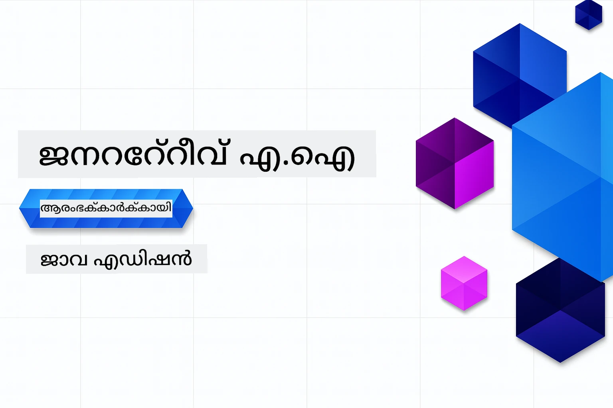

# അതിജീവനത്തിന്_GENERATIVE AI - ജാവ പതിപ്പ്
[](https://discord.gg/nTYy5BXMWG)



**സമയം സമർപ്പിക്കൽ**: ഈ വേർക്ക്ഷോപ്പ് പൂർണമായും ഓൺലൈനിൽ അവതരിക്കാൻ കഴിയും, യാതൊരു ലോക്കൽ സെറ്റപ്പും വേണ്ട. പരിസ്ഥിതി സെറ്റപ്പ് 2 മിനിറ്റ് എടുക്കും, സാമ്പിളുകൾ പര്യവേക്ഷിക്കുന്നതിന് 1-3 മണിക്കൂർ വരെ ആഴത്തിൽ ആശ്രയിച്ച് സമയമെടുക്കും.

> **ദ്രുത തുടക്കം**

1. ഈ റിപ്പോസിറ്ററി നിങ്ങളുടെ GitHub അക്കൗണ്ടിലേക്ക് ഫോർക്ക് ചെയ്യുക
2. **Code** → **Codespaces** ടാബിൽ ക്ലിക്ക് ചെയ്യുക → **...** → **New with options...** തിരഞ്ഞെടുക്കുക
3. ഡീഫാള്റ്റുകൾ ഉപയോഗിക്കുക – കോഴ്സിനായി സൃഷ്ടിച്ച ഡെവലപ്മെന്റ് കണ്ടെയ്‌നർ തിരഞ്ഞെടുക്കും
4. **Create codespace** ക്ലിക്ക് ചെയ്യുക
5. പരിസ്ഥിതിക്ക് സജ്ജമാകാൻ ~2 മിനിറ്റ് കാത്തിരിക്കുക
6. നേരിട്ട് [അദ്ധ്യായം 2: Azure AI Foundry ഒരുക്കൽ](./02-SetupDevEnvironment/README.md#step-2-provision-azure-ai-foundry) സന്ദർശിക്കുക

## നിരവധി ഭാഷകളിൽ പിന്തുണ

### GitHub ആക്ഷനിലൂടെ പിന്തുണ (സ്വയം പ്രവർത്തിക്കുകയും എല്ലായ്പ്പോഴും അപ്‌ഡേറ്റ് ആവുകയും ചെയ്യുന്നു)

<!-- CO-OP TRANSLATOR LANGUAGES TABLE START -->
[Arabic](../ar/README.md) | [Bengali](../bn/README.md) | [Bulgarian](../bg/README.md) | [Burmese (Myanmar)](../my/README.md) | [Chinese (Simplified)](../zh-CN/README.md) | [Chinese (Traditional, Hong Kong)](../zh-HK/README.md) | [Chinese (Traditional, Macau)](../zh-MO/README.md) | [Chinese (Traditional, Taiwan)](../zh-TW/README.md) | [Croatian](../hr/README.md) | [Czech](../cs/README.md) | [Danish](../da/README.md) | [Dutch](../nl/README.md) | [Estonian](../et/README.md) | [Finnish](../fi/README.md) | [French](../fr/README.md) | [German](../de/README.md) | [Greek](../el/README.md) | [Hebrew](../he/README.md) | [Hindi](../hi/README.md) | [Hungarian](../hu/README.md) | [Indonesian](../id/README.md) | [Italian](../it/README.md) | [Japanese](../ja/README.md) | [Kannada](../kn/README.md) | [Khmer](../km/README.md) | [Korean](../ko/README.md) | [Lithuanian](../lt/README.md) | [Malay](../ms/README.md) | [Malayalam](./README.md) | [Marathi](../mr/README.md) | [Nepali](../ne/README.md) | [Nigerian Pidgin](../pcm/README.md) | [Norwegian](../no/README.md) | [Persian (Farsi)](../fa/README.md) | [Polish](../pl/README.md) | [Portuguese (Brazil)](../pt-BR/README.md) | [Portuguese (Portugal)](../pt-PT/README.md) | [Punjabi (Gurmukhi)](../pa/README.md) | [Romanian](../ro/README.md) | [Russian](../ru/README.md) | [Serbian (Cyrillic)](../sr/README.md) | [Slovak](../sk/README.md) | [Slovenian](../sl/README.md) | [Spanish](../es/README.md) | [Swahili](../sw/README.md) | [Swedish](../sv/README.md) | [Tagalog (Filipino)](../tl/README.md) | [Tamil](../ta/README.md) | [Telugu](../te/README.md) | [Thai](../th/README.md) | [Turkish](../tr/README.md) | [Ukrainian](../uk/README.md) | [Urdu](../ur/README.md) | [Vietnamese](../vi/README.md)

> **പ്രാദേശികമായി ക്ലോൺ ചെയ്യാൻ ആഗ്രഹിക്കുന്നുണ്ടോ?**
>
> ഈ റിപ്പോസിറ്ററിയിൽ 50-ത്തിലധികം ഭാഷാ თ്രാൻസ്ലേഷൻങ്ങൾ ഉൾക്കൊള്ളിച്ചിരിക്കുന്നത് ഡൗൺലോഡ് വലിപ്പം വളരെ വർ‍ദ്ധിപ്പിക്കുന്നു. ഭാഷാ തർജ്ജമകൾ ഇല്ലാതെ ക്ലോൺ ചെയ്യാൻ sparse checkout ഉപയോഗിക്കുക:
>
> **Bash / macOS / Linux:**
> ```bash
> git clone --filter=blob:none --sparse https://github.com/microsoft/Generative-AI-for-beginners-java.git
> cd Generative-AI-for-beginners-java
> git sparse-checkout set --no-cone '/*' '!translations' '!translated_images'
> ```
>
> **CMD (Windows):**
> ```cmd
> git clone --filter=blob:none --sparse https://github.com/microsoft/Generative-AI-for-beginners-java.git
> cd Generative-AI-for-beginners-java
> git sparse-checkout set --no-cone "/*" "!translations" "!translated_images"
> ```
>
> ഇത് കോഴ്സ് പൂർണ്ണമാക്കാൻ ആവശ്യമുള്ളതെല്ലാം നിങ്ങൾക്ക് വേഗതയുള്ള ഡൗൺലോഡോടുകൂടി നൽകും.
<!-- CO-OP TRANSLATOR LANGUAGES TABLE END -->

## കോഴ്സ് ഘടന & പഠന പാത

### **അദ്ധ്യായം 1: അതിജീവനത്തിന് జనനാത്മക AI പരിചയം**
- **മേധാവി ആശയങ്ങൾ**: വലിയ ഭാഷാ മോഡലുകൾ, ടോകണുകൾ, എംബഡ്ഡിംഗുകൾ, AI ശേഷികൾ മനസിലാക്കുക
- **ജാവ AI ഇക്കോസിസ്റ്റം**: സ്പ്രിംഗ് AI കൂടിയും OpenAI SDKs-ഉം അവലോകനം
- **മോഡൽ കോൺടക്റ്റ് പ്രോട്ടോക്കോൾ**: MCP പരിചയം, AI ഏജന്റ് ആശയവിനിമയത്തിൽ അതിന്റെ പങ്ക്
- **പ്രായോഗിക ഉപയോക്തൃ സ്ഥിതികൾ**: ചാറ്റ്ബോട്ടുകൾ, ഉള്ളടക്കം സൃഷ്ടിക്കൽ ഉൾപ്പെടെ യാഥാർത്ഥ്യ സാഹചര്യങ്ങൾ
- **[→ അദ്ധ്യായം 1 ആരംഭിക്കുക](./01-IntroToGenAI/README.md)**

### **അദ്ധ്യായം 2: വികസന പരിസ്ഥിതി ഒരുക്കൽ**
- **Azure AI Foundry**: Bicep ഉം Azure Developer CLI (azd) ഉം ഉപയോഗിച്ച് GPT-5.6 Luna ചാറ്റ്, text-embedding-3-small embeddings ഒരുക്കൽ
- **Spring Boot 4.1.1 + Spring AI 2.0.1**: ഔദ്യോഗിക OpenAI ജാവ SDKയും Azure OpenAI വിന് പിന്തുണ നൽകി `ChatClient` പഠിക്കുക
- **കീലെസ്സ് തനിമക്രമീകരണം**: Microsoft Entra ID ഉപയോഗിച്ച് സുരക്ഷിത ബന്ധം — API കീകൾ മാനേജ് ചെയ്യേണ്ടതില്ല
- **വികസന ഉപകരണങ്ങൾ**: Docker കണ്ടെയ്‌നറുകൾ, VS കോഡ്, GitHub Codespaces ക്രമീകരണം
- **[→ അദ്ധ്യായം 2 ആരംഭിക്കുക](./02-SetupDevEnvironment/README.md)**

### **അദ്ധ്യായം 3: മേധാവി ജനനാത്മക AI സാങ്കേതിക വിദ്യകൾ**
- **ഔദ്യോഗിക OpenAI ജാവ SDK**: കീലെസ്സ് ഓതന്റിക്കേഷൻ ഉപയോഗിച്ച് നേരിട്ട് Azure OpenAI v1 വിളിക്കുക
- **പ്രോംപ്റ്റ് എഞ്ചിനീയറിംഗ്**: മികച്ച AI മോഡൽ പ്രതികരണങ്ങൾക്ക് സാങ്കേതിക വിദ്യകൾ
- **എംബഡ്ഡിംഗുകളും വെക്ടർ ഓപ്പറേഷനുകളും**: സീമാന്റിക് സേർച്ചും സാമ്യം പൊരുത്തപ്പെടുത്തലും നടപ്പിലാക്കുക
- **റീട്രൈവൽ-ഓഗ്മെന്റഡ് ജനറേഷൻ (RAG)**: നിങ്ങളുടെ സ്വന്തം ഡാറ്റാ സ്രോതസ്സുകളുമായി AI സംയോജിപ്പിക്കുക
- **ഫങ്ഷൻ കോൾ ചെയ്യലുകൾ**: ഇഷ്‌ടാനുസൃത ടൂളുകളും പ്ലഗിൻസും കൊണ്ട് AI ശേഷി വിപുലീകരിക്കുക
- **[→ അദ്ധ്യായം 3 ആരംഭിക്കുക](./03-CoreGenerativeAITechniques/README.md)**

### **അദ്ധ്യായം 4: പ്രായോഗിക പ്രയോഗങ്ങളും പ്രോജക്റ്റുകളും**
- **പെറ്റ് കഥ സൃഷ്ടി** (`petstory/`): Azure AI Foundry ഉപയോഗിച്ച് സൃഷ്ടിമത ഉള്ളടക്കം
- **Foundry Local ഡെമോ** (`foundrylocal/`): ഓപ്പൺഎഐ ജാവ SDK ഉപയോഗിച്ച് ലോക്കൽ AI മോഡൽ സംയോജനം
- **MCP അംഗീകാരം സേവനമെന്** (`calculator/`): സ്പ്രിംഗ് AI ഉപയോഗിച്ച് അടിസ്ഥാന മോഡൽ കോൺടക്റ്റ് പ്രോട്ടോക്കോൾ നടപ്പാക്കൽ
- **[→ അദ്ധ്യായം 4 ആരംഭിക്കുക](./04-PracticalSamples/README.md)**

### **അദ്ധ്യായം 5: ഉത്തരവാദിത്വപ്പെട്ട AI വികസനം**
- **Azure AI Foundry ഉള്ളടക്കം സുരക്ഷ**: ഇൻബിൽറ്റ് ഉള്ളടക്കം ഫിൽട്ടറിംഗും സുരക്ഷാ സംവിധാനങ്ങളും പരിശോധന (ഹാർഡ് ബ്ലോക്കുകളും സോഫ്‌റ്റ് നിരാകരണങ്ങളും)
- **ഉത്തരവാദിത്വ AI ഡെമോ**: ആധുനിക AI സുരക്ഷാ സംവിധാനങ്ങൾ പ്രായോഗികമായി കാണിക്കുന്ന കൈയിലെ തസ്തിക
- **മികച്ച രീതികൾ**: എഥിക്കൽ AI വികസനത്തിനും വിനിയോഗത്തിനും ആവശ്യമായ മാർഗ്ഗനിർദ്ദേശങ്ങൾ
- **[→ അദ്ധ്യായം 5 ആരംഭിക്കുക](./05-ResponsibleGenAI/README.md)**

## അധിക സ്രോതസ്സുകൾ

<!-- CO-OP TRANSLATOR OTHER COURSES START -->
### ലാങ്ചെയിൻ
[](https://aka.ms/langchain4j-for-beginners)
[](https://aka.ms/langchainjs-for-beginners?WT.mc_id=m365-94501-dwahlin)
[](https://github.com/microsoft/langchain-for-beginners?WT.mc_id=m365-94501-dwahlin)
---

### Azure / Edge / MCP / ഏജന്റുകൾ
[](https://github.com/microsoft/AZD-for-beginners?WT.mc_id=academic-105485-koreyst)
[](https://github.com/microsoft/edgeai-for-beginners?WT.mc_id=academic-105485-koreyst)
[](https://github.com/microsoft/mcp-for-beginners?WT.mc_id=academic-105485-koreyst)
[](https://github.com/microsoft/ai-agents-for-beginners?WT.mc_id=academic-105485-koreyst)

---
 
### ജനറേറ്റീവ് AI സീരീസ്
[](https://github.com/microsoft/generative-ai-for-beginners?WT.mc_id=academic-105485-koreyst)
[-9333EA?style=for-the-badge&labelColor=E5E7EB&color=9333EA)](https://github.com/microsoft/Generative-AI-for-beginners-dotnet?WT.mc_id=academic-105485-koreyst)
[-C084FC?style=for-the-badge&labelColor=E5E7EB&color=C084FC)](https://github.com/microsoft/generative-ai-for-beginners-java?WT.mc_id=academic-105485-koreyst)
[-E879F9?style=for-the-badge&labelColor=E5E7EB&color=E879F9)](https://github.com/microsoft/generative-ai-with-javascript?WT.mc_id=academic-105485-koreyst)

---
 
### കോർ പഠനം
[](https://aka.ms/ml-beginners?WT.mc_id=academic-105485-koreyst)
[](https://aka.ms/datascience-beginners?WT.mc_id=academic-105485-koreyst)
[](https://aka.ms/ai-beginners?WT.mc_id=academic-105485-koreyst)
[](https://github.com/microsoft/Security-101?WT.mc_id=academic-96948-sayoung)
[](https://aka.ms/webdev-beginners?WT.mc_id=academic-105485-koreyst)
[](https://aka.ms/iot-beginners?WT.mc_id=academic-105485-koreyst)
[](https://github.com/microsoft/xr-development-for-beginners?WT.mc_id=academic-105485-koreyst)

---
 
### കോപൈലറ്റ് സീരീസ്
[](https://aka.ms/GitHubCopilotAI?WT.mc_id=academic-105485-koreyst)
[](https://github.com/microsoft/mastering-github-copilot-for-dotnet-csharp-developers?WT.mc_id=academic-105485-koreyst)
[](https://github.com/microsoft/CopilotAdventures?WT.mc_id=academic-105485-koreyst)
<!-- CO-OP TRANSLATOR OTHER COURSES END -->

## സഹായം നേടുക

AI ആപ്പുകൾ നിർമ്മിക്കുമ്പോൾ നിങ്ങൾക്ക് പിടിച്ചുപറ്റുന്നതിനോ ചോദ്യങ്ങളുണ്ടെങ്കിൽ MCP-യെക്കുറിച്ച് fellow learners and experienced developers-നൊപ്പം ചർച്ചകളിൽ ഏർപ്പെട്ടുകൊള്ളുക. ചോദ്യങ്ങൾക്ക് സ്വീകരണപരവും അറിവ് സ്വതന്ത്രമായി പങ്കുവെക്കപ്പെടുന്ന സദ്ഗുണപരമായ ഒരു സമൂഹമാണ് ഇത്.

[](https://discord.gg/nTYy5BXMWG)

ഉൽപ്പന്ന സംബന്ധമായ പ്രതികരണങ്ങൾക്കോ വികസിപ്പിക്കുമ്പോൾ ഉണ്ടാകുന്ന പിശകുകൾക്കോ സന്ദർശിക്കുക:

[](https://aka.ms/foundry/forum)

---

<!-- CO-OP TRANSLATOR DISCLAIMER START -->
**അറിയിപ്പ്**:
ഈ രേഖ AI പരിഭാഷാ സേവനം [Co-op Translator](https://github.com/Azure/co-op-translator) ഉപയോഗിച്ച് പരിഭാഷപ്പെടുത്തിയതാണ്. ഞങ്ങൾ കൃത്യതയ്ക്കായി ശ്രമിക്കുന്നുവെങ്കിലും, ഓട്ടോമേറ്റഡ് പരിഭാഷകളിൽ പിഴവുകൾ അല്ലെങ്കിൽ തെറ്റായ വിവരങ്ങൾ ഉണ്ടാകാൻ സാധ്യതയുണ്ട്. അതിന്റെ സ്വാഭാവിക ഭാഷയിലുള്ള അസൽ രേഖയാണ് പ്രാമാണികമായ ഉറവിടമായി പരിഗണിക്കേണ്ടത്. നിർണായകമായ വിവരങ്ങൾക്ക്, പ്രൊഫഷണൽ മനുഷ്യ പരിഭാഷ ശുപാർശ ചെയ്യുന്നു. ഈ പരിഭാഷ ഉപയോഗിച്ച് ഉണ്ടാകുന്ന തെറ്റിദ്ധാരണകൾ അല്ലെങ്കിൽ തെറ്റായ വ്യാഖ്യാനങ്ങൾക്കായി ഞങ്ങൾ ഉത്തരവാദികളല്ല.
<!-- CO-OP TRANSLATOR DISCLAIMER END -->