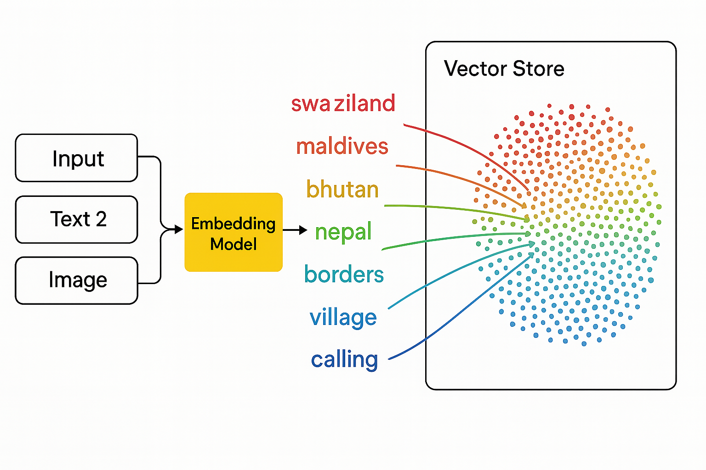
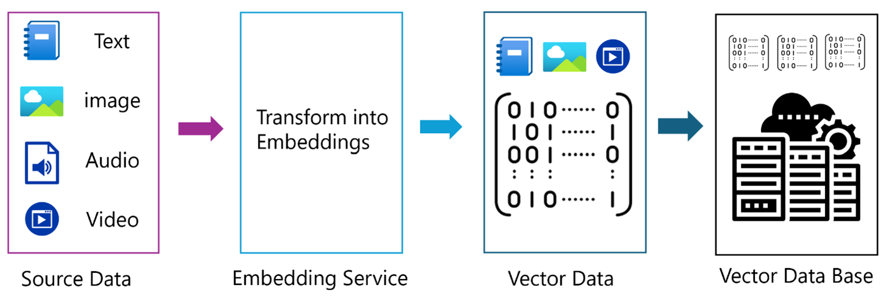

<!--
CO_OP_TRANSLATOR_METADATA:
{
  "original_hash": "75bfb080ca725e8a9aa9c80cae25fba1",
  "translation_date": "2025-07-29T15:01:08+00:00",
  "source_file": "01-IntroToGenAI/README.md",
  "language_code": "mr"
}
-->
# जनरेटिव AI - जावा एडिशनची ओळख

## तुम्ही काय शिकाल

- **जनरेटिव AI मूलतत्त्वे**, ज्यामध्ये LLMs, प्रॉम्प्ट इंजिनिअरिंग, टोकन्स, एम्बेडिंग्स, आणि व्हेक्टर डेटाबेस समाविष्ट आहेत
- **जावा AI विकास साधनांची तुलना**, ज्यामध्ये Azure OpenAI SDK, Spring AI, आणि OpenAI Java SDK समाविष्ट आहेत
- **मॉडेल कॉन्टेक्स्ट प्रोटोकॉल** आणि AI एजंट्सच्या संवादात त्याची भूमिका शोधा

## विषय सूची

- [ओळख](../../../01-IntroToGenAI)
- [जनरेटिव AI संकल्पनांचा जलद आढावा](../../../01-IntroToGenAI)
- [प्रॉम्प्ट इंजिनिअरिंग पुनरावलोकन](../../../01-IntroToGenAI)
- [टोकन्स, एम्बेडिंग्स, आणि एजंट्स](../../../01-IntroToGenAI)
- [जावा साठी AI विकास साधने आणि लायब्ररी](../../../01-IntroToGenAI)
  - [OpenAI Java SDK](../../../01-IntroToGenAI)
  - [Spring AI](../../../01-IntroToGenAI)
  - [Azure OpenAI Java SDK](../../../01-IntroToGenAI)
- [सारांश](../../../01-IntroToGenAI)
- [पुढील पायऱ्या](../../../01-IntroToGenAI)

## ओळख

जनरेटिव AI फॉर बिगिनर्स - जावा एडिशनच्या पहिल्या अध्यायात आपले स्वागत आहे! हा मूलभूत धडा तुम्हाला जनरेटिव AI च्या मुख्य संकल्पनांशी परिचित करून देतो आणि जावा वापरून त्यांच्यासोबत कसे काम करायचे ते शिकवतो. तुम्ही AI अनुप्रयोगांच्या आवश्यक घटकांबद्दल शिकाल, ज्यामध्ये लार्ज लँग्वेज मॉडेल्स (LLMs), टोकन्स, एम्बेडिंग्स, आणि AI एजंट्स समाविष्ट आहेत. तसेच, या कोर्समध्ये तुम्ही वापरणाऱ्या प्राथमिक जावा टूल्सचा अभ्यास करू.

### जनरेटिव AI संकल्पनांचा जलद आढावा

जनरेटिव AI ही कृत्रिम बुद्धिमत्तेची एक प्रकार आहे जी डेटा मधून शिकलेल्या नमुन्यांवर आधारित नवीन सामग्री तयार करते, जसे की मजकूर, प्रतिमा, किंवा कोड. जनरेटिव AI मॉडेल्स मानवीसारखे प्रतिसाद तयार करू शकतात, संदर्भ समजू शकतात, आणि कधी कधी मानवीसारखी वाटणारी सामग्री तयार करू शकतात.

तुम्ही तुमचे जावा AI अनुप्रयोग विकसित करत असताना, तुम्ही **जनरेटिव AI मॉडेल्स** वापरून सामग्री तयार कराल. जनरेटिव AI मॉडेल्सच्या काही क्षमता खालीलप्रमाणे आहेत:

- **मजकूर निर्मिती**: चॅटबॉट्स, सामग्री, आणि मजकूर पूर्ण करण्यासाठी मानवीसारखा मजकूर तयार करणे.
- **प्रतिमा निर्मिती आणि विश्लेषण**: वास्तववादी प्रतिमा तयार करणे, फोटो सुधारित करणे, आणि वस्तू शोधणे.
- **कोड निर्मिती**: कोड स्निपेट्स किंवा स्क्रिप्ट लिहिणे.

वेगवेगळ्या कार्यांसाठी अनुकूलित मॉडेल्सचे विशिष्ट प्रकार असतात. उदाहरणार्थ, **लहान लँग्वेज मॉडेल्स (SLMs)** आणि **लार्ज लँग्वेज मॉडेल्स (LLMs)** मजकूर निर्मिती हाताळू शकतात, जिथे LLMs सामान्यतः जटिल कार्यांसाठी चांगली कामगिरी करतात. प्रतिमेशी संबंधित कार्यांसाठी, तुम्ही विशेष व्हिजन मॉडेल्स किंवा मल्टी-मोडल मॉडेल्स वापराल.

अर्थात, या मॉडेल्सचे प्रतिसाद नेहमी परिपूर्ण नसतात. तुम्ही कदाचित ऐकले असेल की मॉडेल्स "हॅल्युसिनेट" करतात किंवा अधिकाराने चुकीची माहिती तयार करतात. परंतु तुम्ही मॉडेलला स्पष्ट सूचना आणि संदर्भ देऊन चांगले प्रतिसाद तयार करण्यासाठी मार्गदर्शन करू शकता. याला **प्रॉम्प्ट इंजिनिअरिंग** म्हणतात.

#### प्रॉम्प्ट इंजिनिअरिंग पुनरावलोकन

प्रॉम्प्ट इंजिनिअरिंग म्हणजे AI मॉडेल्सला इच्छित आउटपुटकडे मार्गदर्शन करण्यासाठी प्रभावी इनपुट्स डिझाइन करण्याची पद्धत आहे. यात समाविष्ट आहे:

- **स्पष्टता**: सूचना स्पष्ट आणि अचूक बनवणे.
- **संदर्भ**: आवश्यक पार्श्वभूमी माहिती प्रदान करणे.
- **मर्यादा**: कोणत्याही मर्यादा किंवा स्वरूप निर्दिष्ट करणे.

प्रॉम्प्ट इंजिनिअरिंगसाठी काही सर्वोत्तम पद्धतींमध्ये प्रॉम्प्ट डिझाइन, स्पष्ट सूचना, कार्याचे विघटन, वन-शॉट आणि फ्यू-शॉट लर्निंग, आणि प्रॉम्प्ट ट्यूनिंग समाविष्ट आहे. तुमच्या विशिष्ट उपयोग प्रकरणासाठी काय चांगले कार्य करते हे शोधण्यासाठी वेगवेगळ्या प्रॉम्प्ट्सची चाचणी घेणे आवश्यक आहे.

अनुप्रयोग विकसित करताना, तुम्ही वेगवेगळ्या प्रकारच्या प्रॉम्प्ट्ससह काम कराल:
- **सिस्टम प्रॉम्प्ट्स**: मॉडेलच्या वर्तनासाठी मूलभूत नियम आणि संदर्भ सेट करा
- **वापरकर्ता प्रॉम्प्ट्स**: तुमच्या अनुप्रयोग वापरकर्त्यांकडून इनपुट डेटा
- **सहायक प्रॉम्प्ट्स**: सिस्टम आणि वापरकर्ता प्रॉम्प्ट्सवर आधारित मॉडेलचे प्रतिसाद

> **अधिक जाणून घ्या**: जनरेटिव AI फॉर बिगिनर्स कोर्सच्या [प्रॉम्प्ट इंजिनिअरिंग अध्यायात](https://github.com/microsoft/generative-ai-for-beginners/tree/main/04-prompt-engineering-fundamentals) प्रॉम्प्ट इंजिनिअरिंगबद्दल अधिक जाणून घ्या.

#### टोकन्स, एम्बेडिंग्स, आणि एजंट्स

जनरेटिव AI मॉडेल्ससह काम करताना, तुम्हाला **टोकन्स**, **एम्बेडिंग्स**, **एजंट्स**, आणि **मॉडेल कॉन्टेक्स्ट प्रोटोकॉल (MCP)** सारख्या संज्ञा भेटतील. या संकल्पनांचे तपशीलवार विहंगावलोकन येथे आहे:

- **टोकन्स**: टोकन्स म्हणजे मॉडेलमधील मजकूराचा सर्वात छोटा घटक. ते शब्द, अक्षरे, किंवा उपशब्द असू शकतात. टोकन्स मजकूर डेटा अशा स्वरूपात दर्शवण्यासाठी वापरले जातात जे मॉडेल समजू शकते. उदाहरणार्थ, "The quick brown fox jumped over the lazy dog" वाक्य ["The", " quick", " brown", " fox", " jumped", " over", " the", " lazy", " dog"] किंवा ["The", " qu", "ick", " br", "own", " fox", " jump", "ed", " over", " the", " la", "zy", " dog"] असे टोकनाइज केले जाऊ शकते, टोकनाइजेशन रणनीतीवर अवलंबून.

टोकनाइजेशन म्हणजे मजकूराला या छोट्या घटकांमध्ये विभागण्याची प्रक्रिया आहे. हे महत्त्वाचे आहे कारण मॉडेल्स कच्च्या मजकूराऐवजी टोकन्सवर कार्य करतात. प्रॉम्प्टमधील टोकन्सची संख्या मॉडेलच्या प्रतिसादाची लांबी आणि गुणवत्ता प्रभावित करते, कारण मॉडेल्सच्या त्यांच्या संदर्भ विंडोसाठी टोकन मर्यादा असते (उदा., GPT-4o साठी 128K टोकन्स).

  जावामध्ये, तुम्ही OpenAI SDK सारख्या लायब्ररी वापरून टोकनाइजेशन स्वयंचलितपणे हाताळू शकता जेव्हा AI मॉडेल्सला विनंत्या पाठवता.

- **एम्बेडिंग्स**: एम्बेडिंग्स म्हणजे टोकन्सचे व्हेक्टर प्रतिनिधित्व जे अर्थपूर्ण अर्थ पकडतात. ते संख्यात्मक प्रतिनिधित्व (सामान्यतः फ्लोटिंग-पॉइंट नंबरच्या अ‍ॅरे) असतात जे मॉडेल्सना शब्दांमधील संबंध समजून घेण्यास आणि संदर्भानुसार संबंधित प्रतिसाद तयार करण्यास सक्षम करतात. समान शब्दांमध्ये समान एम्बेडिंग्स असतात, ज्यामुळे मॉडेलला समानार्थी शब्द आणि अर्थपूर्ण संबंध समजण्यास मदत होते.

  जावामध्ये, तुम्ही OpenAI SDK किंवा एम्बेडिंग जनरेशनला समर्थन देणाऱ्या इतर लायब्ररी वापरून एम्बेडिंग्स तयार करू शकता. हे एम्बेडिंग्स सिमॅंटिक शोधासाठी आवश्यक आहेत, जिथे तुम्हाला अचूक मजकूर जुळण्याऐवजी अर्थावर आधारित समान सामग्री शोधायची असते.

- **व्हेक्टर डेटाबेस**: व्हेक्टर डेटाबेस म्हणजे एम्बेडिंग्ससाठी अनुकूलित विशेष स्टोरेज सिस्टम्स. ते कार्यक्षम समानता शोध सक्षम करतात आणि मोठ्या डेटासेट्समधून सिमॅंटिक समानतेवर आधारित संबंधित माहिती शोधण्यासाठी Retrieval-Augmented Generation (RAG) पॅटर्नसाठी महत्त्वाचे आहेत.

> **टीप**: या कोर्समध्ये, आम्ही व्हेक्टर डेटाबेस कव्हर करणार नाही, परंतु ते उल्लेखनीय आहेत कारण ते वास्तविक-जगातील अनुप्रयोगांमध्ये सामान्यतः वापरले जातात.

- **एजंट्स आणि MCP**: मॉडेल्स, टूल्स, आणि बाह्य सिस्टम्ससह स्वायत्तपणे संवाद साधणारे AI घटक. मॉडेल कॉन्टेक्स्ट प्रोटोकॉल (MCP) एजंट्सना बाह्य डेटा स्रोत आणि टूल्स सुरक्षितपणे प्रवेश करण्यासाठी मानकीकृत मार्ग प्रदान करते. आमच्या [MCP फॉर बिगिनर्स](https://github.com/microsoft/mcp-for-beginners) कोर्समध्ये अधिक जाणून घ्या.

जावा AI अनुप्रयोगांमध्ये, तुम्ही मजकूर प्रक्रिया करण्यासाठी टोकन्स, सिमॅंटिक शोध आणि RAG साठी एम्बेडिंग्स, डेटा पुनर्प्राप्तीसाठी व्हेक्टर डेटाबेस, आणि बुद्धिमान, टूल-उपयोगी सिस्टम्स तयार करण्यासाठी MCP सह एजंट्स वापराल.

### जावा साठी AI विकास साधने आणि लायब्ररी

जावा AI विकासासाठी उत्कृष्ट टूलिंग ऑफर करते. या कोर्समध्ये आम्ही तीन मुख्य लायब्ररींचा अभ्यास करू - OpenAI Java SDK, Azure OpenAI SDK, आणि Spring AI.

येथे प्रत्येक अध्यायाच्या उदाहरणांमध्ये कोणता SDK वापरला जातो याचे जलद संदर्भ टेबल आहे:

| अध्याय | नमुना | SDK |
|---------|--------|-----|
| 02-SetupDevEnvironment | github-models | OpenAI Java SDK |
| 02-SetupDevEnvironment | basic-chat-azure | Spring AI Azure OpenAI |
| 03-CoreGenerativeAITechniques | examples | Azure OpenAI SDK |
| 04-PracticalSamples | petstory | OpenAI Java SDK |
| 04-PracticalSamples | foundrylocal | OpenAI Java SDK |
| 04-PracticalSamples | calculator | Spring AI MCP SDK + LangChain4j |

**SDK दस्तऐवज दुवे:**
- [Azure OpenAI Java SDK](https://github.com/Azure/azure-sdk-for-java/tree/azure-ai-openai_1.0.0-beta.16/sdk/openai/azure-ai-openai)
- [Spring AI](https://docs.spring.io/spring-ai/reference/)
- [OpenAI Java SDK](https://github.com/openai/openai-java)
- [LangChain4j](https://docs.langchain4j.dev/)

#### OpenAI Java SDK

OpenAI SDK ही OpenAI API साठी अधिकृत जावा लायब्ररी आहे. OpenAI च्या मॉडेल्ससह संवाद साधण्यासाठी एक साधी आणि सुसंगत इंटरफेस प्रदान करते, ज्यामुळे जावा अनुप्रयोगांमध्ये AI क्षमता समाकलित करणे सोपे होते. अध्याय 2 मधील GitHub Models उदाहरण, अध्याय 4 मधील Pet Story अनुप्रयोग आणि Foundry Local उदाहरण OpenAI SDK दृष्टिकोन प्रदर्शित करतात.

#### Spring AI

Spring AI ही एक व्यापक फ्रेमवर्क आहे जी Spring अनुप्रयोगांमध्ये AI क्षमता आणते, वेगवेगळ्या AI प्रदात्यांमध्ये सुसंगत अब्स्ट्रॅक्शन लेयर प्रदान करते. हे Spring इकोसिस्टमसह सहजपणे समाकलित होते, ज्यामुळे AI क्षमता आवश्यक असलेल्या एंटरप्राइझ जावा अनुप्रयोगांसाठी हे आदर्श पर्याय बनते.

Spring AI ची ताकद त्याच्या Spring इकोसिस्टमसह सहज समाकलनात आहे, ज्यामुळे Dependency Injection, Configuration Management, आणि Testing Frameworks सारख्या परिचित Spring पॅटर्नसह उत्पादन-तयार AI अनुप्रयोग तयार करणे सोपे होते. तुम्ही अध्याय 2 आणि 4 मध्ये OpenAI आणि Model Context Protocol (MCP) Spring AI लायब्ररीचा लाभ घेणारे अनुप्रयोग तयार करण्यासाठी Spring AI वापराल.

##### Model Context Protocol (MCP)

[Model Context Protocol (MCP)](https://modelcontextprotocol.io/) ही एक उदयोन्मुख मानक आहे जी AI अनुप्रयोगांना बाह्य डेटा स्रोत आणि टूल्ससह सुरक्षितपणे संवाद साधण्यास सक्षम करते. MCP AI मॉडेल्सना संदर्भात्मक माहिती प्रवेश करण्यासाठी आणि तुमच्या अनुप्रयोगांमध्ये क्रिया अंमलात आणण्यासाठी मानकीकृत मार्ग प्रदान करते.

अध्याय 4 मध्ये, तुम्ही Spring AI सह Model Context Protocol च्या मूलभूत गोष्टी प्रदर्शित करणारी एक साधी MCP कॅल्क्युलेटर सेवा तयार कराल, ज्यामध्ये मूलभूत टूल इंटिग्रेशन आणि सेवा आर्किटेक्चर कसे तयार करायचे ते दाखवले आहे.

#### Azure OpenAI Java SDK

Azure OpenAI क्लायंट लायब्ररी जावा साठी OpenAI च्या REST APIs चे एक रूपांतर आहे जे एक सुसंगत इंटरफेस आणि Azure SDK इकोसिस्टमसह समाकलन प्रदान करते. अध्याय 3 मध्ये, तुम्ही Azure OpenAI SDK वापरून अनुप्रयोग तयार कराल, ज्यामध्ये चॅट अनुप्रयोग, फंक्शन कॉलिंग, आणि RAG (Retrieval-Augmented Generation) पॅटर्न समाविष्ट आहेत.

> टीप: Azure OpenAI SDK OpenAI Java SDK च्या तुलनेत वैशिष्ट्यांमध्ये मागे आहे, त्यामुळे भविष्यातील प्रकल्पांसाठी OpenAI Java SDK वापरण्याचा विचार करा.

## सारांश

मूलभूत गोष्टी येथे संपल्या! तुम्हाला आता समजले आहे:

- जनरेटिव AI च्या मुख्य संकल्पना - LLMs आणि प्रॉम्प्ट इंजिनिअरिंगपासून टोकन्स, एम्बेडिंग्स, आणि व्हेक्टर डेटाबेसपर्यंत
- जावा AI विकासासाठी तुमचे टूलकिट पर्याय: Azure OpenAI SDK, Spring AI, आणि OpenAI Java SDK
- Model Context Protocol म्हणजे काय आणि AI एजंट्सना बाह्य टूल्ससह काम करण्यास सक्षम कसे करते

## पुढील पायऱ्या

[अध्याय 2: विकास वातावरण सेट करणे](../02-SetupDevEnvironment/README.md)

**अस्वीकरण**:  
हा दस्तऐवज AI भाषांतर सेवा [Co-op Translator](https://github.com/Azure/co-op-translator) वापरून भाषांतरित करण्यात आला आहे. आम्ही अचूकतेसाठी प्रयत्नशील असलो तरी कृपया लक्षात ठेवा की स्वयंचलित भाषांतरांमध्ये त्रुटी किंवा अचूकतेचा अभाव असू शकतो. मूळ भाषेतील दस्तऐवज हा अधिकृत स्रोत मानला जावा. महत्त्वाच्या माहितीसाठी व्यावसायिक मानवी भाषांतराची शिफारस केली जाते. या भाषांतराचा वापर करून उद्भवलेल्या कोणत्याही गैरसमज किंवा चुकीच्या अर्थासाठी आम्ही जबाबदार राहणार नाही.