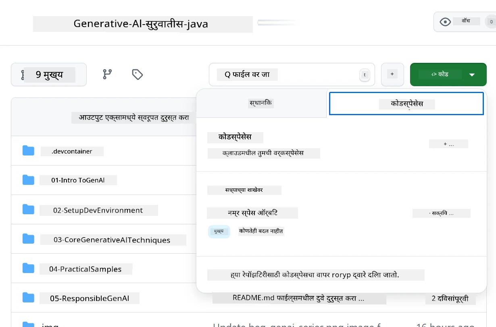
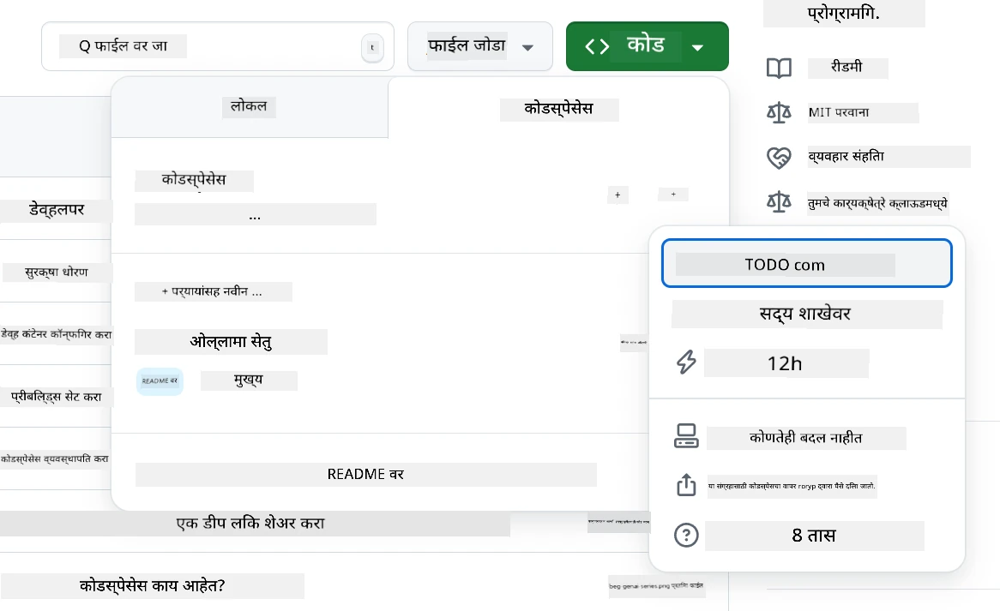
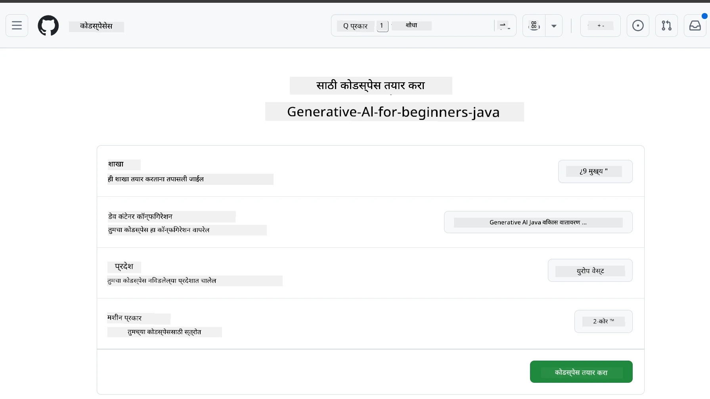
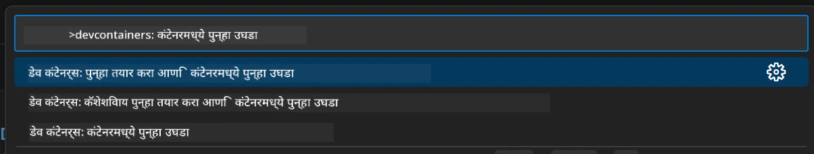
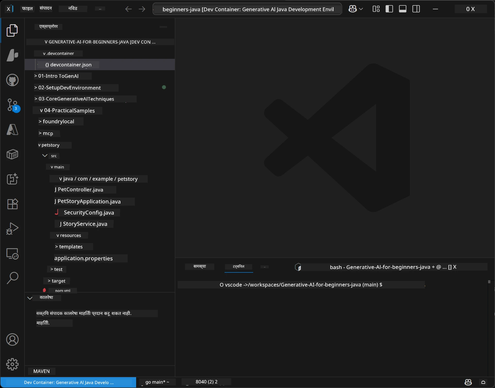
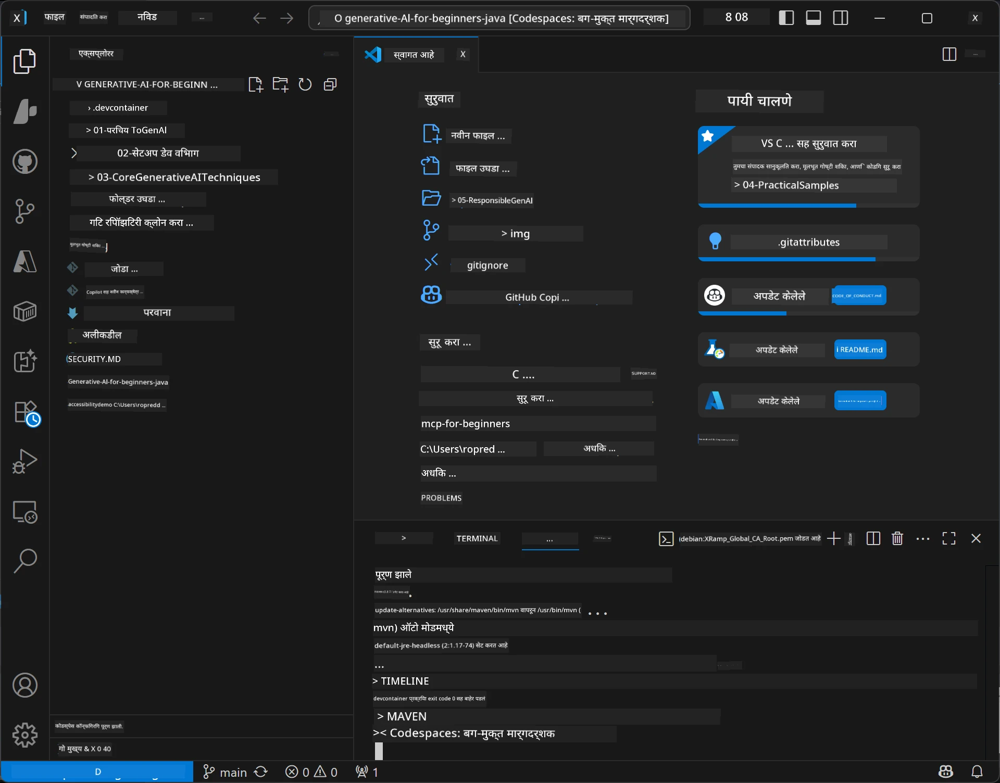

# Java साठी Generative AI साठी विकास पर्यावरण सेट करणे

> **त्वरित प्रारंभ:** **Azure AI Foundry** वर आपल्या AI मॉडेल्सना Bicep + `azd` सह काही मिनिटांत कोड म्हणून प्राव्हिजन करा — [Azure AI Foundry सेटअप मार्गदर्शक](getting-started-azure-openai.md) पहा. प्रमाणीकरण **कीलेस** आहे (Microsoft Entra ID), त्यामुळे API कीज व्यवस्थापित करण्याची गरज नाही.

## आपण काय शिकाल

- AI अनुप्रयोगांसाठी Java विकास पर्यावरण सेट करणे
- आपल्या पसंतीच्या विकास पर्यावरणाची निवड आणि संरचना (Codespaces सह क्लाउड-फर्स्ट, स्थानिक डेव्ह कंटेनर, किंवा संपूर्ण स्थानिक सेटअप)
- Azure AI Foundry मॉडेलशी कनेक्ट करून आपल्या सेटअपची चाचणी करणे

## अनुक्रमणिका

- [आपण काय शिकाल](#आपण-काय-शिकाल)
- [परिचय](#परिचय)
- [पायरी 1: आपले विकास पर्यावरण सेट करा](#पायरी-1-आपले-विकास-पर्यावरण-सेट-करा)
  - [पर्याय A: GitHub Codespaces (शिफारस केलेले)](#पर्याय-a-github-codespaces-शिफारस-केलेले)
  - [पर्याय B: स्थानिक डेव्ह कंटेनर](#पर्याय-b-स्थानिक-डेव्ह-कंटेनर)
  - [पर्याय C: आपले विद्यमान स्थानिक इन्स्टॉलेशन वापरा](#पर्याय-c-आपले-विद्यमान-स्थानिक-इन्स्टॉलेशन-वापरा)
- [पायरी 2: Azure AI Foundry प्राव्हिजन करा](#पायरी-2-azure-ai-foundry-प्राव्हिजन-करा)
- [पायरी 3: आपला सेटअप चाचणी करा](#पायरी-3-आपला-सेटअप-चाचणी-करा)
- [समस्या निवारण](#समस्या-निवारण)
- [सारांश](#सारांश)
- [पुढील टप्पे](#पुढील-टप्पे)

## परिचय

हा विभाग आपल्याला विकास पर्यावरण सेट करण्यात मार्गदर्शित करेल. या कोर्समध्ये आपण **Azure AI Foundry** मॉडेल्स वापरू. आपण Bicep आणि Azure Developer CLI (`azd`) सह कोड म्हणून मॉडेल्स प्राव्हिजन करता, आणि नंतर **कीलेस प्रमाणीकरण** (Microsoft Entra ID) वापरून कनेक्ट करता — कोणतीही API की कॉपी अथवा लीक करण्याची गरज नाही.

**कोणतेही स्थानिक सेटअप आवश्यक नाही!** आपण GitHub Codespaces वापरू शकता, जे आपल्या ब्राउझरमध्ये संपूर्ण विकास पर्यावरण प्रदान करते, आणि तिथूनच Foundry प्राव्हिजन करू शकता.

आम्ही या कोर्ससाठी **Azure AI Foundry** वापरतो कारण ते:
- **कोड म्हणून प्राव्हिजन केलेले** — एक `azd up` खाते आणि मॉडेल डिप्लॉयमेंट्स तैनात करतो
- **कीलेस** — आपल्या Azure साइन-इन किंवा व्यवस्थापित ओळखीने प्रमाणीकरण
- **उत्पादनासाठी तयार** — तोच कोड स्थानिक आणि Azure मध्ये चालतो
- **लवचिक** — तैनातीचे नाव बदलून मॉडेल्स बदलू शकता, आपला कोड नाही

> **टीप**: Azure AI Foundry डिप्लॉयमेंट्स प्रति टोकन बिल केल्या जातात (जसे वापर तसे भरा). प्राव्हिजनिंग, प्रदेश आणि किंमत तपशीलांसाठी [Azure AI Foundry सेटअप मार्गदर्शक](getting-started-azure-openai.md) पहा.


## पायरी 1: आपले विकास पर्यावरण सेट करा

<a name="quick-start-cloud"></a>

आम्ही पूर्व-संरचित विकास कंटेनर तयार केला आहे ज्यामुळे सेटअप वेळ कमी होतो आणि आपल्याकडे हा Generative AI for Java कोर्ससाठी सर्व आवश्यक साधने उपलब्ध आहेत. आपला पसंतीचा विकास दृष्टिकोन निवडा:

### पर्यावरण सेट करण्याच्या विकल्प:

#### पर्याय A: GitHub Codespaces (शिफारस केलेले)

**2 मिनिटांत कोडिंग सुरू करा - कोणतेही स्थानिक सेटअप आवश्यक नाही!**

1. या संग्रहाला आपल्या GitHub खात्यावर Fork करा
   > **टीप**: जर आपण मूलभूत कॉन्फिग संपादित करू इच्छित असाल तर कृपया [Dev Container Configuration](../../../.devcontainer/devcontainer.json) पहा
2. क्लिक करा **Code** → **Codespaces** टॅब → **...** → **New with options...**
3. डीफॉल्ट्स वापरा – यामुळे **Dev container configuration** निवडले जाईल: ह्या कोर्ससाठी तयार केलेले **Generative AI Java Development Environment** कस्टम देव्ह कंटेनर
4. क्लिक करा **Create codespace**
5. पर्यावरण तयार होईपर्यंत ~2 मिनिटे प्रतीक्षा करा
6. पुढे जा [पायरी 2: Azure AI Foundry प्राव्हिजन करा](#पायरी-2-azure-ai-foundry-प्राव्हिजन-करा)








> **Codespaces चे फायदे**:
> - कोणतेही स्थानिक इन्स्टॉलेशन आवश्यक नाही
> - कोणत्याही ब्राउझरसह कोणत्याही डिव्हाइसवर चालते
> - सर्व साधने आणि अवलंबनांसह पूर्व-संरचित
> - वैयक्तिक खात्यांसाठी प्रति महिन्याला मोफत 60 तास
> - सर्व शिकणाऱ्यांसाठी सुसंगत पर्यावरण

#### पर्याय B: स्थानिक डेव्ह कंटेनर

**त्यासाठी जे स्थानिक डेव्हलपमेंट Docker सह पसंत करतात**

1. या संग्रहाला स्थानिक मशीनवर Fork आणि Clone करा
   > **टीप**: जर आपण मूलभूत कॉन्फिग संपादित करू इच्छित असाल तर कृपया [Dev Container Configuration](../../../.devcontainer/devcontainer.json) पहा
2. [Docker Desktop](https://www.docker.com/products/docker-desktop/) आणि [VS Code](https://code.visualstudio.com/) इन्स्टॉल करा
3. VS Code मध्ये [Dev Containers विस्तार](https://marketplace.visualstudio.com/items?itemName=ms-vscode-remote.remote-containers) इन्स्टॉल करा
4. VS Code मध्ये संग्रह फोल्डर उघडा
5. परवानगी दिली गेल्यास, क्लिक करा **Reopen in Container** (किंवा `Ctrl+Shift+P` → "Dev Containers: Reopen in Container" वापरा)
6. कंटेनर तयार होईपर्यंत आणि सुरू होईपर्यंत प्रतीक्षा करा
7. पुढे जा [पायरी 2: Azure AI Foundry प्राव्हिजन करा](#पायरी-2-azure-ai-foundry-प्राव्हिजन-करा)





#### पर्याय C: आपले विद्यमान स्थानिक इन्स्टॉलेशन वापरा

**ज्यांच्याकडे विद्यमान Java पर्यावरण आहे अशा विकसकांसाठी**

पूर्वअटी:
- [Java 21+](https://www.oracle.com/java/technologies/javase/jdk21-archive-downloads.html) 
- [Maven 3.9+](https://maven.apache.org/download.cgi)
- [VS Code](https://code.visualstudio.com) किंवा आपला पसंतीचा IDE

चरण:
1. हा संग्रह आपल्या स्थानिक मशीनवर Clone करा
2. प्रोजेक्ट आपल्यास हवे ते IDE मध्ये उघडा
3. पुढे जा [पायरी 2: Azure AI Foundry प्राव्हिजन करा](#पायरी-2-azure-ai-foundry-प्राव्हिजन-करा)

> **प्रो टिप**: आपल्याकडे कमी स्पेकचा संगणक असल्यास पण स्थानिक VS Code वापरायचा असल्यास, GitHub Codespaces वापरा! आपण आपल्या स्थानिक VS Code ला क्लाउड-होस्टेड Codespace शी जोडू शकता आणि दोन्हीचा सर्वोत्तम उपयोग करू शकता.




## पायरी 2: Azure AI Foundry प्राव्हिजन करा

या कोर्सच्या AI मॉडेल्सना Azure AI Foundry वर कोड म्हणून प्राव्हिजन करा. संग्रहाच्या मूळ स्थानावरून:

```bash
cd 02-SetupDevEnvironment
azd auth login
az login
azd up
```

`azd` पर्यावरणाचे नाव, सदस्यता आणि प्रदेश विचारतो, Azure AI Foundry खाते `gpt-5.6-luna` आणि `text-embedding-3-small` डिप्लॉयमेंट्ससह प्राव्हिजन करतो, आणि उदाहरणाच्या `.env` मध्ये एंडपॉइंट लिहितो - सगळे कीलेस प्रमाणीकरण (कोणत्याही API कीशिवाय).

> **पूर्ण मार्गदर्शक:** पूर्वधारणा, मॅन्युअल (पोर्टल) पर्याय, प्रदेश मार्गदर्शन, आणि किंमत/क्लिनअप टिपांसाठी [Azure AI Foundry सेटअप मार्गदर्शक](getting-started-azure-openai.md) पहा.

## पायरी 3: आपला सेटअप चाचणी करा

एकदा आपले Foundry मॉडेल्स प्राव्हिजन झाल्यावर, [`02-SetupDevEnvironment/examples/basic-chat-azure`](../../../02-SetupDevEnvironment/examples/basic-chat-azure) मधील उदाहरण अनुप्रयोगाशी कनेक्शन तपासा.

1. आपल्या विकास पर्यावरणात टर्मिनल उघडा.
2. उदाहरणाच्या फोल्डरमध्ये जा:
   ```bash
   cd 02-SetupDevEnvironment/examples/basic-chat-azure
   ```
3. आपले साइन-इन झाले आहे याची खात्री करा (कीलेस ऑथसाठी टोकन आवश्यक):
   ```bash
   az login
   ```
   > जर आपण `azd up` चालवलं असेल, तर `.env` फाईल आपोआप लिहिलेली असते ज्यात आपला एंडपॉइंट आहे.
4. अनुप्रयोग चालवा:
   ```bash
   mvn clean spring-boot:run
   ```

आपल्याला `gpt-5.6-luna` मॉडेलकडून प्रतिसाद दिसला पाहिजे.

### उदाहरण कोड समजून घेणे

[basic-chat उदाहरण](./examples/basic-chat-azure/README.md) **Spring Boot 4.1.1** आणि **Spring AI 2.0.1** वापरते. Spring AI चा `ChatClient` अधिकृत OpenAI Java SDK द्वारा समर्थित आहे, Azure OpenAI **v1** एंडपॉइंटशी कीलेस प्रमाणीकरण सहित कनेक्ट होतो.

**हा कोड काय करतो:**
- आपल्या Azure साइन-इन (Microsoft Entra ID) वापरून Azure AI Foundry शी **कनेक्ट** होतो — कोणतीही API की नाही
- `gpt-5.6-luna` मॉडेलला एक प्रॉम्प्ट **पाठवतो**
- AI चा प्रतिसाद **प्राप्त** करून दाखवतो
- आपला सेटअप योग्यरित्या चालत आहे का ते **चाचणी करतो**

**मुख्य अवलंबनं** ([pom.xml](../../../02-SetupDevEnvironment/examples/basic-chat-azure/pom.xml) मधून निवडक भाग):
```xml
<dependency>
    <groupId>org.springframework.ai</groupId>
    <artifactId>spring-ai-starter-model-openai</artifactId>
</dependency>
<dependency>
    <groupId>com.openai</groupId>
    <artifactId>openai-java</artifactId>
</dependency>
<dependency>
    <groupId>com.azure</groupId>
    <artifactId>azure-identity</artifactId>
    <version>${azure-identity.version}</version>
</dependency>
```

POM OpenAI Java **4.63.1** व्यवस्थापित करते आणि Azure Identity **1.18.6** स्पष्टपणे सेट करते. Spring AI 2 ने Azure-विशिष्ट स्टार्टर काढून टाकला; Azure Identity अजूनही क्रेडेन्शियल बीनसाठी आवश्यक आहे.

**संरचना** ([application.yml](../../../02-SetupDevEnvironment/examples/basic-chat-azure/src/main/resources/application.yml)):
```yaml
spring:
  ai:
    openai:
      base-url: ${AZURE_OPENAI_ENDPOINT}
      microsoft-foundry: true
      chat:
        model: ${AZURE_OPENAI_DEPLOYMENT:gpt-5.6-luna}
        reasoning-effort: none
        max-completion-tokens: 500
```

कीलेस प्रमाणीकरण [BasicChatApplication.java](../../../02-SetupDevEnvironment/examples/basic-chat-azure/src/main/java/com/example/BasicChatApplication.java) मध्ये स्पष्टपणे सेट केले आहे, अनुपस्थित API की मधून नाही. त्याचा बेअर क्रेडेन्शियल `DefaultAzureCredential` वापरतो `https://ai.azure.com/.default` स्कोपसह, आणि `OpenAIClient` `/openai/v1` लक्ष्य करतो. अ‍ॅप हा क्लायंट Spring AI च्या चॅट मॉडेलला पुरवतो, त्यामुळे ग्लोबल `OPENAI_API_KEY` Azure प्रमाणीकरणावर ओव्हरराईड करू शकत नाही.

चॅट सेटिंग्ज थेट `spring.ai.openai.chat` अंतर्गत आहेत, कोणताही `options` ब्लॉक नाही. धडा Chat Completions `reasoning-effort: none` आणि 500-टोकन कंप्लिशन कॅप ठेवतो; `temperature` किंवा `max-tokens` सेट करत नाही. API निवड आणि टूल-कॉलिंग मार्गदर्शनासाठी [उदाहरणाचे कॉन्फिग संदर्भ](./examples/basic-chat-azure/README.md#spring-configuration) पहा.

## सारांश

वरील टप्पे पूर्ण केल्यावर, आपल्याकडे असेल:

- Bicep + `azd` सह Azure AI Foundry मॉडेल्स कोड म्हणून प्राव्हिजन केलेली
- आपले Java विकास पर्यावरण चालू (स्वतःचे Codespaces, dev कंटेनर किंवा स्थानिक काहीही असो)
- Azure AI Foundry शी कीलेस प्रमाणीकरणाने (Microsoft Entra ID) कनेक्ट केलेले — कोणतीही API की नाही
- सर्व काही योग्यरित्या कार्य करत आहे हे आपल्या मॉडेलशी बोलणाऱ्या सोप्या उदाहरणाने तपासलेले

## पुढील टप्पे

[अध्याय 3: मुख्य Generative AI तंत्रे](../03-CoreGenerativeAITechniques/README.md)

## समस्या निवारण

समस्या आल्या आहेत? इथे काही सामान्य समस्या व त्यांचे उपाय आहेत:

- **प्रमाणीकरण अयशस्वी आहे का (401/403)?** 
  - `az login` चालवा — प्रमाणीकरण कीलेस असल्याने आपल्याला साइन इन असणे आवश्यक आहे
  - खात्यावर संसाधनाचा **Cognitive Services OpenAI User** भूमिका आहे का तपासा
  - जर आपण सध्या प्राव्हिजन केले असाल तर भूमिका असाइनमेंट पोहोचण्यास एक मिनिट थांबा

- **Maven सापडत नाही का?** 
  - जर dev कंटेनर/Codespaces वापरत असाल तर Maven आधीच इन्स्टॉल असावी
  - स्थानिक सेटअपसाठी, Java 21+ आणि Maven 3.9+ इन्स्टॉल असल्याची खात्री करा
  - इन्स्टॉलेशन तपासण्यासाठी `mvn --version` वापरा

- **`azd` सापडत नाही किंवा प्राव्हिजनिंग अयशस्वी आहे का?** 
  - [Azure Developer CLI](https://aka.ms/azure-dev/install) इन्स्टॉल करा आणि `azd auth login` चालवा
  - ज्याठिकाणी `gpt-5.6-luna` आणि `text-embedding-3-small` उपलब्ध आहेत अशा प्रदेशाची निवड करा (उदा. `eastus2`), निवडलेल्या सदस्यत्वात पुरेशी कोटा आहे याची खात्री करा
  - तपशीलांसाठी [Azure AI Foundry सेटअप मार्गदर्शक](getting-started-azure-openai.md) पहा

- **Dev कंटेनर सुरू होत नाही का?** 
  - Docker Desktop चालू आहे याची खात्री करा (स्थानिक विकासासाठी)
  - कंटेनर पुनर्बांधणीचा प्रयत्न करा: `Ctrl+Shift+P` → "Dev Containers: Rebuild Container"

- **अॅप्लिकेशन संकलन त्रुटी?**
  - आपण योग्य डिरेक्टरीमध्ये आहात का ते तपासा: `02-SetupDevEnvironment/examples/basic-chat-azure`
  - साफसफाई व पुनर्संकलन करा: `mvn clean compile`

> **मदतीची गरज आहे का?**: अजूनही समस्या असल्यास? या संग्रहात एक समस्या उघडा आणि आम्ही मदत करू.

---

<!-- CO-OP TRANSLATOR DISCLAIMER START -->
**अस्वीकरण**:
हा दस्तऐवज AI भाषांतर सेवा [Co-op Translator](https://github.com/Azure/co-op-translator) चा वापर करून अनुवादित केला आहे. जरी आम्ही अचूकतेसाठी प्रयत्न करतो, तरी कृपया लक्षात घ्या की स्वयंचलित भाषांतरांमध्ये त्रुटी किंवा अचूकतेची कमतरता असू शकते. मूळ दस्तऐवज त्याच्या मूळ भाषेत अधिकृत स्रोत मानला पाहिजे. महत्त्वाची माहिती असल्यास, व्यावसायिक मानवी भाषांतराची शिफारस केली जाते. या भाषांतराच्या वापरामुळे उद्भवणाऱ्या कोणत्याही गैरसमज किंवा चुकीच्या अर्थलावणीसाठी आम्ही जबाबदार नाही.
<!-- CO-OP TRANSLATOR DISCLAIMER END -->