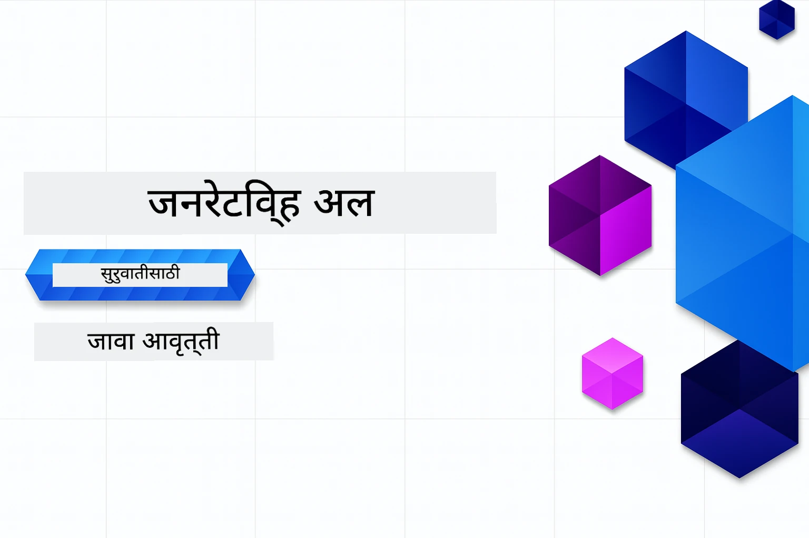

# सुरुवातीसाठी जनरेटिव्ह AI - जावा संस्करण
[](https://discord.gg/nTYy5BXMWG)



**वेळेची व्याप्ती**: संपूर्ण कार्यशाळा स्थानिक सेटअपशिवाय ऑनलाइन पूर्ण केली जाऊ शकते. पर्यावरण सेटअपसाठी २ मिनिटे लागतात, नमुन्यांचा अभ्यास करण्यासाठी १-३ तास लागतात, अभ्यासाच्या सखोलतेनुसार.

> **जलद प्रारंभ** 

1. हा रेपॉझिटरी तुमच्या GitHub खात्यावर Fork करा
2. **Code** → **Codespaces** टॅब → **...** → **New with options...** वर क्लिक करा
3. डीफॉल्ट वापरा – यामुळे या कोर्ससाठी तयार केलेले Development कंटेनर निवडले जाईल
4. **Create codespace** वर क्लिक करा
5. पर्यावरण तयार होण्यासाठी सुमारे २ मिनिटे थांबा
6. थेट [Chapter 2: Provision Azure AI Foundry](./02-SetupDevEnvironment/README.md#step-2-provision-azure-ai-foundry) येथे जा

## मल्टि-भाषा समर्थन

### GitHub Action द्वारे समर्थित (स्वयंचलित आणि नेहमीच अपडेटेड)

<!-- CO-OP TRANSLATOR LANGUAGES TABLE START -->
[Arabic](../ar/README.md) | [Bengali](../bn/README.md) | [Bulgarian](../bg/README.md) | [Burmese (Myanmar)](../my/README.md) | [Chinese (Simplified)](../zh-CN/README.md) | [Chinese (Traditional, Hong Kong)](../zh-HK/README.md) | [Chinese (Traditional, Macau)](../zh-MO/README.md) | [Chinese (Traditional, Taiwan)](../zh-TW/README.md) | [Croatian](../hr/README.md) | [Czech](../cs/README.md) | [Danish](../da/README.md) | [Dutch](../nl/README.md) | [Estonian](../et/README.md) | [Finnish](../fi/README.md) | [French](../fr/README.md) | [German](../de/README.md) | [Greek](../el/README.md) | [Hebrew](../he/README.md) | [Hindi](../hi/README.md) | [Hungarian](../hu/README.md) | [Indonesian](../id/README.md) | [Italian](../it/README.md) | [Japanese](../ja/README.md) | [Kannada](../kn/README.md) | [Khmer](../km/README.md) | [Korean](../ko/README.md) | [Lithuanian](../lt/README.md) | [Malay](../ms/README.md) | [Malayalam](../ml/README.md) | [Marathi](./README.md) | [Nepali](../ne/README.md) | [Nigerian Pidgin](../pcm/README.md) | [Norwegian](../no/README.md) | [Persian (Farsi)](../fa/README.md) | [Polish](../pl/README.md) | [Portuguese (Brazil)](../pt-BR/README.md) | [Portuguese (Portugal)](../pt-PT/README.md) | [Punjabi (Gurmukhi)](../pa/README.md) | [Romanian](../ro/README.md) | [Russian](../ru/README.md) | [Serbian (Cyrillic)](../sr/README.md) | [Slovak](../sk/README.md) | [Slovenian](../sl/README.md) | [Spanish](../es/README.md) | [Swahili](../sw/README.md) | [Swedish](../sv/README.md) | [Tagalog (Filipino)](../tl/README.md) | [Tamil](../ta/README.md) | [Telugu](../te/README.md) | [Thai](../th/README.md) | [Turkish](../tr/README.md) | [Ukrainian](../uk/README.md) | [Urdu](../ur/README.md) | [Vietnamese](../vi/README.md)

> **स्थानिकरित्या क्लोन करायचे आहे का?**
>
> या रेपॉझिटरीमध्ये ५०+ भाषांमध्ये अनुवाद समाविष्ट आहेत ज्यामुळे डाउनलोड आकार खूप वाढतो. अनुवादाशिवाय क्लोन करण्यासाठी sparse checkout वापरा:
>
> **Bash / macOS / Linux:**
> ```bash
> git clone --filter=blob:none --sparse https://github.com/microsoft/Generative-AI-for-beginners-java.git
> cd Generative-AI-for-beginners-java
> git sparse-checkout set --no-cone '/*' '!translations' '!translated_images'
> ```
>
> **CMD (Windows):**
> ```cmd
> git clone --filter=blob:none --sparse https://github.com/microsoft/Generative-AI-for-beginners-java.git
> cd Generative-AI-for-beginners-java
> git sparse-checkout set --no-cone "/*" "!translations" "!translated_images"
> ```
>
> यामुळे तुम्हाला कोर्स पूर्ण करण्यासाठी आवश्यक सर्व काही खूपच वेगाने डाउनलोड होईल.
<!-- CO-OP TRANSLATOR LANGUAGES TABLE END -->

## कोर्स संरचना आणि शिक्षण मार्ग

### **अध्याय १: जनरेटिव्ह AI परिचय**
- **मुख्य संकल्पना**: मोठे भाषा मॉडेल्स, टोकन्स, एम्बेडिंग्ज, आणि AI क्षमता समजून घेणे
- **जावा AI परिसंस्था**: Spring AI आणि OpenAI SDK चा आढावा
- **मॉडेल संदर्भ प्रोटोकॉल (MCP)**: MCP आणि AI एजंट संवादात त्याची भूमिका परिचय
- **व्यावहारिक अनुप्रयोग**: चॅटबॉट्स आणि सामग्री निर्मितीसह वास्तविक जगातील उदाहरणे
- **[→ अध्याय १ सुरू करा](./01-IntroToGenAI/README.md)**

### **अध्याय २: विकास पर्यावरण सेट अप**
- **Azure AI Foundry**: Bicep आणि Azure Developer CLI (azd) वापरून GPT-5.6 Luna चॅट आणि text-embedding-3-small एम्बेडिंग्ज प्रावधान करा
- **Spring Boot 4.1.1 + Spring AI 2.0.1**: `ChatClient` सह शिकणे, अधिकृत OpenAI जावा SDK आणि Azure OpenAI v1 द्वारे समर्थित
- **कीलेस प्रमाणीकरण**: Microsoft Entra ID सह सुरक्षितपणे कनेक्ट करा — API कीज व्यवस्थापित करण्याची गरज नाही
- **विकास साधने**: Docker कंटेनर्स, VS Code, आणि GitHub Codespaces कॉन्फिगरेशन
- **[→ अध्याय २ सुरू करा](./02-SetupDevEnvironment/README.md)**

### **अध्याय ३: मुख्य जनरेटिव्ह AI तंत्रे**
- **अधिकृत OpenAI Java SDK**: कीलेस प्रमाणीकरणासह Azure OpenAI v1 ला थेट कॉल करा
- **प्रॉम्प्ट इंजिनिअरिंग**: AI मॉडेल प्रतिसादांसाठी उत्तम तंत्र
- **एम्बेडिंग्ज आणि व्हेक्टर ऑपरेशन्स**: सेमंटिक सर्च आणि साम्य जुळणी लागू करा
- **रिट्रीव्हल-ऑगमेंटेड जनरेशन (RAG)**: तुमच्या स्वतःच्या डेटासोर्ससह AI संयोजन करा
- **फंक्शन कॉलिंग**: कस्टम टूल्स आणि प्लगइन्ससह AI क्षमता वाढवा
- **[→ अध्याय ३ सुरू करा](./03-CoreGenerativeAITechniques/README.md)**

### **अध्याय ४: व्यावहारिक अनुप्रयोग आणि प्रकल्प**
- **पेट स्टोरी जनरेटर** (`petstory/`): Azure AI Foundry सह सर्जनशील सामग्री निर्मिती
- **Foundry Local Demo** (`foundrylocal/`): OpenAI Java SDK सह स्थानिक AI मॉडेल एकत्रीकरण
- **MCP कॅल्क्युलेटर सेवा** (`calculator/`): Spring AI सह मूलभूत Model Context Protocol अंमलबजावणी
- **[→ अध्याय ४ सुरू करा](./04-PracticalSamples/README.md)**

### **अध्याय ५: जबाबदार AI विकास**
- **Azure AI Foundry सामग्री सुरक्षा**: अंगभूत सामग्री फिल्टरिंग आणि सुरक्षा यंत्रणांची चाचणी करा (कठीण ब्लॉक्स आणि सौम्य नकार)
- **जबाबदार AI डेमो**: आधुनिक AI सुरक्षा प्रणाली व्यवहारात कशी कार्य करतात हे दाखवणारे हाताळणी उदाहरण
- **सर्वोत्तम पद्धती**: नैतिक AI विकास आणि तैनातीसाठी आवश्यक मार्गदर्शकसूत्रे
- **[→ अध्याय ५ सुरू करा](./05-ResponsibleGenAI/README.md)**

## अतिरिक्त स्त्रोत

<!-- CO-OP TRANSLATOR OTHER COURSES START -->
### LangChain
[](https://aka.ms/langchain4j-for-beginners)
[](https://aka.ms/langchainjs-for-beginners?WT.mc_id=m365-94501-dwahlin)
[](https://github.com/microsoft/langchain-for-beginners?WT.mc_id=m365-94501-dwahlin)
---

### Azure / Edge / MCP / Agents
[](https://github.com/microsoft/AZD-for-beginners?WT.mc_id=academic-105485-koreyst)
[](https://github.com/microsoft/edgeai-for-beginners?WT.mc_id=academic-105485-koreyst)
[](https://github.com/microsoft/mcp-for-beginners?WT.mc_id=academic-105485-koreyst)
[](https://github.com/microsoft/ai-agents-for-beginners?WT.mc_id=academic-105485-koreyst)

---
 
### जनरेटिव्ह AI सिरीज
[](https://github.com/microsoft/generative-ai-for-beginners?WT.mc_id=academic-105485-koreyst)
[-9333EA?style=for-the-badge&labelColor=E5E7EB&color=9333EA)](https://github.com/microsoft/Generative-AI-for-beginners-dotnet?WT.mc_id=academic-105485-koreyst)
[-C084FC?style=for-the-badge&labelColor=E5E7EB&color=C084FC)](https://github.com/microsoft/generative-ai-for-beginners-java?WT.mc_id=academic-105485-koreyst)
[-E879F9?style=for-the-badge&labelColor=E5E7EB&color=E879F9)](https://github.com/microsoft/generative-ai-with-javascript?WT.mc_id=academic-105485-koreyst)

---
 
### मुख्य शिक्षण
[](https://aka.ms/ml-beginners?WT.mc_id=academic-105485-koreyst)
[](https://aka.ms/datascience-beginners?WT.mc_id=academic-105485-koreyst)
[](https://aka.ms/ai-beginners?WT.mc_id=academic-105485-koreyst)
[](https://github.com/microsoft/Security-101?WT.mc_id=academic-96948-sayoung)
[](https://aka.ms/webdev-beginners?WT.mc_id=academic-105485-koreyst)
[](https://aka.ms/iot-beginners?WT.mc_id=academic-105485-koreyst)
[](https://github.com/microsoft/xr-development-for-beginners?WT.mc_id=academic-105485-koreyst)

---
 
### Copilot सिरीज
[](https://aka.ms/GitHubCopilotAI?WT.mc_id=academic-105485-koreyst)
[](https://github.com/microsoft/mastering-github-copilot-for-dotnet-csharp-developers?WT.mc_id=academic-105485-koreyst)
[](https://github.com/microsoft/CopilotAdventures?WT.mc_id=academic-105485-koreyst)
<!-- CO-OP TRANSLATOR OTHER COURSES END -->

## मदत घेणे

जर तुम्ही अडकलात किंवा AI अॅप तयार करताना काही प्रश्न असतील तर. सहकारी शिकणारे आणि अनुभवी विकासकांमध्ये MCP विषयी चर्चा करा. ही एक समर्थन करणारी समुदाय आहे जिथे प्रश्न स्वागतार्ह आहेत आणि ज्ञान मुक्तपणे वाटले जाते.

[](https://discord.gg/nTYy5BXMWG)

उत्पादनाबाबत अभिप्राय किंवा बिल्ड करताना त्रुटी असल्यास येथे भेट द्या:

[](https://aka.ms/foundry/forum)

---

<!-- CO-OP TRANSLATOR DISCLAIMER START -->
**अस्वीकरण**:
हा दस्तऐवज AI भाषांतर सेवा [Co-op Translator](https://github.com/Azure/co-op-translator) चा वापर करून अनुवादित केला आहे. जरी आम्ही अचूकतेसाठी प्रयत्न करतो, तरी कृपया लक्षात घ्या की स्वयंचलित भाषांतरांमध्ये त्रुटी किंवा अचूकतेची कमतरता असू शकते. मूळ दस्तऐवज त्याच्या मूळ भाषेत अधिकृत स्रोत मानला पाहिजे. महत्त्वाची माहिती असल्यास, व्यावसायिक मानवी भाषांतराची शिफारस केली जाते. या भाषांतराच्या वापरामुळे उद्भवणाऱ्या कोणत्याही गैरसमज किंवा चुकीच्या अर्थलावणीसाठी आम्ही जबाबदार नाही.
<!-- CO-OP TRANSLATOR DISCLAIMER END -->