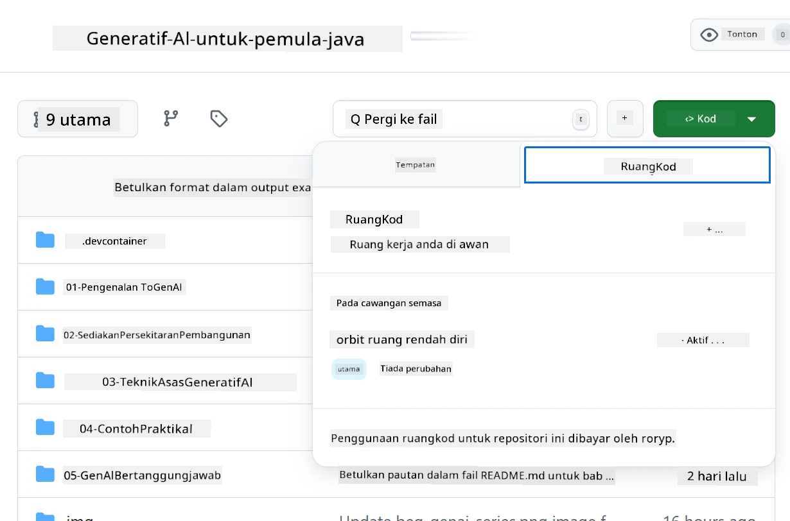
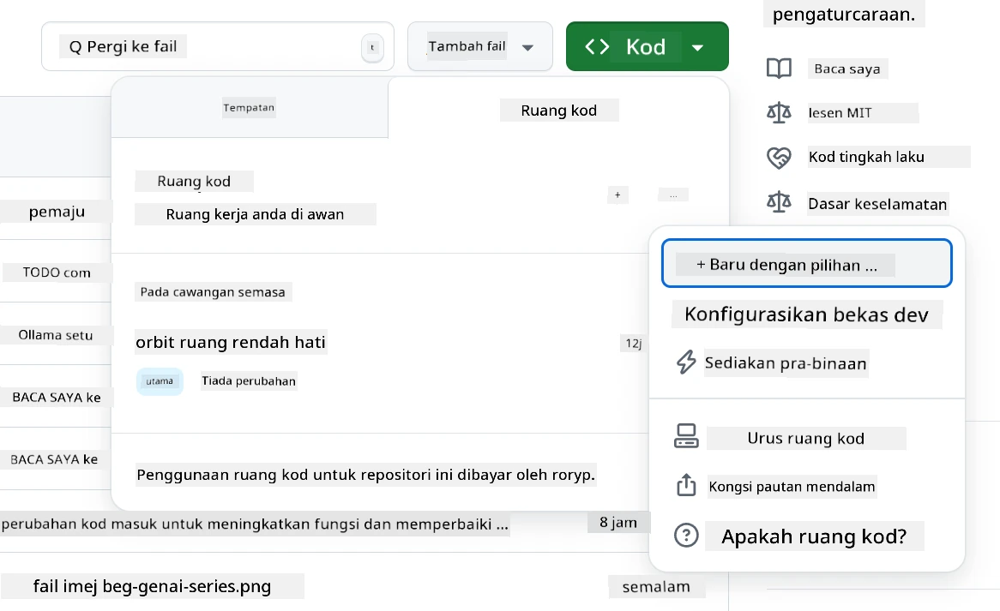
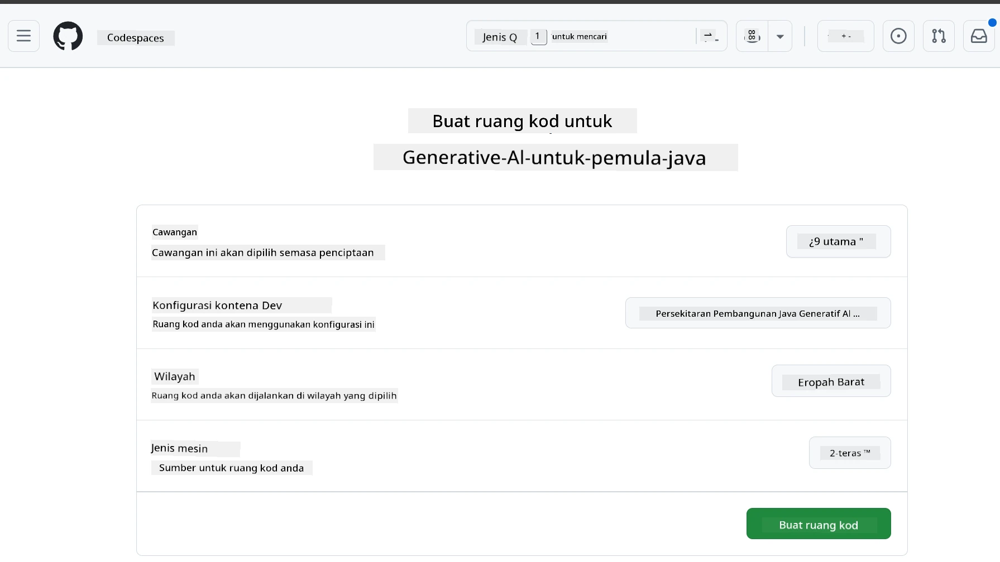
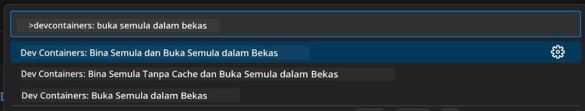
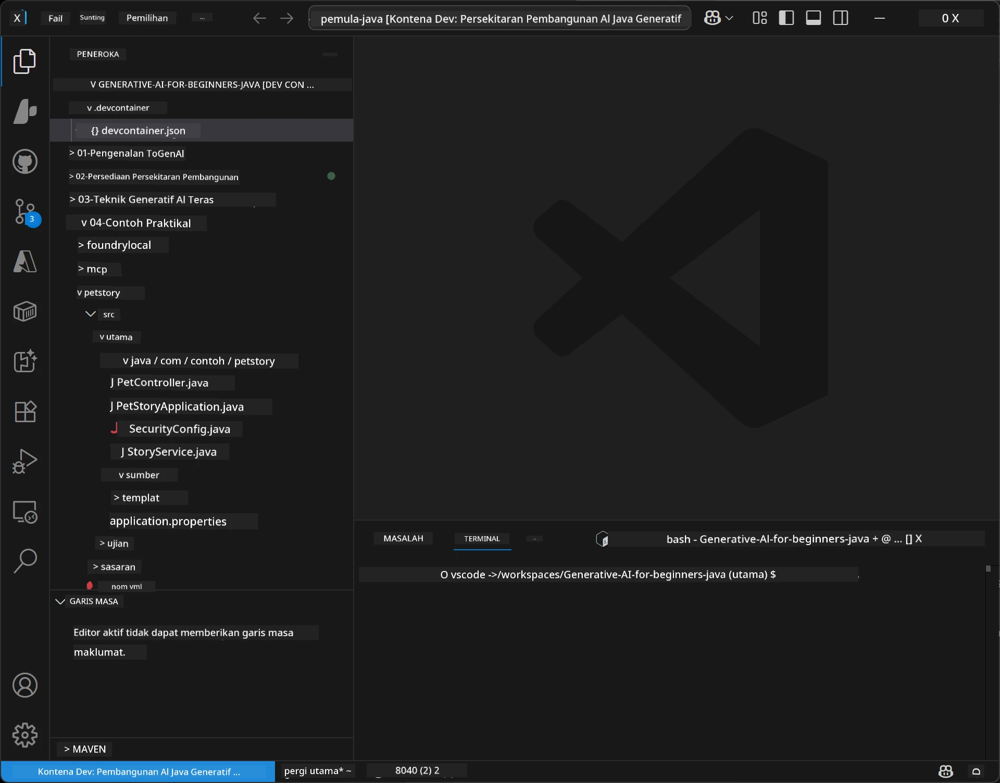
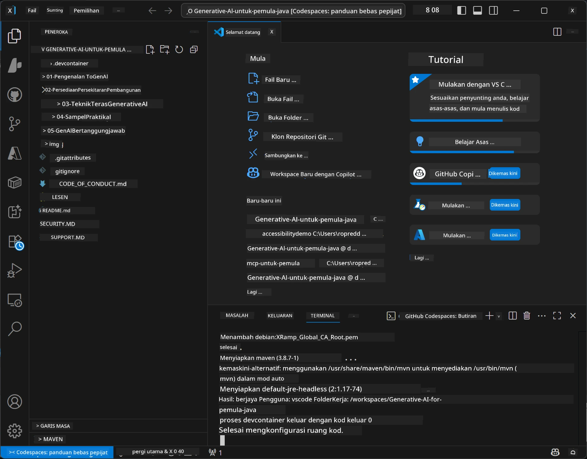

# Menyediakan Persekitaran Pembangunan untuk Generative AI bagi Java

> **Mula Cepat:** Sediakan model AI anda di **Azure AI Foundry** sebagai kod dengan Bicep + `azd` dalam beberapa minit — lihat [Panduan Penyediaan Azure AI Foundry](getting-started-azure-openai.md). Pengesahan adalah **tanpa kunci** (Microsoft Entra ID), jadi tiada kunci API yang perlu diuruskan.

## Apa Yang Akan Anda Pelajari

- Sediakan persekitaran pembangunan Java untuk aplikasi AI
- Pilih dan konfigurasikan persekitaran pembangunan pilihan anda (utama awan dengan Codespaces, bekas dev tempatan, atau persediaan tempatan penuh)
- Uji persediaan anda dengan menyambung ke model Azure AI Foundry

## Jadual Kandungan

- [Apa Yang Akan Anda Pelajari](#apa-yang-akan-anda-pelajari)
- [Pengenalan](#pengenalan)
- [Langkah 1: Sediakan Persekitaran Pembangunan Anda](#langkah-1-sediakan-persekitaran-pembangunan-anda)
  - [Pilihan A: GitHub Codespaces (Disyorkan)](#pilihan-a-github-codespaces-disyorkan)
  - [Pilihan B: Bekas Dev Tempatan](#pilihan-b-bekas-dev-tempatan)
  - [Pilihan C: Gunakan Pemasangan Tempatan Sedia Ada Anda](#pilihan-c-gunakan-pemasangan-tempatan-sedia-ada-anda)
- [Langkah 2: Sediakan Azure AI Foundry](#langkah-2-sediakan-azure-ai-foundry)
- [Langkah 3: Uji Persediaan Anda](#langkah-3-uji-persediaan-anda)
- [Penyelesaian Masalah](#penyelesaian-masalah)
- [Ringkasan](#ringkasan)
- [Langkah Seterusnya](#langkah-seterusnya)

## Pengenalan

Bab ini akan membimbing anda melalui penyediaan persekitaran pembangunan. Kami akan menggunakan **Azure AI Foundry** untuk model-model sepanjang kursus ini. Anda menyediakan model sebagai kod dengan Bicep dan Azure Developer CLI (`azd`), kemudian sambung dengan **pengesahan tanpa kunci** (Microsoft Entra ID) — tiada kunci API untuk disalin atau bocor.

**Tiada persediaan tempatan diperlukan!** Anda boleh menggunakan GitHub Codespaces, yang menyediakan persekitaran pembangunan penuh dalam pelayar anda, dan menyediakan Foundry dari sana.

Kami menggunakan **Azure AI Foundry** untuk kursus ini kerana ia:
- **Disediakan sebagai kod** — satu `azd up` menyebarkan akaun dan penempatan model
- **Tanpa kunci** — sahkan dengan log masuk Azure anda atau identiti terurus
- **Sedia untuk produksi** — kod yang sama berjalan secara lokal dan di Azure
- **Fleksibel** — tukar model dengan menukar nama penempatan, bukan kod anda

> **Nota**: Penempatan Azure AI Foundry dikenakan bayaran mengikut token (bayar mengikut penggunaan). Lihat [panduan penyediaan Azure AI Foundry](getting-started-azure-openai.md) untuk butiran penyediaan, wilayah, dan kos.


## Langkah 1: Sediakan Persekitaran Pembangunan Anda

<a name="quick-start-cloud"></a>

Kami telah mencipta bekas pembangunan yang telah dikonfigurasikan awal untuk meminimumkan masa penyediaan dan memastikan anda mempunyai semua alat yang diperlukan untuk kursus Generative AI for Java ini. Pilih pendekatan pembangunan yang anda gemari:

### Pilihan Penyediaan Persekitaran:

#### Pilihan A: GitHub Codespaces (Disyorkan)

**Mula menulis kod dalam 2 minit - tiada persediaan tempatan diperlukan!**

1. Fork repositori ini ke akaun GitHub anda
   > **Nota**: Jika anda ingin sunting konfigurasi asas sila lihat [Dev Container Configuration](../../../.devcontainer/devcontainer.json)
2. Klik **Code** → tab **Codespaces** → **...** → **New with options...**
3. Gunakan tetapan lalai – ini akan memilih **Konfigurasi bekas pembangunan**: **Generative AI Java Development Environment** devcontainer khusus untuk kursus ini
4. Klik **Create codespace**
5. Tunggu ~2 minit untuk persekitaran sedia
6. Teruskan ke [Langkah 2: Sediakan Azure AI Foundry](#langkah-2-sediakan-azure-ai-foundry)








> **Kelebihan Codespaces**:
> - Tiada pemasangan tempatan diperlukan
> - Berfungsi di mana-mana peranti dengan pelayar
> - Pra-konfigurasi dengan semua alat dan kebergantungan
> - 60 jam percuma sebulan untuk akaun peribadi
> - Persekitaran konsisten untuk semua pelajar

#### Pilihan B: Bekas Dev Tempatan

**Untuk pembangun yang lebih suka pembangunan tempatan dengan Docker**

1. Fork dan klon repositori ini ke mesin tempatan anda
   > **Nota**: Jika anda ingin sunting konfigurasi asas sila lihat [Dev Container Configuration](../../../.devcontainer/devcontainer.json)
2. Pasang [Docker Desktop](https://www.docker.com/products/docker-desktop/) dan [VS Code](https://code.visualstudio.com/)
3. Pasang [Dev Containers extension](https://marketplace.visualstudio.com/items?itemName=ms-vscode-remote.remote-containers) dalam VS Code
4. Buka folder repositori dalam VS Code
5. Bila digesa, klik **Reopen in Container** (atau gunakan `Ctrl+Shift+P` → "Dev Containers: Reopen in Container")
6. Tunggu bekas dibina dan dimulakan
7. Teruskan ke [Langkah 2: Sediakan Azure AI Foundry](#langkah-2-sediakan-azure-ai-foundry)





#### Pilihan C: Gunakan Pemasangan Tempatan Sedia Ada Anda

**Untuk pembangun dengan persekitaran Java sedia ada**

Prasyarat:
- [Java 21+](https://www.oracle.com/java/technologies/javase/jdk21-archive-downloads.html) 
- [Maven 3.9+](https://maven.apache.org/download.cgi)
- [VS Code](https://code.visualstudio.com) atau IDE pilihan anda

Langkah:
1. Klon repositori ini ke mesin tempatan anda
2. Buka projek dalam IDE anda
3. Teruskan ke [Langkah 2: Sediakan Azure AI Foundry](#langkah-2-sediakan-azure-ai-foundry)

> **Petua Pro**: Jika anda mempunyai mesin spesifikasi rendah tapi mahu VS Code secara tempatan, gunakan GitHub Codespaces! Anda boleh sambungkan VS Code tempatan anda ke Codespace hos awan untuk mendapat yang terbaik dari kedua-dua dunia.




## Langkah 2: Sediakan Azure AI Foundry

Sebarkan model AI kursus ke Azure AI Foundry sebagai kod. Dari akar repositori:

```bash
cd 02-SetupDevEnvironment
azd auth login
az login
azd up
```

`azd` akan meminta nama persekitaran, langganan, dan wilayah, menyediakan akaun Azure AI Foundry dengan penempatan `gpt-5.6-luna` dan `text-embedding-3-small`, dan menulis titik hujung ke `.env` contoh - semua dengan pengesahan **tanpa kunci** (tiada kunci API).

> **Panduan lengkap:** Lihat [Panduan Penyediaan Azure AI Foundry](getting-started-azure-openai.md) untuk prasyarat, alternatif manual (portal), panduan wilayah, dan nota kos/pembersihan.

## Langkah 3: Uji Persediaan Anda

Setelah model Foundry anda disediakan, uji sambungan dengan aplikasi contoh di [`02-SetupDevEnvironment/examples/basic-chat-azure`](../../../02-SetupDevEnvironment/examples/basic-chat-azure).

1. Buka terminal dalam persekitaran pembangunan anda.
2. Navigasi ke contoh:
   ```bash
   cd 02-SetupDevEnvironment/examples/basic-chat-azure
   ```
3. Pastikan anda telah masuk (pengesahan tanpa kunci memerlukan token):
   ```bash
   az login
   ```
   > Jika anda menjalankan `azd up`, fail `.env` dengan titik hujung anda sudah ditulis untuk anda.
4. Jalankan aplikasi:
   ```bash
   mvn clean spring-boot:run
   ```

Anda harus melihat respons dari model `gpt-5.6-luna`.

### Memahami Kod Contoh

[Contoh basic-chat](./examples/basic-chat-azure/README.md) menggunakan **Spring Boot 4.1.1** dan **Spring AI 2.0.1**. `ChatClient` Spring AI disokong oleh SDK Java OpenAI rasmi, menyambung ke titik hujung Azure OpenAI **v1** dengan pengesahan tanpa kunci.

**Apa yang kod ini lakukan:**
- **Menyambung** ke Azure AI Foundry menggunakan log masuk Azure anda (Microsoft Entra ID) — tiada kunci API
- **Menghantar** prompt ke model `gpt-5.6-luna`
- **Menerima** dan memaparkan respons AI
- **Memastikan** persediaan anda berfungsi dengan betul

**Kebergantungan Utama** (petikan dari [pom.xml](../../../02-SetupDevEnvironment/examples/basic-chat-azure/pom.xml)):
```xml
<dependency>
    <groupId>org.springframework.ai</groupId>
    <artifactId>spring-ai-starter-model-openai</artifactId>
</dependency>
<dependency>
    <groupId>com.openai</groupId>
    <artifactId>openai-java</artifactId>
</dependency>
<dependency>
    <groupId>com.azure</groupId>
    <artifactId>azure-identity</artifactId>
    <version>${azure-identity.version}</version>
</dependency>
```

POM mengurus OpenAI Java **4.63.1** dan menetapkan Azure Identity **1.18.6** secara eksplisit. Spring AI 2 menghilangkan starter khusus Azure; Azure Identity masih diperlukan untuk bean kredensial.

**Konfigurasi** ([application.yml](../../../02-SetupDevEnvironment/examples/basic-chat-azure/src/main/resources/application.yml)):
```yaml
spring:
  ai:
    openai:
      base-url: ${AZURE_OPENAI_ENDPOINT}
      microsoft-foundry: true
      chat:
        model: ${AZURE_OPENAI_DEPLOYMENT:gpt-5.6-luna}
        reasoning-effort: none
        max-completion-tokens: 500
```

Pengesahan tanpa kunci dikonfigurasikan eksplisit dalam [BasicChatApplication.java](../../../02-SetupDevEnvironment/examples/basic-chat-azure/src/main/java/com/example/BasicChatApplication.java), bukan ditafsir dari kunci API yang tiada. Kredensial bearer menggunakan `DefaultAzureCredential` dengan skop `https://ai.azure.com/.default`, dan `OpenAIClient` menyasarkan `/openai/v1`. Aplikasi membekalkan klien itu ke model chat Spring AI, jadi `OPENAI_API_KEY` global tidak dapat menimpa pengesahan Azure.

Tetapan chat berada terus di bawah `spring.ai.openai.chat`, tanpa blok `options`. Pengajaran mengekalkan Chat Completions dengan `reasoning-effort: none` dan had 500 token; ia tidak menetapkan `temperature` atau `max-tokens`. Lihat [rujukan konfigurasi contoh](./examples/basic-chat-azure/README.md#spring-configuration) untuk pilihan API dan panduan pemanggilan alat.

## Ringkasan

Setelah melengkapkan langkah-langkah di atas, anda akan mempunyai:

- Model Azure AI Foundry yang disediakan sebagai kod dengan Bicep + `azd`
- Persekitaran pembangunan Java anda berjalan (sama ada Codespaces, bekas dev, atau tempatan)
- Sambungan ke Azure AI Foundry dengan pengesahan tanpa kunci (Microsoft Entra ID) — tiada kunci API
- Uji semuanya berfungsi dengan contoh mudah yang bercakap dengan model anda

## Langkah Seterusnya

[Bab 3: Teknik Generative AI Teras](../03-CoreGenerativeAITechniques/README.md)

## Penyelesaian Masalah

Ada masalah? Ini adalah masalah biasa dan penyelesaiannya:

- **Pengesahan gagal (401/403)?** 
  - Jalankan `az login` — pengesahan tanpa kunci, jadi anda mesti log masuk
  - Sahkan akaun anda mempunyai peranan **Cognitive Services OpenAI User** pada sumber
  - Jika baru sahaja menyedia, tunggu sebentar supaya tugasan peranan tersebar

- **Maven tidak dijumpai?** 
  - Jika menggunakan bekas dev/Codespaces, Maven sepatutnya telah dipasang
  - Untuk penyediaan tempatan, pastikan Java 21+ dan Maven 3.9+ dipasang
  - Cuba `mvn --version` untuk sahkan pemasangan

- **`azd` tidak dijumpai atau penyediaan gagal?** 
  - Pasang [Azure Developer CLI](https://aka.ms/azure-dev/install) dan jalankan `azd auth login`
  - Pilih wilayah yang menyokong `gpt-5.6-luna` dan `text-embedding-3-small` (contoh `eastus2`), dengan kuota cukup dalam langganan anda
  - Lihat [panduan penyediaan Azure AI Foundry](getting-started-azure-openai.md) untuk butiran

- **Bekas dev tidak bermula?** 
  - Pastikan Docker Desktop berjalan (untuk pembangunan tempatan)
  - Cuba bina semula bekas: `Ctrl+Shift+P` → "Dev Containers: Rebuild Container"

- **Ralat kompilasi aplikasi?**
  - Pastikan anda berada di direktori betul: `02-SetupDevEnvironment/examples/basic-chat-azure`
  - Cuba bersihkan dan bina semula: `mvn clean compile`

> **Perlu bantuan?**: Masih ada masalah? Buka isu dalam repositori dan kami akan bantu anda.

---

<!-- CO-OP TRANSLATOR DISCLAIMER START -->
**Penafian**:
Dokumen ini telah diterjemahkan menggunakan perkhidmatan terjemahan AI [Co-op Translator](https://github.com/Azure/co-op-translator). Walaupun kami berusaha untuk ketepatan, sila ambil maklum bahawa terjemahan automatik mungkin mengandungi kesilapan atau ketidaktepatan. Dokumen asal dalam bahasa asalnya harus dianggap sebagai sumber yang sahih. Untuk maklumat penting, terjemahan oleh manusia profesional adalah disyorkan. Kami tidak bertanggungjawab terhadap sebarang salah faham atau salah tafsir yang timbul daripada penggunaan terjemahan ini.
<!-- CO-OP TRANSLATOR DISCLAIMER END -->