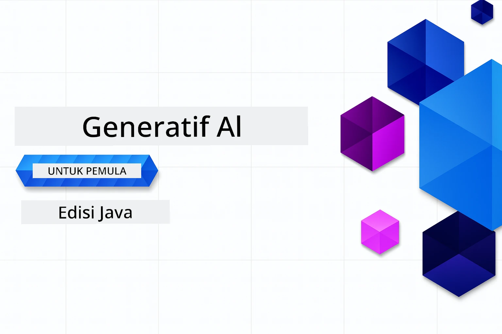

# AI Generatif untuk Pemula - Edisi Java
[](https://discord.gg/nTYy5BXMWG)



**Komitmen Masa**: Keseluruhan bengkel boleh diselesaikan secara dalam talian tanpa pemasangan tempatan. Persediaan persekitaran mengambil masa 2 minit, dengan penerokaan contoh memerlukan 1-3 jam bergantung pada kedalaman penerokaan.

> **Mula dengan Pantas**

1. Fork repositori ini ke akaun GitHub anda
2. Klik **Code** → tab **Codespaces** → **...** → **New with options...**
3. Gunakan tetapan lalai – ini akan memilih kontena Pembangunan yang dibuat untuk kursus ini
4. Klik **Create codespace**
5. Tunggu ~2 minit untuk persekitaran siap
6. Terus ke [Bab 2: Penyediaan Azure AI Foundry](./02-SetupDevEnvironment/README.md#step-2-provision-azure-ai-foundry)

## Sokongan Pelbagai Bahasa

### Disokong melalui GitHub Action (Automatik & Sentiasa Terkini)

<!-- CO-OP TRANSLATOR LANGUAGES TABLE START -->
[Arabic](../ar/README.md) | [Bengali](../bn/README.md) | [Bulgarian](../bg/README.md) | [Burmese (Myanmar)](../my/README.md) | [Chinese (Simplified)](../zh-CN/README.md) | [Chinese (Traditional, Hong Kong)](../zh-HK/README.md) | [Chinese (Traditional, Macau)](../zh-MO/README.md) | [Chinese (Traditional, Taiwan)](../zh-TW/README.md) | [Croatian](../hr/README.md) | [Czech](../cs/README.md) | [Danish](../da/README.md) | [Dutch](../nl/README.md) | [Estonian](../et/README.md) | [Finnish](../fi/README.md) | [French](../fr/README.md) | [German](../de/README.md) | [Greek](../el/README.md) | [Hebrew](../he/README.md) | [Hindi](../hi/README.md) | [Hungarian](../hu/README.md) | [Indonesian](../id/README.md) | [Italian](../it/README.md) | [Japanese](../ja/README.md) | [Kannada](../kn/README.md) | [Khmer](../km/README.md) | [Korean](../ko/README.md) | [Lithuanian](../lt/README.md) | [Malay](./README.md) | [Malayalam](../ml/README.md) | [Marathi](../mr/README.md) | [Nepali](../ne/README.md) | [Nigerian Pidgin](../pcm/README.md) | [Norwegian](../no/README.md) | [Persian (Farsi)](../fa/README.md) | [Polish](../pl/README.md) | [Portuguese (Brazil)](../pt-BR/README.md) | [Portuguese (Portugal)](../pt-PT/README.md) | [Punjabi (Gurmukhi)](../pa/README.md) | [Romanian](../ro/README.md) | [Russian](../ru/README.md) | [Serbian (Cyrillic)](../sr/README.md) | [Slovak](../sk/README.md) | [Slovenian](../sl/README.md) | [Spanish](../es/README.md) | [Swahili](../sw/README.md) | [Swedish](../sv/README.md) | [Tagalog (Filipino)](../tl/README.md) | [Tamil](../ta/README.md) | [Telugu](../te/README.md) | [Thai](../th/README.md) | [Turkish](../tr/README.md) | [Ukrainian](../uk/README.md) | [Urdu](../ur/README.md) | [Vietnamese](../vi/README.md)

> **Lebih Suka Klon Secara Tempatan?**
>
> Repositori ini termasuk terjemahan lebih dari 50 bahasa yang meningkatkan saiz muat turun secara signifikan. Untuk klon tanpa terjemahan, gunakan sparse checkout:
>
> **Bash / macOS / Linux:**
> ```bash
> git clone --filter=blob:none --sparse https://github.com/microsoft/Generative-AI-for-beginners-java.git
> cd Generative-AI-for-beginners-java
> git sparse-checkout set --no-cone '/*' '!translations' '!translated_images'
> ```
>
> **CMD (Windows):**
> ```cmd
> git clone --filter=blob:none --sparse https://github.com/microsoft/Generative-AI-for-beginners-java.git
> cd Generative-AI-for-beginners-java
> git sparse-checkout set --no-cone "/*" "!translations" "!translated_images"
> ```
>
> Ini memberikan anda segala yang anda perlukan untuk menyelesaikan kursus dengan muat turun yang jauh lebih cepat.
<!-- CO-OP TRANSLATOR LANGUAGES TABLE END -->

## Struktur Kursus & Laluan Pembelajaran

### **Bab 1: Pengenalan kepada AI Generatif**
- **Konsep Teras**: Memahami Model Bahasa Besar, token, embeddings, dan keupayaan AI
- **Ekosistem AI Java**: Gambaran keseluruhan Spring AI dan SDK OpenAI
- **Protokol Konteks Model**: Pengenalan kepada MCP dan peranannya dalam komunikasi agen AI
- **Aplikasi Praktikal**: Senario dunia sebenar termasuk chatbot dan penjanaan kandungan
- **[→ Mula Bab 1](./01-IntroToGenAI/README.md)**

### **Bab 2: Persediaan Persekitaran Pembangunan**
- **Azure AI Foundry**: Menyediakan chat GPT-5.6 Luna dan embeddings text-embedding-3-small dengan Bicep dan Azure Developer CLI (azd)
- **Spring Boot 4.1.1 + Spring AI 2.0.1**: Belajar dengan `ChatClient`, disokong oleh SDK Java OpenAI rasmi dan Azure OpenAI v1
- **Pengesahan Tanpa Kunci**: Sambung dengan selamat menggunakan Microsoft Entra ID — tiada kunci API yang perlu diurus
- **Alatan Pembangunan**: Kontena Docker, VS Code, dan konfigurasi GitHub Codespaces
- **[→ Mula Bab 2](./02-SetupDevEnvironment/README.md)**

### **Bab 3: Teknik AI Generatif Teras**
- **SDK Java OpenAI Rasmi**: Panggil Azure OpenAI v1 secara langsung dengan pengesahan tanpa kunci
- **Kejuruteraan Prompt**: Teknik untuk respons model AI yang optimum
- **Embeddings & Operasi Vektor**: Melaksanakan carian semantik dan pemadanan persamaan
- **Penjanaan Dipertingkatkan dengan Pengambilan (RAG)**: Gabungkan AI dengan sumber data anda sendiri
- **Panggilan Fungsi**: Luaskan keupayaan AI dengan alatan dan plugin tersuai
- **[→ Mula Bab 3](./03-CoreGenerativeAITechniques/README.md)**

### **Bab 4: Aplikasi Praktikal & Projek**
- **Penjana Cerita Haiwan Peliharaan** (`petstory/`): Penjanaan kandungan kreatif dengan Azure AI Foundry
- **Demo Foundry Tempatan** (`foundrylocal/`): Integrasi model AI tempatan dengan SDK Java OpenAI
- **Perkhidmatan Pengira MCP** (`calculator/`): Pelaksanaan asas Protokol Konteks Model dengan Spring AI
- **[→ Mula Bab 4](./04-PracticalSamples/README.md)**

### **Bab 5: Pembangunan AI Bertanggungjawab**
- **Keselamatan Kandungan Azure AI Foundry**: Uji penapisan kandungan terbina dalam dan mekanisme keselamatan (sekatan keras dan penolakan lembut)
- **Demo AI Bertanggungjawab**: Contoh praktikal menunjukkan bagaimana sistem keselamatan AI moden berfungsi
- **Amalan Terbaik**: Garis panduan penting untuk pembangunan dan penyebaran AI yang beretika
- **[→ Mula Bab 5](./05-ResponsibleGenAI/README.md)**

## Sumber Tambahan

<!-- CO-OP TRANSLATOR OTHER COURSES START -->
### LangChain
[](https://aka.ms/langchain4j-for-beginners)
[](https://aka.ms/langchainjs-for-beginners?WT.mc_id=m365-94501-dwahlin)
[](https://github.com/microsoft/langchain-for-beginners?WT.mc_id=m365-94501-dwahlin)
---

### Azure / Edge / MCP / Agen
[](https://github.com/microsoft/AZD-for-beginners?WT.mc_id=academic-105485-koreyst)
[](https://github.com/microsoft/edgeai-for-beginners?WT.mc_id=academic-105485-koreyst)
[](https://github.com/microsoft/mcp-for-beginners?WT.mc_id=academic-105485-koreyst)
[](https://github.com/microsoft/ai-agents-for-beginners?WT.mc_id=academic-105485-koreyst)

---
 
### Siri AI Generatif
[](https://github.com/microsoft/generative-ai-for-beginners?WT.mc_id=academic-105485-koreyst)
[-9333EA?style=for-the-badge&labelColor=E5E7EB&color=9333EA)](https://github.com/microsoft/Generative-AI-for-beginners-dotnet?WT.mc_id=academic-105485-koreyst)
[-C084FC?style=for-the-badge&labelColor=E5E7EB&color=C084FC)](https://github.com/microsoft/generative-ai-for-beginners-java?WT.mc_id=academic-105485-koreyst)
[-E879F9?style=for-the-badge&labelColor=E5E7EB&color=E879F9)](https://github.com/microsoft/generative-ai-with-javascript?WT.mc_id=academic-105485-koreyst)

---
 
### Pembelajaran Teras
[](https://aka.ms/ml-beginners?WT.mc_id=academic-105485-koreyst)
[](https://aka.ms/datascience-beginners?WT.mc_id=academic-105485-koreyst)
[](https://aka.ms/ai-beginners?WT.mc_id=academic-105485-koreyst)
[](https://github.com/microsoft/Security-101?WT.mc_id=academic-96948-sayoung)
[](https://aka.ms/webdev-beginners?WT.mc_id=academic-105485-koreyst)
[](https://aka.ms/iot-beginners?WT.mc_id=academic-105485-koreyst)
[](https://github.com/microsoft/xr-development-for-beginners?WT.mc_id=academic-105485-koreyst)

---
 
### Siri Copilot
[](https://aka.ms/GitHubCopilotAI?WT.mc_id=academic-105485-koreyst)
[](https://github.com/microsoft/mastering-github-copilot-for-dotnet-csharp-developers?WT.mc_id=academic-105485-koreyst)
[](https://github.com/microsoft/CopilotAdventures?WT.mc_id=academic-105485-koreyst)
<!-- CO-OP TRANSLATOR OTHER COURSES END -->

## Mendapatkan Bantuan

Jika anda tersekat atau mempunyai sebarang soalan tentang membina aplikasi AI. Sertai pelajar lain dan pembangun berpengalaman dalam perbincangan tentang MCP. Ia adalah komuniti yang menyokong di mana soalan dialu-alukan dan pengetahuan dikongsi dengan bebas.

[](https://discord.gg/nTYy5BXMWG)

Jika anda mempunyai maklum balas produk atau ralat semasa membina, lawati:

[](https://aka.ms/foundry/forum)

---

<!-- CO-OP TRANSLATOR DISCLAIMER START -->
**Penafian**:
Dokumen ini telah diterjemahkan menggunakan perkhidmatan terjemahan AI [Co-op Translator](https://github.com/Azure/co-op-translator). Walaupun kami berusaha untuk ketepatan, sila ambil maklum bahawa terjemahan automatik mungkin mengandungi kesilapan atau ketidaktepatan. Dokumen asal dalam bahasa asalnya harus dianggap sebagai sumber yang sahih. Untuk maklumat penting, terjemahan oleh manusia profesional adalah disyorkan. Kami tidak bertanggungjawab terhadap sebarang salah faham atau salah tafsir yang timbul daripada penggunaan terjemahan ini.
<!-- CO-OP TRANSLATOR DISCLAIMER END -->