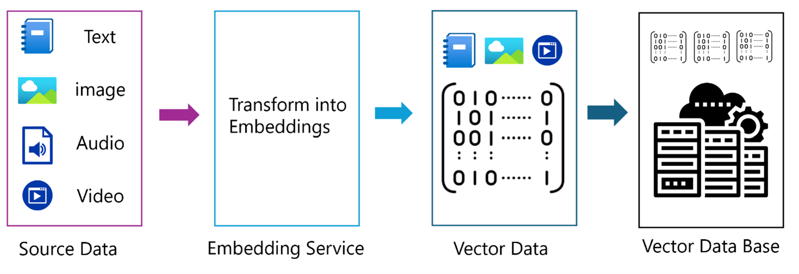
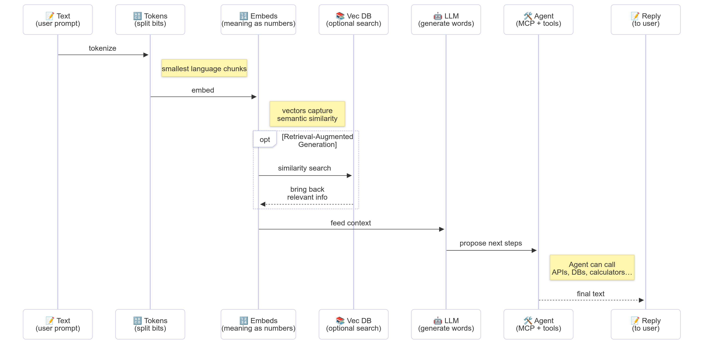

<!--
CO_OP_TRANSLATOR_METADATA:
{
  "original_hash": "75bfb080ca725e8a9aa9c80cae25fba1",
  "translation_date": "2025-07-29T16:34:50+00:00",
  "source_file": "01-IntroToGenAI/README.md",
  "language_code": "my"
}
-->
# Generative AI - Java Edition သင်ခန်းစာမိတ်ဆက်

## သင်လေ့လာမည့်အရာများ

- **Generative AI အခြေခံအကြောင်းအရာများ** - LLMs, prompt engineering, tokens, embeddings, နှင့် vector databases အပါအဝင်
- **Java AI ဖွံ့ဖြိုးရေးကိရိယာများနှင့် Library များ** - Azure OpenAI SDK, Spring AI, နှင့် OpenAI Java SDK တို့ကိုနှိုင်းယှဉ်လေ့လာခြင်း
- **Model Context Protocol** နှင့် AI agent များအကြားဆက်သွယ်မှုတွင်၎င်း၏အခန်းကဏ္ဍ

## အကြောင်းအရာများ

- [မိတ်ဆက်](../../../01-IntroToGenAI)
- [Generative AI အကြောင်းအရာများကိုအမြန်ပြန်လည်သုံးသပ်ခြင်း](../../../01-IntroToGenAI)
- [Prompt engineering ပြန်လည်သုံးသပ်ခြင်း](../../../01-IntroToGenAI)
- [Tokens, embeddings, နှင့် agents](../../../01-IntroToGenAI)
- [Java အတွက် AI ဖွံ့ဖြိုးရေးကိရိယာများနှင့် Library များ](../../../01-IntroToGenAI)
  - [OpenAI Java SDK](../../../01-IntroToGenAI)
  - [Spring AI](../../../01-IntroToGenAI)
  - [Azure OpenAI Java SDK](../../../01-IntroToGenAI)
- [အကျဉ်းချုပ်](../../../01-IntroToGenAI)
- [နောက်ထပ်အဆင့်များ](../../../01-IntroToGenAI)

## မိတ်ဆက်

Generative AI for Beginners - Java Edition ၏ ပထမဦးဆုံးအခန်းသို့ကြိုဆိုပါသည်! ဒီအခြေခံသင်ခန်းစာတွင် generative AI ၏ အဓိကအကြောင်းအရာများနှင့် Java ကိုအသုံးပြု၍ ၎င်းတို့ကို ဘယ်လိုလုပ်ဆောင်ရမည်ကို မိတ်ဆက်ပေးပါမည်။ သင်သည် AI အပလီကေးရှင်းများ၏ အခြေခံအဆင့်များဖြစ်သည့် Large Language Models (LLMs), tokens, embeddings, နှင့် AI agents အကြောင်းကိုလေ့လာသိရှိရမည်ဖြစ်သည်။ ထို့အပြင် ဒီသင်တန်းတစ်လျှောက်လုံး သင်အသုံးပြုမည့် Java tools များကိုလည်း လေ့လာသိရှိရမည်ဖြစ်သည်။

### Generative AI အကြောင်းအရာများကိုအမြန်ပြန်လည်သုံးသပ်ခြင်း

Generative AI သည် အချက်အလက်များမှ pattern များနှင့် ဆက်စပ်မှုများကို လေ့လာသင်ယူပြီး အသစ်သော အကြောင်းအရာများ (စာသား၊ ပုံရိပ်များ၊ သို့မဟုတ် ကုဒ်များ) ဖန်တီးနိုင်သော အတုအတန့်တုစက်ရုပ်တစ်မျိုးဖြစ်သည်။ Generative AI မော်ဒယ်များသည် လူသားများလိုမျိုး တုံ့ပြန်မှုများဖန်တီးနိုင်ခြင်း၊ အကြောင်းအရာကို နားလည်နိုင်ခြင်း၊ တခါတရံတွင် လူသားများဖန်တီးသည့်အတိုင်း အကြောင်းအရာများကို ဖန်တီးနိုင်ခြင်းတို့ကို ပြုလုပ်နိုင်သည်။

Java AI အပလီကေးရှင်းများကို ဖွံ့ဖြိုးတိုးတက်စေရာတွင် **generative AI မော်ဒယ်များ** ကို အသုံးပြု၍ အကြောင်းအရာများဖန်တီးရမည်ဖြစ်သည်။ Generative AI မော်ဒယ်များ၏ စွမ်းရည်များအနက် အချို့မှာ -

- **စာသားဖန်တီးခြင်း**: Chatbots, အကြောင်းအရာဖန်တီးခြင်း၊ စာသားဖြည့်စွက်ခြင်းတို့အတွက် လူသားလိုမျိုး စာသားများရေးသားခြင်း
- **ပုံရိပ်ဖန်တီးခြင်းနှင့် ခွဲခြမ်းစိတ်ဖြာခြင်း**: အမှန်တကယ်လိုက်ဖက်သော ပုံရိပ်များဖန်တီးခြင်း၊ ဓာတ်ပုံများတိုးတက်စေခြင်း၊ အရာဝတ္ထုများကို ရှာဖွေခြင်း
- **ကုဒ်ဖန်တီးခြင်း**: ကုဒ်အပိုင်းအစများ သို့မဟုတ် script များရေးသားခြင်း

အလုပ်အမျိုးမျိုးအတွက် အထူးပြုထားသော မော်ဒယ်အမျိုးအစားများလည်း ရှိသည်။ ဥပမာအားဖြင့် **Small Language Models (SLMs)** နှင့် **Large Language Models (LLMs)** နှစ်မျိုးစလုံးသည် စာသားဖန်တီးခြင်းကို လုပ်ဆောင်နိုင်သော်လည်း LLMs သည် ရှုပ်ထွေးသောအလုပ်များအတွက် ပိုမိုကောင်းမွန်သော စွမ်းဆောင်ရည်ကို ပေးစွမ်းနိုင်သည်။ ပုံရိပ်နှင့်ဆိုင်သော အလုပ်များအတွက် သင်သည် အထူးပြု vision မော်ဒယ်များ သို့မဟုတ် multi-modal မော်ဒယ်များကို အသုံးပြုရမည်ဖြစ်သည်။

သို့သော် မော်ဒယ်များ၏ တုံ့ပြန်မှုများသည် အချိန်တိုင်းမှန်ကန်မည်မဟုတ်ပါ။ မော်ဒယ်များသည် "hallucinating" လို့ခေါ်သော မှားယွင်းသော အချက်အလက်များကို အာဏာတရားရှိသည့်ပုံစံဖြင့် ဖန်တီးပေးနိုင်သည်ဟု သင်ကြားဖူးလိမ့်မည်။ သို့သော် သင်၏ မော်ဒယ်ကို ပိုမိုကောင်းမွန်သော တုံ့ပြန်မှုများ ဖန်တီးစေရန် သင်၏ ညွှန်ကြားချက်များနှင့် အကြောင်းအရာများကို ရှင်းလင်းစွာပေးနိုင်ပါသည်။ ဒီနေရာမှာ **prompt engineering** က အရေးပါလာပါသည်။

#### Prompt engineering ပြန်လည်သုံးသပ်ခြင်း

Prompt engineering သည် AI မော်ဒယ်များကို လိုချင်သောရလဒ်များဆီသို့ ဦးတည်စေသော ထိရောက်သော input များကို ဒီဇိုင်းဆွဲခြင်းဖြစ်သည်။ ၎င်းတွင် -

- **ရှင်းလင်းမှု**: ညွှန်ကြားချက်များကို ရှင်းလင်းပြီး မရှုပ်ထွေးစေရန်
- **အကြောင်းအရာ**: လိုအပ်သော နောက်ခံအချက်အလက်များပေးခြင်း
- **ကန့်သတ်ချက်များ**: အကန့်အသတ်များ သို့မဟုတ် ဖော်မတ်များကို သတ်မှတ်ခြင်း

Prompt engineering ၏ အကောင်းဆုံးလေ့ကျင့်မှုများတွင် prompt design, ရှင်းလင်းသောညွှန်ကြားချက်များ, အလုပ်ခွဲခြမ်းစိတ်ဖြာခြင်း, one-shot နှင့် few-shot learning, နှင့် prompt tuning တို့ပါဝင်သည်။ သင့်ရဲ့ အထူးသုံးစွဲမှုအတွက် အကောင်းဆုံးဖြစ်စေမည့် prompt ကို ရှာဖွေရန် အမျိုးမျိုးသော prompt များကို စမ်းသပ်ရမည်ဖြစ်သည်။

အပလီကေးရှင်းများဖွံ့ဖြိုးရာတွင် သင်သည် prompt အမျိုးအစားအမျိုးမျိုးနှင့် အလုပ်လုပ်ရမည်ဖြစ်သည် -

- **System prompts**: မော်ဒယ်၏ အပြုအမူအတွက် အခြေခံစည်းမျဉ်းများနှင့် အကြောင်းအရာများ သတ်မှတ်ခြင်း
- **User prompts**: သင့်အပလီကေးရှင်းအသုံးပြုသူများမှ ရရှိသော input အချက်အလက်များ
- **Assistant prompts**: System နှင့် user prompts များအပေါ် အခြေခံပြီး မော်ဒယ်မှ တုံ့ပြန်မှုများ

> **Learn more**: Prompt engineering အကြောင်းပိုမိုလေ့လာရန် [Prompt Engineering chapter of GenAI for Beginners course](https://github.com/microsoft/generative-ai-for-beginners/tree/main/04-prompt-engineering-fundamentals) ကို ကြည့်ပါ

#### Tokens, embeddings, နှင့် agents

Generative AI မော်ဒယ်များနှင့် အလုပ်လုပ်ရာတွင် **tokens**, **embeddings**, **agents**, နှင့် **Model Context Protocol (MCP)** ကဲ့သို့သော စကားလုံးများနှင့် တွေ့ကြုံရမည်။ ၎င်းတို့၏ အသေးစိတ်အကြောင်းအရာများမှာ -

- **Tokens**: Tokens သည် မော်ဒယ်အတွက် စာသား၏ အငယ်ဆုံးယူနစ်ဖြစ်သည်။ ၎င်းတို့သည် စကားလုံးများ၊ စာလုံးများ သို့မဟုတ် subwords ဖြစ်နိုင်သည်။ Tokens များကို မော်ဒယ်နားလည်နိုင်သော format အဖြစ် စာသားဒေတာကို ကိုယ်စားပြုရန် အသုံးပြုသည်။ ဥပမာအားဖြင့် "The quick brown fox jumped over the lazy dog" ဆိုသော စာကြောင်းကို ["The", " quick", " brown", " fox", " jumped", " over", " the", " lazy", " dog"] သို့မဟုတ် ["The", " qu", "ick", " br", "own", " fox", " jump", "ed", " over", " the", " la", "zy", " dog"] အဖြစ် tokenize လုပ်နိုင်သည်။

Tokenization သည် စာသားကို ယင်းငယ်ရွယ်သောယူနစ်များအဖြစ် ခွဲခြားခြင်းဖြစ်သည်။ ၎င်းသည် မော်ဒယ်များသည် raw စာသားများမဟုတ်ဘဲ tokens များပေါ်တွင် အလုပ်လုပ်သောကြောင့် အရေးပါသည်။ Prompt တစ်ခုတွင် token အရေအတွက်သည် မော်ဒယ်၏ တုံ့ပြန်မှုအရှည်နှင့် အရည်အသွေးကို သက်ရောက်စေသည်။ မော်ဒယ်များတွင် context window token အကန့်အသတ် (ဥပမာ - GPT-4o ၏ context အတွက် 128K tokens) ရှိသည်။

  Java တွင် OpenAI SDK ကဲ့သို့သော library များကို အသုံးပြု၍ AI မော်ဒယ်များသို့ request ပေးပို့ရာတွင် tokenization ကို အလိုအလျောက်လုပ်ဆောင်နိုင်သည်။

- **Embeddings**: Embeddings သည် tokens ၏ vector ကိုယ်စားပြုမှုများဖြစ်ပြီး semantic အဓိပ္ပါယ်ကို ဖော်ပြသည်။ ၎င်းတို့သည် နံပါတ်များ (အထူးသဖြင့် floating-point နံပါတ်များ) ၏ array များဖြစ်ပြီး စကားလုံးများအကြား ဆက်စပ်မှုများကို နားလည်စေပြီး contextually သက်ဆိုင်သော တုံ့ပြန်မှုများကို ဖန်တီးစေသည်။ ဆက်စပ်သောစကားလုံးများသည် ဆက်စပ်သော embeddings ရှိပြီး မော်ဒယ်သည် synonym များနှင့် semantic ဆက်စပ်မှုများကို နားလည်စေသည်။

  Java တွင် OpenAI SDK သို့မဟုတ် embedding ဖန်တီးမှုကို ပံ့ပိုးသော အခြား library များကို အသုံးပြု၍ embeddings ဖန်တီးနိုင်သည်။ ၎င်းတို့သည် semantic search ကဲ့သို့သော အလုပ်များအတွက် အရေးပါသည်။ Semantic search တွင် သင်သည် အဓိပ္ပါယ်အတိုင်း ဆက်စပ်သော အကြောင်းအရာများကို ရှာဖွေလိုသည်။

- **Vector databases**: Vector databases သည် embeddings များအတွက် အထူးပြုထားသော သိမ်းဆည်းမှုစနစ်များဖြစ်သည်။ ၎င်းတို့သည် ထိရောက်သော ဆက်စပ်မှုရှာဖွေမှုကို ပံ့ပိုးပေးပြီး Retrieval-Augmented Generation (RAG) pattern များတွင် အဓိကဖြစ်သည်။ RAG pattern တွင် သင်သည် အတိအကျကိုမဟုတ်ဘဲ semantic ဆက်စပ်မှုအပေါ်အခြေခံ၍ အကြောင်းအရာများကို ရှာဖွေရန်လိုအပ်သည်။

> **Note**: ဒီသင်တန်းတွင် Vector databases ကို မဖော်ပြပေမယ့် အလယ်အလတ်အဆင့် AI အပလီကေးရှင်းများတွင် အလွန်အသုံးဝင်သောကြောင့် ဖော်ပြရန်အထိုက်အလျောက်ဖြစ်သည်။

- **Agents & MCP**: AI မော်ဒယ်များ၊ ကိရိယာများနှင့် ပြင်ပစနစ်များနှင့် ကိုယ်တိုင်ဆက်သွယ်နိုင်သော AI components များဖြစ်သည်။ Model Context Protocol (MCP) သည် agents များကို ပြင်ပဒေတာရင်းမြစ်များနှင့် ကိရိယာများကို လုံခြုံစွာဝင်ရောက်နိုင်စေရန် စံပြနည်းလမ်းတစ်ခုကို ပံ့ပိုးပေးသည်။ [MCP for Beginners](https://github.com/microsoft/mcp-for-beginners) သင်တန်းတွင် ပိုမိုလေ့လာနိုင်သည်။

Java AI အပလီကေးရှင်းများတွင် သင်သည် text ကို process လုပ်ရန် tokens, semantic search နှင့် RAG အတွက် embeddings, ဒေတာရှာဖွေရန် vector databases, နှင့် tool-using systems ဖန်တီးရန် MCP ပါသော agents များကို အသုံးပြုရမည်ဖြစ်သည်။

### Java အတွက် AI ဖွံ့ဖြိုးရေးကိရိယာများနှင့် Library များ

Java သည် AI ဖွံ့ဖြိုးတိုးတက်မှုအတွက် အလွန်ကောင်းမွန်သော tools များကို ပံ့ပိုးပေးသည်။ ဒီသင်တန်းတစ်လျှောက်လုံး OpenAI Java SDK, Azure OpenAI SDK, နှင့် Spring AI ဆိုသည့် library သုံးခုကို လေ့လာသွားမည်ဖြစ်သည်။

အခန်းတစ်ခုချင်းစီတွင် အသုံးပြုမည့် SDK ကို ဖော်ပြထားသော အောက်ပါဇယားကို ကြည့်ပါ -

| Chapter | Sample | SDK |
|---------|--------|-----|
| 02-SetupDevEnvironment | github-models | OpenAI Java SDK |
| 02-SetupDevEnvironment | basic-chat-azure | Spring AI Azure OpenAI |
| 03-CoreGenerativeAITechniques | examples | Azure OpenAI SDK |
| 04-PracticalSamples | petstory | OpenAI Java SDK |
| 04-PracticalSamples | foundrylocal | OpenAI Java SDK |
| 04-PracticalSamples | calculator | Spring AI MCP SDK + LangChain4j |

**SDK Documentation Links:**
- [Azure OpenAI Java SDK](https://github.com/Azure/azure-sdk-for-java/tree/azure-ai-openai_1.0.0-beta.16/sdk/openai/azure-ai-openai)
- [Spring AI](https://docs.spring.io/spring-ai/reference/)
- [OpenAI Java SDK](https://github.com/openai/openai-java)
- [LangChain4j](https://docs.langchain4j.dev/)

#### OpenAI Java SDK

OpenAI SDK သည် OpenAI API အတွက် တရားဝင် Java library ဖြစ်သည်။ ၎င်းသည် OpenAI ၏ မော်ဒယ်များနှင့် အလုပ်လုပ်ရန် ရိုးရှင်းပြီး တိကျသော interface ကို ပံ့ပိုးပေးသည်။ Chapter 2 ၏ GitHub Models ဥပမာ၊ Chapter 4 ၏ Pet Story အပလီကေးရှင်းနှင့် Foundry Local ဥပမာတို့တွင် OpenAI SDK ကို အသုံးပြုထားသည်။

#### Spring AI

Spring AI သည် Spring အပလီကေးရှင်းများတွင် AI စွမ်းရည်များကို ပေါင်းစပ်ပေးသည့် အပြည့်အစုံ framework တစ်ခုဖြစ်သည်။ ၎င်းသည် Spring ecosystem နှင့် အလွယ်တကူပေါင်းစပ်နိုင်ပြီး AI စွမ်းရည်များလိုအပ်သော စီးပွားရေး Java အပလီကေးရှင်းများအတွက် အကောင်းဆုံးရွေးချယ်မှုဖြစ်သည်။

Spring AI ၏ အားသာချက်မှာ Spring ecosystem နှင့် seamless integration ဖြစ်ပြီး dependency injection, configuration management, နှင့် testing frameworks ကဲ့သို့သော Spring patterns များနှင့် ရင်းနှီးသော အပလီကေးရှင်းများကို အလွယ်တကူ ဖန်တီးနိုင်စေခြင်းဖြစ်သည်။ Chapter 2 နှင့် 4 တွင် Spring AI ကို အသုံးပြု၍ OpenAI နှင့် Model Context Protocol (MCP) Spring AI library များကို အသုံးပြုသည့် အပလီကေးရှင်းများကို ဖန်တီးမည်ဖြစ်သည်။

##### Model Context Protocol (MCP)

[Model Context Protocol (MCP)](https://modelcontextprotocol.io/) သည် AI အပလီကေးရှင်းများကို ပြင်ပဒေတာရင်းမြစ်များနှင့် ကိရိယာများနှင့် လုံခြုံစွာ ဆက်သ

**အကြောင်းကြားချက်**:  
ဤစာရွက်စာတမ်းကို AI ဘာသာပြန်ဝန်ဆောင်မှု [Co-op Translator](https://github.com/Azure/co-op-translator) ကို အသုံးပြု၍ ဘာသာပြန်ထားပါသည်။ ကျွန်ုပ်တို့သည် တိကျမှုအတွက် ကြိုးစားနေသော်လည်း၊ အလိုအလျောက် ဘာသာပြန်မှုများတွင် အမှားများ သို့မဟုတ် မတိကျမှုများ ပါဝင်နိုင်သည်ကို သတိပြုပါ။ မူရင်းစာရွက်စာတမ်းကို ၎င်း၏ မူရင်းဘာသာစကားဖြင့် အာဏာတရားရှိသော အရင်းအမြစ်အဖြစ် သတ်မှတ်သင့်ပါသည်။ အရေးကြီးသော အချက်အလက်များအတွက် လူ့ဘာသာပြန်ပညာရှင်များမှ ပရော်ဖက်ရှင်နယ် ဘာသာပြန်မှုကို အကြံပြုပါသည်။ ဤဘာသာပြန်မှုကို အသုံးပြုခြင်းမှ ဖြစ်ပေါ်လာသော အလွဲအမှားများ သို့မဟုတ် အနားလွဲမှုများအတွက် ကျွန်ုပ်တို့သည် တာဝန်မယူပါ။