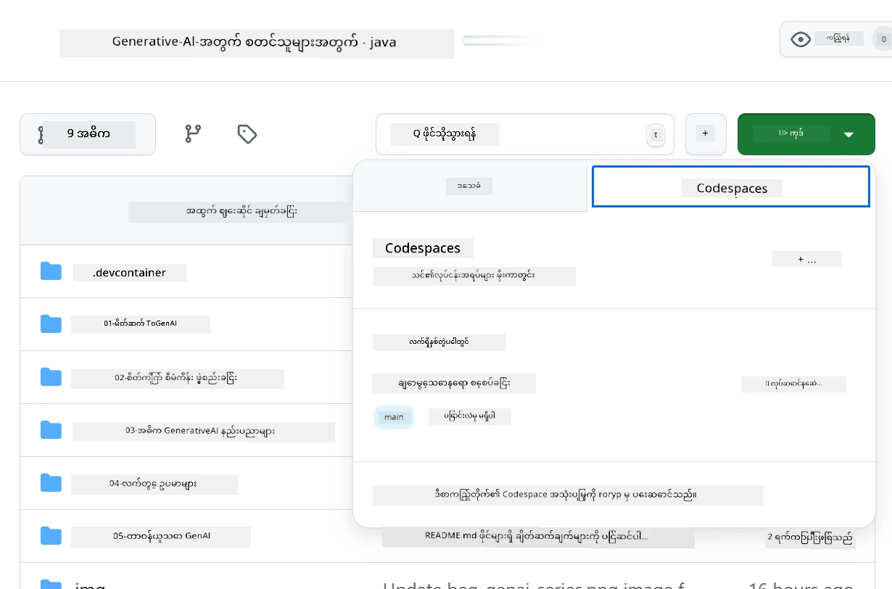
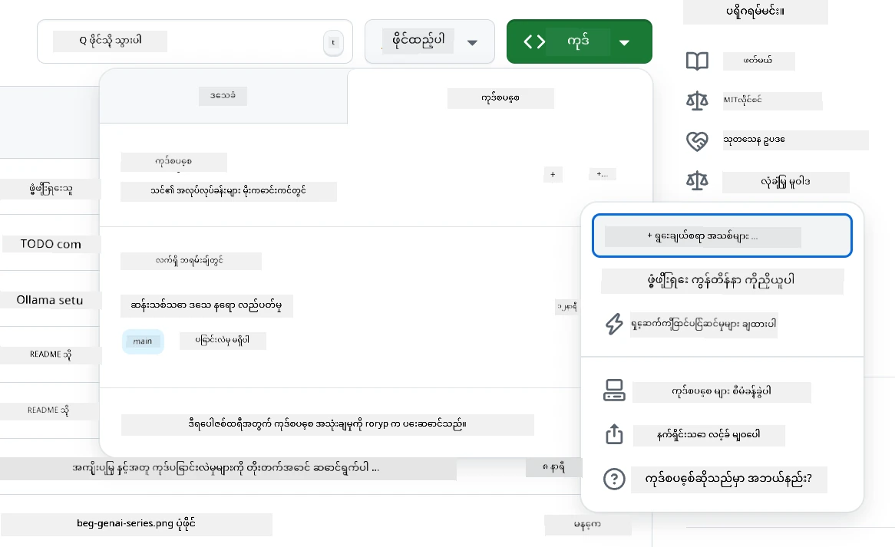
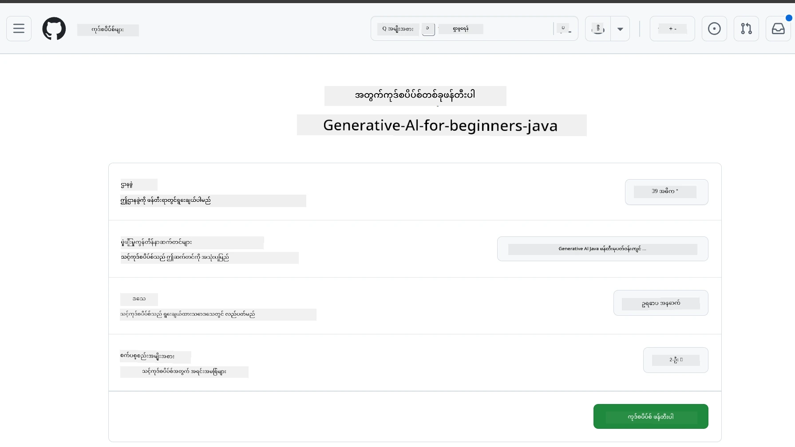
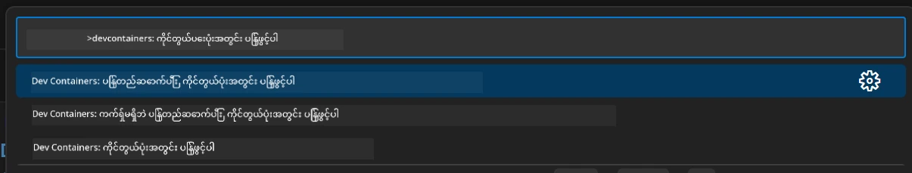
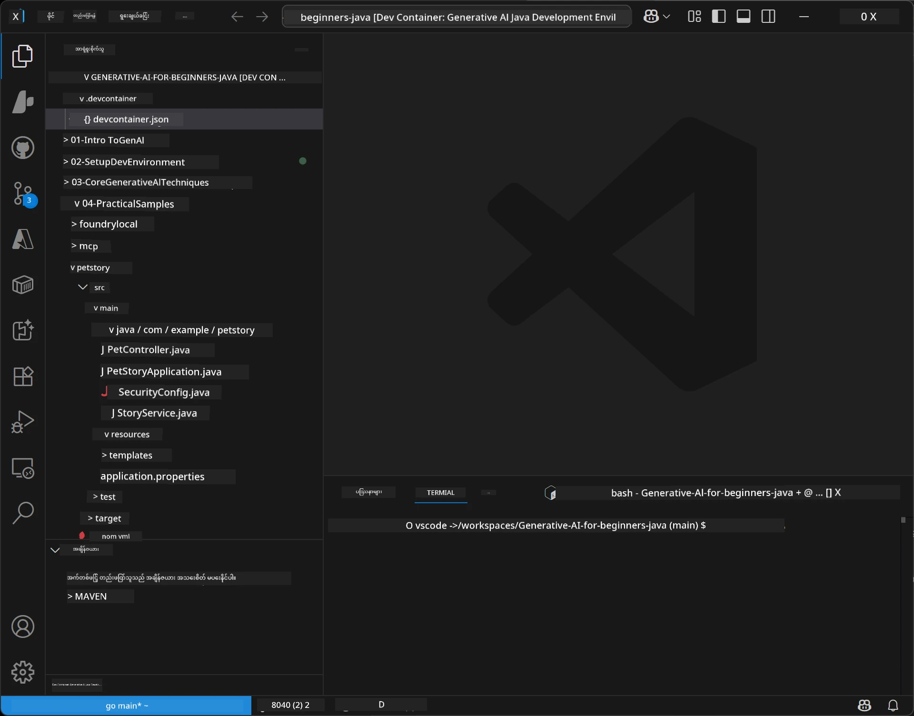
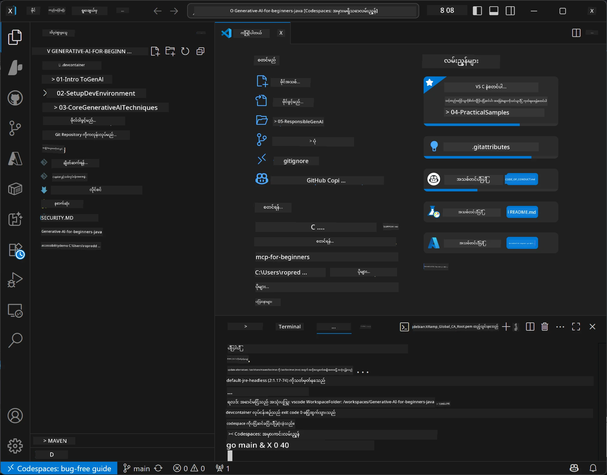

# Java အတွက် Generative AI အတွက် ဖွံ့ဖြိုးတိုးတက်မှု ပတ်ဝန်းကျင်ကို စတင်တည်ဆောက်ခြင်း

> **အမြန်အစ:** Bicep + `azd` နဲ့ သင့်ရဲ့ AI မော်ဒယ်များကို **Azure AI Foundry** ပေါ်မှာ ကုဒ်အဖြစ် မိနစ်ပိုင်းအတွင်းပေးပို့ပါ — [Azure AI Foundry စတင်တည်ဆောက်ခြင်း လမ်းညွှန်](getting-started-azure-openai.md) ကိုကြည့်ပါ။ သက်ဆိုင်ရာလက်မှတ် သက်သေများသည် **ကီးမပါဘဲဖြစ်သည်** (Microsoft Entra ID), ထို့ကြောင့် API key များကို စိုးရိမ်စ관리 ဖန်တီးရန် မလိုအပ်ပါ။

## သင်တန်းအတွင်း သင်ယူနိုင်မည့်အရာများ

- AI အတွက် Java ဖွံ့ဖြိုးတိုးတက်မှု ပတ်ဝန်းကျင်တစ်ခုကို တပ်ဆင်ခြင်း
- သင်ကြိုက်နှစ်သက်သော ဖွံ့ဖြိုးတိုးတက်မှု ပတ်ဝန်းကျင်ကို ရွေးချယ်ခြင်း (Codespaces နှင့် Cloud- ပထမဆုံး၊ ဒေသဆိုင်ရာ dev container သို့မဟုတ် ပြည့်စုံသော ဒေသဆိုင်ရာစီမံကိန်း)
- Azure AI Foundry model နှင့်ချိတ်ဆက်ပြီး သင့်စနစ်ကို စမ်းသပ်ခြင်း

## အတွင်း အကြောင်းအရာများ စာရင်း

- [သင်ယူနိုင်မည့်အရာများ](#သင်တန်းအတွင်း-သင်ယူနိုင်မည့်အရာများ)
- [အကျဉ်း](#အကျဉ်း)
- [အဆင့် ၁: သင်၏ ဖွံ့ဖြိုးတိုးတက်မှု ပတ်ဝန်းကျင်ကို စတင်တည်ဆောက်ရန်](#အဆင့်-၁-သင်၏-ဖွံ့ဖြိုးတိုးတက်မှု-ပတ်ဝန်းကျင်ကို-စတင်တည်ဆောက်ပါ)
  - [ရွေးချယ်မှု A: GitHub Codespaces (အကြံပြု)](#ရွေးချယ်မှု-a-github-codespaces-အကြံပြု)
  - [ရွေးချယ်မှု B: ဒေသဆိုင်ရာ Dev Container](#ရွေးချယ်မှု-b-ဒေသဆိုင်ရာ-dev-container)
  - [ရွေးချယ်မှု C: သင်၏ ရှိပြီးသား ဒေသဆိုင်ရာ ထည့်သွင်းမှုကို သုံးပါ](#ရွေးချယ်မှု-c-သင့်ရဲ့-ရှိပြီးသား-ဒေသဆိုင်ရာ-ထည့်သွင်းမှုကို-သုံးပါ)
- [အဆင့် ၂: Azure AI Foundry ပေးပို့ရန်](#အဆင့်-၂-azure-ai-foundry-ပေးပို့ခြင်း)
- [အဆင့် ၃: သင်၏ စနစ်ကို စမ်းသပ်ပါ](#အဆင့်-၃-သင်၏-စနစ်ကို-စမ်းသပ်ပါ)
- [ပြဿနာဖြေရှင်းမှု](#ပြဿနာဖြေရှင်းရန်)
- [အနှစ်ချုပ်](#အနှစ်ချုပ်)
- [နောက်ဆက်တွဲအဆင့်များ](#နောက်ဆက်တွဲ-အဆင့်များ)

## အကျဉ်း

ဒီအခန်းမှာ ဖွံ့ဖြိုးတိုးတက်မှု ပတ်ဝန်းကျင် တစ်ခုကို စတင်တည်ဆောက်နည်းကို သင် လမ်းညွှန်ပေးပါမယ်။ ဒီသင်တန်းအတွင်း သုံးဖို့ **Azure AI Foundry** ကိုသုံးမယ်။ နောက်ဆုံးမှာ Bicep နဲ့ Azure Developer CLI (`azd`) ကို အသုံးပြုပြီး မော်ဒယ်များကို ကုဒ်အဖြစ် ပေးပို့ပြီး၊ **keyless authentication** (Microsoft Entra ID) နဲ့ ချိတ်ဆက်ပါမယ် — API key မလိုအပ်တော့ပါ။

**ဒေသဆိုင်ရာစနစ် တပ်ဆင်ရန် လိုအပ်မှု မရှိပါ!** သင့်အနေဖြင့် GitHub Codespaces ကို အသုံးပြုနိုင်ပြီး browser မှတဆင့် အပြည့်အစုံ ဖွံ့ဖြိုးတိုးတက်မှု ပတ်ဝန်းကျင် ရနိုင်ပါတယ်၊ Foundry ကိုမှ အဲဒါမှ ပေးပို့ပါ။

ဒီသင်တန်းအတွက် **Azure AI Foundry** ကို အသုံးပြုသည်မှာ -
- **ကုဒ်အဖြစ် ပေးပို့ထားသော** — တစ်ခုတည်းသော `azd up` က အကောင့်နဲ့ မော်ဒယ် ပေးပို့မှုများကို တပ်ဆင်ပေးသည်
- **Keyless** — Azure စာရင်းဝင်မှု သို့မဟုတ် managed identity ဖြင့် သက်သေပြောင်းရန်
- **ထုတ်လုပ်မှုအဆင်သင့်** — ဒေသဆိုင်ရာနှင့် ဒေသတစ်နေရာချင်းမှာ တူညီသော ကုဒ်ကို အသုံးပြုနိုင်ခြင်း
- **တိုးတက်မှု ခြင်းများအား လွယ်ကူသော** — မော်ဒယ်များကို deployment name ကို ပြောင်းခြင်းဖြင့် အစားထိုးနိုင်၊ သင့်ကုဒ်ကို မပြောင်းလဲပဲ

> **မှတ်ချက်**: Azure AI Foundry ပေးပို့မှုများကို token အလိုက် ငွေပေးချေမှုဖြင့် အလုပ်လုပ်သည် (pay-as-you-go)။ ပေးပို့ခြင်း၊ ဒေသနှင့် သက်သာမှုအသေးစိတ်အတွက် [Azure AI Foundry setup guide](getting-started-azure-openai.md) ကို ကြည့်ပါ။


## အဆင့် ၁: သင်၏ ဖွံ့ဖြိုးတိုးတက်မှု ပတ်ဝန်းကျင်ကို စတင်တည်ဆောက်ပါ

<a name="quick-start-cloud"></a>

ဒီ Generative AI for Java သင်တန်းအတွက် လိုအပ်သော ကိရိယာများ အားလုံးပါတဲ့ preconfigured ဖွံ့ဖြိုးတိုးတက်မှု container တစ်ခုကို ရေးဆွဲပေးထားတာဖြစ်ပါတယ်။ သင်သဘောတူရာ ဖွံ့ဖြိုးတိုးတက်မှု နည်းလမ်းကို ရွေးချယ်ပါ။

### ပတ်ဝန်းကျင် တည်ဆောက်ရေး ရွေးချယ်မှုများ

#### ရွေးချယ်မှု A: GitHub Codespaces (အကြံပြု)

**၂ မိနစ်အတွင်း ကုဒ်ရေးဖွင့်နိုင်ပါပြီ - ဒေသဆိုင်ရာ စနစ် တပ်ဆင်ရန် မလိုအပ်ပါ!**

၁။ ဒီ repository ကို သင့် GitHub အကောင့်သို့ Fork လုပ်ပါ
   > **မှတ်ချက်**: အခြေခံ configuration ကို ပြင်ဆင်ချင်ရင် [Dev Container Configuration](../../../.devcontainer/devcontainer.json) ကို ကြည့်ပါ
၂။ **Code** → **Codespaces** tab → **...** → **New with options...** ကိုနှိပ်ပါ
၃။ ပုံမှန် အတိုင်းထားပြီး **Dev container configuration**: **Generative AI Java Development Environment** custom devcontainer ကို သတ်မှတ်ထားသည်ကို ရွေးပါ
၄။ **Create codespace** ကို နိပ်ပါ
၅။ ပတ်ဝန်းကျင် ပြင်ဆင်မှု ပြီးရန် ~၂ မိနစ် ခဏစောင့်ပါ
၆။ မကြာမှီတွင် [အဆင့် ၂: Azure AI Foundry များ ပေးပို့ခြင်း](#အဆင့်-၂-azure-ai-foundry-ပေးပို့ခြင်း) သို့ ရောက်ပါ








> **Codespaces ၏ အားသာချက်များ**:
> - ဒေသဆိုင်ရာ ထည့်သွင်းမှု မလိုအပ်ပါ
> - Browser ရှိ device မည်သည့်အရာတွင်မဆို အသုံးပြုနိုင်သည်
> - ကိရိယာများ နှင့် လိုအပ်သော libraries များ အပြည့်အစုံ pre-configure ပြီးရှိသည်
> - ကိုယ်ပိုင် အကောင့်များအတွက် လစဉ် ၆၀ နာရီ အခမဲ့
> - သင်ယူသူတစ်ဦးချင်းစီအတွက် တည်ငြိမ်သည့် ပတ်ဝန်းကျင်ဖြစ်ပါသည်

#### ရွေးချယ်မှု B: ဒေသဆိုင်ရာ Dev Container

**Docker နဲ့ ဒေသဆိုင်ရာ ဖွံ့ဖြိုးမှုလိုသူများအတွက်**

၁။ ဒီ repository ကို fork လုပ်ပြီး ဒေသဆိုင်ရာ စက်မှာ clone လုပ်ပါ
   > **မှတ်ချက်**: အခြေခံ configuration ကို ပြင်ဆင်ချင်ရင် [Dev Container Configuration](../../../.devcontainer/devcontainer.json) ကို ကြည့်ပါ
၂။ [Docker Desktop](https://www.docker.com/products/docker-desktop/) နှင့် [VS Code](https://code.visualstudio.com/) ကို ထည့်သွင်းပါ
၃။ VS Code မှာ [Dev Containers ရွေးချယ်မှု](https://marketplace.visualstudio.com/items?itemName=ms-vscode-remote.remote-containers) ကို တပ်ဆင်ပါ
၄။ repository folder ကို VS Code မှာ ဖွင့်ပါ
၅။ သတိပေးလာရင် **Reopen in Container** ကိုနိပ်ပါ (ဒါမှမဟုတ် `Ctrl+Shift+P` → "Dev Containers: Reopen in Container" ကိုအသုံးပြုပါ)
၆။ container ကို ဆောက်ပြီး စတင်ရန် ခဏစောင့်ပါ
၇။ [အဆင့် ၂: Azure AI Foundry ပေးပို့ခြင်း](#အဆင့်-၂-azure-ai-foundry-ပေးပို့ခြင်း) သို့ရှေ့တိုးပါ





#### ရွေးချယ်မှု C: သင့်ရဲ့ ရှိပြီးသား ဒေသဆိုင်ရာ ထည့်သွင်းမှုကို သုံးပါ

**ရှိပြီးသား Java ပတ်ဝန်းကျင်ထားရှိသူများအတွက်**

လိုအပ်ချက်များ:
- [Java 21+](https://www.oracle.com/java/technologies/javase/jdk21-archive-downloads.html) 
- [Maven 3.9+](https://maven.apache.org/download.cgi)
- [VS Code](https://code.visualstudio.com) သို့မဟုတ် သင်နှစ်သက်သော IDE

ဆက်လက်လုပ်ဆောင်ရန်:
၁။ ဒီ repository ကို လိုကယ် စက်မှာ clone လုပ်ပါ
၂။ သင့် IDE မှာ project ကိုဖွင့်ပါ
၃။ [အဆင့် ၂: Azure AI Foundry ပေးပို့ခြင်း](#အဆင့်-၂-azure-ai-foundry-ပေးပို့ခြင်း) သို့ တက်ပါ

> **အကြံပေး:** low-spec စက်ရှိလည်း VS Code ကို ဒေသဆိုင်ရာ သုံးချင်ရင် GitHub Codespaces ကိုအသုံးပြုပါ! သင့်ဒေသဆိုင်ရာ VS Code ကို cloud-hosted Codespace နဲ့ ချိတ်ဆက်နိုင်ပါတယ်။




## အဆင့် ၂: Azure AI Foundry ပေးပို့ခြင်း

သင်တန်းရဲ့ AI မော်ဒယ်များကို Azure AI Foundry ပေါ် သတ်မှတ်ထားသော ကုဒ်အဖြစ် ပေးပို့ပါ။ Repository ရဲ့ အမြစ်နေရာမှ:

```bash
cd 02-SetupDevEnvironment
azd auth login
az login
azd up
```

`azd` သည် ပတ်ဝန်းကျင်အမည်၊ subscription နှင့် ဒေသကို မေးမြန်းပြီး `gpt-5.6-luna` နှင့် `text-embedding-3-small` deployments ပါဝင်သော Azure AI Foundry အကောင့်ကို ပေးပို့ကာ example ရဲ့ `.env` ဖိုင်ထဲသို့ endpoint ကိုရေးတပ်ပေးသည် — အားလုံး **keyless** authentication နဲ့ (API key မလိုပါ)။

> **အပြည့်အစုံ လမ်းညွှန်:** မလိုအပ်သောအရာများ၊ ပို့စ်မန်နယ် (portal) ရွေးချယ်မှု၊ ဒေသလမ်းညွှန်နှင့် ကုန်ကျစရိတ်/ရှင်းလင်းမှု မှတ်စုများအတွက် [Azure AI Foundry Setup Guide](getting-started-azure-openai.md) ကို ကြည့်ပါ။

## အဆင့် ၃: သင်၏ စနစ်ကို စမ်းသပ်ပါ

Foundry model များ ပြင်ဆင်ပြီးပါက၊ example app ကို သုံးပြီး ချိတ်ဆက်မှုကို စမ်းသပ်ပါ။ နေရာမှာ [`02-SetupDevEnvironment/examples/basic-chat-azure`](../../../02-SetupDevEnvironment/examples/basic-chat-azure) မှာရှိသည်။

၁။ သင့်ဖွံ့ဖြိုးတိုးတက်မှု ပတ်ဝန်းကျင်ထဲမှ terminal ကို ဖွင့်ပါ။
၂။ example directory သို့သွားပါ:
   ```bash
   cd 02-SetupDevEnvironment/examples/basic-chat-azure
   ```
3. သင့်ဟာ log in ဖြစ်ထားတာ သေချာပေါ့ (keyless auth က token လိုအပ်တယ်):
   ```bash
   az login
   ```
   > `azd up` ကို chạy လုပ်ခဲ့လျှင် endpoint ပါတဲ့ `.env` ဖိုင်တစ်ဖိုင်ကို ယခင်က သိမ်းထားတာဖြစ်ပါတယ်။
၄။ အက်ပ်ကို chạy လုပ်ပါ:
   ```bash
   mvn clean spring-boot:run
   ```

သင်သည် `gpt-5.6-luna` model ကနေ ပြန်ကြားစာတစ်ခုကို မြင်ရမည်။

### Example ကုဒ်ကို နားလည်မှု

[basic-chat example](./examples/basic-chat-azure/README.md) သည် **Spring Boot 4.1.1** နှင့် **Spring AI 2.0.1** ကို အသုံးပြုပြီး၊ Spring AI ၏ `ChatClient` သည် official OpenAI Java SDK ကို အခြေခံပြီး Azure OpenAI **v1** endpoint ကို keyless authentication နဲ့ ချိတ်ဆက်သည်။

**ဒီကုဒ်၏လုပ်ဆောင်ချက်များ**:
- Azure AI Foundry ကို သင့် Azure စာရင်းဝင်မှု (Microsoft Entra ID) ဖြင့် ချိတ်ဆက်ခြင်း — API key မလိုပါ
- `gpt-5.6-luna` model ကို prompt တစ်ခု ပို့လိုက်သည်
- AI ပြန်ပေးပို့သည့် ပြန်ကြားစာကို လက်ခံပြီး ပြသသည်
- သင့်စနစ်အလုပ်လုပ်မှုကို မှန်ကန်စွာ သက်သေပြသည်

**အဓိက အချက်အလက်များ** ([pom.xml](../../../02-SetupDevEnvironment/examples/basic-chat-azure/pom.xml) မှ တစ်ချို့ယူယူထားသည်):
```xml
<dependency>
    <groupId>org.springframework.ai</groupId>
    <artifactId>spring-ai-starter-model-openai</artifactId>
</dependency>
<dependency>
    <groupId>com.openai</groupId>
    <artifactId>openai-java</artifactId>
</dependency>
<dependency>
    <groupId>com.azure</groupId>
    <artifactId>azure-identity</artifactId>
    <version>${azure-identity.version}</version>
</dependency>
```

POM သည် OpenAI Java **4.63.1** ကို စီမံခန့်ခွဲပြီး Azure Identity **1.18.6** ကို ရသောအတိုင်းသတ်မှတ်ထားသည်။ Spring AI 2 မှ Azure-specific starter ကို ဖယ်ရှားသော်လည်း Azure Identity သည် credential bean အတွက် ပြင်ဆင်ထားပါသည်။

**အတည်ပြုချက်** ([application.yml](../../../02-SetupDevEnvironment/examples/basic-chat-azure/src/main/resources/application.yml)):
```yaml
spring:
  ai:
    openai:
      base-url: ${AZURE_OPENAI_ENDPOINT}
      microsoft-foundry: true
      chat:
        model: ${AZURE_OPENAI_DEPLOYMENT:gpt-5.6-luna}
        reasoning-effort: none
        max-completion-tokens: 500
```

Keyless auth သည် [BasicChatApplication.java](../../../02-SetupDevEnvironment/examples/basic-chat-azure/src/main/java/com/example/BasicChatApplication.java) မှာ တိတိကျကျ ဖော်ပြထားပြီး API key မပါဘဲ သတ်မှတ်ထားသည်။ Bearer credential သည် `DefaultAzureCredential` က `https://ai.azure.com/.default` scope ဖြင့်သုံးပြီး `OpenAIClient` သည် `/openai/v1` သို့ ရည်ညွှန်းသည်။ အက်ပ်သည် client ကို Spring AI chat model သို့ ပေးပို့သောကြောင့် global `OPENAI_API_KEY` သည် Azure authentication ကို ကျော်လွန်၍ မရနိုင်ပါ။

Chat settings များသည် `spring.ai.openai.chat` အောက်တွင် တိုက်ရိုက်ရှိပြီး `options` block မပါ။ သင်ခန်းစာသည် reasoning-effort: none နှင့် ၅၀၀ token completion ကန့်သတ်ချက်ဖြင့် Chat Completions ကို ထိန်းသိမ်းထားပါသည်; temperature သို့မဟုတ် max-tokens မသတ်မှတ်ထားပါ။ API ရွေးချယ်မှု နှင့် tool-calling လမ်းညွှန်မှုများအတွက် [example configuration reference](./examples/basic-chat-azure/README.md#spring-configuration) ကို ကြည့်ပါ။

## အနှစ်ချုပ်

အထက်ပါ အဆင့်များ ပြီးမြောက်ပြီးပါက-

- Bicep + `azd` ဖြင့် Azure AI Foundry မော်ဒယ်များကို ကုဒ်အဖြစ် ပေးပို့နိုင်မည်
- သင့် Java ဖွံ့ဖြိုးတိုးတက်မှု ပတ်ဝန်းကျင်ကို စတင် ရှိမှာ ဖြစ်သည် ( Codespaces ဖြစ်မဖြစ်၊ dev container ဖြစ်မဖြစ် ဒေသဆိုင်ရာဖြစ်ပါစေ )
- Azure AI Foundry ဖြင့် keyless authentication (Microsoft Entra ID) ဖြင့် ချိတ်ဆက်နိုင်မည် — API key မလိုဘူး
- မော်ဒယ်နှင့် ပြောဆိုနိုင်သော ပုံမှန် example ကြောင့် စနစ်အားလုံး အလုပ်လုပ်လျက်ရှိ မြင်တွေ့ရမည်

## နောက်ဆက်တွဲ အဆင့်များ

[အခန်း ၃: Core Generative AI နည်းများ](../03-CoreGenerativeAITechniques/README.md)

## ပြဿနာဖြေရှင်းရန်

ပြဿနာရှိနေပါသလား? ဒါတွေက အထူးသဖြင့် ဖြစ်တတ်သည့် ပြဿနာများ နဲ့ ဖြေရှင်းနည်းများဖြစ်သည် -

- **Authentication မအောင်မြင်ပါက (401/403)?**
  - `az login` ကို ကျင့်ပါ — authentication သည် keyless ဖြစ်သဖြင့် သင် စာရင်းဝင်ထားရပါမည်
  - သင့်အကောင့်တွင် resource ပေါ်တွင် **Cognitive Services OpenAI User** မှတ်ပုံတင်ထားမှုရှိကြောင်း အတည်ပြုပါ
  - သင် လက်ရှိ ပေးပို့ပြီးလျှင် role assignment က ပြန်လည် ထိန်းချုပ်မှု ပြုလုပ်ရန် မိနစ်တစ်ခုခန့် စောင့်ပါ

- **Maven မတွေ့ပါ?**
  - dev containers/Codespaces ကိုသုံးလျှင် Maven သည် လက်ရှိတွင် ထည့်သွင်းပြီးဖြစ်သည်
  - ဒေသဆိုင်ရာ စနစ်တပ်ဆင်မှု အတွက် Java 21+ နှင့် Maven 3.9+ များ ရှိကြောင်း သေချာစစ်ဆေးပါ
  - `mvn --version` ကို အသုံးပြု ပြီး ထည့်သွင်းမှု လက်ရှိရှိမှုကို ရှာဖွေပါ

- **`azd` မတွေ့ပါ သို့မဟုတ် ပေးပို့မှု မအောင်မြင်ပါသလား?**
  - [Azure Developer CLI](https://aka.ms/azure-dev/install) ကို ထည့်သွင်းပြီး `azd auth login` ကို chạy လုပ်ပါ
  - `gpt-5.6-luna` နှင့် `text-embedding-3-small` မော်ဒယ်များရှိတဲ့ ဒေသတစ်ခု ရွေးချယ်ပါ (ဥပမာ- `eastus2`), subscription တွင် လုံလောက်တဲ့ quota ရှိရန် သတိပြုပါ
  - အချက်အလက်အပြည့်အစုံအတွက် [Azure AI Foundry setup guide](getting-started-azure-openai.md) ကို ကြည့်ပါ

- **Dev container စတင်မရပါသလား?**
  - Docker Desktop က စတင် ရှိနေမှုကို အတည်ပြုပါ (ဒေသဆိုင်ရာ ဖွံ့ဖြိုးမှုအတွက်)
  - container ကို ပြန်ဆောက်ကြည့်ပါ: `Ctrl+Shift+P` → "Dev Containers: Rebuild Container"

- **Application ကွန်ပိုင် လုပ်ရာတွင် အမှားများရှိပါသလား?**
  - သင် ဟာမှန်ကန်သော directory တွင် ရှိကြောင်း သေချာပါစေ: `02-SetupDevEnvironment/examples/basic-chat-azure`
  - စက်လှုပ်inzaနဲ့ပြန်ဆောက်ကြည့်ပါ: `mvn clean compile`

> **ကူညီလိုပါသလား?**: ပြဿနာရှိသေးပါသလား? စာရင်းတွင် issue တစ်ခု ဖွင့်ပြီး ကူညီပေးပါမည်။

---

<!-- CO-OP TRANSLATOR DISCLAIMER START -->
**ပြောကြားချက်**
ဤစာတမ်းကို AI ဘာသာပြန်ဝန်ဆောင်မှု [Co-op Translator](https://github.com/Azure/co-op-translator) အသုံးပြု၍ ဘာသာပြန်ထားပါသည်။ ကျွန်ုပ်တို့သည် တိကျမှန်ကန်မှုအတွက် ကြိုးပမ်းနေသော်လည်း၊ စက်ကိရိယာဘာသာပြန်ခြင်းများတွင် အမှားများ သို့မဟုတ် မှားယွင်းချက်များ ပါဝင်နိုင်ကြောင်း သတိပြုပါရန် လိုအပ်ပါသည်။ မူလစာတမ်းကို မူရင်းဘာသာဖြင့်သာ ယုံကြည်စိတ်ချရသော အချက်အလက်အဖြစ် သတ်မှတ်သင့်သည်။ အရေးကြီးသည့် သတင်းအချက်အလက်များအတွက် ပရော်ဖက်ရှင်နယ် လူသားဘာသာပြန်သူဝန်ဆောင်မှုကို အကြံပြုပါသည်။ ဤဘာသာပြန်ချက်ကို အသုံးပြုခြင်းမှ ဖြစ်ပေါ်လာသော နားလည်မှုကွာခြားမှုများ သို့မဟုတ် မမှန်ကန်သော အသုံးပြုမှုများအတွက် ကျွန်ုပ်တို့ တာဝန်မခံပါ။
<!-- CO-OP TRANSLATOR DISCLAIMER END -->