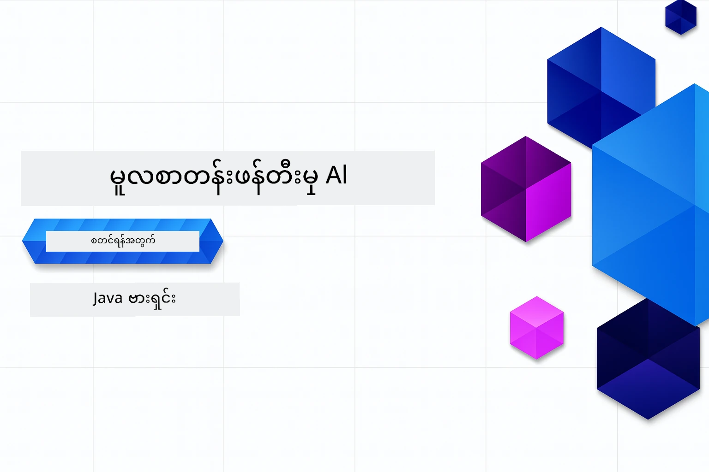

# Generative AI စတင်သင်ကြားသူများအတွက် - Java ဗားရှင်း
[](https://discord.gg/nTYy5BXMWG)



**အချိန်ပေးရန်**: ဘာသာရပ်အနှစ်ကို အွန်လိုင်းပေါ်တွင် နေရာဒေသထည့်စရာမလိုပဲ ပြီးမြောက်နိုင်သည်။ ပတ်ဝန်းကျင်ပြင်ဆင်ခြင်းသည် ၂ မိနစ်ကြာပြီး ตัวอย่างများကို ထိန်းသိမ်းစူးစမ်းရန် ၁ မှ ၃ နာရီကြား ကြာမြင့်နိုင်ပါသည်။

> **လျင်မြန်စွာ စတင်ရန်** 

1. GitHub အကောင့်သို့ ဤ repository ကို fork လုပ်ပါ
2. **Code** → **Codespaces** tab → **...** → **New with options...** ကို နှိပ်ပါ
3. မူရင်းတန်ဖိုးများကိုအသုံးပြုပါ – ဒါက ဘာသာရပ်အတွက် ဖန်တီးထားသော Development container ကို ရွေးချယ်ပေးပါလိမ့်မယ်
4. **Create codespace** ကို နှိပ်ပါ
5. ပတ်ဝန်းကျင်အသင့်ဖြစ်ရန် ~၂ မိနစ် ခန္ဓာကိုယ်ထားပါ
6. တိုက်ရိုက် [အခန်း ၂: Provision Azure AI Foundry](./02-SetupDevEnvironment/README.md#step-2-provision-azure-ai-foundry) သို့ ဝင်ကြပါ

## ဘာသာစကားများစွာအတွက် ထောက်ခံမှု

### GitHub Action မှတဆင့် ထောက်ခံပါသည် (အလိုအလျောက် နှင့် အမြဲတမ်း အပ်ဒိတ်)

<!-- CO-OP TRANSLATOR LANGUAGES TABLE START -->
[Arabic](../ar/README.md) | [Bengali](../bn/README.md) | [Bulgarian](../bg/README.md) | [Burmese (Myanmar)](./README.md) | [Chinese (Simplified)](../zh-CN/README.md) | [Chinese (Traditional, Hong Kong)](../zh-HK/README.md) | [Chinese (Traditional, Macau)](../zh-MO/README.md) | [Chinese (Traditional, Taiwan)](../zh-TW/README.md) | [Croatian](../hr/README.md) | [Czech](../cs/README.md) | [Danish](../da/README.md) | [Dutch](../nl/README.md) | [Estonian](../et/README.md) | [Finnish](../fi/README.md) | [French](../fr/README.md) | [German](../de/README.md) | [Greek](../el/README.md) | [Hebrew](../he/README.md) | [Hindi](../hi/README.md) | [Hungarian](../hu/README.md) | [Indonesian](../id/README.md) | [Italian](../it/README.md) | [Japanese](../ja/README.md) | [Kannada](../kn/README.md) | [Khmer](../km/README.md) | [Korean](../ko/README.md) | [Lithuanian](../lt/README.md) | [Malay](../ms/README.md) | [Malayalam](../ml/README.md) | [Marathi](../mr/README.md) | [Nepali](../ne/README.md) | [Nigerian Pidgin](../pcm/README.md) | [Norwegian](../no/README.md) | [Persian (Farsi)](../fa/README.md) | [Polish](../pl/README.md) | [Portuguese (Brazil)](../pt-BR/README.md) | [Portuguese (Portugal)](../pt-PT/README.md) | [Punjabi (Gurmukhi)](../pa/README.md) | [Romanian](../ro/README.md) | [Russian](../ru/README.md) | [Serbian (Cyrillic)](../sr/README.md) | [Slovak](../sk/README.md) | [Slovenian](../sl/README.md) | [Spanish](../es/README.md) | [Swahili](../sw/README.md) | [Swedish](../sv/README.md) | [Tagalog (Filipino)](../tl/README.md) | [Tamil](../ta/README.md) | [Telugu](../te/README.md) | [Thai](../th/README.md) | [Turkish](../tr/README.md) | [Ukrainian](../uk/README.md) | [Urdu](../ur/README.md) | [Vietnamese](../vi/README.md)

> **ဒေသနီးစပ်စွာ Clone လုပ်ချင်ပါသလား?**
>
> ဤ repository တွင် ဘာသာစကား ၅၀ ကျော်သွင်းထားသဖြင့် ဒေါင်းလူ အရွယ်အစား တိုးတက်မှုရှိသည်။ ဘာသာပြန်မှုများ မပါဘဲ Clone လုပ်ချင်ရင် sparse checkout ကို အသုံးပြုပါ။
>
> **Bash / macOS / Linux:**
> ```bash
> git clone --filter=blob:none --sparse https://github.com/microsoft/Generative-AI-for-beginners-java.git
> cd Generative-AI-for-beginners-java
> git sparse-checkout set --no-cone '/*' '!translations' '!translated_images'
> ```
>
> **CMD (Windows):**
> ```cmd
> git clone --filter=blob:none --sparse https://github.com/microsoft/Generative-AI-for-beginners-java.git
> cd Generative-AI-for-beginners-java
> git sparse-checkout set --no-cone "/*" "!translations" "!translated_images"
> ```
>
> ဒေါင်းအရေအတွက်ကို ပိုမြန်စေပြီး သင်တန်းပြီးမြောက်ရန် လိုအပ်သည်အားလုံး ပါဝင်သည်။
<!-- CO-OP TRANSLATOR LANGUAGES TABLE END -->

## သင်တန်းဖွဲ့စည်းမှုနှင့် သင်ယူမှုလမ်းကြောင်း

### **အခန်း ၁: Generative AI ထိပ်တန်းမိတ်ဆက်**
- **အဓိကအယူအဆများ**: အကြီးစား ဘာသာစကား မော်ဒယ်များ၊ token များ၊ embedding များနှင့် AI အင်အားများ ကို နားလည်ခြင်း
- **Java AI Ecosystem**: Spring AI နှင့် OpenAI SDK များအဘို့ အနှစ်ချုပ်
- **Model Context Protocol**: MCP ကိုမိတ်ဆက်ခြင်းနှင့် AI agent ပေါင်းသင်းဆက်ဆံမှုတွင် လုပ်ဆောင်ချက်
- **လက်တွေ့အသုံးပြုမှုများ**: chatbot များနှင့် အကြောင်းအရာဖန်တီးမှုတို့ ပါဝင်သော လက်တွေ့ကိစ္စများ
- **[→ အခန်း ၁ စတင်ရန်](./01-IntroToGenAI/README.md)**

### **အခန်း ၂: တိုးတက်မှု ပတ်ဝန်းကျင် ပြင်ဆင်ခြင်း**
- **Azure AI Foundry**: Bicep နှင့် Azure Developer CLI (azd) ဖြင့် GPT-5.6 Luna chat နှင့် text-embedding-3-small embeddings ကို ပြုလုပ်ခြင်း
- **Spring Boot 4.1.1 + Spring AI 2.0.1**: `ChatClient` ဖြင့် သင်ယူ၊ OpenAI Java SDK တရားဝင် နှင့် Azure OpenAI v1 ထောက်ပံ့သည်
- **Keyless Authentication**: Microsoft Entra ID နှင့် လုံခြုံစွာ ချိတ်ဆက်ခြင်း — API key မလိုအပ်ပါ
- **တိုးတက်မှုကိရိယာများ**: Docker container များ၊ VS Code နှင့် GitHub Codespaces  ပြင်ဆင်မှုများ
- **[→ အခန်း ၂ စတင်ရန်](./02-SetupDevEnvironment/README.md)**

### **အခန်း ၃: Generative AI အဓိကနည်းပညာများ**
- **တရားဝင် OpenAI Java SDK**: Keyless Authentication ဖြင့် Azure OpenAI v1 ကို တိုက်ရိုက်ခေါ်ယူခြင်း
- **Prompt Engineering**: AI မော်ဒယ် ထိရောက်မှု အတွက် နည်းလမ်းများ
- **Embedding နှင့် Vector ဖြင့် လုပ်ငန်းစဉ်များ**: Semantic Search နှင့် တူညီမှု တွက်ချက်ချက်ချက်
- **Retrieval-Augmented Generation (RAG)**: AI ကို ကိုယ့်ဒေတာ အရင်းအမြစ်များနှင့် ပေါင်းစပ်ခြင်း
- **Function Calling**: AI ၏ စွမ်းရည်များကို ကိရိယာများနှင့် Plugin များဖြင့် ချဲ့တင်ခြင်း
- **[→ အခန်း ၃ စတင်ရန်](./03-CoreGenerativeAITechniques/README.md)**

### **အခန်း ၄: လက်တွေ့အသုံးပြုမှုများနှင့် စီမံကိန်းများ**
- **Pet Story Generator** (`petstory/`): Azure AI Foundry ဖြင့် ဖန်တီးမှု အကြောင်းအရာ ပြုလုပ်ခြင်း
- **Foundry Local Demo** (`foundrylocal/`): OpenAI Java SDK ဖြင့် ဒေသစံ AI မော်ဒယ် ပေါင်းသင်းမှု
- **MCP Calculator Service** (`calculator/`): Spring AI ဖြင့် အခြေခံ Model Context Protocol ဖြည့်စွက်ခြင်း
- **[→ အခန်း ၄ စတင်ရန်](./04-PracticalSamples/README.md)**

### **အခန်း ၅: တာဝန်ရှိသော AI ဖွံ့ဖြိုးတိုးတက်ခြင်း**
- **Azure AI Foundry အကြောင်းအရာလုံခြုံရေး**: အတွင်းတွင် ပါဝင်သည့် အကြောင်းအရာစစ်ဆေးခြင်းနှင့် လုံခြုံမှု စနစ်များ (ခိုင်မာသောကန့်သတ်များနှင့် နူးညံ့သော ငြင်းဆန်မှုများ)
- **တာဝန်ရှိသော AI ဓါတ်ပုံပြခန်း**: လက်တွေ့မှာ ယနေ့ခေတ် AI လုံခြုံရေးစနစ်များ ဘယ်လို လုပ်ဆောင်သည်ကို ပြသခြင်း
- **အကောင်းဆုံးလမ်းညွှန်ချက်များ**: တာဝန်ရှိသော AI ဖွံ့ဖြိုးတိုးတက်မှုနှင့် ပေးပို့မှုအတွက် အစီရင်ခံချက်များ
- **[→ အခန်း ၅ စတင်ရန်](./05-ResponsibleGenAI/README.md)**

## အပိုဆောင်း အရင်းအမြစ်များ

<!-- CO-OP TRANSLATOR OTHER COURSES START -->
### LangChain
[](https://aka.ms/langchain4j-for-beginners)
[](https://aka.ms/langchainjs-for-beginners?WT.mc_id=m365-94501-dwahlin)
[](https://github.com/microsoft/langchain-for-beginners?WT.mc_id=m365-94501-dwahlin)
---

### Azure / Edge / MCP / Agents
[](https://github.com/microsoft/AZD-for-beginners?WT.mc_id=academic-105485-koreyst)
[](https://github.com/microsoft/edgeai-for-beginners?WT.mc_id=academic-105485-koreyst)
[](https://github.com/microsoft/mcp-for-beginners?WT.mc_id=academic-105485-koreyst)
[](https://github.com/microsoft/ai-agents-for-beginners?WT.mc_id=academic-105485-koreyst)

---
 
### Generative AI စီးရီး
[](https://github.com/microsoft/generative-ai-for-beginners?WT.mc_id=academic-105485-koreyst)
[-9333EA?style=for-the-badge&labelColor=E5E7EB&color=9333EA)](https://github.com/microsoft/Generative-AI-for-beginners-dotnet?WT.mc_id=academic-105485-koreyst)
[-C084FC?style=for-the-badge&labelColor=E5E7EB&color=C084FC)](https://github.com/microsoft/generative-ai-for-beginners-java?WT.mc_id=academic-105485-koreyst)
[-E879F9?style=for-the-badge&labelColor=E5E7EB&color=E879F9)](https://github.com/microsoft/generative-ai-with-javascript?WT.mc_id=academic-105485-koreyst)

---
 
### အဓိက သင်ယူမှုများ
[](https://aka.ms/ml-beginners?WT.mc_id=academic-105485-koreyst)
[](https://aka.ms/datascience-beginners?WT.mc_id=academic-105485-koreyst)
[](https://aka.ms/ai-beginners?WT.mc_id=academic-105485-koreyst)
[](https://github.com/microsoft/Security-101?WT.mc_id=academic-96948-sayoung)
[](https://aka.ms/webdev-beginners?WT.mc_id=academic-105485-koreyst)
[](https://aka.ms/iot-beginners?WT.mc_id=academic-105485-koreyst)
[](https://github.com/microsoft/xr-development-for-beginners?WT.mc_id=academic-105485-koreyst)

---
 
### Copilot စီးရီး
[](https://aka.ms/GitHubCopilotAI?WT.mc_id=academic-105485-koreyst)
[](https://github.com/microsoft/mastering-github-copilot-for-dotnet-csharp-developers?WT.mc_id=academic-105485-koreyst)
[](https://github.com/microsoft/CopilotAdventures?WT.mc_id=academic-105485-koreyst)
<!-- CO-OP TRANSLATOR OTHER COURSES END -->

## အကူအညီရယူခြင်း

AI applications တည်ဆောက်ရာတွင် ပြဿနာမျိုးစုံရှိပါက MCP အကြောင်း မေးမြန်းလိုပါက ဒေါ်ကျောင်းသူများနှင့် အတွေ့အကြုံရှင်များနှင့် ဆွေးနွေးနိုင်ပါသည်။ မေးခွန်းများ ပေးပို့နိုင်ပြီး သိမွတ်မှုများ လွတ်လပ်စွာ မျှဝေသည့် ကွန်မြူနတီဖြစ်ပါသည်။

[](https://discord.gg/nTYy5BXMWG)

ထုတ်ကုန်အကြောင်း သဘောထားသို့မဟုတ် ပြဿနာများရှိခဲ့ပါက အောက်ပါလင့်ခ်ကြီးသို့ သွားပါ

[](https://aka.ms/foundry/forum)

---

<!-- CO-OP TRANSLATOR DISCLAIMER START -->
**ပြောကြားချက်**
ဤစာတမ်းကို AI ဘာသာပြန်ဝန်ဆောင်မှု [Co-op Translator](https://github.com/Azure/co-op-translator) အသုံးပြု၍ ဘာသာပြန်ထားပါသည်။ ကျွန်ုပ်တို့သည် တိကျမှန်ကန်မှုအတွက် ကြိုးပမ်းနေသော်လည်း၊ စက်ကိရိယာဘာသာပြန်ခြင်းများတွင် အမှားများ သို့မဟုတ် မှားယွင်းချက်များ ပါဝင်နိုင်ကြောင်း သတိပြုပါရန် လိုအပ်ပါသည်။ မူလစာတမ်းကို မူရင်းဘာသာဖြင့်သာ ယုံကြည်စိတ်ချရသော အချက်အလက်အဖြစ် သတ်မှတ်သင့်သည်။ အရေးကြီးသည့် သတင်းအချက်အလက်များအတွက် ပရော်ဖက်ရှင်နယ် လူသားဘာသာပြန်သူဝန်ဆောင်မှုကို အကြံပြုပါသည်။ ဤဘာသာပြန်ချက်ကို အသုံးပြုခြင်းမှ ဖြစ်ပေါ်လာသော နားလည်မှုကွာခြားမှုများ သို့မဟုတ် မမှန်ကန်သော အသုံးပြုမှုများအတွက် ကျွန်ုပ်တို့ တာဝန်မခံပါ။
<!-- CO-OP TRANSLATOR DISCLAIMER END -->