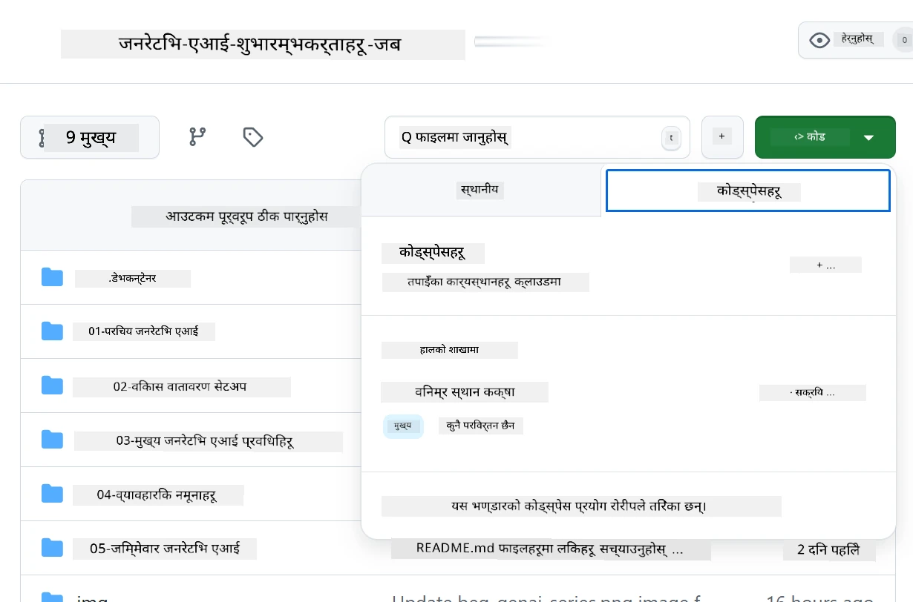
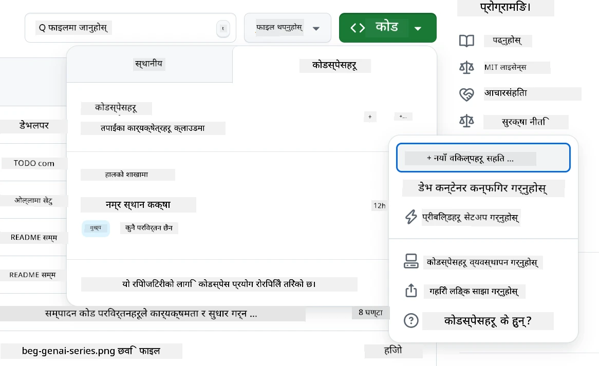
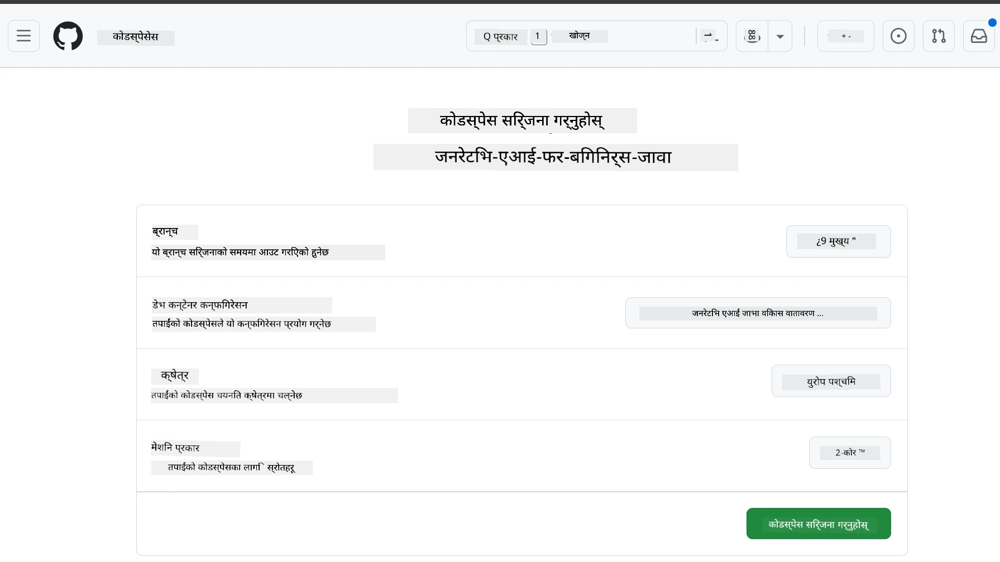
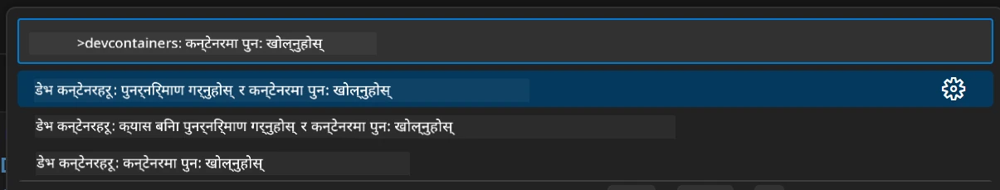
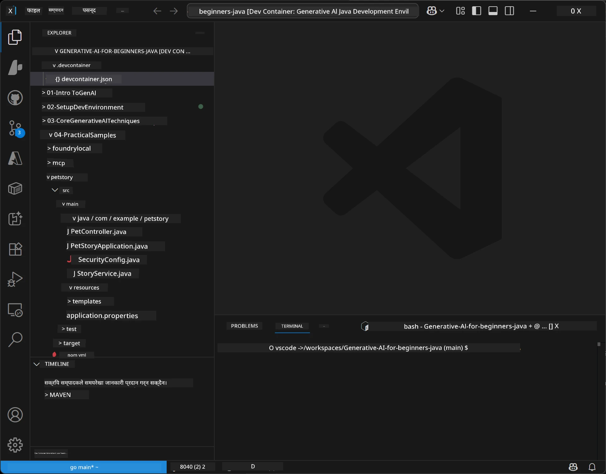
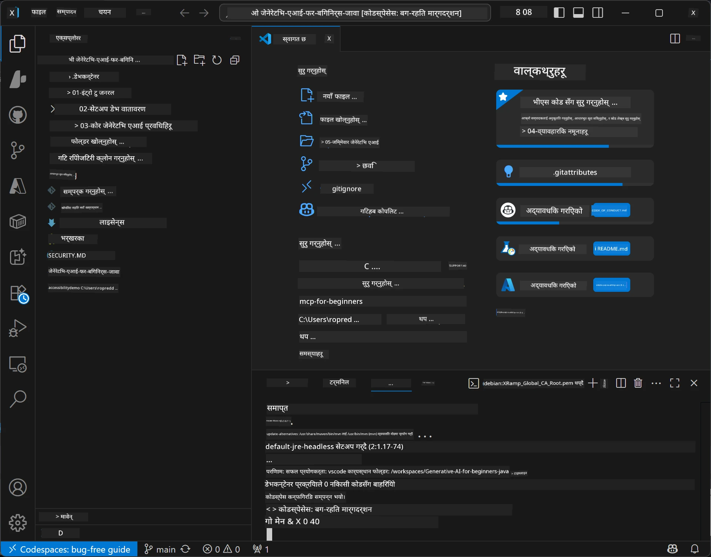

# Java को लागि जेनेरेटिभ AI को विकास वातावरण स्थापना

> **छिटो सुरु गर्न:** Bicep + `azd` को साथमा तपाईंका AI मोडेलहरूलाई केहि मिनेटमै कोडको रूपमा **Azure AI Foundry** मा प्रावधान गर्नुहोस् — हेर्नुहोस् [Azure AI Foundry सेटअप गाइड](getting-started-azure-openai.md)। प्रमाणीकरण **कीलेस** (Microsoft Entra ID) छ, त्यसैले कुनै API कुञ्जीहरू व्यवस्थापन गर्न हुँदैन।

## तपाईंले के सिक्नुहुनेछ

- AI अनुप्रयोगहरूको लागि Java विकास वातावरण सेटअप गर्नुहोस्
- आफ्नो मनोनुकूल विकास वातावरण छनौट र कन्फिगर गर्नुहोस् (Codespaces सहित क्लाउड-प्रथम, स्थानीय dev container, वा पूर्ण स्थानीय सेटअप)
- Azure AI Foundry मोडेलसँग जडान गरेर आफ्नो सेटअप परीक्षण गर्नुहोस्

## सामग्री तालिका

- [तपाईंले के सिक्नुहुनेछ](#तपाईंले-के-सिक्नुहुनेछ)
- [परिचय](#परिचय)
- [चरण 1: विकास वातावरण सेटअप गर्नुहोस्](#चरण-1-विकास-वातावरण-सेटअप-गर्नुहोस्)
  - [विकल्प A: GitHub Codespaces (सिफारिश गरिएको)](#विकल्प-a-github-codespaces-सिफारिश-गरिएको)
  - [विकल्प B: स्थानीय dev container](#विकल्प-b-स्थानीय-dev-container)
  - [विकल्प C: तपाईंको अवस्थित स्थानीय स्थापना प्रयोग गर्नुहोस्](#विकल्प-c-तपाईंको-अवस्थित-स्थानीय-स्थापना-प्रयोग-गर्नुहोस्)
- [चरण 2: Azure AI Foundry प्रोभिजन गर्नुहोस्](#चरण-2-azure-ai-foundry-प्रोभिजन-गर्नुहोस्)
- [चरण 3: आफ्नो सेटअप परीक्षण गर्नुहोस्](#चरण-3-आफ्नो-सेटअप-परीक्षण-गर्नुहोस्)
- [समस्या समाधान](#समस्या-समाधान)
- [सारांश](#सारांश)
- [अर्को कदमहरू](#अर्को-कदमहरू)

## परिचय

यो अध्यायले तपाईंलाई विकास वातावरण सेटअप गर्ने क्रममा मार्गनिर्देशन गर्नेछ। हामी यस कोर्समा मोडेलहरूका लागि **Azure AI Foundry** प्रयोग गर्नेछौं। तपाईंले मोडेलहरूलाई Bicep र Azure Developer CLI (`azd`) को साथ कोडको रूपमा प्रावधान गर्नुहुनेछ, त्यसपछि **कीलेस प्रमाणीकरण** (Microsoft Entra ID) द्वारा जडान गर्नुहोस् — कुनै API कुञ्जीहरू प्रतिलिपि वा चुहावट हुँदैन।

**कुनै स्थानीय सेटअप आवश्यक छैन!** तपाईं GitHub Codespaces प्रयोग गर्न सक्नुहुन्छ, जुन तपाईंको ब्राउजरमा पूर्ण विकास वातावरण प्रदान गर्दछ, र त्यहाँबाट Foundry प्रावधान गर्न सक्नुहुन्छ।

हामी यस कोर्सका लागि **Azure AI Foundry** प्रयोग गर्छौं किनकि यो:
- **कोडको रूपमा प्रावधान गरिएको** — एउटा `azd up` ले खाता र मोडेल प्रावधान गर्नेछ
- **कीलेस** — तपाईंको Azure साइन-इन वा व्यवस्थापन गरिएको पहिचानको साथ प्रमाणीकरण हुन्छ
- **उत्पादन-तयार** — एउटै कोडले स्थानीय र Azure दुबैमा चल्छ
- **लचीला** — कोड बदले बिना प्रावधान नाम परिवर्तन गरेर मोडेलहरू स्विच गर्न सकिन्छ

> **सूचना**: Azure AI Foundry प्रावधानहरु टोकन अनुसार बिल गरिन्छ (pay-as-you-go)। प्रावधान, क्षेत्र, र लागत विवरणहरूको लागि [Azure AI Foundry सेटअप गाइड](getting-started-azure-openai.md) हेर्नुहोस्।


## चरण 1: विकास वातावरण सेटअप गर्नुहोस्

<a name="quick-start-cloud"></a>

हामीले द्रुत सेटअपका लागि पूर्व-कन्फिगर गरिएको विकास कन्टेनर तयार गरेका छौं जसले यो जेनेरेटिभ AI for Java कोर्सका लागि आवश्यक सबै उपकरणहरू सुनिश्चित गर्दछ। आफ्नो मनपर्ने विकास विधि छनौट गर्नुहोस्:

### विकास वातावरण सेटअप विकल्पहरू:

#### विकल्प A: GitHub Codespaces (सिफारिश गरिएको)

**२ मिनेट भित्र कोडिङ सुरु गर्नुहोस् - कुनै स्थानीय सेटअप आवश्यक छैन!**

1. यो रिपोजिटरीलाई तपाईंको GitHub खातामा फोर्क गर्नुहोस्
   > **सूचना**: यदि तपाईं आधारभूत कन्फिग परिवर्तन गर्न चाहनुहुन्छ भने [Dev Container Configuration](../../../.devcontainer/devcontainer.json) हेर्नुहोस्
2. क्लिक गर्नुहोस् **Code** → **Codespaces** ट्याब → **...** → **New with options...**
3. पूर्वनिर्धारित विकल्पहरू प्रयोग गर्नुहोस् – यसले यस कोर्सका लागि बनाइएको **Generative AI Java Development Environment** कस्टम devcontainer चयन गर्नेछ
4. क्लिक गर्नुहोस् **Create codespace**
5. वातावरण तयार हुन लगभग २ मिनेट कुर गर्नुहोस्
6. अगाडि बढ्नुहोस् [चरण 2: Azure AI Foundry प्रोभिजन गर्नुहोस्](#चरण-2-azure-ai-foundry-प्रोभिजन-गर्नुहोस्)








> **Codespaces का फाइदाहरू**:
> - कुनै स्थानीय स्थापना आवश्यक छैन
> - कुनै पनि ब्राउजर भएको उपकरणमा काम गर्छ
> - सबै उपकरण र डिपेन्डेन्सीसँग पूर्व-कन्फिगर गरिएको
> - व्यक्तिगत खाताहरूका लागि महिना ६० घण्टा निःशुल्क
> - सबै विद्यार्थीहरूका लागि स्थिर वातावरण

#### विकल्प B: स्थानीय Dev Container

**Docker सँग स्थानीय विकास गर्न मन पराउने विकासकर्ताहरूका लागि**

1. यो रिपोजिटरीलाई फोर्क र क्लोन गर्नुहोस् आफ्नो स्थानीय मेसिनमा
   > **सूचना**: यदि तपाईं आधारभूत कन्फिग परिवर्तन गर्न चाहनुहुन्छ भने [Dev Container Configuration](../../../.devcontainer/devcontainer.json) हेर्नुहोस्
2. [Docker Desktop](https://www.docker.com/products/docker-desktop/) र [VS Code](https://code.visualstudio.com/) स्थापना गर्नुहोस्
3. VS Code मा [Dev Containers विस्तार](https://marketplace.visualstudio.com/items?itemName=ms-vscode-remote.remote-containers) स्थापना गर्नुहोस्
4. VS Code मा रिपोजिटरी फोल्डर खोल्नुहोस्
5. पॉपअप आएपछि, क्लिक गर्नुहोस् **Reopen in Container** (वा `Ctrl+Shift+P` → "Dev Containers: Reopen in Container" प्रयोग गर्नुहोस्)
6. कन्टेनर बनि र सुरु हुन पर्खनुहोस्
7. अगाडि बढ्नुहोस् [चरण 2: Azure AI Foundry प्रोभिजन गर्नुहोस्](#चरण-2-azure-ai-foundry-प्रोभिजन-गर्नुहोस्)





#### विकल्प C: तपाईंको अवस्थित स्थानीय स्थापना प्रयोग गर्नुहोस्

**पहिलेबाट भएको Java वातावरणका लागि विकासकर्ताहरू**

पूर्वआवश्यकताहरू:
- [Java 21+](https://www.oracle.com/java/technologies/javase/jdk21-archive-downloads.html) 
- [Maven 3.9+](https://maven.apache.org/download.cgi)
- [VS Code](https://code.visualstudio.com) वा तपाईंको मनपर्ने IDE

चरणहरू:
1. यो रिपोजिटरीलाई स्थानीय मेसिनमा क्लोन गर्नुहोस्
2. तपाईंको IDE मा परियोजना खोल्नुहोस्
3. अगाडि बढ्नुहोस् [चरण 2: Azure AI Foundry प्रोभिजन गर्नुहोस्](#चरण-2-azure-ai-foundry-प्रोभिजन-गर्नुहोस्)

> **प्रो टिप**: तपाईंको मेसिन कम स्पेक रहेको भए र त्यहिँ स्थानीय VS Code प्रयोग गर्न चाहानुहुन्छ भने GitHub Codespaces प्रयोग गर्नुहोस्! तपाईं आफ्नो स्थानीय VS Code लाई क्लाउड-होस्ट गरिएको Codespace सँग जडान गर्न सक्नुहुन्छ.




## चरण 2: Azure AI Foundry प्रोभिजन गर्नुहोस्

कोर्सका AI मोडेलहरूलाई Azure AI Foundry मा कोडको रूपमा प्रावधान गर्नुहोस्। रिपोजिटरी रुटबाट:

```bash
cd 02-SetupDevEnvironment
azd auth login
az login
azd up
```

`azd` ले वातावरण नाम, सदस्यता, र क्षेत्रको लागि सोध्छ, `gpt-5.6-luna` र `text-embedding-3-small` प्रावधान गर्ने Azure AI Foundry खाता सिर्जना गर्छ, र `.env` फाइलमा अन्तिम बिन्दु लेख्छ - सबै **कीलेस** प्रमाणीकरण (कुनै API कुञ्जी छैन) संग।

> **पूर्ण हिँडडुल:** पूर्वआवश्यकता, म्यानुअल (पोर्टल) विकल्प, क्षेत्र मार्गनिर्देशन, र लागत/सफा गर्ने नोटहरूका लागि [Azure AI Foundry सेटअप गाइड](getting-started-azure-openai.md) हेर्नुहोस्।

## चरण 3: आफ्नो सेटअप परीक्षण गर्नुहोस्

Foundry मोडेलहरू प्रावधान भइसकेपछि, [`02-SetupDevEnvironment/examples/basic-chat-azure`](../../../02-SetupDevEnvironment/examples/basic-chat-azure) मा रहेको उदाहरण अनुप्रयोगसँग जडान परीक्षण गर्नुहोस्।

1. विकास वातावरणमा टर्मिनल खोल्नुहोस्।
2. उदाहरण फोल्डरमा जानुहोस्:
   ```bash
   cd 02-SetupDevEnvironment/examples/basic-chat-azure
   ```
3. सुनिश्चित गर्नुहोस् कि तपाईँ साइन इन हुनुहुन्छ (कीलेस प्रमाणीकरणका लागि टोकन आवश्यक):
   ```bash
   az login
   ```
   > यदि तपाईंले `azd up` चलाउनु भयो भने, तपाईंको अन्तिम बिन्दु `.env` फाइलमा पहिले नै लेखिएको हुन्छ।
4. अनुप्रयोग चलाउनुहोस्:
   ```bash
   mvn clean spring-boot:run
   ```

तपाईंले `gpt-5.6-luna` मोडेलबाट प्रतिक्रिया देख्नुपर्छ।

### उदाहरण कोड बुझ्नुहोस्

[basic-chat उदाहरण](./examples/basic-chat-azure/README.md) ले **Spring Boot 4.1.1** र **Spring AI 2.0.1** प्रयोग गर्छ। Spring AI को `ChatClient` आधिकारिक OpenAI Java SDK द्वारा समर्थित छ, Azure OpenAI **v1** अन्तिम बिन्दुमा कीलेस प्रमाणीकरणको साथ जडान हुन्छ।

**यो कोडले के गर्छ:**
- तपाईंको Azure साइन-इन (Microsoft Entra ID) द्वारा Azure AI Foundry सँग जडान हुन्छ — कुनै API कुञ्जी छैन
- `gpt-5.6-luna` मोडेलमा एक प्रॉम्प्ट पठाउँछ
- AI को प्रतिक्रिया प्राप्त गरी देखाउँछ
- तपाईंको सेटअप सहि रूपमा काम गरिरहेको छ कि छैन भेरिफाई गर्छ

**मुख्य निर्भरताहरू** ([pom.xml](../../../02-SetupDevEnvironment/examples/basic-chat-azure/pom.xml) बाट अंश):
```xml
<dependency>
    <groupId>org.springframework.ai</groupId>
    <artifactId>spring-ai-starter-model-openai</artifactId>
</dependency>
<dependency>
    <groupId>com.openai</groupId>
    <artifactId>openai-java</artifactId>
</dependency>
<dependency>
    <groupId>com.azure</groupId>
    <artifactId>azure-identity</artifactId>
    <version>${azure-identity.version}</version>
</dependency>
```

POM ले OpenAI Java **4.63.1** व्यवस्थापन गर्छ र Azure Identity **1.18.6** पृथक रुपमा सेट गर्छ। Spring AI 2 ले Azure-विशेष स्टार्ट संयन्त्र हटायो; यद्यपि, Azure Identity अझै पनि क्रेडेन्सियल बिनको लागि आवश्यक छ।

**कन्फिगरेसन** ([application.yml](../../../02-SetupDevEnvironment/examples/basic-chat-azure/src/main/resources/application.yml)):
```yaml
spring:
  ai:
    openai:
      base-url: ${AZURE_OPENAI_ENDPOINT}
      microsoft-foundry: true
      chat:
        model: ${AZURE_OPENAI_DEPLOYMENT:gpt-5.6-luna}
        reasoning-effort: none
        max-completion-tokens: 500
```

Keyless प्रमाणीकरण स्पष्ट रूपमा [BasicChatApplication.java](../../../02-SetupDevEnvironment/examples/basic-chat-azure/src/main/java/com/example/BasicChatApplication.java) मा कन्फिगर गरिएको छ, अनुपस्थित API कुञ्जीबाट अनुमान गरिएको छैन। यसको बीयर क्रेडेन्सियलले `DefaultAzureCredential` प्रयोग गर्छ `https://ai.azure.com/.default` स्कोप सहित, र `OpenAIClient` ले `/openai/v1` लक्षित गर्छ। अनुप्रयोगले त्यो क्लाइन्ट Spring AI को च्याट मोडललाई प्रदान गर्दछ, जसले गर्दा ग्लोबल `OPENAI_API_KEY` ले Azure प्रमाणीकरणलाई ओभरराइड गर्न सक्दैन।

च्याट सेटिङहरू सिधा `spring.ai.openai.chat` अन्तर्गत छन्, कुनै `options` ब्लक छैन। पाठले `reasoning-effort: none` सहितको Chat Completions र ५०० टोकन सीमासहित राख्छ; `temperature` वा `max-tokens` सेट गर्दैन। API छनोट र टूल कल गर्ने मार्गनिर्देशनका लागि [उदाहरणको कन्फिगरेसन संदर्भ](./examples/basic-chat-azure/README.md#spring-configuration) हेर्नुहोस्।

## सारांश

माथि दिइएका चरणहरू पूरा गरेपछि, तपाईंले:

- Bicep + `azd` संग Azure AI Foundry मोडेलहरू कोडको रूपमा प्रावधान गर्नुभयो
- तपाईंको Java विकास वातावरण सुरु गर्नुभयो (Codespaces, dev containers, वा स्थानीय जुनसुकै)
- कीलेस प्रमाणीकरण (Microsoft Entra ID) संग Azure AI Foundry सँग जडान गर्नुभयो — कुनै API कुञ्जी छैन
- आफ्नो मोडेलसँग कुरा गर्ने सजिलो उदाहरणमार्फत सबै काम Test गर्नुभयो

## अर्को कदमहरू

[अध्याय 3: कोर जेनेरेटिभ AI प्रविधिहरू](../03-CoreGenerativeAITechniques/README.md)

## समस्या समाधान

समस्या छ? यहाँ सामान्य समस्या र समाधानहरू छन्:

- **प्रमाणीकरण असफल (401/403)?** 
  - `az login` चलाउनुहोस् — प्रमाणीकरण कीलेस छ, त्यसैले तपाईंले साइन इन हुनु पर्छ
  - तपाईंको खाताले स्रोतमा **Cognitive Services OpenAI User** भूमिका पाएको छ भनी सुनिश्चित गर्नुहोस्
  - यदि तपाईंले अहिले प्रोभिजन गर्नु भयो भने, भूमिका असाइनमेन्ट फैलिन एक मिनेट कुर्नुहोस्

- **Maven भेटिएन?** 
  - यदि dev containers/Codespaces प्रयोग गर्दै हुनुहुन्छ भने, Maven अघिसंस्थापित हुन्छ
  - स्थानीय सेटअपका लागि, Java 21+ र Maven 3.9+ स्थापित छ भनी सुनिश्चित गर्नुहोस्
  - स्थापना पुष्टि गर्न `mvn --version` प्रयास गर्नुहोस्

- **`azd` भेटिएन वा प्रावधान असफल?** 
  - [Azure Developer CLI](https://aka.ms/azure-dev/install) स्थापना गर्नुहोस् र `azd auth login` चलाउनुहोस्
  - `gpt-5.6-luna` र `text-embedding-3-small` उपलब्ध क्षेत्र (जस्तै `eastus2`) छान्नुहोस्, र तपाईँले छनौट गरेको सदस्यतामा उपयुक्त कोटा छ भनी सुनिश्चित गर्नुहोस्
  - विवरणका लागि [Azure AI Foundry सेटअप गाइड](getting-started-azure-openai.md) हेर्नुहोस्

- **Dev container सुरु हुँदैन्?** 
  - Docker Desktop चलिरहेको छ भनी सुनिश्चित गर्नुहोस् (स्थानीय विकासको लागि)
  - कन्टेनर पुनःनिर्माण गर्न प्रयास गर्नुहोस्: `Ctrl+Shift+P` → "Dev Containers: Rebuild Container"

- **अनुप्रयोग कम्पाइल त्रुटिहरू?**
  - साँचो निर्देशिकामा हुनुहोस्: `02-SetupDevEnvironment/examples/basic-chat-azure`
  - सफा र पुनर्निर्माण प्रयास गर्नुहोस्: `mvn clean compile`

> **मद्दत चाहिन्छ?**: अझै समस्या छ? रिपोजिटरीमा_issue_ खोल्नुहोस् र हामी तपाईंलाई सहयोग गर्नेछौं।

---

<!-- CO-OP TRANSLATOR DISCLAIMER START -->
**अस्वीकरण**:
यो दस्तावेज़ AI अनुवाद सेवा [Co-op Translator](https://github.com/Azure/co-op-translator) प्रयोग गरेर अनुवाद गरिएको हो। हामी सही हुन प्रयास गर्छौं, तर कृपया जानकार हुनुस् कि स्वचालित अनुवादमा त्रुटिहरू वा अशुद्धताहरू हुन सक्छन्। मूल दस्तावेज़ यसको मूल भाषामा आधिकारिक स्रोत मानिनुपर्छ। महत्वपूर्ण जानकारीका लागि व्यावसायिक मानव अनुवाद सिफारिस गरिन्छ। यस अनुवादको प्रयोगबाट उत्पन्न कुनै पनि गलत बुझाइ वा त्रुटिको लागि हामी जिम्मेवार छैनौं।
<!-- CO-OP TRANSLATOR DISCLAIMER END -->