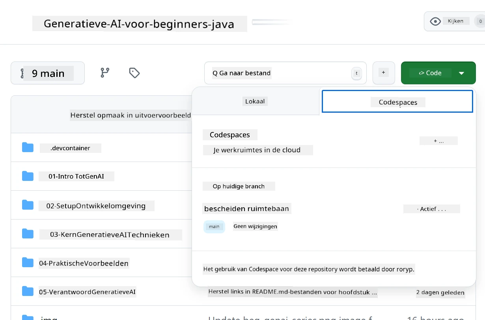
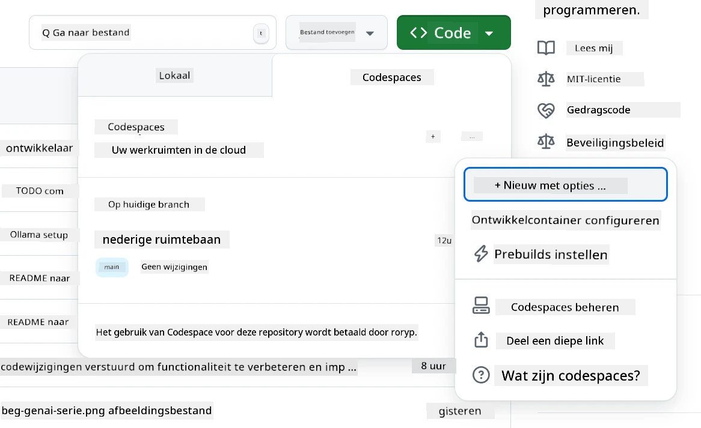
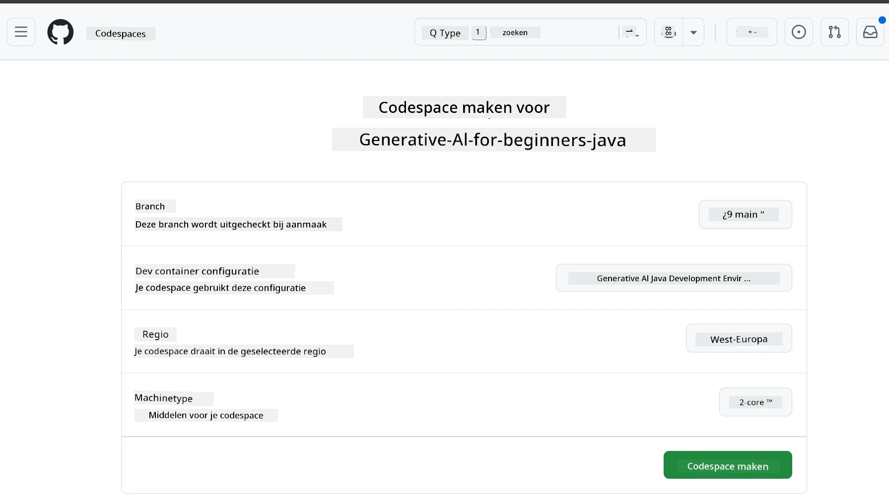
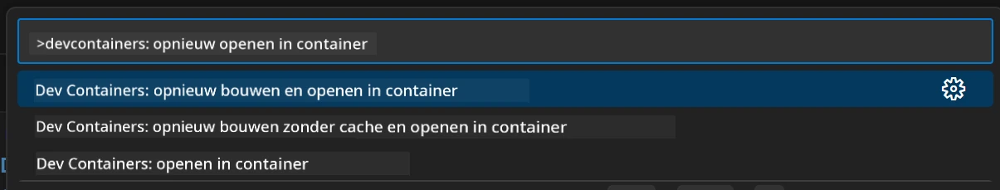
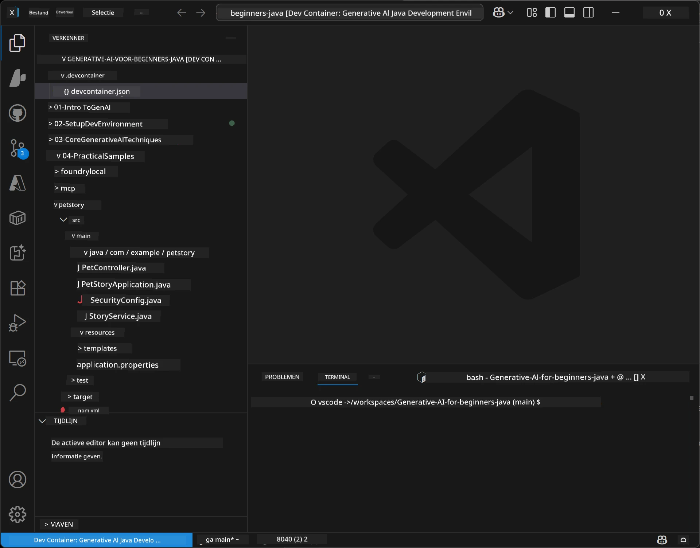
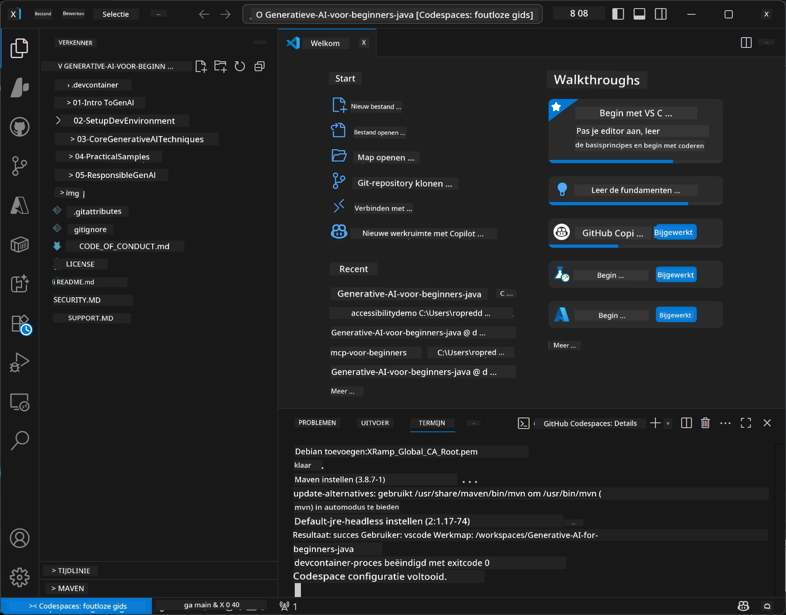

# Het Ontwikkelomgeving Instellen voor Generative AI voor Java

> **Snel aan de slag:** Voorzie je AI-modellen op **Azure AI Foundry** als code met Bicep + `azd` in een paar minuten — zie de [Azure AI Foundry Setup Guide](getting-started-azure-openai.md). Authenticatie is **sleutelloos** (Microsoft Entra ID), dus er zijn geen API-sleutels om te beheren.

## Wat Je Zal Leren

- Stel een Java-ontwikkelomgeving in voor AI-toepassingen
- Kies en configureer je favoriete ontwikkelomgeving (cloud-first met Codespaces, lokale ontwikkelcontainer, of volledige lokale installatie)
- Test je setup door verbinding te maken met een Azure AI Foundry-model

## Inhoudsopgave

- [Wat Je Zal Leren](#wat-je-zal-leren)
- [Introductie](#introductie)
- [Stap 1: Stel je ontwikkelomgeving in](#stap-1-stel-je-ontwikkelomgeving-in)
  - [Optie A: GitHub Codespaces (Aanbevolen)](#optie-a-github-codespaces-aanbevolen)
  - [Optie B: Lokale ontwikkelcontainer](#optie-b-lokale-ontwikkelcontainer)
  - [Optie C: Gebruik je bestaande lokale installatie](#optie-c-gebruik-je-bestaande-lokale-installatie)
- [Stap 2: Voorzie Azure AI Foundry](#stap-2-voorzie-azure-ai-foundry)
- [Stap 3: Test je setup](#stap-3-test-je-setup)
- [Probleemoplossing](#probleemoplossing)
- [Samenvatting](#samenvatting)
- [Volgende stappen](#volgende-stappen)

## Introductie

Dit hoofdstuk begeleidt je bij het opzetten van een ontwikkelomgeving. We gebruiken **Azure AI Foundry** voor de modellen gedurende deze cursus. Je voorziet de modellen als code met Bicep en de Azure Developer CLI (`azd`), en verbindt vervolgens met **sleutelloze authenticatie** (Microsoft Entra ID) — geen API-sleutels om te kopiëren of lekken.

**Geen lokale installatie nodig!** Je kunt GitHub Codespaces gebruiken, dat een volledige ontwikkelomgeving in je browser biedt, en Foundry van daaruit voorzien.

We gebruiken **Azure AI Foundry** voor deze cursus omdat het:
- **Als code geprovisioneerd wordt** — één `azd up` zet het account en model-uitrol neer
- **Sleutelloos** — authenticatie met je Azure-aanmelding of een beheerde identiteit
- **Productieklaar** — dezelfde code draait lokaal en in Azure
- **Flexibel** — wissel modellen door de naam van een uitrol te veranderen, niet je code

> **Opmerking**: Azure AI Foundry-uitrol wordt per token gefactureerd (pay-as-you-go). Zie de [Azure AI Foundry setup guide](getting-started-azure-openai.md) voor details over provisioning, regio en kosten.


## Stap 1: Stel je ontwikkelomgeving in

<a name="quick-start-cloud"></a>

We hebben een vooraf geconfigureerde ontwikkelcontainer gemaakt om de setup-tijd te minimaliseren en ervoor te zorgen dat je alle benodigde tools hebt voor deze Generative AI voor Java-cursus. Kies je favoriete ontwikkelaanpak:

### Opties voor het opzetten van de omgeving:

#### Optie A: GitHub Codespaces (Aanbevolen)

**Begin binnen 2 minuten met coderen – geen lokale installatie nodig!**

1. Fork deze repository naar je GitHub-account
   > **Opmerking**: Wil je de basisconfiguratie aanpassen, kijk dan naar de [Dev Container Configuration](../../../.devcontainer/devcontainer.json)
2. Klik op **Code** → tab **Codespaces** → **...** → **Nieuw met opties...**
3. Gebruik de standaardinstellingen – dit selecteert de **Dev container configuratie**: **Generative AI Java Development Environment** aangepaste devcontainer voor deze cursus
4. Klik op **Codespace aanmaken**
5. Wacht ~2 minuten totdat de omgeving klaar is
6. Ga door naar [Stap 2: Voorzie Azure AI Foundry](#stap-2-voorzie-azure-ai-foundry)








> **Voordelen van Codespaces**:
> - Geen lokale installatie vereist
> - Werkt op elk apparaat met een browser
> - Vooraf geconfigureerd met alle tools en afhankelijkheden
> - Gratis 60 uur per maand voor persoonlijke accounts
> - Consistente omgeving voor alle cursisten

#### Optie B: Lokale ontwikkelcontainer

**Voor ontwikkelaars die lokale ontwikkeling met Docker prefereren**

1. Fork en clone deze repository naar je lokale machine
   > **Opmerking**: Wil je de basisconfiguratie aanpassen, kijk dan naar de [Dev Container Configuration](../../../.devcontainer/devcontainer.json)
2. Installeer [Docker Desktop](https://www.docker.com/products/docker-desktop/) en [VS Code](https://code.visualstudio.com/)
3. Installeer de [Dev Containers extensie](https://marketplace.visualstudio.com/items?itemName=ms-vscode-remote.remote-containers) in VS Code
4. Open de repositorymap in VS Code
5. Klik op de prompt **Heropen in Container** (of gebruik `Ctrl+Shift+P` → "Dev Containers: Heropen in Container")
6. Wacht tot de container is gebouwd en gestart
7. Ga door naar [Stap 2: Voorzie Azure AI Foundry](#stap-2-voorzie-azure-ai-foundry)





#### Optie C: Gebruik je bestaande lokale installatie

**Voor ontwikkelaars met bestaande Java-omgevingen**

Vereisten:
- [Java 21+](https://www.oracle.com/java/technologies/javase/jdk21-archive-downloads.html) 
- [Maven 3.9+](https://maven.apache.org/download.cgi)
- [VS Code](https://code.visualstudio.com) of je favoriete IDE

Stappen:
1. Clone deze repository naar je lokale machine
2. Open het project in je IDE
3. Ga door naar [Stap 2: Voorzie Azure AI Foundry](#stap-2-voorzie-azure-ai-foundry)

> **Professionele tip**: Heb je een systeem met lage specificaties maar wil je VS Code lokaal gebruiken? Gebruik GitHub Codespaces! Je kunt je lokale VS Code verbinden met een cloud-gehoste Codespace voor het beste van twee werelden.




## Stap 2: Voorzie Azure AI Foundry

Zet de AI-modellen voor de cursus als code uit naar Azure AI Foundry. Vanaf de repository root:

```bash
cd 02-SetupDevEnvironment
azd auth login
az login
azd up
```

`azd` vraagt om een omgevingsnaam, abonnement en regio, voorziet een Azure AI Foundry-account met `gpt-5.6-luna` en `text-embedding-3-small` uitrollen, en schrijft de endpoint weg in de `.env` van het voorbeeld - allemaal met **sleutelloze** authenticatie (geen API-sleutels).

> **Volledige walkthrough:** Zie de [Azure AI Foundry Setup Guide](getting-started-azure-openai.md) voor vereisten, een handmatige (portal) alternatief, regio-advies, en kosten/opruimingsnotities.

## Stap 3: Test je Setup

Zodra je Foundry-modellen zijn voorzien, test je de verbinding met de voorbeeldapp in [`02-SetupDevEnvironment/examples/basic-chat-azure`](../../../02-SetupDevEnvironment/examples/basic-chat-azure).

1. Open de terminal in je ontwikkelomgeving.
2. Navigeer naar het voorbeeld:
   ```bash
   cd 02-SetupDevEnvironment/examples/basic-chat-azure
   ```
3. Zorg dat je aangemeld bent (sleutelloze auth heeft een token nodig):
   ```bash
   az login
   ```
   > Als je `azd up` hebt uitgevoerd, is het `.env`-bestand met je endpoint al voor je geschreven.
4. Start de applicatie:
   ```bash
   mvn clean spring-boot:run
   ```

Je zou een reactie van het `gpt-5.6-luna` model moeten zien.

### Het Voorbeeldcode Begrijpen

Het [basic-chat voorbeeld](./examples/basic-chat-azure/README.md) gebruikt **Spring Boot 4.1.1** en **Spring AI 2.0.1**. Spring AI's `ChatClient` wordt ondersteund door de officiële OpenAI Java SDK, en verbindt met de Azure OpenAI **v1** endpoint met sleutelloze authenticatie.

**Wat deze code doet:**
- **Verbindt** met Azure AI Foundry via je Azure-aanmelding (Microsoft Entra ID) — geen API-sleutel
- **Verstuurt** een prompt naar het `gpt-5.6-luna` model
- **Ontvangt** en toont de AI-reactie
- **Valideert** dat je setup correct werkt

**Belangrijke afhankelijkheden** (uit [pom.xml](../../../02-SetupDevEnvironment/examples/basic-chat-azure/pom.xml)):
```xml
<dependency>
    <groupId>org.springframework.ai</groupId>
    <artifactId>spring-ai-starter-model-openai</artifactId>
</dependency>
<dependency>
    <groupId>com.openai</groupId>
    <artifactId>openai-java</artifactId>
</dependency>
<dependency>
    <groupId>com.azure</groupId>
    <artifactId>azure-identity</artifactId>
    <version>${azure-identity.version}</version>
</dependency>
```

De POM beheert OpenAI Java **4.63.1** en stelt Azure Identity **1.18.6** expliciet in. Spring AI 2 heeft de Azure-specifieke starter verwijderd; Azure Identity is nog steeds nodig voor het credential bean.

**Configuratie** ([application.yml](../../../02-SetupDevEnvironment/examples/basic-chat-azure/src/main/resources/application.yml)):
```yaml
spring:
  ai:
    openai:
      base-url: ${AZURE_OPENAI_ENDPOINT}
      microsoft-foundry: true
      chat:
        model: ${AZURE_OPENAI_DEPLOYMENT:gpt-5.6-luna}
        reasoning-effort: none
        max-completion-tokens: 500
```

Sleutelloze authenticatie is expliciet geconfigureerd in [BasicChatApplication.java](../../../02-SetupDevEnvironment/examples/basic-chat-azure/src/main/java/com/example/BasicChatApplication.java), niet afgeleid van een afwezige API-sleutel. Het bearer-credential gebruikt `DefaultAzureCredential` met de `https://ai.azure.com/.default` scope, en de `OpenAIClient` richt zich op `/openai/v1`. De app levert die client aan het Spring AI chatmodel, dus een globale `OPENAI_API_KEY` kan de Azure-authenticatie niet overschrijven.

Chat-instellingen staan direct onder `spring.ai.openai.chat`, zonder een `options`-blok. De les behoudt Chat Completions met `reasoning-effort: none` en een limiet van 500 tokens; het stelt geen `temperature` of `max-tokens` in. Zie de [voorbeeldconfiguratiereferentie](./examples/basic-chat-azure/README.md#spring-configuration) voor API-keuze en tool-aanroep richtlijnen.

## Samenvatting

Na het voltooien van bovenstaande stappen heb je:

- Azure AI Foundry-modellen als code geprovisioneerd met Bicep + `azd`
- Je Java-ontwikkelomgeving draaiende (of dat nu Codespaces, ontwikkelcontainers, of lokaal is)
- Verbonden met Azure AI Foundry met sleutelloze authenticatie (Microsoft Entra ID) — geen API-sleutels
- Alles getest met een eenvoudig voorbeeld dat praat met je model

## Volgende stappen

[Hoofdstuk 3: Kerntechnieken van Generative AI](../03-CoreGenerativeAITechniques/README.md)

## Probleemoplossing

Problemen? Hier zijn veelvoorkomende problemen en oplossingen:

- **Authenticatie mislukt (401/403)?** 
  - Voer `az login` uit — authenticatie is sleutelloos, dus je moet ingelogd zijn
  - Controleer of je account de rol **Cognitive Services OpenAI User** heeft op de resource
  - Als je net hebt geprovisioneerd, wacht een minuut totdat de roltoewijzing is doorgevoerd

- **Maven niet gevonden?** 
  - Bij gebruik van ontwikkelcontainers/Codespaces moet Maven vooraf geïnstalleerd zijn
  - Voor lokale setup, zorg dat Java 21+ en Maven 3.9+ geïnstalleerd zijn
  - Probeer `mvn --version` om de installatie te verifiëren

- **`azd` niet gevonden of provisioning mislukt?** 
  - Installeer de [Azure Developer CLI](https://aka.ms/azure-dev/install) en voer `azd auth login` uit
  - Kies een regio waar `gpt-5.6-luna` en `text-embedding-3-small` beschikbaar zijn (bijv. `eastus2`), met voldoende quotum in je geselecteerde abonnement
  - Zie de [Azure AI Foundry setup guide](getting-started-azure-openai.md) voor details

- **Ontwikkelcontainer start niet?** 
  - Zorg dat Docker Desktop draait (voor lokale ontwikkeling)
  - Probeer de container opnieuw te bouwen: `Ctrl+Shift+P` → "Dev Containers: Herbuild Container"

- **Applicatie compilatiefouten?**
  - Zorg dat je in de juiste map zit: `02-SetupDevEnvironment/examples/basic-chat-azure`
  - Probeer schoon en opnieuw te bouwen: `mvn clean compile`

> **Hulp nodig?**: Nog steeds problemen? Open een issue in de repository en we helpen je graag.

---

<!-- CO-OP TRANSLATOR DISCLAIMER START -->
**Disclaimer**:
Dit document is vertaald met behulp van de AI vertaaldienst [Co-op Translator](https://github.com/Azure/co-op-translator). Hoewel we streven naar nauwkeurigheid, dient u er rekening mee te houden dat geautomatiseerde vertalingen fouten of onnauwkeurigheden kunnen bevatten. Het originele document in de oorspronkelijke taal moet worden beschouwd als de gezaghebbende bron. Voor kritieke informatie wordt professionele menselijke vertaling aanbevolen. Wij zijn niet aansprakelijk voor eventuele misverstanden of verkeerde interpretaties die voortvloeien uit het gebruik van deze vertaling.
<!-- CO-OP TRANSLATOR DISCLAIMER END -->