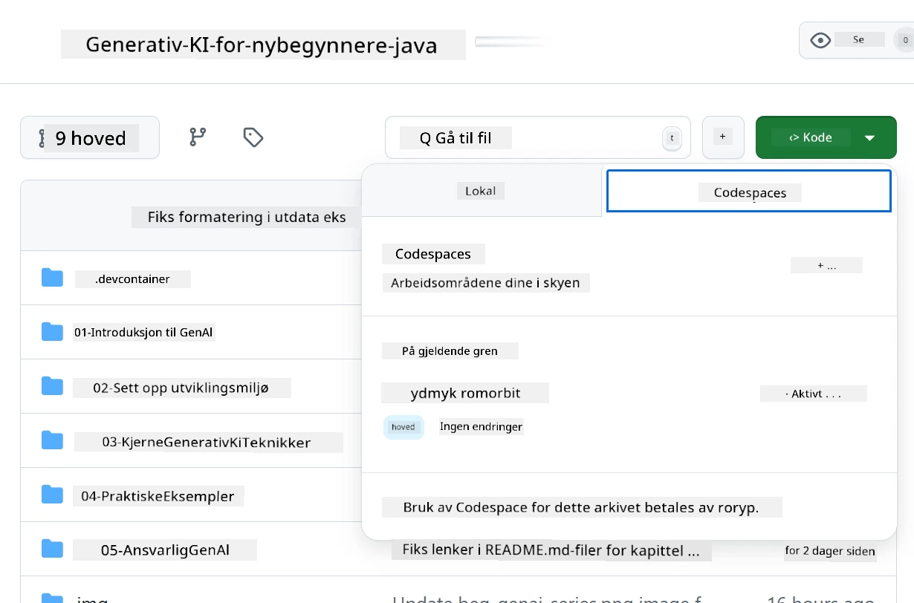
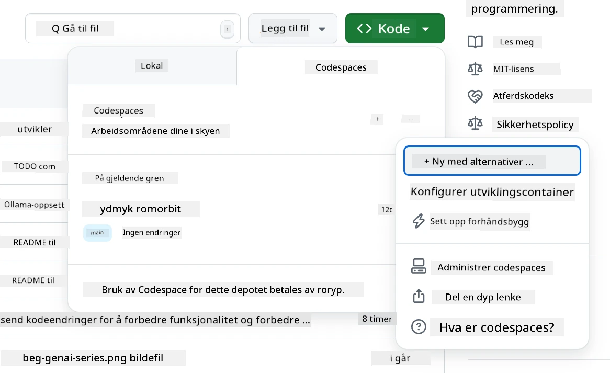
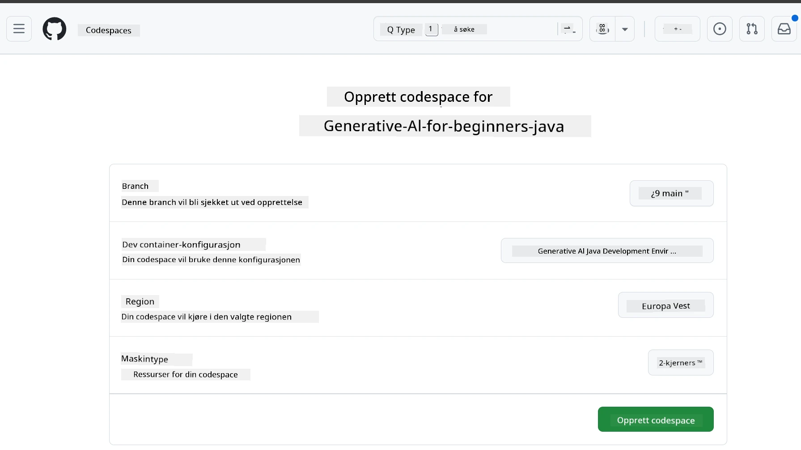
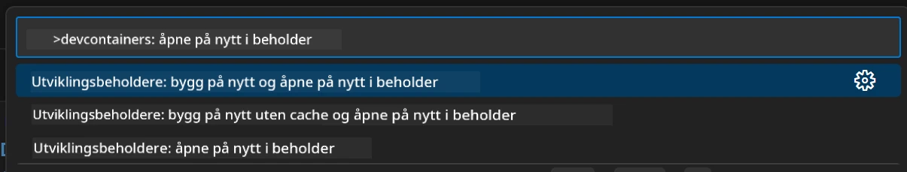
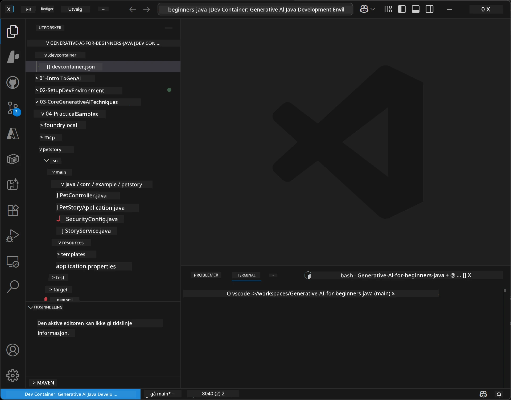
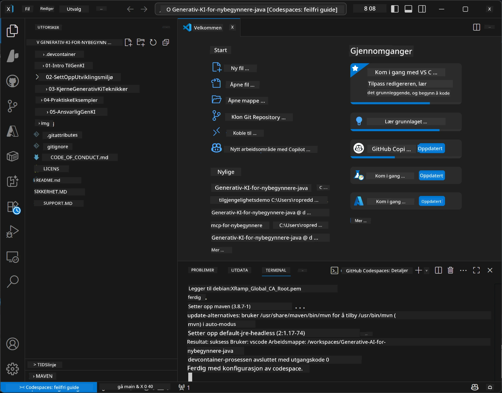

# Sette opp utviklingsmiljøet for generativ AI for Java

> **Rask start:** Provisioner AI-modellene dine på **Azure AI Foundry** som kode med Bicep + `azd` i løpet av noen minutter — se [Azure AI Foundry Setup Guide](getting-started-azure-openai.md). Autentisering er **nøkkelfri** (Microsoft Entra ID), så det er ingen API-nøkler å håndtere.

## Hva du vil lære

- Sett opp et Java-utviklingsmiljø for AI-applikasjoner
- Velg og konfigurer ditt foretrukne utviklingsmiljø (cloud-first med Codespaces, lokal utviklingscontainer eller full lokal oppsett)
- Test oppsettet ditt ved å koble til en Azure AI Foundry-modell

## Innholdsfortegnelse

- [Hva du vil lære](#hva-du-vil-lære)
- [Introduksjon](#introduksjon)
- [Steg 1: Sett opp utviklingsmiljøet ditt](#steg-1-sett-opp-utviklingsmiljøet-ditt)
  - [Alternativ A: GitHub Codespaces (anbefalt)](#alternativ-a-github-codespaces-anbefalt)
  - [Alternativ B: Lokal utviklingscontainer](#alternativ-b-lokal-utviklingscontainer)
  - [Alternativ C: Bruk din eksisterende lokale installasjon](#alternativ-c-bruk-din-eksisterende-lokale-installasjon)
- [Steg 2: Provisioner Azure AI Foundry](#steg-2-provisioner-azure-ai-foundry)
- [Steg 3: Test oppsettet ditt](#steg-3-test-oppsettet-ditt)
- [Feilsøking](#feilsøking)
- [Oppsummering](#oppsummering)
- [Neste steg](#neste-steg)

## Introduksjon

Dette kapittelet vil veilede deg gjennom å sette opp et utviklingsmiljø. Vi bruker **Azure AI Foundry** for modellene gjennom hele kurset. Du provisionerer modellene som kode med Bicep og Azure Developer CLI (`azd`), og kobler til med **nøkkelfri autentisering** (Microsoft Entra ID) — ingen API-nøkler å kopiere eller lekke.

**Ingen lokal oppsett kreves!** Du kan bruke GitHub Codespaces, som tilbyr et komplett utviklingsmiljø i nettleseren din, og provisionere Foundry direkte derfra.

Vi bruker **Azure AI Foundry** for dette kurset fordi det er:
- **Provisionert som kode** — én `azd up` deployer konto og modell-deployeringer
- **Nøkkelfri** — autentiser med din Azure-pålogging eller en managed identity
- **Klar for produksjon** — samme kode kan kjøre lokalt og i Azure
- **Fleksibel** — bytt modeller ved å endre et deployeringsnavn, ikke koden din

> **Merk:** Azure AI Foundry-deployeringer faktureres per token (betal som du går). Se [Azure AI Foundry setup guide](getting-started-azure-openai.md) for detaljer om provisioning, region og kostnader.


## Steg 1: Sett opp utviklingsmiljøet ditt

<a name="quick-start-cloud"></a>

Vi har laget en forhåndskonfigurert utviklingscontainer for å minimere oppsettstid og sikre at du har alle nødvendige verktøy for dette Generative AI for Java-kurset. Velg din foretrukne utviklingsmetode:

### Miljøoppsett-alternativer:

#### Alternativ A: GitHub Codespaces (anbefalt)

**Begynn å kode på 2 minutter - ingen lokal oppsett nødvendig!**

1. Fork dette repositoriet til din GitHub-konto
   > **Merk:** Hvis du vil redigere standardkonfigurasjonen, se [Dev Container Configuration](../../../.devcontainer/devcontainer.json)
2. Klikk **Code** → **Codespaces**-fanen → **...** → **New with options...**
3. Bruk standardinnstillingene – dette vil velge **Dev container configuration**: **Generative AI Java Development Environment** tilpasset devcontainer laget for kurset
4. Klikk **Create codespace**
5. Vent ca. 2 minutter til miljøet er klart
6. Fortsett til [Steg 2: Provisioner Azure AI Foundry](#steg-2-provisioner-azure-ai-foundry)








> **Fordeler med Codespaces**:
> - Ingen lokal installasjon nødvendig
> - Fungerer på alle enheter med en nettleser
> - Forhåndskonfigurert med alle verktøy og avhengigheter
> - 60 gratis timer per måned for personlige kontoer
> - Konsekvent miljø for alle deltakere

#### Alternativ B: Lokal utviklingscontainer

**For utviklere som foretrekker lokal utvikling med Docker**

1. Fork og klon dette repositoriet til din lokale maskin
   > **Merk:** Hvis du vil redigere standardkonfigurasjonen, se [Dev Container Configuration](../../../.devcontainer/devcontainer.json)
2. Installer [Docker Desktop](https://www.docker.com/products/docker-desktop/) og [VS Code](https://code.visualstudio.com/)
3. Installer [Dev Containers extension](https://marketplace.visualstudio.com/items?itemName=ms-vscode-remote.remote-containers) i VS Code
4. Åpne mapper med repositoriet i VS Code
5. Når du blir spurt, klikk **Reopen in Container** (eller bruk `Ctrl+Shift+P` → "Dev Containers: Reopen in Container")
6. Vent på at containeren bygges og starter
7. Fortsett til [Steg 2: Provisioner Azure AI Foundry](#steg-2-provisioner-azure-ai-foundry)





#### Alternativ C: Bruk din eksisterende lokale installasjon

**For utviklere med eksisterende Java-miljøer**

Forutsetninger:
- [Java 21+](https://www.oracle.com/java/technologies/javase/jdk21-archive-downloads.html) 
- [Maven 3.9+](https://maven.apache.org/download.cgi)
- [VS Code](https://code.visualstudio.com) eller ditt foretrukne IDE

Steg:
1. Klon dette repositoriet til din lokale maskin
2. Åpne prosjektet i ditt IDE
3. Fortsett til [Steg 2: Provisioner Azure AI Foundry](#steg-2-provisioner-azure-ai-foundry)

> **Proffdikt:** Hvis maskinen din har lav ytelse, men du vil ha VS Code lokalt, bruk GitHub Codespaces! Du kan koble din lokale VS Code til en sky-hostet Codespace for det beste fra begge verdener.




## Steg 2: Provisioner Azure AI Foundry

Deploy AI-modellene til kurset på Azure AI Foundry som kode. Fra repositoriets rotmappe:

```bash
cd 02-SetupDevEnvironment
azd auth login
az login
azd up
```

`azd` spør etter et miljønavn, abonnement og region, provisionerer en Azure AI Foundry-konto med `gpt-5.6-luna` og `text-embedding-3-small` deployeringer, og skriver endepunktet inn i eksempelens `.env` - alt med **nøkkelfri** autentisering (ingen API-nøkler).

> **Full gjennomgang:** Se [Azure AI Foundry Setup Guide](getting-started-azure-openai.md) for forhåndskrav, et manuelt (portal) alternativ, regionsveiledning og kostnads-/oppryddingsnotater.

## Steg 3: Test oppsettet ditt

Når Foundry-modellene dine er provisionert, test tilkoblingen med eksempelappen i [`02-SetupDevEnvironment/examples/basic-chat-azure`](../../../02-SetupDevEnvironment/examples/basic-chat-azure).

1. Åpne terminalen i utviklingsmiljøet ditt.
2. Naviger til eksempelet:
   ```bash
   cd 02-SetupDevEnvironment/examples/basic-chat-azure
   ```
3. Sørg for at du er innlogget (nøkkelfri autentisering krever en token):
   ```bash
   az login
   ```
   > Hvis du kjørte `azd up`, ble `.env`-filen med endepunktet ditt allerede skrevet for deg.
4. Kjør applikasjonen:
   ```bash
   mvn clean spring-boot:run
   ```

Du bør se et svar fra `gpt-5.6-luna`-modellen.

### Forstå eksempel-koden

[basic-chat-eksempelet](./examples/basic-chat-azure/README.md) bruker **Spring Boot 4.1.1** og **Spring AI 2.0.1**. Spring AIs `ChatClient` støttes av den offisielle OpenAI Java SDK, kobler til Azure OpenAI **v1** endepunkt med nøkkelfri autentisering.

**Hva denne koden gjør:**
- **Kobler til** Azure AI Foundry ved hjelp av din Azure-pålogging (Microsoft Entra ID) — ingen API-nøkkel
- **Sender** en prompt til `gpt-5.6-luna`-modellen
- **Mottar** og viser AI sitt svar
- **Validerer** at oppsettet ditt fungerer som det skal

**Nøkkelavhengigheter** (utdrag fra [pom.xml](../../../02-SetupDevEnvironment/examples/basic-chat-azure/pom.xml)):
```xml
<dependency>
    <groupId>org.springframework.ai</groupId>
    <artifactId>spring-ai-starter-model-openai</artifactId>
</dependency>
<dependency>
    <groupId>com.openai</groupId>
    <artifactId>openai-java</artifactId>
</dependency>
<dependency>
    <groupId>com.azure</groupId>
    <artifactId>azure-identity</artifactId>
    <version>${azure-identity.version}</version>
</dependency>
```

POM-en håndterer OpenAI Java **4.63.1** og setter Azure Identity **1.18.6** eksplisitt. Spring AI 2 fjernet Azure-spesifikk starter; Azure Identity trengs fortsatt for credential bean.

**Konfigurasjon** ([application.yml](../../../02-SetupDevEnvironment/examples/basic-chat-azure/src/main/resources/application.yml)):
```yaml
spring:
  ai:
    openai:
      base-url: ${AZURE_OPENAI_ENDPOINT}
      microsoft-foundry: true
      chat:
        model: ${AZURE_OPENAI_DEPLOYMENT:gpt-5.6-luna}
        reasoning-effort: none
        max-completion-tokens: 500
```

Nøkkelfri autentisering er konfigurert eksplisitt i [BasicChatApplication.java](../../../02-SetupDevEnvironment/examples/basic-chat-azure/src/main/java/com/example/BasicChatApplication.java), ikke utledet fra en manglende API-nøkkel. Dens bearer-credential bruker `DefaultAzureCredential` med `https://ai.azure.com/.default` scope, og `OpenAIClient` retter mot `/openai/v1`. Appen leverer den klienten til Spring AI sin chatmodell, så en global `OPENAI_API_KEY` kan ikke overstyre Azure-autentisering.

Chat-innstillingene ligger direkte under `spring.ai.openai.chat`, uten en `options` blokk. Leksjonen beholder Chat Completions med `reasoning-effort: none` og en 500-token fullføringsgrense; den setter ikke `temperature` eller `max-tokens`. Se [eksempelets konfigurasjonsreferanse](./examples/basic-chat-azure/README.md#spring-configuration) for API-valg og veiledning for verktøysanrop.

## Oppsummering

Etter å ha fullført trinnene ovenfor vil du ha:

- Provisionert Azure AI Foundry-modeller som kode med Bicep + `azd`
- Fått Java-utviklingsmiljøet ditt i gang (enten det er Codespaces, dev-containere eller lokalt)
- Knyttet til Azure AI Foundry med nøkkelfri autentisering (Microsoft Entra ID) — ingen API-nøkler
- Testet at alt fungerer med et enkelt eksempel som kommuniserer med modellen din

## Neste steg

[Kapittel 3: Kjerneteknikker for generativ AI](../03-CoreGenerativeAITechniques/README.md)

## Feilsøking

Har du problemer? Her er vanlige problemer og løsninger:

- **Autentisering feiler (401/403)?** 
  - Kjør `az login` — autentisering er nøkkelfri, så du må være innlogget
  - Sjekk at kontoen din har rollen **Cognitive Services OpenAI User** på ressursen
  - Hvis du nettopp har provisionert, vent et minutt for rollefordelingen å slå inn

- **Maven ikke funnet?** 
  - Hvis du bruker dev-containere/Codespaces, skal Maven være forhåndsinstallert
  - For lokalt oppsett, sørg for at Java 21+ og Maven 3.9+ er installert
  - Prøv `mvn --version` for å verifisere installasjon

- **`azd` ikke funnet eller provisioning feiler?** 
  - Installer [Azure Developer CLI](https://aka.ms/azure-dev/install) og kjør `azd auth login`
  - Velg en region der `gpt-5.6-luna` og `text-embedding-3-small` er tilgjengelige (f.eks. `eastus2`), med nok kvote i valgt abonnement
  - Se [Azure AI Foundry setup guide](getting-started-azure-openai.md) for detaljer

- **Dev container starter ikke?** 
  - Sørg for at Docker Desktop kjører (for lokal utvikling)
  - Prøv å bygge containeren på nytt: `Ctrl+Shift+P` → "Dev Containers: Rebuild Container"

- **Kompileringsfeil i applikasjonen?**
  - Sørg for at du er i riktig mappe: `02-SetupDevEnvironment/examples/basic-chat-azure`
  - Prøv å rense og bygge på nytt: `mvn clean compile`

> **Trenger du hjelp?**: Fortsatt problemer? Opprett en issue i repositoriet så hjelper vi deg.

---

<!-- CO-OP TRANSLATOR DISCLAIMER START -->
**Ansvarsfraskrivelse**:
Dette dokumentet er oversatt ved hjelp av AI-oversettelsestjenesten [Co-op Translator](https://github.com/Azure/co-op-translator). Selv om vi streber etter nøyaktighet, vær oppmerksom på at automatiske oversettelser kan inneholde feil eller unøyaktigheter. Det opprinnelige dokumentet på originalspråket skal betraktes som den autoritative kilden. For kritisk informasjon anbefales profesjonell menneskelig oversettelse. Vi er ikke ansvarlige for eventuelle misforståelser eller feiltolkninger som oppstår ved bruk av denne oversettelsen.
<!-- CO-OP TRANSLATOR DISCLAIMER END -->