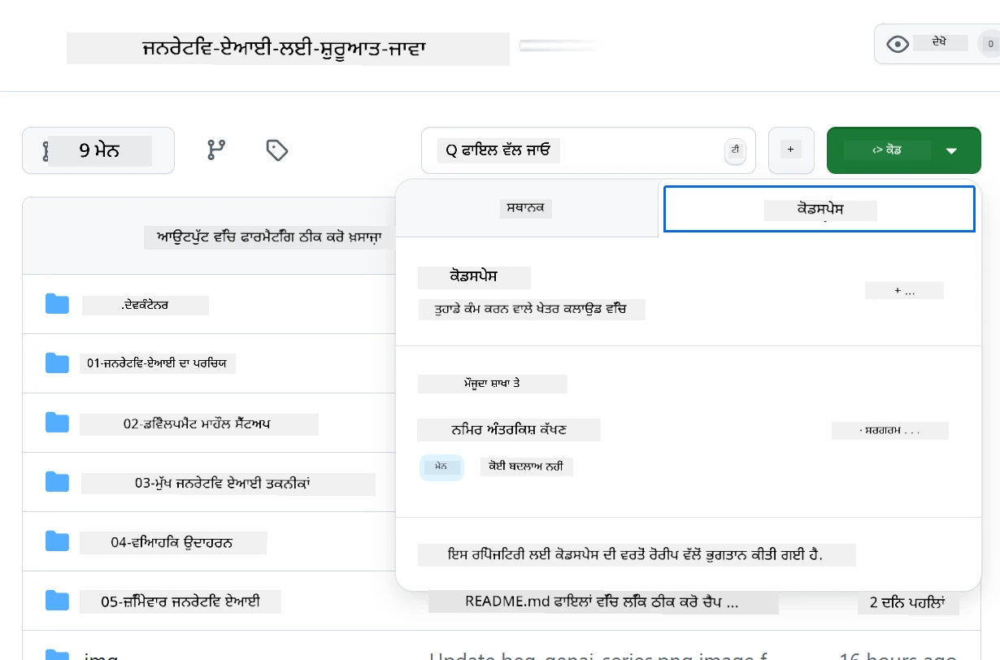
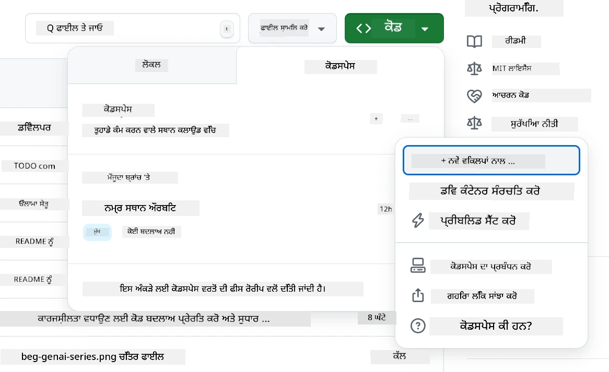
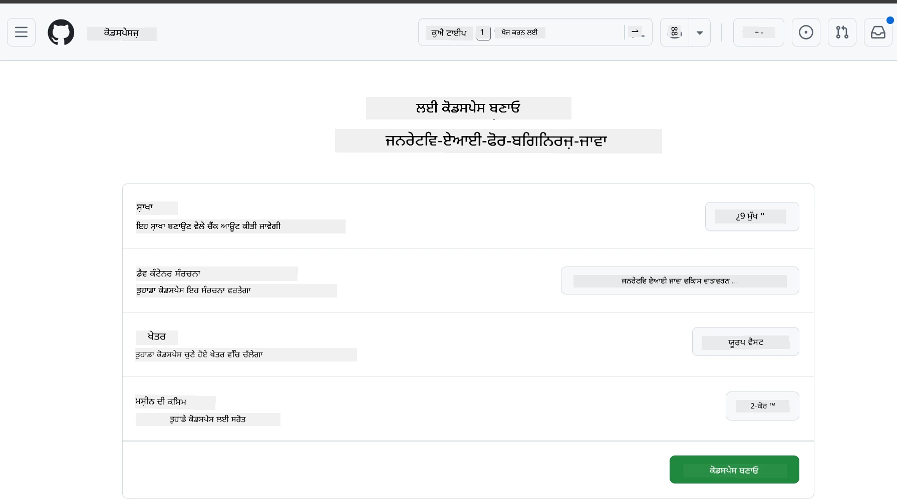
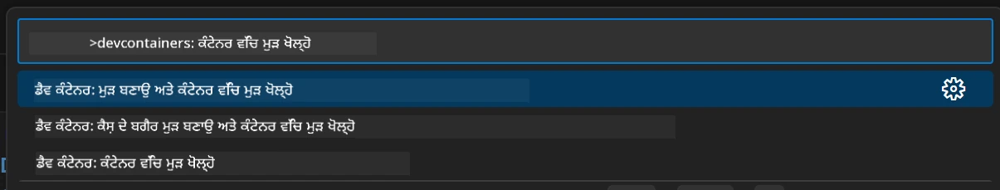
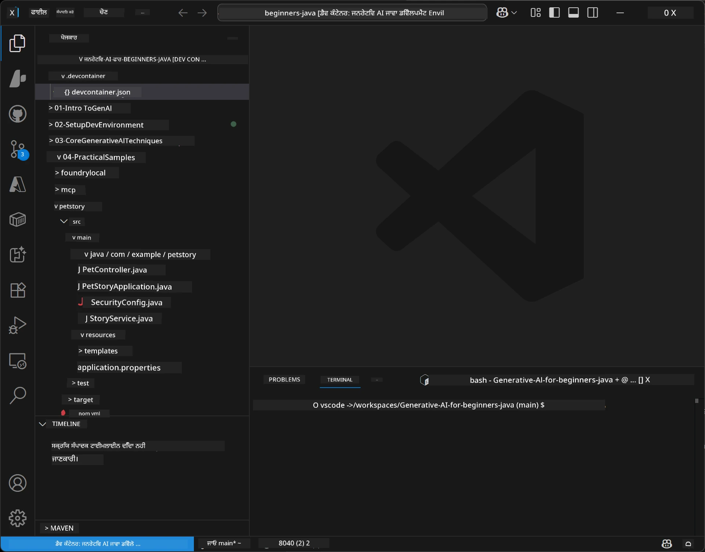
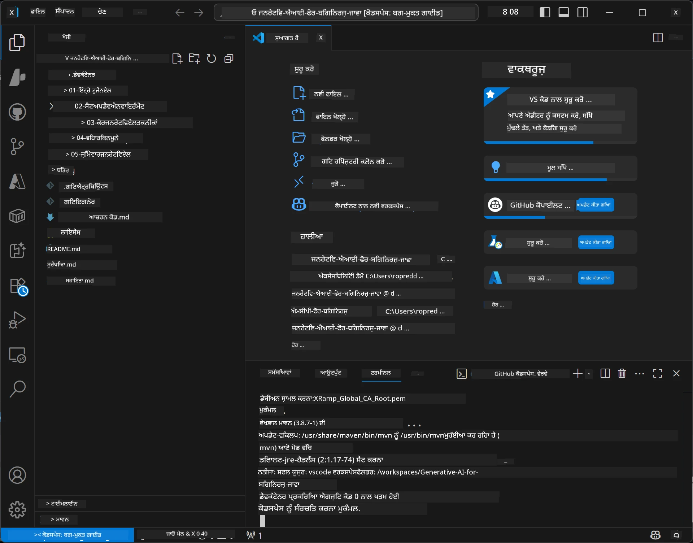

# ਜਾਵਾ ਲਈ ਜਨਰੇਟਿਵ AI ਲਈ ਵਿਕਾਸ ਵਾਤਾਵਰਣ ਸੈਟਅਪ ਕਰਨਾ

> **ਤੁਰੰਤ ਸ਼ੁਰੂਆਤ:** ਕੁਝ ਮਿੰਟਾਂ ਵਿੱਚ Bicep + `azd` ਨਾਲ ਕੋਡ ਵਜੋਂ **Azure AI Foundry** 'ਤੇ ਆਪਣੇ AI ਮਾਡਲ ਪ੍ਰੋਵੀਜ਼ਨ ਕਰੋ — ਵੇਖੋ [Azure AI Foundry ਸੈਟਅਪ ਗਾਈਡ](getting-started-azure-openai.md)। ਪ੍ਰਮਾਣਿਕਤਾ **ਬਿਨਾਂ ਕੀਲੇਸ** ਹੈ (Microsoft Entra ID), ਇਸ ਲਈ ਕੋਈ API ਕੁੰਜੀਆਂ ਪ੍ਰਬੰਧਤ ਕਰਨ ਦੀ ਲੋੜ ਨਹੀਂ।

## ਤੁਸੀਂ ਕੀ ਸਿੱਖੋਗੇ

- AI ਐਪਲੀਕੇਸ਼ਨਾਂ ਲਈ ਜਾਵਾ ਵਿਕਾਸ ਵਾਤਾਵਰਣ ਸੈਟਅਪ ਕਰੋ
- ਆਪਣੀ ਪਸੰਦ ਦੀ ਵਿਕਾਸ ਪ੍ਰਣਾਲੀ ਚੁਣੋ ਅਤੇ ਕੰਫਿਗਰ ਕਰੋ (Codespaces ਨਾਲ ਕਲਾਉਡ-ਪਹਿਲਾ, ਲੋਕਲ ਡੈਵ ਕੰਟੇਨਰ, ਜਾਂ ਪੂਰਾ ਲੋਕਲ ਸੈਟਅਪ)
- Azure AI Foundry ਮਾਡਲ ਨਾਲ ਜੁੜ ਕੇ ਆਪਣਾ ਸੈਟਅਪ ਟੈਸਟ ਕਰੋ

## ਸੂਚੀ

- [ਤੁਸੀਂ ਕੀ ਸਿੱਖੋਗੇ](#ਤੁਸੀਂ-ਕੀ-ਸਿੱਖੋਗੇ)
- [ਪਰਿਚਯ](#ਪਰਿਚਯ)
- [ਕਦਮ 1: ਆਪਣਾ ਵਿਕਾਸ ਵਾਤਾਵਰਣ ਸੈਟਅਪ ਕਰੋ](#ਕਦਮ-1-ਆਪਣਾ-ਵਿਕਾਸ-ਵਾਤਾਵਰਣ-ਸੈਟਅਪ-ਕਰੋ)
  - [ਵਿਕਲਪ A: GitHub Codespaces (ਸਿਫਾਰਸ਼ੀ)](#ਵਿਕਲਪ-a-github-codespaces-ਸਿਫਾਰਸ਼ੀ)
  - [ਵਿਕਲਪ B: ਲੋਕਲ ਡੈਵ ਕੰਟੇਨਰ](#ਵਿਕਲਪ-b-ਲੋਕਲ-ਡੈਵ-ਕੰਟੇਨਰ)
  - [ਵਿਕਲਪ C: ਆਪਣੀ ਮੌਜੂਦਾ ਲੋਕਲ ਇੰਸਟਾਲੇਸ਼ਨ ਵਰਤੋਂ](#ਵਿਕਲਪ-c-ਆਪਣੀ-ਮੌਜੂਦਾ-ਲੋਕਲ-ਇੰਸਟਾਲੇਸ਼ਨ-ਵਰਤੋਂ)
- [ਕਦਮ 2: Azure AI Foundry ਪ੍ਰੋਵੀਜ਼ਨ ਕਰੋ](#ਕਦਮ-2-azure-ai-foundry-ਪ੍ਰੋਵੀਜ਼ਨ-ਕਰੋ)
- [ਕਦਮ 3: ਆਪਣਾ ਸੈਟਅਪ ਟੈਸਟ ਕਰੋ](#ਕਦਮ-3-ਆਪਣਾ-ਸੈਟਅਪ-ਟੈਸਟ-ਕਰੋ)
- [ਟ੍ਰਬਲਸ਼ੂਟਿੰਗ](#ਟ੍ਰਬਲਸ਼ੂਟਿੰਗ)
- [ਸਾਰ](#ਸਾਰ)
- [ਅਗਲੇ ਕਦਮ](#ਅਗਲੇ-ਕਦਮ)

## ਪਰਿਚਯ

ਇਹ ਅਧਿਆਇ ਤੁਹਾਨੂੰ ਵਿਕਾਸ ਵਾਤਾਵਰਣ ਸੈਟਅਪ ਕਰਨ ਦੀ ਰਹਨੁਮਾਈ ਕਰੇਗਾ। ਅਸੀਂ ਇਸ ਕੋਰਸ ਵਿੱਚ ਮਾਡਲਾਂ ਲਈ **Azure AI Foundry** ਵਰਤਾਂਗੇ। ਤੁਸੀਂ ਬਾਈਸਪ ਅਤੇ Azure Developer CLI (`azd`) ਨਾਲ ਮਾਡਲਾਂ ਨੂੰ ਕੋਡ ਵਜੋਂ ਪ੍ਰੋਵੀਜ਼ਨ ਕਰਦੇ ਹੋ, ਫਿਰ ਬਿਨਾਂ ਕੀਲੇਸ ਪ੍ਰਮਾਣਿਕਤਾ (Microsoft Entra ID) ਨਾਲ ਜੁੜਦੇ ਹੋ — ਕੋਈ API ਕੁੰਜੀਆਂ ਕਾਪੀ ਜਾਂ ਲੀਕ ਨਹੀਂ ਕਰਨੀ।

**ਕੋਈ ਲੋਕਲ ਸੈਟਅਪ ਲੋੜੀਂਦਾ ਨਹੀਂ!** ਤੁਸੀਂ GitHub Codespaces ਵਰਤ ਸਕਦੇ ਹੋ, ਜੋ ਤੁਹਾਡੇ ਬ੍ਰਾਊਜ਼ਰ ਵਿੱਚ ਪੂਰਾ ਵਿਕਾਸ ਵਾਤਾਵਰਣ ਦਿੰਦਾ ਹੈ, ਅਤੇ ਉੱਥੋਂ Foundry ਨੂੰ ਪ੍ਰੋਵੀਜ਼ਨ ਕਰ ਸਕਦੇ ਹੋ।

ਅਸੀਂ ਇਸ ਕੋਰਸ ਲਈ **Azure AI Foundry** ਵਰਤਦੇ ਹਾਂ ਕਿਉਂਕਿ ਇਹ:
- **ਕੋਡ ਵਜੋਂ ਪ੍ਰੋਵੀਜ਼ਨ ਕੀਤਾ ਗਿਆ** — ਇੱਕ `azd up` ਖਾਤਾ ਅਤੇ ਮਾਡਲ ਡਿਪਲੋਇਮੈਂਟਸ ਡਿਪਲੋਇ ਕਰਦਾ ਹੈ
- **ਕੀਲੇਸ** — ਆਪਣੇ Azure ਸਾਈਨ-ਇਨ ਜਾਂ ਪ੍ਰਬੰਧਿਤ ਪਹਚਾਣ ਨਾਲ ਪ੍ਰਮਾਣਿਤ ਕਰੋ
- **ਉਤਪਾਦਨ-ਤਿਆਰ** — ਉਹੀ ਕੋਡ ਲੋਕਲ ਅਤੇ Azure ਦੋਹਾਂ 'ਤੇ ਚੱਲਦਾ ਹੈ
- **ਲਚਕੀਲਾ** — ਆਪਣਾ ਕੋਡ ਬਦਲੇ ਬਿਨਾਂ ਡਿਪਲੋਇਮੈਂਟ ਦਾ ਨਾਮ ਬਦਲ ਕੇ ਮਾਡਲ ਬਦਲੋ

> **ਨੋਟ**: Azure AI Foundry ਡਿਪਲੋਇਮੈਂਟਾਂ ਦਾ ਬਿਲਿੰਗ ਟੋਕਨ ਪ੍ਰਤੀ ਹੁੰਦਾ ਹੈ (ਜਿੰਨਾ ਵਰਤੋਂਗੇ ਉਤਨਾ ਦਿਓ)। ਪ੍ਰੋਵੀਜ਼ਨਿੰਗ, ਖੇਤਰ ਅਤੇ ਲਾਗਤ ਵੇਰਵੇ ਲਈ [Azure AI Foundry ਸੈਟਅਪ ਗਾਈਡ](getting-started-azure-openai.md) ਵੇਖੋ।


## ਕਦਮ 1: ਆਪਣਾ ਵਿਕਾਸ ਵਾਤਾਵਰਣ ਸੈਟਅਪ ਕਰੋ

<a name="quick-start-cloud"></a>

ਅਸੀਂ ਤਿਆਰ ਕੀਤਾ ਹੋਇਆ ਪਹਿਲਾਂ-ਕੰਫਿਗਰ ਕੀਤਾ ਵਿਕਾਸ ਕੰਟੇਨਰ ਦਿੱਤਾ ਹੈ ਤਾਂ ਜੋ ਸੈਟਅਪ ਦਾ ਸਮਾਂ ਘਟਿਆ ਜਾ ਸਕੇ ਅਤੇ ਤੁਹਾਡੇ ਕੋਲ ਜਨਰੇਟਿਵ AI ਜਾਵਾ ਕੋਰਸ ਲਈ ਜ਼ਰੂਰੀ ਸਾਰੇ ਟੂਲ ਹੋਣ। ਆਪਣਾ ਪਸੰਦੀਦਾ ਵਿਕਾਸ ਤਰੀਕਾ ਚੁਣੋ:

### ਵਾਤਾਵਰਣ ਸੈਟਅਪ ਦੇ ਵਿਕਲਪ:

#### ਵਿਕਲਪ A: GitHub Codespaces (ਸਿਫਾਰਸ਼ੀ)

**2 ਮਿੰਟ ਵਿੱਚ ਕੋਡਿੰਗ ਸ਼ੁਰੂ ਕਰੋ - ਕੋਈ ਲੋਕਲ ਸੈਟਅਪ ਦੀ ਲੋੜ ਨਹੀਂ!**

1. ਇਸ ਰਿਪੋਜ਼ਟਰੀ ਨੂੰ ਆਪਣੇ GitHub ਖਾਤੇ ਵਿੱਚ ਫੋਰਕ ਕਰੋ
   > **ਨੋਟ**: ਜੇ ਤੁਸੀਂ ਮੂਲ ਕੰਫਿਗ ਬਦਲਣਾ ਚਾਹੁੰਦੇ ਹੋ ਤਾਂ [Dev Container Configuration](../../../.devcontainer/devcontainer.json) ਵੇਖੋ
2. ਕਲਿੱਕ ਕਰੋ **Code** → **Codespaces** ਟੈਬ → **...** → **New with options...**
3. ਡਿਫਾਲਟ ਵਰਤੋ – ਇਹ **Dev container configuration** ਚੁਣੇਗਾ: ਇਸ ਕੋਰਸ ਲਈ ਬਣਾਇਆ ਹੋਇਆ **Generative AI Java Development Environment** ਕਸਟਮ devcontainer
4. ਕਲਿੱਕ ਕਰੋ **Create codespace**
5. ਲਗਭਗ 2 ਮਿੰਟ ਪ੍ਰਤੀਕਸ਼ਾ ਕਰੋ ਜਦ ਤੱਕ ਵਾਤਾਵਰਣ ਤਿਆਰ ਨਾ ਹੋ ਜਾਵੇ
6. ਜਾਰੀ ਰੱਖੋ [ਕਦਮ 2: Azure AI Foundry ਪ੍ਰੋਵੀਜ਼ਨ ਕਰੋ](#ਕਦਮ-2-azure-ai-foundry-ਪ੍ਰੋਵੀਜ਼ਨ-ਕਰੋ)








> **Codespaces ਦੇ ਫਾਇਦੇ**:
> - ਕੋਈ ਲੋਕਲ ਇੰਸਟਾਲੇਸ਼ਨ ਨਹੀਂ ਚਾਹੀਦੀ
> - ਕਿਸੇ ਵੀ ਡਿਵਾਈਸ 'ਤੇ ਬ੍ਰਾਊਜ਼ਰ ਨਾਲ ਕੰਮ ਕਰਦਾ ਹੈ
> - ਸਾਰੇ ਟੂਲਾਂ ਅਤੇ ਡਿਪੈਂਡੈਂਸੀਆਂ ਪਹਿਲਾਂ-ਕੰਫਿਗਰਡ
> - ਨਿਜੀ ਖਾਤਿਆਂ ਲਈ ਮਹੀਨੇ ਦੇ 60 ਘੰਟੇ ਮੁਫ਼ਤ
> - ਸਾਰੇ ਸਿੱਖਣ ਵਾਲਿਆਂ ਲਈ ਇਕਰੂਪ ਵਾਤਾਵਰਣ

#### ਵਿਕਲਪ B: ਲੋਕਲ ਡੈਵ ਕੰਟੇਨਰ

**ਜਿਨ੍ਹਾਂ ਡਿਵੈਲਪਰਾਂ ਨੂੰ Docker ਨਾਲ ਲੋਕਲ ਵਿਕਾਸ ਪਸੰਦ ਹੈ**

1. ਇਸ ਰਿਪੋਜ਼ਟਰੀ ਨੂੰ ਫੋਰਕ ਅਤੇ ਕਲੋਨ ਕਰੋ ਆਪਣੇ ਲੋਕਲ ਮਸ਼īn ਤੇ
   > **ਨੋਟ**: ਜੇ ਤੁਸੀਂ ਮੂਲ ਕੰਫਿਗ ਬਦਲਣਾ ਚਾਹੁੰਦੇ ਹੋ ਤਾਂ [Dev Container Configuration](../../../.devcontainer/devcontainer.json) ਵੇਖੋ
2. [Docker Desktop](https://www.docker.com/products/docker-desktop/) ਅਤੇ [VS Code](https://code.visualstudio.com/) ਇੰਸਟਾਲ ਕਰੋ
3. VS Code ਵਿੱਚ [Dev Containers extension](https://marketplace.visualstudio.com/items?itemName=ms-vscode-remote.remote-containers) ਇੰਸਟਾਲ ਕਰੋ
4. VS Code ਵਿੱਚ ਰਿਪੋਜ਼ਟਰੀ ਫੋਲਡਰ ਖੋਲ੍ਹੋ
5. ਜਦੋਂ ਪ੍ਰਾਂਪਟ ਆਵੇ, **Reopen in Container** 'ਤੇ ਕਲਿੱਕ ਕਰੋ (ਜਾਂ `Ctrl+Shift+P` → "Dev Containers: Reopen in Container" ਵਰਤੋਂ)
6. ਕੰਟੇਨਰ ਦੇ ਬਣਨ ਅਤੇ ਸ਼ੁਰੂ ਹੋਣ ਦੀ ਉਡੀਕ ਕਰੋ
7. ਜਾਰੀ ਰੱਖੋ [ਕਦਮ 2: Azure AI Foundry ਪ੍ਰੋਵੀਜ਼ਨ ਕਰੋ](#ਕਦਮ-2-azure-ai-foundry-ਪ੍ਰੋਵੀਜ਼ਨ-ਕਰੋ)





#### ਵਿਕਲਪ C: ਆਪਣੀ ਮੌਜੂਦਾ ਲੋਕਲ ਇੰਸਟਾਲੇਸ਼ਨ ਵਰਤੋਂ

**ਜਿਨ੍ਹਾਂ ਡਿਵੈਲਪਰਾਂ ਕੋਲ ਪਹਿਲਾਂ ਹੀ ਜਾਵਾ ਵਾਤਾਵਰਣ ਹੈ**

ਲੋੜੀਂਦੀਆਂ ਚੀਜ਼ਾਂ:
- [Java 21+](https://www.oracle.com/java/technologies/javase/jdk21-archive-downloads.html) 
- [Maven 3.9+](https://maven.apache.org/download.cgi)
- [VS Code](https://code.visualstudio.com) ਜਾਂ ਆਪਣੀ ਪਸੰਦੀਦਾ IDE

ਕਦਮ:
1. ਇਸ ਰਿਪੋਜ਼ਟਰੀ ਨੂੰ ਆਪਣੇ ਲੋਕਲ ਮਸ਼ੀਨ 'ਤੇ ਕਲੋਨ ਕਰੋ
2. ਪ੍ਰੋਜੈਕਟ ਆਪਣੇ IDE ਵਿੱਚ ਖੋਲ੍ਹੋ
3. ਜਾਰੀ ਰੱਖੋ [ਕਦਮ 2: Azure AI Foundry ਪ੍ਰੋਵੀਜ਼ਨ ਕਰੋ](#ਕਦਮ-2-azure-ai-foundry-ਪ੍ਰੋਵੀਜ਼ਨ-ਕਰੋ)

> **ਪ੍ਰੋ ਟਿੱਪ**: ਜੇ ਤੁਹਾਡੇ ਕੋਲ ਛੋਟੀ-ਸਪੈੱਕ ਮਸ਼ੀਨ ਹੈ ਪਰ ਤੁਸੀਂ ਲੋਕਲ ਤੌਰ ਤੇ VS Code ਚਾਹੁੰਦੇ ਹੋ, ਤਾਂ GitHub Codespaces ਵਰਤੋਂ! ਤੁਸੀਂ ਆਪਣੇ ਲੋਕਲ VS Code ਨੂੰ ਕਲਾਉਡ-ਹੋਸਟਡ Codespace ਨਾਲ ਜੋੜ ਸਕਦੇ ਹੋ, ਦੋਹਾਂ ਦੁਨੀਆਂ ਲਈ ਬਿਹਤਰ।




## ਕਦਮ 2: Azure AI Foundry ਪ੍ਰੋਵੀਜ਼ਨ ਕਰੋ

ਕੋਰਸ ਦੇ AI ਮਾਡਲਾਂ ਨੂੰ Azure AI Foundry 'ਤੇ ਕੋਡ ਵਜੋਂ ਡਿਪਲੋਇ ਕਰੋ। ਰਿਪੋਜ਼ਟਰੀ ਦੀ ਰੂਟ ਤੋਂ:

```bash
cd 02-SetupDevEnvironment
azd auth login
az login
azd up
```

`azd` ਵਾਤਾਵਰਣ ਨਾਮ, ਸਬਸਕ੍ਰਿਪਸ਼ਨ, ਅਤੇ ਖੇਤਰ ਲਈ ਪ੍ਰਾਂਪਟ ਕਰਦਾ ਹੈ, `gpt-5.6-luna` ਅਤੇ `text-embedding-3-small` ਡਿਪਲੋਇਮੈਂਟਾਂ ਨਾਲ Azure AI Foundry ਖਾਤਾ ਪ੍ਰੋਵੀਜ਼ਨ ਕਰਦਾ ਹੈ, ਅਤੇ ਉਦਾਹਰਨ ਦੇ `.env` ਵਿੱਚ ਐਂਡਪੋਇੰਟ ਲਿਖਦਾ ਹੈ - ਸਭ ਕੁਝ **ਕੀਲੇਸ** ਪ੍ਰਮਾਣਿਕਤਾ ਨਾਲ (ਕੋਈ API ਕੀ ਨਹੀਂ)।

> **ਪੂਰਾ ਦੌਰਾ:** ਮੰਗਾਂ, ਮੈਨੂਅਲ (ਪੋਰਟਲ) ਵਿਕਲਪ, ਖੇਤਰ ਹਦਾਇਤਾਂ ਅਤੇ ਲਾਗਤ/ਸਾਫ਼-ਸੁਥਰਾ ਨੋਟਾਂ ਲਈ [Azure AI Foundry ਸੈਟਅਪ ਗਾਈਡ](getting-started-azure-openai.md) ਦੇਖੋ।

## ਕਦਮ 3: ਆਪਣਾ ਸੈਟਅਪ ਟੈਸਟ ਕਰੋ

ਜਦੋਂ ਤੁਹਾਡੇ Foundry ਮਾਡਲ ਪ੍ਰੋਵੀਜ਼ਨ ਹੋ ਜਾਣ, ਉਦਾਹਰਨ ਐਪ ਨਾਲ ਉਨ੍ਹਾ ਦਾ ਜੁੜਾਅ ਟੈਸਟ ਕਰੋ ਜੋ [`02-SetupDevEnvironment/examples/basic-chat-azure`](../../../02-SetupDevEnvironment/examples/basic-chat-azure) ਵਿੱਚ ਹੈ।

1. ਆਪਣੇ ਵਿਕਾਸ ਵਾਤਾਵਰਣ ਵਿੱਚ ਟਰਮੀਨਲ ਖੋਲ੍ਹੋ।
2. ਉਦਾਹਰਨ ਫੋਲਡਰ 'ਤੇ ਜਾਓ:
   ```bash
   cd 02-SetupDevEnvironment/examples/basic-chat-azure
   ```
3. ਯਕੀਨ ਕਰੋ ਕਿ ਤੁਸੀਂ ਸਾਇਨ-ਇਨ ਹੋ (ਕੀਲੇਸ ਪ੍ਰਮਾਣਿਕਤਾ ਲਈ ਟੋਕਨ ਚਾਹੀਦਾ):
   ```bash
   az login
   ```
   > ਜੇ ਤੁਸੀਂ `azd up` ਚਲਾਇਆ ਹੈ, ਤਾਂ `.env` ਫਾਇਲ ਤੁਹਾਡੇ ਲਈ ਅਗਾਂਹ ਹੀ ਲਿਖੀ ਗਈ ਸੀ।
4. ਐਪਲੀਕੇਸ਼ਨ ਚਲਾਓ:
   ```bash
   mvn clean spring-boot:run
   ```

ਤੁਹਾਨੂੰ `gpt-5.6-luna` ਮਾਡਲ ਤੋਂ ਜਵਾਬ ਵੇਖਣਾ ਚਾਹੀਦਾ ਹੈ।

### ਉਦਾਹਰਨ ਕੋਡ ਨੂੰ ਸਮਝਣਾ

[basic-chat ਉਦਾਹਰਨ](./examples/basic-chat-azure/README.md) **Spring Boot 4.1.1** ਅਤੇ **Spring AI 2.0.1** ਵਰਤਦਾ ਹੈ। Spring AI ਦਾ `ChatClient` ਅਧਿਕਾਰਕ OpenAI ਜਾਵਾ SDK ਨਾਲ ਤਿਆਰ ਕੀਤਾ ਗਿਆ ਹੈ, Azure OpenAI **v1** ਐਂਡਪੋਇੰਟ ਨਾਲ ਕੀਲੇਸ ਪ੍ਰਮਾਣਿਕਤਾ ਨਾਲ ਜੁੜਦਾ ਹੈ।

**ਇਹ ਕੋਡ ਕੀ ਕਰਦਾ ਹੈ:**
- Azure AI Foundry ਨਾਲ ਤੁਹਾਡੇ Azure ਸਾਈਨ-ਇਨ (Microsoft Entra ID) ਨਾਲ ਜੁੜਦਾ ਹੈ — ਕੋਈ API ਕੀ ਨਹੀਂ
- `gpt-5.6-luna` ਮਾਡਲ ਨੂੰ ਪ੍ਰਾਂਪਟ ਭੇਜਦਾ ਹੈ
- AI ਦਾ ਜਵਾਬ ਪ੍ਰਾਪਤ ਕਰਦਾ ਅਤੇ ਦਿਖਾਉਂਦਾ ਹੈ
- ਤੁਹਾਡੇ ਸੈਟਅਪ ਦੀ ਸਹੀ ਕਾਰਗੁਜ਼ਾਰੀ ਦੀ ਪੁਸ਼ਟੀ ਕਰਦਾ ਹੈ

**ਮੁੱਖ ਡਿਪੈਂਡੈਂਸੀਜ਼** ([pom.xml](../../../02-SetupDevEnvironment/examples/basic-chat-azure/pom.xml) ਤੋਂ ਅੰਸ਼):
```xml
<dependency>
    <groupId>org.springframework.ai</groupId>
    <artifactId>spring-ai-starter-model-openai</artifactId>
</dependency>
<dependency>
    <groupId>com.openai</groupId>
    <artifactId>openai-java</artifactId>
</dependency>
<dependency>
    <groupId>com.azure</groupId>
    <artifactId>azure-identity</artifactId>
    <version>${azure-identity.version}</version>
</dependency>
```

POM OpenAI ਜਾਵਾ **4.63.1** ਨੂੰ ਸੰਜਾਲਿਤ ਕਰਦਾ ਹੈ ਅਤੇ Azure Identity **1.18.6** ਨੂੰ ਖਾਸ ਤੌਰ 'ਤੇ ਸੈਟ ਕਰਦਾ ਹੈ। Spring AI 2 ਨੇ Azure-ਵਿਸ਼ੇਸ਼ ਸਟਾਰਟਰ ਹਟਾ ਦਿੱਤਾ ਹੈ; ਪਰ Azure Identity ਅਜੇ ਵੀ ਕ੍ਰੈਡੈਂਸ਼ੀਅਲ ਬੀਨ ਲਈ ਲਾਜ਼ਮੀ ਹੈ।

**ਸੈਟਿੰਗਜ਼** ([application.yml](../../../02-SetupDevEnvironment/examples/basic-chat-azure/src/main/resources/application.yml)):
```yaml
spring:
  ai:
    openai:
      base-url: ${AZURE_OPENAI_ENDPOINT}
      microsoft-foundry: true
      chat:
        model: ${AZURE_OPENAI_DEPLOYMENT:gpt-5.6-luna}
        reasoning-effort: none
        max-completion-tokens: 500
```

ਕੀਲੇਸ ਪ੍ਰਮਾਣਿਕਤਾ [BasicChatApplication.java](../../../02-SetupDevEnvironment/examples/basic-chat-azure/src/main/java/com/example/BasicChatApplication.java) ਵਿੱਚ ਖਾਸ ਤੌਰ 'ਤੇ ਕਨਫਿਗਰ ਕੀਤੀ ਗਈ ਹੈ, ਗੈਰ-ਮੌਜੂਦ API ਕੀ ਤੋਂ ਨਹੀਂ ਲਿਆ। ਇਸ ਦਾ ਬੇਅਰ ਕ੍ਰੈਡੈਂਸ਼ੀਅਲ `DefaultAzureCredential` ਨੂੰ `https://ai.azure.com/.default` ਧਿਆਨ ਕੇਂਦਰ ਨਾਲ ਵਰਤਦਾ ਹੈ, ਅਤੇ ਇਸ ਦਾ `OpenAIClient` `/openai/v1` ਨੂੰ ਨਿਸ਼ਾਨਾ ਬਣਾਉਂਦਾ ਹੈ। ਐਪ Spring AI ਦੇ ਚੈਟ ਮਾਡਲ ਨੂੰ ਉਹ ਕਲਾਇੰਟ ਦਿੰਦੀ ਹੈ, ਇਸ ਲਈ ਗਲੋਬਲ `OPENAI_API_KEY` Azure ਪ੍ਰਮਾਣਿਕਤਾ ਨੂੰ ਡਿੱਗਾ ਨਹੀਂ ਸਕਦਾ।

ਚੈਟ ਸੈਟਿੰਗਜ਼ ਸਿੱਧਾ `spring.ai.openai.chat` ਹੇਠਾਂ ਹਨ, ਬਿਨਾਂ ਕਿਸੇ `options` ਬਲਾਕ ਦੇ। ਪਾਠ `reasoning-effort: none` ਦੇ ਨਾਲ Chat Completions ਨੂੰ ਅਤੇ 500-ਟੋਕਨ ਦੀ ਕਾਪਲੇਸ਼ਨ ਸੀਮਾ ਰੱਖਦਾ ਹੈ; `temperature` ਜਾਂ `max-tokens` ਨੂੰ ਸੈਟ ਨਹੀਂ ਕਰਦਾ। API ਚੋਣ ਅਤੇ ਟੂਲ-ਕਾਲਿੰਗ ਲਈ [ਉਦਾਹਰਨ ਦੀ ਸੈਟਿੰਗ ਰੈਫਰੈਂਸ](./examples/basic-chat-azure/README.md#spring-configuration) ਵੇਖੋ।

## ਸਾਰ

ਉਪਰ ਦਿੱਤੇ ਕਦਮਾਂ ਨੂੰ ਪੂਰਾ ਕਰਨ ਮਗਰੋਂ, ਤੁਹਾਡੇ ਕੋਲ ਹੋਵੇਗਾ:

- Bicep + `azd` ਨਾਲ ਕੋਡ ਵਜੋਂ Azure AI Foundry ਮਾਡਲ ਪ੍ਰੋਵੀਜ਼ਨ ਕੀਤੇ ਹੋਏ
- ਤੁਹਾਡਾ ਜਾਵਾ ਵਿਕਾਸ ਵਾਤਾਵਰਣ ਚੱਲ ਰਿਹਾ (ਚਾਹੇ ਇਹ Codespaces, dev containers, ਜਾਂ ਲੋਕਲ ਹੋਵੇ)
- Azure AI Foundry ਨਾਲ ਕੀਲੇਸ ਪ੍ਰਮਾਣਿਕਤਾ (Microsoft Entra ID) ਨਾਲ ਜੁੜਿਆ — ਕੋਈ API ਕੀਜ਼ ਨਹੀਂ
- ਇੱਕ ਸਰਲ ਉਦਾਹਰਨ ਨਾਲ ਟੈਸਟ ਕੀਤਾ ਹੈ ਜੋ ਤੁਹਾਡੇ ਮਾਡਲ ਨਾਲ ਗੱਲ ਕਰਦੀ ਹੈ

## ਅਗਲੇ ਕਦਮ

[ਅਧਿਆਇ 3: ਕੋਰ ਜਨਰੇਟਿਵ AI ਤਕਨੀਕਾਂ](../03-CoreGenerativeAITechniques/README.md)

## ਟ੍ਰਬਲਸ਼ੂਟਿੰਗ

ਸਮੱਸਿਆਵਾਂ ਆ ਰਹੀਆਂ ਹਨ? ਇੱਥੇ ਆਮ ਸਮੱਸਿਆਵਾਂ ਅਤੇ ਹਲ ਹਨ:

- **ਪ੍ਰਮਾਣਿਕਤਾ ਫੇਲ ਹੋ ਰਹੀ ਹੈ (401/403)?** 
  - `az login` ਚਲਾਓ — ਪ੍ਰਮਾਣਿਕਤਾ ਕੀਲੇਸ ਹੈ, ਤਾਂ ਤੁਹਾਨੂੰ ਲੌਗਇਨ ਹੋਣਾ ਜਰੂਰੀ ਹੈ
  - ਯਕੀਨ ਕਰੋ ਕਿ ਤੁਹਾਡੇ ਖਾਤੇ ਕੋਲ Cognitive Services OpenAI User ਰੋਲ ਹੈ
  - ਜੇ ਤੁਸੀਂ ਹੁਣੇ ਹੀ ਪ੍ਰੋਵੀਜ਼ਨ ਕੀਤਾ ਹੈ, ਤਾਂ ਰੋਲ ਅਸਾਈਨਮੈਂਟ ਲਈ ਇੱਕ ਮਿੰਟ ਉਡੀਕੋ

- **Maven ਨਹੀਂ ਮਿਲਿਆ?** 
  - ਜੇ dev containers/Codespaces ਵਰਤ ਰਹੇ ਹੋ, Maven ਪਹਿਲਾਂ ਤੋਂ ਇੰਸਟਾਲ ਹੋਣਾ ਚਾਹੀਦਾ ਹੈ
  - ਲੋਕਲ ਸੈਟਅਪ ਲਈ ਯਕੀਨੀ ਬਣਾਓ ਕਿ Java 21+ ਅਤੇ Maven 3.9+ ਇੰਸਟਾਲ ਹਨ
  - ਇੰਸਟਾਲੇਸ਼ਨ ਦੀ ਪੁਸ਼ਟੀ ਲਈ `mvn --version` ਚਲਾਓ

- **`azd` ਨਹੀਂ ਮਿਲ ਰਿਹਾ ਜਾਂ ਪ੍ਰੋਵੀਜ਼ਨ ਫੇਲ?** 
  - [Azure Developer CLI](https://aka.ms/azure-dev/install) ਇੰਸਟਾਲ ਕਰੋ ਅਤੇ `azd auth login` ਚਲਾਓ
  - ਉਹ ਖੇਤਰ ਚੁਣੋ ਜਿੱਥੇ `gpt-5.6-luna` ਅਤੇ `text-embedding-3-small` ਉਪਲਬਧ ਹਨ (ਜਿਵੇਂ `eastus2`), ਆਪਣੇ ਚੁਣੇ ਸਬਸਕ੍ਰਿਪਸ਼ਨ ਵਿੱਚ ਕਾਫੀ ਕੋਟਾ ਨਾਲ
  - ਵੇਰਵੇ ਲਈ [Azure AI Foundry ਸੈਟਅਪ ਗਾਈਡ](getting-started-azure-openai.md) ਵੇਖੋ

- **Dev ਕੰਟੇਨਰ ਸ਼ੁਰੂ ਨਹੀਂ ਹੋ ਰਹਾ?** 
  - ਯਕੀਨ ਕਰੋ ਕਿ Docker Desktop ਚੱਲ ਰਿਹਾ ਹੈ (ਲੋਕਲ ਵਿਕਾਸ ਲਈ)
  - ਕੰਟੇਨਰ ਨੂੰ ਦੁਬਾਰਾ ਬਿਲਡ ਕਰਨ ਦੀ ਕੋਸ਼ਿਸ਼ ਕਰੋ: `Ctrl+Shift+P` → "Dev Containers: Rebuild Container"

- **ਐਪਲੀਕੇਸ਼ਨ ਕੰਪਾਈਲੇਸ਼ਨ ਗਲਤੀਆਂ?**
  - ਯਕੀਨੀ ਬਣਾਓ ਕਿ ਤੁਸੀਂ ਸਹੀ ਡਾਇਰੈਕਟਰੀ ਵਿੱਚ ਹੋ: `02-SetupDevEnvironment/examples/basic-chat-azure`
  - ਸਾਫ-ਸੁਥਰਾ ਕਾਰਵਾਈ ਅਤੇ ਦੁਬਾਰਾ ਬਿਲਡ ਕਰਨ ਦੀ ਕੋਸ਼ਿਸ਼ ਕਰੋ: `mvn clean compile`

> **ਮਦਦ ਚਾਹੀਦੀ ਹੈ?**: ਹਾਲੇ ਵੀ ਸਮੱਸਿਆ? ਰਿਪੋਜ਼ਟਰੀ ਵਿੱਚ ਇੱਕ ਇਸ਼ੂ ਖੋਲ੍ਹੋ, ਅਸੀਂ ਤੁਹਾਡੀ ਮਦਦ ਕਰਾਂਗੇ।

---

<!-- CO-OP TRANSLATOR DISCLAIMER START -->
**ਅਸਵੀਕਾਰੋਪਣ**:
ਇਸ ਦਸਤਾਵੇਜ਼ ਦਾ ਅਨੁਵਾਦ ਏਆਈ ਅਨੁਵਾਦ ਸੇਵਾ [Co-op Translator](https://github.com/Azure/co-op-translator) ਦੀ ਵਰਤੋਂ ਕਰਕੇ ਕੀਤਾ ਗਿਆ ਹੈ। ਜਦੋਂ ਕਿ ਅਸੀਂ ਸਹੀਤਾਵਾਂ ਲਈ ਯਤਨਸ਼ੀਲ ਹਾਂ, ਕਿਰਪਾ ਕਰਕੇ ਧਿਆਨ ਰੱਖੋ ਕਿ ਸਵੈਚਾਲਿਤ ਅਨੁਵਾਦਾਂ ਵਿੱਚ ਗਲਤੀਆਂ ਜਾਂ ਅਸਮੱਤਿਆਵਾਂ ਹੋ ਸਕਦੀਆਂ ਹਨ। ਮੂਲ ਦਸਤਾਵੇਜ਼ ਆਪਣੀ ਮੂਲ ਭਾਸ਼ਾ ਵਿੱਚ ਅਧਿਕਾਰਕ ਸਰੋਤ ਮੰਨਿਆ ਜਾਣਾ ਚਾਹੀਦਾ ਹੈ। ਜਰੂਰੀ ਜਾਣਕਾਰੀ ਲਈ, ਪੇਸ਼ੇਵਰ ਮਨੁੱਖੀ ਅਨੁਵਾਦ ਦੀ ਸਿਫ਼ਾਰਸ਼ ਕੀਤੀ ਜਾਂਦੀ ਹੈ। ਅਸੀਂ ਇਸ ਅਨੁਵਾਦ ਦੇ ਉਪਯੋਗ ਤੋਂ ਪੈਦਾ ਹੋਣ ਵਾਲੀਆਂ ਕਿਸੇ ਵੀ ਗਲਤਫਹਿਮੀਆਂ ਜਾਂ ਗਲਤ ਵਿਆਖਿਆਵਾਂ ਲਈ ਜਵਾਬਦੇਹ ਨਹੀਂ ਹਾਂ।
<!-- CO-OP TRANSLATOR DISCLAIMER END -->