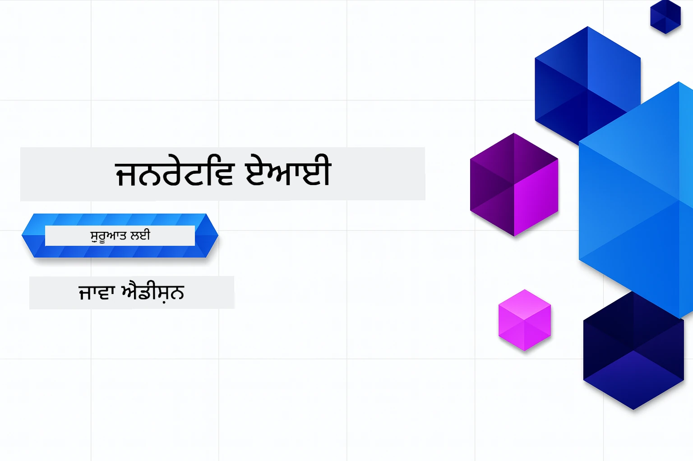

# ਸ਼ੁਰੂਆਤੀ ਲਈ ਜਨਰੇਟਿਵ AI - ਜਾਵਾ ਸੰਸਕਰਨ
[](https://discord.gg/nTYy5BXMWG)



**ਸਮਾਂ ਬਦਾਂਵਣੀ**: ਪੂਰੀ ਵਰਕਸ਼ਾਪ ਨੂੰ ਕਿਸੇ ਸਥਾਨਕ ਸੈਟਅੱਪ ਦੇ ਬਿਨਾਂ ਔਨਲਾਈਨ ਮੁਕੰਮਲ ਕੀਤਾ ਜਾ ਸਕਦਾ ਹੈ। ਵਾਤਾਵਰਣ ਸੈਟਅੱਪ ਵਿੱਚ 2 ਮਿੰਟ ਲੱਗਦੇ ਹਨ, ਅਤੇ ਸੈਂਪਲਜ਼ ਦੀ ਜਾਂਚ ਕਰਨ ਲਈ 1-3 ਘੰਟੇ ਲੱਗ ਸਕਦੇ ਹਨ ਖੋਜ ਦੀ ਗਹਿਰਾਈ 'ਤੇ ਨਿਰਭਰ ਕਰਦਾ ਹੈ।

> **ਜਲਦੀ ਸ਼ੁਰੂਆਤ**

1. ਇਸ ਰੀਪੋਜ਼ਿਟਰੀ ਨੂੰ ਆਪਣੇ GitHub ਖਾਤੇ ਵਿੱਚ Fork ਕਰੋ
2. **Code** → **Codespaces** ਟੈਬ → **...** → **New with options...** 'ਤੇ ਕਲਿਕ ਕਰੋ
3. ਡਿਸ਼ਾ-ਨਿਰਦੇਸ਼ਾਂ ਦਾ ਪਾਲਣ ਕਰੋ - ਇਹ ਇਸ ਕੋਰਸ ਲਈ ਬਣਾਇਆ ਗਿਆ ਡਿਵੈਲਪਮੈਂਟ ਕੰਟੇਨਰ ਚੁਣੇਗਾ
4. **Create codespace** 'ਤੇ ਕਲਿਕ ਕਰੋ
5. ਵਾਤਾਵਰਣ ਤਿਆਰ ਹੋਣ ਲਈ ਲਗਭਗ 2 ਮਿੰਟ ਉਡੀਕ ਕਰੋ
6. ਸਿੱਧਾ [Chapter 2: Provision Azure AI Foundry](./02-SetupDevEnvironment/README.md#step-2-provision-azure-ai-foundry) 'ਤੇ ਜਾਓ

## ਬਹੁ-ਭਾਸ਼ਾ ਸਮਰਥਨ

### GitHub Action ਰਾਹੀਂ ਸਮਰਥਿਤ (ਆਟੋਮੈਟਿਕ ਅਤੇ ਹਮੇਸ਼ਾ ਅੱਪ-ਟੂ-ਡੇਟ)

<!-- CO-OP TRANSLATOR LANGUAGES TABLE START -->
[Arabic](../ar/README.md) | [Bengali](../bn/README.md) | [Bulgarian](../bg/README.md) | [Burmese (Myanmar)](../my/README.md) | [Chinese (Simplified)](../zh-CN/README.md) | [Chinese (Traditional, Hong Kong)](../zh-HK/README.md) | [Chinese (Traditional, Macau)](../zh-MO/README.md) | [Chinese (Traditional, Taiwan)](../zh-TW/README.md) | [Croatian](../hr/README.md) | [Czech](../cs/README.md) | [Danish](../da/README.md) | [Dutch](../nl/README.md) | [Estonian](../et/README.md) | [Finnish](../fi/README.md) | [French](../fr/README.md) | [German](../de/README.md) | [Greek](../el/README.md) | [Hebrew](../he/README.md) | [Hindi](../hi/README.md) | [Hungarian](../hu/README.md) | [Indonesian](../id/README.md) | [Italian](../it/README.md) | [Japanese](../ja/README.md) | [Kannada](../kn/README.md) | [Khmer](../km/README.md) | [Korean](../ko/README.md) | [Lithuanian](../lt/README.md) | [Malay](../ms/README.md) | [Malayalam](../ml/README.md) | [Marathi](../mr/README.md) | [Nepali](../ne/README.md) | [Nigerian Pidgin](../pcm/README.md) | [Norwegian](../no/README.md) | [Persian (Farsi)](../fa/README.md) | [Polish](../pl/README.md) | [Portuguese (Brazil)](../pt-BR/README.md) | [Portuguese (Portugal)](../pt-PT/README.md) | [Punjabi (Gurmukhi)](./README.md) | [Romanian](../ro/README.md) | [Russian](../ru/README.md) | [Serbian (Cyrillic)](../sr/README.md) | [Slovak](../sk/README.md) | [Slovenian](../sl/README.md) | [Spanish](../es/README.md) | [Swahili](../sw/README.md) | [Swedish](../sv/README.md) | [Tagalog (Filipino)](../tl/README.md) | [Tamil](../ta/README.md) | [Telugu](../te/README.md) | [Thai](../th/README.md) | [Turkish](../tr/README.md) | [Ukrainian](../uk/README.md) | [Urdu](../ur/README.md) | [Vietnamese](../vi/README.md)

> **ਕੀ ਲੋ‌కਲ ਤੌਰ 'ਤੇ ਕਲੋਨ ਕਰਨਾ ਪਸੰਦ ਕਰੋਗੇ?**
>
> ਇਸ ਰੀਪੋਜ਼ਿਟਰੀ ਵਿੱਚ 50+ ਭਾਸ਼ਾ ਅਨੁਵਾਦ ਸ਼ਾਮਲ ਹਨ ਜੋ ਡਾਊਨਲੋਡ ਆਕਾਰ ਨੂੰ ਕਾਫੀ ਵਧਾਉਂਦੇ ਹਨ। ਅਨੁਵਾਦਾਂ ਦੇ ਬਿਨਾਂ ਕਲੋਨ ਕਰਨ ਲਈ sparse checkout ਵਰਤੋਂ:
>
> **ਬੈਸ਼ / macOS / ਲਿਨਕਸ:**
> ```bash
> git clone --filter=blob:none --sparse https://github.com/microsoft/Generative-AI-for-beginners-java.git
> cd Generative-AI-for-beginners-java
> git sparse-checkout set --no-cone '/*' '!translations' '!translated_images'
> ```
>
> **CMD (ਵਿੰਡੋਜ਼):**
> ```cmd
> git clone --filter=blob:none --sparse https://github.com/microsoft/Generative-AI-for-beginners-java.git
> cd Generative-AI-for-beginners-java
> git sparse-checkout set --no-cone "/*" "!translations" "!translated_images"
> ```
>
> ਇਸ ਨਾਲ ਤੁਹਾਨੂੰ ਸਾਰੇ ਜ਼ਰੂਰੀ ਚੀਜ਼ਾਂ ਮਿਲਦੀਆਂ ਹਨ ਤਾਂ ਕਿ ਤੁਸੀਂ ਕੋਰਸ ਨੂੰ ਬਹੁਤ ਤੇਜ਼ ਡਾਊਨਲੋਡ ਨਾਲ ਮੁਕੰਮਲ ਕਰ ਸਕੋ।
<!-- CO-OP TRANSLATOR LANGUAGES TABLE END -->

## ਕੋਰਸ ਸੰਰਚਨਾ ਅਤੇ ਸਿੱਖਣ ਦਾ ਰਸਤਾ

### **ਚੈਪਟਰ 1: ਜਨਰੇਟਿਵ AI ਦਾ ਪਰਿਚਯ**
- **ਮੁੱਖ ਸੰਕਲਪ**: ਵੱਡੇ ਭਾਸ਼ਾ ਮਾਡਲਾਂ, ਟੋਕਨ, ਐਂਬੈਡਿੰਗਜ਼ ਅਤੇ AI ਸਮਰੱਥਾਵਾਂ ਨੂੰ ਸਮਝਣਾ
- **ਜਾਵਾ AI ਪਰਿਬੇਸ਼**: Spring AI ਅਤੇ OpenAI SDKs ਦਾ ਸਰਵੇਖਣ
- **ਮਾਡਲ ਕੰਟੈਕਸਟ ਪ੍ਰੋਟੋਕੋਲ**: MCP ਦਾ ਪਰਿਚਯ ਅਤੇ AI ਏਜੰਟ ਸੰਚਾਰ ਵਿੱਚ ਇਸ ਦਾ ਭੂਮਿਕਾ
- **ਵੈਵਹਾਰਿਕ ਅਰਜ਼ੀਆਂ**: ਗੱਲਬਾਤ ਮਸ਼ੀਨਾਂ ਅਤੇ ਸਮੱਗਰੀ ਉਤਪਾਦਨ ਸਮੇਤ ਹਕੀਕਤੀ ਪਰਿਭਾਸ਼ਾਵਾਂ
- **[→ ਚੈਪਟਰ 1 ਸ਼ੁਰੂ ਕਰੋ](./01-IntroToGenAI/README.md)**

### **ਚੈਪਟਰ 2: ਵਿਕਾਸ ਵਾਤਾਵਰਣ ਸੈਟਅੱਪ**
- **Azure AI Foundry**: GPT-5.6 Luna ਚੈਟ ਅਤੇ text-embedding-3-small ਐਂਬੈਡਿੰਗਜ਼ Bicep ਅਤੇ Azure Developer CLI (azd) ਨਾਲ ਪ੍ਰੋਵਿਜ਼ਨ ਕਰੋ
- **Spring Boot 4.1.1 + Spring AI 2.0.1**: `ChatClient` ਨਾਲ ਸਿੱਖੋ, ਜੋ ਅਧਿਕਾਰਤ OpenAI ਜਾਵਾ SDK ਅਤੇ Azure OpenAI v1 ਦਾ ਸਮਰਥਨ ਕਰਦਾ ਹੈ
- **ਕੀਲ-ਰਹਿਤ ਪ੍ਰਮਾਣਿਕਤਾ**: Microsoft Entra ID ਨਾਲ ਸੁਰੱਖਿਅਤ ਤਰੀਕੇ ਨਾਲ ਜੁੜੋ — ਕਿਸੇ API ਕੀਜ਼ ਦੀ ਲੋੜ ਨਹੀਂ
- **ਵਿਕਾਸ ਟੂਲਜ਼**: ਡੋਕਰ ਕੰਟੇਨਰ, VS ਕੋਡ, ਅਤੇ GitHub Codespaces ਸੰਰਚਨਾ
- **[→ ਚੈਪਟਰ 2 ਸ਼ੁਰੂ ਕਰੋ](./02-SetupDevEnvironment/README.md)**

### **ਚੈਪਟਰ 3: ਮੁੱਖ ਜਨਰੇਟਿਵ AI ਤਕਨਾਲੋਜੀਆਂ**
- **ਅਧਿਕਾਰਤ OpenAI ਜਾਵਾ SDK**: ਕੀਲ-ਰਹਿਤ ਪ੍ਰਮਾਣਿਕਤਾ ਨਾਲ Azure OpenAI v1 ਨੂੰ ਸਿੱਧਾ ਕਾਲ ਕਰੋ
- **ਪ੍ਰਾਂਪਟ ਇੰਜੀਨੀਅਰਿੰਗ**: ਢੰਗ ਨਾਲ AI ਮਾਡਲ ਦੇ ਜਵਾਬ ਪ੍ਰਾਪਤ ਕਰਨ ਦੇ ਤਰੀਕੇ
- **ਐਂਬੈਡਿੰਗਜ਼ ਅਤੇ ਵੇਕਟਰ ਆਪਰੇਸ਼ਨ**: ਸਮਾਂਤਰੀ ਖੋਜ ਅਤੇ ਸਮਾਨਤਾ ਮੇਲ ਖਪਤ ਕਰੋ
- **ਰੀਟ੍ਰੀਵਲ-ਵਧਾਇਆ ਜਨਰੇਸ਼ਨ (RAG)**: AI ਨੂੰ ਆਪਣੇ ਡਾਟਾ ਸਰੋਤਾਂ ਨਾਲ ਜੋੜੋ
- **ਫੰਕਸ਼ਨ ਕਾਲਿੰਗ**: ਕਸਟਮ ਟੂਲ ਅਤੇ ਪਲੱਗਇਨ ਨਾਲ AI ਸਮਰੱਥਾਵਾਂ ਨੂੰ ਵਧਾਓ
- **[→ ਚੈਪਟਰ 3 ਸ਼ੁਰੂ ਕਰੋ](./03-CoreGenerativeAITechniques/README.md)**

### **ਚੈਪਟਰ 4: ਵੈਵਹਾਰਿਕ ਅਰਜ਼ੀਆਂ ਅਤੇ ਪ੍ਰੋਜੈਕਟ**
- **ਪਾਲਤੂ ਕਹਾਣੀ ਜਨਰੇਟਰ** (`petstory/`): Azure AI Foundry ਨਾਲ ਰਚਨਾਤਮਕ ਸਮੱਗਰੀ ਉਤਪਾਦਨ
- **Foundry Local Demo** (`foundrylocal/`): ਅਧਿਕਾਰਤ OpenAI ਜਾਵਾ SDK ਨਾਲ ਸਥਾਨਕ AI ਮਾਡਲ ਏਕੀਕਰਨ
- **MCP ਕੈਲਕੁਲੇਟਰ ਸੇਵਾ** (`calculator/`): Spring AI ਨਾਲ ਬੇਸਿਕ Model Context Protocol ਲਾਗੂਕਰਨ
- **[→ ਚੈਪਟਰ 4 ਸ਼ੁਰੂ ਕਰੋ](./04-PracticalSamples/README.md)**

### **ਚੈਪਟਰ 5: ਜ਼ਿੰਮੇਵਾਰ AI ਵਿਕਾਸ**
- **Azure AI Foundry ਸਮੱਗਰੀ ਸੁਰੱਖਿਆ**: ਬਿਲਟ-ਇਨ ਸਮੱਗਰੀ ਛਾਣਬੀਨ ਅਤੇ ਸੁਰੱਖਿਆ ਮਿਕੈਨਿਜ਼ਮ (ਕਠੋਰ ਰੋਕ ਅਤੇ ਨਰਮ ਇਨਕਾਰ)
- **ਜ਼ਿੰਮੇਵਾਰ AI ਡੈਮੋ**: ਉਦਾਹਰਣ ਜੋ ਦਿਖਾਉਂਦੀ ਹੈ ਕਿ ਆਧੁਨਿਕ AI ਸੁਰੱਖਿਆ ਪ੍ਰਣਾਲੀਆਂ ਕਿਵੇਂ ਕੰਮ ਕਰਦੀਆਂ ਹਨ
- **ਸਰਵੋਤਮ ਅਭਿਆਸ**: ਨੈਤਿਕ AI ਵਿਕਾਸ ਅਤੇ ਤੈਯਾਰੀ ਲਈ ਜ਼ਰੂਰੀ ਹਿਦਾਇਤਾਂ
- **[→ ਚੈਪਟਰ 5 ਸ਼ੁਰੂ ਕਰੋ](./05-ResponsibleGenAI/README.md)**

## ਵਾਧੂ ਸਰੋਤ

<!-- CO-OP TRANSLATOR OTHER COURSES START -->
### LangChain
[](https://aka.ms/langchain4j-for-beginners)
[](https://aka.ms/langchainjs-for-beginners?WT.mc_id=m365-94501-dwahlin)
[](https://github.com/microsoft/langchain-for-beginners?WT.mc_id=m365-94501-dwahlin)
---

### Azure / Edge / MCP / ਏਜੰਟ
[](https://github.com/microsoft/AZD-for-beginners?WT.mc_id=academic-105485-koreyst)
[](https://github.com/microsoft/edgeai-for-beginners?WT.mc_id=academic-105485-koreyst)
[](https://github.com/microsoft/mcp-for-beginners?WT.mc_id=academic-105485-koreyst)
[](https://github.com/microsoft/ai-agents-for-beginners?WT.mc_id=academic-105485-koreyst)

---
 
### ਜਨਰੇਟਿਵ AI ਸੀਰੀਜ਼
[](https://github.com/microsoft/generative-ai-for-beginners?WT.mc_id=academic-105485-koreyst)
[-9333EA?style=for-the-badge&labelColor=E5E7EB&color=9333EA)](https://github.com/microsoft/Generative-AI-for-beginners-dotnet?WT.mc_id=academic-105485-koreyst)
[-C084FC?style=for-the-badge&labelColor=E5E7EB&color=C084FC)](https://github.com/microsoft/generative-ai-for-beginners-java?WT.mc_id=academic-105485-koreyst)
[-E879F9?style=for-the-badge&labelColor=E5E7EB&color=E879F9)](https://github.com/microsoft/generative-ai-with-javascript?WT.mc_id=academic-105485-koreyst)

---
 
### ਮੁੱਖ ਸਿੱਖਿਆ
[](https://aka.ms/ml-beginners?WT.mc_id=academic-105485-koreyst)
[](https://aka.ms/datascience-beginners?WT.mc_id=academic-105485-koreyst)
[](https://aka.ms/ai-beginners?WT.mc_id=academic-105485-koreyst)
[](https://github.com/microsoft/Security-101?WT.mc_id=academic-96948-sayoung)
[](https://aka.ms/webdev-beginners?WT.mc_id=academic-105485-koreyst)
[](https://aka.ms/iot-beginners?WT.mc_id=academic-105485-koreyst)
[](https://github.com/microsoft/xr-development-for-beginners?WT.mc_id=academic-105485-koreyst)

---
 
### ਕੋਪਾਇਲਟ ਸੀਰੀਜ਼
[](https://aka.ms/GitHubCopilotAI?WT.mc_id=academic-105485-koreyst)
[](https://github.com/microsoft/mastering-github-copilot-for-dotnet-csharp-developers?WT.mc_id=academic-105485-koreyst)
[](https://github.com/microsoft/CopilotAdventures?WT.mc_id=academic-105485-koreyst)
<!-- CO-OP TRANSLATOR OTHER COURSES END -->

## ਮਦਦ ਪ੍ਰਾਪਤ ਕਰਨਾ

ਜੇ ਤੁਹਾਨੂੰ ਰੁਕਾਵਟ ਆਵੇ ਜਾਂ AI ਐਪਸ ਬਣਾਉਣ ਬਾਰੇ ਕੋਈ ਪ੍ਰਸ਼ਨ ਹੋਣ ਤਾਂ MCP ਬਾਰੇ ਚਰਚਾ ਵਿੱਚ ਸਾਥੀ ਸਿੱਖਿਆਂ ਅਤੇ ਅਨੁਭਵੀ ਵਿਕਾਸਕਾਰਾਂ ਨਾਲ ਸ਼ਾਮਿਲ ਹੋਵੋ। ਇਹ ਇੱਕ ਸਮਰਥਕ ਸਮੁਦਾਇ ਹੈ ਜਿੱਥੇ ਸਵਾਲ ਸੁਆਗਤਯੋਗ ਹਨ ਅਤੇ ਗਿਆਨ ਖੁੱਲ੍ਹਾ ਵੰਡਿਆ ਜਾਂਦਾ ਹੈ।

[](https://discord.gg/nTYy5BXMWG)

ਜੇ ਤੁਹਾਡੇ ਕੋਲ ਉਤਪਾਦ ਪ੍ਰਤੀਕਿਰਿਆ ਜਾਂ ਬਣਾਉਂਦੇ ਵਕਤ ਕਈ ਗਲਤੀਆਂ ਹਨ ਤਾਂ ਇਸ ਨੂੰ ਵੇਖੋ:

[](https://aka.ms/foundry/forum)

---

<!-- CO-OP TRANSLATOR DISCLAIMER START -->
**ਅਸਵੀਕਾਰੋਪਣ**:
ਇਸ ਦਸਤਾਵੇਜ਼ ਦਾ ਅਨੁਵਾਦ ਏਆਈ ਅਨੁਵਾਦ ਸੇਵਾ [Co-op Translator](https://github.com/Azure/co-op-translator) ਦੀ ਵਰਤੋਂ ਕਰਕੇ ਕੀਤਾ ਗਿਆ ਹੈ। ਜਦੋਂ ਕਿ ਅਸੀਂ ਸਹੀਤਾਵਾਂ ਲਈ ਯਤਨਸ਼ੀਲ ਹਾਂ, ਕਿਰਪਾ ਕਰਕੇ ਧਿਆਨ ਰੱਖੋ ਕਿ ਸਵੈਚਾਲਿਤ ਅਨੁਵਾਦਾਂ ਵਿੱਚ ਗਲਤੀਆਂ ਜਾਂ ਅਸਮੱਤਿਆਵਾਂ ਹੋ ਸਕਦੀਆਂ ਹਨ। ਮੂਲ ਦਸਤਾਵੇਜ਼ ਆਪਣੀ ਮੂਲ ਭਾਸ਼ਾ ਵਿੱਚ ਅਧਿਕਾਰਕ ਸਰੋਤ ਮੰਨਿਆ ਜਾਣਾ ਚਾਹੀਦਾ ਹੈ। ਜਰੂਰੀ ਜਾਣਕਾਰੀ ਲਈ, ਪੇਸ਼ੇਵਰ ਮਨੁੱਖੀ ਅਨੁਵਾਦ ਦੀ ਸਿਫ਼ਾਰਸ਼ ਕੀਤੀ ਜਾਂਦੀ ਹੈ। ਅਸੀਂ ਇਸ ਅਨੁਵਾਦ ਦੇ ਉਪਯੋਗ ਤੋਂ ਪੈਦਾ ਹੋਣ ਵਾਲੀਆਂ ਕਿਸੇ ਵੀ ਗਲਤਫਹਿਮੀਆਂ ਜਾਂ ਗਲਤ ਵਿਆਖਿਆਵਾਂ ਲਈ ਜਵਾਬਦੇਹ ਨਹੀਂ ਹਾਂ।
<!-- CO-OP TRANSLATOR DISCLAIMER END -->