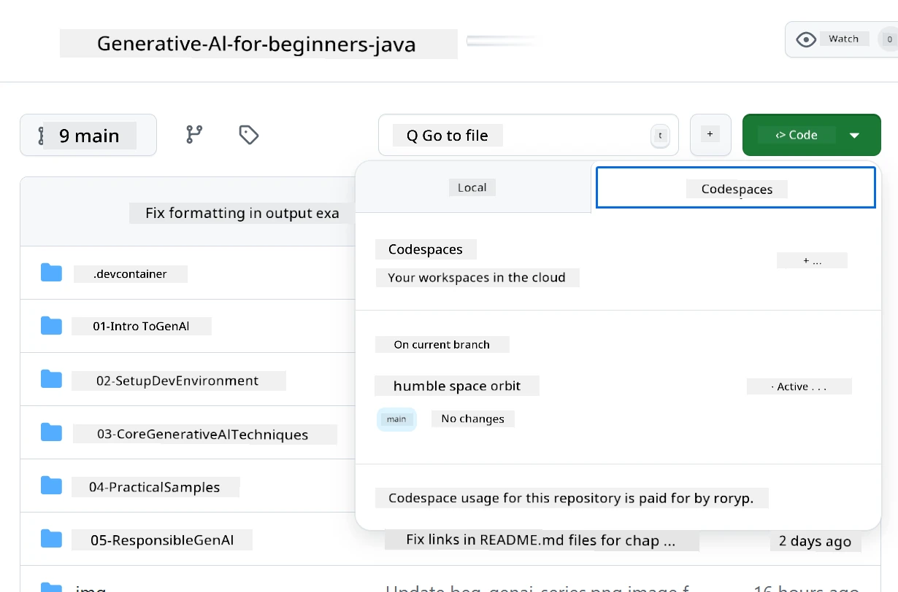
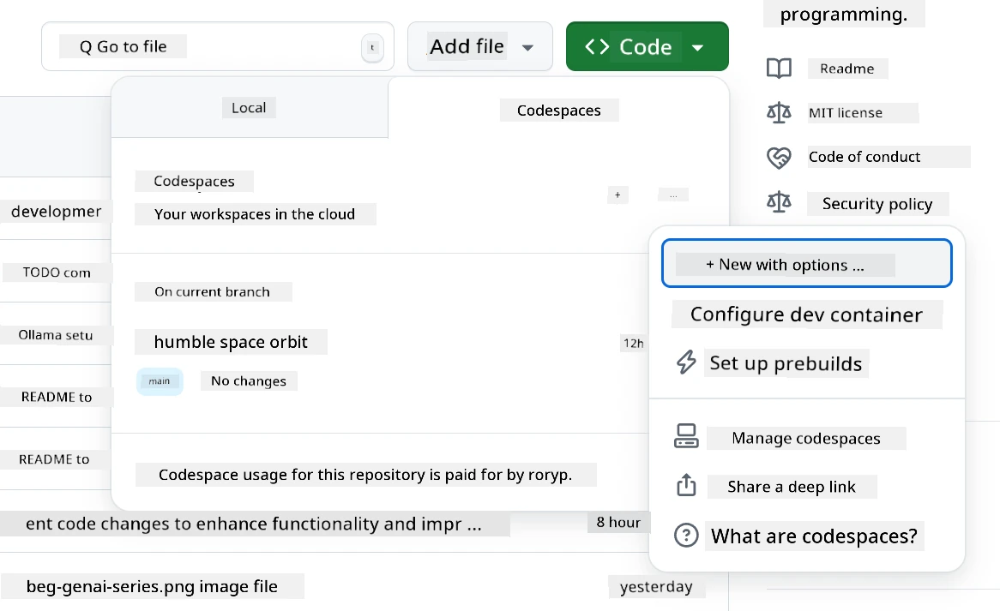
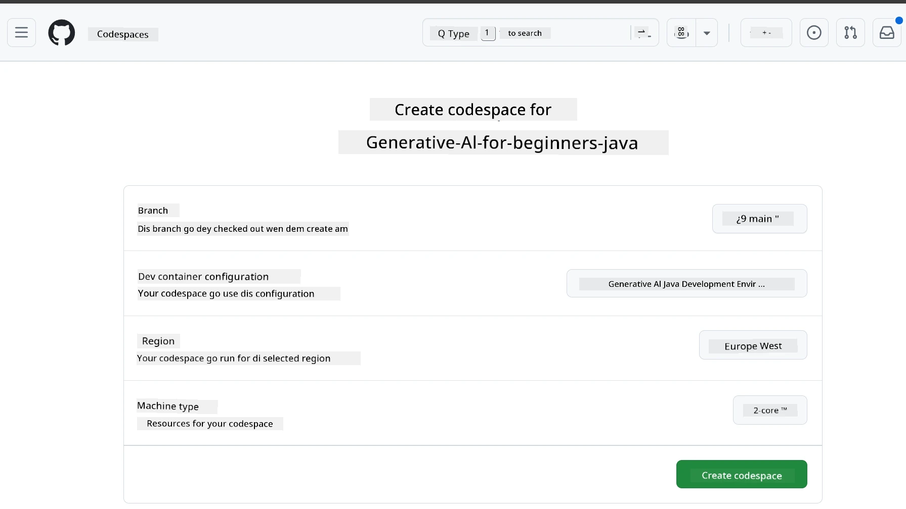
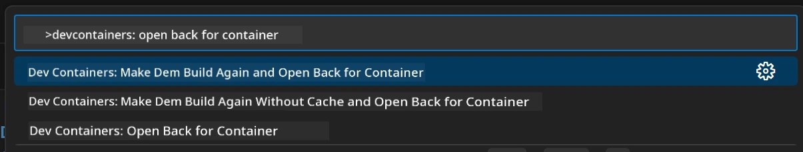
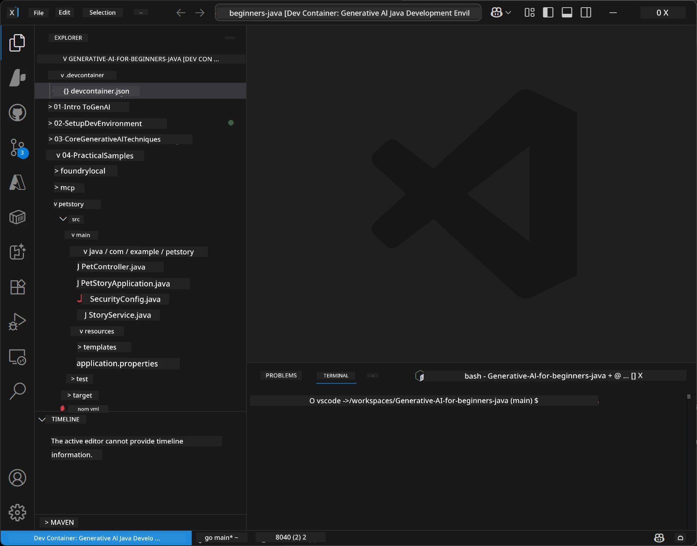
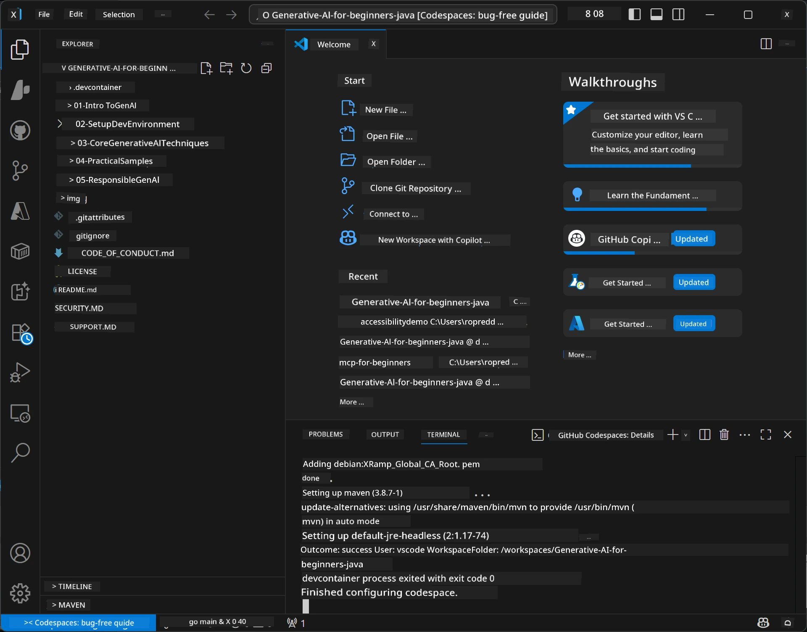

# How to Set Up Development Environment for Generative AI for Java

> **Quick Start:** Make your AI models ready on **Azure AI Foundry** as code wit Bicep + `azd` for just few minutes — check di [Azure AI Foundry Setup Guide](getting-started-azure-openai.md). Authentication no need key (Microsoft Entra ID), so no API keys for management.

## Wetin You Go Learn

- How to set up Java development environment for AI applications
- How to choose plus arrange your preferred development environment (cloud-first wit Codespaces, local dev container, or full local setup)
- Test if your setup dey work by connecting to Azure AI Foundry model

## Table of Contents

- [Wetin You Go Learn](#wetin-you-go-learn)
- [Introduction](#introduction)
- [Step 1: How to Set Up Your Development Environment](#step-1-set-up-your-development-environment)
  - [Option A: GitHub Codespaces (Recommended)](#option-a-github-codespaces-recommended)
  - [Option B: Local Dev Container](#option-b-local-dev-container)
  - [Option C: Use Your Existing Local Installation](#option-c-use-your-existing-local-installation)
- [Step 2: Provision Azure AI Foundry](#step-2-provision-azure-ai-foundry)
- [Step 3: Test Your Setup](#step-3-test-your-setup)
- [Troubleshooting](#troubleshooting)
- [Summary](#summary)
- [Next Steps](#next-steps)

## Introduction

Dis chapter go guide you on how to set up development environment. We go use **Azure AI Foundry** for all di models inside dis course. You go provision the models as code wit Bicep and Azure Developer CLI (`azd`), den connect wit **keyless authentication** (Microsoft Entra ID) — no API keys to copy or leak.

**No need to set up anything for local!** You fit use GitHub Codespaces, wey go give you full development environment for your browser, plus you fit provision Foundry from there.

We take use **Azure AI Foundry** for dis course because e:
- **E dey provision as code** — one `azd up` go set up account and model deployments
- **E no need key (Keyless)** — authenticate wit your Azure sign-in or managed identity
- **E dey ready for production** — e fit run one kind both locally and for Azure
- **E flexible** — you fit change model by just changing deployment name, no need change code

> **Note**: Azure AI Foundry deployment dey charge you per token (pay-as-you-go). Check di [Azure AI Foundry setup guide](getting-started-azure-openai.md) for provisioning, region, and cost info.


## Step 1: Set Up Your Development Environment

<a name="quick-start-cloud"></a>

We don create preconfigured development container to reduce setup time plus make sure sey you get all di tools dem wey you go need for Generative AI for Java course. Choose your preferred development way:

### Environment Setup Options:

#### Option A: GitHub Codespaces (Recommended)

**Start to dey code for 2 minutes - no need anything for local!**

1. Fork dis repository enter your GitHub account
   > **Note**: If you wan edit di basic config, abeg check di [Dev Container Configuration](../../../.devcontainer/devcontainer.json)
2. Click **Code** → **Codespaces** tab → **...** → **New with options...**
3. Use di defaults – e go choose **Dev container configuration**: **Generative AI Java Development Environment** custom devcontainer wey dem create for dis course
4. Click **Create codespace**
5. Wait about ~2 minutes for environment make e ready
6. Go next to [Step 2: Provision Azure AI Foundry](#step-2-provision-azure-ai-foundry)








> **Wetin Codespaces Go Give You**:
> - No need install anything for local
> - E go work for any device wey get browser
> - All tools plus dependencies don ready for you
> - You get 60 free hours per month if na personal account
> - Environment na same for all learners

#### Option B: Local Dev Container

**For developers wey prefer local development wit Docker**

1. Fork and clone dis repository to your local machine
   > **Note**: If you wan edit di basic config abeg check di [Dev Container Configuration](../../../.devcontainer/devcontainer.json)
2. Install [Docker Desktop](https://www.docker.com/products/docker-desktop/) and [VS Code](https://code.visualstudio.com/)
3. Install di [Dev Containers extension](https://marketplace.visualstudio.com/items?itemName=ms-vscode-remote.remote-containers) for VS Code
4. Open di repository folder for VS Code
5. When e ask, click **Reopen in Container** (or use `Ctrl+Shift+P` → "Dev Containers: Reopen in Container")
6. Wait make container build and start
7. Go next to [Step 2: Provision Azure AI Foundry](#step-2-provision-azure-ai-foundry)





#### Option C: Use Your Existing Local Installation

**For developers wey get their own Java environments before**

Wetin you go need:
- [Java 21+](https://www.oracle.com/java/technologies/javase/jdk21-archive-downloads.html) 
- [Maven 3.9+](https://maven.apache.org/download.cgi)
- [VS Code](https://code.visualstudio.com) or your preferred IDE

Steps:
1. Clone dis repository for your local machine
2. Open di project for your IDE
3. Go next to [Step 2: Provision Azure AI Foundry](#step-2-provision-azure-ai-foundry)

> **Pro Tip**: If your machine no too strong but you want VS Code for local, just use GitHub Codespaces! You fit connect your local VS Code to cloud-hosted Codespace make you get the best of both worlds.




## Step 2: Provision Azure AI Foundry

Deploy di AI models for di course to Azure AI Foundry as code. From di root of di repository:

```bash
cd 02-SetupDevEnvironment
azd auth login
az login
azd up
```

`azd` go ask for environment name, subscription, and region, e go provision Azure AI Foundry account wit `gpt-5.6-luna` plus `text-embedding-3-small` deployments, and write endpoint go inside example `.env` - all with **keyless** authentication (no API keys).

> **Full walkthrough:** Check di [Azure AI Foundry Setup Guide](getting-started-azure-openai.md) for wetin you go need before, manual portal option, region guide plus cost and cleanup info.

## Step 3: Test Your Setup

Once you don provision Foundry models, test connection wit example app wey dey [`02-SetupDevEnvironment/examples/basic-chat-azure`](../../../02-SetupDevEnvironment/examples/basic-chat-azure).

1. Open terminal for your development environment.
2. Go enter di example folder:
   ```bash
   cd 02-SetupDevEnvironment/examples/basic-chat-azure
   ```
3. Make sure say you don sign in (keyless auth need token):
   ```bash
   az login
   ```
   > If you don run `azd up`, your `.env` file with endpoint don already write.
4. Run the app:
   ```bash
   mvn clean spring-boot:run
   ```

You suppose see response from `gpt-5.6-luna` model.

### Understanding the Example Code

The [basic-chat example](./examples/basic-chat-azure/README.md) use **Spring Boot 4.1.1** plus **Spring AI 2.0.1**. Spring AI `ChatClient` dey backed by official OpenAI Java SDK, wey connect to Azure OpenAI **v1** endpoint with keyless authentication.

**Wetin dis code dey do:**
- **Connect** to Azure AI Foundry wit your Azure sign-in (Microsoft Entra ID) — no API key
- **Send** prompt to `gpt-5.6-luna` model
- **Receive** and show AI response
- **Check Say** your setup dey work well well

**Key Dependencies** (excerpt from [pom.xml](../../../02-SetupDevEnvironment/examples/basic-chat-azure/pom.xml)):
```xml
<dependency>
    <groupId>org.springframework.ai</groupId>
    <artifactId>spring-ai-starter-model-openai</artifactId>
</dependency>
<dependency>
    <groupId>com.openai</groupId>
    <artifactId>openai-java</artifactId>
</dependency>
<dependency>
    <groupId>com.azure</groupId>
    <artifactId>azure-identity</artifactId>
    <version>${azure-identity.version}</version>
</dependency>
```

Di POM dey manage OpenAI Java **4.63.1** and set Azure Identity **1.18.6** specially. Spring AI 2 comot Azure-specific starter; Azure Identity still need to fit the credential bean.

**Configuration** ([application.yml](../../../02-SetupDevEnvironment/examples/basic-chat-azure/src/main/resources/application.yml)):
```yaml
spring:
  ai:
    openai:
      base-url: ${AZURE_OPENAI_ENDPOINT}
      microsoft-foundry: true
      chat:
        model: ${AZURE_OPENAI_DEPLOYMENT:gpt-5.6-luna}
        reasoning-effort: none
        max-completion-tokens: 500
```

Keyless auth dey inside [BasicChatApplication.java](../../../02-SetupDevEnvironment/examples/basic-chat-azure/src/main/java/com/example/BasicChatApplication.java), no take API key do am. E use `DefaultAzureCredential` wit `https://ai.azure.com/.default` scope, and `OpenAIClient` targets `/openai/v1`. Di app dey supply that client to Spring AI chat model, so `OPENAI_API_KEY` global no fit pass Azure authentication.

Chat settings dey under `spring.ai.openai.chat` without `options` block. Di lesson still get Chat Completions wit `reasoning-effort: none` and 500-token cap; e no dey set `temperature` or `max-tokens`. Check di [example configuration reference](./examples/basic-chat-azure/README.md#spring-configuration) for API choice and how to call tools.

## Summary

After you finish all dis steps, you go get:

- Provisioned Azure AI Foundry models as code wit Bicep + `azd`
- Your Java development environment go dey ready (whether na Codespaces, dev containers, or local)
- You don connect to Azure AI Foundry wit keyless authentication (Microsoft Entra ID) — no API keys
- You test am with simple example wey dey talk to your model

## Next Steps

[Chapter 3: Core Generative AI Techniques](../03-CoreGenerativeAITechniques/README.md)

## Troubleshooting

Get wahala? Here na common problems and how dem fit fix am:

- **Authentication no dey work (401/403)?** 
  - Run `az login` — authentication no need key, you gats sign in
  - Check if your account get **Cognitive Services OpenAI User** role for the resource
  - If you just provision am, wait small make role assignment finish spread

- **Maven no dey found?** 
  - If na dev containers/Codespaces you dey use, Maven suppose don pre-install
  - For local setup, make sure Java 21+ and Maven 3.9+ dey installed
  - Try run `mvn --version` to check if e dey

- **`azd` no dey found or provisioning no dey work?** 
  - Install [Azure Developer CLI](https://aka.ms/azure-dev/install) and run `azd auth login`
  - Select region wey get `gpt-5.6-luna` and `text-embedding-3-small` (e.g. `eastus2`), make sure quota dey your subscription
  - Check di [Azure AI Foundry setup guide](getting-started-azure-openai.md) for more info

- **Dev container no want start?** 
  - Check if Docker Desktop dey run (for local development)
  - Try rebuild container: `Ctrl+Shift+P` → "Dev Containers: Rebuild Container"

- **Application compilation errors?**
  - Make sure say you dey correct directory: `02-SetupDevEnvironment/examples/basic-chat-azure`
  - Try run clean and build: `mvn clean compile`

> **Need help?**: Still get issue? Open issue for repository and we go help you.

---

<!-- CO-OP TRANSLATOR DISCLAIMER START -->
**Disclaimer**:
Dis document don translate wit AI translation service [Co-op Translator](https://github.com/Azure/co-op-translator). Even tho we dey try make am correct, abeg make you know say automated translation fit get errors or mistakes. Di original document for dia own language na im be di correct source. For important info, make person wey sabi human translation do am. We no go responsible for any misunderstanding or wrong understanding wey fit happen because of dis translation.
<!-- CO-OP TRANSLATOR DISCLAIMER END -->