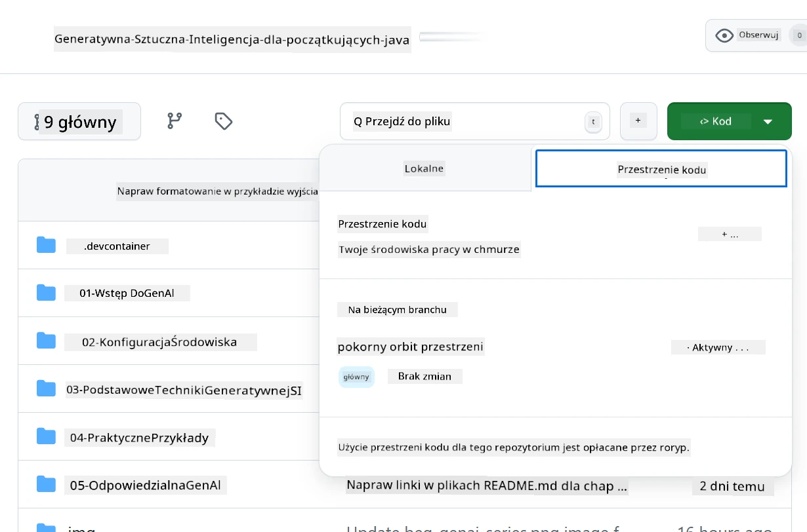
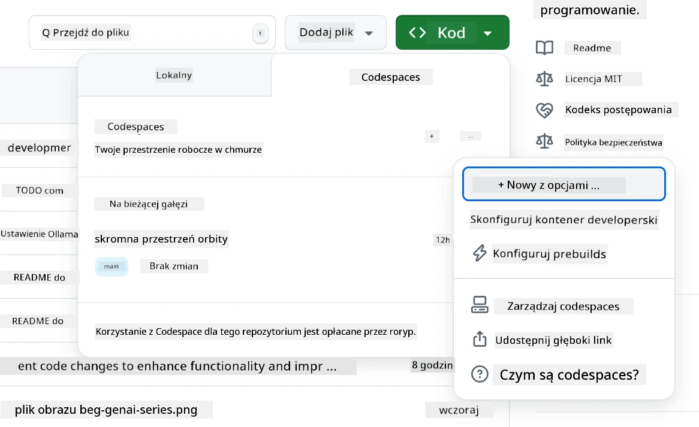
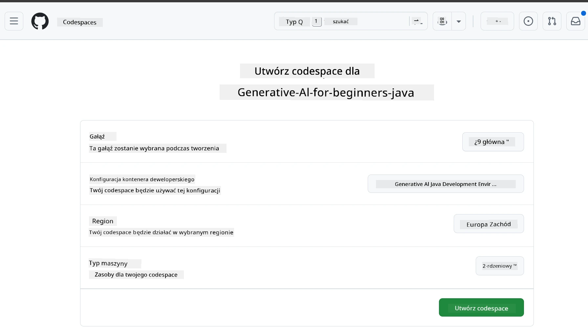
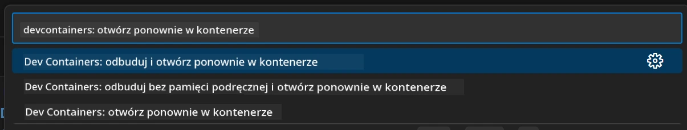
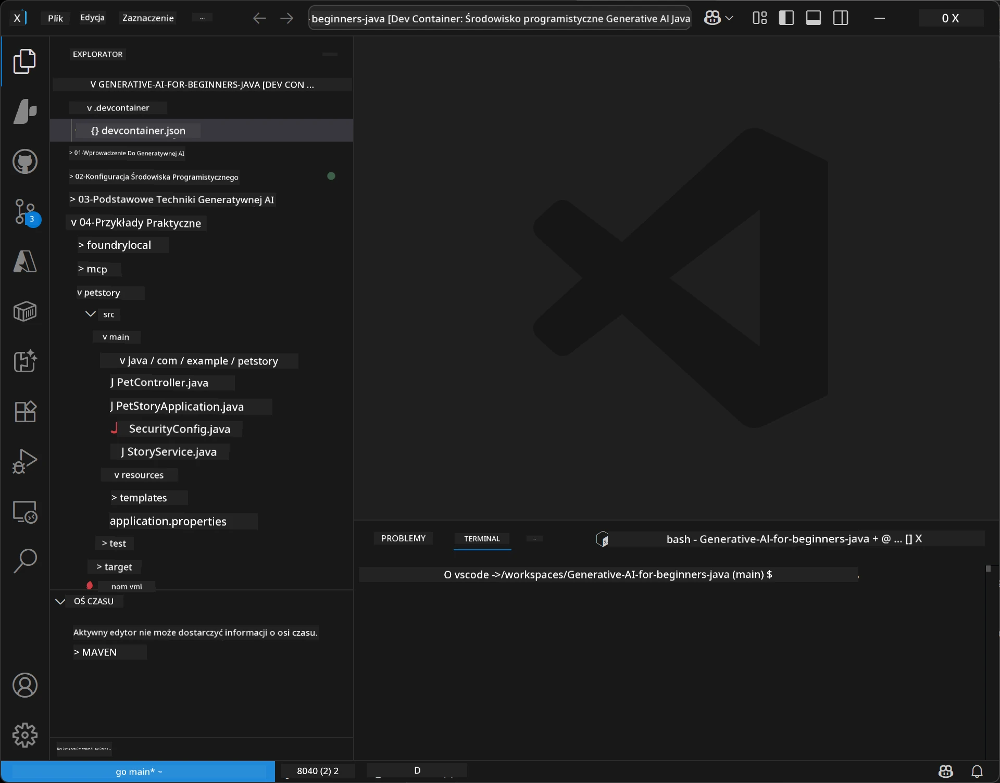
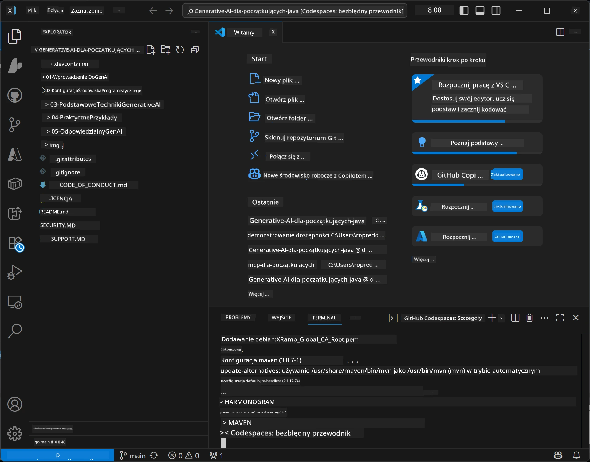

# Konfiguracja środowiska programistycznego dla Generative AI dla Javy

> **Szybki start:** Uruchom swoje modele AI na **Azure AI Foundry** jako kod za pomocą Bicep + `azd` w kilka minut — zobacz [Przewodnik konfiguracji Azure AI Foundry](getting-started-azure-openai.md). Uwierzytelnianie jest **bezkluczowe** (Microsoft Entra ID), więc nie trzeba zarządzać kluczami API.

## Czego się nauczysz

- Skonfigurujesz środowisko programistyczne Java do aplikacji AI
- Wybierzesz i skonfigurujesz preferowane środowisko programistyczne (cloud-first z Codespaces, lokalny kontener deweloperski lub pełna lokalna konfiguracja)
- Przetestujesz konfigurację, łącząc się z modelem Azure AI Foundry

## Spis treści

- [Czego się nauczysz](#czego-się-nauczysz)
- [Wprowadzenie](#wprowadzenie)
- [Krok 1: Skonfiguruj środowisko programistyczne](#krok-1-skonfiguruj-środowisko-programistyczne)
  - [Opcja A: GitHub Codespaces (zalecane)](#opcja-a-github-codespaces-zalecane)
  - [Opcja B: Lokalny kontener deweloperski](#opcja-b-lokalny-kontener-deweloperski)
  - [Opcja C: Użyj istniejącej lokalnej instalacji](#opcja-c-użyj-istniejącej-lokalnej-instalacji)
- [Krok 2: Uruchom Azure AI Foundry](#krok-2-uruchom-azure-ai-foundry)
- [Krok 3: Przetestuj konfigurację](#krok-3-przetestuj-konfigurację)
- [Rozwiązywanie problemów](#rozwiązywanie-problemów)
- [Podsumowanie](#podsumowanie)
- [Następne kroki](#następne-kroki)

## Wprowadzenie

Ta część przeprowadzi Cię przez konfigurację środowiska programistycznego. Będziemy używać **Azure AI Foundry** dla modeli przez cały kurs. Modele uruchamiasz jako kod za pomocą Bicep i Azure Developer CLI (`azd`), a następnie łączysz się z **uwierzytelnianiem bezkluczowym** (Microsoft Entra ID) — bez kopiowania czy wycieków kluczy API.

**Nie potrzebujesz lokalnej konfiguracji!** Możesz użyć GitHub Codespaces, który zapewnia pełne środowisko programistyczne w przeglądarce i uruchomić Foundry stamtąd.

Używamy **Azure AI Foundry** w tym kursie, ponieważ jest to:
- **Uruchamiane jako kod** — jedno `azd up` wdraża konto i wdrożenia modeli
- **Bezkluczowe** — logowanie przy pomocy konta Azure lub zarządzanej tożsamości
- **Gotowe do produkcji** — ten sam kod działa lokalnie i w Azure
- **Elastyczne** — wymiana modeli przez zmianę nazwy wdrożenia, bez zmiany kodu

> **Uwaga**: Wdrożenia Azure AI Foundry są rozliczane per token (płać za faktyczne użycie). Zobacz [Przewodnik konfiguracji Azure AI Foundry](getting-started-azure-openai.md) aby poznać szczegóły odnośnie uruchamiania, regionu i kosztów.


## Krok 1: Skonfiguruj środowisko programistyczne

<a name="quick-start-cloud"></a>

Przygotowaliśmy wstępnie skonfigurowany kontener programistyczny, aby zminimalizować czas konfiguracji i zapewnić dostęp do wszystkich potrzebnych narzędzi do tego kursu Generative AI dla Javy. Wybierz preferowany sposób pracy:

### Opcje konfiguracji środowiska:

#### Opcja A: GitHub Codespaces (zalecane)

**Zacznij kodować w 2 minuty – bez konieczności lokalnej konfiguracji!**

1. Sforkuj to repozytorium na swoje konto GitHub
   > **Uwaga**: Jeśli chcesz edytować podstawową konfigurację, zobacz [Konfigurację kontenera deweloperskiego](../../../.devcontainer/devcontainer.json)
2. Kliknij **Code** → zakładka **Codespaces** → **...** → **New with options...**
3. Użyj ustawień domyślnych – wybierze to **Konfigurację kontenera deweloperskiego**: **Generative AI Java Development Environment**, specjalnie przygotowany kontener dla tego kursu
4. Kliknij **Create codespace**
5. Poczekaj około 2 minuty, aż środowisko będzie gotowe
6. Przejdź do [Kroku 2: Uruchom Azure AI Foundry](#krok-2-uruchom-azure-ai-foundry)








> **Zalety Codespaces**:
> - Brak potrzeby lokalnej instalacji
> - Działa na dowolnym urządzeniu z przeglądarką
> - Wstępnie skonfigurowane z wszystkimi narzędziami i zależnościami
> - Bezpłatne 60 godzin miesięcznie dla kont osobistych
> - Spójne środowisko dla wszystkich uczących się

#### Opcja B: Lokalny kontener deweloperski

**Dla programistów preferujących lokalny rozwój z Dockerem**

1. Sforkuj i sklonuj to repozytorium na swój komputer lokalny
   > **Uwaga**: Jeśli chcesz edytować podstawową konfigurację, zobacz [Konfigurację kontenera deweloperskiego](../../../.devcontainer/devcontainer.json)
2. Zainstaluj [Docker Desktop](https://www.docker.com/products/docker-desktop/) oraz [VS Code](https://code.visualstudio.com/)
3. Zainstaluj rozszerzenie [Dev Containers](https://marketplace.visualstudio.com/items?itemName=ms-vscode-remote.remote-containers) w VS Code
4. Otwórz folder repozytorium w VS Code
5. Gdy pojawi się monit, kliknij **Reopen in Container** (lub użyj `Ctrl+Shift+P` → "Dev Containers: Reopen in Container")
6. Poczekaj, aż kontener się zbuduje i uruchomi
7. Przejdź do [Kroku 2: Uruchom Azure AI Foundry](#krok-2-uruchom-azure-ai-foundry)





#### Opcja C: Użyj istniejącej lokalnej instalacji

**Dla programistów z gotowym środowiskiem Java**

Wymagania wstępne:
- [Java 21+](https://www.oracle.com/java/technologies/javase/jdk21-archive-downloads.html) 
- [Maven 3.9+](https://maven.apache.org/download.cgi)
- [VS Code](https://code.visualstudio.com) lub wybrane IDE

Kroki:
1. Sklonuj to repozytorium na swój komputer
2. Otwórz projekt w swoim IDE
3. Przejdź do [Kroku 2: Uruchom Azure AI Foundry](#krok-2-uruchom-azure-ai-foundry)

> **Profesjonalna wskazówka**: Masz komputer o niskich parametrach, ale chcesz VS Code lokalnie? Użyj GitHub Codespaces! Możesz połączyć lokalny VS Code z hostowanym w chmurze Codespace, dzięki czemu masz najlepsze z obu światów.




## Krok 2: Uruchom Azure AI Foundry

Wdróż modele AI kursu do Azure AI Foundry jako kod. W katalogu głównym repozytorium:

```bash
cd 02-SetupDevEnvironment
azd auth login
az login
azd up
```

`azd` poprosi o nazwę środowiska, subskrypcję i region, uruchomi konto Azure AI Foundry z wdrożeniami `gpt-5.6-luna` i `text-embedding-3-small`, oraz zapisze punkt końcowy w pliku `.env` przykładu – wszystko z **uwierzytelnianiem bezkluczowym** (bez kluczy API).

> **Pełny przewodnik:** Zobacz [Przewodnik konfiguracji Azure AI Foundry](getting-started-azure-openai.md) dla wymagań wstępnych, alternatywy manualnej (portal), wskazówek do regionu oraz uwag o kosztach i sprzątaniu.

## Krok 3: Przetestuj konfigurację

Po uruchomieniu modeli Foundry przetestuj połączenie, korzystając z przykładowej aplikacji w [`02-SetupDevEnvironment/examples/basic-chat-azure`](../../../02-SetupDevEnvironment/examples/basic-chat-azure).

1. Otwórz terminal w środowisku programistycznym.
2. Przejdź do przykładu:
   ```bash
   cd 02-SetupDevEnvironment/examples/basic-chat-azure
   ```
3. Upewnij się, że jesteś zalogowany (uwierzytelnianie bezkluczowe wymaga tokenu):
   ```bash
   az login
   ```
   > Jeśli uruchomiłeś `azd up`, plik `.env` z Twoim punktem końcowym jest już przygotowany.
4. Uruchom aplikację:
   ```bash
   mvn clean spring-boot:run
   ```

Powinieneś zobaczyć odpowiedź z modelu `gpt-5.6-luna`.

### Zrozumienie przykładowego kodu

Przykład [basic-chat](./examples/basic-chat-azure/README.md) używa **Spring Boot 4.1.1** i **Spring AI 2.0.1**. `ChatClient` Spring AI opiera się na oficjalnym OpenAI Java SDK, łączącym się z punktem końcowym Azure OpenAI **v1** z uwierzytelnianiem bezkluczowym.

**Co robi ten kod:**
- **Łączy się** z Azure AI Foundry przy pomocy logowania Azure (Microsoft Entra ID) — bez klucza API
- **Wysyła** zapytanie do modelu `gpt-5.6-luna`
- **Odbiera** i pokazuje odpowiedź AI
- **Weryfikuje**, że konfiguracja działa poprawnie

**Kluczowe zależności** (fragment z [pom.xml](../../../02-SetupDevEnvironment/examples/basic-chat-azure/pom.xml)):
```xml
<dependency>
    <groupId>org.springframework.ai</groupId>
    <artifactId>spring-ai-starter-model-openai</artifactId>
</dependency>
<dependency>
    <groupId>com.openai</groupId>
    <artifactId>openai-java</artifactId>
</dependency>
<dependency>
    <groupId>com.azure</groupId>
    <artifactId>azure-identity</artifactId>
    <version>${azure-identity.version}</version>
</dependency>
```

POM zarządza OpenAI Java **4.63.1** i explicitnie ustawia Azure Identity **1.18.6**. Spring AI 2 usunęło starter Azure; Azure Identity jest nadal potrzebne do beana uwierzytelnienia.

**Konfiguracja** ([application.yml](../../../02-SetupDevEnvironment/examples/basic-chat-azure/src/main/resources/application.yml)):
```yaml
spring:
  ai:
    openai:
      base-url: ${AZURE_OPENAI_ENDPOINT}
      microsoft-foundry: true
      chat:
        model: ${AZURE_OPENAI_DEPLOYMENT:gpt-5.6-luna}
        reasoning-effort: none
        max-completion-tokens: 500
```

Uwierzytelnianie bezkluczowe jest explicitnie skonfigurowane w [BasicChatApplication.java](../../../02-SetupDevEnvironment/examples/basic-chat-azure/src/main/java/com/example/BasicChatApplication.java), a nie wywnioskowane z braku klucza API. Credential typu bearer używa `DefaultAzureCredential` ze zakresem `https://ai.azure.com/.default`, a `OpenAIClient` kieruje się na `/openai/v1`. Aplikacja dostarcza tego klienta do modelu chat Spring AI, więc globalny `OPENAI_API_KEY` nie nadpisze uwierzytelnienia Azure.

Ustawienia chatu są bezpośrednio pod `spring.ai.openai.chat`, bez bloku `options`. Lekcja zachowuje Chat Completions z `reasoning-effort: none` i limitem 500 tokenów; nie ustawia `temperature` ani `max-tokens`. Zobacz [odniesienie konfiguracji przykładu](./examples/basic-chat-azure/README.md#spring-configuration) dla wyboru API i wskazówek dotyczących wywoływania narzędzi.

## Podsumowanie

Po wykonaniu powyższych kroków uzyskasz:

- Uruchomione modele Azure AI Foundry jako kod z Bicep + `azd`
- Środowisko programistyczne Java działające (czy to Codespaces, kontenery deweloperskie, czy lokalnie)
- Połączenie z Azure AI Foundry z uwierzytelnianiem bezkluczowym (Microsoft Entra ID) — bez kluczy API
- Przetestowane działanie na prostym przykładzie komunikującym się z Twoim modelem

## Następne kroki

[Rozdział 3: Podstawowe techniki Generative AI](../03-CoreGenerativeAITechniques/README.md)

## Rozwiązywanie problemów

Masz problemy? Oto typowe problemy i rozwiązania:

- **Nieudane uwierzytelnienie (401/403)?** 
  - Uruchom `az login` — uwierzytelnianie jest bezkluczowe, więc musisz być zalogowany
  - Sprawdź, czy Twoje konto ma rolę **Cognitive Services OpenAI User** na zasobie
  - Jeśli właśnie wdrożyłeś, poczekaj chwilę na propagację przypisania roli

- **Nie znaleziono Mavena?** 
  - Jeśli korzystasz z kontenerów/Codespaces, Maven powinien być zainstalowany domyślnie
  - W przypadku lokalnej konfiguracji upewnij się, że masz Java 21+ i Maven 3.9+
  - Spróbuj `mvn --version`, aby zweryfikować instalację

- **Nie znaleziono `azd` lub błędy uruchamiania?** 
  - Zainstaluj [Azure Developer CLI](https://aka.ms/azure-dev/install) i uruchom `azd auth login`
  - Wybierz region, gdzie dostępne są `gpt-5.6-luna` i `text-embedding-3-small` (np. `eastus2`), z odpowiednim limitem w subskrypcji
  - Zobacz [przewodnik konfiguracji Azure AI Foundry](getting-started-azure-openai.md) dla szczegółów

- **Kontener deweloperski się nie uruchamia?** 
  - Upewnij się, że Docker Desktop jest uruchomiony (dla lokalnego środowiska)
  - Spróbuj przebudować kontener: `Ctrl+Shift+P` → "Dev Containers: Rebuild Container"

- **Błędy kompilacji aplikacji?**
  - Upewnij się, że jesteś w poprawnym katalogu: `02-SetupDevEnvironment/examples/basic-chat-azure`
  - Spróbuj wyczyścić i przebudować: `mvn clean compile`

> **Potrzebujesz pomocy?**: Wciąż masz problemy? Otwórz issue w repozytorium, a pomożemy.

---

<!-- CO-OP TRANSLATOR DISCLAIMER START -->
**Zastrzeżenie**:
Niniejszy dokument został przetłumaczony za pomocą usługi tłumaczenia AI [Co-op Translator](https://github.com/Azure/co-op-translator). Choć dążymy do dokładności, prosimy pamiętać, że automatyczne tłumaczenia mogą zawierać błędy lub niedokładności. Oryginalny dokument w jego języku źródłowym należy uznawać za autorytatywne źródło. W przypadku informacji krytycznych zalecane jest skorzystanie z profesjonalnego tłumaczenia wykonanego przez człowieka. Nie ponosimy odpowiedzialności za jakiekolwiek nieporozumienia lub błędne interpretacje wynikające z użycia tego tłumaczenia.
<!-- CO-OP TRANSLATOR DISCLAIMER END -->